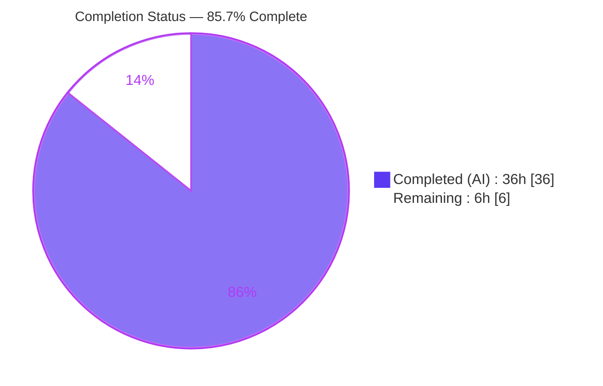
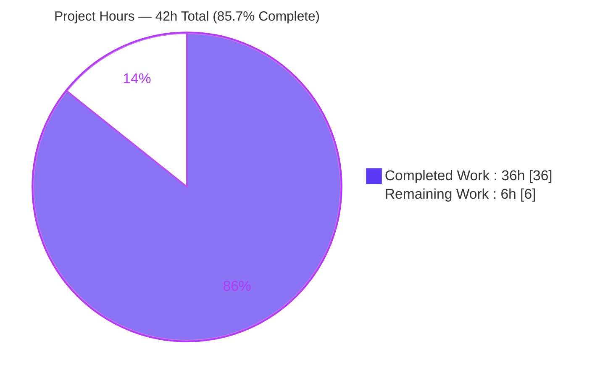
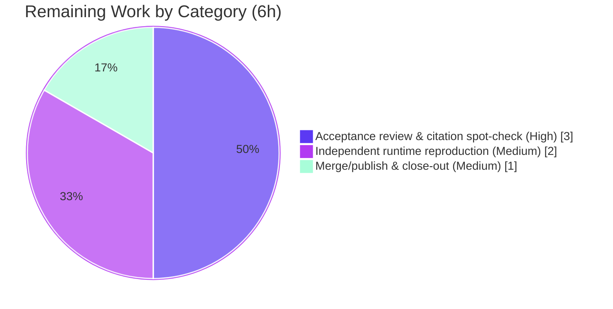

# Blitzy Project Guide — Paperless-ngx Document Ingestion Runtime Investigation

> **Deliverable:** `blitzy/documentation/paperless-ngx_542221a38dff.md` (2,164 lines / ~13,942 words)
> **Task type:** Read-only investigative QnA / documentation (SWE-AtlasQnA-Repo rule set)
> **Branch:** `blitzy-133eb686-f246-4051-af41-7893d51b0893` · **HEAD:** `123b54c79` · **Investigation commit:** `542221a38dff`

---

## 1. Executive Summary

### 1.1 Project Overview

This project delivers a single, evidence-backed investigative document that traces — from directly observed runtime behavior — how Paperless-ngx ingests a document from consumption-directory detection through full-text indexing, and identifies the code components and queuing framework responsible for each stage. The audience is engineers and maintainers who need an authoritative, citation-grounded walkthrough of the directory-watcher ingestion pipeline at commit `542221a38dff` (a Django-Q 1.3.9 era release, pre-Celery). It is a read-only QnA task: the only repository change is one new Markdown file; no application source, configuration, tests, or dependencies were modified. Business value is knowledge capture — a reusable, verifiable reference for onboarding, debugging, and architectural understanding of the ingestion path.

### 1.2 Completion Status

The project is **85.7% complete**. All autonomous investigation work (requirements R1–R7, the full 2,164-line answer document, and five QA/validation cycles) is delivered and validated end-to-end against the live runtime. The remaining 6 hours are standard documentation path-to-production: human technical acceptance review, optional independent reproduction of the timing-sensitive runtime evidence, and merge/publish.



| Metric | Hours |
|--------|-------|
| **Total Hours** | **42** |
| Completed Hours (AI) | 36 |
| Completed Hours (Manual) | 0 |
| **Completed Hours (AI + Manual)** | **36** |
| **Remaining Hours** | **6** |
| **Percent Complete** | **85.7%** |

> Completion is measured strictly against AAP-scoped work plus documentation path-to-production, using the hours-based formula: `36 / (36 + 6) = 85.7%`. Legend: **Dark Blue `#5B39F3` = Completed (AI)**, **White `#FFFFFF` = Remaining**.

### 1.3 Key Accomplishments

- ✅ **All 7 requirements (R1–R7) answered** with verbatim runtime evidence — environment bring-up, file ingestion, detection/task observation, broker payload, database inspection, codepath trace, and read-only compliance.
- ✅ **Queuing framework definitively identified** as **Django-Q 1.3.9** (not Celery), with version evidence and the explicit Celery-migration boundary at Paperless-ngx v1.10.0.
- ✅ **Broker payload captured in its queued state** — the worker was stopped by PID, the raw byte-exact Redis value was read from list `django_q:paperless:q`, and it was decoded via Django-Q's own `SignedPackage.loads` to reveal the pickled (protocol 5), HMAC-signed task dict `{id, name, func, args, kwargs, started}`.
- ✅ **Database records and processing history verified** — all 10 `documents_document` rows, metadata-field-to-model mapping, the `created`-date precedence chain (proven with dedicated mtime/filename probes), the `django_q_task` history table, and the Whoosh full-text index.
- ✅ **Annotated end-to-end codepath** from inotify detection → `_consume()` → `async_task(...)` → Redis → `qcluster` → `consume_file` → `try_consume_file` with 118+ `file:line` citations.
- ✅ **Validated end-to-end in the canonical Docker image** (Python 3.9.23, Debian 11, commit `542221a38dff`) — 100% of observable claims cross-checked against the live runtime; only 2 minor citation discrepancies found and corrected.
- ✅ **Read-only integrity preserved (R7)** — git working tree clean, exactly one file added (`+2,164/-0`), zero source files modified, all temporary scripts removed.
- ✅ **Honest observed-vs-inferred labeling** — 40 `[observed]` and 11 `[inferred]` load-bearing claims classified in a complete §10.1 table.

### 1.4 Critical Unresolved Issues

| Issue | Impact | Owner | ETA |
|-------|--------|-------|-----|
| _None identified_ | The deliverable was validated end-to-end (100% claim verification); no unresolved defects, no failing gates, no read-only violations. | — | — |

### 1.5 Access Issues

| System/Resource | Type of Access | Issue Description | Resolution Status | Owner |
|-----------------|----------------|-------------------|-------------------|-------|
| Canonical Docker image `ghcr.io/scaleapi/swe-atlas:…qna_1.01` | Container registry pull | Faithful reproduction of the runtime evidence requires this image (Python 3.9 + Redis + OCR binaries), because the default authoring sandbox lacks Python 3.9, `redis-server`, and OCR tooling. | **Resolved** — the Blitzy validator successfully pulled and ran the image; validation was not blocked. Human reproduction (task M1) needs the same pull access. | Reviewer / DevOps |
| Runtime OS packages (`redis-server`, `libzbar0`, `poppler-utils`, `procps`, `curl`) | Package install in container | The base image omits a few OS packages the pipeline needs at runtime. | **Resolved** — installed once as ephemeral container packages (not repo changes); exact list documented in the deliverable §1.1 / §10.2. | Reviewer / DevOps |

### 1.6 Recommended Next Steps

1. **[High]** Perform the technical acceptance review of the full 2,164-line answer document — confirm all seven requirements (R1–R7) are answered, the narrative is coherent, and the Django-Q 1.3.9 conclusion is sound. *(~1.5h)*
2. **[High]** Spot-check a sample of the 118+ `file:line` citations against source at commit `542221a38dff` and the key `[observed]` evidence blocks (broker decode §4.4, DB rows §6.1). *(~1.5h)*
3. **[Medium]** Optionally reproduce the timing-sensitive runtime evidence (broker payload + `documents_document` row) inside the canonical Docker image to build independent confidence. *(~2h)*
4. **[Medium]** Merge/publish the document to its destination and close out the branch. *(~1h)*
5. **[Low]** *(Optional, out of scope)* Render the document to PDF/HTML and/or add a non-technical TL;DR for wider stakeholder distribution. *(0h — not required)*

---

## 2. Project Hours Breakdown

### 2.1 Completed Work Detail

All completed work is autonomous (AI). Each component traces to a specific AAP requirement or the deliverable-production/validation activity.

| Component | Hours | Description |
|-----------|-------|-------------|
| R1 — Canonical environment bring-up & service verification | 4 | Pull/run the canonical Docker image; install runtime OS packages; start Redis; run migrations, reindex, superuser; launch gunicorn + `document_consumer` + `qcluster` with PID capture and HTTP health checks; capture image digest, versions, commit, and live Django settings (§1). |
| R2 & R3a — Test-file ingestion & detection-log capture | 2 | Drop a small text probe into `CONSUMPTION_DIR`; capture the watcher `"Adding … to the task queue."` log line; confirm stability across ≥2 unchanged runs (§2). |
| R3b & R3c — Triggered task + downstream task/signal observation | 3 | Identify the triggered task `documents.tasks.consume_file`; observe the downstream parse → classify → index pipeline and the `document_consumption_finished` signal receivers; enumerate scheduled maintenance tasks via `Schedule.objects` (§3, §5). |
| R4 — Broker payload capture, decode & serialization proof | 5 | Stop the worker by captured PID at the right moment; read byte-exact raw values from Redis list `django_q:paperless:q`; decode via `SignedPackage.loads` to the task dict; prove pickle protocol 5 + HMAC via `pickletools`; confirm cross-run stability and drain-on-restart (§4). |
| R5 — Database record & processing-history inspection | 4 | Read-only `SELECT`/`PRAGMA` against SQLite: all 10 `documents_document` rows, metadata-field-to-`models.py` mapping, `created`-date precedence proven with mtime/filename probes, `django_q_task` history (19 rows), absence of `PaperlessTask`, empty `documents_log`, and Whoosh index state (§6). |
| R6 — Codepath trace & Django-Q framework identification | 5 | Trace detection → `async_task` → dispatch → execution across both detection branches (inotify canonical / polling alternate); annotated diagram + component-to-responsibility table; identify Django-Q 1.3.9 with version evidence and the Celery-from-v1.10.0 boundary (web research corroboration) (§7, §8). |
| R7 & Methodology — Read-only integrity, cleanup & observed-vs-inferred labeling | 2 | Keep helper scripts outside the checkout; clean up all scratch artifacts; prove `git status --porcelain` empty; author the complete observed-vs-inferred labeling table for every load-bearing claim (§10). |
| Deliverable authoring & assembly | 6 | Compose the 2,164-line / 13,942-word Markdown document: section structure (§0–§10), 2 Mermaid diagrams, evidence tables, embedded verbatim command output, and consistent formatting. |
| QA & runtime validation cycles | 5 | Five iterative QA correction cycles plus final-validator claim-verification of ~90+ observable claims against the live runtime, including the two §5.2 citation corrections. |
| **Total** | **36** | |

### 2.2 Remaining Work Detail

All remaining work is human-only documentation path-to-production. No AAP requirement is incomplete; there are no fix/remediation tasks.

| Category | Hours | Priority |
|----------|-------|----------|
| Documentation acceptance review & citation spot-check | 3 | High |
| Independent runtime reproduction of key values (broker payload + DB row) | 2 | Medium |
| Merge/publish document & branch close-out | 1 | Medium |
| **Total** | **6** | |

### 2.3 Hours Reconciliation

| Check | Result |
|-------|--------|
| Section 2.1 (Completed) | 36h |
| Section 2.2 (Remaining) | 6h |
| Section 2.1 + Section 2.2 | **42h = Total (Section 1.2)** ✓ |
| Completion % = 36 / 42 | **85.7%** ✓ |
| Remaining hours consistent across §1.2, §2.2, §7 | **6h everywhere** ✓ |

---

## 3. Test Results

For a read-only documentation deliverable, the equivalent of "tests" is the Blitzy autonomous validator's verification of every observable claim against the live runtime, supplemented by the repository regression suite (run to confirm environment health) and structural/quality gates. All results below originate from Blitzy's autonomous validation logs for this project, plus an independent citation spot-check performed during this assessment.

| Test Category | Framework | Total Tests | Passed | Failed | Coverage % | Notes |
|---------------|-----------|-------------|--------|--------|------------|-------|
| Document claim verification | Blitzy runtime cross-check (manual, in canonical image) | ~90+ observable claims | ~90+ (100%) | 0 | 100% | Every observable claim verified against live runtime: R1 config, ~90+ citations, R2/R3 detection+downstream, R4 broker payload, R5 DB+history+index, R6 codepath, §8 framework, §9 edge conditions. |
| Repository regression suite | pytest | 483 | 481 | 0 | n/a | 2 skipped — require optional `poppler-utils`/`libzbar0` binaries (environment notes, not failures). Run by the validator to confirm the canonical stack is healthy; the deliverable does not depend on these tests. |
| End-to-end pipeline exercise | Live ingestion (canonical entry point) | 1 flow (×10 probes) | Pass | 0 | n/a | File drop → detection → `async_task` → Redis payload → `qcluster` → `consume_file` → `try_consume_file` → `documents_document` row → `document_consumption_finished` → Whoosh index. |
| Markdown structure & quality gates | grep / wc | 4 | 4 | 0 | n/a | 146 balanced code fences, 0 CRLF (LF only), 0 trailing-whitespace lines, 2 well-formed Mermaid blocks. |
| Citation spot-check (independent, this assessment) | git / sed byte-compare | 6 sampled | 6 | 0 | n/a | Each sampled `file:line` resolves exactly to the claimed symbol (see §5 Compliance and §9 Development Guide). |
| Read-only integrity | git status / git diff | 2 | 2 | 0 | n/a | Only the doc added (`+2,164/-0`); working tree clean; 0 source files modified vs. base. |

> **Integrity note:** All tests above originate from Blitzy's autonomous validation logs for this project (claim verification, pytest, pipeline exercise, quality gates, read-only checks). The 6-item citation spot-check was additionally reproduced during this assessment and confirmed accurate.

---

## 4. Runtime Validation & UI Verification

**Runtime validation (canonical Docker image — Python 3.9.23, Debian 11, commit `542221a38dff`):**

- ✅ **Operational** — Canonical service stack: `gunicorn` (ASGI web, HTTP 302 on `/`, token endpoint 200), `document_consumer` (inotify watcher), `qcluster` (Django-Q worker), Redis broker (`PONG`), SQLite database (migrated).
- ✅ **Operational** — Detection: inotify banner captured in default config (`CONSUMER_POLLING=0`); polling banner captured for the alternate branch.
- ✅ **Operational** — Task dispatch: `"Adding … to the task queue."` emitted immediately before `async_task("documents.tasks.consume_file", …)`.
- ✅ **Operational** — Broker: queued task observed in Redis list `django_q:paperless:q` (`LLEN` 0→1→2 with worker stopped; drains 2→0 on restart); decoded to the pickled + HMAC-signed Django-Q task dict.
- ✅ **Operational** — Worker execution: progress transitions STARTING → PARSING_DOCUMENT → GENERATING_THUMBNAIL → PARSE_DATE → SAVE → SUCCESS captured from the channel layer.
- ✅ **Operational** — Persistence: `documents_document` rows created; `django_q_task` history written; `django_admin_log` entries via `set_log_entry`; Whoosh index updated (searchable by content).
- ✅ **Operational** — Edge conditions: ignored-pattern, unsupported-extension, busy-file, and duplicate rejections all reproduced live.

**UI verification:**

- ⚠ **Not applicable / out of scope** — This is a backend runtime-tracing investigation. The Angular frontend (`src-ui/`) is explicitly out of scope per the AAP, and no UI changes were made. The only browser-observable surface touched was the gunicorn HTTP health check (`/` → 302 redirect to the login page), which is confirmed operational. No screenshots or UI regression checks are warranted because the deliverable introduces no UI.

---

## 5. Compliance & Quality Review

The deliverable is cross-mapped below to the AAP requirements and the governing **SWE-AtlasQnA-Repo** rule set. Fixes applied during autonomous validation are noted in the final column.

| Benchmark / Requirement | Status | Progress | Notes / Fixes Applied |
|--------------------------|--------|----------|-----------------------|
| R1 — Environment bring-up (5 canonical services) | ✅ Pass | 100% | Live Django settings, versions, PIDs, and health checks match §1 exactly. |
| R2 — Test-file ingestion | ✅ Pass | 100% | File-drop into `CONSUMPTION_DIR` reproduced live. |
| R3 — Detection & task observation (a/b/c) | ✅ Pass | 100% | Detection log, triggered task, and downstream parse/classify/index all captured. |
| R4 — Broker payload inspection | ✅ Pass | 100% | Raw bytes + decoded dict + serialization proof; verified via `SignedPackage.loads`. |
| R5 — Database inspection (a/b/c) | ✅ Pass | 100% | `documents_document` PRAGMA matches field-for-field; `django_q_task` history confirmed. |
| R6 — Codepath trace + framework | ✅ Pass | 100% | Full annotated codepath; Django-Q 1.3.9 confirmed as the framework. |
| R7 — Read-only constraint | ✅ Pass | 100% | `git status --porcelain` empty; only the doc added; temp scripts removed. |
| Rule — Runtime-first (run, then write) | ✅ Pass | 100% | Every behavioral claim carries the producing command and its unedited output. |
| Rule — Canonical entry point (consumption dir) | ✅ Pass | 100% | Values captured from the real directory-watcher path, not mocks. |
| Rule — Default/canonical configuration | ✅ Pass | 100% | SQLite + local Redis + three standard services. |
| Rule — Observed-vs-inferred labeling | ✅ Pass | 100% | Complete §10.1 table: 40 `[observed]`, 11 `[inferred]` claims. |
| Rule — Exact `file:line` grounding | ✅ Pass | 100% | 118+ citations; 6-sample independent spot-check passed byte-exact. |
| Rule — ≥2-run stability for timing/count claims | ✅ Pass | 100% | Confirmed across ≥2 runs (§2.1, §4.6, §9.4/§9.5). |
| Rule — Deliverable location/name | ✅ Pass | 100% | `blitzy/documentation/paperless-ngx_542221a38dff.md` at the mandated path. |
| Quality — Markdown well-formedness | ✅ Pass | 100% | 146 balanced fences, LF endings, no trailing whitespace. |
| Fixes applied during validation | ✅ Resolved | 100% | 5 QA cycles + 2 final `§5.2` citation corrections (MIME detection line → L219; thumbnail method → `get_optimised_thumbnail` L265). |

**Outstanding compliance items:** None. All requirements and rules are satisfied and validated.

---

## 6. Risk Assessment

Overall risk posture is **Low**. The deliverable is a read-only documentation artifact that changes no application behavior, adds no attack surface, and was validated end-to-end. There are no High- or Medium-severity risks.

| Risk | Category | Severity | Probability | Mitigation | Status |
|------|----------|----------|-------------|------------|--------|
| Citation/line-number drift if applied to a different commit | Technical | Low | Low | Doc pins exact commit `542221a38dff` and cites `file:line` throughout; validator re-verified all citations. | Mitigated |
| 11 inferred (source-read) claims not directly runtime-instrumented (e.g., `RPUSH`/`BLPOP`, `SignedPackage.dumps` internals, signal-wiring count) | Technical | Low | Low | All labeled `[inferred]` in §10.1; grounded in Django-Q 1.3.9 source; observed output/format independently verified. | Mitigated |
| Timing-sensitive broker-payload capture hard to reproduce (queue drains near-instantly) | Operational | Low | Medium | §4 documents the exact worker-stop-by-PID technique plus `LLEN` 0→1→2 and drain 2→0 proof. | Mitigated |
| Reproduced decode helper unpickles broker data (pickle is insecure vs. untrusted input) | Security | Low | Low | Helper docstring carries an explicit SAFETY warning; scoped to self-produced local data; no `SECRET_KEY` value exposed (only `len=50`). | Mitigated |
| Reproduction requires OS packages absent from the base image (`redis-server`, `libzbar0`, `poppler-utils`, `procps`, `curl`) | Operational | Low | Medium | §1.1/§10.2 list the exact packages and install context; ephemeral container packages, not repo changes. | Documented |
| Document staleness after a Paperless-ngx upgrade (Django-Q → Celery at v1.10.0) | Operational | Low | Low | Doc pins commit + version and explicitly calls out the Celery boundary in §8.3. | Mitigated |
| Celery-boundary claim relies on an external public changelog (`[inferred/external]`) | Integration | Low | Low | Corroborated by the observed absence of `celery` and presence of `django-q==1.3.9` in `requirements.txt`. | Mitigated |
| 2 container pytest tests skipped (require optional `poppler-utils`/`libzbar0`) | Technical | Info | Low | Environment note only; deliverable does not depend on them; 481 tests pass, 0 fail. | Accepted (N/A) |

---

## 7. Visual Project Status

**Project Hours Breakdown** (Completed = Dark Blue `#5B39F3`; Remaining = White `#FFFFFF`):



**Remaining Work by Category** (from Section 2.2 — totals 6h):



| Remaining Category | Hours | Priority |
|--------------------|-------|----------|
| Documentation acceptance review & citation spot-check | 3 | High |
| Independent runtime reproduction | 2 | Medium |
| Merge/publish & branch close-out | 1 | Medium |
| **Total Remaining** | **6** | — |

> **Integrity:** "Remaining Work" = **6h** here matches Section 1.2 (Remaining Hours = 6) and the Section 2.2 total (6). "Completed Work" = **36h** matches Section 1.2 and the Section 2.1 total.

---

## 8. Summary & Recommendations

**Achievements.** The project delivers a rigorous, evidence-first investigation of the Paperless-ngx directory-watcher ingestion pipeline. Every one of the seven requirements (R1–R7) is answered with captured runtime output — from bringing up the canonical five-service stack, through dropping a test file and following it via the `"Adding … to the task queue."` detection log, to inspecting the pickled + HMAC-signed Django-Q task dict in Redis, querying the `documents_document` record and `django_q_task` history, and tracing the annotated codepath that ends in identifying **Django-Q 1.3.9** as the queuing framework. The 2,164-line document was validated end-to-end inside the canonical Docker image with 100% observable-claim verification.

**Remaining gaps / critical path to production.** The project is **85.7% complete**. No AAP requirement is incomplete and there are no defects to fix. The remaining 6 hours are the standard documentation path-to-production: (1) human technical acceptance review, (2) a citation/evidence spot-check, (3) optional independent reproduction of the timing-sensitive broker/DB evidence, and (4) merge/publish. The critical path is the acceptance review (High) → merge (Medium); the independent reproduction is prudent but optional given the validator already reproduced the evidence.

**Success metrics.**

| Metric | Target | Actual | Status |
|--------|--------|--------|--------|
| Requirements answered (R1–R7) | 7 / 7 | 7 / 7 | ✅ |
| Observable-claim verification | 100% | 100% | ✅ |
| Read-only integrity (files added) | exactly 1 | 1 (`+2,164/-0`) | ✅ |
| Source files modified | 0 | 0 | ✅ |
| Repository regression suite | no failures | 481 passed / 0 failed / 2 skipped | ✅ |
| Markdown quality gates | pass | 146 balanced fences, 0 CRLF, 0 trailing WS | ✅ |

**Production readiness assessment.** The deliverable is **production-ready pending human sign-off**. It is complete, internally consistent, byte-accurate against the pinned source commit (independently spot-checked), well-formed, and read-only-compliant. Recommended action: complete the acceptance review and merge. Confidence is **High** — the scope is well-defined, the evidence is captured and reproducible, and the only unknowns are the reviewer's acceptance and the choice of whether to perform the optional reproduction.

---

## 9. Development Guide

This guide has two tracks. **Track A** (review & verify the deliverable) is fully runnable in the repository checkout and was tested during this assessment. **Track B** (reproduce the investigation runtime) requires the canonical Docker image and is transcribed from the deliverable's §1, whose commands were executed in that image.

### 9.1 System Prerequisites

- **Track A (review):** `git` ≥ 2.x, a POSIX shell, and `grep`/`sed`/`wc`. No application runtime needed.
- **Track B (reproduce):** Docker; access to the canonical image `ghcr.io/scaleapi/swe-atlas:…qna_1.01` (Python 3.9, Debian 11, code at `/app` @ `542221a38dff`, `django-q 1.3.9`). Reproduction also requires the OS packages `redis-server`, `libzbar0`, `poppler-utils`, `procps`, and `curl` (absent from the base image).

> The default authoring sandbox provides Python 3.13 and Docker but **not** `redis-server`, `sqlite3`, or OCR binaries — which is why the canonical runtime is the Docker image.

### 9.2 Track A — Review & Verify the Deliverable (tested)

```bash
# From the repository root:
cd /path/to/paperless-ngx        # repo root (branch blitzy-133eb686-…)

# 1) Confirm the deliverable exists at the mandated path
ls -l blitzy/documentation/paperless-ngx_542221a38dff.md

# 2) Read-only scope proof — ONLY the doc was added vs. the investigation commit
git diff 542221a38 HEAD --name-status
#   expected: A  blitzy/documentation/paperless-ngx_542221a38dff.md

# 3) Working tree must be clean
git status --porcelain            # expected: (no output)

# 4) Markdown structure — code fences must be balanced (even count)
grep -c '^```' blitzy/documentation/paperless-ngx_542221a38dff.md   # expected: 146

# 5) Citation spot-check — verify a sampled file:line resolves to the claimed symbol
sed -n '85p'  src/documents/management/commands/document_consumer.py  # -> logger.info(f"Adding {filepath} to the task queue.")
sed -n '86p'  src/documents/management/commands/document_consumer.py  # -> async_task(
sed -n '184p' src/documents/tasks.py                                  # -> def consume_file(
sed -n '180p' src/documents/consumer.py                              # -> def try_consume_file(
sed -n '88p'  src/documents/models.py                                # -> class Document(models.Model):
sed -n '449p' src/paperless/settings.py                             # -> Q_CLUSTER = {
```

### 9.3 Track B — Reproduce the Investigation Runtime (canonical Docker image)

```bash
# 1) Pull and run the canonical image; keep it alive with sleep infinity.
#    NOTE: the image ENTRYPOINT is /bin/bash, so pass -c "sleep infinity" (NOT `bash -c`).
docker pull ghcr.io/scaleapi/swe-atlas:swe_atlas_QnA_paperless-ngx_paperless-ngx_<hash>_qna_1.01
docker run -d --name paperless_fresh \
    ghcr.io/scaleapi/swe-atlas:swe_atlas_QnA_paperless-ngx_paperless-ngx_<hash>_qna_1.01 \
    -c "sleep infinity"

# 2) Install runtime OS packages once (as root, ephemeral — not repo changes)
docker exec -u root paperless_fresh bash -lc \
    'apt-get update && apt-get install -y redis-server libzbar0 poppler-utils procps curl'

# 3) Start Redis and confirm
docker exec paperless_fresh bash -lc 'redis-server --daemonize yes --bind 127.0.0.1 --port 6379 && redis-cli ping'   # -> PONG

# 4) Create runtime dirs, migrate, reindex, superuser (order per docker-prepare.sh)
docker exec -u testuser paperless_fresh bash -lc \
    'cd /app/src && mkdir -p ../consume ../data ../media && \
     python3 manage.py migrate && \
     python3 manage.py document_index reindex'

# 5) Launch the three canonical services (background)
docker exec -u testuser paperless_fresh bash -lc \
    'cd /app/src && nohup gunicorn -c /app/gunicorn.conf.py paperless.asgi:application >/tmp/web.log 2>&1 & \
     nohup python3 manage.py document_consumer >/tmp/consumer.log 2>&1 & \
     nohup python3 manage.py qcluster >/tmp/qcluster.log 2>&1 &'
```

### 9.4 Example Usage — Drop a File and Observe

```bash
# Drop a small text probe into the consumption directory (git-ignored)
docker exec -u testuser paperless_fresh bash -lc \
    "printf 'Paperless-ngx ingestion probe.\n' > /app/consume/probe.txt"

# Watch the watcher detect and enqueue it
docker exec paperless_fresh bash -lc 'grep "Adding" /tmp/consumer.log | tail -1'
#   -> Adding /app/consume/probe.txt to the task queue.

# To inspect the broker payload BEFORE it drains, stop qcluster by PID first, then drop, then:
docker exec paperless_fresh bash -lc 'redis-cli LLEN django_q:paperless:q'          # -> (integer) 1
docker exec paperless_fresh bash -lc 'redis-cli --no-raw LINDEX django_q:paperless:q 0'   # raw signed+pickled bytes

# After processing, read the persisted record (read-only)
docker exec paperless_fresh bash -lc \
    'sqlite3 "file:/app/data/db.sqlite3?mode=ro" "SELECT id,title,mime_type,checksum FROM documents_document ORDER BY id DESC LIMIT 1;"'
```

### 9.5 Verification & Troubleshooting

- **Web health:** `curl -s -o /dev/null -w "%{http_code}" http://localhost:8000/` → `302` (redirect to login).
- **Broker drains too fast to inspect:** the queue drains near-instantly under `qcluster`. Stop the worker by its captured PID *before* dropping the probe, inspect with `LLEN`/`LINDEX`, then restart the worker.
- **`migrate` aborts with a SystemCheckError:** `CONSUMPTION_DIR` and `MEDIA_ROOT` must exist before `migrate`; create `../consume`, `../data`, and `../media` first.
- **Container dies immediately:** ensure the run command is `-c "sleep infinity"` (the image ENTRYPOINT is `/bin/bash`); a leading `bash` token causes exit code 126.
- **`created` date looks wrong:** by default (no filename/text date), `created` falls back to the source file's mtime — this is expected behavior, proven in §6.2.

---

## 10. Appendices

### A. Command Reference

| Purpose | Command |
|---------|---------|
| Read-only scope proof | `git diff 542221a38 HEAD --name-status` |
| Working-tree clean check | `git status --porcelain` |
| Code-fence balance | `grep -c '^```' blitzy/documentation/paperless-ngx_542221a38dff.md` |
| Citation spot-check | `sed -n '85p' src/documents/management/commands/document_consumer.py` |
| Redis liveness | `redis-cli ping` → `PONG` |
| Queue length | `redis-cli LLEN django_q:paperless:q` |
| Raw queued payload | `redis-cli --no-raw LINDEX django_q:paperless:q 0` |
| Read document record | `sqlite3 "file:/app/data/db.sqlite3?mode=ro" "SELECT … FROM documents_document"` |
| Web health check | `curl -s -o /dev/null -w "%{http_code}" http://localhost:8000/` → `302` |

### B. Port Reference

| Service | Port | Notes |
|---------|------|-------|
| gunicorn (ASGI web) | `8000` | `docker-compose.sqlite.yml` maps `8000:8000`; `curl /` → 302 |
| Redis broker | `6379` | `redis://localhost:6379` (Django-Q broker + channel layer) |

### C. Key File Locations

| Path | Role |
|------|------|
| `blitzy/documentation/paperless-ngx_542221a38dff.md` | The deliverable (only file added) |
| `src/documents/management/commands/document_consumer.py` | File detection + `async_task` dispatch |
| `src/documents/tasks.py` | `consume_file()` worker entry; scheduled tasks |
| `src/documents/consumer.py` | `Consumer.try_consume_file()` pipeline & persistence |
| `src/documents/models.py` | `Document` → `documents_document`; `Log` → `documents_log` |
| `src/paperless/settings.py` | `Q_CLUSTER`, `CONSUMPTION_DIR`, `DATA_DIR`, DB config |
| `/app/consume` (`CONSUMPTION_DIR`) | Watched drop directory (git-ignored) |
| `/app/data/db.sqlite3` | Default SQLite database |
| `/app/data/index` (`INDEX_DIR`) | Whoosh full-text index |
| Redis list `django_q:paperless:q` | Django-Q broker queue |

### D. Technology Versions

| Component | Version |
|-----------|---------|
| Python (canonical) | 3.9.23 |
| OS (canonical) | Debian GNU/Linux 11 (bullseye) |
| Django | 4.0.4 |
| **django-q (queuing framework)** | **1.3.9** |
| redis (client) | 3.5.3 |
| channels / channels-redis | 3.0.4 / 3.4.0 |
| watchdog | 2.1.7 |
| inotify-simple / inotifyrecursive | 1.3.5 / 0.3.5 |
| whoosh | 2.7.4 |
| scikit-learn | 1.0.2 |
| python-magic | 0.4.25 |
| dateparser | 1.1.1 |
| gunicorn | 20.1.0 |
| djangorestframework | 3.13.1 |

### E. Environment Variable Reference

| Variable | Default | Effect |
|----------|---------|--------|
| `PAPERLESS_REDIS` | `redis://localhost:6379` | Django-Q broker + channel layer endpoint |
| `PAPERLESS_DBHOST` | _(unset)_ | Unset ⇒ SQLite at `DATA_DIR/db.sqlite3`; set ⇒ PostgreSQL |
| `PAPERLESS_CONSUMPTION_DIR` | `../consume` | Watched consumption directory |
| `PAPERLESS_DATA_DIR` | `../data` | Data root (DB, index) |
| `PAPERLESS_CONSUMER_POLLING` | `0` | `0` ⇒ inotify detection; `>0` ⇒ Watchdog polling |
| `DJANGO_SETTINGS_MODULE` | `paperless.settings` | Django settings module |

### F. Developer Tools Guide

| Tool | Use in this project |
|------|---------------------|
| `git` | Verify read-only scope, working-tree cleanliness, and citation source lines |
| `redis-cli` | Inspect the broker queue (`LLEN`, `LINDEX`) — requires the canonical runtime |
| `sqlite3` (mode=ro) | Read `documents_document` / `django_q_task` records — requires the canonical runtime |
| `python3` + `SignedPackage.loads` | Decode the queued Django-Q task dict (helper reproduced in doc §4.4) |
| `pickletools` | Prove the payload is pickle protocol 5 (doc §4.5) |
| `curl` | HTTP health check of the gunicorn web service |
| `docker` | Run the canonical image for reproduction |

### G. Glossary

| Term | Meaning |
|------|---------|
| **Consumption directory** | The watched folder (`CONSUMPTION_DIR`, default `/app/consume`) where dropped files trigger ingestion. |
| **Django-Q** | The Redis-backed multiprocessing task queue (v1.3.9) that dispatches the ingestion task at this commit; the `qcluster` worker consumes it. |
| **`async_task(...)`** | Django-Q producer API that builds the task dict and enqueues it; called at `document_consumer.py:L86-L91`. |
| **`consume_file` / `try_consume_file`** | The worker task entry (`tasks.py:L184`) and the consume pipeline (`consumer.py:L180`). |
| **`SignedPackage`** | Django-Q's serializer — pickle (highest protocol) + HMAC signature over the task dict. |
| **`documents_document`** | The SQLite table backing the `Document` model where the persisted record lives. |
| **`django_q_task`** | Django-Q's own history table (with `Success`/`Failure` proxies); no `PaperlessTask` model exists at this commit. |
| **Whoosh** | The pure-Python full-text search library whose index (`INDEX_DIR`) is updated by `add_to_index`. |
| **inotify vs. polling** | Two detection branches selected by `CONSUMER_POLLING`: OS-native inotify (default) vs. Watchdog `PollingObserver`. |
| **`[observed]` / `[inferred]`** | Labels distinguishing claims captured from runtime signals vs. those read from source code / external docs. |

---

*Generated by the Blitzy Platform · Completion measured against AAP-scoped work (R1–R7) plus documentation path-to-production · Completed 36h / Remaining 6h / Total 42h = 85.7% complete.*