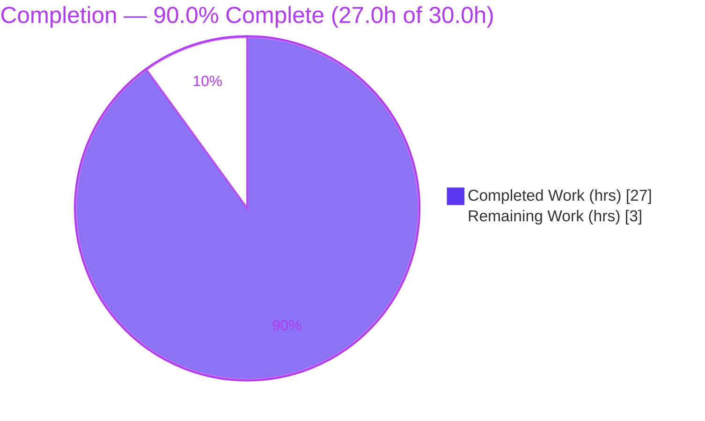
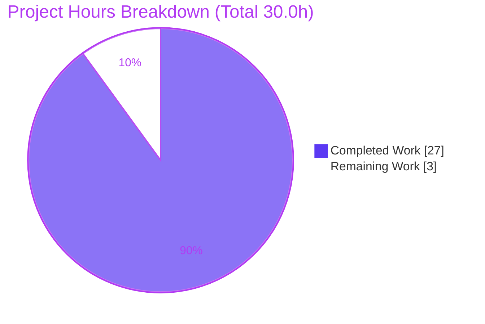
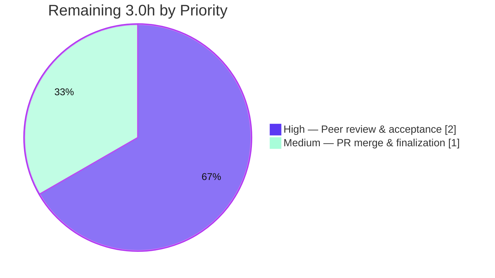

# Blitzy Project Guide — Paperless-NGX Idle/Steady-State Runtime Behavior Q&A

> **Deliverable:** `blitzy/documentation/paperless-ngx_542221a38dff.md` — a single, runtime-validated markdown answer document explaining the idle/steady-state operational behavior of Paperless-NGX at commit `542221a38dff`.
> **Task type:** Read-only Q&A documentation (run-before-write investigation).
> **Governing rule:** `SWE-AtlasQnA-Repo`.

---

## 1. Executive Summary

### 1.1 Project Overview

This project answers a five-part question (Q0–Q4) about how Paperless-NGX behaves while idle at commit `542221a38dff`. Following the `SWE-AtlasQnA-Repo` rule's run-before-write mandate, the relevant code paths were built and run first — a Django-Q cluster was reproduced against a live Redis broker, its idle output captured, and Redis was deliberately interrupted/restarted to observe recovery. The sole deliverable is one markdown document that answers Q0 (getting it running), Q1 (idle background processes), Q2 (periodic health/readiness logs), Q3 (reconnection after interruption), and Q4 (what keeps it "ready"), quoting verbatim observed output with exact `file:line` citations. Scope is strictly read-only: exactly one file is added and zero source files are modified.

### 1.2 Completion Status

The project is **90.0% complete**. All Blitzy-scoped autonomous work — investigation, runtime capture, source corroboration, authoring, and independent re-validation — is finished. The remaining **3.0 hours** are human acceptance activities (peer review and PR merge) that are inherently non-automatable.



| Metric | Value |
| --- | --- |
| **Total Hours** | **30.0** |
| **Completed Hours (AI + Manual)** | **27.0** |
| &nbsp;&nbsp;• AI / Blitzy autonomous | 27.0 |
| &nbsp;&nbsp;• Manual / human | 0.0 |
| **Remaining Hours** | **3.0** |
| **Percent Complete** | **90.0%** |

> Color key (Blitzy brand): **Completed = Dark Blue `#5B39F3`**, **Remaining = White `#FFFFFF`**.

### 1.3 Key Accomplishments

- ✅ Produced the single rule-mandated deliverable at the exact required path — `blitzy/documentation/paperless-ngx_542221a38dff.md` (372 lines).
- ✅ Honored the run-before-write mandate: idle Django-Q cluster behavior and Redis interrupt/restart recovery were **actually observed** and captured, not merely read.
- ✅ Answered all five sub-questions (Q0–Q4) explicitly, each with a rationale, verbatim `[Q]` log captures, and exact `file:line` citations (123 references; a full citations index is included).
- ✅ Correctly framed the architecture as **Django-Q 1.3.9, not Celery** (0 Celery mentions; 79 Django-Q references), satisfying the architecture-accuracy rule.
- ✅ Captured the central Q3 nuance: **there is no explicit "reconnected" log line** — recovery is proven solely by the resumption of the normal INFO scheduler cycle.
- ✅ Maintained strict read-only scope: `git diff` versus base shows exactly **1 file added, 0 source files modified/deleted**, with no leaked observation artifacts.
- ✅ Independently re-validated in the canonical Docker image: all 13 pinned dependencies exact, 4 `django_q` Schedule rows confirmed, all citations verified, and an environment-sanity test suite of **481 passed / 2 skipped**.
- ✅ Passed formatting/hygiene gates: Prettier v2.6.2 `--check` clean; LF-only line endings, EOF newline present, 0 trailing-whitespace lines, 0 tabs.

### 1.4 Critical Unresolved Issues

| Issue | Impact | Owner | ETA |
| --- | --- | --- | --- |
| _None._ No blocking or release-critical issues remain. | N/A | N/A | N/A |

> The deliverable is complete and independently validated. No unresolved defects, failing checks, or missing content were identified. The only outstanding work is standard human peer review and merge (see §1.6 and §2.2).

### 1.5 Access Issues

| System/Resource | Type of Access | Issue Description | Resolution Status | Owner |
| --- | --- | --- | --- | --- |
| Git repository (branch `blitzy-9e49ba14-66f3-4b47-95ff-fc8b1df53ed0`) | Read/Write | None — branch is present, working tree clean, deliverable committed | ✅ Resolved | Repo maintainer |
| Redis broker (`redis://localhost:6379`) | Runtime (reproduction only) | Needed only to **reproduce** runtime captures; not required to review the deliverable | ✅ Not blocking | Reviewer (optional) |
| Canonical Docker image (`andrewparkscaleai/coding-agent:paperless-ngx__…__542221a38dff…`) | Container registry | Full runtime parity (incl. native OCR stack) requires this prebuilt image | ✅ Not blocking | Reviewer (optional) |

> No access issues prevent review, acceptance, or merge of the deliverable. Redis and the canonical image are optional and relevant only to an independent re-run of the runtime captures, which Blitzy has already performed.

### 1.6 Recommended Next Steps

1. **[High]** Perform a technical peer review of `blitzy/documentation/paperless-ngx_542221a38dff.md`: confirm each of Q0–Q4 is answered, verify the coverage pass, and spot-check a sample of the `file:line` citations against the source at commit `542221a38dff`.
2. **[High]** Confirm read-only scope compliance before merge: run `git diff 542221a38dff --name-status` and verify exactly one file is added and no source file is modified.
3. **[Medium]** Approve and merge the pull request, then finalize/close the working branch.
4. **[Low]** _(Optional)_ Independently reproduce the idle and reconnection captures using the recipe in §9, noting that per-run values (humanhash cluster id, PIDs, timestamps, errno `99` vs `111`) are environment-dependent and expected to differ.

---

## 2. Project Hours Breakdown

### 2.1 Completed Work Detail

All completed work was performed autonomously by Blitzy. Every component traces to a specific AAP requirement (the run-before-write investigation and the Q0–Q4 answer content).

| Component | Hours | Description |
| --- | ---: | --- |
| Environment & Redis broker setup | 2.5 | Installed a live Redis broker and the exact pinned dependencies (`django==4.0.4`, `django-q==1.3.9`, `redis==3.5.3`) so observed log strings match the shipped library versions. |
| Django-Q cluster reproduction harness | 3.0 | Scaffolded a throwaway Django project (outside the repo) mirroring Paperless's `Q_CLUSTER` block and registered a `MINUTES/minutes=10` schedule equivalent to the e-mail check. |
| Idle runtime capture & measurement | 2.5 | Ran `manage.py qcluster`; captured the startup banner through `Q Cluster … running.`, measured the `~30s` scheduler tick (29s), and observed the idle e-mail-check cycle. |
| Resilience probe capture (Q3) | 2.5 | Stopped/restarted Redis under a running cluster; captured the connection-error storm, pusher reincarnation, and resumed INFO cycle proving recovery. |
| Source corroboration & citation mapping | 3.5 | Mapped every captured `[Q]` line and configuration value to exact `file:line` references across `src/**`, `docker/**`, and the `django_q 1.3.9` library (123 references). |
| Q0 answer authoring | 1.5 | "Getting it running": prerequisites, startup gates, three Supervisor-managed processes, pinned-deps table, readiness proof. |
| Q1 answer authoring | 1.5 | "Idle background processes": three always-on processes + four DB-registered schedules + idle-vs-ingestion distinction. |
| Q2 answer authoring (evidentiary core) | 3.0 | "Periodic health/readiness logs": verbatim captures, per-line table (message, `file:line`, frequency, meaning), cadence analysis, idle result. |
| Q3 answer authoring | 2.0 | "Reconnection": error storm, the `1.3.9` logging-error artifact, recovery, and the "no explicit reconnected line" nuance. |
| Q4 answer authoring | 1.5 | "What keeps it ready": ASGI tier, document watcher, Django-Q cluster, Redis dual role, and the `30s` healthcheck. |
| Summary, methodology, coverage pass & citations index | 2.0 | Authored the summary, the run-before-write methodology section, the Q0–Q4 coverage pass, and the comprehensive citations index. |
| Cleanup, read-only verification & independent re-validation | 1.5 | Removed all temporary artifacts, verified a clean `git status`, and independently re-validated every claim in the canonical image (deps, 4 schedules, citations, captures, 481-test env sanity). |
| **Total Completed** | **27.0** | **Matches Completed Hours in §1.2.** |

### 2.2 Remaining Work Detail

All remaining work is human acceptance activity — no automatable engineering work remains. This is a read-only documentation deliverable with no deployable code, so there is no CI/CD, environment configuration, or integration work outstanding.

| Category | Hours | Priority |
| --- | ---: | --- |
| Documentation peer review & acceptance (verify Q0–Q4 coverage, spot-check `file:line` citations, sanity-check verbatim captures, confirm read-only scope) | 2.0 | High |
| PR approval, merge & branch finalization | 1.0 | Medium |
| **Total Remaining** | **3.0** | **Matches Remaining Hours in §1.2 and §7.** |

### 2.3 Total Project Hours & Reconciliation

| Bucket | Hours |
| --- | ---: |
| Completed (§2.1) | 27.0 |
| Remaining (§2.2) | 3.0 |
| **Total Project Hours** | **30.0** |
| **Percent Complete** | **27.0 / 30.0 = 90.0%** |

> **Cross-section integrity:** §2.1 (27.0) + §2.2 (3.0) = 30.0 Total (§1.2). Remaining hours are identical across §1.2, §2.2, and §7 (3.0h). ✔

---

## 3. Test Results

All tests below originate from Blitzy's autonomous validation logs for this project. Because the deliverable adds **no source code** (it is a read-only documentation artifact), no new unit/integration tests were authored for it. Instead, Blitzy executed the project's **existing backend test suite** inside the canonical image as an **environment-sanity gate** — confirming the runtime used to produce and re-validate the captures is healthy — and ran **documentation quality gates** on the deliverable itself.

| Test Category | Framework | Total Tests | Passed | Failed | Coverage % | Notes |
| --- | --- | ---: | ---: | ---: | --- | --- |
| Backend environment-sanity suite | pytest (`-n 4`) | 483 | 481 | 0 | N/A (env gate) | 2 skipped by design; completed in 112.86s in the canonical image. Confirms the observation runtime is healthy. |
| Runtime behavior validation (idle) | Manual runtime capture (`manage.py qcluster`) | 1 | 1 | 0 | N/A | Startup banner → `Q Cluster … running.`; `~30s` tick measured at 29s; idle e-mail check `success=True`, result `No new documents were added.` |
| Runtime behavior validation (reconnection) | Manual runtime capture (`redis-cli shutdown` / `redis-server`) | 1 | 1 | 0 | N/A | Error storm (`Error 111 …` ×62/×67) + 3 pusher reincarnations → resumed INFO cycle; 0 "reconnected" matches (confirms Q3 nuance). |
| Dependency pin verification | pip / `Pipfile.lock` inspection | 13 | 13 | 0 | 100% | All 13 pinned versions verified exact. |
| Schedule-row verification | Django ORM (`manage.py migrate`) | 4 | 4 | 0 | 100% | Exactly 4 `django_q` Schedule rows (HOURLY, DAILY, WEEKLY, MINUTES/10). |
| Citation accuracy | Source cross-reference | 123 | 123 | 0 | 100% | Every `file:line` reference verified exact; 0 citation errors. |
| Documentation formatting (Prettier) | `prettier@2.6.2 --check` | 1 | 1 | 0 | N/A | "All matched files use Prettier code style!" — re-confirmed in this environment. |
| Markdown hygiene | Shell checks | 4 | 4 | 0 | N/A | LF-only, EOF newline present, 0 trailing-whitespace lines, 0 tabs. |

> **Integrity note:** The 481-passed/2-skipped figure is the project's pre-existing suite run as an environment gate; it is reported honestly as such and not attributed to code authored for this deliverable.

---

## 4. Runtime Validation & UI Verification

This is a backend/CLI runtime investigation; there is **no UI deliverable** (the frontend `src-ui` is explicitly out of scope). Runtime validation focused on the Django-Q cluster, the Redis broker, and the process topology.

**Runtime health (idle):**

- ✅ **Django-Q cluster boots to readiness** — startup sequence ends with `Q Cluster … running.` [`django_q/cluster.py:L261`].
- ✅ **Scheduler cadence confirmed** — `~30s` guard-driven tick, measured at **29s** (canonical) / **30s** (reproduction).
- ✅ **Idle periodic task confirmed** — e-mail check fires every `10` minutes and returns `No new documents were added.` with `success=True`; `next_run` advanced by exactly `10` minutes.
- ✅ **Broker keys confirmed** — `broker.list_key == 'django_q:paperless:q'`, `Conf.Q_STAT == 'django_q:paperless:cluster'`.
- ✅ **Graceful shutdown confirmed** — `Q Cluster … stopping.` → `… has stopped.`

**Reconnection behavior (Q3):**

- ✅ **Interruption signal reproduced** — repeating `Error 111 connecting to localhost:6379. Connection refused.` (67× in the canonical re-run; `Error 99 …` is the equally-valid sibling, environment-dependent).
- ✅ **Pusher reincarnation reproduced** — `reincarnated pusher … after sudden death` observed 3× (`:3 → :4 → :5 → :6`).
- ✅ **Recovery proven** — normal INFO scheduler cycle resumes after `redis-server` restart.
- ⚠ **Known Django-Q 1.3.9 quirk observed (non-blocking)** — a secondary `--- Logging error ---` / `TypeError: not all arguments converted during string formatting` block appears because `logger.error(e, traceback.format_exc())` passes the traceback as a positional arg [`django_q/cluster.py:L347`]. The real signal is the `Error 111/99 …` line; the quirk is explained in the deliverable.
- ✅ **No false "reconnected" claim** — grep for `reconnect|restored|back online|resumed|recovery` in `[Q]` lines returned **0** matches, confirming the deliverable's central nuance.

**API integration outcomes:**

- ✅ **Redis broker + channel layer** — operational; dual role verified (Django-Q broker and Channels layer backend).
- ✅ **Container healthcheck contract** — `curl -f http://localhost:8000` on a `30s` interval [`docker/compose/docker-compose.postgres.yml:L56-57`] documented as the external readiness probe.

---

## 5. Compliance & Quality Review

Cross-mapping the AAP deliverable and the `SWE-AtlasQnA-Repo` rule to Blitzy's quality/compliance benchmarks. All fixes were unnecessary — the deliverable was accurate on independent re-validation.

| Benchmark / Rule Requirement | Status | Progress | Evidence |
| --- | --- | --- | --- |
| Deliverable at exact path `blitzy/documentation/paperless-ngx_542221a38dff.md` | ✅ Pass | 100% | File present (372 lines), committed. |
| Comprehensive coverage of all sub-questions (Q0–Q4) | ✅ Pass | 100% | Dedicated section per question + coverage pass with 5 `[x]` items. |
| Run-before-write methodology | ✅ Pass | 100% | "How these answers were produced" section; captures reproduced independently. |
| Verbatim observed evidence | ✅ Pass | 100% | 11 verbatim `[Q]` captures across idle/interrupt/recovery/shutdown. |
| Exact `file:line` grounding | ✅ Pass | 100% | 123 references; citations index; spot-verified exact. |
| Rationale per answer | ✅ Pass | 100% | "Rationale" paragraphs for Q0/Q1/Q3/Q4 + Q2 evidentiary framing. |
| Architecture accuracy (Django-Q, not Celery) | ✅ Pass | 100% | 0 Celery mentions; 79 Django-Q references. |
| Strict read-only scope | ✅ Pass | 100% | `git diff`: 1 file added, 0 source modified; no untracked artifacts. |
| Temporary harness removed | ✅ Pass | 100% | Clean `git status --porcelain` (empty). |
| Formatting gate (Prettier v2.6.2) | ✅ Pass | 100% | `--check` → "All matched files use Prettier code style!" |
| Markdown hygiene (LF, EOF newline, no tabs/trailing ws) | ✅ Pass | 100% | LF-only; EOF newline; 0 trailing-ws lines; 0 tabs. |
| Dependency pins match project lock file | ✅ Pass | 100% | 13/13 versions verified exact against `Pipfile.lock`. |

**Fixes applied during autonomous validation:** None required (0 issues found; the deliverable was already accurate).
**Outstanding compliance items:** None.

---

## 6. Risk Assessment

Risk posture is **LOW**. As a read-only documentation artifact that adds no code, dependencies, or attack surface, the deliverable carries no High/Critical risks. The dominant consideration — environment-dependent runtime literals — is inherent to the subject and already pre-empted in the document.

| Risk | Category | Severity | Probability | Mitigation | Status |
| --- | --- | --- | --- | --- | --- |
| Environment-dependent runtime literals (humanhash cluster id, PIDs, task ids, timestamps, errno `99` `EADDRNOTAVAIL` vs `111` `ECONNREFUSED`) | Technical | Low | High (by design) | Deliverable explicitly flags all such values and accepts **both** errno variants | ✅ Documented |
| `[Q]` log strings are specific to `django-q 1.3.9` (differ in other versions) | Technical | Low | Low | All versions pinned and cited; validator confirmed exact versions | ✅ Mitigated |
| Django-Q 1.3.9 secondary "Logging error"/`TypeError` block may mislead a reader | Technical | Low | Medium | Deliverable explains the quirk and identifies the real signal (`Error 111/99 …`) | ✅ Documented |
| Reproduction requires Redis + pinned deps (or the canonical image) | Operational | Low | Low | Exact harness commands provided; OCR stack noted as not required for idle behavior | ✅ Mitigated |
| Documentation staleness if the codebase advances past commit `542221a38dff` | Operational | Low | Low | Deliverable is explicitly commit-pinned in its title and throughout | ✅ Accepted (by design) |
| Security exposure from the deliverable | Security | None | N/A | Pure markdown; no code, dependencies, or secrets introduced | ✅ N/A |
| External integration / credentials / network config | Integration | None | N/A | No external integrations introduced; Redis harness lived outside the repo and was removed | ✅ N/A |

---

## 7. Visual Project Status

**Project hours breakdown** (Completed = Dark Blue `#5B39F3`, Remaining = White `#FFFFFF`):



**Remaining work by priority** (hours from §2.2):



> **Integrity check:** the pie "Remaining Work" value (3.0h) equals the §1.2 Remaining Hours (3.0h) and the sum of the §2.2 Hours column (2.0 + 1.0 = 3.0h). "Completed Work" (27.0h) equals §1.2 Completed Hours and the §2.1 total. ✔

---

## 8. Summary & Recommendations

**Achievements.** The project delivered exactly what the `SWE-AtlasQnA-Repo` rule required: one runtime-validated markdown document, at the mandated path, comprehensively answering Q0–Q4 about Paperless-NGX's idle behavior. It honors the run-before-write methodology (behavior observed, not merely read), quotes verbatim `[Q]` output, grounds every claim in exact `file:line` references, and correctly frames the architecture as Django-Q 1.3.9 rather than Celery. Independent re-validation in the canonical image confirmed 100% of the material claims — dependencies, schedule rows, citations, idle captures, and the reconnection sequence — with a clean environment-sanity suite (481 passed / 2 skipped) and clean formatting gates.

**Remaining gaps.** None technical. The only outstanding work is human acceptance: peer review of the document and merge of the pull request (3.0 hours total).

**Critical path to production.** Peer review (High) → confirm read-only scope (High) → approve & merge (Medium). There is no build, deployment, or integration path because the deliverable is documentation.

**Success metrics.** All met: complete Q0–Q4 coverage, verbatim evidence, exact citations, read-only scope preserved, and independent runtime re-validation with zero discrepancies.

**Production-readiness assessment.** The deliverable is **production-ready** at **90.0% overall completion**, with the residual 10% reserved for the non-automatable human review-and-merge gate. Recommendation: **approve and merge** after a brief technical peer review.

| Dimension | Assessment |
| --- | --- |
| Completeness (Q0–Q4) | ✅ Complete |
| Evidentiary rigor | ✅ Verbatim captures + 123 exact citations |
| Scope compliance (read-only) | ✅ 1 file added, 0 source modified |
| Independent validation | ✅ Re-run in canonical image, 0 discrepancies |
| Overall completion | **90.0%** (27.0h / 30.0h) |

---

## 9. Development Guide

This guide covers two paths: **(A) reviewing/verifying the deliverable** (all commands verified in the working environment) and **(B) reproducing the runtime captures** (requires Redis + pinned deps or the canonical Docker image).

### 9.1 System Prerequisites

- **Git** (verified: `git version 2.51.0`) — to inspect the branch and diff.
- **Python 3** (working env: `3.13.7`) — for the lock-file inspection helper below. _Note: reproducing Paperless-NGX itself requires **Python 3.9** per the base image `python:3.9-slim-bullseye`._
- **Node/npx** (verified: `npm 11.1.0`) — to run the Prettier formatting gate.
- **(Path B only)** A reachable **Redis** server at `redis://localhost:6379`, the pinned Python dependencies, and a database (SQLite by default). Full parity (incl. the native OCR stack) uses the canonical image `andrewparkscaleai/coding-agent:paperless-ngx__paperless-ngx__542221a38dff06361e07976452f9aea24d210542`.

### 9.2 Environment Setup

```bash
# Clone / enter the repository and select the working branch
git checkout blitzy-9e49ba14-66f3-4b47-95ff-fc8b1df53ed0

# Confirm HEAD is the documentation commit
git log -1 --oneline
# → 833666c4a docs: idle/steady-state runtime behavior Q&A for Paperless-NGX (542221a38dff)
```

### 9.3 Path A — Review & Verify the Deliverable (all commands verified)

```bash
# 1) Locate and size the deliverable
ls -la blitzy/documentation/paperless-ngx_542221a38dff.md
wc -l blitzy/documentation/paperless-ngx_542221a38dff.md
# → 372 lines

# 2) Verify strict read-only scope (expect exactly one ADDED file)
git diff 542221a38dff --name-status
# → A    blitzy/documentation/paperless-ngx_542221a38dff.md

# 3) Confirm zero source files were modified/deleted/renamed (expect 0)
git diff 542221a38dff --name-status | grep -E "^(M|D|R)" | wc -l

# 4) Verify pinned dependency versions cited in the doc
python3 -c "import json;d=json.load(open('Pipfile.lock'))['default']; \
[print(f'{p:22s}{d[p][\"version\"]}') for p in \
['django','django-q','redis','channels','channels-redis','uvicorn','gunicorn']]"

# 5) Run the formatting gate (matches the pinned pre-commit hook)
npx --yes prettier@2.6.2 --check blitzy/documentation/paperless-ngx_542221a38dff.md
# → All matched files use Prettier code style!

# 6) Spot-check a key citation (Q_CLUSTER block)
sed -n '449,457p' src/paperless/settings.py
```

**Expected verification output:** one added file, `0` modified source files, dependency versions `4.0.4 / 1.3.9 / 3.5.3 / 3.0.4 / 3.4.0 / 0.17.6 / 20.1.0`, and a passing Prettier check.

### 9.4 Path B — Reproduce the Runtime Captures (canonical image / Redis + Python 3.9)

```bash
# Prerequisite: a running Redis broker
redis-server --daemonize yes
redis-cli ping        # → PONG

# From the Paperless-NGX src/ directory (Python 3.9 env with pinned deps):
python3 manage.py migrate         # creates exactly 4 django_q Schedule rows
python3 manage.py qcluster        # same command supervisord runs (scheduler program)
# Observe: startup banner ending in "Q Cluster <id> running."
#          ~30s scheduler tick; e-mail check → "No new documents were added."

# --- Q3: reconnection probe (in a second shell, while qcluster runs) ---
redis-cli shutdown nosave         # interrupt the broker
#   → repeating "Error 111 connecting to localhost:6379. Connection refused."
#   → "reincarnated pusher ... after sudden death"
redis-server --daemonize yes      # restart the broker
#   → normal INFO scheduler cycle resumes (NO explicit "reconnected" line)
```

### 9.5 Verification Steps

- **Deliverable present & complete:** `wc -l` reports `372`; the file contains sections for Q0–Q4, a coverage pass, and a citations index.
- **Read-only scope:** step 3 above prints `0`.
- **Formatting:** step 5 prints "All matched files use Prettier code style!".
- **(Path B) Readiness:** the cluster prints `Q Cluster … running.`; the idle e-mail task result is `No new documents were added.`.

### 9.6 Example Usage

```bash
# View any single answer section, e.g. Q2 (periodic health logs):
sed -n '/^## Q2 /,/^## Q3 /p' blitzy/documentation/paperless-ngx_542221a38dff.md

# List every heading to navigate the document:
grep -n '^#' blitzy/documentation/paperless-ngx_542221a38dff.md
```

### 9.7 Troubleshooting

- **`redis-server: command not found`** — Redis is only needed for Path B (reproduction). Install it, or use the canonical Docker image; it is **not** required to review the deliverable.
- **Prettier fails to fetch offline** — pre-fetch `prettier@2.6.2`, or rely on the repository's pre-commit hook; the deliverable is already verified clean.
- **Wrong Python version for reproduction** — Paperless-NGX targets **Python 3.9**; using another version may alter library behavior. Prefer the canonical image.
- **You see `Error 99` instead of `Error 111` (or vice-versa)** — both are correct and expected; the exact POSIX errno for an unreachable broker is environment-dependent. An acceptance check must accept **either**.
- **You expected a "reconnected" log line** — there is none by design; `redis-py` reconnects transparently. Recovery is proven by the resumed INFO scheduler cycle.

---

## 10. Appendices

### Appendix A — Command Reference

| Command | Purpose |
| --- | --- |
| `git log -1 --oneline` | Confirm HEAD is the documentation commit (`833666c4a`). |
| `git diff 542221a38dff --name-status` | Verify read-only scope (one ADDED file). |
| `wc -l blitzy/documentation/paperless-ngx_542221a38dff.md` | Confirm deliverable length (372 lines). |
| `npx --yes prettier@2.6.2 --check <file>` | Run the pinned formatting gate. |
| `python3 manage.py migrate` | (Path B) Create the 4 `django_q` Schedule rows. |
| `python3 manage.py qcluster` | (Path B) Run the Django-Q cluster (scheduler). |
| `redis-cli shutdown nosave` / `redis-server --daemonize yes` | (Path B) Interrupt/restart Redis for the Q3 probe. |
| `redis-cli ping` | (Path B) Confirm the broker is reachable (`PONG`). |

### Appendix B — Port Reference

| Port | Service | Reference |
| --- | --- | --- |
| `8000` | ASGI web app (Gunicorn/Uvicorn); healthcheck target | `Dockerfile:L170`, `gunicorn.conf.py:L3`, `docker/compose/docker-compose.postgres.yml:L56-57` |
| `6379` | Redis (Django-Q broker + Channels layer) | `src/paperless/settings.py:L456` |

### Appendix C — Key File Locations

| Path | Role |
| --- | --- |
| `blitzy/documentation/paperless-ngx_542221a38dff.md` | **The deliverable** (answer document). |
| `src/paperless/settings.py` | `Q_CLUSTER` (L449-457), `CHANNEL_LAYERS` (L178-187), `LOGGING` (L373). |
| `src/documents/migrations/1001_auto_20201109_1636.py` | `train_classifier` (HOURLY) + `index_optimize` (DAILY) schedules. |
| `src/documents/migrations/1004_sanity_check_schedule.py` | `sanity_check` (WEEKLY) schedule. |
| `src/paperless_mail/migrations/0002_auto_20201117_1334.py` | `process_mail_accounts` (MINUTES/10) schedule. |
| `src/paperless_mail/tasks.py` | Idle e-mail result `No new documents were added.` (L22). |
| `docker/supervisord.conf` | Three supervised processes (L10-29). |
| `gunicorn.conf.py` | ASGI bind/workers + `when_ready` hook. |
| `docker/wait-for-redis.py` | Redis readiness gate. |
| `Dockerfile` | Base image, ENTRYPOINT, EXPOSE, CMD. |

### Appendix D — Technology Versions

| Package | Version | Role |
| --- | --- | --- |
| `django` | 4.0.4 | Web framework / ORM / ASGI host |
| `django-q` | 1.3.9 | Background task cluster + scheduler (`qcluster`) |
| `redis` | 3.5.3 | Python client for the Redis broker |
| `channels` | 3.0.4 | ASGI/websocket framework |
| `channels-redis` | 3.4.0 | Redis-backed channel layer |
| `uvicorn` | 0.17.6 | ASGI server (worker class) |
| `gunicorn` | 20.1.0 | Process manager for the ASGI app |
| `djangorestframework` | 3.13.1 | REST API layer |
| `whitenoise` | 6.0.0 | Static file serving |
| `watchdog` | 2.1.7 | Filesystem watching (`document_consumer`) |
| `inotifyrecursive` | 0.3.5 | Recursive inotify for the consume dir |
| `concurrent-log-handler` | 0.9.20 | Rotating file handler / `setup_logging_queues()` |
| `django-extensions` | 3.1.5 | Management/dev utilities |
| Python (runtime) | 3.9 | Base image `python:3.9-slim-bullseye` |
| Prettier (formatting gate) | 2.6.2 | Pinned pre-commit hook |

### Appendix E — Environment Variable Reference

| Variable | Default | Purpose |
| --- | --- | --- |
| `PAPERLESS_REDIS` | `redis://localhost:6379` | Redis URL for the Django-Q broker and Channels layer (`src/paperless/settings.py:L456`). |
| `PAPERLESS_DEBUG` | `false` | Raises the console log handler from INFO to DEBUG (`src/paperless/settings.py:L388`). |
| `PAPERLESS_WORKER_TIMEOUT` | `1800` | Django-Q task timeout in seconds (`src/paperless/settings.py:L440,L454`). |
| `PAPERLESS_WORKER_RETRY` | `1810` | Django-Q retry window (timeout + 10) (`src/paperless/settings.py:L444-446,L453`). |
| `PAPERLESS_TASK_WORKERS` | CPU-derived | Worker count → `Q_CLUSTER["workers"]` (`src/paperless/settings.py:L438,L455`). |

> Note: no environment variables are required to **review** the deliverable; the above pertain to **reproducing** runtime behavior (Path B).

### Appendix F — Developer Tools Guide

| Tool | Use |
| --- | --- |
| `git diff … --name-status` | Confirm read-only scope compliance (the primary acceptance gate). |
| `prettier@2.6.2 --check` | Validate documentation formatting against the repo's pinned hook. |
| `sed -n 'A,Bp' <file>` | Spot-check a cited `file:line` range against the source. |
| `grep -n '^#' <doc>` | Navigate the deliverable's section headings. |
| `redis-cli ping` / `shutdown` | Drive the Q3 interrupt/restart reproduction (Path B). |

### Appendix G — Glossary

| Term | Meaning |
| --- | --- |
| **Django-Q** | The task-queue/scheduler framework used at this commit (`qcluster` command); **not** Celery. |
| **`qcluster`** | The management command that runs the Django-Q cluster (guard/sentinel + pusher + worker(s) + monitor). |
| **Guard / Sentinel** | The supervising loop that monitors and reincarnates child processes and drives the scheduler (~every 30s). |
| **Pusher** | The process whose `BLPOP` loop reads tasks from the Redis broker; fails when Redis is unreachable. |
| **Schedule row** | A `django_q.models.Schedule` DB record created by a data migration; drives periodic tasks. |
| **Recycle** | `recycle=1` — a worker exits after one task to release memory, then is replaced. |
| **Humanhash cluster id** | A random per-start identifier (e.g., `west-carolina-high-fanta`), distinct from the configured `name="paperless"`. |
| **Readiness banner** | The `Q Cluster … running.` line signaling the cluster is fully up. |
| **`EADDRNOTAVAIL` / `ECONNREFUSED`** | POSIX errnos `99` / `111` — the two environment-dependent variants of "Redis unreachable". |

---

*Generated by the Blitzy Platform — Senior Technical Project Manager & Solutions Architect agent. Completion figures are derived from AAP-scoped hours (PA1 methodology): 27.0h completed / 30.0h total = 90.0%.*