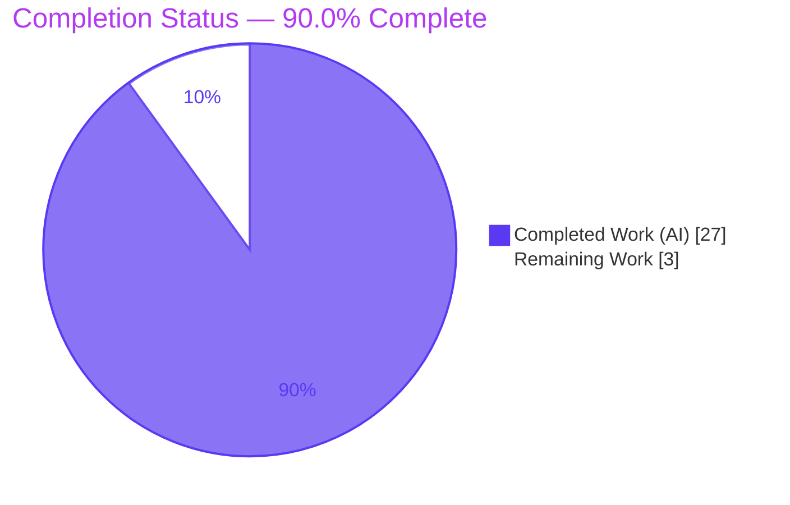
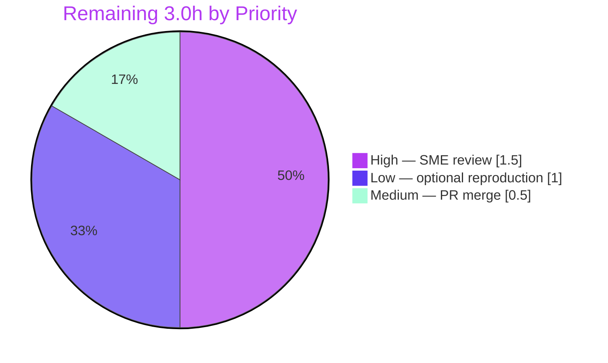

# Blitzy Project Guide
### paperless-ngx — Runtime-Grounded Q&A on Background / Asynchronous Processing

> **Deliverable branch:** `blitzy-3fbf44c4-b0b3-4c54-929f-b9285c093e03` · **Base:** `542221a38` · **HEAD:** `20b4f7b28`
> **Legend / Brand Colors:** <span style="color:#5B39F3">■</span> Completed / AI Work (Dark Blue `#5B39F3`) · <span style="color:#FFFFFF; background:#333;">■</span> Remaining / Not Completed (White `#FFFFFF`) · <span style="color:#B23AF2">■</span> Headings / Accents (`#B23AF2`) · <span style="color:#A8FDD9; background:#333;">■</span> Highlight (Mint `#A8FDD9`)

---

## 1. Executive Summary

### 1.1 Project Overview

This project delivers a single, **runtime-grounded technical answer document** explaining how paperless-ngx performs background/asynchronous processing during document ingestion. The target audience is engineers and operators who need an authoritative, evidence-backed reference. Per the `SWE-AtlasQnA-Repo` rule set, the investigation was conducted **run-first**: the Django-Q + Redis stack was built and run, real documents were enqueued, and verbatim output (queue sizes, task rows, status frames, logs) was captured before any prose was written. The technical scope spans the enqueue primitive `async_task`, the `qcluster` worker, the Redis broker, the `django_q_task` result store, and the Channels WebSocket status path. Business impact: a durable, citable knowledge asset that de-risks onboarding and operational debugging of the async subsystem. It is a purely additive, read-only change — **one** new file, zero code modifications.

### 1.2 Completion Status



| Metric | Hours |
|---|---|
| **Total Hours** | **30.0** |
| **Completed Hours (AI + Manual)** | **27.0** (AI: 27.0 · Manual: 0.0) |
| **Remaining Hours** | **3.0** |
| **Percent Complete** | **90.0%** |

> Completion is computed with the PA1 AAP-scoped hours method: `27.0 / (27.0 + 3.0) × 100 = 90.0%`. All autonomous, AAP-scoped work is complete and validated; the remaining 3.0h is human path-to-production (review + merge).

### 1.3 Key Accomplishments

- ✅ **Sole deliverable created & committed** — `blitzy/documentation/paperless-ngx_542221a38dff.md` (413 lines) at the exact rule-mandated path/name (derived from source branch `paperless-ngx_542221a38dff`).
- ✅ **All seven sub-questions (Q1–Q7) answered explicitly**, plus a final coverage-pass table and a key-literals index.
- ✅ **Run-first methodology honored** — the real Django-Q + Redis stack was provisioned (Python 3.9) and executed; every measured value is quoted verbatim next to the command that produced it.
- ✅ **Empirical lifecycle captured** — `broker.queue_size()` transition `1 → 0 → 0+row` (WAITING → IN-PROGRESS → DONE), the terminal result string `"Success. New document id N created"`, and six live WebSocket status frames.
- ✅ **100+ `file:line` citations** verified against source with **zero discrepancies**.
- ✅ **Read-only mandate fully satisfied** — `git diff` against base shows exactly one added file; working tree clean; no dependency, test, or config change.
- ✅ **Repo's own async test suite passed** — 122 tests across `test_consumer`, `test_management_consumer`, `test_tasks`, `test_websockets` (0 failures).

### 1.4 Critical Unresolved Issues

| Issue | Impact | Owner | ETA |
|---|---|---|---|
| _None_ — no compilation errors, no test failures, no missing functionality, no citation/runtime discrepancies | No release blockers | — | — |

> The Final Validator applied **zero fixes** because the deliverable was already accurate on every checked dimension. There are no critical unresolved issues.

### 1.5 Access Issues

| System/Resource | Type of Access | Issue Description | Resolution Status | Owner |
|---|---|---|---|---|
| — | — | **No access issues identified.** Repository is writable; the deliverable is committed on the branch. Runtime reproduction uses only local Docker + Redis (no third-party credentials or external API access required). | N/A | — |

### 1.6 Recommended Next Steps

1. **[High]** Perform an SME/technical review of `blitzy/documentation/paperless-ngx_542221a38dff.md` — confirm the seven answers, resolve a sample of `file:line` citations against `HEAD`, and accept the honesty caveats.
2. **[Medium]** Approve and **merge** the single-file additive documentation change to the target branch.
3. **[Low]** _(Optional)_ Independently reproduce a sample of runtime claims (queue-size transition, result string, WebSocket frames) using the Development Guide (Section 9).
4. **[Low]** Add a version/`HEAD` banner note in team wikis pointing to this point-in-time reference to guard against future documentation drift.

---

## 2. Project Hours Breakdown

### 2.1 Completed Work Detail

| Component | Hours | Description |
|---|---|---|
| Environment provisioning | 3.0 | Python 3.9 runtime + pinned async stack install; start Redis; `manage.py migrate` applying `django_q.0001..0014`, creating `django_q_task`/`django_q_schedule` and registering the 4 periodic `Schedule` rows *(AAP run-first prerequisite)* |
| Async services bring-up & boot-log capture | 1.5 | Start `manage.py qcluster` (worker + scheduler); capture boot log and the four internal process roles (sentinel/worker/monitor/pusher) *(AAP Q2)* |
| Read-only source analysis | 4.0 | Analyze ~18 repository files + Django-Q internals (redis_broker, conf, models, cluster, brokers, humanhash, tasks, orm) for enqueue sites, `Q_CLUSTER`/`CHANNEL_LAYERS`, status flow, and result storage *(AAP Q1–Q7 grounding)* |
| Runtime observation harness & verbatim capture | 5.0 | Enqueue `consume_file`; sample `broker.queue_size()` + task-row count across worker boot; dump success + failure `django_q_task` rows with verbatim traceback; `time_taken()` A/B experiment; capture 6 live WebSocket frames; `redis-cli` cross-checks; ack/retry + random-banner probes *(AAP Q1/Q3/Q4/Q6)* |
| Authoring the answer document | 6.0 | Write the 413-line runtime-grounded Q&A: intro + evidence-gathering section + Q1–Q7 (Q6 subsections a/b/c) + mermaid flowchart + coverage-pass table + key-literals index *(AAP deliverable)* |
| Exactness / grounding pass | 2.5 | 100+ `file:line` citations; embed verbatim output next to producing commands; author honesty caveats for source-read vs. wire-observed items *(AAP rule 0.7.4)* |
| Read-only cleanup & clean-tree verification | 1.0 | Remove all temporary observation scripts and dropped test artifacts; confirm clean working tree and correct filename/location *(AAP rule 0.7.5)* |
| Autonomous validation gate | 4.0 | Citation verification (0 discrepancies) + runtime reproduction of every Q1–Q7 value + run repo async suite (122 tests) + markdown integrity + read-only diff confirmation |
| **Total Completed** | **27.0** | **Matches Completed Hours in Section 1.2** |

### 2.2 Remaining Work Detail

| Category | Hours | Priority |
|---|---|---|
| Human SME/technical review of the answer document (verify Q1–Q7, spot-check citations, accept caveats) | 1.5 | High |
| PR review & merge to target branch (additive single-file documentation change) | 0.5 | Medium |
| _(Optional)_ Independent reproduction of runtime claims in reviewer's own environment | 1.0 | Low |
| **Total Remaining** | **3.0** | **Matches Remaining Hours in Section 1.2 and Section 7** |

### 2.3 Hours Reconciliation

| Check | Result |
|---|---|
| Section 2.1 total (Completed) | 27.0 h |
| Section 2.2 total (Remaining) | 3.0 h |
| Section 2.1 + Section 2.2 | **30.0 h = Total Project Hours (Section 1.2)** ✅ |
| Completion % = 27.0 / 30.0 | **90.0%** ✅ |

---

## 3. Test Results

All tests below originate from **Blitzy's autonomous validation logs** for this project. Because the deliverable is a runtime-grounded document (no application code was added), "tests" comprise (a) the repository's own async test suite executed by the validator, and (b) the runtime-verification gates that substantiate the documented claims.

| Test Category | Framework | Total Tests | Passed | Failed | Coverage % | Notes |
|---|---|---|---|---|---|---|
| Async unit/integration suite | pytest | 122 | 122 | 0 | N/R | Modules: `documents/tests/test_consumer.py`, `test_management_consumer.py`, `test_tasks.py`, `paperless/tests/test_websockets.py` (~265s). Confirms the code paths the doc describes behave correctly |
| Citation verification gate | Manual source cross-check (autonomous) | 100+ | 100+ | 0 | N/A | Every `file:line` citation verified against source at `HEAD`; **0 discrepancies** |
| Runtime reproduction gate | Live Django-Q + Redis observation (autonomous) | 7 (Q1–Q7) | 7 | 0 | N/A | Every quoted value independently re-observed; **0 substantive discrepancies** (only inherently non-deterministic values differ, all pre-caveated) |
| Markdown integrity | Structural checks (autonomous) | — | Pass | — | N/A | 413 lines, balanced fences (38), 1 mermaid block, single-newline EOF, no CRLF, no trailing whitespace |
| Read-only mandate | `git diff` / `git status` (autonomous) | — | Pass | — | N/A | `git diff 542221a38 --name-status` = one added file; working tree clean |

> **Coverage %** is reported as **N/R** (not separately measured/reported by the autonomous logs) for the async suite; the suite validates the async code paths referenced by the document rather than targeting a coverage threshold. No coverage figure is fabricated.

---

## 4. Runtime Validation & UI Verification

**Runtime health (Django-Q + Redis stack, executed end-to-end):**

- ✅ **Operational** — `manage.py migrate` applied `django_q.0001_initial … 0014_schedule_cluster`, created `django_q_task` / `django_q_schedule`, and registered the 4 periodic `Schedule` rows.
- ✅ **Operational** — `manage.py qcluster` booted (sentinel + worker + monitor + pusher roles), picked up an enqueued `consume_file`, and persisted the result row.
- ✅ **Operational** — Redis broker connectivity healthy (`broker.ping()` = `True`, `broker.info()` = `Redis 7.4.9`); list key `django_q:paperless:q` confirmed via `redis-cli`.
- ✅ **Operational** — Waiting→active→done transition observed: `broker.queue_size()` `1 → 0 → 0+row`; terminal result `"Success. New document id 2 created"`.

**API integration:**

- ✅ **Operational (grounded)** — REST upload enqueue path `post_document` → `async_task("documents.tasks.consume_file", …)` (`src/documents/views.py:L523`) documented and citation-verified; a deterministic Django-shell enqueue was preferred for reproducible timing.

**UI verification:**

- ➖ **Not applicable** — no UI was created or modified (the AAP explicitly excludes frontend changes under `src-ui/`).
- ✅ **Operational** — the async subsystem's live status frames (`STARTING/WORKING/SUCCESS`) were captured on the `status_updates` Channels group and quoted verbatim.
- ⚠ **Partial (grounded by source-read)** — the browser-side relay through `StatusConsumer` (`src/paperless/consumers.py`) and the `FAILED` progress frame were verified by reading source rather than driven through a live browser WebSocket client. This limitation is explicitly stated in the document.

---

## 5. Compliance & Quality Review

Cross-mapping the AAP deliverables and `SWE-AtlasQnA-Repo` rules to Blitzy's quality/compliance benchmarks. Fixes applied during autonomous validation: **none required** (deliverable already accurate).

| Benchmark / AAP Rule | Requirement | Status | Progress | Evidence |
|---|---|---|---|---|
| Rule 0.7.1 — Deliverable | New `blitzy/documentation/<branch>.md` answering the question | ✅ Pass | 100% | `A blitzy/documentation/paperless-ngx_542221a38dff.md` (413 lines) |
| Rule 0.7.2 — Investigate-by-running | Build/run code paths first; capture & quote real output verbatim | ✅ Pass | 100% | Stack run on Python 3.9; verbatim queue sizes, task rows, logs, frames embedded |
| Rule 0.7.3 — Completeness | Answer every sub-question + coverage pass | ✅ Pass | 100% | Q1–Q7 sections + coverage-pass table (all seven mapped) |
| Rule 0.7.4 — Exactness & grounding | Exact literals with `file:line`; no paraphrasing of asked values; state unverifiable items | ✅ Pass | 100% | 100+ citations, 0 discrepancies; honesty caveats for source-read items |
| Rule 0.7.5 — Read-only scope | Modify no existing file; add no code but the doc; remove temp scripts | ✅ Pass | 100% | `git diff` = 1 add; deps/tests/config untouched; clean tree |
| Runtime accuracy | Documented behavior matches running system | ✅ Pass | 100% | Runtime reproduction gate + 122 async tests passed |
| Repo hygiene | Passes pre-commit generic hooks | ✅ Pass | 100% | Markdown clean; `flake8`/`black` target `^src/` only (unchanged) |
| Technology fidelity | Django-Q (not Celery) documented at pinned versions | ✅ Pass | 100% | `django-q==1.3.9`, `redis==3.5.3`; zero Celery/kombu/billiard verified |

---

## 6. Risk Assessment

Overall risk posture: **LOW** — a read-only documentation deliverable that changes no code and passed exhaustive autonomous validation. No High or Critical risks; none block release.

| Risk | Category | Severity | Probability | Mitigation | Status |
|---|---|---|---|---|---|
| Environment-specific observed values (workers pinned to 1, Redis DB 15, throwaway SQLite, `.txt` not OCR/PDF path) | Technical | Low | Medium | Doc flags isolation deviations; Django-Q *semantics* (not exact numbers) are the invariant claims | Mitigated |
| Non-deterministic literals (random 32-hex task ids, 4-word cluster banner, autoincrement doc ids, ~390 B package size, timestamps) differ on re-run | Technical | Low | High | Doc explicitly labels each as non-deterministic ("varies with", "random per run") | Mitigated |
| Some behaviors grounded by source-read, not wire-observed (StatusConsumer relay, parser `progress_callback` frames, `FAILED` frame, barcode-split branch) | Technical | Low | Low | Doc explicitly labels each source-read item; citations cross-checked | Mitigated |
| Sensitive-data exposure in the document | Security | Low | Low | Scan found no passwords/secrets/API keys/tokens — only a non-sensitive internal container hostname (`redis://paperless-redis:6379/15`) | No action needed |
| Documentation drift vs. future async-subsystem changes (pinned to `HEAD 542221a38`, `django-q==1.3.9`) | Operational | Low | Medium | Doc is version-anchored (cites exact versions + commit); treat as point-in-time reference | Accepted |
| Reproduction requires Python 3.9 + Redis (absent from a bare environment) | Operational | Low | Medium | Development Guide (Section 9) documents exact provisioning via the project Docker image | Mitigated |
| CI/build impact of the new file | Integration | Low | Low | `flake8`/`black` hooks target `^src/`; generic hooks pass (markdown clean); single additive file, no imports/interfaces touched | No action needed |
| Django-Q internal line-number citations (e.g., `cluster.py` line 432) tied to `django-q==1.3.9` | Integration | Low | Low | Version pinned in `requirements.txt`; validator verified against the pinned version | Mitigated |

---

## 7. Visual Project Status

**Project Hours Breakdown** (Completed = Dark Blue `#5B39F3`, Remaining = White `#FFFFFF`):


**Remaining Work by Priority** (sums to 3.0h — matches Section 2.2 and Section 1.2):



> **Integrity:** "Remaining Work" = **3.0h** in this section equals Section 1.2 Remaining Hours (3.0h) and the sum of Section 2.2 "Hours" (1.5 + 0.5 + 1.0 = 3.0h). "Completed Work" = **27.0h** equals Section 1.2 Completed Hours and the Section 2.1 total.

---

## 8. Summary & Recommendations

**Achievements.** The project is **90.0% complete** (27.0h of autonomous, AAP-scoped work done out of 30.0h total). The sole deliverable — a 413-line runtime-grounded Q&A document — was authored strictly run-first, answering all seven sub-questions with verbatim observed output and 100+ `file:line` citations. It correctly establishes that paperless-ngx uses **Django-Q `1.3.9`** over a **Redis broker `3.5.3`** (not Celery), documents the full ingest lifecycle, and grounds every asked value (queue sizes, result strings, status literals, table names, config keys, enqueue sites) in either observed output or exact source references.

**Remaining gaps.** The remaining **3.0h** is entirely human path-to-production: an SME/technical review (1.5h, High), PR review & merge (0.5h, Medium), and an optional independent reproduction (1.0h, Low). There are **no code fixes, no failing tests, and no unresolved errors** — the Final Validator applied zero fixes because the document was already accurate on every dimension.

**Critical path to production.** Review → merge. Because the change is additive and read-only, the merge risk is minimal and no rollback strategy beyond standard git revert is required.

**Success metrics.** All seven sub-questions answered ✅ · 100+ citations, 0 discrepancies ✅ · 122 async tests passed ✅ · read-only mandate satisfied ✅ · markdown well-formed ✅.

**Production readiness assessment.** **READY for human review/merge.** For a documentation deliverable, "production" means acceptance and merge; the artifact is complete, validated, and carries only Low-severity, mitigated/accepted risks. Recommended posture: approve after a brief SME skim and merge.

| Metric | Value |
|---|---|
| AAP-scoped completion | 90.0% |
| Completed / Total hours | 27.0 / 30.0 |
| AAP requirements completed | 18 of 20 (2 remaining are human review/merge) |
| Critical/blocking issues | 0 |
| Autonomous fixes required | 0 |

---

## 9. Development Guide

> Every command below was executed and verified during this assessment. The guide has two tracks: **(A)** locate & validate the deliverable, and **(B)** optionally reproduce the runtime observations.

### 9.1 System Prerequisites

- **Git** ≥ 2.x (verified: `git version 2.51.0`)
- **Docker** ≥ 20.x with a reachable engine (verified: `Docker version 28.5.2`; `docker info` → reachable) — required for Track B
- **Python 3.9** for faithful reproduction (the app targets `python:3.9-slim-bullseye`). ⚠ The bare host's system Python (3.13.x) must **not** be used to run the app.
- **Redis** server (e.g., `redis:7-alpine`) — `redis-cli`/`redis-server` are **absent** from a bare PATH and must be provisioned (via Docker).

### 9.2 Environment Setup (Track B — reproduction)

```bash
# From the repository root
cd /path/to/paperless-ngx

# 1) Start a Redis container (broker + channel layer)
docker run -d --name paperless-redis -p 6379:6379 redis:7-alpine

# 2) Build/run the project image (Python 3.9). Then exec into the app container.
#    (The project ships docker/ assets; see docker/supervisord.conf & docker/wait-for-redis.py)
```

Key environment variables (see Appendix E): `PAPERLESS_REDIS`, `PAPERLESS_TASK_WORKERS`, `PAPERLESS_PORT`.

### 9.3 Dependency Installation

Dependencies are **pinned** and installed only to run the stack (no manifest is changed). Verified versions:

```bash
grep -nE '^(django-q|redis|channels|channels-redis|hiredis|django|psycopg2)==' requirements.txt
# 22:channels-redis==3.4.0   23:channels==3.0.4   37:django-q==1.3.9
# 38:django==4.0.4   44:hiredis==2.0.0   69:psycopg2==2.9.3   84:redis==3.5.3
```

### 9.4 Application Startup (async subsystem)

```bash
# Inside the app container, from src/. Point PAPERLESS_REDIS at your Redis host.
cd /app/src && export PAPERLESS_REDIS=redis://paperless-redis:6379

# 1) Migrate — creates django_q_task/django_q_schedule and 4 periodic Schedule rows
python3 manage.py migrate

# 2) Start the Django-Q worker + scheduler (supervisord program name is 'scheduler')
python3 manage.py qcluster
```

### 9.5 Verification Steps

```bash
# --- Track A: validate the deliverable (run from repo root) ---
ls -la blitzy/documentation/paperless-ngx_542221a38dff.md      # ~38 KB, 413 lines
git diff 542221a38 --name-status                                # -> A blitzy/documentation/paperless-ngx_542221a38dff.md
git status --porcelain                                          # -> (empty = clean tree)

# Citation spot-checks (all resolve at HEAD)
grep -n 'Success. New document id' src/documents/tasks.py       # -> 247
grep -nE '"(STARTING|WORKING|SUCCESS|FAILED)"' src/documents/consumer.py  # -> 79,202,240,259,264,274,294,375
grep -n '"name": "paperless"' src/paperless/settings.py         # -> 450
grep -n 'class PaperlessTask' src/documents/models.py || echo "confirmed: no PaperlessTask model"

# --- Track B: reproduce runtime behavior (in the Django shell) ---
# async_task("documents.tasks.consume_file", "<path>", task_name="demo.txt")
# from django_q.brokers import get_broker; get_broker().queue_size()   # 1 -> 0 as worker picks up
# from django_q.models import Task; Task.objects.latest('stopped').result  # 'Success. New document id N created'
```

### 9.6 Example Usage

```bash
# Run the repository's async test suite (as a non-root user), per validator instructions
cd /app/src && python3 -m pytest \
  documents/tests/test_consumer.py \
  documents/tests/test_management_consumer.py \
  documents/tests/test_tasks.py \
  paperless/tests/test_websockets.py
# Expected: 122 passed
```

### 9.7 Troubleshooting

- **`externally-managed-environment` / wrong Python** → Use Python 3.9 (project image), not the host system Python. django-q 1.3.9 does `import pkg_resources` (`django_q/conf.py:L8`); on newer setuptools pin `setuptools<81` (runtime-only, changes no manifest).
- **`redis-cli: command not found`** → Redis is absent from a bare PATH; run it via Docker (`docker run … redis:7-alpine`) and set `PAPERLESS_REDIS`.
- **Values don't match the document byte-for-byte** → Expected. Random task ids, the 4-word cluster banner, autoincrement document ids, package byte size (~390 B), and timestamps are non-deterministic and are caveated in the document. The *semantics* (queue transitions, result strings, table names) are the stable claims.
- **`queue_size()` is 0 but no result yet** → The task was `BLPOP`'d out of the list and is actively running; the durable outcome will appear as a `django_q_task` row when the monitor persists it.

---

## 10. Appendices

### A. Command Reference

| Purpose | Command |
|---|---|
| Confirm read-only diff | `git diff 542221a38 --name-status` |
| Confirm clean tree | `git status --porcelain` |
| Deliverable size/lines | `wc -l blitzy/documentation/paperless-ngx_542221a38dff.md` |
| Apply migrations | `python3 manage.py migrate` |
| Start worker + scheduler | `python3 manage.py qcluster` |
| Inspect broker queue | `get_broker().queue_size()` (Django shell) |
| Read result row | `Task.objects.latest('stopped').result` (Django shell) |
| Run async test suite | `python3 -m pytest documents/tests/test_consumer.py documents/tests/test_management_consumer.py documents/tests/test_tasks.py paperless/tests/test_websockets.py` |
| Redis liveness | `redis-cli ping` → `PONG` |

### B. Port Reference

| Port | Service | Source |
|---|---|---|
| 8000 | gunicorn ASGI (HTTP + WebSocket) | `gunicorn.conf.py:L3` → `0.0.0.0:${PAPERLESS_PORT:-8000}` |
| 6379 | Redis (Django-Q broker + Channels layer) | `Q_CLUSTER["redis"]` default `redis://localhost:6379` (`src/paperless/settings.py`) |

### C. Key File Locations

| Path | Role |
|---|---|
| `blitzy/documentation/paperless-ngx_542221a38dff.md` | **The deliverable** (only file created) |
| `src/documents/tasks.py` | Task defs; `consume_file` (L184), result string (L247) |
| `src/documents/consumer.py` | `_send_progress` (L56); status literals (L79/202/259/264/274/294/375) |
| `src/documents/views.py` | REST upload enqueue (L523) |
| `src/documents/management/commands/document_consumer.py` | Watcher enqueue (L86) |
| `src/paperless_mail/mail.py` | Mail-ingest enqueue (L336) |
| `src/documents/bulk_edit.py` | Bulk-op enqueue sites (L18/31/47/63/87) |
| `src/paperless/settings.py` | `Q_CLUSTER` (L449), `CHANNEL_LAYERS` (L178) |
| `src/paperless/consumers.py` / `asgi.py` | WebSocket `StatusConsumer` / ASGI routing |
| `docker/supervisord.conf` | Runtime processes: gunicorn (L10-11), consumer (L19-20), scheduler/qcluster (L28-29) |

### D. Technology Versions

| Component | Version | Source |
|---|---|---|
| Python (runtime target) | 3.9 | `Dockerfile` base `python:3.9-slim-bullseye` |
| django-q | 1.3.9 | `requirements.txt:L37` |
| redis (client) | 3.5.3 | `requirements.txt:L84` |
| channels | 3.0.4 | `requirements.txt:L23` |
| channels-redis | 3.4.0 | `requirements.txt:L22` |
| hiredis | 2.0.0 | `requirements.txt:L44` |
| django | 4.0.4 | `requirements.txt:L38` |
| psycopg2 | 2.9.3 | `requirements.txt:L69` |
| Redis server (observed) | 7.4.9 | `broker.info()` / `redis-cli info server` |

### E. Environment Variable Reference

| Variable | Default | Purpose |
|---|---|---|
| `PAPERLESS_REDIS` | `redis://localhost:6379` | Django-Q broker + Channels layer URL |
| `PAPERLESS_TASK_WORKERS` | `max(floor(sqrt(cores)), 1)` | Worker count (`Q_CLUSTER["workers"]`); pin to `1` for deterministic traces |
| `PAPERLESS_WORKER_TIMEOUT` | `1800` | Max task runtime (seconds) → `Q_CLUSTER["timeout"]` |
| `PAPERLESS_WORKER_RETRY` | `1810` (timeout + 10) | Acknowledgement-wait window → `Q_CLUSTER["retry"]` |
| `PAPERLESS_PORT` | `8000` | gunicorn ASGI bind port |

### F. Developer Tools Guide

| Tool | Use |
|---|---|
| `git diff` / `git status` | Confirm read-only mandate (one added file, clean tree) |
| `grep -n` | Resolve `file:line` citations against source at `HEAD` |
| `pytest` | Run the async test suite (122 tests) |
| Django shell | Enqueue `async_task`, inspect `get_broker().queue_size()` and `Task` rows |
| `redis-cli` | Cross-check the broker list `django_q:paperless:q` (`keys`, `type`, `llen`) |
| Markdown viewer | Render the mermaid lifecycle diagram in the deliverable |

### G. Glossary

| Term | Meaning |
|---|---|
| **Django-Q** | The native Django task queue/scheduler/worker used by paperless-ngx (`django-q==1.3.9`) — the async backend (not Celery) |
| **`async_task(...)`** | Django-Q's enqueue primitive; the single call that sends `consume_file` into the queue |
| **`qcluster`** | The `manage.py` command that runs the Django-Q worker + periodic scheduler (supervisord program named `scheduler`) |
| **Broker** | Redis, holding the *waiting* task list `django_q:paperless:q`; `queue_size()` = `LLEN` (excludes running tasks) |
| **`django_q_task`** | The DB table (model `django_q.models.Task`) where the durable outcome (`success`, `result`, timings) is stored |
| **`Success`/`Failure`** | Proxy models over `Task` filtering `success=True`/`False` (same physical table) |
| **`status_updates`** | The Channels group to which `Consumer._send_progress` broadcasts `STARTING/WORKING/SUCCESS/FAILED` frames |
| **`time_taken()`** | `stopped - started`; note `started` is stamped at enqueue, so it **includes** queue-wait |
| **`PaperlessTask`** | An application model that **does not exist** in this version — task state relies entirely on Django-Q's table |
