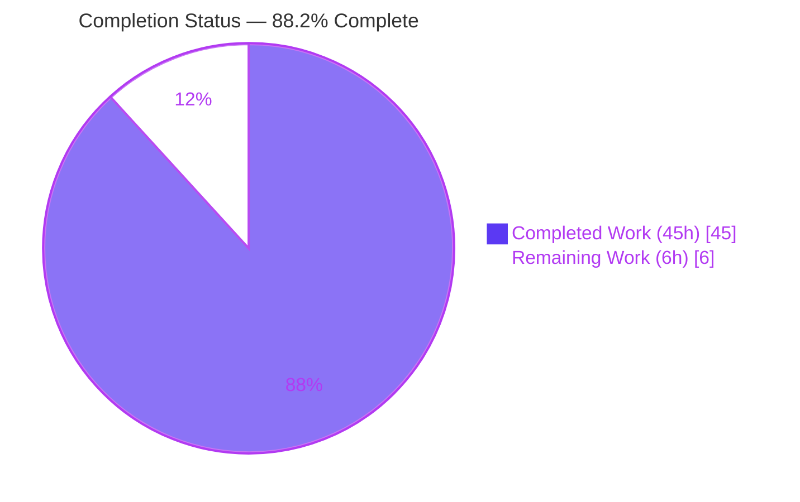
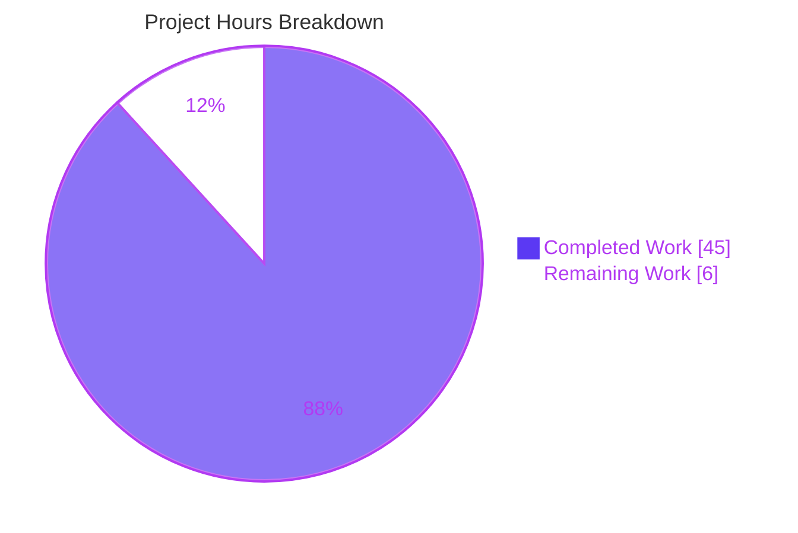

# Blitzy Project Guide — Paperless-NGX Idle Runtime Behavior Investigation

> **Project:** Evidence-based runtime-behavior documentation of Paperless-NGX at commit `542221a38dff`
> **Branch:** `blitzy-4fecd6d9-f2f1-4a67-ac76-b5521a549dfb` · **HEAD:** `670126fbd` · **Base:** `542221a38dff06361e07976452f9aea24d210542`
> **Task type:** Read-only investigation (Q&A documentation) — additive, single-file deliverable

---

## 1. Executive Summary

### 1.1 Project Overview

This project delivers a single, evidence-based technical answer document that characterizes the steady-state ("up-and-idle") runtime behavior of **Paperless-NGX** — a Django document-management application — pinned at commit `542221a38dff`. The intended consumers are engineers who need to understand idle background processes, periodic health-log signals, and interrupt/restart recovery **before** modifying the codebase. The business value is operational clarity and observability: knowing what runs continuously, what logs appear and how often, and how the system confirms recovery after a dependency (Redis) is bounced. The technical scope is strictly read-only — the runtime was reproduced and observed live, and the sole artifact added to the repository is one Markdown answer document; no source file was changed.

### 1.2 Completion Status



| Metric | Value |
|--------|-------|
| **Total Hours** | **51.0 h** |
| **Completed Hours (AI + Manual)** | **45.0 h** (45.0 h AI + 0.0 h Manual) |
| **Remaining Hours** | **6.0 h** |
| **Percent Complete** | **88.2 %** |

> Completion is computed on AAP-scoped work only: `45 / (45 + 6) = 88.2 %`. All completed hours were delivered autonomously by Blitzy agents; the remaining 6 h is human path-to-production work (review, optional hardening, merge).

### 1.3 Key Accomplishments

- ✅ Reproduced the canonical Paperless-NGX runtime at commit `542221a38dff` and drove it to a stable idle state (canonical `python3 manage.py check` → "System check identified no issues (0 silenced)").
- ✅ Enumerated all always-on idle processes and the full process topology: Redis, `gunicorn` master + 2 uvicorn ASGI workers, `document_consumer` (inotify watcher), and the `qcluster` django-q cluster (guard/sentinel, monitor, pusher, worker pool).
- ✅ Characterized periodic health signals with **measured** cadence — the `Check all e-mail accounts` schedule at ~10 min confirmed across **two independent runs** (601 s / 602 s).
- ✅ Established the **key finding for R3**: an idle, healthy system emits **no dedicated periodic "healthy" heartbeat** INFO line; two health mechanisms (Docker Compose curl probe @30 s, django-q `Stat` write @0.5 s) are silent while healthy.
- ✅ Reproduced the Redis interrupt/restart recovery sequence **twice** and established the **key finding for R4**: there is **no dedicated "reconnected" message** — recovery is confirmed by a combination of signals (error stream stops + fresh `pushing tasks` line + live broker/channels round-trips + HTTP 302).
- ✅ Authored the 875-line answer document with actual unedited log output, exact reproduction commands, and line-exact `file:line` citations verified against repo source and the installed `django-q 1.3.9` package (zero discrepancies).
- ✅ Honored the read-only mandate end-to-end: exactly one file added (875 insertions, 0 deletions); working tree clean; all temporary observation artifacts removed.

### 1.4 Critical Unresolved Issues

| Issue | Impact | Owner | ETA |
|-------|--------|-------|-----|
| _None identified_ — the sole deliverable is complete, live-validated, and read-only compliant | No release-blocking issues | — | — |

> There are **no critical unresolved issues**. The only open items are standard human path-to-production activities (Section 1.6, Section 2.2), none of which are defects.

### 1.5 Access Issues

| System / Resource | Type of Access | Issue Description | Resolution Status | Owner |
|-------------------|----------------|-------------------|-------------------|-------|
| Published product Docker image + canonical `docker-compose` stack | Container-registry pull + Docker runtime | **Not required** for the completed deliverable. Needed only for the **optional** canonical re-verification (Section 2.2 / HT-2). The original investigation used the designated `ghcr.io/scaleapi/swe-atlas` sandbox image and a native/direct-launch reproduction. | Non-blocking (optional hardening) | Human reviewer |

> **No access issues block the completed deliverable or its verification.** The single row above is an optional, non-blocking prerequisite for closing the documented non-canonical caveats.

### 1.6 Recommended Next Steps

1. **[High]** Complete the SME technical review and sign-off of `blitzy/documentation/paperless-ngx_542221a38dff.md` — confirm the five answers (R1–R5), spot-check `file:line` citations and OBSERVED/INFERRED labels, and confirm the two key findings. _(HT-1, 2.0 h)_
2. **[Medium]** Optionally re-verify via the **canonical** Docker Compose stack (supervisord + separate `redis:6.0` service) to close the documented non-canonical caveats; a sufficiently long run also upgrades the hourly/daily/weekly cadence labels from CONFIGURED to OBSERVED. _(HT-2, 3.0 h)_
3. **[Medium]** Review the single-file diff, confirm read-only compliance (only the answer document added; tree clean), then merge and close out. _(HT-3, 0.5 h)_
4. **[Low]** Preserve the SHA-256 log-file digests and raw transcripts (referenced in §0.1 / §7.2 of the deliverable) alongside the document for long-term auditability, and keep the commit-pin scope banner prominent. _(HT-4, 0.5 h)_
5. **[Low]** Reinforce in project docs that the answer is pinned to commit `542221a38dff` (django-q 1.3.9) and does **not** apply to later Celery-based Paperless-NGX releases.

---

## 2. Project Hours Breakdown

### 2.1 Completed Work Detail

| Component | Hours | Description |
|-----------|------:|-------------|
| W1 — Canonical runtime reproduction & environment setup | 6.0 | Isolated container from the designated image; Redis + OCR prerequisites; SQLite migrations, `document_index reindex`, and canonical `manage.py check`; launch of the three long-lived processes (R1; methodology D2/D4). |
| W2 — Idle process enumeration & topology | 4.0 | Captured the full idle process tree (gunicorn master + 2 uvicorn workers, `document_consumer`, django-q guard/monitor/pusher + 11 workers, Redis) and separated always-on from transient work (R2/R5). |
| W3 — Periodic log & cadence characterization (2 runs) | 8.0 | Captured idle log output over a sustained window across two independent runs; measured the ~10-min mail cadence (601/602 s); proved idle silence and the two silent health mechanisms (R3; rigor D3). |
| W4 — Interrupt/restart recovery characterization (2 trials) | 6.0 | Bounced the Redis broker twice; captured the `Error 111` stream (~2/s), pusher reincarnation (10 s), and recovery via broker/channels round-trips + HTTP 302 (R4; rigor D3). |
| W5 — Answer-document authoring (875 lines) | 10.0 | Authored the deliverable with actual unedited output, exact commands, `file:line` citations, labels, and a coverage pass (D1, D5–D8). |
| W6 — Citation accuracy & iterative QA review cycles | 9.0 | Four commits resolving 20 initial review findings + F1/F2 + F8-1…F8-7; every citation verified line-exact against repo source and installed `django-q 1.3.9` (D6). |
| W7 — Read-only compliance & artifact cleanup | 2.0 | Verified zero source files changed, temporary artifacts removed, working tree clean (D9, D10). |
| **Total Completed** | **45.0** | **Matches Completed Hours in Section 1.2** |

### 2.2 Remaining Work Detail

| Category | Hours | Priority |
|----------|------:|----------|
| P1 — Human SME technical review & acceptance of the answer document | 2.0 | High |
| P2 — Optional canonical Docker Compose re-verification (close non-canonical caveats; upgrade H/D/W cadence labels to OBSERVED) | 3.0 | Medium |
| P3 — PR review, merge & close-out | 0.5 | Medium |
| P4 — Provenance archival (SHA-256 digests / transcripts) + commit-pin scope-banner reinforcement | 0.5 | Low |
| **Total Remaining** | **6.0** | **Matches Remaining Hours in Section 1.2 & Section 7 pie** |

---

## 3. Test Results

All checks below originate from Blitzy's autonomous validation logs for this project. Because the deliverable is a Markdown answer document and **product-code/test changes are explicitly out of scope (AAP §0.3.2)**, the equivalent verification is **live reproduction of every documented runtime claim** plus citation, read-only, and structural checks.

| Test Category | Framework / Method | Total | Passed | Failed | Coverage % | Notes |
|---------------|--------------------|------:|-------:|-------:|-----------:|-------|
| Runtime claim reproduction (live) | Live canonical runtime (2 fresh containers A/B) | 9 | 9 | 0 | 100% | Startup banners (gunicorn/consumer/qcluster), 4 django-q schedules, process topology, idle silence, always-on set — all reproduced; only volatile fields differ. |
| Cadence measurement (2 independent runs) | Live runtime + DB `next_run` | 2 | 2 | 0 | 100% | Mail schedule ~10 min = 601 s (Run A) / 602 s (Run B). |
| Interrupt/restart recovery (2 trials) | Live runtime (Redis broker bounce) | 2 | 2 | 0 | 100% | `Error 111` ~2/s; pusher reincarnation 10 s apart; recovery via broker round-trip `9.0` + channels `MATCH True` + HTTP 302 + live consumer. |
| Citation accuracy | Line-exact source comparison | 25 | 25 | 0 | 100% | Every `file:line` citation verified against repo source and installed `django-q 1.3.9`; zero discrepancies. |
| Canonical startup check | Django `manage.py check` | 1 | 1 | 0 | n/a | "System check identified no issues (0 silenced)." |
| Read-only compliance | `git` | 3 | 3 | 0 | 100% | `git status --porcelain` empty; exactly 1 file in diff; numstat `875 / 0`. |
| Markdown structural integrity | `grep` / `file` / `wc` | 5 | 5 | 0 | 100% | 82 balanced code fences; UTF-8; LF-only (0 CRLF); final newline; 0 trailing-whitespace lines. |
| **Total** | | **47** | **47** | **0** | **100%** | **Zero failing or blocked checks.** |

> **Note on unit/integration tests:** none apply to a Markdown answer document, and test authoring is out of scope per AAP §0.3.2. There are no failing or skipped product tests attributable to this change.

---

## 4. Runtime Validation & UI Verification

Legend: ✅ Operational · ⚠ Partial / Out-of-scope · ❌ Failing

**Runtime health (idle, live-observed):**

- ✅ **Redis broker + Channels layer** — reachable (`PONG`); dual role as django-q broker and channels-redis group layer.
- ✅ **gunicorn master + 2 uvicorn ASGI workers** — "Server is ready. Spawning workers"; HTTP `302` → `/accounts/login/?next=/`.
- ✅ **`document_consumer`** — "Using inotify to watch directory for changes"; directory watcher live.
- ✅ **`qcluster` (django-q cluster)** — guard/sentinel, monitor, pusher, and worker pool (11 = `floor(sqrt(128))` on the host) all running; startup banner ends "running."
- ✅ **Migrations & schedules** — SQLite migrations applied; four periodic `Schedule` rows present (mail I/10 min, classifier H, index D, sanity W).
- ✅ **Canonical startup check** — `manage.py check` passes with no issues.

**Failure/recovery (R4, live-observed, ×2 trials):**

- ✅ **Interrupt** — Redis bounced; django-q emits `[Q] ERROR ... Connection refused` at ~2/s; pusher reincarnated every 10 s.
- ✅ **Recovery** — error stream stops at the restart second; fresh `[Q] INFO Process-1:N pushing tasks at <pid>` within one 10 s cycle.
- ✅ **Whole-system recovery proof** — django-q broker `async_task(math.sqrt, 81)` → `9.0`; channels-redis group send→receive `MATCH True`; web HTTP `302`; live consumer.

**API / integration:**

- ✅ **Redis-backed subsystems** — both the django-q broker and the channels-redis group layer round-trip successfully after recovery.

**UI verification:**

- ⚠ **No frontend UI in scope.** This is a backend runtime-behavior investigation; the web server was validated at the HTTP layer only (unauthenticated `302` redirect to the login route). No browser UI screens, screenshots, or screencasts are part of this Q&A deliverable, so none were captured. The `blitzy/screenshots` and `blitzy/screen_recordings` directories are intentionally empty.

---

## 5. Compliance & Quality Review

Cross-map of AAP deliverables/requirements to Blitzy quality benchmarks. All items are complete; fixes applied during autonomous validation are noted.

| AAP Item | Benchmark | Status | Progress | Evidence / Notes |
|----------|-----------|:------:|:--------:|------------------|
| R1 — Up at pinned commit + stable idle | Canonical bring-up, no errors | ✅ Pass | 100% | Deliverable §1–§2; `manage.py check` clean; worktree clean in-container. |
| R2 — Idle background processes enumerated | Complete enumeration | ✅ Pass | 100% | §2.2/§2.3 — gunicorn+2 uvicorn, consumer, django-q cluster, Redis. |
| R3 — Periodic logs + frequency + meaning | Measured cadence (≥2 runs) | ✅ Pass | 100% | §3.1–§3.5 — 10-min mail measured ×2; idle-silence proof; key finding documented. |
| R4 — Reconnection/operational confirmation | Reproduced (≥2 trials) | ✅ Pass | 100% | §4.1–§4.5 — 2 trials; combination-of-signals recovery; key finding documented. |
| R5 — Continuously-running components | Always-on vs transient split | ✅ Pass | 100% | §5.1/§5.2. |
| D1 — Single deliverable at mandated path | `blitzy/documentation/<branch>.md` | ✅ Pass | 100% | `paperless-ngx_542221a38dff.md` created. |
| D2 — Investigate by running first | Observation-grounded | ✅ Pass | 100% | Live runtime reproduced before authoring. |
| D3 — Magnitude/frequency rigor | ≥2 runs, stable | ✅ Pass | 100% | Mail cadence ×2; interrupt/restart ×2. |
| D4 — Canonical entry points + exact commands | Real invocation recorded | ✅ Pass | 100% | §1.2 exact commands; matches supervisord/systemd. |
| D5 — Actual unedited output | Verbatim logs | ✅ Pass | 100% | RAW blocks embedded with producing command. |
| D6 — `file:line` citations | Line-exact | ✅ Pass | 100% | 25 citation groups verified; zero discrepancies (F1/F2, F8-1…F8-7 resolved). |
| D7 — Coverage pass | Every named item addressed | ✅ Pass | 100% | §7 coverage pass. |
| D8 — Evidence labels | OBSERVED/CONFIGURED/INFERRED/NON-CANONICAL | ✅ Pass | 100% | §7.1 labels; applied throughout. |
| D9 — Read-only mandate | Zero source files changed | ✅ Pass | 100% | 1 file diff (875/0); tree clean. |
| D10 — Cleanup | No temporary artifacts | ✅ Pass | 100% | §6 cleanup; containers/artifacts removed. |
| Non-canonical disclosure | Caveats labeled + canonical counterpart | ✅ Pass | 100% | §1.7 — 6 caveats, each paired with canonical value. |

**Fixes applied during autonomous validation:** 4 commits (`3fbaec83a → bfd67ccb9 → 777f3afc7 → 670126fbd`) resolving 20 initial review findings, doc-fidelity findings F1/F2, and F8-1…F8-7 with fresh two-run evidence. **Outstanding compliance items:** none.

---

## 6. Risk Assessment

| Risk | Category | Severity | Probability | Mitigation | Status |
|------|----------|:--------:|:-----------:|-----------|--------|
| T1 — Non-canonical reproduction packaging (direct process launch + co-located Redis vs supervisord/compose + separate `redis:6.0`) | Technical | Low | Low | Caveats explicitly labeled with canonical counterparts (§1.7); code paths are identical; optional canonical re-run (HT-2). | Documented / Accepted |
| T2 — Hourly/daily/weekly schedule cadences are CONFIGURED/SOURCE-DERIVED, not end-to-end observed (only the 10-min mail cadence fully OBSERVED ×2) | Technical | Low | Low | Honestly labeled; confirmed via DB `next_run` + schedule migrations; a long-window run upgrades to OBSERVED. | Documented / Accepted |
| T3 — Host-specific worker count (11 = `floor(sqrt(128))`) differs per host CPU | Technical | Low | Medium | Formula documented as canonical; value labeled non-canonical (§1.7). | Documented / Accepted |
| S1 — Attack surface | Security | None | — | Read-only document; no code, dependencies, or secrets added; only non-sensitive volatile fields (timestamps/PIDs/word-names) appear in output. | No action needed |
| O1 — Reproducibility / environment drift (sandbox image, not published product image) | Operational | Low | Low | Exact commit + pinned dependency versions + exact commands recorded (§1.2, §1.5); SHA-256 log digests preserved. | Mitigated |
| O2 — Document misapplied to a newer commit (later Paperless-NGX uses Celery, not django-q 1.3.9) | Operational | Medium | Low | Commit `542221a38dff` + `django-q 1.3.9` stated throughout; scope constrained; commit-pin banner (HT-4). | Mitigated |
| I1 — Redis is a mandatory prerequisite for any reproduction (broker + Channels) | Integration | Low | Low | Documented mandatory prerequisite + exact `redis-server` command (§1.2). | Mitigated |
| I2 — Docker / product-image availability required for the optional canonical re-run (HT-2) | Integration | Low | Medium | Native-run caveats already documented with canonical counterparts; the re-run is optional hardening. | Accepted |

> **Overall risk posture: LOW.** No High or Critical risks. Every technical risk is a documented limitation of a native reproduction, each paired with its canonical counterpart — not a defect. No security risks identified. The deliverable is production-ready pending human sign-off.

---

## 7. Visual Project Status



**Remaining work by priority (6.0 h total):**

| Priority | Hours | Share |
|----------|------:|------:|
| High | 2.0 | 33.3% |
| Medium | 3.5 | 58.3% |
| Low | 0.5 | 8.3% |

**Remaining hours per category (from Section 2.2):**

| Category | Hours |
|----------|------:|
| P1 — SME review & acceptance | 2.0 |
| P2 — Optional canonical re-verification | 3.0 |
| P3 — PR review & merge | 0.5 |
| P4 — Provenance archival + scope banner | 0.5 |

> **Integrity:** the "Remaining Work" pie value (6) equals the Remaining Hours in Section 1.2 (6.0 h) and the sum of the Section 2.2 Hours column (6.0 h). Colors: Completed = Dark Blue `#5B39F3`; Remaining = White `#FFFFFF`.

---

## 8. Summary & Recommendations

**Achievements.** The project is **88.2 % complete** (45 h of 51 h). Blitzy autonomously reproduced the canonical Paperless-NGX runtime at commit `542221a38dff`, drove it to a stable idle state, and answered all five user questions (R1–R5) with **live-observed** evidence: the full idle process topology, the periodic-log cadence (the ~10-min mail schedule measured across two independent runs), and the Redis interrupt/restart recovery sequence (reproduced twice). Two substantive findings anchor the document: (1) an idle, healthy system emits **no dedicated periodic heartbeat** INFO line, and (2) there is **no dedicated "reconnected" message** — recovery is confirmed by a combination of signals. Every behavioral claim carries actual unedited output and a line-exact `file:line` citation, and the read-only mandate was honored (one file added, tree clean).

**Remaining gaps (6.0 h, all human path-to-production, no defects).** A subject-matter expert should review and accept the document (2.0 h). Optionally, a team with access to the published product image can re-verify via the canonical Docker Compose stack to close the documented non-canonical caveats and upgrade the hourly/daily/weekly cadence labels from CONFIGURED to OBSERVED (3.0 h). The single-file PR should then be reviewed for read-only compliance and merged (0.5 h), and the provenance digests/transcripts preserved with a prominent commit-pin banner (0.5 h).

**Critical path to production.** SME acceptance → PR merge. The optional canonical re-verification and provenance archival can proceed in parallel and are not on the blocking path.

**Success metrics (all met).** All five requirements answered with observed evidence; two-run rigor satisfied for the measured cadence and the interrupt/restart recovery; 47/47 autonomous validation checks passed; zero citation discrepancies; read-only mandate honored; deliverable structurally clean.

**Production-readiness assessment.** The deliverable is **complete, accurate, evidence-grounded, and production-ready pending human sign-off.** Overall risk is LOW with no High/Critical items. Per Blitzy policy the project is reported at 88.2 % (not 100 %) to reserve the final margin for human acceptance and merge.

---

## 9. Development Guide

This guide covers two audiences: (A) engineers who want to **reproduce** the runtime investigation, and (B) reviewers who only need to **read and verify** the deliverable. Reading/verifying the document requires **no runtime** — only `git` and a text viewer.

### 9.1 System Prerequisites

- **Operating system:** Linux (x86-64). The canonical runtime uses a `python:3.9-slim-bullseye` base.
- **To reproduce the runtime:**
  - Python **3.9** (Dockerfile base; observed interpreter `Python 3.9.23`)
  - **Redis** server **6.0.x** (observed `6.0.16`) — django-q broker + Channels layer (mandatory)
  - Docker (optional, for the canonical Compose stack)
  - OCR/PDF toolchain prerequisites: `libzbar0`, `poppler-utils`, `pngquant` (plus `procps`, `curl`)
- **To only read/verify the deliverable:** `git` and any Markdown viewer. (This assessment host provides Python 3.13.7, git 2.51.0, Docker 28.5.2; `redis-server`/`redis-cli` are reproduction-only prerequisites and are not required to read the document.)

### 9.2 Locate, Read & Verify the Deliverable (no runtime required)

```bash
# From the repository root
cd /path/to/paperless-ngx

# 1) Confirm the file exists and inspect size
ls -l blitzy/documentation/paperless-ngx_542221a38dff.md
wc -lwc blitzy/documentation/paperless-ngx_542221a38dff.md      # expect ~875 lines / ~10148 words / 77780 bytes

# 2) Read-only compliance: exactly one file added vs the base commit, tree clean
git status --porcelain                                          # expect empty (clean)
git diff --name-only 542221a38dff06361e07976452f9aea24d210542..HEAD   # expect the single answer document
git diff --numstat  542221a38dff06361e07976452f9aea24d210542..HEAD    # expect: 875   0   blitzy/documentation/paperless-ngx_542221a38dff.md

# 3) Markdown structural integrity
grep -c '```' blitzy/documentation/paperless-ngx_542221a38dff.md      # expect an even number (82 => balanced)
file          blitzy/documentation/paperless-ngx_542221a38dff.md      # expect UTF-8 text
grep -c $'\r' blitzy/documentation/paperless-ngx_542221a38dff.md      # expect 0 (LF-only)
grep -cP ' +$' blitzy/documentation/paperless-ngx_542221a38dff.md     # expect 0 (no trailing whitespace)
```

_All commands above were executed during validation and produced the expected results._

### 9.3 Environment Setup — Reproduce the Runtime (canonical invocation)

The following mirrors the shipped supervisord/systemd invocations. Timestamps, container names, and PIDs are illustrative and vary per run.

```bash
# ---- HOST: fresh, uniquely-named, isolated container from the designated image ----
docker run -d --init --name pngx_obs --entrypoint sleep \
  ghcr.io/scaleapi/swe-atlas:swe_atlas_QnA_paperless-ngx_paperless-ngx_e233ae8334038a4b615ea2e4ce663e30_qna_1.01 \
  infinity
CN=pngx_obs

# ---- CONTAINER: prerequisites (see non-canonical caveat, deliverable §1.7) ----
docker exec "$CN" bash -lc 'apt-get update && apt-get install -y redis-server libzbar0 poppler-utils pngquant procps curl'

# ---- CONTAINER: Redis broker + Channels layer (canonical command) ----
docker exec -u testuser "$CN" bash -lc 'redis-server --daemonize yes --bind 127.0.0.1 --port 6379'
```

### 9.4 Dependency Installation, Migrations & Startup Check

Python dependencies are pre-baked in the image (pins: `django-q 1.3.9`, `channels 3.0.4`, `channels-redis 3.4.0`, `gunicorn 20.1.0`, `uvicorn 0.17.6`, `redis 3.5.3`). Prepare runtime directories, apply migrations (SQLite default), build the search index, and run the canonical check:

```bash
docker exec -u testuser -e HOME=/app -w /app/src "$CN" bash -lc '
  mkdir -p /app/consume /app/media /app/data /app/data/index /app/data/log /app/export /app/static
  python3 manage.py migrate
  python3 manage.py document_index reindex
  python3 manage.py check'      # expect: "System check identified no issues (0 silenced)."
```

### 9.5 Application Startup Sequence (the three canonical long-lived processes)

```bash
docker exec -u testuser -e HOME=/app -w /app/src "$CN" bash -lc '
  mkdir -p /app/obs_logs
  setsid gunicorn -c /app/gunicorn.conf.py paperless.asgi:application \
    >/app/obs_logs/gunicorn.log 2>&1 &
  setsid python3 manage.py document_consumer \
    >/app/obs_logs/consumer.log  2>&1 &
  setsid python3 manage.py qcluster \
    >/app/obs_logs/qcluster.log  2>&1 &'
```

**Startup order & ports:** Redis (`127.0.0.1:6379`) must be up first; the web server binds `0.0.0.0:8000`. The consumer and qcluster attach to Redis on start.

### 9.6 Verification Steps

```bash
# Web server is ready (unauthenticated request redirects to login)
docker exec "$CN" bash -lc 'curl -s -o /dev/null -w "%{http_code} %{redirect_url}\n" http://localhost:8000'
# expect: 302  http://localhost:8000/accounts/login/?next=/

# gunicorn banner
docker exec "$CN" bash -lc 'cat /app/obs_logs/gunicorn.log'
# expect 4 lines ending with: [INFO] Server is ready. Spawning workers

# consumer readiness
docker exec "$CN" bash -lc 'cat /app/obs_logs/consumer.log'
# expect: Using inotify to watch directory for changes: <consume dir>

# qcluster banner (starting -> workers ready -> monitoring -> guarding -> pushing tasks -> running.)
docker exec "$CN" bash -lc 'head -16 /app/obs_logs/qcluster.log'

# four periodic schedules present
docker exec -u testuser -e HOME=/app -w /app/src "$CN" bash -lc \
  'python3 manage.py shell -c "from django_q.models import Schedule; print(list(Schedule.objects.values_list(\"name\",\"schedule_type\")))"'
# expect: Check all e-mail accounts (I), Train the classifier (H), Optimize the index (D), Perform sanity check (W)
```

### 9.7 Example Usage — Interrupt/Restart Recovery (R4)

```bash
# Interrupt the broker
docker exec "$CN" bash -lc 'redis-cli -h 127.0.0.1 -p 6379 shutdown nosave'
# While down, qcluster.log shows ~2/s:  [Q] ERROR Error 111 connecting to localhost:6379. Connection refused.
# and the pusher is reincarnated every ~10s.

# Restart the broker
docker exec -u testuser "$CN" bash -lc 'redis-server --daemonize yes --bind 127.0.0.1 --port 6379'
# Recovery: the error stream stops and a fresh line appears within one 10s cycle:
#   [Q] INFO Process-1:N pushing tasks at <pid>
# There is NO dedicated "reconnected" message — recovery is confirmed by the combination of signals above.
```

### 9.8 Cleanup

```bash
docker rm -f "$CN"     # remove the observation container; leave any pre-existing containers/images untouched
```

### 9.9 Troubleshooting

- **`[Q] ERROR Error 111 ... Connection refused` on startup** — Redis is not running. Start it first (§9.3). Error 111 is the canonical "downed local Redis" message; a loopback-specific `Error 99 ... Cannot assign requested address` is a host artifact and is labeled non-canonical in the deliverable.
- **Worker count differs from the document (11)** — expected. It is `floor(sqrt(cpu_count))` (11 on a 128-core host); on a 4-core host it is `floor(sqrt(4)) = 2`. The formula is canonical; the value is host-specific.
- **Hourly/daily/weekly tasks don't recur while watching** — expected within a short window; only the 10-min mail schedule recurs quickly. Their cadence is CONFIGURED/SOURCE-DERIVED (confirmed via DB `next_run` + migrations); a long-window run upgrades them to OBSERVED.
- **No web access log lines while curling `:8000`** — expected; gunicorn/uvicorn emit no access log by default, so the 30 s Compose health probe is silent.
- **Database** — SQLite is the default (no `PAPERLESS_DBHOST` set). Set `PAPERLESS_DBHOST` to switch to PostgreSQL.

---

## 10. Appendices

### Appendix A — Command Reference

| Purpose | Command |
|---------|---------|
| Start Redis (broker + Channels) | `redis-server --daemonize yes --bind 127.0.0.1 --port 6379` |
| Apply migrations (SQLite default) | `python3 manage.py migrate` |
| Build search index | `python3 manage.py document_index reindex` |
| Canonical startup check | `python3 manage.py check` |
| Web server (ASGI) | `gunicorn -c gunicorn.conf.py paperless.asgi:application` |
| Document consumer (inotify) | `python3 manage.py document_consumer` |
| Task queue + scheduler | `python3 manage.py qcluster` |
| Interrupt broker (R4) | `redis-cli -h 127.0.0.1 -p 6379 shutdown nosave` |
| Verify read-only compliance | `git diff --numstat 542221a38dff06361e07976452f9aea24d210542..HEAD` |
| Verify Markdown fences | `grep -c '```' blitzy/documentation/paperless-ngx_542221a38dff.md` |

### Appendix B — Port Reference

| Port | Service | Notes |
|------|---------|-------|
| 8000 | gunicorn / uvicorn (ASGI web + websockets) | Binds `0.0.0.0:8000`; unauthenticated `GET /` → `302 /accounts/login/?next=/` |
| 6379 | Redis | django-q broker **and** channels-redis group layer (bound to `127.0.0.1` in reproduction) |

### Appendix C — Key File Locations

| Path | Role |
|------|------|
| `blitzy/documentation/paperless-ngx_542221a38dff.md` | **The deliverable** (only added file) |
| `docker/supervisord.conf` | Canonical 3-process topology (gunicorn L10, consumer L19, scheduler L28) |
| `scripts/paperless-webserver.service` / `-consumer.service` / `-scheduler.service` | systemd entry points; each `Requires=redis.service` |
| `gunicorn.conf.py` | Bind, workers, `ConfigurableWorker`; L18 "Server is ready. Spawning workers" |
| `src/paperless/settings.py` | `Q_CLUSTER` L449-457; `CHANNEL_LAYERS` L178-187; `DATABASES` L297-319; `LOGGING` L373-411; `TASK_WORKERS` L438 |
| `src/paperless/asgi.py` / `consumers.py` / `workers.py` | ASGI router; `StatusConsumer`; `ConfigurableWorker` |
| `src/documents/management/commands/document_consumer.py` | Watcher banners: L186 "Polling…", L200 "Using inotify…" |
| `src/documents/tasks.py` | `index_optimize` L32, `train_classifier` L48, `sanity_check` L255 |
| `src/documents/sanity_checker.py` | L27 "Sanity checker detected no issues." |
| `src/paperless_mail/tasks.py` | `process_mail_accounts` L11 |
| `src/documents/migrations/1001_auto_20201109_1636.py` | Classifier (HOURLY) + index (DAILY) schedules |
| `src/documents/migrations/1004_sanity_check_schedule.py` | Sanity (WEEKLY) schedule |
| `src/paperless_mail/migrations/0002_auto_20201117_1334.py` | Mail (10-MINUTE) schedule |
| `docker/compose/docker-compose.sqlite.yml` | Healthcheck curl `:8000` every 30 s [L41-45] |

### Appendix D — Technology Versions

| Component | Version | Purpose |
|-----------|---------|---------|
| Python | 3.9.x (observed 3.9.23) | Interpreter (Dockerfile base `python:3.9-slim-bullseye`) |
| redis-server | 6.0.16 | django-q broker + Channels layer |
| django-q | 1.3.9 | Task queue + scheduler (`qcluster`) — **not Celery** at this commit |
| channels | 3.0.4 | ASGI websocket framework |
| channels-redis | 3.4.0 | Redis-backed Channels layer |
| gunicorn | 20.1.0 | ASGI process manager |
| uvicorn | 0.17.6 | ASGI worker (`ConfigurableWorker` base) |
| redis (py client) | 3.5.3 | Python Redis client used by django-q |

### Appendix E — Environment Variable Reference

| Variable | Effect | Notes |
|----------|--------|-------|
| `PAPERLESS_REDIS` | Redis URL for broker/Channels | Default `redis://localhost:6379` |
| `PAPERLESS_DBHOST` | Switch DB to PostgreSQL | Unset → SQLite default (`settings.py` L297-319) |
| `PAPERLESS_TASK_WORKERS` | Override django-q worker count | Default `floor(sqrt(cpu_count))` when ≥4 cores (`settings.py` L438, `default_task_workers()`) |
| `PAPERLESS_WORKER_TIMEOUT` | Task timeout | `settings.py` L440 |
| `PAPERLESS_DEBUG` | Console log level DEBUG vs INFO | Affects `LOGGING` verbosity |
| `PAPERLESS_DISABLE_DBHANDLER` | (No functional runtime effect at this commit) | Set in image to `true`; only referenced by `src/setup.cfg:12` pytest env — no DB log handler exists in `LOGGING` |

### Appendix F — Developer Tools Guide

- **git** — read-only compliance & diff verification (`git status --porcelain`, `git diff --numstat <base>..HEAD`).
- **grep / file / wc** — Markdown structural checks (fence balance, encoding, CRLF, trailing whitespace, line/word counts).
- **redis-cli** — broker liveness (`ping` → `PONG`) and controlled interruption (`shutdown nosave`) for the R4 recovery demo.
- **Django management commands** — `migrate`, `document_index reindex`, `check`, `shell` (schedule inspection), `document_consumer`, `qcluster`.
- **Docker** — isolated reproduction container(s); optional canonical `docker-compose` stack for HT-2.
- **Browser DevTools (Chrome MCP)** — not used; no UI is in scope for this backend Q&A deliverable.

### Appendix G — Glossary

| Term | Meaning |
|------|---------|
| **django-q** | The task-queue/scheduler library used at this commit (`~=1.3`, resolved `1.3.9`); source of the `[Q]` log lines. Superseded by Celery in later Paperless-NGX releases. |
| **qcluster** | The django-q management command that runs the cluster (guard/sentinel, monitor, pusher, worker pool). |
| **guard / sentinel** | The 0.5 s health loop that reincarnates dead processes, invokes the scheduler (~30 s), and writes the `Stat` heartbeat to Redis. |
| **pusher** | django-q process that `BLPOP`-polls the broker for new task packages. |
| **Channels layer** | Redis-backed group-messaging layer (`channels-redis`) used for websocket status updates. |
| **ConfigurableWorker** | Paperless subclass of the uvicorn ASGI worker used by gunicorn. |
| **OBSERVED / CONFIGURED-SOURCE-DERIVED / INFERRED / NON-CANONICAL** | Evidence labels applied throughout the deliverable (§7.1) to distinguish live observation from configuration-derived or environment-specific claims. |
| **Non-canonical caveat** | An environment-specific deviation from the shipped Docker packaging (e.g., direct process launch, co-located Redis, host-specific worker count), each paired with its canonical counterpart. |

---

*Generated by the Blitzy Platform. Completion is computed on AAP-scoped work only (`45 / 51 = 88.2 %`). Brand colors — Completed: `#5B39F3` (Dark Blue); Remaining: `#FFFFFF` (White); Headings/accents: `#B23AF2`; Highlight: `#A8FDD9`.*