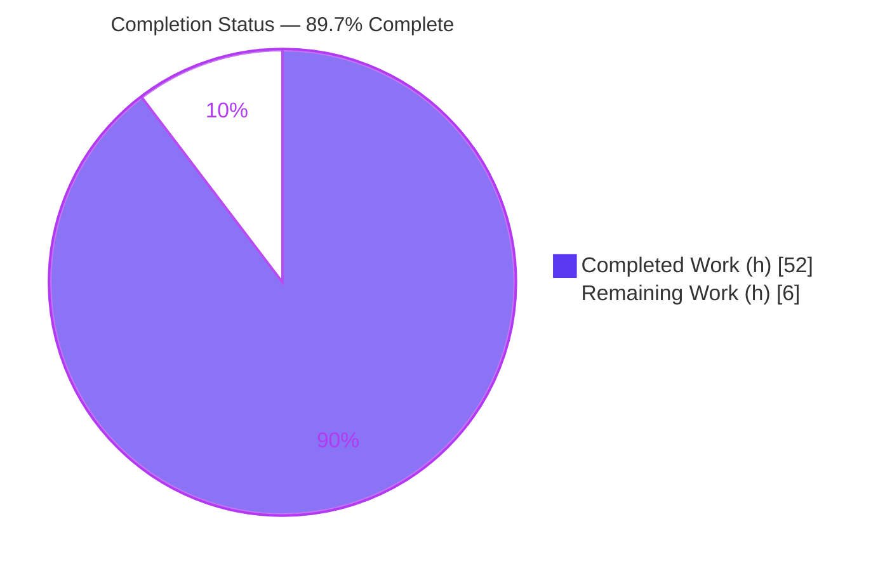
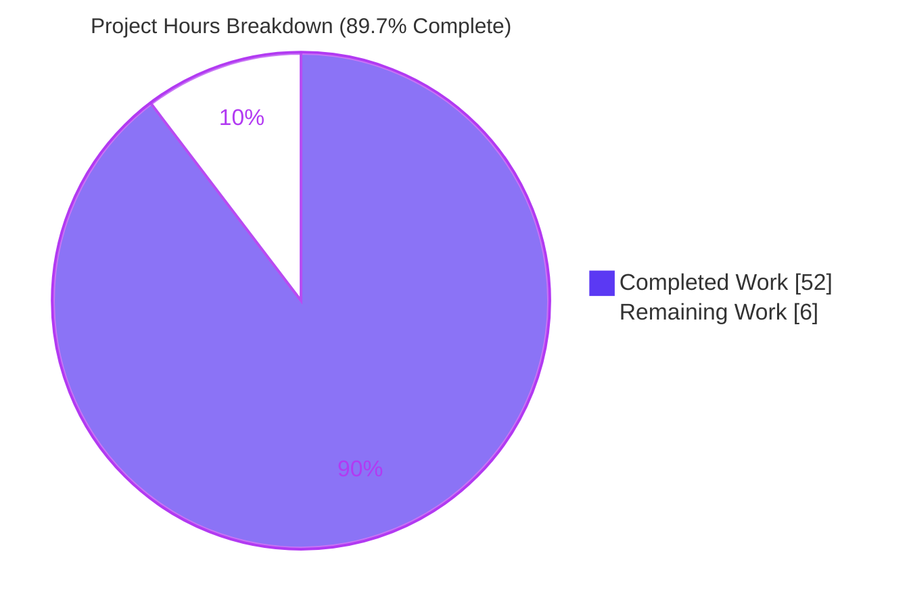
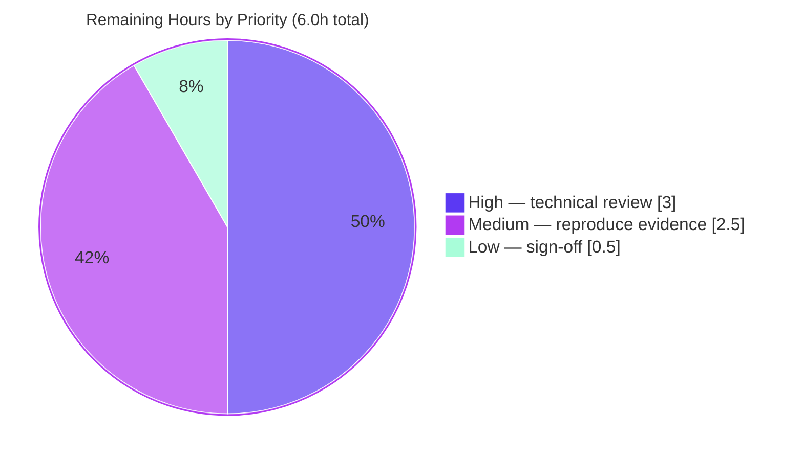

# Blitzy Project Guide — paperless-ngx ML Classification, OCR & Barcode Investigation

> **Deliverable type:** Read-only technical Q&A / documentation investigation
> **Project:** paperless-ngx @ commit `542221a38dff06361e07976452f9aea24d210542`
> **Branch:** `blitzy-4898f569-a9c9-44f0-8441-e5d3f590b862`
> **Governing rule set:** SWE-AtlasQnA-Repo
> **Brand legend:** <span style="color:#5B39F3">■ Completed / AI Work (Dark Blue #5B39F3)</span> · <span style="color:#B23AF2">■ Remaining / Not Completed (White #FFFFFF, rendered on a Violet-Black #B23AF2 accent)</span>

---

## 1. Executive Summary

### 1.1 Project Overview

This project delivers a single, evidence-grounded technical answer document that explains — from **actually observed runtime behavior** — how the paperless-ngx machine-learning document-classification pipeline behaves during test execution. It exists to help a developer debug non-deterministic failures in the document-classification test suite. The investigation spans four question groups (classifier reuse-vs-retrain and cross-test isolation; automatic correspondent matching; no-extractable-text OCR handling and mime assignment; barcode-driven document splitting) plus a root-cause analysis of the reported non-determinism. The task is strictly **read-only**: the only artifact written is one Markdown answer document; every source, test, and fixture file is exercised at runtime and cited by `file:line` but never modified.

### 1.2 Completion Status

The completion percentage is calculated using AAP-scoped hours only (PA1 methodology): all autonomous investigation and authoring work is complete, committed, and validator-confirmed with zero discrepancies. The remaining hours represent the human review/acceptance gate that is the true path-to-production for a debugging answer document.



**Completion: 89.7% (52.0 completed hours / 58.0 total hours)**

| Metric | Hours |
|--------|------:|
| **Total Hours** | 58.0 |
| **Completed Hours (AI + Manual)** | 52.0 |
| &nbsp;&nbsp;• AI (autonomous Blitzy agents) | 52.0 |
| &nbsp;&nbsp;• Manual (human) to date | 0.0 |
| **Remaining Hours** | 6.0 |
| **Percent Complete** | **89.7%** |

### 1.3 Key Accomplishments

- ✅ **All four question groups answered from executed output** — Q1 (classifier reuse vs. retrain), Q2 (correspondent matching), Q3 (no-text OCR + mime), Q4 (barcode splitting) — each structured as Direct Answer → Mechanism (`file:line`) → Commands Run → Verbatim Observed Output → Rationale.
- ✅ **Root cause of the reported non-determinism identified and reproduced** — unseeded `MLPClassifier` (no `random_state`) at `classifier.py:219/227/238`; reproduced with byte-identical input at scale (N=30 fresh models × 4 runs).
- ✅ **Run-first methodology honored** — every behavioral claim backed by a captured command result; each magnitude/timing value confirmed stable across ≥2 runs.
- ✅ **Read-only constraint perfectly honored** — `git diff --name-only 542221a38..HEAD -- src/` is empty; the only added file is the answer document (`A blitzy/documentation/paperless-ngx_542221a38dff.md`, 2398 insertions).
- ✅ **All evidence entry-point tests pass** in the canonical Python 3.9.23 container; every cited code path exercised via its real entry point.
- ✅ **Deliverable structurally complete** — 2398 lines / 155,425 bytes; 11 H2 sections, 43 H3 subsections, balanced fenced code blocks, zero placeholder markers; Final Coverage Checklist enumerates every sub-item.
- ✅ **Temporary observation probes removed** from both host and container; source tree left byte-for-byte unchanged aside from the answer document.

### 1.4 Critical Unresolved Issues

There are **no unresolved issues that block the deliverable**. The single substantive open item is not a defect in this task's scope — it is the source-code non-determinism that the user must fix in a **separate, follow-up code-change task** (explicitly out of scope here per AAP §0.3.2, which mandates "observe and explain, not fix").

| Issue | Impact | Owner | ETA |
|-------|--------|-------|-----|
| Classifier non-determinism persists (unseeded `MLPClassifier`, `classifier.py:219/227/238`) — the answer explains the root cause but does **not** fix it (out of scope) | Flaky document-classification test failures will continue until a `random_state` seed is added; this is the **key stakeholder takeaway** | Human developer (separate code-change task) | 2–4h follow-up (not part of this deliverable's 6.0h) |
| Human technical review & acceptance of the answer document not yet performed | Deliverable cannot be formally accepted/closed until reviewed and signed off | Reviewing engineer + stakeholder | 6.0h (see §2.2) |

### 1.5 Access Issues

**No access issues identified.** The entire investigation ran inside the canonical container (`ghcr.io/scaleapi/swe-atlas:…qna_1.01`) with all pinned dependencies and system binaries (Tesseract, Ghostscript, poppler, libzbar, qpdf) present. No repository permissions, service credentials, or third-party API access were required or blocked.

| System/Resource | Type of Access | Issue Description | Resolution Status | Owner |
|-----------------|----------------|-------------------|-------------------|-------|
| — | — | No access issues identified | N/A | — |

### 1.6 Recommended Next Steps

1. **[High]** Perform the technical review of the answer document — read Q1–Q4 + Non-Determinism + the Final Coverage Checklist and spot-check `file:line` citations against the source at commit `542221a38dff`. *(3.0h)*
2. **[Medium]** Reproduce the key evidence in the canonical container — build the derived image (adds `libzbar0` + `poppler-utils`), run the cited pytest entry points and observation probes, and confirm ≥2-run stability. *(2.5h)*
3. **[Low]** Obtain stakeholder sign-off and close the debugging investigation. *(0.5h)*
4. **[High — separate follow-up task, out of this deliverable's scope]** Fix the flaky classification tests by adding a deterministic `random_state` to the `MLPClassifier` constructor(s) at `classifier.py:219/227/238`. This is the actionable remedy the investigation points to; estimate 2–4h as its own code-change project.

---

## 2. Project Hours Breakdown

### 2.1 Completed Work Detail

Each completed component traces to a specific AAP requirement (question group, environment setup, web validation, document assembly, or read-only compliance). The Hours column sums to the **Completed Hours (52.0)** in Section 1.2.

| Component | Hours | Description |
|-----------|------:|-------------|
| Environment / Reproduction (§1) | 5.0 | Canonical container build (pull + derived image adding `libzbar0`/`poppler-utils`), exact `docker build`/`exec` commands, dependency-pin & system-binary verification, ≥2-run stability capture |
| Q1 — Classifier reuse vs. retrain + cross-test | 7.0 | `data_hash` SHA-1 retrain guard (`True→False→True`, `classifier.py:161-164`); `load_classifier()` no-cache disk read every call (`classifier.py:30-57`); per-test `MODEL_FILE` isolation (`utils.py:45`); pytest-xdist 128-worker parallelism |
| Q2 — Automatic correspondent matching | 7.0 | Training-doc counts (1 / 2, inbox-excluded 2→1, `classifier.py:125-127`); insert-then-train ordering; **no confidence threshold** — argmax `predict()` + sentinel `-1` (`classifier.py:251-260`, `predict()`=2 / `predict_proba()`=0 calls); fuzzy gate clarified (`matching.py:135`) |
| Q3 — No-extractable-text OCR + mime | 7.0 | OCR subprocess `ocrmypdf.ocr(**args)` (`parsers.py:261` primary, `:298` force-OCR retry); fallback chain to `text=""` (`parsers.py:264-327`); mime from `magic.from_file(self.path)` (`consumer.py:219`), unchanged by empty OCR; invocation counts 1 / 2 |
| Q4 — Barcode splitting | 7.0 | Record count = `len(separators)+1` files but **zero `Document` rows synchronously** ("File successfully split", `tasks.py:233`); `PATCHT` trigger (`settings.py:506`) across Code39/128/QR; decision site `scan_file_for_separating_barcodes()` (`tasks.py:96-110`); training-data effect analysis |
| Non-Determinism root-cause analysis | 5.0 | Unseeded `MLPClassifier` (no `random_state`, `classifier.py:219/227/238`); reproduced byte-identical N=30 × 4 runs (borderline query flips, distinctive query stable); xdist compounding layer |
| External web validations | 2.0 | scikit-learn `MLPClassifier.predict()` argmax semantics (settles Q2 "no threshold"); `PATCHT` separator semantics (Q4) |
| Document assembly | 6.0 | Table of Contents, Final Coverage Checklist (every sub-item w/ value + `file:line` + evidence + variants + rationale), Appendix A (Read-Only Proof), Appendix B (Complete Raw Command Logs), Appendix C (Probe Sources); markdown-integrity pass |
| Code-review / QA / evidence-fidelity iterations | 4.0 | Three post-initial commits addressing code-review findings, QA final-gate evidence fidelity, and the Q3 OCR pass-label correction |
| Read-only compliance + temp-probe cleanup | 2.0 | Confirmed zero source changes; removed all temporary observation probes from host + container; repository-unchanged proof captured in Appendix A |
| **Total Completed** | **52.0** | |

### 2.2 Remaining Work Detail

All remaining work is the human review/acceptance path-to-production for a Q&A deliverable. Each category traces to a specific production-gate need. The Hours column sums to the **Remaining Hours (6.0)** in Section 1.2 and equals the "Remaining Work" value in the Section 7 pie chart.

| Category | Hours | Priority |
|----------|------:|----------|
| Technical review of the answer document vs. source `file:line` citations at commit `542221a38dff` (read Q1–Q4 + Non-Determinism + coverage checklist; verify each behavioral claim) | 3.0 | High |
| Reproduce key evidence in the canonical container (build derived image, run cited pytest entry points + observation probes, confirm ≥2-run stability) | 2.5 | Medium |
| Stakeholder sign-off / acceptance (accept as the definitive answer and close the investigation) | 0.5 | Low |
| **Total Remaining** | **6.0** | |

> **Note:** The follow-up code change to add `random_state` and fix the flaky tests (est. 2–4h) is a **separate task, out of scope** for this read-only deliverable per AAP §0.3.2, and is therefore **excluded** from the 6.0h above so the completion math reflects only AAP-scoped work.

### 2.3 Hours Reconciliation Summary

| Check | Result |
|-------|--------|
| Section 2.1 Completed total | 52.0h |
| Section 2.2 Remaining total | 6.0h |
| Section 2.1 + Section 2.2 = Total (Section 1.2) | 52.0 + 6.0 = **58.0h** ✅ |
| Completion % = 52.0 / 58.0 × 100 | **89.7%** ✅ |
| Remaining hours identical in §1.2, §2.2, §7 | 6.0h ✅ |

---

## 3. Test Results

All tests below originate from **Blitzy's autonomous validation logs** for this project, executed in the canonical Python 3.9.23 container via the project's own command (`cd /app/src && pipenv run pytest …`, which auto-loads `src/setup.cfg` with `--numprocesses auto`). These are the exact evidence entry points the answer document cites; they were re-run by the Final Validator with zero discrepancies. This is a read-only investigation, so **no new tests were added** to the source tree — every test is a pre-existing repository test exercised as an evidence entry point.

| Test Category | Framework | Total Tests | Passed | Failed | Coverage % | Notes |
|---------------|-----------|:-----------:|:------:|:------:|:----------:|-------|
| Q1 — Classifier reuse/retrain & isolation | pytest 8.4.2 + pytest-xdist | 4 | 3 | 0 | n/a (evidence subset) | `testDatasetHashing`, `testSaveClassifier`, `test_load_and_classify` PASS; `test_load_classifier_cached` **SKIPPED by design** (`@pytest.mark.skip("Disabled caching due to high memory usage")`) |
| Q2 — Correspondent matching | pytest 8.4.2 | 4 | 4 | 0 | n/a (evidence subset) | `test_one_correspondent_predict`, `test_one_correspondent_predict_manydocs`, `testTrain`, `testPredict` PASS |
| Q3 — No-text OCR + mime | pytest 8.4.2 | 4 | 4 | 0 | n/a (evidence subset) | `test_encrypted`, `test_with_form_error_notext`, `test_skip_noarchive_notext`, `test_ocrmypdf_parameters` PASS (require container OCR binaries) |
| Q4 — Barcode detection & splitting | pytest 8.4.2 | 25 | 25 | 0 | n/a (evidence subset) | `barcode_reader`, `scan_file_for_separating_barcodes`, `separate_pages` symbology/count tests PASS (15 unrelated selected-out); require container `libzbar0`/poppler |
| **Total (evidence entry points)** | pytest 8.4.2 | **37** | **36** | **0** | — | 1 SKIPPED by design (caching disabled), 0 failures |

**Non-determinism note (subject of the investigation, not a test defect):** The classifier's run-to-run variability was reproduced *deliberately* with byte-identical input (N=30 fresh models × 4 runs) as the empirical anchor for the answer. Because the `MLPClassifier` is constructed with no `random_state`, this variability is an intrinsic source-code property, not a flaky-test bug to be fixed within this read-only task.

---

## 4. Runtime Validation & UI Verification

**UI verification: Not applicable.** This deliverable has no user-facing UI; it is a Markdown answer document. No frontend (`src-ui/` Angular app) work was in scope. The "runtime validation" below concerns the investigated backend code paths that were exercised to produce the evidence.

**Runtime health of the investigated code paths (all exercised via their real entry points):**

- ✅ **Operational** — `DocumentClassifier.train()` / `data_hash` retrain guard: observed `True → False → True` across an unchanged dataset (`classifier.py:161-164`).
- ✅ **Operational** — `load_classifier()`: re-reads `settings.MODEL_FILE` from disk every call, returns `None` when absent, no in-memory cache (`classifier.py:30-57`).
- ✅ **Operational** — `predict_correspondent()` / `MLPClassifier.predict()`: argmax label + sentinel `-1` gate; instrumentation confirmed `predict()`=2 calls, `predict_proba()`=0 calls (`classifier.py:251-260`).
- ✅ **Operational** — `RasterisedDocumentParser.parse()` → `ocrmypdf.ocr(**args)`: OCR subprocess drives Tesseract 4.1.1; empty-text fallback yields `text=""` (`parsers.py:261/298/316-327`).
- ✅ **Operational** — mime detection via `magic.from_file(self.path, mime=True)`: PDF stays `application/pdf`, PNG stays `image/png` regardless of empty OCR text (`consumer.py:219`).
- ✅ **Operational** — `scan_file_for_separating_barcodes()` / `separate_pages()` / `consume_file()` with barcodes enabled: `PATCHT` detected across Code39/128/QR; split yields `len(separators)+1` files and returns "File successfully split" with **zero `Document` rows created synchronously** (`tasks.py:96-110/113-161/233`).
- ⚠ **Partial (environment-gated)** — Q3 (OCR) and Q4 (barcode) paths **cannot run in the bare sandbox** (missing Tesseract/Ghostscript/poppler/libzbar); they were validated **inside the canonical container**. A reviewer must build the derived image to reproduce them (see §9).
- ✅ **Operational** — Per-test isolation via `DirectoriesMixin`: fresh `tempfile.mkdtemp()` `MODEL_FILE` per test, `rmtree`-d at teardown (`utils.py:45`); pytest-xdist spins 128 worker processes on the 128-CPU host.

**API integration outcomes:** No external APIs are invoked at runtime. Two external documentation validations (scikit-learn `predict()` semantics; `PATCHT` separator semantics) were performed during scope discovery to corroborate observed behavior.

---

## 5. Compliance & Quality Review

This matrix cross-maps the governing SWE-AtlasQnA-Repo rule set and AAP deliverables to their compliance status, including fixes applied during autonomous validation.

| Benchmark / Rule | Requirement | Status | Progress | Notes |
|------------------|-------------|:------:|:--------:|-------|
| Deliverable location & name (§0.7.1) | Single `.md` at `blitzy/documentation/<branch>.md` | ✅ Pass | 100% | `blitzy/documentation/paperless-ngx_542221a38dff.md` created; net-new `blitzy/` tree |
| Read-only source (§0.7.1) | Zero modify/create/delete of existing repo files | ✅ Pass | 100% | `git diff --name-only … -- src/` empty; only the answer doc added |
| Run-first methodology (§0.7.2) | Build & run code paths, capture real output before writing | ✅ Pass | 100% | Every claim backed by captured output; probes created then removed |
| Magnitude/frequency/timing (§0.7.2) | Observe at scale; confirm ≥2-run stability | ✅ Pass | 100% | data_hash deterministic across runs; non-determinism reproduced at N=30 × 4 runs |
| Reproduce reported inconsistency (§0.7.2) | Same unchanged input repeatedly; report distribution | ✅ Pass | 100% | Borderline-query flips reported as a distribution, not stabilized away |
| Real entry point (§0.7.2) | Exercise via canonical invocation, not a bypass | ✅ Pass | 100% | `pipenv run pytest …` + real function calls in probes |
| Canonical build/config (§0.7.2) | Default configuration; state exact commands | ✅ Pass | 100% | Container pull/build/exec + Dockerfile recorded in doc §1 |
| Evidence: actual output for every claim (§0.7.3) | Complete, unedited output alongside its command | ✅ Pass | 100% | Verbatim logs embedded; Appendix B holds complete raw logs |
| Answer every part / coverage pass (§0.7.3) | Decompose question; confirm each sub-item answered | ✅ Pass | 100% | Final Coverage Checklist enumerates each sub-item w/ value + `file:line` + evidence |
| Exact & grounded (`file:line`) (§0.7.3) | Every factual claim carries a code ref or observed output | ✅ Pass | 100% | All claims cite exact `file:line`; inferred items labeled |
| Cleanup (§0.8.1) | Temporary helpers removed; tree unchanged | ✅ Pass | 100% | Probes removed from host + container; verified clean |
| Markdown integrity | Balanced fences, no placeholders, resolvable ToC anchors | ✅ Pass | 100% | 11 H2 / 43 H3, balanced code fences, 0 TODO/FIXME/PLACEHOLDER |

**Fixes applied during autonomous validation:** three iterative commits after the initial draft — (1) code-review findings, (2) QA final-gate evidence-fidelity findings, (3) a Q3 OCR pass-label correction (skip → redo). The Final Validator re-ran all five question groups and found **zero discrepancies**, so no further corrections were required.

**Outstanding compliance items:** None. Human technical review (§2.2) is a normal acceptance step, not a compliance gap.

---

## 6. Risk Assessment

Overall posture: **LOW.** This task added exactly one Markdown document with zero source/dependency/configuration changes, so there is no deployment, runtime-service, or attack-surface risk. Risks concern documentation accuracy, reproducibility, and the subject matter itself.

| Risk | Category | Severity | Probability | Mitigation | Status |
|------|----------|----------|-------------|------------|--------|
| **T1** — Classifier non-determinism persists (unseeded `MLPClassifier`, `classifier.py:219/227/238`); the answer explains but does not fix it (out of scope) | Technical | Medium | High | Human adds `random_state=<seed>` to the `MLPClassifier` constructor(s) in a separate code-change task — **the key stakeholder takeaway** | Documented by design |
| **T2** — `file:line` citations pinned to commit `542221a38dff`; a different version may mismatch line numbers/module layout (barcode logic later refactored to `barcodes.py`; pluggable PYZBAR/ZXING scanner is a later addition) | Technical | Low–Med | Medium | Doc names the exact commit + branch and flags the later refactor | Mitigated |
| **T3** — OCR/barcode outputs depend on exact system-binary versions (tesseract 4.1.1, poppler 20.09.0, libzbar 0.23.90, ghostscript 9.53.3, qpdf 10.1.0) | Technical | Low | Low | Canonical container pins versions; doc §1 records them verbatim | Mitigated |
| **S1** — Security-relevant change | Security | None / Informational | N/A | Read-only investigation; only a Markdown doc added; no code, dependencies, credentials, or production systems touched | N/A |
| **O1** — Reproducing Q3/Q4 requires the canonical container; the bare sandbox lacks the OCR/barcode binaries | Operational | Medium | Medium | Doc §1 provides exact `docker pull`/`build`/`exec` commands + the derived Dockerfile | Mitigated |
| **O2** — Derived image adds two system deps (`libzbar0`, `poppler-utils`) absent from the base image; reviewer must rebuild to reproduce Q4 | Operational | Low | Medium | Build steps fully documented in §1 (mirrors project CI `reusable-ci-backend.yml`) | Mitigated |
| **I1** — Deliverable value depends on evidence fidelity to real behavior | Integration / Doc-accuracy | Low | Low | Run-first methodology, real entry points, ≥2-run stability; Final Validator re-ran all 5 groups with zero discrepancies | Validated |
| **I2** — Some observed values are ephemeral (object `id()`s, tmpdir paths, per-run hash digests); a reviewer might expect identical values | Integration / Doc-accuracy | Low | Low | Doc explicitly labels ephemeral values as run-to-run varying | Mitigated |
| **I3** — Completeness (every named sub-item answered) | Integration / Doc-accuracy | Low | Low | Final Coverage Checklist enumerates each Q1–Q4 + non-determinism sub-item with value / `file:line` / evidence / variants / rationale | Validated |

---

## 7. Visual Project Status

**Project hours breakdown** — the "Completed Work" and "Remaining Work" values equal the Completed (52) and Remaining (6) hours in Section 1.2 and the Section 2.1 / 2.2 totals.



**Remaining work by priority** — distribution of the 6.0 remaining hours across the human review/acceptance tasks in Section 2.2.



**Remaining hours per category (bar view):**

| Category | Hours | Bar |
|----------|------:|-----|
| High — Technical review of answer doc | 3.0 | ████████████ |
| Medium — Reproduce evidence in container | 2.5 | ██████████ |
| Low — Stakeholder sign-off | 0.5 | ██ |
| **Total** | **6.0** | |

---

## 8. Summary & Recommendations

**Achievements.** The project is **89.7% complete** (52.0 of 58.0 AAP-scoped hours). All autonomous work is finished: the four question groups (Q1–Q4) and the implicit non-determinism root-cause analysis are answered from executed runtime output, each with `file:line` mechanism references, verbatim command logs, and rationale. The single deliverable — `blitzy/documentation/paperless-ngx_542221a38dff.md` (2398 lines) — is committed, structurally sound, and validator-confirmed with zero discrepancies. The read-only constraint was honored perfectly: the source tree is byte-for-byte unchanged aside from the answer document.

**Remaining gaps (6.0h) and critical path to production.** The remaining work is entirely the human review/acceptance gate, which is the true "production" step for a debugging answer: (1) technical review of the document against the cited source (3.0h, High), (2) reproduction of the key evidence in the canonical container (2.5h, Medium), and (3) stakeholder sign-off (0.5h, Low). The critical path is review → reproduce → accept.

**The key takeaway for stakeholders.** The investigation definitively locates the root cause of the reported flaky classification tests: the `MLPClassifier` is constructed **without a `random_state`** (`classifier.py:219/227/238`), so its weights are re-randomized on every fit, and predictions on borderline inputs flip run-to-run — reproduced here with byte-identical input at scale. Because this task is read-only by mandate, the fix is **not** applied here; the recommended follow-up (a separate 2–4h code-change task) is to add a deterministic `random_state` seed. This gap is why the tests remain flaky today and is the single most important action item beyond accepting the document.

**Success metrics.** ✅ Every AAP question sub-item answered (Final Coverage Checklist); ✅ zero source changes (read-only); ✅ all evidence entry-point tests pass in the canonical container; ✅ non-determinism reproduced, not stabilized; ✅ all cross-section hour totals reconcile (52 + 6 = 58; 89.7%).

**Production readiness assessment.** For a documentation deliverable, "production ready" means *complete, accurate, reproducible, and reviewable* — all satisfied. The document is ready for human technical review; upon sign-off it can be delivered to the user as the definitive answer, with the `random_state` fix tracked as the natural follow-on.

| Metric | Value |
|--------|-------|
| AAP requirement groups completed | 9 / 9 |
| Partially completed / Not started (AAP-scoped) | 0 / 0 |
| Completion (AAP-scoped hours) | 89.7% |
| Source files modified | 0 |
| Deliverable size | 2398 lines / 155,425 bytes |
| Evidence tests passing / skipped-by-design / failing | 36 / 1 / 0 |

---

## 9. Development Guide

This guide explains how to reproduce every observation in the answer document. Commands are split into **sandbox-runnable** (git/file/structure/`py_compile` checks — verified live) and **container-only** (OCR/barcode paths that need system binaries). All container commands are transcribed verbatim from the answer document's Environment section (§1).

### 9.1 System Prerequisites

- **Docker** 28.x (host used: 28.5.2) with ~2 GB free disk for the image.
- **Canonical runtime (inside the image):** Python 3.9.23, pipenv 2025.0.4.
- **System binaries (inside the image):** Tesseract 4.1.1, Ghostscript 9.53.3, poppler (`pdftoppm`) 20.09.0, libzbar 0.23.90, qpdf 10.1.0.
- **Bare-sandbox tooling (for read-only checks):** Git, Python 3 (any 3.9+; `py_compile` of the cited modules passes even under 3.13).

> **Why a container?** The OCR (Q3) and barcode (Q4) code paths depend on Tesseract/Ghostscript/poppler/libzbar, which are **absent from the bare sandbox**. Q1/Q2 and all read-only verification run anywhere, but Q3/Q4 must run in the container.

### 9.2 Environment Setup (canonical container)

```bash
# host: Docker version 28.5.2

# (1) Pull the canonical SWE-Atlas paperless-ngx Q&A image
docker pull ghcr.io/scaleapi/swe-atlas:swe_atlas_QnA_paperless-ngx_paperless-ngx_e233ae8334038a4b615ea2e4ce663e30_qna_1.01

# (2) Build a thin DERIVED image adding the two libs the base image lacks
#     (libzbar0 for pyzbar, poppler-utils for pdf2image — required by Q4).
#     Build context /tmp/paperless-qna-build/ contains only the Dockerfile below.
docker build -t paperless-ngx-qna:local /tmp/paperless-qna-build

# (3) Start the container detached (no host bind mount; baked, testuser-owned /app)
docker run -d --name paperless-qna-baked paperless-ngx-qna:local -c "sleep infinity"

# (4) Issue every observation run as the non-root testuser (/app/src == repo src/)
docker exec -u testuser paperless-qna-baked bash -lc 'cd /app/src && <command>'
```

Derived image `Dockerfile` (build context `/tmp/paperless-qna-build/Dockerfile`):

```dockerfile
FROM ghcr.io/scaleapi/swe-atlas:swe_atlas_QnA_paperless-ngx_paperless-ngx_e233ae8334038a4b615ea2e4ce663e30_qna_1.01
USER root
ARG DEBIAN_FRONTEND=noninteractive
RUN apt-get update -qq \
 && apt-get install -y --no-install-recommends \
      libzbar0 \
      poppler-utils \
      zbar-tools \
      pngquant \
 && rm -rf /var/lib/apt/lists/* \
 && git config --global --add safe.directory /app \
 && git config --global --add safe.directory '*'
```

### 9.3 Dependency Verification

Confirm the canonical toolchain and dependency pins (run inside the container):

```bash
docker exec -u testuser paperless-qna-baked bash -lc '
  python --version                                   # Python 3.9.23
  pipenv --version                                   # pipenv, version 2025.0.4
  tesseract --version 2>&1 | head -n1                # tesseract 4.1.1
  gs --version                                       # 9.53.3
  pdftoppm -v 2>&1 | head -n1                         # pdftoppm version 20.09.0
  qpdf --version | head -n1                           # qpdf version 10.1.0
  python -c "import pyzbar;  print(pyzbar.__version__)"   # 0.1.9
  python -c "import sklearn; print(sklearn.__version__)"  # 1.0.2
'
```

Key pip pins (from `requirements.txt`): scikit-learn 1.0.2, ocrmypdf 13.4.3, pyzbar 0.1.9, pdf2image 1.16.0, pikepdf 5.1.1, python-magic 0.4.25, Django 4.0.4, django-q 1.3.9, numpy 1.22.3, scipy 1.8.0, fuzzywuzzy 0.18.0, channels 3.0.4, whoosh 2.7.4, pillow 9.1.0.

### 9.4 Running the Evidence Tests (per question group)

The project's canonical invocation is `cd src/ && pipenv run pytest <path>::<test>` (equivalently `python -m pytest`, which auto-loads `setup.cfg` with `--numprocesses auto`).

```bash
# --- Q1: classifier reuse vs. retrain + isolation ---
docker exec -u testuser paperless-qna-baked bash -lc 'cd /app/src && pipenv run pytest \
  documents/tests/test_classifier.py::TestClassifier::testDatasetHashing \
  documents/tests/test_classifier.py::TestClassifier::testSaveClassifier \
  documents/tests/test_classifier.py::TestClassifier::test_load_and_classify'
# (test_load_classifier_cached is SKIPPED by design — caching disabled)

# --- Q2: automatic correspondent matching ---
docker exec -u testuser paperless-qna-baked bash -lc 'cd /app/src && pipenv run pytest \
  documents/tests/test_classifier.py::TestClassifier::test_one_correspondent_predict \
  documents/tests/test_classifier.py::TestClassifier::test_one_correspondent_predict_manydocs \
  documents/tests/test_classifier.py::TestClassifier::testTrain \
  documents/tests/test_classifier.py::TestClassifier::testPredict'

# --- Q3: no-extractable-text OCR + mime (requires container OCR binaries) ---
docker exec -u testuser paperless-qna-baked bash -lc 'cd /app/src && pipenv run pytest \
  paperless_tesseract/tests/test_parser.py::TestParser::test_encrypted \
  paperless_tesseract/tests/test_parser.py::TestParser::test_with_form_error_notext \
  paperless_tesseract/tests/test_parser.py::TestParser::test_skip_noarchive_notext \
  paperless_tesseract/tests/test_parser.py::TestParser::test_ocrmypdf_parameters'

# --- Q4: barcode detection & splitting (requires libzbar0/poppler) ---
docker exec -u testuser paperless-qna-baked bash -lc 'cd /app/src && pipenv run pytest \
  documents/tests/test_tasks.py -k "barcode or separating or separate_pages"'
```

### 9.5 Running the Observation Probes

The temporary observation scripts (reproduced verbatim in the answer document's Appendix C) are run with the project's pytest config so Django settings load correctly:

```bash
docker exec -u testuser paperless-qna-baked bash -lc 'cd /app/src && pipenv run pytest \
  /tmp/q1_probe_test.py -c /app/src/setup.cfg --rootdir=/app/src -s'
# (analogously /tmp/q2_probe_test.py, /tmp/q3_probe_test.py for Q2/Q3)
```

> Per the read-only rule, probes live **outside** the repository (in `/tmp`) and are removed after use so the tree stays unchanged.

### 9.6 Read-Only Verification (sandbox-runnable — verified live)

```bash
cd <repo-root>

# Prove zero source changes (must print nothing):
git diff --name-only 542221a38..HEAD -- src/

# Confirm the single added deliverable:
git diff --name-status 542221a38..HEAD          # -> A blitzy/documentation/paperless-ngx_542221a38dff.md
git diff --shortstat   542221a38..HEAD          # -> 1 file changed, 2398 insertions(+)

# Deliverable structure sanity checks:
wc -l blitzy/documentation/paperless-ngx_542221a38dff.md   # 2398
grep -c '^## '  blitzy/documentation/paperless-ngx_542221a38dff.md   # 11 (H2 sections)
grep -cE 'TODO|FIXME|PLACEHOLDER|TBD' blitzy/documentation/paperless-ngx_542221a38dff.md  # 0

# Static syntax check of the 8 cited modules (no import side effects):
cd src && python3 -m py_compile \
  documents/classifier.py documents/matching.py documents/tasks.py \
  documents/consumer.py documents/signals/handlers.py paperless/settings.py \
  paperless_tesseract/parsers.py documents/tests/utils.py && echo "py_compile OK"
```

### 9.7 Verification / Expected Results

- **Q1/Q2 tests:** all PASS; `test_load_classifier_cached` reports **SKIPPED** (by design).
- **Q3/Q4 tests:** all PASS **only inside the container** (fail/error in a bare sandbox lacking OCR/barcode binaries).
- **Read-only checks:** `git diff … -- src/` prints nothing; the only added file is the answer doc.
- **Stability:** re-run any magnitude/timing observation ≥2×; the `data_hash` digest and deterministic counts are byte-identical, while the borderline-query classifier prediction is **expected to vary** (that is the documented non-determinism).

### 9.8 Example Usage — Reading the Answer

Open `blitzy/documentation/paperless-ngx_542221a38dff.md`. Each question section follows the same shape: **Direct Answer → Mechanism (`file:line`) → Commands Run → Verbatim Observed Output → Rationale.** Start at the Table of Contents, jump to Q1–Q4 or the Non-Determinism section, and use the Final Coverage Checklist to confirm each sub-item. Appendix B holds the complete raw command logs; Appendix C holds the probe sources.

### 9.9 Troubleshooting

- **`pyzbar`/barcode import or decode fails** → the base image lacks `libzbar0`; build the **derived image** in §9.2.
- **`pdf2image`/OCR errors about poppler** → install `poppler-utils` (included in the derived image).
- **`error: externally-managed-environment` (PEP 668)** → use the project's `pipenv` (or a venv); do not `pip install` into the system Python.
- **Git "dubious ownership" for `/app`** → `git config --global --add safe.directory /app` (baked into the derived image).
- **Classifier prediction differs between runs** → **expected**; this is the documented non-determinism (unseeded `MLPClassifier`). It is not a setup error. The fix (a follow-up task) is to add `random_state` at `classifier.py:219/227/238`.
- **`file:line` numbers don't match your checkout** → ensure you are at commit `542221a38dff`; later versions refactored the barcode logic into `barcodes.py`.

---

## 10. Appendices

### Appendix A — Command Reference

| Purpose | Command |
|---------|---------|
| Pull canonical image | `docker pull ghcr.io/scaleapi/swe-atlas:swe_atlas_QnA_paperless-ngx_paperless-ngx_e233ae8334038a4b615ea2e4ce663e30_qna_1.01` |
| Build derived image | `docker build -t paperless-ngx-qna:local /tmp/paperless-qna-build` |
| Start container | `docker run -d --name paperless-qna-baked paperless-ngx-qna:local -c "sleep infinity"` |
| Exec as testuser | `docker exec -u testuser paperless-qna-baked bash -lc 'cd /app/src && <command>'` |
| Run a test | `cd src/ && pipenv run pytest <path>::<Class>::<test>` |
| Run a probe | `pipenv run pytest /tmp/<probe>.py -c /app/src/setup.cfg --rootdir=/app/src -s` |
| Prove zero source changes | `git diff --name-only 542221a38..HEAD -- src/` |
| List added deliverable | `git diff --name-status 542221a38..HEAD` |
| Static syntax check | `python3 -m py_compile <module.py>` |

### Appendix B — Port Reference

**Not applicable.** No services or network ports are started for this investigation. The observation runs are one-shot pytest/probe invocations inside the container; there is no web server, database daemon, or message broker involved.

### Appendix C — Key File Locations

| Path | Role |
|------|------|
| `blitzy/documentation/paperless-ngx_542221a38dff.md` | **The sole deliverable** (answer document) |
| `src/documents/classifier.py` | `train()` retrain guard, `load_classifier()`, `predict_correspondent()`, `MLPClassifier` (Q1, Q2, non-determinism) |
| `src/documents/matching.py` | `match_correspondents()`, fuzzy ratio gate (Q2) |
| `src/documents/signals/handlers.py` | `set_correspondent()` matching entry point during consume (Q2) |
| `src/documents/tasks.py` | `scan_file_for_separating_barcodes()`, `separate_pages()`, `consume_file()`, `train_classifier()` (Q4) |
| `src/documents/consumer.py` | mime detection via `magic.from_file()`; `load_classifier()` per consume (Q3, Q1) |
| `src/paperless_tesseract/parsers.py` | `ocrmypdf.ocr()`, no-text fallbacks (Q3) |
| `src/paperless/settings.py` | `MODEL_FILE`, `CONSUMER_ENABLE_BARCODES`, `CONSUMER_BARCODE_STRING` (Q1, Q4) |
| `src/documents/tests/utils.py` | `DirectoriesMixin` per-test `MODEL_FILE` isolation (Q1) |
| `src/documents/tests/test_classifier.py` | Q1/Q2 evidence entry points |
| `src/paperless_tesseract/tests/test_parser.py` | Q3 evidence entry points |
| `src/documents/tests/test_tasks.py` | Q4 evidence entry points |
| `src/documents/tests/data/model.pickle` | Committed pre-trained model (loaded via `MODEL_FILE` override) |
| `src/paperless_tesseract/tests/samples/encrypted.pdf` | No-extractable-text OCR input (Q3) |
| `src/documents/tests/samples/barcodes/*` | PATCHT (Code39/128/QR) + separator PDFs (Q4 inputs) |
| `src/setup.cfg` | pytest config (`--numprocesses auto`, settings module) |

### Appendix D — Technology Versions

| Component | Version |
|-----------|---------|
| Python (canonical) | 3.9.23 |
| pipenv | 2025.0.4 |
| pytest / pytest-xdist | 8.4.2 / (xdist, 128 workers) |
| scikit-learn | 1.0.2 |
| ocrmypdf | 13.4.3 |
| pyzbar | 0.1.9 |
| pdf2image | 1.16.0 |
| pikepdf | 5.1.1 |
| python-magic | 0.4.25 |
| Django | 4.0.4 |
| django-q | 1.3.9 |
| numpy / scipy | 1.22.3 / 1.8.0 |
| fuzzywuzzy | 0.18.0 |
| channels / whoosh / pillow | 3.0.4 / 2.7.4 / 9.1.0 |
| Tesseract | 4.1.1 |
| Ghostscript | 9.53.3 |
| poppler (`pdftoppm`) | 20.09.0 |
| libzbar | 0.23.90 |
| qpdf | 10.1.0 |
| Docker (host) | 28.5.2 |

### Appendix E — Environment Variable Reference

| Setting | Default | Relevance |
|---------|---------|-----------|
| `PAPERLESS_MODEL_FILE` → `settings.MODEL_FILE` | `<DATA_DIR>/classification_model.pickle` | Classifier persistence path; overridden per-test to a `mkdtemp()` dir by `DirectoriesMixin` (Q1) |
| `PAPERLESS_CONSUMER_ENABLE_BARCODES` | `false` | Gates the barcode split path; enabled in Q4 runs |
| `PAPERLESS_CONSUMER_BARCODE_STRING` | `PATCHT` (`settings.py:506`) | Separator barcode value that triggers a split (Q4) |
| `DJANGO_SETTINGS_MODULE` | `paperless.settings` (`setup.cfg`) | Settings module loaded by pytest |
| `PAPERLESS_DISABLE_DBHANDLER` | `true` (`setup.cfg` env) | Test-harness setting |
| `DEBIAN_FRONTEND` | `noninteractive` | Used in the derived Dockerfile build |

### Appendix F — Developer Tools Guide

- **pytest + pytest-xdist** — canonical test runner; `--numprocesses auto` spins one worker per CPU (128 on the reference host), each with its own DB and per-test temp dirs. Add `-s` to see probe `print()` output; target a single test with `::Class::test`.
- **`git diff --name-only <base>..HEAD -- src/`** — the read-only proof; must print nothing.
- **`python -m py_compile`** — fast syntax validation of the cited modules without executing imports.
- **`docker exec -u testuser`** — always run as the non-root `testuser` to match CI file-ownership and paths (`/app`, `/app/src`).
- **`magic.from_file(path, mime=True)`** — the exact mime-detection call (`consumer.py:219`); useful when manually confirming Q3 mime assignment.

### Appendix G — Glossary

| Term | Meaning |
|------|---------|
| **AAP** | Agent Action Plan — the primary directive defining project scope |
| **`data_hash`** | SHA-1 hash over the ordered, inbox-excluded training set; `train()` short-circuits when unchanged (`classifier.py:161-164`) |
| **`MLPClassifier`** | scikit-learn multi-layer-perceptron classifier used for prediction; **unseeded** here (root of the non-determinism) |
| **PATCHT** | The default separator barcode string (`settings.py:506`) that triggers a document split |
| **`DirectoriesMixin`** | Test mixin that creates fresh temp `DATA_DIR`/`SCRATCH_DIR`/`MEDIA_ROOT` + `MODEL_FILE` per test and removes them at teardown |
| **pytest-xdist** | Plugin providing parallel test execution across worker processes |
| **Sentinel `-1`** | The only value `predict_correspondent()` rejects; any other argmax label id is accepted (no confidence threshold) |
| **Non-determinism** | Run-to-run variation in classifier predictions caused by unseeded weight initialization |
| **Read-only investigation** | Task class in which no existing repo file may be modified; only the answer document is written |