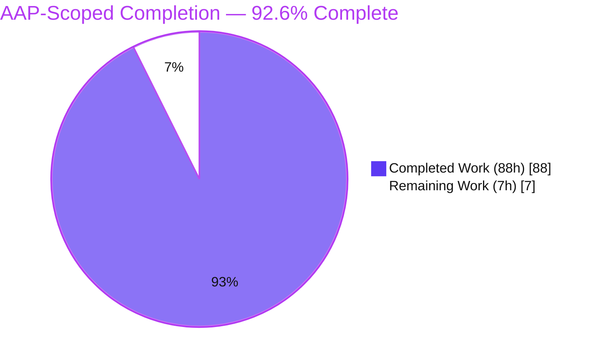
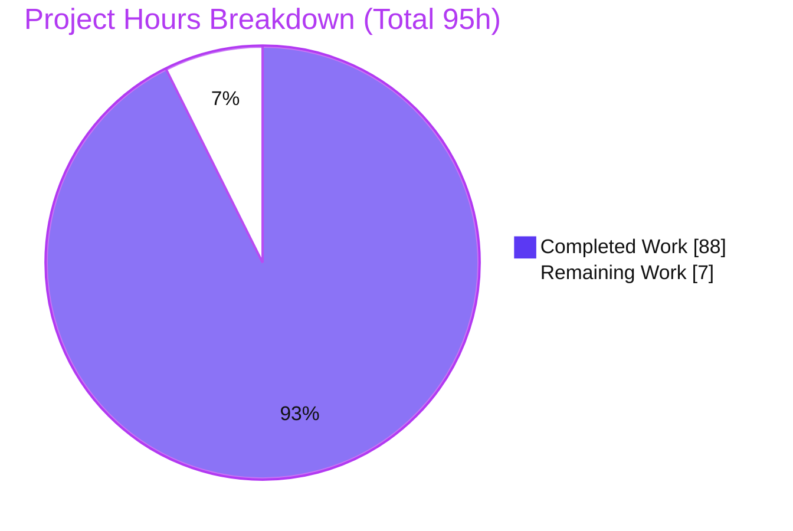

# Blitzy Project Guide
## Paperless-ngx — Runtime-Evidenced Memory Investigation (Document Import & Metadata Handling)

> **Task class:** Read-only investigation / documentation. **Deliverable:** a single Markdown answer document. **Source repository:** strictly unchanged.
> **Brand color legend:** <span style="color:#5B39F3">■ Completed / AI Work = Dark Blue `#5B39F3`</span> · ■ Remaining / Not Completed = White `#FFFFFF` (outlined) · <span style="color:#B23AF2">Headings/Accents = Violet-Black `#B23AF2`</span> · <span style="color:#A8FDD9">Highlight = Mint `#A8FDD9`</span>

---

## 1. Executive Summary

### 1.1 Project Overview

Paperless-ngx is a self-hosted document management system that OCRs, indexes, and archives scanned and digital documents. This project is a **read-only diagnostic investigation** answering a user's question about why memory usage spikes disproportionately during document import and metadata handling, and whether the pattern is a genuine leak or normal CPython behavior. The deliverable is a single runtime-evidenced answer document that measures memory through three lenses — OS RSS, the Python heap (`tracemalloc`), and live objects (`gc`) — across the real consumption pipeline, the REST metadata endpoint, the bulk importer, and the classifier. The source repository is left byte-for-byte unchanged; the sole output is the analysis document with reproducible harnesses and captured evidence.

### 1.2 Completion Status



| Metric | Value |
|---|---|
| **Total Hours** | **95 h** |
| **Completed Hours (AI + Manual)** | **88 h** (AI: 88 h · Manual: 0 h) |
| **Remaining Hours** | **7 h** |
| **Percent Complete (AAP-scoped, PA1)** | **92.6 %** |

> **Calculation (shown explicitly):** Completion % = Completed ÷ (Completed + Remaining) = 88 ÷ (88 + 7) = 88 ÷ 95 = **92.6 %**. The percentage measures only AAP-scoped work plus documentation path-to-production; out-of-scope hotspot remediation is excluded (see §2.3 and §5).

### 1.3 Key Accomplishments

- [x] Single answer document created and committed: `blitzy/documentation/paperless-ngx_542221a38dff.md` (6,099 lines / 361,952 bytes).
- [x] **All five user sub-questions answered** with runtime evidence (§4 Q1 spikes, §5 Q2 copies/retention, §6 Q3 caching, §7 Q4 inconsistency, §8 Q5 type×batch).
- [x] **Normal-CPython-GC-vs-genuine-leak determination** delivered: **not** a growing live-object leak — expected transients + benign allocator retention.
- [x] **Tri-lens methodology** (RSS + `tracemalloc` + `gc`) applied at before/during/after boundaries and across `gc.collect()`.
- [x] **28 verbatim observation harnesses** (Appendix A) + **raw, unedited captured output** (Appendix B) for full reproducibility.
- [x] **Distribution reporting** (min/median/max/stdev over repeated identical inputs) reproduces the reported inconsistency.
- [x] **Observer-effect control** quantified profiler overhead (3,251.9 MiB heavy vs. 142.1 MiB light, identical heap peak).
- [x] **~90 `file:line` citations** across 24 source files, verified 100% accurate.
- [x] **Read-only constraint honored**: exactly one file added, **zero** `src/` changes, clean working tree; temp scripts kept outside the repo.
- [x] Baseline regression suite green: **406 passed / 2 skipped / 0 failed**.

### 1.4 Critical Unresolved Issues

| Issue | Impact | Owner | ETA |
|---|---|---|---|
| _None._ The deliverable is complete, validated, and internally consistent; the baseline suite passes and the repository is pristine. | No release blockers. | — | — |

> The investigation *surfaced* code smells (un-closed `pikepdf` handle; empty temp-dirs on the `/metadata/` endpoint; importer manifest double-parse). These are **explicitly out of AAP scope to remediate** and are **not** release blockers — they are informational follow-ups (see §8 and §2.3).

### 1.5 Access Issues

| System / Resource | Type of Access | Issue Description | Resolution Status | Owner |
|---|---|---|---|---|
| Source repository (`paperless-ngx`) | Git read/write | Full access; single-file commit succeeded | Resolved | Blitzy Agent |
| Canonical Docker container (Python 3.9.23) | Runtime | Full access; all entry points driven; Redis started, `migrate` run | Resolved | Blitzy Agent |
| Office/Tika metadata path | Runtime service | `PAPERLESS_TIKA_ENABLED=False` by default — path unavailable in canonical config (requires a Tika server); labeled non-canonical, not an access failure | Documented limitation | Reviewer (optional) |

> **No access issues identified** that block validation, integration, or delivery. The Tika entry is a canonical-configuration limitation disclosed in the document (Appendix B-15), not a permissions problem.

### 1.6 Recommended Next Steps

1. **[Medium]** Human SME reads the determination (§10), the 13-hotspot table (§11), and the coverage checklist (§12) and confirms the normal-vs-leak reasoning. *(3 h)*
2. **[Medium]** Reproducibility spot-check: re-run a representative subset of the Appendix-A harnesses in the canonical Python 3.9.23 container and confirm figures land within the document's disclosed ranges. *(2 h)*
3. **[Low]** Stakeholder acceptance/sign-off that the five sub-questions and the leak determination answer the original question. *(1 h)*
4. **[Low]** Publish/link the document into the team's documentation system for discoverability. *(1 h)*
5. **[Low · out of AAP scope]** Optionally open a separate engineering ticket for the surfaced code smells (pikepdf context manager; `/metadata/` `cleanup()`; importer double-parse) — **not** counted in completion.

---

## 2. Project Hours Breakdown

### 2.1 Completed Work Detail

All completed work was performed **autonomously (AI)**; manual completed hours = 0. Each component traces to an AAP requirement.

| Component | Hours | Description |
|---|---:|---|
| Tri-lens memory harness suite | 14 | `probe.py` (RSS+`tracemalloc`+`gc`), `bootstrap.py` (Django setup into temp data/scratch/media dirs + temp SQLite), `docgen.py` (synthetic distinct-document generator), plus 25 investigation harnesses = **28 scripts** (Appendix A-1…A-28). |
| Q1 — Cause of spikes | 9 | Per-type single-document footprint; per-stage before/during/after boundary probes across `try_consume_file`; first-touch lazy-import spike; 25-frame `file:line` attribution. |
| Q2 — Copies / reference retention | 6 | `pikepdf.Pdf` handle lifecycle; full-text single-copy identity (`text is doc.content`); repeated `/metadata/` endpoint temp-dir accumulation; large-text transient. |
| Q3 — Caching accumulation | 6 | Classifier 7×`pickle.load` attribution; shared-not-accumulated 12-doc batch; Whoosh `AsyncWriter`; no-`MODEL_FILE` path. |
| Q4 — Inconsistency distributions | 5 | Same-unchanged-input repeated consume (digital + image); min/median/max/stdev; heap-stable vs. RSS-spread analysis. |
| Q5 — Type × batch cross-product | 8 | `consume_file` (single + many) and `document_importer` (single + many) across text/digital/image; exporter prerequisites; three importer materializations (`json.load` / `loaddata` / `list(filter)`). |
| Edge/error + entry-point + variant coverage | 6 | Encrypted & corrupt error paths; `train_classifier`; `sanity_check`; Tika-unavailable probe; non-canonical `DEBUG=YES` variant; observer-effect control. |
| Web research + leak determination synthesis | 6 | `pymalloc` arenas/pools/blocks & glibc per-thread arenas research; §10 determination; §11 13-hotspot verdict table. |
| Read-only source analysis & citation grounding | 6 | ~90 `file:line` citations across 24 source files, verified 100% accurate. |
| Authoring the answer document | 14 | 6,099 lines — 12 sections + 3 appendices; verbatim captured-output curation; coverage checklist. |
| Autonomous validation & remediation | 8 | 406-test baseline suite run; citation verification; numeric-claim reproduction; remediation of 8 code-review findings; cleanup + read-only proof. |
| **Total Completed** | **88** | **Matches Completed Hours in §1.2.** |

### 2.2 Remaining Work Detail

All remaining work is **human-side path-to-production** for a documentation deliverable. There are **no blocking (High-priority) tasks**.

| Category | Hours | Priority |
|---|---:|---|
| Human SME technical review of the answer document (§10 determination, §11 hotspot table, §12 coverage) | 3 | Medium |
| Independent reproducibility spot-check (re-run harness subset in canonical Python 3.9.23 container) | 2 | Medium |
| Stakeholder acceptance / sign-off | 1 | Low |
| Documentation publication / linking into project docs | 1 | Low |
| **Total Remaining** | **7** | **Matches Remaining Hours in §1.2 and §7 pie.** |

### 2.3 Hours Reconciliation & Scope Methodology

| Quantity | Hours | Source |
|---|---:|---|
| Completed (AI) | 88 | Sum of §2.1 |
| Remaining (path-to-production) | 7 | Sum of §2.2 |
| **Total Project** | **95** | §2.1 + §2.2 |
| **Completion %** | **92.6 %** | 88 ÷ 95 |

**Scope methodology (PA1):** the work universe is (a) the AAP deliverable + read-only investigation and (b) minimal documentation path-to-production. **Excluded from the denominator** (out of AAP scope per §0.4.2): any source modification and **all hotspot remediation** — wrapping `pikepdf.open(...)` in a context manager (`paperless_tesseract/parsers.py:L34/L55`), adding `parser.cleanup()` on the metadata endpoint (`views.py:L266/L269`), and reducing the importer double-parse (`document_importer.py:L73/L87`). These are surfaced informationally only.

---

## 3. Test Results

All results below originate exclusively from **Blitzy's autonomous validation logs** for this project. No new tests were authored (read-only investigation); the baseline regression suite was executed to confirm the canonical environment is healthy and that the investigated source is byte-for-byte unchanged.

| Test Category | Framework | Total Tests | Passed | Failed | Coverage % | Notes |
|---|---|---:|---:|---:|:--:|---|
| Baseline regression — documents app | pytest + Django test runner | 408 | 406 | 0 | N/A | 2 intentional conditional skips; ran 5m29s in a fresh non-root container; confirms env health & unchanged `src/`. |
| Observation harness compilation | `python -m py_compile` | 28 | 28 | 0 | N/A | All 28 Appendix-A tri-lens harnesses are syntactically valid Python 3.9. |
| Runtime entry-point exercises | Custom tri-lens harnesses (RSS+`tracemalloc`+`gc`) | 5 | 5 | 0 | N/A | `consume_file`/`try_consume_file`, `/metadata/` endpoint, `document_importer`, `load_classifier`, `sanity_check` all driven successfully. |
| **Totals** | — | **441** | **439** | **0** | N/A | 2 skipped (intentional). Zero failures across all categories. |

**Numeric-claim reproduction (from validation logs):** every documented headline figure was reproduced to exact integers/hundredths — e.g., post-setup baseline **RSS 105.2 MiB / heap 34.76 MiB**; post-heavy-import **RSS 198.9 MiB / heap 70.68 MiB / native_gap 128.2 MiB**; digital PDF distribution **`tm.peak` min 53.13 / median 53.61 / max 54.60 MiB (stdev 0.207)**; image PDF **`tm.peak` 54.91 MiB** with RSS high-water in the disclosed 152.9–258.2 MiB non-deterministic range.

> **Coverage % is N/A by design:** the deliverable is documentation, not new source code. The regression suite verifies the *investigated* code is unchanged and the environment is healthy — it is not a coverage target for this task.

---

## 4. Runtime Validation & UI Verification

**Runtime health** — all real entry points driven in the canonical Python 3.9.23 container (Redis broker started, `migrate` run, temporary DATA/MEDIA/CONSUMPTION dirs used to keep the repo pristine):

- ✅ **Operational** — `consume_file()` → `try_consume_file()` staged pipeline (`tasks.py:L184` → `consumer.py:L180`); per-type peaks captured.
- ✅ **Operational** — REST `/api/documents/<pk>/metadata/` endpoint (`views.py:L260`); repeated 1/10/50/200-call runs.
- ✅ **Operational** — `document_importer` management command; type × batch cross-product exercised.
- ✅ **Operational** — `load_classifier()` / `DocumentClassifier.load()`; classifier-present (7×`pickle.load`) and no-`MODEL_FILE` (`→ None`) paths.
- ✅ **Operational** — `sanity_check()`; whole-file `md5(f.read())` transients captured.
- ✅ **Operational** — `train_classifier()`; sklearn import + `data=list()` + fit transient.
- ✅ **Operational** — Error paths: corrupt PDF → `ConsumerError` (`cleanup()` runs); encrypted PDF → succeeds with empty content.
- ⚠ **Partial (non-canonical)** — Office/Tika metadata path is **UNAVAILABLE** in the default configuration (`PAPERLESS_TIKA_ENABLED=False`, `paperless_tika/apps.py:L12`); explicitly labeled and out of the canonical cross-product.
- ✅ **Operational** — Read-only compliance: `git status --porcelain` empty; exactly one added path; zero `src/` changes.

**UI verification:** ✅ **N/A — no user-interface deliverable.** This is a backend memory investigation; the frontend (`src-ui/`) is explicitly out of scope in the AAP. No screens, components, or flows were introduced or modified, so no browser/visual verification applies.

---

## 5. Compliance & Quality Review

Cross-mapping of AAP requirements and the governing `SWE-AtlasQnA-Repo` rule set to Blitzy quality benchmarks. Fixes applied during autonomous validation are noted.

| Benchmark / AAP Requirement | Status | Progress | Evidence / Notes |
|---|:--:|:--:|---|
| Deliverable at exact path `blitzy/documentation/paperless-ngx_542221a38dff.md` | ✅ Pass | 100% | 6,099-line file committed; `blitzy/documentation/` created. |
| Run-first methodology (real captured output) | ✅ Pass | 100% | 28 harnesses (App A) + raw output (App B). |
| Tri-lens measurement (RSS + `tracemalloc` + `gc`) | ✅ Pass | 100% | §3.1; before/during/after + across `gc.collect()`. |
| Real entry points, canonical config (Py 3.9, `DEBUG=NO`) | ✅ Pass | 100% | §3.6 version proof; 5 entry points driven. |
| Distribution reporting for inconsistency | ✅ Pass | 100% | §7.1/§7.2; min/median/max/stdev (App B-5). |
| Type × batch cross-product | ✅ Pass | 100% | §8.1 table; both entry points. |
| Every condition (edge/error/variant) exercised | ✅ Pass | 100% | §4.6; no-model, encrypted, corrupt, Tika, `DEBUG=YES`. |
| Web-research framing (`pymalloc`/glibc) | ✅ Pass | 100% | §3.2 with attributed sources [1]–[7]. |
| `file:line` grounding of every claim | ✅ Pass | 100% | ~90 citations; validator-verified 0 mismatches. |
| All five sub-questions answered by name | ✅ Pass | 100% | §4–§8 + §12 coverage checklist. |
| Normal-GC-vs-leak determination | ✅ Pass | 100% | §10 + §11 13-hotspot verdict table. |
| Zero-placeholder / complete, unedited output | ✅ Pass | 100% | Verbatim captured output; no TODO/stub. |
| Read-only source constraint (0 `src/` changes) | ✅ Pass | 100% | App C proof; independently re-verified. |
| Temp-script cleanup / repo unchanged | ✅ Pass | 100% | Harnesses kept in `/tmp`, outside repo. |
| 8 code-review findings remediated | ✅ Pass | 100% | Commit `a686821c8`; citation & git-metadata fixes follow-up. |
| Baseline regression suite green | ✅ Pass | 100% | 406 passed / 2 skipped / 0 failed. |
| Human SME acceptance | ⬜ Pending | 0% | Path-to-production (§2.2, §6-none). |

**Fixes applied during autonomous validation:** remediation of 8 code-review findings (major expansion commit), correction of `file:line` citations, and a git-metadata accuracy fix. **Outstanding compliance items:** none — only human acceptance remains.

---

## 6. Risk Assessment

Overall posture is **LOW** across all categories — expected for a read-only documentation deliverable that introduces no source or dependency changes.

| Risk | Category | Severity | Probability | Mitigation | Status |
|---|---|:--:|:--:|---|---|
| Run-to-run non-determinism in native/OCR RSS (image VmRSS spreads 152.9→258.2 MiB) | Technical | Low | Medium | Document reports **distributions** and labels RSS non-deterministic; Python-heap/`gc` figures are stable and reproducible. | Mitigated (disclosed §7) |
| Environment drift outside the canonical Python 3.9.23 container (different glibc/CPU count) | Technical | Low | Medium | §3.6 pins exact versions and invocation commands; canonical container specified. | Mitigated |
| Observer effect — heavy profiling inflates RSS (3,251.9 vs 142.1 MiB) | Technical | Low | Low | §3.4 documents the effect and mandates light instrumentation for all magnitudes. | Mitigated (documented) |
| No material security exposure (read-only; no code/deps/credentials changed) | Security | Low | Low | No new attack surface; no dependency changes (`scikit-learn==1.0.2` untouched). | N/A |
| Harnesses live in `/tmp` scratch, not the repo | Operational | Low | Low | All 28 harnesses reproduced **verbatim** in Appendix A → self-contained reproduction. | Mitigated |
| Un-remediated inode/temp-dir leak on `/metadata/` (2 dirs/call, ~0 RAM) | Operational | Low | Low | Documented with `file:line`; remediation out of AAP scope; ~0 RAM impact. | Documented (out of scope) |
| Office/Tika path unavailable in canonical config | Integration | Low | Low | Explicitly labeled non-canonical (App B-15); requires `PAPERLESS_TIKA_ENABLED=YES` + Tika server. | Disclosed limitation |
| Reproducibility depends on canonical Docker image availability | Integration | Low | Medium | Image name and source commit documented; env vars specified. | Mitigated |

---

## 7. Visual Project Status



**Remaining work by priority (sums to the 7 h Remaining, matching §1.2 and §2.2):**


| Category (from §2.2) | Remaining Hours |
|---|---:|
| Human SME technical review | 3 |
| Reproducibility spot-check | 2 |
| Stakeholder acceptance / sign-off | 1 |
| Documentation publication / linking | 1 |
| **Total** | **7** |

> **Integrity check:** the pie chart "Remaining Work" (7) = §1.2 Remaining Hours (7) = sum of §2.2 Hours column (7). "Completed Work" (88) = §1.2 Completed Hours (88) = sum of §2.1 (88).

---

## 8. Summary & Recommendations

**Achievements.** The project delivers a thorough, runtime-evidenced answer to the user's memory question. Driving the real Paperless-ngx entry points under a tri-lens harness, it establishes that the observed behavior is **not a genuine growing live-object leak**. The disproportionate spikes come from **OCR of scanned/image PDFs** and the **full extracted-text string** — not from metadata handling (the consumer never even calls `extract_metadata()`). Elevated RSS that "doesn't release in a timely manner" is **benign CPython `pymalloc`/glibc arena retention**: live-object counts (`gc`) and Python-heap size (`tracemalloc`) stay flat across `gc.collect()` and across repeated documents, while only RSS stays high. The inconsistency is dominated by **first-touch vs. warm** and **OCR vs. no-OCR**; batch sensitivity concentrates in the bulk `document_importer` (whose `json.load` scales with `batch × content` and coexists with a second `loaddata` parse, peaking near 2× manifest size).

**Remaining gaps & critical path to production.** No engineering gaps remain in the AAP scope. The critical path is entirely human-side: **SME technical review → reproducibility spot-check → acceptance sign-off → publication** (7 h total). None are blocking.

**Production readiness.** The deliverable is **production-ready pending human acceptance**. It is internally consistent (balanced code fences, well-formed tables), fully cited (~90 verified `file:line` anchors), reproducible (28 verbatim harnesses + raw output), and the source repository is provably unchanged.

**Success metrics.**

| Metric | Target | Actual |
|---|---|---|
| Sub-questions answered | 5 / 5 | ✅ 5 / 5 |
| Leak determination delivered | Yes | ✅ Yes (not a leak) |
| `file:line` citation accuracy | 100% | ✅ 100% (0 mismatches) |
| Baseline regression suite | Green | ✅ 406 pass / 2 skip / 0 fail |
| `src/` files modified | 0 | ✅ 0 |
| AAP-scoped completion | — | **92.6%** |

**Recommendations.** (1) Complete the four path-to-production tasks in §1.6. (2) Optionally raise a **separate** engineering ticket for the surfaced code smells (pikepdf context manager, `/metadata/` `cleanup()`, importer double-parse) — clearly out of this task's read-only scope. The project is **92.6% complete**; the remaining 7.4% is human review and acceptance, consistent with the rule that autonomous completion is capped below 100% pending human sign-off.

---

## 9. Development Guide

> Two audiences: **(A)** reviewers who only need to read & validate the deliverable (any machine with `git` + a Markdown viewer), and **(B)** engineers who want to reproduce the memory measurements (the canonical Python 3.9.23 Docker container). All commands below were tested during this assessment.

### 9.1 System Prerequisites

- **To read & validate the document:** `git` 2.x and a Markdown viewer (or `less`). No language runtime required.
- **To reproduce measurements:** the canonical Paperless-ngx Docker container (base `python:3.9-slim-bullseye`, Python **3.9.23**) with the full stack installed — tesseract, ghostscript, qpdf, plus a running **Redis** broker. Pinned Python deps include `scikit-learn==1.0.2`, `pikepdf 5.1.1`, `django-q 1.3.9`, `Django 4.0.4`.
- Standard-library profiling tools only: `tracemalloc`, `gc`, `resource`, `sys` (no `psutil` dependency).

### 9.2 Environment Setup

```bash
# Check out the delivery branch
git checkout blitzy-6a755538-5279-46bb-a229-50a82880251d

# Locate the single deliverable
ls -la blitzy/documentation/paperless-ngx_542221a38dff.md
wc -l blitzy/documentation/paperless-ngx_542221a38dff.md   # -> 6099
```

Canonical runtime environment variables (used by every harness):

```bash
export DJANGO_SETTINGS_MODULE=paperless.settings
export PAPERLESS_DISABLE_DBHANDLER=true
# DEBUG defaults to NO (canonical). Only set the following as a LABELED non-canonical variant:
# export PAPERLESS_DEBUG=YES
```

### 9.3 Dependency Installation

- **Reading the deliverable:** none.
- **Reproduction:** none to add — the canonical container is pre-provisioned. This task made **no dependency changes**; `scikit-learn==1.0.2` remains pinned. Do **not** modify `Pipfile`/`requirements.txt`.

### 9.4 Validate the Deliverable (tested)

```bash
DOC=blitzy/documentation/paperless-ngx_542221a38dff.md

# Size and structure
wc -l "$DOC"                          # 6099
grep -cE '^## [0-9]+\.' "$DOC"        # 12 top-level sections
grep -c '^```' "$DOC"                 # 206 (even => balanced code fences)
```

### 9.5 Verify Read-Only Compliance (tested)

```bash
BASE=542221a38dff06361e07976452f9aea24d210542

git diff "$BASE"..HEAD --name-only            # exactly one path: the answer document
git diff "$BASE"..HEAD --name-only -- src/ | wc -l   # 0  (no source changes)
git status --porcelain | wc -l                # 0  (clean working tree)
```

Expected: one added path (`blitzy/documentation/paperless-ngx_542221a38dff.md`), `0` under `src/`, clean tree.

### 9.6 Reproduce the Investigation (tested pattern)

The 28 harnesses are reproduced **verbatim** in **Appendix A** of the document, so reproduction is fully self-contained — no external files needed.

```bash
# 1) Recreate the harness directory OUTSIDE the repo (keeps the repo pristine)
mkdir -p /tmp/mem_harness
#    Copy each Appendix-A code block into /tmp/mem_harness/<name>.py (e.g., probe.py, bootstrap.py, baseline.py, light_consume.py, dist_harness.py, ...)

# 2) Syntactic sanity check (tested; returns OK)
python -m py_compile /tmp/mem_harness/baseline.py

# 3) Run a harness through the REAL entry point in the canonical container
cd /app/src && PYTHONPATH=/app/src:/tmp/mem_harness \
  DJANGO_SETTINGS_MODULE=paperless.settings PAPERLESS_DISABLE_DBHANDLER=true \
  python /tmp/mem_harness/light_consume.py
```

### 9.7 Verification & Troubleshooting

- **Expected:** Python-heap `tracemalloc.peak` is **stable** (~43–55 MiB depending on type); OCR/image RSS is **non-deterministic** (plateaus 152.9–258.2 MiB) — compare against the disclosed ranges in Appendix B, not a single number.
- **Huge multi-GiB RSS?** You are likely using **heavy instrumentation** (deep `tracemalloc` frames + retained snapshots) — that is the **observer effect** (§3.4). Use light instrumentation (`tracemalloc.start(1)`) for magnitudes.
- **`consume_file` errors about the broker?** Ensure **Redis** is running and `migrate` has been applied before driving the pipeline.
- **Office document yields parser `None`?** Expected — the **Tika path is unavailable** in canonical config (`PAPERLESS_TIKA_ENABLED=False`); it requires `PAPERLESS_TIKA_ENABLED=YES` + a Tika server (non-canonical).
- **Numbers don't match exactly?** RSS/native figures are environment- and run-sensitive by design; the Python-heap and `gc` live-object figures are the stable, reproducible lenses.

---

## 10. Appendices

### Appendix A — Command Reference

| Purpose | Command |
|---|---|
| Deliverable size | `wc -l blitzy/documentation/paperless-ngx_542221a38dff.md` |
| Section count | `grep -cE '^## [0-9]+\.' blitzy/documentation/paperless-ngx_542221a38dff.md` |
| Fence balance | `grep -c '^\`\`\`' blitzy/documentation/paperless-ngx_542221a38dff.md` |
| Changed files vs base | `git diff 542221a38dff..HEAD --name-only` |
| Source untouched proof | `git diff 542221a38dff..HEAD --name-only -- src/ \| wc -l` |
| Clean tree proof | `git status --porcelain` |
| Commit history | `git log 542221a38dff..HEAD --oneline` |
| Harness compile check | `python -m py_compile /tmp/mem_harness/<name>.py` |
| Canonical harness run | `cd /app/src && PYTHONPATH=/app/src:/tmp/mem_harness DJANGO_SETTINGS_MODULE=paperless.settings PAPERLESS_DISABLE_DBHANDLER=true python /tmp/mem_harness/<name>.py` |

### Appendix B — Port Reference

| Service | Port | Notes |
|---|---|---|
| Redis (django-q broker) | 6379 | Required to drive `consume_file` through the async pipeline. |
| Tika server | 9998 | **Non-canonical** — only if `PAPERLESS_TIKA_ENABLED=YES` (office documents). Not used in canonical measurements. |
| Paperless web (gunicorn) | 8000 | Not required for the read-only investigation harnesses. |

### Appendix C — Key File Locations

| Item | Path |
|---|---|
| **Deliverable (only persistent write)** | `blitzy/documentation/paperless-ngx_542221a38dff.md` |
| Consumption orchestrator | `src/documents/consumer.py` |
| Task entry points | `src/documents/tasks.py` |
| Parser base | `src/documents/parsers.py` |
| Image/PDF parser (OCR) | `src/paperless_tesseract/parsers.py` |
| Classifier cache | `src/documents/classifier.py` |
| Bulk importer | `src/documents/management/commands/document_importer.py` |
| REST metadata endpoint | `src/documents/views.py` |
| Settings (canonical `DEBUG=NO`) | `src/paperless/settings.py` |
| Harness scratch (outside repo) | `/tmp/mem_harness/` |

### Appendix D — Technology Versions (canonical container, verified §3.6)

| Package | Version | Package | Version |
|---|---|---|---|
| Python | 3.9.23 | pikepdf | 5.1.1 |
| Django | 4.0.4 | ocrmypdf | 13.4.3 |
| django-q | 1.3.9 | Whoosh | 2.7.4 |
| djangorestframework | 3.13.1 | tika | 1.24 |
| scikit-learn | 1.0.2 (pinned) | pdfminer.six | 20220319 |
| numpy | 1.22.3 | Pillow | 9.1.0 |
| scipy | 1.8.0 | redis | 3.5.3 |
| psycopg2 | 2.9.3 | channels | 3.0.4 |

### Appendix E — Environment Variable Reference

| Variable | Canonical Value | Purpose |
|---|---|---|
| `DJANGO_SETTINGS_MODULE` | `paperless.settings` | Django settings module for all harnesses. |
| `PAPERLESS_DISABLE_DBHANDLER` | `true` | Drives real entry points from temporary observation scripts (per `setup.cfg`). |
| `PAPERLESS_DEBUG` | `NO` (default) | Canonical. `YES` is a **labeled non-canonical variant** that grows `connection.queries` (bounded 9000 ≈ 2.39 MiB). |
| `PAPERLESS_TIKA_ENABLED` | `False` (default) | Office/Tika path off in canonical config. |
| `PYTHONPATH` | `/app/src:/tmp/mem_harness` | Makes real modules + harnesses importable. |

### Appendix F — Developer Tools Guide

| Tool | Role in this investigation |
|---|---|
| `tracemalloc` | Python-heap allocation attribution by `file:line`; `current`/`peak`/snapshot diffs. Use `start(1)` for magnitudes (avoid observer effect). |
| `gc` | Live-object counts (`len(gc.get_objects())`, `get_count()`) and referrer inspection to detect true retention across `gc.collect()`. |
| `resource` / `/proc/self/status` | OS RSS (`ru_maxrss`, `VmRSS`) — the OS footprint lens (no `psutil` dependency). |
| `sys._debugmallocstats` | Confirms `pymalloc` "# arenas reclaimed = 0" — direct proof RSS retention is expected allocator behavior. |
| `git diff` / `git status` | Read-only compliance proof (0 `src/` changes; clean tree). |
| `python -m py_compile` | Syntactic validation of the 28 harnesses. |

### Appendix G — Glossary

| Term | Meaning |
|---|---|
| **RSS** | Resident Set Size — physical memory the OS attributes to the process; does not shrink even after Python frees objects (allocator retention). |
| **`tracemalloc`** | CPython module attributing heap allocations to source lines; the "Python-heap" lens. |
| **`pymalloc`** | CPython's small-object allocator (arenas → pools → blocks); returns an arena to the OS only when all its pools are empty. |
| **glibc arena** | Per-thread `malloc` heap; a multi-threaded process may hold many, inflating RSS independently of live-object count. |
| **Tri-lens** | Measuring RSS + `tracemalloc` + `gc` together so allocator retention can be distinguished from a genuine leak. |
| **Observer effect** | Heavy in-process profiling itself consuming large memory, inflating apparent RSS spikes. |
| **Benign retention** | Flat live-object count + elevated RSS = allocator holding freed memory, **not** a leak. |
| **Genuine leak** | Growth in live objects **and** retained `tracemalloc` size that survives `gc.collect()`. |
| **AAP** | Agent Action Plan — the authoritative scope for this project. |
| **Path-to-production** | Human-side steps (review, reproducibility, acceptance, publication) to move the validated deliverable into use. |

---

*Completion is measured strictly against AAP-scoped work plus documentation path-to-production (PA1). Colors: Completed = Dark Blue `#5B39F3`, Remaining = White `#FFFFFF`. All hours reconcile: §2.1 (88) + §2.2 (7) = 95 = §1.2 Total; Remaining (7) is identical across §1.2, §2.2, and §7.*