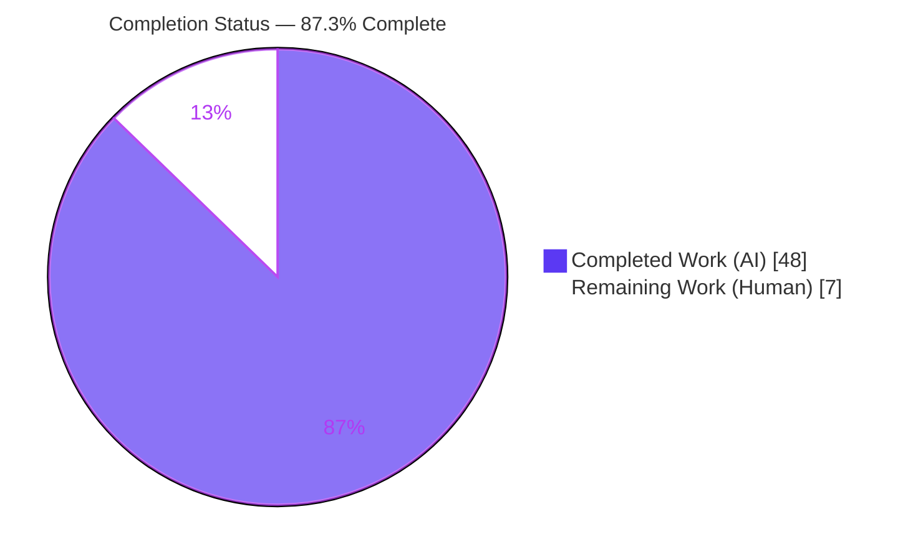
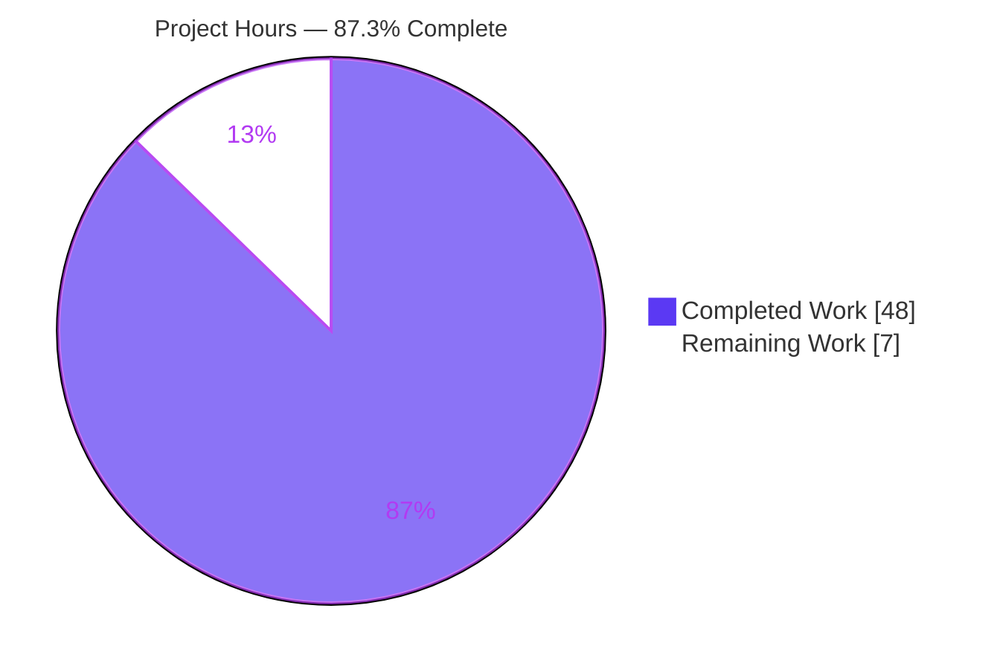
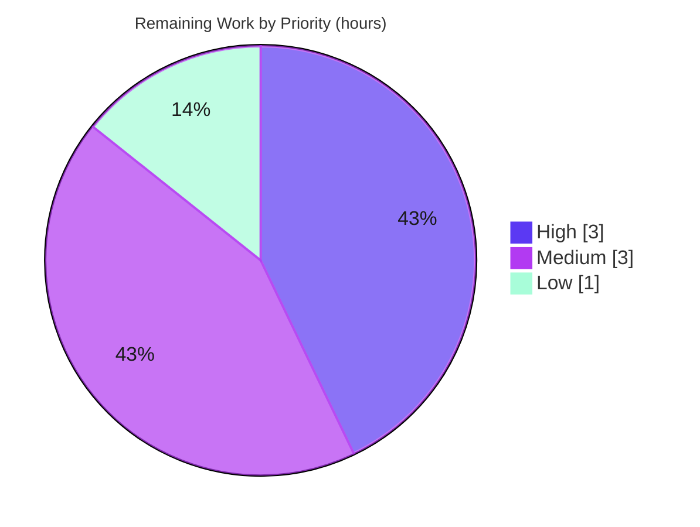

# Blitzy Project Guide
## paperless-ngx — ML Classification & OCR Pipeline: Runtime Investigation (Q&A Deliverable)

> **Brand color legend** — <span style="color:#5B39F3">■</span> **Completed / AI Work** = Dark Blue `#5B39F3` &nbsp;•&nbsp; <span style="color:#B23AF2">■</span> **Remaining / Not Completed** = White `#FFFFFF` (outlined) &nbsp;•&nbsp; Headings/Accents = Violet-Black `#B23AF2` &nbsp;•&nbsp; Highlight = Mint `#A8FDD9`

---

## 1. Executive Summary

### 1.1 Project Overview

This project is a **read-only, evidence-based runtime investigation** of the paperless-ngx machine-learning document-classification and OCR pipeline, produced to help a developer debug reported **non-deterministic ("flaky") classification-test failures**. The sole deliverable is one Markdown answer document that answers four runtime-behavior questions — classifier model reuse vs. retraining (Q1), automatic correspondent matching count/timing/threshold (Q2), the no-extractable-text OCR edge case (Q3), and barcode splitting (Q4) — authored **entirely from observed runtime output** in the project's canonical configuration, with every claim grounded in a `file:line` reference. Target users are paperless-ngx maintainers and contributors. No production code changes; the repository stays byte-for-byte unchanged except for the document.

### 1.2 Completion Status



| Metric | Value |
| --- | --- |
| **Total Hours** | **55 h** |
| **Completed Hours (AI + Manual)** | **48 h** (48 AI + 0 Manual) |
| **Remaining Hours** | **7 h** |
| **Percent Complete** | **87.3 %** &nbsp;( 48 ÷ 55 × 100 ) |

> The completion percentage is computed strictly from AAP-scoped hours: `Completed ÷ (Completed + Remaining) = 48 ÷ 55 = 87.3 %`. All autonomous, AAP-specified work is delivered and validated; the remaining 7 h is human-side path-to-production (review, reproduction, acceptance).

### 1.3 Key Accomplishments

- ✅ **Single required deliverable created & committed** — `blitzy/documentation/paperless-ngx_542221a38dff.md` (1,459 lines) at the exact mandated path/name (= source branch name).
- ✅ **Airtight read-only scope** — `git diff 542221a38..HEAD --name-status` shows exactly one added file; no source/test/config/fixture/dependency file modified; working tree clean.
- ✅ **Q1 non-determinism reproduced, not stabilized** — model distinctness 100 % reproducible (500/500 distinct fits); the rare test-failing label flip exhibited at K=30,000 across two runs (aggregate rate ≈ 1×10⁻⁴); root cause pinned to `MLPClassifier` with no `random_state`.
- ✅ **Q2 negative result led plainly** — no ML probability confidence threshold; the only numeric threshold (fuzzy `>= 90`) belongs to a separate non-ML path; training counts and create-then-train timing shown from logs (incl. inbox-tag exclusion 3 → 2).
- ✅ **Q3 OCR subprocess verified at runtime** — `ocrmypdf.ocr` observed spawning Tesseract + Ghostscript; force-OCR fallback and empty-text last resort exercised; both MIME facets (archive `application/pdf` vs. persisted original type) demonstrated.
- ✅ **Q4 zero-rows result proven** — barcode branch creates zero `Document` rows directly (returns "File successfully split"); decision site `tasks.py:L108`, trigger `"PATCHT"`/custom, per-fixture split counts `[0]`/`[]`/`[1]`/`[2,5]` across Code 39/128/QR/custom/unreadable, stable across two runs.
- ✅ **Every claim grounded** — citation audit verified all `file:line` references at base `542221a38` with **zero mismatches**; a 30-item coverage pass confirms every named item is answered.
- ✅ **Validated & clean** — all referenced test suites pass (59 passed, 1 intentional skip, 0 failed); deliverable lint-clean; all temporary helpers removed.

### 1.4 Critical Unresolved Issues

There are **no blocking technical issues**. The deliverable compiles as valid Markdown, all referenced tests pass, all citations resolve, and the repository is clean. The items below are **non-blocking verification gates** that require a human (they cannot be performed autonomously).

| Issue | Impact | Owner | ETA |
| --- | --- | --- | --- |
| SME technical-correctness review not yet performed | Nuanced ML claims (e.g., Q1 root cause) should be confirmed by a domain expert before the doc is relied upon for debugging | Human reviewer (paperless-ngx / ML SME) | 3 h |
| Independent runtime reproduction not yet performed by a human | Confirms the observations reproduce in a fresh canonical environment (esp. the probabilistic Q1 finding) | Human reviewer | 2 h |
| Acceptance / merge decision pending | Document not yet formally accepted; follow-on fix decision open | Human maintainer | 1 h |

### 1.5 Access Issues

**No access issues identified.** The autonomous agents had full access to the canonical Docker environment (all evidence was captured there), the source repository, and the required system binaries. No repository permission, service credential, or third-party API access blocked the work.

| System / Resource | Type of Access | Issue Description | Resolution Status | Owner |
| --- | --- | --- | --- | --- |
| Canonical Docker image (`paperless-ngx-qna:ready`) | Runtime environment | None — available and used for all observations | ✅ No issue | — |
| Source repository | Read/write (branch) | None — single deliverable committed | ✅ No issue | — |
| System OCR/barcode binaries (Tesseract, Ghostscript, zbar, poppler) | Runtime | None — all present in canonical image | ✅ No issue | — |

> **Prerequisite note (not an access issue):** human *reproduction* of the runtime evidence requires access to the canonical Docker image and its system binaries; the local inspection shell (Python 3.13, no paperless deps) suffices only for viewing the document and checking citations/scope. Reproduction steps are documented in Section 9.

### 1.6 Recommended Next Steps

1. **[High]** Perform the SME technical-correctness review of the four question sections and the coverage pass (HT-1, 3 h).
2. **[Medium]** Independently reproduce the runtime evidence in the canonical container — re-run the referenced suites and the fast Q1 model-distinctness proxy (HT-2, 2 h).
3. **[Medium]** Incorporate any review-feedback corrections into the document, keeping it lint-clean and the repo byte-for-byte unchanged except the doc (HT-3, 1 h).
4. **[Low]** Accept/merge the document and record the follow-on scoping decision on whether to open a **separate** ticket to fix the non-determinism (add `random_state` to the three `MLPClassifier` instances) — explicitly out of this AAP's scope (HT-4, 1 h).

---

## 2. Project Hours Breakdown

### 2.1 Completed Work Detail

All completed work is AI/autonomous and traces to a specific AAP requirement.

| Component | Hours | Description |
| --- | --- | --- |
| Canonical environment setup & verification | 3 | Build/confirm the canonical Docker env; verify Python 3.9.23, pinned Python deps (scikit-learn 1.0.2, ocrmypdf 13.4.3, etc.) and system binaries (Tesseract 4.1.1, Ghostscript 9.53.3, zbar, poppler); document exact versions (deliverable §1.2). |
| Q1 — Model reuse & non-determinism investigation | 10 | Instrument the reuse guard (`train()` True→False→True, SHA-1 `data_hash`); reproduce non-determinism at scale (K = 500 / 2,000 / 30,000 ×2, ~9 min each run); pin root cause (`MLPClassifier` no `random_state`); probe xdist on/off; map cross-test contamination surface (`DirectoriesMixin` + transaction rollback). |
| Q2 — Correspondent matching investigation | 6 | Count training docs (created vs. trained, inbox-tag exclusion 3 → 2); confirm create-then-train timing from logs; establish the negative result (no ML probability threshold; fuzzy `>= 90` is a separate path); trace consume-time `set_correspondent` path. |
| Q3 — No-text OCR investigation | 7 | Trace the real OCR subprocess via PATH shims (`ocrmypdf.ocr` spawning Tesseract + Ghostscript); trigger the `NoTextFoundException` force-OCR fallback and empty-text last resort; demonstrate both MIME facets (archive `application/pdf` vs. persisted original type). |
| Q4 — Barcode splitting investigation | 6 | Exercise `scan_file_for_separating_barcodes` → `separate_pages` → `consume_file` across all fixtures/variants (Code 39/128/QR/custom/unreadable/multi-separator); prove zero `Document` rows created directly; confirm counts stable across two runs. |
| Answer-document authoring | 9 | Author the 1,459-line document: structure, per-question direct answers (incl. negative results), embedded complete/unedited command output, `file:line` grounding, inference labeling, 30-item coverage pass, and repository-cleanliness proof. |
| Multi-checkpoint validation, citation audit & cleanup | 7 | Five iterative review cycles (initial → CP4 → CP-C citation precision → Q1 reproducibility → final precision edits); re-run referenced test suites; verify all citations (zero mismatches); lint/markdown-integrity checks; remove all temporary helpers; confirm repo byte-for-byte clean. |
| **Total Completed** | **48** | **Matches Completed Hours in Section 1.2** |

### 2.2 Remaining Work Detail

All remaining work is human-side path-to-production. Each category traces to a path-to-production need for accepting the deliverable.

| Category | Hours | Priority |
| --- | --- | --- |
| SME technical-correctness review of the 1,459-line document | 3 | High |
| Independent runtime reproduction in the canonical container | 2 | Medium |
| Review-feedback minor doc revisions (contingency) | 1 | Medium |
| Acceptance sign-off + follow-on (fix) scoping decision | 1 | Low |
| **Total Remaining** | **7** | **Matches Remaining Hours in Section 1.2 and Section 7 pie chart** |

### 2.3 Total Project Hours Reconciliation

| Line | Hours |
| --- | --- |
| Section 2.1 — Completed | 48 |
| Section 2.2 — Remaining | 7 |
| **Total Project Hours** | **55** |
| **Percent Complete** | **48 ÷ 55 = 87.3 %** |

> **Cross-section integrity:** Section 2.1 (48) + Section 2.2 (7) = 55 = Total Hours in Section 1.2. Remaining hours (7) are identical in Sections 1.2, 2.2, and 7. ✅

---

## 3. Test Results

All tests below originate from **Blitzy's autonomous validation logs** for this project — every referenced test suite was re-run in the canonical Docker container (`pngx`, Python 3.9.23) using `python -m pytest … -n0 --no-cov`. This is a documentation deliverable; the tests are the project's **existing** suites that the investigation *exercised as evidence* (no new tests were authored, per the read-only mandate).

| Test Category (Module) | Framework | Total | Passed | Failed | Skipped | Coverage % | Notes |
| --- | --- | --- | --- | --- | --- | --- | --- |
| Classifier — Q1 reuse/hash + Q2 correspondent (`documents/tests/test_classifier.py`) | pytest + pytest-django | 23 | 22 | 0 | 1 | n/a¹ | 1 **intentional pre-existing** skip (`test_load_classifier_cached`: "Disabled caching due to high memory usage — need to investigate") |
| Tasks — Q1 `train_classifier` + Q4 barcode (`documents/tests/test_tasks.py`) | pytest + pytest-django | 30 | 30 | 0 | 0 | n/a¹ | golden train-classifier 5 (35 deselected) + barcode 25 |
| Matchables — Q2 consume-time correspondent (`documents/tests/test_matchables.py`) | pytest + pytest-django | 2 | 2 | 0 | 0 | n/a¹ | `test_correspondent_applied` / `test_correspondent_not_applied` |
| Parser — Q3 no-text / form (`paperless_tesseract/tests/test_parser.py`) | pytest + pytest-django | 5 | 5 | 0 | 0 | n/a¹ | force-OCR fallback + empty-text last resort |
| **Total (referenced suites)** | | **60** | **59** | **0** | **1** | — | **100 % of executed tests pass** |

¹ Coverage instrumentation (`--cov`) was intentionally disabled (`--no-cov`) for the evidence runs to avoid overhead and keep captured output clean; the goal was behavioral observation, not coverage measurement. Subsets (reuse/hash 3p+1skip; Q2 `one_correspondent` 2p) are counted **within** the classifier-file row to avoid double-counting.

> **Runtime entry points exercised (beyond the suites):** `Consumer.try_consume_file` (persist path), `ocrmypdf.ocr` (observed spawning `tesseract` + `gs` child processes via a PATH shim), and the full barcode pipeline `scan_file_for_separating_barcodes → separate_pages → consume_file`.

---

## 4. Runtime Validation & UI Verification

**Runtime validation — real code paths exercised (all in the canonical container):**

- ✅ **Operational** — `DocumentClassifier.train()` reuse guard: observed `True → False → True` as training data changes (SHA-1 `data_hash` guard at `classifier.py:L163-L164`).
- ✅ **Operational** — Q1 non-determinism: 500/500 (and 300/300) distinct fitted models / pickle hashes for identical input; rare label flip observed at K=30,000 (rate ≈ 1×10⁻⁴), reproduced across two runs.
- ✅ **Operational** — `predict_correspondent()` arg-max acceptance (`!= -1`); no probability threshold; consume-time `set_correspondent → match_correspondents` path exercised.
- ✅ **Operational** — `ocrmypdf.ocr` invoked and **observed spawning Tesseract + Ghostscript** child processes (PATH shim capture: 28 `tesseract`, 17 `gs`); force-OCR fallback and empty-text last resort reached.
- ✅ **Operational** — MIME behavior: OCR archive `application/pdf`; persisted `Document.mime_type` retains the original input type (e.g., `image/png` stays `image/png`).
- ✅ **Operational** — Barcode pipeline: `scan_file_for_separating_barcodes` returns `[0]`/`[]`/`[1]`/`[2,5]`; `separate_pages` yields 2/3/0 segments; `consume_file` barcode branch returns "File successfully split" with **0** `Document` rows created; stable across two runs.

**UI verification:** ⚠ **Not Applicable.** This project delivers a backend runtime investigation plus a Markdown document; no frontend/UI code is added or modified (the Angular `src-ui/` app is explicitly out of scope). No UI screenshots or interaction flows apply.

**Document render check:** ✅ **Operational** — the deliverable renders as valid Markdown (1,459 lines, 80 balanced code fences, no placeholder tokens, LF-only, single final newline).

---

## 5. Compliance & Quality Review

The deliverable is governed by the **SWE-AtlasQnA-Repo** rule set (AAP §0.7). The matrix below cross-maps each governing rule to its compliance status and the fixes applied during autonomous validation.

| Compliance Benchmark (AAP §0.7) | Status | Progress | Evidence / Notes |
| --- | --- | --- | --- |
| Deliverable at exact path/name `blitzy/documentation/paperless-ngx_542221a38dff.md` | ✅ Pass | 100 % | `git diff` shows single `A` entry; name = source branch |
| Run-first methodology (authored from observed output) | ✅ Pass | 100 % | Every claim paired with exact command + complete/unedited output (deliverable §1.1, §1.4) |
| Scale for magnitude/timing; stable across ≥2 runs | ✅ Pass | 100 % | Q1 K-scale table (K up to 30,000 ×2); Q4 counts byte-identical across 2 runs |
| Reproduce reported inconsistency (not stabilized) | ✅ Pass | 100 % | Q1 §2.4 reproduces distribution; no seed added |
| Exercise the real entry point (no bypass/stand-in) | ✅ Pass | 100 % | Real `train()`, `ocrmypdf.ocr`, barcode pipeline exercised |
| Default / canonical configuration | ✅ Pass | 100 % | Canonical container; defaults `CONSUMER_ENABLE_BARCODES=False`, `CONSUMER_BARCODE_STRING="PATCHT"` documented |
| Exercise every implied condition (secondary/edge) | ✅ Pass | 100 % | Inbox exclusion, single/multi-doc, force-OCR fallback, empty-text, Code 39/128/QR/custom/unreadable, multi-separator |
| Show observed output for every claim | ✅ Pass | 100 % | Fenced complete outputs throughout; `-p no:warnings` disclosed with a full-warnings sample |
| Answer every part & every named item | ✅ Pass | 100 % | 30-item coverage pass (deliverable §6) |
| Be exact & grounded (`file:line`); label inferences | ✅ Pass | 100 % | Citation audit: **zero mismatches** at base; inferences labeled INFERRED |
| Read-only scope (no existing file modified) | ✅ Pass | 100 % | Repo byte-for-byte unchanged; in-place-touched fixture `no-text-alpha.png` restored via `git checkout` |
| Temporary helpers removed before finishing | ✅ Pass | 100 % | All `/tmp` spies + PATH shims deleted; `git status` clean (deliverable §7) |

**Quality gates (Final Validator):** all four production-readiness gates PASS — tests pass, runtime validated, zero unresolved errors, in-scope file validated. **Fixes applied during autonomous validation:** (1) §2.2 precision edit appending verified `-rs` skip evidence + exact skip reason; (2) §9 lint normalization stripping trailing whitespace on 13 captured pytest node-id lines (non-semantic; line count and all values preserved). **Outstanding compliance items:** none autonomous; human SME review (HT-1) is the final quality gate.

---

## 6. Risk Assessment

Overall risk posture is **Low**. Because this is a read-only documentation deliverable that changes no code, the security/regression/deployment risk categories that dominate typical projects are effectively eliminated. Residual risk centers on third-party **reproducibility** and the inherently probabilistic Q1 finding — both explicitly documented and mitigated in the deliverable itself.

| Risk | Category | Severity | Probability | Mitigation | Status |
| --- | --- | --- | --- | --- | --- |
| Q1 label flip is a rare ~1×10⁻⁴ tail event; a reviewer running at small scale won't observe it and may doubt the finding | Technical | Medium | Medium | Deliverable documents the required scale (K ≥ 30,000) and provides a fast, 100 %-reproducible model-distinctness proxy | ✅ Mitigated (documented) |
| Citation line-number drift if checked against a non-base commit | Technical | Low | Low | Deliverable pins HEAD `542221a38`; no `src/` changes → citations valid at base and HEAD | ✅ Mitigated |
| Numeric outputs (hashes, flip rates, subprocess counts) are environment-sensitive to scikit-learn / Tesseract versions | Technical | Low | Medium | Exact pinned versions documented in §1.2 and Appendix D | ✅ Mitigated |
| Documentation-correctness: nuanced ML claims could subtly mislead debugging if incorrect | Technical | Medium | Low | Multi-checkpoint review + zero-mismatch citation audit applied; SME review (HT-1) is the final gate | 🟡 Substantially mitigated — pending SME review |
| New attack surface introduced | Security | None | N/A | No new code/deps/config; read-only doc | ✅ N/A |
| Secret/credential exposure in the document | Security | Low | Low | Deliverable scanned — no secret-like patterns found | ✅ Verified clean |
| Reproduction requires the specific canonical Docker image + system binaries | Operational | Medium | Medium | §1.2 + Development Guide (§9) document exact env, versions, and commands | ✅ Mitigated (documented) |
| Q1 reproduction compute cost (~9 min × many runs to observe a flip) | Operational | Low | Medium | Fast model-distinctness proxy (K/K distinct) provided as a low-cost check | ✅ Mitigated |
| System-binary version sensitivity (Tesseract/Ghostscript/zbar/poppler) affects OCR/barcode output | Integration | Low | Low | Observed binary versions documented (Appendix D) | ✅ Mitigated |
| Container/Docker access required for reproduction | Integration | Low | Low | Development Guide documents the container workflow | ✅ Mitigated |

---

## 7. Visual Project Status

**Project hours breakdown** (Completed = Dark Blue `#5B39F3`, Remaining = White `#FFFFFF`):



**Remaining work by priority** (7 h total):



**Remaining hours per category (Section 2.2):**

| Category | Hours | Bar |
| --- | --- | --- |
| SME technical-correctness review | 3 | ███████████████ |
| Independent runtime reproduction | 2 | ██████████ |
| Review-feedback revisions (contingency) | 1 | █████ |
| Acceptance sign-off + follow-on decision | 1 | █████ |
| **Total** | **7** | |

> **Integrity check:** the "Remaining Work" pie value (7) equals the Remaining Hours in Section 1.2 and the sum of the Section 2.2 Hours column (3 + 2 + 1 + 1 = 7). ✅

---

## 8. Summary & Recommendations

**Achievements.** The project delivers exactly what the AAP requires: one comprehensive, evidence-based answer document (`blitzy/documentation/paperless-ngx_542221a38dff.md`, 1,459 lines) that answers all four runtime-behavior questions from directly observed output, grounds every claim in a `file:line` reference, and exhaustively covers every named item (30-item coverage pass). The hardest requirement — **reproducing** the reported non-determinism rather than stabilizing it — was met convincingly: model distinctness is shown 100 %-reproducible while the test-failing label flip was exhibited as a rare ≈ 1×10⁻⁴ tail event at K=30,000 across two runs, with the root cause pinned to `MLPClassifier` instances constructed with no `random_state`.

**Remaining gaps & critical path to production.** The project is **87.3 % complete** (48 of 55 hours). The remaining 7 hours are entirely human path-to-production and cannot be performed autonomously: SME technical-correctness review (3 h, High), independent runtime reproduction in the canonical container (2 h, Medium), a review-feedback revision contingency (1 h, Medium), and acceptance sign-off plus a follow-on scoping decision (1 h, Low). The critical path is: **SME review → optional independent reproduction → accept/merge**.

**Success metrics (met).** Exactly one added file; repository byte-for-byte unchanged otherwise; all referenced test suites pass (59 passed, 1 intentional skip, 0 failed); citation audit zero mismatches; deliverable lint-clean; all temporary helpers removed.

**Production-readiness assessment.** For a documentation deliverable, "production" means an accepted, trustworthy answer document. The artifact is **complete, validated, and clean**; the only thing standing between it and acceptance is human review — hence 87.3 % rather than a higher figure. Per policy, autonomous completion is never reported as 100 %.

**Recommendation.** Proceed with the SME review (Section 1.6, step 1). Separately, strongly consider opening a **new, out-of-scope** ticket to remediate the root cause the document identifies — adding a fixed `random_state` to the three `MLPClassifier` instances at `classifier.py:L219/L227/L238` — which would stabilize the flaky tests. That fix is deliberately excluded from this AAP and must not be conflated with this deliverable.

| Metric | Result |
| --- | --- |
| Completion | 87.3 % (48 / 55 h) |
| Files added | 1 (the answer document) |
| Files modified/deleted | 0 |
| Referenced tests | 59 passed / 1 skipped / 0 failed |
| Citation mismatches | 0 |
| Blocking issues | 0 |

---

## 9. Development Guide

This guide covers how to **view and verify** the deliverable (runnable anywhere) and how to **reproduce the runtime evidence** (requires the canonical Docker environment).

### 9.1 System Prerequisites

- **Git** (with Git LFS) — to clone and inspect the repository.
- **Docker Engine** — to run the canonical environment for reproducing runtime evidence.
- **Canonical container** — Python **3.9.23** with the pinned dependencies and system OCR/barcode binaries (see Appendix D). A plain local shell (e.g., Python 3.13 without paperless dependencies) suffices **only** for viewing the document and checking citations/scope/cleanliness — it **cannot** run the paperless code paths.

### 9.2 Environment Setup

```bash
# From the repository root, confirm you are on the deliverable branch at the expected HEAD
git rev-parse --abbrev-ref HEAD          # -> blitzy-c307b044-0836-4090-a9c0-01ca1617206b
git log --oneline -1                     # -> 1296849bf docs(qa): validation precision edits …

# Launch / enter the canonical container (image prepared per AAP §0.8.1); run as non-root testuser
# (The repository is baked at /app inside the image, at base commit 542221a38.)
docker exec -u testuser pngx bash -c 'python --version'   # -> Python 3.9.23
```

### 9.3 Dependency Installation

Dependencies are **pre-installed system-wide** in the canonical image (no install step needed). Confirm versions:

```bash
docker exec -u testuser pngx python - <<'PY'
import importlib.metadata as m
for p in ["scikit-learn","ocrmypdf","pyzbar","pdf2image","pikepdf","django",
          "python-magic","pdfminer.six","fuzzywuzzy","django-q","pillow"]:
    print(f"{p}=={m.version(p)}")
PY
# Expected: scikit-learn==1.0.2, ocrmypdf==13.4.3, pyzbar==0.1.9, pdf2image==1.16.0,
#           pikepdf==5.1.1, django==4.0.4, python-magic==0.4.25, pdfminer.six==20220319, fuzzywuzzy==0.18.0
```

> ⚠️ **Use `python -m pytest`, not `pipenv run`.** In the prepared image, `pipenv run` builds a *new empty* virtualenv lacking the test dependencies (`No module named pytest`). The canonical runner is `python -m pytest`.

### 9.4 Verify the Deliverable (runnable in any shell — tested this session)

```bash
# 1) Scope — must show exactly ONE added file
git diff 542221a38..HEAD --name-status
#    -> A  blitzy/documentation/paperless-ngx_542221a38dff.md

# 2) Cleanliness — must print nothing
git status --porcelain

# 3) No source changes — must be empty (=> citations valid at base AND HEAD)
git diff 542221a38..HEAD --stat -- src/

# 4) Metrics & markdown integrity
wc -l blitzy/documentation/paperless-ngx_542221a38dff.md         # -> 1459
grep -c '^```' blitzy/documentation/paperless-ngx_542221a38dff.md # -> 80 (even = balanced)
grep -cE 'TODO|FIXME|XXX|PLACEHOLDER|TBD' blitzy/documentation/paperless-ngx_542221a38dff.md  # -> 0

# 5) Citation spot-checks (confirm doc claims resolve against source at base)
sed -n '219p;227p;238p' src/documents/classifier.py   # -> 3x MLPClassifier(tol=0.01)  (Q1 root cause)
sed -n '108p' src/documents/tasks.py                  # -> if separator_barcode in current_barcodes:  (Q4)
sed -n '506p' src/paperless/settings.py               # -> CONSUMER_BARCODE_STRING ... "PATCHT"  (Q4 trigger)
```

### 9.5 Reproduce the Runtime Evidence (canonical container)

```bash
# Canonical suite form (single-process, coverage off, deterministic ordering)
docker exec -u testuser pngx bash -c \
  'cd /app/src && python -m pytest documents/tests/test_classifier.py -n0 --no-cov -p no:cacheprovider -p no:warnings -q'
#   -> 22 passed, 1 skipped   (the skip is intentional/pre-existing)

docker exec -u testuser pngx bash -c \
  'cd /app/src && python -m pytest documents/tests/test_tasks.py -k "barcode or train_classifier" -n0 --no-cov -q'
#   -> barcode 25 passed ; golden train_classifier 5 passed

docker exec -u testuser pngx bash -c \
  'cd /app/src && python -m pytest paperless_tesseract/tests/test_parser.py -k "notext or noarchive" -n0 --no-cov -q'
#   -> Q3 no-text / force-OCR / empty-text paths pass

# Q1 non-determinism — FAST proxy (100% reproducible): identical input yields distinct fitted models.
#   A temporary spy (kept OUTSIDE the repo tree, under /tmp) trains K times and hashes each model:
docker exec -u testuser pngx bash -c \
  'cd /app/src && PYTHONPATH=/app/src Q1_K=500 python -m pytest /tmp/test_q1_nondet.py -k test_nondet \
     --ds=paperless.settings -p no:cacheprovider -p no:warnings -s -n0 --no-cov -q'
#   -> distinct model hashes: 500 / 500   (the rare label flip needs K>=30000)
```

### 9.6 Example Usage — Reading the Answers

```bash
# Jump to each question's direct answer inside the deliverable
grep -n '^### 2.1 Direct answer'  blitzy/documentation/paperless-ngx_542221a38dff.md   # Q1
grep -n '^### 3.1 LEAD'           blitzy/documentation/paperless-ngx_542221a38dff.md   # Q2 (negative result)
grep -n '^### 4.1 Direct answer'  blitzy/documentation/paperless-ngx_542221a38dff.md   # Q3
grep -n '^### 5.1 Direct answer'  blitzy/documentation/paperless-ngx_542221a38dff.md   # Q4
grep -n '^## 6. Coverage pass'    blitzy/documentation/paperless-ngx_542221a38dff.md   # 30-item coverage
```

### 9.7 Troubleshooting

- **`pipenv run … No module named pytest`** → Use `python -m pytest` (deps are system-wide; `pipenv run` makes an empty venv).
- **Q1 flip not observed at small K** → Expected: the label flip is a ~1×10⁻⁴ tail event; use the model-distinctness proxy (K/K distinct) for a fast check, or run K ≥ 30,000 (~9 min) to observe a flip.
- **Citation line mismatch** → Ensure you are checking against base commit `542221a38` (no `src/` files changed on this branch, so line numbers hold at HEAD too).
- **Permission/scratch-dir failures** → Run as the non-root `testuser`; running as root causes false failures in permission tests and a root-owned scratch dir.
- **OCR/barcode values differ** → Confirm the pinned system-binary versions (Appendix D); output is sensitive to Tesseract/Ghostscript/zbar versions.

---

## 10. Appendices

### A. Command Reference

| Purpose | Command |
| --- | --- |
| Verify scope (1 added file) | `git diff 542221a38..HEAD --name-status` |
| Verify cleanliness | `git status --porcelain` |
| Confirm no source changes | `git diff 542221a38..HEAD --stat -- src/` |
| Deliverable line count | `wc -l blitzy/documentation/paperless-ngx_542221a38dff.md` |
| Fence balance (even) | `grep -c '^\`\`\`' blitzy/documentation/paperless-ngx_542221a38dff.md` |
| Canonical suite run | `docker exec -u testuser pngx bash -c 'cd /app/src && python -m pytest <path> -n0 --no-cov -q'` |
| `/tmp` spy run | `docker exec -u testuser pngx bash -c 'cd /app/src && PYTHONPATH=/app/src python -m pytest /tmp/<spy>.py --ds=paperless.settings -s -n0 --no-cov -q'` |
| Commit authorship | `git log --author="agent@blitzy.com" 542221a38..HEAD --oneline` |

### B. Port Reference

**Not applicable.** The deliverable is a document produced by a read-only investigation; no services are started and no ports are bound. (For reference, a full paperless-ngx deployment would use the Django/gunicorn web port, Redis, and optionally Tika — none of which are exercised or required by this deliverable.)

### C. Key File Locations

| Path | Role |
| --- | --- |
| `blitzy/documentation/paperless-ngx_542221a38dff.md` | **The sole deliverable** (answer document, 1,459 lines) |
| `src/documents/classifier.py` | Q1/Q2 — `load_classifier`, `data_hash` guard, `MLPClassifier`, `predict_correspondent` |
| `src/documents/matching.py` | Q2 — `match_correspondents`, fuzzy `>= 90` |
| `src/documents/tasks.py` | Q1/Q4 — `train_classifier`, barcode scan/split/consume |
| `src/documents/consumer.py` | Q3 — `magic.from_file` MIME detection, `_store` |
| `src/paperless_tesseract/parsers.py` | Q3 — `ocrmypdf.ocr`, force-OCR fallback, empty-text last resort |
| `src/paperless_tesseract/signals.py` | Q3 — declared MIME map |
| `src/paperless/settings.py` | All — `MODEL_FILE`, `CONSUMER_BARCODE_STRING`, `CONSUMER_ENABLE_BARCODES` |
| `src/documents/tests/…`, `src/paperless_tesseract/tests/…` | Referenced test suites exercised as evidence |
| `src/documents/tests/samples/barcodes/*` | Q4 barcode fixtures |
| `src/setup.cfg` | pytest config (`--numprocesses auto`, `DJANGO_SETTINGS_MODULE`) |

### D. Technology Versions (canonical environment, observed)

| Component | Version |
| --- | --- |
| Python | 3.9.23 |
| scikit-learn | 1.0.2 |
| ocrmypdf | 13.4.3 |
| pyzbar | 0.1.9 |
| pdf2image | 1.16.0 |
| pikepdf | 5.1.1 |
| Django | 4.0.4 |
| python-magic | 0.4.25 |
| pdfminer.six | 20220319 |
| fuzzywuzzy | 0.18.0 |
| django-q | 1.3.9 |
| Pillow | 9.1.0 |
| Tesseract | 4.1.1 |
| Ghostscript | 9.53.3 |
| unpaper | 6.1 |
| poppler (pdftoppm) | 20.09.0 |
| zbar (libzbar) | 0.3.0 |

> **Observed vs. plan note:** the AAP referenced Python 3.10; the canonical image actually ships **Python 3.9.23**. The deliverable reports the observed value. Also note the locked-dep vs. runtime test-tooling distinction (e.g., `pytest-django` 4.5.2 locked vs. 4.11.1 in the prepared image) is disclosed in the deliverable.

### E. Environment Variable Reference

| Variable | Value / Default | Relevance |
| --- | --- | --- |
| `PAPERLESS_CONSUMER_BARCODE_STRING` | `"PATCHT"` (default) | Q4 split-trigger value (`settings.py:L506`) |
| `PAPERLESS_CONSUMER_ENABLE_BARCODES` | off (default) | Q4 barcode feature toggle (`settings.py:L502-L504`) |
| `PAPERLESS_MODEL_FILE` | `…/classification_model.pickle` (default) | Q1 persisted-model path (`settings.py:L74`) |
| `DJANGO_SETTINGS_MODULE` | `paperless.settings` | pytest/Django settings (`setup.cfg:L9`) |
| `PAPERLESS_DISABLE_DBHANDLER` | `true` (test env) | test logging handler (`setup.cfg:L12`) |
| `PYTHONPATH` | `/app/src` | needed for `/tmp` observation spies |
| `Q1_K` | investigation-only | iteration count for Q1 non-determinism spies |

### F. Developer Tools Guide

- **pytest / pytest-django** — test runner; use `-n0` to disable xdist for deterministic single-process runs, `-n auto` to match the repo default (`--numprocesses auto`), `--no-cov` to skip coverage, `-p no:cacheprovider` / `-p no:warnings` to reduce noise.
- **pytest-xdist** — parallel execution; toggled on/off to distinguish scheduler ordering from model-level non-determinism (Q1).
- **git / git-lfs** — scope, cleanliness, and citation verification (all commands in Appendix A).
- **PATH shim technique (investigation)** — temporary `tesseract`/`gs` wrapper scripts under `/tmp/binshim` logging argv, used to *observe* (not alter) the OCR subprocesses; removed on completion.
- **Markdown lint checks** — `grep`-based checks for fence balance, trailing whitespace, and placeholder tokens (Section 9.4).

### G. Glossary

| Term | Meaning |
| --- | --- |
| **AAP** | Agent Action Plan — the governing project specification |
| **Q1–Q4** | The four runtime-behavior questions answered by the deliverable |
| **`data_hash` guard** | SHA-1 hash of training content; when unchanged, `train()` returns `False` and skips retraining (`classifier.py:L163-L164`) |
| **`random_state`** | scikit-learn seed parameter; its **absence** on the `MLPClassifier` instances is the root cause of Q1 non-determinism |
| **arg-max acceptance** | `predict_correspondent` accepts the predicted label when `!= -1`; there is **no** probability confidence threshold |
| **Force-OCR fallback** | `NoTextFoundException`-driven second `ocrmypdf.ocr` call with `force_ocr=True` (Q3) |
| **Separator / `PATCHT`** | Default barcode value that triggers a document split (Q4) |
| **Tail event** | The rare (~1×10⁻⁴) Q1 label flip that actually fails a test — reproducible only at large scale |
| **Canonical configuration** | The default build/run environment (Docker image, pinned deps, system binaries) in which all evidence was captured |
