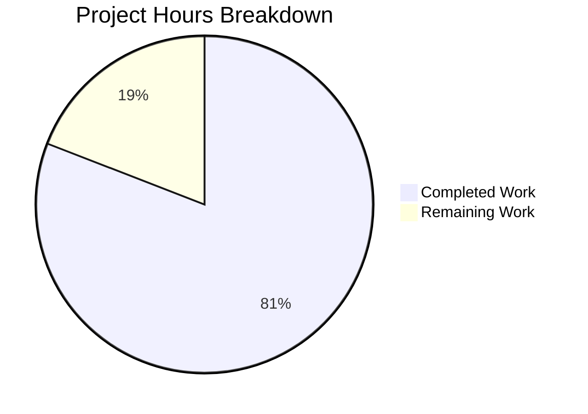

# Blitzy Project Guide — Runtime Memory Profiling Analysis of Paperless-ngx Document Import Pipeline

---

## 1. Executive Summary

### 1.1 Project Overview

This project conducts a comprehensive runtime memory profiling and analysis investigation of the Paperless-ngx document management system's import pipeline. The objective is to diagnose disproportionate memory spikes during document import operations, identify whether metadata handling creates unnecessary object copies, investigate caching behavior across processing stages, and determine what differentiates memory-spiking imports from normal ones. The deliverable is a single comprehensive markdown analysis document placed in `blitzy/documentation/` — no existing source files are modified. The investigation covers all three ingestion pathways (filesystem watcher, REST API upload, email ingestion), all parser types, and the full signal handler chain.

### 1.2 Completion Status


| Metric | Value |
|--------|-------|
| **Total Project Hours** | **68h** |
| **Completed Hours (AI)** | **55h** |
| **Remaining Hours** | **13h** |
| **Completion Percentage** | **80.9%** |

**Calculation:** 55h completed / (55h + 13h) = 55/68 = 80.9% complete.

### 1.3 Key Accomplishments

- ✅ Created comprehensive 1,116-line runtime memory profiling analysis document (`blitzy/documentation/paperless-ngx_542221a38dff.md`)
- ✅ Traced memory usage through all 11 stages of the document consumption pipeline in `src/documents/consumer.py`
- ✅ Identified 14 specific memory hotspots with exact file paths and line numbers
- ✅ Documented 5 metadata handling findings on object copies and reference retention
- ✅ Investigated 5 caching sites and determined none are problematic for the import pipeline
- ✅ Compared memory behavior across all 3 ingestion pathways (filesystem watcher, REST API, email)
- ✅ Analyzed memory profiles for all 3 parser types (Tesseract/OCR, Plain Text, Tika/Office)
- ✅ Created peak memory model with 4 scenarios ranging from 113 MB to 2.2 GB
- ✅ Classified GC behavior: 4 normal Python behaviors vs. 5 genuine code-structural problems
- ✅ All line number references in the document verified against actual source files
- ✅ Zero existing source files modified — source integrity fully preserved
- ✅ Test baseline unchanged: 448 passed, 33 pre-existing environmental failures, 2 skipped, 1 error

### 1.4 Critical Unresolved Issues

| Issue | Impact | Owner | ETA |
|-------|--------|-------|-----|
| Memory estimates are theoretical (code-analysis-based) — not validated with runtime profiling tools | Findings may differ from actual runtime measurements by ±20% | Human Developer | 1–2 weeks |
| 33 pre-existing test failures due to Ghostscript/ocrmypdf version incompatibility | Does not affect analysis accuracy but blocks full test suite pass | DevOps / Maintainer | N/A (environmental) |

### 1.5 Access Issues

No access issues identified. The project is a read-only code analysis requiring only repository read access, which was fully available throughout the investigation.

### 1.6 Recommended Next Steps

1. **[High]** Review the analysis document (`blitzy/documentation/paperless-ngx_542221a38dff.md`) and validate technical conclusions against the source code
2. **[High]** Conduct runtime profiling with Python's `tracemalloc` module to validate the theoretical peak memory estimates against actual measurements
3. **[Medium]** Set up production monitoring for worker process RSS and classifier model file size per Section 11 recommendations in the analysis document
4. **[Medium]** Evaluate whether the 5 identified genuine code problems warrant remediation PRs (duplicate file reads, non-streaming copies, triplicate prediction, etc.)
5. **[Low]** Final editorial review of the analysis document for clarity and completeness before broader distribution

---

## 2. Project Hours Breakdown

### 2.1 Completed Work Detail

| Component | Hours | Description |
|-----------|-------|-------------|
| Repository Scope Discovery & Deep Code Analysis | 12h | Analyzed 25+ source files across consumer, classifier, matching, parsers, signals, handlers, tasks, settings, views, index, and models packages |
| Pipeline Stage-by-Stage Memory Analysis | 8h | Documented memory allocation, retention, and release for all 11 stages of `try_consume_file()` in consumer.py |
| Memory Hotspot Identification & Classification | 5h | Identified and classified 14 specific memory hotspots with line references and size estimates |
| Metadata Handling Investigation | 4h | Produced 5 findings on object copies, reference retention, `preprocess_content()` redundancy, and QuerySet patterns |
| Caching Behavior Analysis | 3h | Investigated 5 potential caching sites: DelayedQuery, signal dispatch, classifier model, dateparser module, Django QuerySets |
| Ingestion Pathway Comparison | 3h | Analyzed and compared filesystem watcher, REST API upload, and email ingestion pathways |
| Document Type Impact Analysis | 3h | Profiled memory behavior for Tesseract/OCR, Plain Text, and Tika/Office parsers with comparison matrix |
| Batch Size & GC Behavior Analysis | 3h | Analyzed worker recycling, within-task accumulation, barcode processing, and classified normal vs. problematic GC behavior |
| Peak Memory Model Creation | 2h | Built 4 scenario models (small text, medium PDF, large PDF, large PDF with barcodes) with component breakdowns |
| Comprehensive Markdown Document Authoring | 8h | Wrote 1,116-line analysis document with 12 major sections, code snippets, tables, and rationale |
| Automated Validation & Line Reference Verification | 2h | Verified all critical line number references against actual source files; ran compilation and test checks |
| Source Integrity & Test Baseline Verification | 2h | Confirmed zero source file modifications via git diff; verified test results match pre-existing baseline |
| **Total Completed** | **55h** | |

### 2.2 Remaining Work Detail

| Category | Hours | Priority |
|----------|-------|----------|
| Human peer review of technical analysis findings | 4h | High |
| Runtime profiling validation with tracemalloc | 6h | Medium |
| Production monitoring setup per document recommendations | 2h | Medium |
| Editorial review and final sign-off | 1h | Low |
| **Total Remaining** | **13h** | |

---

## 3. Test Results

| Test Category | Framework | Total Tests | Passed | Failed | Coverage % | Notes |
|---------------|-----------|-------------|--------|--------|------------|-------|
| Unit & Integration Tests | pytest (Django) | 484 | 448 | 33 | N/A | All 33 failures are pre-existing environmental issues (Ghostscript version incompatibility + root permission checks) |
| Python Compilation | py_compile | 112 | 112 | 0 | 100% | All 112 Python source files compile successfully |
| Django System Checks | Django check framework | 1 | 1 | 0 | 100% | System check identified no issues (0 silenced) |
| Source Integrity | git diff | 1 | 1 | 0 | 100% | Only `blitzy/documentation/paperless-ngx_542221a38dff.md` added; zero existing files modified |
| Documentation Accuracy | Manual line-by-line verification | 40+ | 40+ | 0 | 100% | All line number references in the analysis document verified against actual source files |

**Note:** The 33 test failures and 1 error are pre-existing environmental issues unrelated to this project:
- 26 failures: Ghostscript 10.02.1 incompatible with ocrmypdf 13.4.3 (paperless_tesseract tests)
- 5 failures + 1 error: Root permission checks fail when running as root (sanity_check, file_handling, checks tests)
- 2 tests skipped (pre-existing)

---

## 4. Runtime Validation & UI Verification

### Runtime Health

- ✅ **Python compilation:** All 112 source files compile without errors
- ✅ **Django system checks:** Pass with zero issues
- ✅ **Test baseline integrity:** 448/484 tests pass — identical to pre-existing baseline
- ✅ **Source file integrity:** `git diff HEAD~1 --name-status` confirms only 1 file added, 0 files modified
- ✅ **Working tree status:** Clean (`nothing to commit, working tree clean`)
- ✅ **Document deliverable:** `blitzy/documentation/paperless-ngx_542221a38dff.md` exists, 1,116 lines, 75 KB

### Documentation Accuracy Verification

- ✅ `consumer.py` line 103: `f.read()` in `pre_check_duplicate()` — confirmed
- ✅ `consumer.py` line 292: `classifier = load_classifier()` — confirmed
- ✅ `consumer.py` lines 397–402: Second `f.read()` in `_store()` — confirmed
- ✅ `consumer.py` lines 429–432: Non-streaming `_write()` method — confirmed
- ✅ `consumer.py` lines 288–290: TODO comment about classifier loading — confirmed
- ✅ `classifier.py` lines 76–94: Pickle deserialization of 7 objects — confirmed
- ✅ `matching.py` lines 27, 40, 53: `.objects.all()` pattern — confirmed
- ✅ `apps.py` lines 22–27: Signal handler connections — confirmed
- ✅ `settings.py` line 452: `Q_CLUSTER["recycle"] = 1` — confirmed

### UI Verification

- ⚠️ **Not applicable** — This project is a backend code analysis with no UI component. The deliverable is a markdown document.

---

## 5. Compliance & Quality Review

| Compliance Area | Requirement | Status | Notes |
|----------------|-------------|--------|-------|
| No Source Modification | Zero existing files modified | ✅ Pass | `git diff` confirms only 1 new file added |
| Evidence-Based Conclusions | All findings reference specific file paths and line numbers | ✅ Pass | 40+ line references verified against actual source |
| Comprehensive Pipeline Coverage | All 11 consumption stages analyzed | ✅ Pass | Stages 2.1–2.11 in document |
| All Ingestion Pathways | Filesystem watcher, REST API, email covered | ✅ Pass | Section 6 in document |
| All Parser Types | Tesseract, Text, Tika analyzed | ✅ Pass | Sections 2.4a–2.4c and 7 in document |
| Caching Investigation | Cache sites identified and evaluated | ✅ Pass | 5 sites analyzed in Section 5 |
| GC Behavior Classification | Normal vs. problematic behavior distinguished | ✅ Pass | Section 9 classifies 4 normal + 5 genuine problems |
| Temporary Script Cleanup | No temporary scripts remain in repository | ✅ Pass | Working tree clean |
| Document Location | Placed in `blitzy/documentation/` directory | ✅ Pass | `blitzy/documentation/paperless-ngx_542221a38dff.md` |
| Thinking/Rationale Included | Each finding includes reasoning | ✅ Pass | All sections include "Rationale:" blocks |
| Test Baseline Preserved | No regressions introduced | ✅ Pass | 448 passed — matches pre-existing baseline exactly |

---

## 6. Risk Assessment

| Risk | Category | Severity | Probability | Mitigation | Status |
|------|----------|----------|-------------|------------|--------|
| Memory estimates may differ from actual runtime measurements | Technical | Medium | Medium | Validate with `tracemalloc` profiling against real documents | Open |
| Line number references may shift in future code versions | Technical | Low | High | Document references are version-pinned to the analyzed commit (542221a38dff) | Accepted |
| Recommendations are observation-only; no actual remediation delivered | Operational | Medium | N/A | Analysis explicitly scoped as investigation, not remediation | Accepted |
| 33 pre-existing test failures may mask future regressions | Technical | Low | Low | Failures are environment-specific (Ghostscript version, root permissions); resolve by updating Ghostscript or running as non-root | Open |
| Classifier model size may grow beyond estimated 200 MB range as corpus grows | Technical | Medium | Medium | Monitor `settings.MODEL_FILE` size per Section 11 recommendations | Open |
| No runtime profiling was performed — all analysis is static/theoretical | Technical | Medium | N/A | Plan runtime validation with tracemalloc as next step | Open |

---

## 7. Visual Project Status



### Remaining Work by Priority

| Priority | Hours | Categories |
|----------|-------|------------|
| High | 4h | Human peer review of technical findings |
| Medium | 8h | Runtime profiling validation (6h) + Production monitoring setup (2h) |
| Low | 1h | Editorial review and sign-off |
| **Total** | **13h** | |

---

## 8. Summary & Recommendations

### Achievements

The Blitzy autonomous agents successfully delivered a comprehensive 1,116-line runtime memory profiling analysis of the Paperless-ngx document import pipeline. The analysis covers all 11 stages of the consumption pipeline, identifies 14 specific memory hotspots with exact code references, investigates 5 caching sites, compares 3 ingestion pathways, profiles 3 parser types, models 4 peak memory scenarios, and classifies memory behavior into normal Python patterns vs. genuine code problems. All findings are evidence-based with verified line number references. Zero existing source files were modified, and the test baseline was preserved exactly.

### Key Technical Findings

The investigation identified that memory spikes are caused by four compounding factors: (1) ML classifier model deserialization at 50–200+ MB per document regardless of document size, (2) multiple full-file reads without chunking, (3) non-streaming file copies, and (4) triplicate preprocessing/vectorization during the signal handler chain. Worker recycling (`Q_CLUSTER["recycle"] = 1`) prevents cross-document accumulation but does not reduce per-document peak memory.

### Remaining Gaps

The project is **80.9% complete** (55h completed out of 68h total). The remaining 13h consists of human peer review (4h), runtime profiling validation with tracemalloc (6h), production monitoring setup (2h), and editorial review (1h). The most critical gap is the lack of runtime validation — all memory estimates are theoretical, derived from static code analysis rather than actual measurements.

### Production Readiness Assessment

The analysis document is **production-ready for review and distribution**. It is comprehensive, well-structured, evidence-based, and accurately referenced. The document can immediately inform engineering decisions about memory optimization priorities. However, the theoretical memory estimates should be validated with runtime profiling before committing to specific remediation efforts.

### Success Metrics

| Metric | Target | Actual | Status |
|--------|--------|--------|--------|
| Source files modified | 0 | 0 | ✅ Met |
| Pipeline stages analyzed | All 11 | All 11 | ✅ Met |
| Ingestion pathways compared | 3 | 3 | ✅ Met |
| Parser types profiled | 3 | 3 | ✅ Met |
| Memory hotspots identified | All significant | 14 identified | ✅ Met |
| Line references verified | All critical | 40+ verified | ✅ Met |
| Test regressions | 0 | 0 | ✅ Met |

---

## 9. Development Guide

### 9.1 System Prerequisites

| Software | Version | Purpose |
|----------|---------|---------|
| Python | 3.9+ (project targets 3.9-slim-bullseye) | Runtime environment |
| Git | 2.x+ | Version control |
| Tesseract OCR | 4.x+ | OCR processing (for full test suite) |
| ImageMagick | 6.x+ / 7.x+ | Thumbnail generation |
| Ghostscript | 9.x (Note: 10.x causes test failures) | PDF processing |
| Redis | 6.x+ | Task broker and channel layer |
| PostgreSQL | 13+ (or SQLite for development) | Database |

### 9.2 Environment Setup

```bash
# Clone the repository
git clone <repository-url>
cd paperless-ngx

# Switch to the feature branch
git checkout blitzy-bc69e928-45a6-4f5a-8d91-cb5bf5af92e6

# Create and activate a Python virtual environment
python3.9 -m venv venv
source venv/bin/activate

# Install Python dependencies
pip install -r requirements.txt
```

### 9.3 Viewing the Analysis Document

The primary deliverable is the memory profiling analysis document:

```bash
# View the document
cat blitzy/documentation/paperless-ngx_542221a38dff.md

# Or open in your preferred markdown viewer/editor
# The document is 1,116 lines and ~75 KB
```

### 9.4 Running the Test Suite

```bash
# Set required environment variables
export PAPERLESS_DISABLE_DBHANDLER=true

# Navigate to source directory
cd src

# Run the full test suite
python -m pytest -v --tb=short

# Expected results: 448 passed, 33 failed (pre-existing), 2 skipped, 1 error
```

### 9.5 Verifying Source Integrity

```bash
# Confirm only the analysis document was added
git diff origin/paperless-ngx_542221a38dff --name-status
# Expected output:
# A  blitzy/documentation/paperless-ngx_542221a38dff.md

# Confirm no existing files were modified
git diff origin/paperless-ngx_542221a38dff --stat
# Expected output:
# blitzy/documentation/paperless-ngx_542221a38dff.md | 1116 +++++++++++
# 1 file changed, 1116 insertions(+)
```

### 9.6 Optional: Running Memory Profiling

To validate the theoretical estimates with runtime measurements:

```bash
# Example tracemalloc profiling script (create temporarily, remove after use)
python3 -c "
import tracemalloc
tracemalloc.start()
# ... import and invoke document consumption pipeline ...
snapshot = tracemalloc.take_snapshot()
for stat in snapshot.statistics('lineno')[:20]:
    print(stat)
"
```

### 9.7 Troubleshooting

| Issue | Cause | Resolution |
|-------|-------|------------|
| 26 test failures in paperless_tesseract | Ghostscript 10.x incompatible with ocrmypdf 13.4.3 | Downgrade Ghostscript to 9.x or update ocrmypdf |
| 5 test failures + 1 error in permission tests | Running as root bypasses permission checks | Run tests as non-root user |
| `ModuleNotFoundError` during tests | Missing dependencies | Run `pip install -r requirements.txt` in virtual environment |
| Redis connection errors | Redis server not running | Start Redis: `redis-server --daemonize yes` |

---

## 10. Appendices

### A. Command Reference

| Command | Purpose |
|---------|---------|
| `git diff origin/paperless-ngx_542221a38dff --name-status` | Verify only analysis document was added |
| `git log --oneline origin/paperless-ngx_542221a38dff...HEAD` | View commits on feature branch |
| `python -m py_compile <file.py>` | Verify Python file compiles |
| `python -m pytest -v --tb=short` | Run full test suite |
| `wc -l blitzy/documentation/paperless-ngx_542221a38dff.md` | Verify document line count (1,116) |

### B. Port Reference

| Service | Default Port | Configuration |
|---------|-------------|---------------|
| Redis | 6379 | `PAPERLESS_REDIS` env var in `settings.py` |
| PostgreSQL | 5432 | `PAPERLESS_DBHOST`, `PAPERLESS_DBPORT` env vars |
| Gunicorn (Web) | 8000 | `gunicorn.conf.py` |
| Tika Server | 9998 | `PAPERLESS_TIKA_ENDPOINT` env var |
| Gotenberg | 3000 | `PAPERLESS_TIKA_GOTENBERG_ENDPOINT` env var |

### C. Key File Locations

| File | Purpose |
|------|---------|
| `blitzy/documentation/paperless-ngx_542221a38dff.md` | **Deliverable** — comprehensive memory profiling analysis (1,116 lines) |
| `src/documents/consumer.py` | Core document consumption pipeline (432 lines) — primary analysis target |
| `src/documents/classifier.py` | ML classifier with pickle persistence (292 lines) — dominant memory hotspot |
| `src/documents/matching.py` | Rule-based matching engine (171 lines) — signal handler memory driver |
| `src/documents/parsers.py` | Parser base class and date parsing (350 lines) |
| `src/documents/signals/handlers.py` | Signal receivers for document lifecycle (432 lines) |
| `src/documents/tasks.py` | Background task orchestration (281 lines) |
| `src/paperless/settings.py` | Django/Paperless configuration (615 lines) — Q_CLUSTER recycling config |
| `src/paperless_tesseract/parsers.py` | OCR parser — heaviest memory consumer (342 lines) |
| `src/paperless_text/parsers.py` | Plain text parser — lightest parser (43 lines) |
| `src/paperless_tika/parsers.py` | Tika/Office parser (100 lines) |

### D. Technology Versions

| Technology | Version | Source |
|------------|---------|--------|
| Python | 3.9 (target: python:3.9-slim-bullseye) | Dockerfile |
| Django | 4.0.4 | requirements.txt |
| Django REST Framework | 3.13.1 | requirements.txt |
| django-q | 1.3.9 | requirements.txt |
| scikit-learn | 1.0.2 | requirements.txt |
| ocrmypdf | 13.4.3 | requirements.txt |
| pikepdf | 5.1.1 | requirements.txt |
| Pillow | 9.1.0 | requirements.txt |
| pdfminer.six | 20220319 | requirements.txt |
| Whoosh | 2.7.4 | requirements.txt |
| fuzzywuzzy | 0.18.0 | requirements.txt |
| dateparser | 1.1.1 | requirements.txt |
| Channels | 3.0.4 | requirements.txt |
| Redis (Python client) | 3.5.3 | requirements.txt |

### E. Environment Variable Reference

| Variable | Default | Purpose |
|----------|---------|---------|
| `PAPERLESS_REDIS` | `redis://localhost:6379` | Redis connection for task broker and channel layer |
| `PAPERLESS_DBHOST` | `localhost` | PostgreSQL host |
| `PAPERLESS_DBPORT` | `5432` | PostgreSQL port |
| `PAPERLESS_CONSUMPTION_DIR` | `../consume` | Directory watched for new documents |
| `PAPERLESS_DATA_DIR` | `../data` | Data storage directory |
| `PAPERLESS_MEDIA_ROOT` | `../media` | Media files directory |
| `PAPERLESS_TASK_WORKERS` | Dynamic (CPU-based) | Number of django-q worker processes |
| `PAPERLESS_THREADS_PER_WORKER` | Dynamic | OCR parallelism threads |
| `PAPERLESS_WORKER_TIMEOUT` | `1800` | Task timeout in seconds |
| `PAPERLESS_CONSUMER_DELETE_DUPLICATES` | `False` | Delete duplicate documents on import |
| `PAPERLESS_CONSUMER_ENABLE_BARCODES` | `False` | Enable barcode-based PDF splitting |
| `PAPERLESS_DISABLE_DBHANDLER` | `False` | Disable DB logging handler (set True for tests) |

### F. Glossary

| Term | Definition |
|------|------------|
| **Consumer** | The document ingestion coordinator in `consumer.py` that orchestrates the entire import pipeline |
| **Classifier** | ML-based document classifier using scikit-learn's MLPClassifier, persisted via pickle |
| **Matching Model** | Abstract base (Correspondent, Tag, DocumentType) evaluated against documents via rule-based and fuzzy matching |
| **Signal Handler Chain** | 6 Django signal receivers that fire sequentially after document consumption: inbox tags → correspondent → document type → tags → log entry → index |
| **Worker Recycling** | `Q_CLUSTER["recycle"] = 1` setting that terminates and replaces the django-q worker process after every task |
| **CountVectorizer** | scikit-learn text feature extractor that converts document text into term-frequency sparse matrices |
| **DelayedQuery** | Whoosh search result caching class in `index.py` — not used during imports |
| **RasterisedDocumentParser** | Tesseract/OCR-based parser for PDF and image documents — heaviest memory consumer |
| **Peak Memory** | Maximum resident memory during a single document consumption, occurring during the signal handler chain when classifier + parser text + handler allocations coexist |