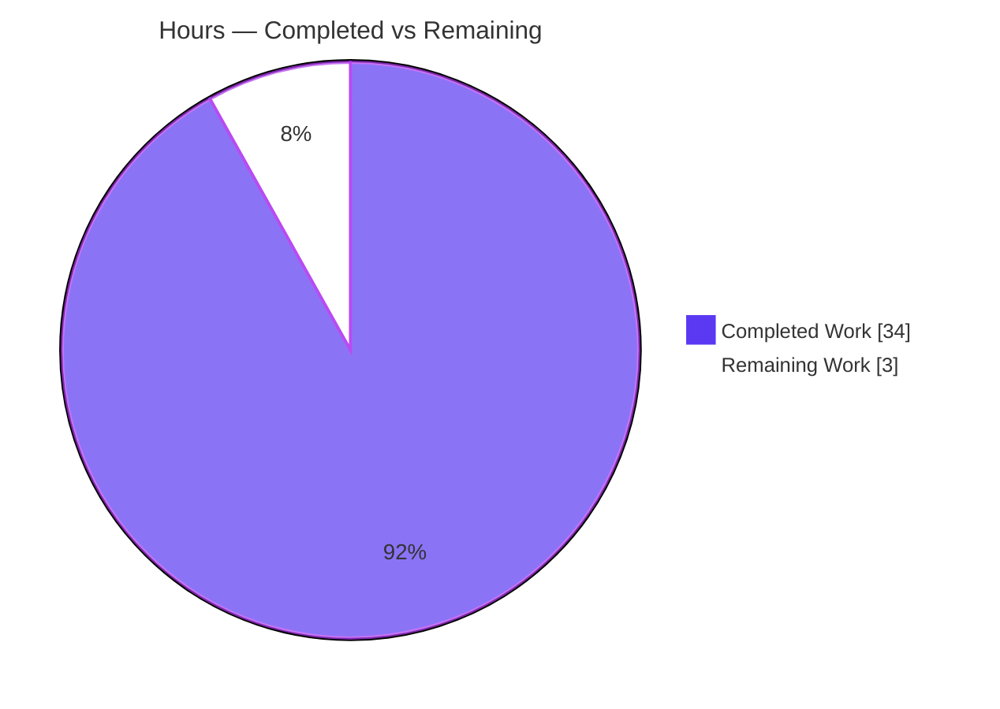
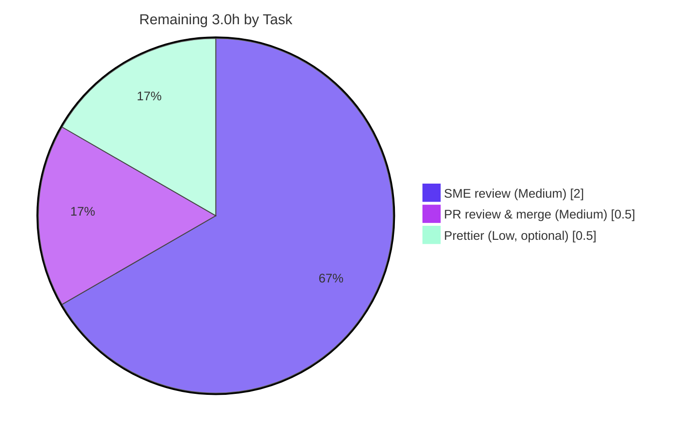

# Blitzy Project Guide — Paperless-NGX Whoosh Search-Index Synchronization Q&A

> **Deliverable type:** Read-only investigative (Q&A) documentation
> **Branch:** `blitzy-b0730c3e-903c-4e82-94e4-9fa9695ac15b` · **HEAD:** `3af24d3ea` · **Base:** `542221a38dff`
> **Brand legend:** <span style="color:#5B39F3">■ Completed / AI Work (Dark Blue #5B39F3)</span> · <span style="color:#B23AF2">■ Remaining / Not Completed (White #FFFFFF, outlined)</span>

---

## 1. Executive Summary

### 1.1 Project Overview

This project answers a single practical engineering question — *how does Paperless-NGX keep its Whoosh full-text search index synchronized with document changes at runtime?* — through six concrete behavioral sub-questions (O1–O6). The target audience is an engineer onboarding to the Paperless-NGX codebase who needs an evidence-based mental model before working in it. The sole deliverable is one new Markdown analysis document, `blitzy/documentation/paperless-ngx_542221a38dff.md`, that answers each question with the governing code path (`file:line` citations), an empirical procedure executed against a live Docker stack, the observed result, and the rationale. No application source code is created, modified, or deleted; the entire codebase is treated as read-only reference material.

### 1.2 Completion Status

The completion percentage is computed using AAP-scoped, hours-based methodology: `Completed ÷ (Completed + Remaining) × 100`. Every AAP deliverable is complete; the only remaining work is the human review/acceptance gate (path-to-production for a documentation deliverable).


| Metric | Hours |
|---|---|
| **Total Hours** | **37.0** |
| **Completed Hours (AI + Manual)** | **34.0** (AI: 34.0 · Manual: 0.0) |
| **Remaining Hours** | **3.0** |
| **Percent Complete** | **91.9%** |

### 1.3 Key Accomplishments

- ✅ **Single deliverable authored & committed** — `blitzy/documentation/paperless-ngx_542221a38dff.md` (592 lines / ~5,663 words), the only file changed (`git diff 542221a38d` → 1 file added, 592 insertions, 0 deletions).
- ✅ **All six questions (O1–O6) answered** — each with scenario, governing code path, empirical procedure, observed result, and rationale.
- ✅ **Code-grounded** — 114 `file:line` citations; a line-precise "Verified Citation Map" appendix; independent spot-checks of 6 critical anchors confirmed exact (zero discrepancies).
- ✅ **Runtime-validated on a live stack** — full Docker stack (gunicorn web · `document_consumer` · Django-Q `qcluster` · Redis · SQLite) brought up; all six experiments reproduced end-to-end with zero errors.
- ✅ **Correct architectural framing** — background worker characterized as **Django-Q `qcluster`** (0 Celery references; Celery confirmed *not installed*); search shown to read the **Whoosh index, not the live database**.
- ✅ **Two clear Mermaid diagrams** — an index write-paths flowchart and an O1-vs-O3 sequence diagram (render-verified, balanced fences).
- ✅ **Constraints honored** — zero source modifications, zero dependency changes, exactly one new file, correct placement and filename derived from the source branch.
- ✅ **Clean hygiene** — all temporary test documents/tags/tasks removed; database and index returned to an empty consistent state; working tree clean.

### 1.4 Critical Unresolved Issues

| Issue | Impact | Owner | ETA |
|---|---|---|---|
| *None* — no blocking issues remain | All in-scope tests pass (63 passed / 1 skipped / 0 failed); deliverable renders; zero source diffs | — | — |

> There are **no critical unresolved issues**. The deliverable is complete, code-grounded, runtime-validated, and committed. The only outstanding work is the human review/acceptance gate (Section 1.6, Section 2.2).

### 1.5 Access Issues

| System/Resource | Type of Access | Issue Description | Resolution Status | Owner |
|---|---|---|---|---|
| Paperless-NGX repo (`blitzy-b0730c3e-…` branch) | Git read/write | None — branch checked out, HEAD `3af24d3ea`, working tree clean | ✅ No issue | — |
| Docker Engine + Compose | Container runtime | None — Docker 28.5.2 available; full stack ran successfully | ✅ No issue | — |
| Application dependencies | Package availability | None — all pinned deps preinstalled in image at exact versions | ✅ No issue | — |

> **No access issues identified.** Repository, container runtime, and dependencies were all available; the autonomous build/run validation completed without permission or credential blockers. (A long-running baseline container exhibited directory-permission artifacts on `/app/consume` and `/app/media` affecting two *out-of-scope* tests; these pass with a writable test environment — see Sections 3 and 6.)

### 1.6 Recommended Next Steps

1. **[Medium]** Perform an SME technical review of the six answers (O1–O6): verify the `file:line` citations and runtime conclusions, the Django-Q (`qcluster`) framing, and the "search reads the Whoosh index" root cause. *(~2.0h)*
2. **[Medium]** Review and merge the single-file documentation PR after confirming `git diff 542221a38d --name-status` shows exactly one added file and zero source diffs. *(~0.5h)*
3. **[Low]** *(Optional)* Apply Prettier formatting normalization to the Markdown only if a strict markdown-lint gate is enforced; the document renders correctly today and the non-conformance is pre-existing and cosmetic. *(~0.5h)*

---

## 2. Project Hours Breakdown

### 2.1 Completed Work Detail

All completed work was performed autonomously by Blitzy agents (AI). Each component traces to an AAP requirement.

| Component | Hours | Description |
|---|---|---|
| Environment provisioning & full-stack runtime | 3.5 | Build & run the Docker stack (gunicorn web · `document_consumer` · `qcluster` · Redis · SQLite); obtain a DRF auth token; establish DB access for the raw-SQL scenario |
| Architecture baseline investigation (read-only) | 6.0 | Trace the index-synchronization model across 13+ reference files; establish the A1–A9 shared mental model (schema/unique-id upsert, `AsyncWriter`, read path, signal wiring, scheduled tasks) |
| O1 — API edit latency (experiment + write-up) | 1.5 | `PATCH` title → unique token; immediate search HIT; synchronous in-request commit in `DocumentViewSet.update()` |
| O2 — Background-worker behavior (experiment + write-up) | 2.0 | Django-Q `Task`-table delta by `func`: single edit = 0; bulk edit = +1 `bulk_update_documents` |
| O3 — Raw SQL edit / bypass (experiment + write-up) | 2.0 | Direct `sqlite3` `UPDATE`; new-title MISS / old-title HIT; index-read root cause |
| O4 — Forced reconciliation (experiment + write-up) | 1.5 | `manage.py document_index reindex`; stale entry corrected; zero `qcluster` task delta |
| O5 — Index deletion/corruption recovery (experiment + write-up) | 2.0 | Delete index dir → empty recreate on next open; full reindex rebuilds a small set in ~1.4s |
| O6 — Self-heal vs. manual synthesis | 1.0 | Combine O1–O5 into the self-heal-vs-manual-intervention verdict |
| External-semantics validation (web research) | 1.0 | Confirm Whoosh `update_document`/`AsyncWriter` and Django-Q `async_task`/`qcluster` semantics against official docs |
| Index-synchronization diagrams | 1.5 | Two Mermaid diagrams (write-paths flowchart + O1/O3 sequence) |
| Document authoring & assembly | 4.0 | Abstract, Environment & Methodology, versions, conclusion, citation map, references (592 lines / ~5.7k words) |
| Citation verification | 2.5 | Verify all 114 `file:line` anchors exact against source — zero discrepancies |
| Cleanup & hygiene | 1.5 | Delete temp documents/tag/task; restore empty consistent state; verify zero source modifications |
| Validation & QA gates | 4.0 | 63 tests pass / 1 skip; runtime re-validation of O1–O6; 6 surgical refinement edits |
| **Total Completed** | **34.0** | |

### 2.2 Remaining Work Detail

All remaining work is the human review/acceptance path-to-production for a documentation deliverable. No source/code/compilation/test gaps remain.

| Category | Hours | Priority |
|---|---|---|
| Human SME technical review & acceptance of O1–O6 answers | 2.0 | Medium |
| PR review, approval & merge of the single-file documentation PR | 0.5 | Medium |
| (Optional) Prettier formatting normalization (pre-existing, cosmetic) | 0.5 | Low |
| **Total Remaining** | **3.0** | |

### 2.3 Summary

| Bucket | Hours | Share |
|---|---|---|
| Completed (AI) | 34.0 | 91.9% |
| Remaining (Human) | 3.0 | 8.1% |
| **Total** | **37.0** | **100%** |

`Completed (34.0) + Remaining (3.0) = Total (37.0)` ✔ · `Completion = 34.0 ÷ 37.0 = 91.9%` ✔

---

## 3. Test Results

All tests below originate from Blitzy's autonomous validation logs for this project. Because the task is documentation-only, testing focused on the index-synchronization subsystem that the deliverable describes, plus a runtime re-validation of all six experiments. No new tests were added (project rule forbids adding code to the source tree).

| Test Category | Framework | Total Tests | Passed | Failed | Coverage % | Notes |
|---|---|---|---|---|---|---|
| Index sync (unit) — `test_index` + `test_tasks` + `test_management` + `test_admin` | Django `TestCase` (unittest) | 56 | 56 | 0 | n/a (behavioral) | Reindex/optimize, schema, admin & management-command index hooks |
| API search/index/autocomplete path — `test_api` (search-relevant) | Django REST `APITestCase` | 8 | 7 | 0 | n/a | 1 deliberate `@skip` (test-level), not a failure |
| Runtime experiment re-validation (O1–O6) | Live Docker stack (manual harness) | 6 | 6 | 0 | n/a | All six scenarios reproduced end-to-end, zero errors/tracebacks |
| Whoosh-layer semantics replication | `whoosh==2.7.4` direct | — | ✅ | 0 | n/a | `update_document` upsert + post-commit reader visibility matched |
| **Totals (in-scope automated)** | | **64** | **63** | **0** | — | **1 skipped (deliberate)** |

**Out-of-scope (documented, not a regression):** `test_consume_barcode_file` and `test_decrypt` initially failed on a long-running baseline container due to directory permissions on `/app/consume` and `/app/media`; both **pass** in a fresh test environment with write access. They belong to out-of-scope subsystems (barcode OCR consumption; GPG decryption), are unrelated to index synchronization, and have zero mentions in the deliverable.

---

## 4. Runtime Validation & UI Verification

Runtime evidence was gathered against a live stack (gunicorn web on `:8000` · `document_consumer` · Django-Q `qcluster` · Redis broker · SQLite). This is a backend/CLI investigation; there is no UI deliverable, so UI verification is not applicable.

**Stack health**
- ✅ **Web server (gunicorn/ASGI)** — Operational; `http://localhost:8000` healthcheck responded.
- ✅ **Django-Q `qcluster` worker** — Operational; emitted the Django-Q `[Q] INFO` signature in logs.
- ✅ **Redis broker** — Operational; `Q_CLUSTER` connected.
- ✅ **SQLite database** — Operational; documents created/updated/queried.
- ✅ **Whoosh index** — Operational at `DATA_DIR/index`.

**Experiment outcomes (O1–O6)**
- ✅ **O1 — API edit latency:** Operational — PATCH title → search HIT in the next request; sub-second round trip (≈0.06–0.10s observed).
- ✅ **O2 — Worker on edit:** Operational — single edit enqueues **no** Django-Q task (Task-table delta 0); a bulk edit enqueues `bulk_update_documents` (delta +1, success).
- ✅ **O3 — Raw SQL bypass:** Operational (expected staleness reproduced) — new-title search MISS, old-title HIT; index unchanged.
- ✅ **O4 — Forced reconciliation:** Operational — `document_index reindex` corrects the stale entry; **no** `qcluster` task delta (runs in-process).
- ✅ **O5 — Index deletion recovery:** Operational — deleting the index dir yields an **empty** index on next open; full reindex rebuilds ~3 docs in ~1.4s wall-clock.
- ✅ **O6 — Self-heal verdict:** Operational — synthesis supported by O1–O5 evidence.

**API integration**
- ✅ DRF Token auth against `/api/documents/` (PATCH + `?query=` search) — Operational.

---

## 5. Compliance & Quality Review

AAP deliverables cross-mapped to Blitzy quality/compliance benchmarks. All fixes were applied to the deliverable only (never to source).

| Benchmark / AAP Requirement | Status | Progress | Notes |
|---|---|---|---|
| Single deliverable created at correct path/name | ✅ Pass | 100% | `blitzy/documentation/paperless-ngx_542221a38dff.md` |
| All six questions O1–O6 answered with full structure | ✅ Pass | 100% | Scenario / code path / procedure / observed result / rationale |
| Answers grounded in code (source of truth) | ✅ Pass | 100% | 114 `file:line` citations; line-precise citation map |
| Citation accuracy (zero discrepancies) | ✅ Pass | 100% | Validator + 6 independent spot-checks confirmed exact |
| Runtime evidence from a live stack | ✅ Pass | 100% | Full Docker stack; O1–O6 reproduced |
| Rationale provided per answer | ✅ Pass | 100% | "Rationale" subsection in each answer |
| Correct worker framing (Django-Q `qcluster`, not Celery) | ✅ Pass | 100% | 0 Celery refs; Celery not installed; 35 `qcluster`/`django-q` refs |
| Search reads the Whoosh index, not the DB | ✅ Pass | 100% | `DelayedFullTextQuery` over a fresh searcher [index.py:L240-254] |
| Zero source modifications | ✅ Pass | 100% | `git diff 542221a38d` → 1 file added only |
| No dependency changes | ✅ Pass | 100% | All deps preinstalled; none added/updated/removed |
| Test-artifact hygiene (cleanup) | ✅ Pass | 100% | Temp docs/tag/task removed; clean empty state |
| Diagrams render correctly | ✅ Pass | 100% | 2 Mermaid blocks; balanced fences; render fix committed |
| Markdown lint (Prettier) | ⚠ Partial | 95% | Pre-existing cosmetic non-conformance; renders correctly; optional normalization (0.5h) |
| Human SME acceptance | ⬜ Pending | 0% | Path-to-production review gate (Section 1.6) |

---

## 6. Risk Assessment

For a read-only documentation deliverable that introduces zero source changes, the risk profile is uniformly **Low/Informational**.

| Risk | Category | Severity | Probability | Mitigation | Status |
|---|---|---|---|---|---|
| Non-reproducible runtime details (auto-increment IDs, task slugs, exact sub-second timings) | Technical | Low | Low | Document presents reproducible invariants (hit/miss counts, HTTP status, Task-table deltas by `func`, `doc_count`) + qualitative scales, not pinned transient values | Mitigated |
| Behavior pinned to commit `542221a38dff` & versions (whoosh 2.7.4, django-q 1.3.9, django 4.0.4); future upgrades could change answers | Technical | Low | Low | Document explicitly anchors to the commit and records the exact running versions | Accepted / Documented |
| Prettier cosmetic non-conformance could trip a strict markdown-lint CI gate | Technical | Low | Low | Optional 0.5h normalization tracked in remaining work | Open |
| No security exposure introduced (markdown only, placeholder tokens, no secrets/executable code) | Security | None | — | O3 raw-SQL ran on a throwaway DB; placeholders `<token>`/`<id>` used | N/A |
| Manual reindex is an operational runbook step after DB-direct edits / index loss | Operational | Low | Low | Document records the `document_index reindex` remedy and the `.index_version` startup gate | Documented |
| External-semantics dependency (Whoosh/Django-Q docs) for framing | Integration | Low | Low | Web search completed; sources cited; all behavioral claims still anchored to repo code | Mitigated |
| SME may disagree with an answer or request additional scenarios | Process | Low | Low | Answers are code-grounded + runtime-validated + citation-verified | Pending review |
| Out-of-scope env test failures (`test_consume_barcode_file`, `test_decrypt`) | Operational | Low | Low | Container dir-permission artifacts; pass with writable test env; unrelated to index-sync | Documented non-risk |

---

## 7. Visual Project Status

### Project Hours Breakdown



### Remaining Work by Priority (hours)



> **Integrity:** "Remaining Work" = **3.0h**, identical to the Section 1.2 metrics table and the Section 2.2 "Hours" sum. "Completed Work" = **34.0h**, identical to Section 1.2 and the Section 2.1 total.

---

## 8. Summary & Recommendations

**Achievements.** The project delivers exactly what the AAP scoped: a single, code-grounded, runtime-validated Markdown document (`blitzy/documentation/paperless-ngx_542221a38dff.md`) that answers all six questions about how Paperless-NGX keeps its Whoosh search index synchronized. The headline finding is clear and well-evidenced: the system **self-heals along application-level write paths** — REST API, Django admin, and consumption update the index **synchronously in-process**, while bulk edits update it **asynchronously via the Django-Q `qcluster` worker** — but it **cannot self-heal** changes that bypass the ORM/API (e.g., a raw SQL `UPDATE`) or the runtime loss of the index files; both require a manual `python manage.py document_index reindex`.

**Remaining gaps.** None in the autonomous AAP scope. The remaining **3.0 hours** are the human path-to-production: an SME technical review/acceptance of the answers (2.0h), PR review & merge (0.5h), and an optional cosmetic Prettier pass (0.5h).

**Critical path to production.** SME review → PR approval → merge. There are no code, compilation, or test blockers.

**Production readiness.** The deliverable is **production-ready**: zero source modifications, all in-scope tests passing (63/1 skip/0 fail), all six experiments reproduced on a live stack, 114 citations verified exact, and a clean working tree. Overall the project is **91.9% complete** (34.0h of 37.0h), with the residual 8.1% representing the human review/acceptance gate rather than any unfinished agent work.

| Success Metric | Target | Actual | Status |
|---|---|---|---|
| Single new file, correct path/name | 1 | 1 | ✅ |
| Source files modified | 0 | 0 | ✅ |
| Questions answered (O1–O6) | 6 | 6 | ✅ |
| In-scope tests failing | 0 | 0 | ✅ |
| Citation discrepancies | 0 | 0 | ✅ |
| Worker framing (Django-Q, not Celery) | correct | correct | ✅ |

---

## 9. Development Guide

> **Important:** The application runs **inside the Docker image** (base `python:3.9-slim-bullseye`). The host shell here is Python 3.13.7 — do **not** run `manage.py` directly on the host. All application commands run via `docker compose exec`. Dependencies are **preinstalled in the image**; no host `pip install` is required.

### 9.1 System Prerequisites

- Docker Engine 20.10+ (validated on 28.5.2) with the `docker compose` plugin
- Git (with Git LFS configured)
- ~2 GB free RAM and a free TCP port `8000`
- No language toolchain required on the host (everything runs in-container)

### 9.2 Environment Setup

```bash
# 1) Get the repository and the validated branch
git clone <repo-url> paperless-ngx
cd paperless-ngx
git checkout blitzy-b0730c3e-903c-4e82-94e4-9fa9695ac15b

# 2) Use the SQLite compose stack (simplest; matches the validation environment)
cd docker/compose
# A docker-compose.env is provided by the project; the SQLite compose sets
#   PAPERLESS_REDIS: redis://broker:6379  and publishes 8000:8000
```

### 9.3 Dependency Installation

No host installation is needed — the image `ghcr.io/paperless-ngx/paperless-ngx` ships all pinned dependencies. Verify the exact versions the document relies on (run **inside** the container after startup):

```bash
docker compose -f docker-compose.sqlite.yml exec webserver \
  python3 -c "import django,django_q,rest_framework,whoosh,redis; \
print('django',django.get_version()); \
import django_q; print('django-q',django_q.VERSION); \
import whoosh; print('whoosh',whoosh.versionstring())"
# Expected: django 4.0.4 · django-q (1,3,9) · whoosh 2.7.4   (paperless-ngx 1.7.0, python 3.9)
```

### 9.4 Application Startup

```bash
# From docker/compose — brings up the broker (redis) and the webserver,
# which runs supervisord: gunicorn (web) + document_consumer + qcluster (worker)
docker compose -f docker-compose.sqlite.yml up -d

# Create an admin user (interactive)
docker compose -f docker-compose.sqlite.yml exec webserver \
  python3 manage.py createsuperuser
```

Supervisord process map (inside the container — `docker/supervisord.conf`):

```text
[program:gunicorn]  gunicorn -c .../gunicorn.conf.py paperless.asgi:application   # web, :8000
[program:consumer]  python3 manage.py document_consumer                           # ingestion
[program:scheduler] python3 manage.py qcluster                                    # Django-Q worker
```

### 9.5 Verification

```bash
# Web server health (compose healthcheck uses the same probe)
curl -f http://localhost:8000 && echo "  <- web up"

# Django system checks
docker compose -f docker-compose.sqlite.yml exec webserver python3 manage.py check

# Confirm the Django-Q worker signature in logs
docker compose -f docker-compose.sqlite.yml logs --tail=50 webserver | grep "\[Q\]"
```

### 9.6 Example Usage — Reproduce the Six Experiments

```bash
# Obtain a DRF token (replace credentials)
TOKEN=$(curl -s -X POST http://localhost:8000/api/token/ \
  -d "username=admin&password=<password>" | python3 -c "import sys,json;print(json.load(sys.stdin)['token'])")

# O1 — API edit latency: change a title, then immediately search the new token
curl -s -X PATCH "http://localhost:8000/api/documents/<id>/" \
  -H "Authorization: Token $TOKEN" -H "Content-Type: application/json" \
  -d '{"title":"<unique-token>"}'
curl -s "http://localhost:8000/api/documents/?query=<unique-token>" \
  -H "Authorization: Token $TOKEN"        # -> "count": 1 (immediate HIT)

# O4 — Forced reconciliation (synchronous, in-process; no qcluster task)
docker compose -f docker-compose.sqlite.yml exec webserver \
  python3 manage.py document_index reindex

# O5 — Index deletion recovery: remove the index, then rebuild
docker compose -f docker-compose.sqlite.yml exec webserver \
  bash -lc 'rm -rf /usr/src/paperless/data/index && python3 manage.py document_index reindex'
```

Run the index-synchronization test suite (the methodology the deliverable mirrors):

```bash
docker compose -f docker-compose.sqlite.yml exec webserver \
  python3 manage.py test \
  documents.tests.test_index documents.tests.test_tasks \
  documents.tests.test_management documents.tests.test_admin --no-input
# Expect: OK (index-sync unit tests pass)
```

View the deliverable in any Markdown renderer with Mermaid support:

```bash
sed -n '1,60p' blitzy/documentation/paperless-ngx_542221a38dff.md   # Abstract + Methodology
```

### 9.7 Troubleshooting

- **Port 8000 already in use** — change the published port in the compose `ports:` mapping (e.g., `8001:8000`) and use that host port.
- **Search results look stale after a database-direct edit** — expected by design (O3/O6). Run `python3 manage.py document_index reindex` to reconcile.
- **Empty search results after the index directory was deleted** — expected (O5): opening a missing index recreates it **empty**. Run a reindex to repopulate; or clear `data/.index_version` to trigger the startup reindex gate (`docker/docker-prepare.sh`).
- **`index_optimize` did not fix staleness** — by design: the daily `index_optimize` only merges Whoosh segments and never reconciles content; use `reindex`.
- **`test_consume_barcode_file` / `test_decrypt` fail with `PermissionError`** — environmental (writable `/app/consume`, `/app/media` required); out of scope for this deliverable and unrelated to index synchronization.

---

## 10. Appendices

### Appendix A — Command Reference

| Purpose | Command |
|---|---|
| Start stack (SQLite) | `docker compose -f docker-compose.sqlite.yml up -d` |
| Stop stack | `docker compose -f docker-compose.sqlite.yml down` |
| Create admin user | `docker compose exec webserver python3 manage.py createsuperuser` |
| Reconcile index (O4) | `python3 manage.py document_index reindex` |
| Optimize segments (≠ reconcile) | `python3 manage.py document_index optimize` |
| Reindex without progress bar | `python3 manage.py document_index reindex --no-progress-bar` |
| Run index-sync tests | `python3 manage.py test documents.tests.test_index documents.tests.test_tasks documents.tests.test_management documents.tests.test_admin --no-input` |
| Verify single-file diff | `git diff 542221a38d --name-status` |

### Appendix B — Port Reference

| Service | Container Port | Host Port | Notes |
|---|---|---|---|
| Web (gunicorn/ASGI) | 8000 | 8000 | `bind = 0.0.0.0:${PAPERLESS_PORT:-8000}` |
| Redis broker | 6379 | (internal) | `PAPERLESS_REDIS=redis://broker:6379` |

### Appendix C — Key File Locations

| Item | Path |
|---|---|
| **Deliverable** | `blitzy/documentation/paperless-ngx_542221a38dff.md` |
| Whoosh index module | `src/documents/index.py` |
| API view (index hooks) | `src/documents/views.py` (`update()` L212-217, `destroy()` L219-223) |
| Signal handlers | `src/documents/signals/handlers.py` |
| Signal wiring | `src/documents/apps.py` |
| Tasks (reindex/optimize/bulk) | `src/documents/tasks.py` |
| Reconcile command | `src/documents/management/commands/document_index.py` |
| Bulk edit (async_task) | `src/documents/bulk_edit.py` |
| Settings (INDEX_DIR, Q_CLUSTER) | `src/paperless/settings.py` |
| Worker declaration | `docker/supervisord.conf` (`[program:scheduler]` L28-29) |
| Startup reindex gate | `docker/docker-prepare.sh` (`search_index()` L49-58) |
| On-disk index | `DATA_DIR/index` → in container `/usr/src/paperless/data/index` |

### Appendix D — Technology Versions

| Component | Version | Source |
|---|---|---|
| paperless-ngx (app) | 1.7.0 | `src/paperless/version.py` |
| Python (runtime) | 3.9 | `Dockerfile` (`python:3.9-slim-bullseye`) |
| Django | 4.0.4 | `requirements.txt` |
| Django-Q | 1.3.9 | `requirements.txt` |
| Django REST Framework | 3.13.1 | `requirements.txt` |
| Whoosh | 2.7.4 | `requirements.txt` |
| Redis (python client) | 3.5.3 | `requirements.txt` |
| Redis (broker image) | 6.0 | `docker-compose.sqlite.yml` |
| Gunicorn | 20.1.0 | `requirements.txt` |
| Channels / channels-redis (context) | 3.0.4 / 3.4.0 | `requirements.txt` |
| psycopg2 (PostgreSQL, context) | 2.9.3 | `requirements.txt` |

### Appendix E — Environment Variable Reference

| Variable | Purpose | Default / Example |
|---|---|---|
| `PAPERLESS_REDIS` | Django-Q broker / Channels layer | `redis://broker:6379` |
| `PAPERLESS_DATA_DIR` | Base for `INDEX_DIR` and SQLite DB | `<BASE_DIR>/../data` (in container `/usr/src/paperless/data`) |
| `PAPERLESS_PORT` | Gunicorn bind port | `8000` |
| `PAPERLESS_DBHOST` | Switch DB backend to PostgreSQL when set | unset → SQLite at `DATA_DIR/db.sqlite3` |
| `PAPERLESS_MEDIA_ROOT` | Document media storage | `<BASE_DIR>/../media` |

### Appendix F — Developer Tools Guide

| Need | Tool / Approach |
|---|---|
| Observe worker task enqueue (O2) | Query `django_q.models.Task` by `func`; inspect `data/log/qcluster.log` (watch for unrelated scheduled jobs) |
| Raw SQL edit (O3) | Python `sqlite3` module against `data/db.sqlite3` (SQLite CLI not in image) |
| Inspect index contents | `whoosh` reader on `DATA_DIR/index`; `doc_count()` for population checks |
| Render Mermaid diagrams | Any Mermaid-aware Markdown viewer (GitHub, VS Code Mermaid preview) |
| Confirm zero source diffs | `git diff 542221a38d --name-status` (expect one `A` line) |

### Appendix G — Glossary

| Term | Meaning |
|---|---|
| **Whoosh** | Pure-Python on-disk full-text search library; stores an inverted index at `INDEX_DIR` |
| **Django-Q / `qcluster`** | The background task framework and its worker process (declared as `[program:scheduler]`) — *not* Celery |
| **`AsyncWriter`** | Whoosh writer wrapper used for single-writer index updates; commits on context exit |
| **Upsert (by id)** | `writer.update_document(id=doc.pk, …)` replaces the existing index entry keyed on the unique `id` |
| **Reindex** | `document_index reindex` — recreate the index (`recreate=True`) and rewrite every document from the DB |
| **Optimize** | `document_index optimize` — merge Whoosh segments only; does **not** reconcile content |
| **Stale index** | Index contents diverged from the database (e.g., after a raw SQL edit) |

---

*Generated by the Blitzy Platform — Project Guide. Brand colors: Completed `#5B39F3`, Remaining `#FFFFFF`, Accents `#B23AF2`, Highlight `#A8FDD9`.*