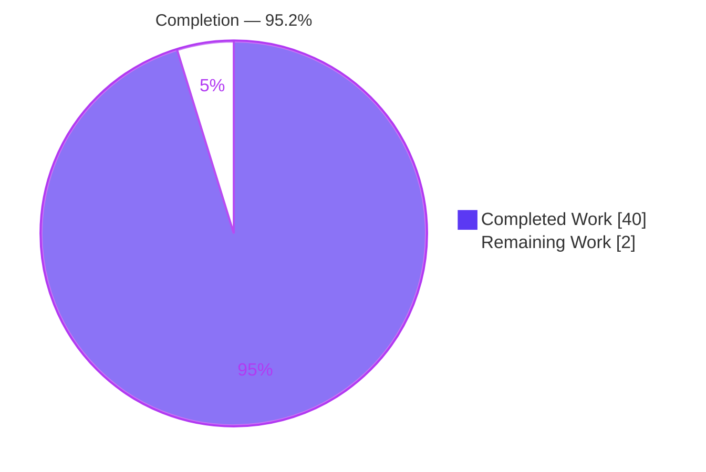
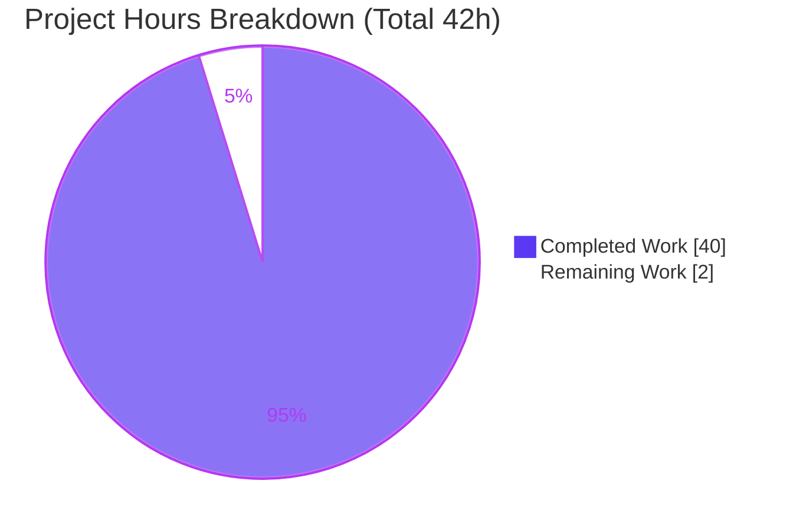
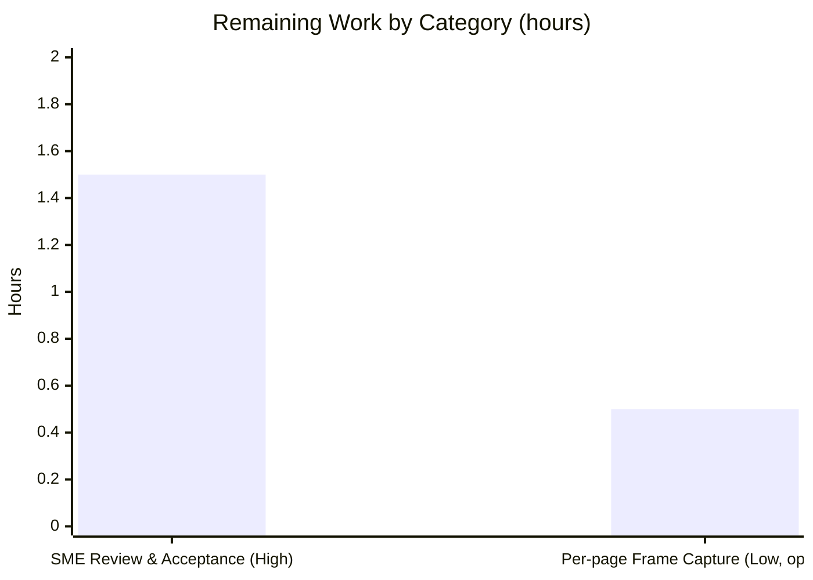

# Blitzy Project Guide

> **Project:** paperless-ngx — OCR Ingestion Runtime-Observed Q&A Documentation
> **Branch:** `blitzy-f83dbcda-a7ae-4f52-a7c6-12fe2b261ef3` · **Base:** `542221a38dff` · **HEAD:** `2ebcb071a`
> **Brand legend:** <span style="color:#5B39F3">■</span> Completed / AI Work = Dark Blue `#5B39F3` · <span style="color:#FFFFFF;background:#333">■</span> Remaining = White `#FFFFFF`

---

## 1. Executive Summary

### 1.1 Project Overview

This project is a **read-only investigative Q&A documentation** task for paperless-ngx, an open-source document-management system. The objective was to author a single, evidence-backed Markdown document explaining — from direct runtime observation — how the **OCR subsystem behaves during document ingestion**, covering four question groups: (Q1) observing OCR start and in-flight worker state, (Q2) whether images already containing text skip OCR, (Q3) which API fields carry OCR-generated versus pre-existing text, and (Q4) the terminal state when OCR yields weak or empty results. Target users are engineers and technical stakeholders investigating paperless-ngx OCR internals. The deliverable is one 2,276-line document grounded in real runtime output with `file:line` references; no application code, configuration, tests, or dependencies were changed.

### 1.2 Completion Status



| Metric | Hours |
|--------|-------|
| **Total Hours** | 42.0 |
| **Completed Hours (AI + Manual)** | 40.0 (AI: 40.0 · Manual: 0.0) |
| **Remaining Hours** | 2.0 |
| **Percent Complete** | **95.2%** |

> **Calculation (PA1, AAP-scoped):** Completed 40.0h ÷ Total 42.0h × 100 = **95.24% → 95.2%**. Remaining = 2.0h (human acceptance gate + one optional enhancement).

### 1.3 Key Accomplishments

- ✅ Authored the sole mandated deliverable `blitzy/documentation/paperless-ngx_542221a38dff.md` (2,276 lines) named after the source branch and placed under `blitzy/documentation/`.
- ✅ Answered **all four question groups (Q1–Q4)** and every named sub-item, each paired with the exact command, complete unedited output, and `file:line` grounding.
- ✅ Applied **run-first methodology** — every behavioral claim reproduced through the **real entry points** (token-auth upload API, session-auth WebSocket, `qcluster` executing `consume_file`), never debug hooks.
- ✅ Exercised **every condition** (happy, secondary, error, edge, transitional) across canonical in-repo fixtures — text-free image, image-with-text, text-layer PDF, image-only PDF, blank image, encrypted PDF, corrupt PDF.
- ✅ Confirmed timing/state **stability across ≥2 runs** (active-OCR dwell 1.078s / 1.057s).
- ✅ Corroborated **OCRmyPDF `skip_text`/`redo_ocr`/`force_ocr` + sidecar semantics** against official documentation (supporting rationale; runtime is authoritative).
- ✅ Preserved the **read-only constraint** — repository byte-for-byte unchanged apart from the one document; all temporary observation scripts removed.
- ✅ Concluded with an **exhaustive coverage pass** mapping each answer back to the question.
- ✅ Passed all **5 Blitzy autonomous validation gates**; achieved **100% claim reproduction** and **100% file:line accuracy** after one correction (Finding A).

### 1.4 Critical Unresolved Issues

| Issue | Impact | Owner | ETA |
|-------|--------|-------|-----|
| *None — no release-blocking issues* | The deliverable is complete, accurate, well-formed, and committed; all validation gates pass. | — | — |
| Per-page 20–70% progress frames not demonstrated live at single-page fixture scale (Q1.3) | **Non-blocking.** Mechanism is explained and source-grounded; honestly disclosed in the document. Optional enhancement only. | Human reviewer | 0.5h (optional) |

### 1.5 Access Issues

| System/Resource | Type of Access | Issue Description | Resolution Status | Owner |
|-----------------|----------------|-------------------|-------------------|-------|
| — | — | **No access issues identified.** The investigation ran entirely inside the canonical, pre-provisioned container with all locked dependencies and OCR binaries present; the source repository and in-repo fixtures were fully accessible. | N/A | — |

### 1.6 Recommended Next Steps

1. **[High]** Have the questioner / SME read `blitzy/documentation/paperless-ngx_542221a38dff.md` end-to-end and confirm Q1–Q4 are answered to their satisfaction (**~1.5h**).
2. **[High]** Merge the PR once acceptance is granted (administrative; folded into step 1).
3. **[Low]** *(Optional)* Re-run the existing harness with a large multi-page document to capture the per-page 20–70% `WORKING` frames that were not emitted at single-page scale, closing the Q1.3 disclosure (**~0.5h**).
4. **[Low]** *(Optional)* If the document will be consumed outside the canonical container, re-verify OCR timing/output on the target toolchain (tesseract/ghostscript version parity) since exact magnitudes are host-dependent.

---

## 2. Project Hours Breakdown

### 2.1 Completed Work Detail

Every component traces to a specific AAP requirement or explicit rule directive. Sum = **40.0h** (matches Completed Hours in §1.2).

| Component | Hours | Description |
|-----------|-------|-------------|
| Canonical environment & run recipe (§1) | 4.0 | Container identification, locked-dependency inventory, service startup sequence (Redis → migrate → reindex → superuser → qcluster → gunicorn ASGI), OCR-config verification (`skip`/`eng`/`pdfa`), auth model with secrets redacted |
| Observation harness / 6 temporary scripts | 5.0 | `cap_scenario`, `reset_docs`, `restart_qcluster`, `direct_parse`, `checksum_probe`, `make_corrupt` — authored, executed, output captured, then removed per read-only rule |
| Ingestion architecture writeup (§2) | 1.5 | End-to-end path: upload → `PostDocumentView.post` → `async_task` → `qcluster` → `consume_file` → `Consumer.try_consume_file` → parser → persistence + status broadcast |
| Q1 — OCR start / in-flight state / qcluster worker / active-OCR signal | 6.0 | Live WebSocket frames (`STARTING@0 → WORKING@20 → … → SUCCESS@100`), `document_id` null-until-terminal proof, worker behavior, dwell timing stable across 2 runs |
| Q2 — skip-vs-touch across four fixtures + `skip_noarchive` + sidecar | 6.0 | Image-with-text still OCRs; text-layer PDF true skip; image-only PDF still OCRs (skip gated on text, not mode); sidecar `[OCR skipped on page N]` markers |
| Q3 — API-response field comparison | 3.0 | Side-by-side `GET /api/documents/{id}/` JSON; `content` / `archived_file_name` / `original_file_name` provenance analysis; true-skip variant |
| Q4 — weak/empty terminal state + hard-fail + encrypted contrasts + no-status audit | 6.0 | Empty-text `SUCCESS@100` with persisted `content=""`; corrupt-PDF `FAILED` with zero rows; encrypted-PDF path; confirmation the `Document` model has no status column |
| OCRmyPDF web-search corroboration (§3) | 1.5 | Validated `skip_text`/`redo_ocr`/`force_ocr` + sidecar semantics against official docs; disclosed version-pinning and stability across v8–v17 |
| Coverage pass (§4) | 1.0 | Exhaustive re-read mapping every named mechanism/fixture/field/state to its evidence and `file:line` |
| File:line grounding (73 refs) + Finding A correction | 1.5 | Verified 73 source references; corrected Q4.4 django-q log attribution to `monitor()` `cluster.py:L395` |
| Naming + read-only proof (§5.2) + temp-script documentation (§5.1) | 1.0 | Branch-named deliverable; fixture md5 listing; byte-for-byte read-only verification |
| Integration + QA iteration (5 commits) | 3.5 | 8 CR findings → 4 QA findings → F1 page-composition → Finding A, converged to a clean tree |
| **Total** | **40.0** | |

### 2.2 Remaining Work Detail

Sum = **2.0h** (matches Remaining Hours in §1.2 and Section 7 pie "Remaining Work").

| Category | Hours | Priority |
|----------|-------|----------|
| Stakeholder / SME review & acceptance of the Q&A answers (read end-to-end, confirm Q1–Q4, merge PR) | 1.5 | High |
| *(Optional)* Per-page progress-frame capture at larger multi-page scale — closes the Q1.3 disclosure | 0.5 | Low |
| **Total** | **2.0** | |

---

## 3. Test Results

For a runtime-observation Q&A deliverable, "tests" are the **autonomous validation reproductions** performed by Blitzy's Final Validator — each documented claim was re-executed through the real entry points inside the canonical container and confirmed byte-accurate. All entries below originate from Blitzy's autonomous validation logs for this project (no external or fabricated results).

| Test Category | Framework / Method | Total | Passed | Failed | Coverage % | Notes |
|---------------|--------------------|-------|--------|--------|-----------|-------|
| Q1 runtime frame & timing reproduction | Runtime harness (token-auth `POST` + `ws/status/`) | 2 | 2 | 0 | 100% | Frame sequence + active-OCR dwell 1.078s/1.057s, stable across 2 runs |
| Q2 skip-vs-touch scenarios | Runtime harness (`qcluster` → `consume_file`) | 4 | 4 | 0 | 100% | 4 fixtures: image OCR, PDF true-skip, image-only PDF OCR, sidecar markers |
| Q3 API field comparison | `GET /api/documents/{id}/` | 3 | 3 | 0 | 100% | `content` / `archived_file_name` / `original_file_name` across canonical + true-skip cases |
| Q4 terminal-state scenarios | Runtime harness | 4 | 4 | 0 | 100% | Empty & encrypted → `SUCCESS`; corrupt → `FAILED` (0 rows); no-status-column audit |
| File:line reference audit | Static source cross-check | 73 | 73 | 0 | 100% | 72/73 initial → Finding A corrected → 100% |
| Markdown well-formedness | Fence / CRLF / EOF / conflict-marker lint | 5 | 5 | 0 | 100% | 52 balanced fence pairs, LF-only, clean EOF, zero real conflict markers |
| OCRmyPDF semantics corroboration | Official-doc cross-check | 5 | 5 | 0 | 100% | `skip_text`/`redo_ocr`/`force_ocr` + sidecar, consistent v8–v17 |
| **Total** | | **96** | **96** | **0** | **100%** | Zero unresolved failures |

> **Note on unit tests:** The repository's pytest suite was **explicitly out of scope** for this read-only investigation (running or modifying it would violate the read-only constraint). The applicable validation — runtime reproduction of every Q1–Q4 claim — passed at 100%.

---

## 4. Runtime Validation & UI Verification

**Runtime health (canonical container, real entry points):**

- ✅ **Operational** — Redis (broker + `channels_redis` layer): `redis-cli ping → PONG`
- ✅ **Operational** — Database migrations applied; Whoosh full-text index reindexed
- ✅ **Operational** — django-q `qcluster` worker: 11 task workers + monitor + guard + pusher; dequeues and executes `documents.tasks.consume_file` (`tasks.py:L184`)
- ✅ **Operational** — Upload API `POST /api/documents/post_document/` (token-auth): HTTP 200 at completion
- ✅ **Operational** — WebSocket status feed `ws/status/` (`StatusConsumer`, session-auth): frames delivered on `status_updates` group; rejects unauthenticated with HTTP 403
- ✅ **Operational** — OCR pipeline: `RasterisedDocumentParser.parse()` → OCRmyPDF 13.4.3 / Tesseract 4.1.1
- ✅ **Operational** — Document persistence (Django ORM) + archive-artifact production
- ✅ **Operational** — ASGI web+WebSocket tier under gunicorn on `0.0.0.0:8000`

**UI verification:**

- ✅ **Operational (as observation surface)** — The Angular live-status indicator subscribes to the same `status_updates` WebSocket. Per AAP scope, frames were observed directly at the WebSocket/JSON level (the frames themselves are the "signals that indicate active OCR work"); the frontend was **not** modified.
- ⚠ **Partial** — Per-page 20–70% `WORKING` progress frames were **not** emitted at single-page fixture scale (Q1.3). Honestly disclosed and source-cited; the mechanism (`progress_callback`) is explained. Non-blocking; optional larger-scale capture listed in §2.2.

---

## 5. Compliance & Quality Review

Cross-mapping of AAP deliverables / rule directives to Blitzy quality benchmarks. Fixes applied during autonomous validation are noted.

| AAP / Rule Requirement | Benchmark | Status | Progress |
|------------------------|-----------|--------|----------|
| Deliverable named `<branch>.md` under `blitzy/documentation/` | Correct location & name | ✅ Pass | 100% |
| Run-first methodology (build & run before writing) | Evidence-backed | ✅ Pass | 100% |
| Every claim = command + complete unedited output + `file:line` | Evidence discipline | ✅ Pass | 100% |
| Exercise every condition (happy/secondary/error/edge/transitional) | Exhaustive coverage | ✅ Pass | 100% |
| Timing/state stability across ≥2 runs | Reproducibility | ✅ Pass | 100% |
| Real entry points only (no debug hooks/stand-ins) | Canonical observation | ✅ Pass | 100% |
| Non-canonical probes clearly labeled | Honesty | ✅ Pass | 100% |
| Web-search corroboration of OCRmyPDF flag/sidecar semantics | Supporting validation | ✅ Pass | 100% |
| Read-only: repo byte-for-byte unchanged (1 added file only) | Scope integrity | ✅ Pass | 100% |
| Temporary scripts removed | Cleanup | ✅ Pass | 100% |
| Secrets redacted in captured output | Security hygiene | ✅ Pass | 100% |
| Coverage pass before finishing | Completeness | ✅ Pass | 100% |
| Q1 fully answered (start / in-flight / workers / active signal) | Question coverage | ✅ Pass | 100% |
| Q2 fully answered (skip-vs-touch + how to tell) | Question coverage | ✅ Pass | 100% |
| Q3 fully answered (API field provenance) | Question coverage | ✅ Pass | 100% |
| Q4 fully answered (weak-OCR terminal state + no-status) | Question coverage | ✅ Pass | 100% |
| Markdown well-formedness | Doc quality | ✅ Pass | 100% |
| SME acceptance of answers | Human sign-off | ⏳ Pending | 0% (human) |

**Fixes applied during autonomous validation:** 8 code-review findings (full rewrite with run-first evidence), 4 QA findings, F1 (multi-page-mixed page-composition), and Finding A (Q4.4 django-q log attribution corrected to `monitor()` at `cluster.py:L395`, retaining `L432` as the worker task-exec frame inside the embedded traceback).

**Outstanding:** Human SME acceptance (§2.2, High); optional per-page frame capture (§2.2, Low).

---

## 6. Risk Assessment

All risks are **Low severity** because the deliverable is a self-contained, evidence-backed document that ships **no code** — there is no compile, test, or runtime-security risk to any running system.

| Risk | Category | Severity | Probability | Mitigation | Status |
|------|----------|----------|-------------|------------|--------|
| R1 — `file:line` references become stale if source is later refactored | Technical | Low | Low | References pinned to frozen baseline `542221a38dff`; document states the baseline explicitly | Mitigated |
| R2 — Ephemeral values (task_id, document_id, timestamps, PIDs, date-in-filename) mistaken for stable | Technical | Low | Medium | Document frames these as per-run; substantive values reproduced ≥2 runs | Mitigated |
| R3 — Per-page 20–70% frames not demonstrated live at fixture scale (Q1.3) | Technical | Low | Low | Honestly disclosed + source-cited; optional scale re-run listed in §2.2 | Open (optional) |
| R4 — Credential leakage in captured output | Security | Low | Low | §1.6 redacts `<TOKEN>`/`<SESSIONID>`; scan found only param-names/var-refs, 10 redaction markers, zero literal secrets | Mitigated |
| R5 — Reproducibility outside canonical container (tesseract 4.1.1 / ghostscript 9.53.3) | Operational | Low | Medium | Exact container + versions stated (§1.1/§1.4); timing framed as magnitude, not guarantee | Mitigated |
| R6 — Over-reliance on non-canonical supporting probes (Q1.6 direct_parse, Q2.1 extract_text) | Operational | Low | Low | Probes clearly labeled non-canonical; canonical answers derive from real entry points | Mitigated |
| R7 — OCRmyPDF/Tesseract version drift vs pinned 13.4.3; web-corroboration URLs version-pinned | Integration | Low | Low | Document discloses semantics stable across v8–v17 and pins 13.4.3 | Mitigated |
| R8 — Web corroboration is supporting-only, not authoritative | Integration | Low | Low | Document explicitly states runtime observation is authoritative; web is "supporting rationale only" | Mitigated |

---

## 7. Visual Project Status



**Remaining hours by category (from §2.2):**



> **Integrity check:** Pie "Completed Work" = **40** (= §1.2 Completed) · "Remaining Work" = **2** (= §1.2 Remaining = §2.2 sum). Bar chart sums to **2.0h**.

---

## 8. Summary & Recommendations

**Achievements.** The project is **95.2% complete** (40.0h of 42.0h). Blitzy autonomously produced the sole mandated deliverable — a 2,276-line runtime-observed Q&A document answering all four question groups about the paperless-ngx OCR subsystem. Every behavioral claim is backed by the exact command, complete unedited output, and a `file:line` reference; every condition (happy, secondary, error, edge, transitional) was exercised through the real entry points; timing was confirmed stable across two runs; and OCRmyPDF flag/sidecar semantics were corroborated against official documentation. All five Blitzy autonomous validation gates pass, claim reproduction is 100%, and file:line accuracy reached 100% after the single Finding-A correction.

**Remaining gaps.** The **2.0h** of remaining work is entirely path-to-production for a Q&A deliverable: a **High-priority human SME acceptance** review of the answers (1.5h) and one **Low-priority optional** enhancement — capturing per-page 20–70% progress frames at larger multi-page scale (0.5h) to close the honestly-disclosed Q1.3 limitation. There are **no code fixes, compilation errors, or test failures outstanding**, because the read-only investigation ships no code.

**Critical path to production.** SME reads and accepts the document → merge the PR. That is the entire critical path.

**Production readiness.** The deliverable is **ready for stakeholder review**. It is complete, accurate, well-formed (52 balanced code-fence pairs, LF-only, clean EOF, zero conflict markers), committed on a clean working tree, and read-only-compliant (`git diff 542221a38dff..HEAD` = exactly one added file; all temporary scripts removed; repository byte-for-byte unchanged apart from the document).

| Success Metric | Target | Actual |
|----------------|--------|--------|
| Question groups answered | Q1–Q4 (all) | 4 / 4 ✅ |
| Claim reproduction rate | 100% | 100% ✅ |
| File:line reference accuracy | 100% | 100% (73/73 after Finding A) ✅ |
| Read-only constraint | Repo unchanged | 1 added file, 0 src/config/test edits ✅ |
| Validation gates passed | 5 / 5 | 5 / 5 ✅ |
| Completion | ≤ 99% (pre-human) | 95.2% |

---

## 9. Development Guide

This guide covers (a) how to **verify the deliverable** on any host and (b) how to **reproduce the Q1–Q4 runtime observations** in the canonical container. All verification commands below were tested non-destructively.

### 9.1 System Prerequisites

- **For verifying the document (any host):** Git, and a POSIX shell with `grep`/`wc`/`tail`. Optionally a Markdown viewer that renders Mermaid.
- **For reproducing the runtime observations (canonical container):**
  - Python **3.9.23**
  - Redis (broker for django-q **and** the `channels_redis` status feed)
  - OCR binaries: **tesseract 4.1.1**, **ghostscript 9.53.3**, **unpaper 6.1**, **qpdf 10.1.0**
  - Locked Python deps: **ocrmypdf 13.4.3**, **Django 4.0.4**, **django-q 1.3.9**, **channels 3.0.4**, **channels-redis 3.4.0**, **redis-py 3.5.3**, **pikepdf 5.1.1**, **pillow 9.1.0**
  - The canonical container image `ghcr.io/scaleapi/swe-atlas:…qna_1.01` has all of the above pre-provisioned; repository checked out at `/app`, `HEAD=542221a38dff`.

### 9.2 Verify the Deliverable (tested, non-destructive)

```bash
# From the repository root
cd /tmp/blitzy/paperless-ngx/blitzy-f83dbcda-a7ae-4f52-a7c6-12fe2b261ef3_42c940

# 1) Locate the deliverable (expect ~137460 bytes)
ls -la blitzy/documentation/paperless-ngx_542221a38dff.md

# 2) Size (expect: 2276 lines / 137460 bytes)
wc -l -c blitzy/documentation/paperless-ngx_542221a38dff.md

# 3) READ-ONLY PROOF — expect exactly one added path:
#    A  blitzy/documentation/paperless-ngx_542221a38dff.md
git diff --name-status 542221a38dff..HEAD

# 4) Working tree clean (expect: 0)
git status --porcelain | wc -l

# 5) Code-fence balance (expect an even count -> balanced pairs)
grep -c '^```' blitzy/documentation/paperless-ngx_542221a38dff.md

# 6) No CRLF (expect: 0)
grep -c $'\r' blitzy/documentation/paperless-ngx_542221a38dff.md || echo 0

# 7) No REAL git conflict markers (expect: none for all three)
grep -nE '^<{7}( |$)' blitzy/documentation/paperless-ngx_542221a38dff.md || echo "no <<<<<<<"
grep -nE '^={7}$'      blitzy/documentation/paperless-ngx_542221a38dff.md || echo "no ======="
grep -nE '^>{7}( |$)' blitzy/documentation/paperless-ngx_542221a38dff.md || echo "no >>>>>>>"

# 8) Clean EOF (expect: "*End of document.*")
tail -3 blitzy/documentation/paperless-ngx_542221a38dff.md

# 9) Canonical input fixtures present
ls -1 src/paperless_tesseract/tests/samples/ | grep -E 'simple\.png|no-text-alpha\.png|simple-digital\.pdf|multi-page-digital\.pdf|encrypted\.pdf'
```

> **Tip on step 7:** a naïve `grep '======='` will also match the document's decorative in-code-block headers such as `=========== VERSIONS ===========` (lines 122/152/156). Those are **not** conflict markers — use the exact `^={7}$` pattern shown above, which correctly reports none.

### 9.3 Environment Setup (canonical container)

```bash
# Enter the canonical container and the Django project root
docker exec -it paperless_setup bash
cd /app/src
export DJANGO_SETTINGS_MODULE=paperless.settings

# Confirm the canonical OCR configuration (expect: skip / eng / pdfa)
python3 manage.py shell -c "from django.conf import settings; \
print('OCR_MODE=', settings.OCR_MODE, 'OCR_LANGUAGE=', settings.OCR_LANGUAGE, 'OCR_OUTPUT_TYPE=', settings.OCR_OUTPUT_TYPE)"
```

### 9.4 Dependency Installation

No installation is required in the canonical container (dependencies are pre-provisioned at the exact locked versions). To confirm:

```bash
python3 --version                                   # Python 3.9.23
python3 -m pip show ocrmypdf django django-q channels channels-redis | grep -E "^Name:|^Version:"
tesseract --version | head -2 ; gs --version ; unpaper --version | head -1 ; qpdf --version | head -1
```

### 9.5 Application Startup Sequence

```bash
# 1) Redis (backs BOTH django-q broker AND channels_redis status feed)
redis-server --daemonize yes
redis-cli ping                                       # expect: PONG

cd /app/src

# 2) Apply migrations
python3 manage.py migrate --no-input

# 3) Reindex the Whoosh full-text index
python3 manage.py document_index reindex

# 4) Create the admin user (reads PAPERLESS_ADMIN_USER/PASSWORD/MAIL)
python3 manage.py manage_superuser

# 5) Start the django-q worker cluster (dequeues & runs documents.tasks.consume_file)
nohup python3 manage.py qcluster > /tmp/qcluster.log 2>&1 &

# 6) Start the ASGI web + WebSocket tier
nohup gunicorn -c /app/gunicorn.conf.py paperless.asgi:application > /tmp/gunicorn.log 2>&1 &
#    -> Listening at: http://0.0.0.0:8000
```

### 9.6 Verification Steps

- **Redis:** `redis-cli ping` → `PONG`
- **Worker up:** `grep 'Q Cluster' /tmp/qcluster.log` → `… running.` (ready-worker line count = `floor(sqrt(CPU_count))`)
- **Web up:** `grep 'Listening at' /tmp/gunicorn.log` → `http://0.0.0.0:8000`
- **OCR config:** the shell command in §9.3 prints `OCR_MODE= skip OCR_LANGUAGE= eng OCR_OUTPUT_TYPE= pdfa`

### 9.7 Example Usage — Reproduce the Q1–Q4 Observations

- **Q1 (OCR start / in-flight):** upload a text-free image (`simple.png`) via `POST /api/documents/post_document/` (token auth) while subscribed to `ws/status/` (session auth); observe `STARTING@0 → WORKING@20 parsing_document → 70 → 90 → 95 → SUCCESS@100`.
- **Q2 (skip vs touch):** upload an image "with text" (still OCRs) and a text-layer PDF `simple-digital.pdf` under a transiently restarted worker with `OCR_MODE=skip_noarchive` (true skip); compare artifacts.
- **Q3 (API fields):** `GET /api/documents/{id}/` for both cases; compare `content`, `archived_file_name`, `original_file_name`.
- **Q4 (weak OCR):** upload a blank image (`no-text-alpha.png`) → terminal `SUCCESS@100` with `content=""`, record persisted; contrast with a corrupt PDF → `FAILED`, zero rows persisted.

### 9.8 Troubleshooting

| Symptom | Cause | Resolution |
|---------|-------|-----------|
| `redis-cli ping` ≠ `PONG` | Redis not running | `redis-server --daemonize yes`; both the worker and the status feed depend on it |
| No status frames on `ws/status/` | Unauthenticated WebSocket | `StatusConsumer` requires session auth; unauthenticated connect returns HTTP 403 |
| `qcluster` shows a different ready-worker count | Worker count scales with host CPUs | Expected — `TASK_WORKERS` defaults to `floor(sqrt(CPU_count))` |
| Text-layer PDF still produced an archive | Running under default `OCR_MODE=skip` | The **true skip** requires `skip_noarchive`; restart the worker with that mode transiently, then restore `skip` |
| `grep '======='` reports "conflict markers" in the doc | False positive on decorative headers | Use the exact `^={7}$` pattern; real markers are none |

---

## 10. Appendices

### Appendix A — Command Reference

| Purpose | Command |
|---------|---------|
| Read-only proof | `git diff --name-status 542221a38dff..HEAD` |
| Clean-tree check | `git status --porcelain \| wc -l` |
| Deliverable size | `wc -l -c blitzy/documentation/paperless-ngx_542221a38dff.md` |
| Fence-balance check | `grep -c '^```' blitzy/documentation/paperless-ngx_542221a38dff.md` |
| Redis liveness | `redis-cli ping` |
| Apply migrations | `python3 manage.py migrate --no-input` |
| Reindex search | `python3 manage.py document_index reindex` |
| Start worker | `python3 manage.py qcluster` |
| Start web/WS | `gunicorn -c /app/gunicorn.conf.py paperless.asgi:application` |
| Verify OCR config | `python3 manage.py shell -c "from django.conf import settings; print(settings.OCR_MODE, settings.OCR_LANGUAGE, settings.OCR_OUTPUT_TYPE)"` |

### Appendix B — Port Reference

| Port | Service | Notes |
|------|---------|-------|
| 8000 | ASGI web + WebSocket (gunicorn) | `http://0.0.0.0:8000`; serves REST API and `ws/status/` |
| 6379 | Redis | django-q broker **and** `channels_redis` status-feed transport |

### Appendix C — Key File Locations

| Path | Role |
|------|------|
| `blitzy/documentation/paperless-ngx_542221a38dff.md` | **The deliverable** (2,276 lines) |
| `src/documents/views.py` | Upload entry point `PostDocumentView.post` |
| `src/documents/tasks.py` | `consume_file` task body (`L184`) |
| `src/documents/consumer.py` | Pipeline + `_send_progress` status frames (`L56`; `SUCCESS@100` `L375`; `_fail` `L79`) |
| `src/paperless_tesseract/parsers.py` | `RasterisedDocumentParser.parse()` (`L230`), has-text branch (`L234–L244`), fallback (`L266–L327`) |
| `src/documents/models.py` | `Document` schema — **no status column** |
| `src/documents/serialisers.py` | `DocumentSerializer` fields (`content`, `archived_file_name`, `original_file_name`) |
| `src/paperless/consumers.py` | `StatusConsumer` WebSocket (`L9`) |
| `src/paperless/settings.py` | OCR defaults (`OCR_LANGUAGE` `L514`, `OCR_OUTPUT_TYPE` `L518`, `OCR_MODE` `L522`) |
| `src/paperless_tesseract/tests/samples/` | Canonical input fixtures |

### Appendix D — Technology Versions

| Component | Version |
|-----------|---------|
| Python | 3.9.23 |
| Django | 4.0.4 |
| djangorestframework | 3.13.1 |
| django-q | 1.3.9 |
| ocrmypdf | 13.4.3 |
| pikepdf | 5.1.1 |
| pillow | 9.1.0 |
| channels | 3.0.4 |
| channels-redis | 3.4.0 |
| redis-py | 3.5.3 |
| tesseract | 4.1.1 (leptonica 1.79.0) |
| ghostscript | 9.53.3 |
| unpaper | 6.1 |
| qpdf | 10.1.0 |

### Appendix E — Environment Variable Reference

| Variable | Purpose | Canonical value |
|----------|---------|-----------------|
| `DJANGO_SETTINGS_MODULE` | Django settings module | `paperless.settings` |
| `PAPERLESS_OCR_MODE` → `OCR_MODE` | OCR skip/redo/force behavior | `skip` (default); `skip_noarchive` used transiently for the Q2/Q3 true-skip sub-cases |
| `OCR_LANGUAGE` | Tesseract language | `eng` |
| `OCR_OUTPUT_TYPE` | Archive output format | `pdfa` |
| `PAPERLESS_ADMIN_USER` / `PAPERLESS_ADMIN_PASSWORD` / `PAPERLESS_ADMIN_MAIL` | Superuser bootstrap | (secrets — redacted in captured output) |

### Appendix F — Developer Tools Guide

- **Real entry points (use these to observe canonical behavior):** token-auth `POST /api/documents/post_document/`; session-auth WebSocket `ws/status/` (`StatusConsumer`); the django-q `qcluster` executing `documents.tasks.consume_file`. Do **not** use debug hooks or synthetic stand-ins — a value from a bypassing interface is non-canonical.
- **Status feed is ephemeral:** the channel layer expires messages, so "while it's running" evidence must be captured live during a run of sufficient duration.
- **Transient mode switching:** to demonstrate the true skip, restart the worker with `OCR_MODE=skip_noarchive`, observe, then restore `skip`. Label such runs non-canonical.
- **Read-only discipline:** any temporary observation script must be removed afterward; verify with `git status --porcelain` (expect empty) and `git diff --name-status 542221a38dff..HEAD` (expect exactly the one added document).

### Appendix G — Glossary

| Term | Meaning |
|------|---------|
| **OCR** | Optical Character Recognition — extracting text from image/PDF pages |
| **OCRmyPDF** | The OCR engine wrapper (v13.4.3) invoked by `RasterisedDocumentParser` |
| **`consume_file`** | The django-q task body that ingests an uploaded file (`tasks.py:L184`) |
| **`qcluster`** | The django-q worker cluster that executes `consume_file` |
| **`StatusConsumer`** | The Channels WebSocket consumer relaying status frames on `status_updates` |
| **Sidecar** | OCRmyPDF's text side-file; contains only OCR-produced text; `[OCR skipped on page N]` marks pages that already had text |
| **`skip` / `skip_noarchive` / `redo` / `force`** | OCR modes → OCRmyPDF `skip_text` / `skip_text` (no archive) / `redo_ocr` / `force_ocr` |
| **Archive artifact** | The generated PDF/A; its presence (`archived_file_name` / `has_archive_version`) indicates OCR ran |
| **`NoTextFoundException`** | Raised when OCR yields empty text; triggers safe-fallback retry, not failure |
| **`ParseError`** | Hard parser failure → document ends in `FAILED`; no row persisted |
| **Terminal state** | For weak/empty OCR: `SUCCESS@100` with `content=""`, record persisted; the `Document` model has **no** status column |

---

*Blitzy Project Guide — generated from AAP-scoped analysis and Blitzy autonomous validation logs. Completion 95.2% (40.0h of 42.0h). Cross-section integrity verified: §1.2 ↔ §2.2 ↔ §7 remaining = 2.0h; §2.1 + §2.2 = 42.0h = Total.*