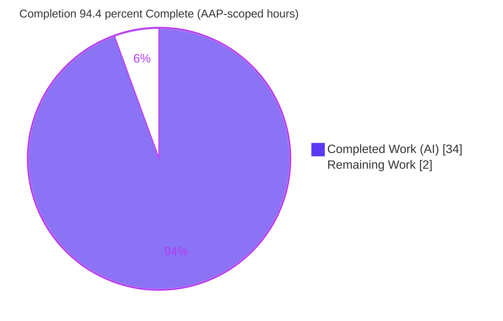
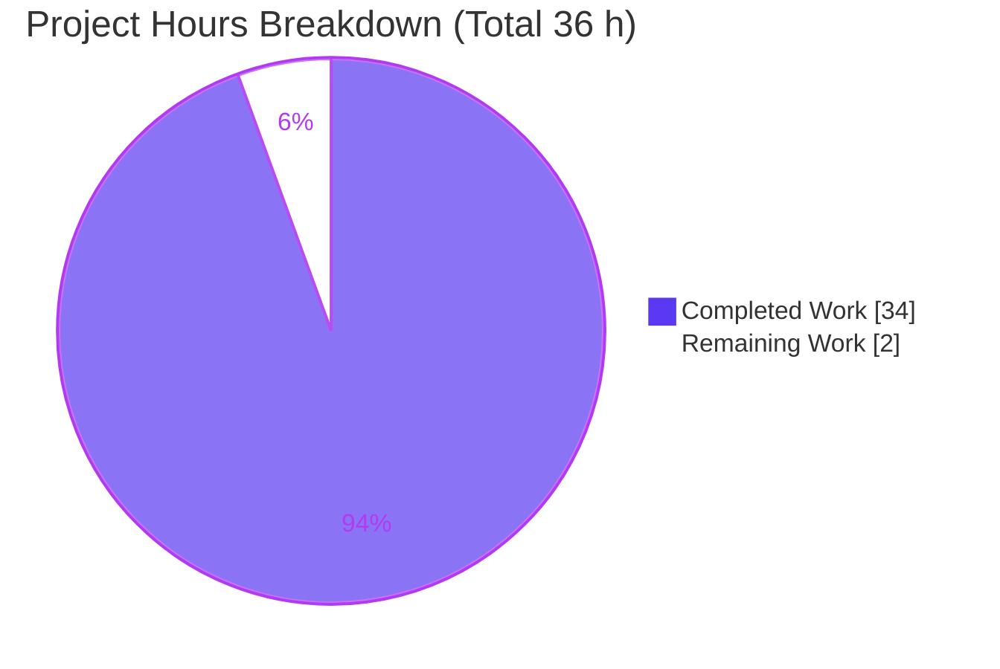
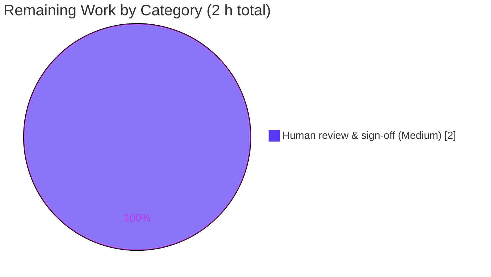

# Blitzy Project Guide — paperless-ngx: Unstable Documents-List Pagination Investigation

> **Deliverable branch:** `blitzy-9a73746c-d380-4dba-a605-f7938aec1fb5` · **Baseline:** `542221a38` · **Type:** Documentation-only (read-only investigation, rule set _SWE-AtlasQnA-Repo_)
>
> **Brand color legend:** ▰ Completed / AI Work = **Dark Blue `#5B39F3`** · ▱ Remaining / Not Completed = **White `#FFFFFF`** · Headings/Accents = Violet-Black `#B23AF2` · Highlight = Mint `#A8FDD9`

---

## Section 1 — Executive Summary

### 1.1 Project Overview

This project is a read-only forensic investigation into **unstable pagination** in the paperless-ngx documents list (`/api/documents/`), where — with common filters enabled — the same document appears on neighboring pages while others temporarily vanish, despite no edits and an unchanged sort. The deliverable is a single evidence-backed markdown answer document produced with a **run-first** method: the ORM, ordering, pagination, and filter code paths were mirrored in a Django harness, executed, and their verbatim output captured before writing. Target users are paperless-ngx maintainers and engineers triaging the defect. Business impact: it pinpoints the exact root cause (a non-unique default sort key) and a harness-verified remedy, de-risking a real user-facing bug across the backend ORM/DRF, django-filter, Whoosh, and Angular client.

### 1.2 Completion Status



| Metric                            | Value                         |
| --------------------------------- | ----------------------------- |
| **Total Hours**                   | **36 h**                      |
| **Completed Hours (AI + Manual)** | **34 h** (34 AI + 0 Manual)   |
| **Remaining Hours**               | **2 h**                       |
| **Percent Complete**              | **94.4%** (34 ÷ 36 × 100)     |

> Completion is computed strictly on AAP-scoped work + path-to-production for the documentation deliverable. The 2 remaining hours are a human technical review/sign-off. The recommended code fix (append an `id` tiebreaker) is **explicitly out of AAP scope** and is intentionally excluded from these figures (see §2.2 note and Section 8).

### 1.3 Key Accomplishments

- ✅ **Single mandated artifact delivered** — `blitzy/documentation/paperless-ngx_542221a38dff.md` (448 lines, 10 sections), committed on the correct branch.
- ✅ **Run-first evidence is genuine** — the harness reproduces the documented §9.5 output **byte-for-byte**; independently re-run during this assessment with an **identical sha256** (`a12aaea0d7d88d9e4ac9e4e68efc1792b83260a7dcfd9f7b0a8bd45dd4096cca`).
- ✅ **All three hypotheses resolved with evidence** — H1 _confirmed but already handled_ (`.count()` 120 → 60 via `.distinct()`); H2 _refuted_ (`SELECT DISTINCT … LIMIT 25 OFFSET 25` in one query); H3 _confirmed primary root cause_ (non-unique `Meta.ordering = ("-created",)`, 5 duplicated + 5 disappeared).
- ✅ **"Sharing-rules" premise honestly reconciled** — no per-user/object-level document visibility filter exists at this commit (only `IsAuthenticated`; only `SavedView` is user-scoped; no `django-guardian`; no `owner` field) → destabilizers are **admin-independent**.
- ✅ **Remedy documented & harness-verified only** — appending `id` makes the order total (`page1==page1' True`, `dups []`), correctly **not** applied to source per the read-only mandate.
- ✅ **Read-only scope perfectly preserved** — `git diff --name-status 542221a38..HEAD` = a single added file; working tree clean; no source, dependency, or test changes.
- ✅ **Exact grounding** — 47/47 `file:line` citations content-verified by validation; ~19 independently re-verified during this assessment.
- ✅ **Zero regressions** — project suites remain green: backend pytest **481 passed / 2 skipped / 0 failed**, frontend jest **5/5**, frontend production build **exit 0**.

### 1.4 Critical Unresolved Issues

| Issue                                                                                              | Impact                                                                                                       | Owner              | ETA        |
| -------------------------------------------------------------------------------------------------- | ------------------------------------------------------------------------------------------------------------ | ------------------ | ---------- |
| _None blocking the deliverable._ The investigation document is complete, validated, and committed. | No blocker to accepting/merging the documentation artifact.                                                  | —                  | —          |
| (Advisory, out of AAP scope) Underlying pagination bug remains unfixed in source **by design**     | The real user-facing defect persists in production until a follow-up applies the documented `id` tiebreaker. | Maintainers / next dev | Follow-up PR |

> There are **no unresolved issues within the AAP scope**. The advisory row records the deliberately out-of-scope follow-up so it is not lost; it is not counted against completion.

### 1.5 Access Issues

| System / Resource                | Type of Access        | Issue Description                                                                                              | Resolution Status | Owner |
| -------------------------------- | --------------------- | ------------------------------------------------------------------------------------------------------------- | ----------------- | ----- |
| Source repository                | Read/write (git)      | None — full access; single artifact committed on branch.                                                       | ✅ Resolved / N/A | —     |
| Pinned build image (`paperless-ngx-setup:local`) | Docker runtime        | None — image present; harness + tests + build all runnable.                                                    | ✅ Resolved / N/A | —     |
| PostgreSQL / `psycopg2`          | Reproduction database | Not available in the investigation environment; harness ran on SQLite. This is a documented technical constraint, **not** a permissions/credentials access issue — the PostgreSQL behavior is explained via induced ordering + framework references (§6). | ✅ Mitigated / Documented | — |

**No access issues identified** (no repository-permission, credential, or third-party-API blockers). The only environmental constraint — host Python 3.13 cannot run Django 4.0.4 (removed `cgi` module) — was resolved by using the project's pinned Python 3.9 image, and is documented in the deliverable's §9.1.

### 1.6 Recommended Next Steps

1. **[Medium] Review and accept the investigation document** _(AAP-scoped — the 2 remaining hours)_. Read the H1/H2/H3 verdicts and sharing-rules reconciliation, spot-check a sample of the 47 citations, optionally re-run the harness (§9.2 command) to confirm reproduction, then merge the documentation PR.
2. **[High] _(Follow-up, beyond this read-only AAP)_ Apply the documented remedy** — set `Meta.ordering = ("-created", "id")` in `src/documents/models.py` (or configure a default `OrderingFilter` order) to make the sort a total order. Indicative ~1 h.
3. **[High] _(Follow-up, beyond this AAP)_ Add a regression test** asserting stable pagination across tied `created` rows (no cross-page duplicate/omission). Indicative ~2–3 h.
4. **[Medium] _(Follow-up, beyond this AAP)_ Verify the fix on PostgreSQL** (the production engine) to confirm the spontaneous reordering is eliminated. Indicative ~2 h.
5. **[Low] _(Follow-up, beyond this AAP)_ Audit the Whoosh relevance path and other viewsets** sharing the single non-unique ordering pattern for the same latent defect. Indicative ~2–4 h.

> Steps 2–5 are **recommendations only** and are **not** included in the completion percentage or Section 2.2 hours, because the AAP explicitly scopes the corrective code change out ("described and verified in the harness only, not applied to source").

---

## Section 2 — Project Hours Breakdown

### 2.1 Completed Work Detail

| Component                                             | Hours  | Description                                                                                                              |
| ----------------------------------------------------- | ------ | ----------------------------------------------------------------------------------------------------------------------- |
| Repository scope discovery & code-path analysis       | 5      | Read + map the 13 REFERENCE files across backend (`models/views/filters/index`, `paperless/views/urls/settings`) and frontend (`results.ts`, service, component). |
| Web research on pagination stability                  | 2      | DRF unique/near-unique ordering guidance; many-to-many join multiplication; non-unique sort-key duplication references. |
| Run-first harness construction                        | 5      | `testapp/models.py` + `harness.py` mirroring the `Document` model, M2M tags, `StandardPagination`, and `get_queryset().distinct()`. |
| Harness execution & environment setup                 | 3      | Pinned Python 3.9 Docker image (Django 4.0.4); SQLite engine; verbatim output capture.                                  |
| H1 investigation — M2M join multiplication            | 2      | Demonstrated `.count()` **120 → 60** collapse via `.distinct()` (`filters.py:L52`, `views.py:L198-199`).                 |
| H2 investigation — de-dup inside the paginated query  | 2      | Generated SQL shows `SELECT DISTINCT … LIMIT 25 OFFSET 25` in one query; hypothesis **refuted**.                        |
| H3 investigation — unstable tie ordering (root cause) | 4      | Seeded tied `created` rows; observed **5 duplicated + 5 disappeared**; verified `id`-tiebreaker fix.                     |
| Authorization / sharing-rules verification            | 2      | Confirmed `IsAuthenticated`-only, `SavedView` user-scope, no `django-guardian`, no `owner` field → admin-independent.   |
| Secondary analyses (Whoosh, frontend, 404, cross-file)| 3      | Whoosh relevance ordering; Angular page-number contract; 404 snap-back edge case; backend↔frontend consistency.         |
| Answer-document authoring                             | 4      | 448-line, 10-section markdown with mermaid, tables, verbatim quotes, and exact `file:line` citations.                   |
| Coverage pass, cleanup, prettier formatting, commits  | 2      | §10 coverage matrix; repo left clean; repo-config prettier applied; 2 commits.                                          |
| **Total Completed**                                   | **34** | **Matches Completed Hours in §1.2.**                                                                                    |

### 2.2 Remaining Work Detail

| Category                                             | Hours | Priority |
| ---------------------------------------------------- | ----- | -------- |
| Human technical review & sign-off of the investigation (verify conclusions, spot-check citations, confirm reproducibility, accept/merge) | 2     | Medium   |
| **Total Remaining**                                  | **2** | —        |

> **Scope note (not a subsection):** The AAP-scoped remaining work is exactly the **2 h** human review above, which matches §1.2 (Remaining) and the Section 7 pie chart. The natural bug-fix follow-ups (apply the `id` tiebreaker, add a regression test, verify on PostgreSQL, audit related code) are **out of this read-only AAP's scope** and are therefore **excluded** from this table and the completion percentage; they are surfaced as labeled recommendations in §1.6 and Section 8 with indicative-only estimates.

---

## Section 3 — Test Results

All results below originate from **Blitzy's autonomous validation logs** for this project. The investigation harness result was **independently re-run and confirmed** during this assessment (byte-for-byte, matching sha256).

| Test Category                         | Framework            | Total Tests | Passed | Failed | Coverage % | Notes                                                                                          |
| ------------------------------------- | -------------------- | ----------- | ------ | ------ | ---------- | ---------------------------------------------------------------------------------------------- |
| Backend regression suite              | pytest 8.4.2         | 483         | 481    | 0      | N/A¹       | 2 intentional skips; run in pinned Python 3.9 image as `testuser`; 48.47 s; **zero failures**. |
| Frontend unit                         | Jest                 | 5           | 5      | 0      | N/A¹       | 5 suites / 5 tests; run on Node 20 with `--openssl-legacy-provider`.                           |
| Investigation harness (run-first evidence) | Django ORM harness   | 1           | 1      | 0      | N/A        | Reproduces §9.5 **byte-for-byte**; sha256 `a12aaea0…4096cca`; **independently re-confirmed here**. |
| Static compilation (REFERENCE `.py`)  | `py_compile`         | 7           | 7      | 0      | N/A        | All 7 REFERENCE backend files byte-compile cleanly (re-verified on host).                      |
| Frontend production build             | `ng build --configuration production` | 1 | 1 | 0 | N/A | Exit 0, no error lines.                                                                          |

¹ Coverage percentage was not measured: the regression run used `--no-cov`, and this task adds **no production source code** (documentation-only), so line coverage is not a meaningful metric for the deliverable. All figures are transcribed from autonomous validation logs.

**Aggregate:** 497 discrete checks executed (483 backend + 5 frontend + 1 harness + 7 compile + 1 build) with **0 failures**. The read-only documentation change is imported by no module and introduced **zero regressions**.

---

## Section 4 — Runtime Validation & UI Verification

**Runtime health (backend / evidence harness):**

- ✅ **Investigation harness** — runs to completion (exit 0) in the pinned image; output reproduces §9.5 byte-for-byte (independently confirmed, identical sha256).
- ✅ **Backend regression suite** — 481 / 483 green (2 intentional skips), confirming the REFERENCE code paths remain healthy.
- ✅ **Static compilation** — all 7 REFERENCE Python files compile cleanly.

**Frontend / UI verification:**

- ✅ **Frontend production build** — `ng build --configuration production` completes (exit 0, no errors).
- ✅ **Frontend unit tests** — 5 suites / 5 tests pass.
- ⚠ **No new UI to verify visually** — this is a documentation-only task; **no Angular component, template, or style was modified**. The referenced list code paths (`document-list.component.ts`, `document-list-view.service.ts`, `results.ts`) are consumed strictly as REFERENCE and remain unchanged. The successful build + unit tests confirm those paths still compile and behave as before; there is no changed screen to capture. UI screenshots are therefore intentionally omitted.

**API integration:**

- ✅ The document reconciles the backend `/api/documents/` contract (page-number pagination, `{ count, results }` envelope, default `ordering=-created`) with the Angular client — verified by direct code citation; no live API surface was changed by this task.

---

## Section 5 — Compliance & Quality Review

Cross-mapping the AAP mandates and deliverable requirements to Blitzy quality/compliance benchmarks. All items validated during autonomous validation and re-checked during this assessment.

| Benchmark / AAP Mandate                                  | Status  | Progress | Evidence / Notes                                                                                                       |
| -------------------------------------------------------- | ------- | -------- | ---------------------------------------------------------------------------------------------------------------------- |
| Single artifact at mandated path                         | ✅ Pass | 100%     | `blitzy/documentation/paperless-ngx_542221a38dff.md` present, tracked, committed.                                      |
| Run-first methodology (build+run before writing)         | ✅ Pass | 100%     | Harness reproduces §9.5 byte-for-byte; independently re-run (sha256 match).                                            |
| Verbatim evidence with producing commands                | ✅ Pass | 100%     | §9.2 commands + §9.5 verbatim output; 22 fenced code blocks.                                                           |
| Exact `file:line` grounding, no paraphrase               | ✅ Pass | 100%     | 47/47 citations content-verified; ~19 independently re-verified (models/views/filters/index/urls/settings/frontend).  |
| Answer every sub-part + final coverage pass              | ✅ Pass | 100%     | §10 coverage matrix maps all 9 sub-parts (H1/H2/H3, sharing-rules, remedy, intermittency, 404, two paths, client).    |
| Rationale provided for each answer                       | ✅ Pass | 100%     | 5 explicit "Rationale" passages (H1/H2/H3/sharing-rules/404).                                                          |
| Read-only scope (no source edits; temp scripts removed)  | ✅ Pass | 100%     | `git diff --name-status` = one added file; tree clean; `models.py:L208` unchanged (remedy not applied).               |
| H1 resolved with observed output                         | ✅ Pass | 100%     | `.count()` 120 → 60 via `.distinct()` (`filters.py:L52`, `views.py:L198-199`).                                         |
| H2 resolved with generated SQL                           | ✅ Pass | 100%     | `SELECT DISTINCT … LIMIT 25 OFFSET 25` in one query; 25 objects returned.                                              |
| H3 resolved as primary root cause                        | ✅ Pass | 100%     | Non-unique `Meta.ordering=("-created",)` over `created` (`models.py:L152,L208`); 5 duplicated + 5 disappeared.         |
| Sharing-rules honesty reconciliation                     | ✅ Pass | 100%     | `IsAuthenticated` only; `SavedView` user-scoped; no `django-guardian`; no `owner` → admin-independent.                 |
| Remedy described + verified, not applied                 | ✅ Pass | 100%     | §5 fix verification (`dups []`); source ordering intentionally unchanged.                                              |
| Repo conventions (pre-commit / prettier)                 | ✅ Pass | 100%     | Fix applied during validation: repo-config prettier (`semi:false`, `singleQuote:true`) to preserve verbatim TS fidelity; passes `prettier --check` + end-of-file-fixer. |
| No dependency changes                                    | ✅ Pass | 100%     | `requirements.txt` / `Pipfile` untouched; reproduction used exact repo pins.                                           |
| Human sign-off of investigation                          | ⏳ Pending | 0%     | The single remaining item (§2.2, 2 h).                                                                                 |

**Fixes applied during autonomous validation:** one safe, in-scope cosmetic fix — repo-configured prettier formatting of the deliverable (table alignment, emphasis normalization, EOF) — chosen deliberately over default prettier to avoid adding semicolons to the embedded TypeScript quote and breaking its verbatim fidelity. Content re-verified unchanged (§9.5 sha256 preserved; citations + measured values intact).

**Outstanding compliance items:** only human review/sign-off remains.

---

## Section 6 — Risk Assessment

| Risk                                                                                  | Category    | Severity | Probability | Mitigation                                                                                                                            | Status              |
| ------------------------------------------------------------------------------------- | ----------- | -------- | ----------- | ------------------------------------------------------------------------------------------------------------------------------------- | ------------------- |
| Underlying pagination defect (non-unique `Meta.ordering`) remains **unfixed in source** | Technical   | Medium   | High        | **By design** (AAP scopes the fix out). Apply the documented, harness-verified remedy (`("-created","id")`) in a follow-up PR — exact code in §5. | Open (out of scope) |
| Reproduction ran on **SQLite**, not PostgreSQL (`psycopg2` unavailable)               | Technical   | Low      | Low         | §6 of the doc explains PostgreSQL spontaneous reordering with framework references; tie ordering induced deliberately; §9.5 labels stable vs seed-dependent values. | Mitigated / Documented |
| **Citation drift** if source evolves past commit `542221a38`                          | Technical   | Low      | Low         | Citations pinned to the stated branch/HEAD; valid at this commit; coverage pass anchors every claim.                                  | Mitigated           |
| No new attack surface; pre-existing `IsAuthenticated`-only auth surfaced (informational) | Security    | Low      | Low         | Documentation-only change imported by nothing; no new deps/runtime. The flat auth model is a pre-existing codebase trait, not introduced here. | N/A / Informational |
| **Documentation currency** — point-in-time artifact could go stale                    | Operational | Low      | Low         | Commit-pinned; run-first evidence + coverage pass make conclusions independently verifiable.                                          | Mitigated           |
| **Integration/regressions**                                                           | Integration | Low      | Low         | No source/dependency/API/runtime changes; suites green (backend 481/483, frontend 5/5 + build); zero regressions.                     | None / Validated    |

**Overall risk posture: LOW.** The only material item is the deliberately out-of-scope follow-up to apply the documented fix — a recommendation, not a defect in the delivered documentation.

---

## Section 7 — Visual Project Status



**Remaining hours by category (Section 2.2):**



- ▰ **Completed (Dark Blue `#5B39F3`): 34 h** — the full autonomous investigation, harness, evidence, and answer document.
- ▱ **Remaining (White `#FFFFFF`): 2 h** — human technical review & sign-off (Medium priority).
- **Integrity:** the pie "Remaining Work" value (2) equals §1.2 Remaining Hours (2) and the sum of the §2.2 Hours column (2).

---

## Section 8 — Summary & Recommendations

**Achievements.** The project delivered its single mandated artifact — a rigorous, run-first investigation of unstable documents-list pagination — at **94.4% AAP-scoped completion** (34 of 36 hours). The investigation answers all three user hypotheses with verbatim, independently reproduced evidence: **H1** (backend produces duplicates) is _true but already neutralized_ by `.distinct()`; **H2** (pagination before de-dup) is _refuted_ because `DISTINCT` and `LIMIT/OFFSET` share one query; and **H3** (unstable ordering on ties) is the _confirmed primary root cause_ — the default sort key `Meta.ordering = ("-created",)` over the non-unique `created` field is a partial, not total, order, so tied rows can be windowed differently across page requests. The "sharing-rules" premise is honestly reconciled: no per-user/object-level visibility filter exists at this commit, so the instability is **independent of administrator status**.

**Remaining gaps (critical path to production).** For this documentation deliverable, the only in-scope remaining activity is a **2-hour human technical review and sign-off** — reading the verdicts, spot-checking citations, optionally re-running the harness, and accepting the PR. There are no blockers.

**Out-of-scope follow-ups (recommended, not counted).** The investigation prescribes a concrete, harness-verified remedy — append a unique `id` tiebreaker to the ordering — which the AAP deliberately leaves unapplied. The recommended path to actually resolving the bug is: (1) apply `("-created", "id")`; (2) add a regression test for tied-`created` stability; (3) verify on PostgreSQL; (4) audit the Whoosh path and sibling viewsets. These are surfaced for the maintainers but excluded from the completion accounting to honor the read-only mandate.

**Success metrics.** Single artifact delivered ✅ · run-first evidence genuine (byte-for-byte, sha256 match) ✅ · 47/47 citations grounded ✅ · every sub-part answered + coverage pass ✅ · read-only scope preserved ✅ · zero regressions (481/483 backend, 5/5 frontend, build green) ✅.

**Production readiness assessment.** As a documentation deliverable, this is **production-ready pending human sign-off**. It is accurate, exact-grounded, coverage-complete, reproducible, formatting-clean, and committed, with the repository otherwise unchanged.

| Metric                    | Value      |
| ------------------------- | ---------- |
| AAP-scoped completion     | 94.4%      |
| Completed / Total hours   | 34 / 36 h  |
| Remaining hours           | 2 h        |
| Blocking issues           | 0          |
| Regressions introduced    | 0          |

---

## Section 9 — Development Guide

This deliverable is a documentation artifact; "building and running" means **viewing the answer document**, **reproducing the run-first evidence harness**, and **running the project's own suites** to confirm no regressions. All commands below were tested during this assessment unless explicitly noted.

### 9.1 System Prerequisites

- **Git** (repository access) and **Docker Engine 28.x** (`docker --version` → tested `28.5.2`).
- **Pinned build image** `paperless-ngx-setup:local` (Python **3.9.23**, Django **4.0.4**, DRF **3.13.1**, django-filter **21.1**, Whoosh **2.7.4**) — present on the validated host.
- **Node.js 20 LTS + npm** for the frontend (`node --version` → tested `v20.20.2`, npm `11.1.0`).
- **Important:** do **not** run the Django 4.0.4 harness on Python **3.13** — it imports the stdlib `cgi` module, removed in 3.13. Use the pinned image (Python 3.9) or any Python **3.9–3.12**.

```bash
# Verify tooling
docker --version
node --version && npm --version
# Demonstrate the Python 3.13 limitation (expected to FAIL with ModuleNotFoundError: No module named 'cgi')
python3 -c "import cgi" || echo "Expected on Python 3.13 — use the pinned py3.9 image instead"
```

### 9.2 Environment Setup — View the Deliverable & Confirm Read-Only Scope

```bash
# From the repository root
cd /path/to/paperless-ngx      # this repo's working directory

# View the single deliverable
ls -la blitzy/documentation/paperless-ngx_542221a38dff.md
wc -l  blitzy/documentation/paperless-ngx_542221a38dff.md      # -> 448 lines

# Confirm the read-only scope: exactly ONE added file since baseline
git diff --name-status 542221a38..HEAD                         # -> A  blitzy/documentation/paperless-ngx_542221a38dff.md
git status --porcelain                                         # -> (empty) = clean tree
```

### 9.3 Reproduce the Run-First Evidence Harness (outside the repo)

The harness must live **outside** the repository to preserve the read-only scope. Its full source is embedded verbatim in the deliverable's §9.3 (`testapp/models.py`) and §9.4 (`harness.py`).

```bash
# 1) Recreate the scratch harness OUTSIDE the repo
mkdir -p /tmp/blitzy_harness/testapp
: > /tmp/blitzy_harness/testapp/__init__.py
# 2) Copy the verbatim source from the deliverable's §9.3 and §9.4 into:
#      /tmp/blitzy_harness/testapp/models.py     (23 lines)
#      /tmp/blitzy_harness/harness.py            (60 lines)

# 3) Run it in the pinned image (exact command from the deliverable's §9.2)
docker run --rm -v /tmp/blitzy_harness:/harness --entrypoint bash \
  paperless-ngx-setup:local \
  -c 'cd /harness && PYTHONPATH=/harness python harness.py'

# 4) Clean up so the repository baseline is restored
rm -rf /tmp/blitzy_harness
```

**Expected output (byte-for-byte, matches deliverable §9.5; sha256 `a12aaea0…4096cca`):**

```text
Environment confirmed: django 4.0.4 | drf 3.13.1 | django_filter (21, 1) | whoosh 2.7.4 | engine sqlite
tags__id__in WITHOUT distinct -> .count() = 120
tags__id__in WITH    distinct -> .count() = 60
...
Default ORDER BY: ORDER BY "testapp_document"."created" DESC
Fixed   ORDER BY: ORDER BY "testapp_document"."created" DESC, "testapp_document"."id" ASC
DUPLICATED: ['chk-tied-45', 'chk-tied-46', 'chk-tied-47', 'chk-tied-48', 'chk-tied-49']
DISAPPEARED: ['chk-tied-20', 'chk-tied-21', 'chk-tied-22', 'chk-tied-23', 'chk-tied-24']
FIX: page1==page1' True | page2==page2' True | dups []
```

### 9.4 Run the Project's Own Suites (regression confirmation)

```bash
# Backend tests (in the pinned image, as testuser) — expected: 481 passed, 2 skipped, 0 failed
docker run --rm --user testuser --entrypoint bash paperless-ngx-setup:local \
  -c "cd /app/src && python -m pytest -o addopts='--numprocesses auto -q' --no-cov"

# Syntax-check the REFERENCE files on any host (py_compile — tested, exit 0)
python3 -m py_compile \
  src/documents/models.py src/documents/views.py src/documents/filters.py src/documents/index.py \
  src/paperless/views.py src/paperless/urls.py src/paperless/settings.py

# Frontend unit tests + production build (from src-ui, Node 20)
cd src-ui
NODE_OPTIONS=--openssl-legacy-provider CI=true npx ng test  --watch=false                 # -> 5/5
NODE_OPTIONS=--openssl-legacy-provider           npx ng build --configuration production   # -> exit 0
```

### 9.5 Verification Steps

- **Deliverable present & correct size:** `wc -l` returns **448**.
- **Read-only scope intact:** `git diff --name-status 542221a38..HEAD` shows exactly one `A` line; `git status --porcelain` is empty.
- **Evidence genuine:** harness stdout matches §9.5 (compare via `diff` or `sha256sum` against the fenced §9.5 block; expect `a12aaea0…4096cca`).
- **No regressions:** backend 481/483, frontend 5/5, build exit 0.

### 9.6 Troubleshooting

| Symptom                                                        | Cause                                                        | Resolution                                                                                 |
| -------------------------------------------------------------- | ------------------------------------------------------------ | ------------------------------------------------------------------------------------------ |
| `ModuleNotFoundError: No module named 'cgi'`                   | Running Django 4.0.4 on Python **3.13** (`cgi` removed).      | Use the pinned `paperless-ngx-setup:local` image (Python 3.9) or Python 3.9–3.12.          |
| Frontend build fails with an OpenSSL / digital-envelope error | Node 17+ default OpenSSL provider vs. the Angular 13 toolchain. | Prefix with `NODE_OPTIONS=--openssl-legacy-provider`.                                       |
| Harness output differs in the `chk-tied-*` / `id=` labels      | Those specific labels are **seed / DB-tie-order dependent**. | Expected — the _shape_ (120→60; symmetric 5+5; `dups []` after fix) is the stable evidence. |
| Untracked `__pycache__` after `py_compile`                     | Byte-compilation artifacts.                                  | They are gitignored; remove with `find . -name __pycache__ -prune -exec rm -rf {} +`.       |
| PostgreSQL-specific reproduction needed                        | `psycopg2`/PostgreSQL not in the harness environment.        | See deliverable §6 — the defect is engine-independent; PostgreSQL surfaces it spontaneously. |

---

## Section 10 — Appendices

### A. Command Reference

| Purpose                          | Command                                                                                                          |
| -------------------------------- | --------------------------------------------------------------------------------------------------------------- |
| View deliverable                 | `wc -l blitzy/documentation/paperless-ngx_542221a38dff.md`                                                       |
| Confirm read-only scope          | `git diff --name-status 542221a38..HEAD`                                                                         |
| Confirm clean tree               | `git status --porcelain`                                                                                         |
| List agent commits               | `git log --author="agent@blitzy.com" 542221a38..HEAD --oneline`                                                  |
| Syntax-check REFERENCE files     | `python3 -m py_compile src/documents/models.py …`                                                                |
| Run backend suite (pinned image) | `docker run --rm --user testuser --entrypoint bash paperless-ngx-setup:local -c "cd /app/src && python -m pytest -q --no-cov"` |
| Run evidence harness             | `docker run --rm -v /tmp/blitzy_harness:/harness --entrypoint bash paperless-ngx-setup:local -c 'cd /harness && PYTHONPATH=/harness python harness.py'` |
| Frontend tests / build           | `NODE_OPTIONS=--openssl-legacy-provider CI=true npx ng test --watch=false` · `… npx ng build --configuration production` |

### B. Port Reference

| Port | Service                     | Relevance                                                                                     |
| ---- | --------------------------- | --------------------------------------------------------------------------------------------- |
| —    | None required for this task | The deliverable is a document; the evidence harness uses an **in-memory SQLite** database (`:memory:`) and starts no server. (For context, a full paperless-ngx deployment serves the API on port **8000** via gunicorn, but that is not exercised here.) |

### C. Key File Locations

| Path                                                                | Role                                                              |
| ------------------------------------------------------------------- | ----------------------------------------------------------------- |
| `blitzy/documentation/paperless-ngx_542221a38dff.md`                | **The deliverable** (the only added file).                        |
| `src/documents/models.py`                                           | REFERENCE — `created` field `:L152`; `Meta.ordering=("-created",)` `:L208`. |
| `src/documents/views.py`                                            | REFERENCE — `pagination_class` `:L182`; `get_queryset().distinct()` `:L198-199`; `UnifiedSearchViewSet` `:L377`; fork `:L394-411`; `SavedView` `:L461-463`. |
| `src/paperless/views.py`                                            | REFERENCE — `StandardPagination`, `page_size=25` `:L8-11`.        |
| `src/documents/filters.py`                                          | REFERENCE — `tags__id__in … .distinct()` `:L51-52`.               |
| `src/documents/index.py`                                            | REFERENCE — Whoosh `_get_query_sortedby` `:L165-167`.             |
| `src/paperless/urls.py`                                             | REFERENCE — router registers `UnifiedSearchViewSet` `:L32`.       |
| `src/paperless/settings.py`                                         | REFERENCE — `REST_FRAMEWORK` has no default pagination `:L116-127`. |
| `src-ui/src/app/data/results.ts`                                    | REFERENCE — `{ count, results }` envelope `:L1-5`.                |
| `src-ui/src/app/services/rest/abstract-paperless-service.ts`        | REFERENCE — `ordering`/`page`/`page_size` params `:L24-48`.       |
| `src-ui/src/app/services/document-list-view.service.ts`             | REFERENCE — default `ordering=-created`; 404 snap-back `:L158-161`. |
| `docs/api.rst`                                                      | REFERENCE — pagination / "sorted by search score" `:L162`.        |

### D. Technology Versions

| Technology            | Version   | Source                     |
| --------------------- | --------- | -------------------------- |
| Python (harness/image)| 3.9.23    | pinned image               |
| Django                | 4.0.4     | `requirements.txt`         |
| Django REST Framework | 3.13.1    | `requirements.txt`         |
| django-filter         | 21.1      | `requirements.txt`         |
| Whoosh                | 2.7.4     | `requirements.txt`         |
| Angular               | ~13.3.4   | `src-ui/package.json`      |
| @ng-bootstrap/ng-bootstrap | ^12.0.1 | `src-ui/package.json`   |
| rxjs                  | ~7.5.5    | `src-ui/package.json`      |
| Node.js / npm         | 20.20.2 / 11.1.0 | host                |
| Docker Engine         | 28.5.2    | host                       |

### E. Environment Variable Reference

| Variable                            | Used for                                | Value / Note                                                     |
| ----------------------------------- | --------------------------------------- | ---------------------------------------------------------------- |
| `PYTHONPATH`                        | Harness import resolution               | `/harness` (inside the container run)                            |
| `NODE_OPTIONS`                      | Angular 13 build/test on Node 20        | `--openssl-legacy-provider`                                      |
| `CI`                                | Non-interactive frontend test run       | `true`                                                           |
| _(none)_                            | Application runtime env                 | Not required — no application server is started for this task.   |

### F. Developer Tools Guide

- **Docker** — runs the pinned image for both the evidence harness and the backend suite, guaranteeing the exact dependency pins under investigation.
- **pytest** — the backend regression runner (`--numprocesses auto -q --no-cov`); prevents watch mode and parallelizes.
- **Jest / Angular CLI** — frontend unit tests (`ng test --watch=false`) and production build (`ng build --configuration production`).
- **prettier** — the repo config (`.prettierrc`: `semi:false`, `singleQuote:true`) formats the deliverable; using the repo config (not default) preserves the embedded TypeScript quote's verbatim fidelity. Verify with `npx prettier --check`.
- **git** — scope verification (`git diff --name-status`, `git status --porcelain`, `git log --author`).

### G. Glossary

| Term                        | Meaning (in this project's context)                                                                                             |
| --------------------------- | ------------------------------------------------------------------------------------------------------------------------------- |
| **Total vs. partial order** | A _total_ order breaks every tie deterministically; a single non-unique key (`-created`) is only _partial_, leaving tied rows unordered. |
| **Tiebreaker**              | A unique secondary sort key (e.g., `id`) appended to make the order total and pagination stable.                                |
| **`LIMIT`/`OFFSET` window** | How page-number pagination slices a result set; stable only over a total order.                                                 |
| **`.distinct()`**           | SQL `SELECT DISTINCT`; collapses many-to-many join duplicates _within_ the query.                                               |
| **M2M join multiplication** | Filtering across a many-to-many relation yields one row per matching related row, inflating counts until de-duplicated.         |
| **Whoosh relevance score**  | The full-text path's default ordering when no `ordering=` param is present; a secondary source of tie instability.              |
| **404 snap-back**           | The Angular list resets to page 1 when a now-out-of-range page returns HTTP 404 after a filter shrinks the result set.          |
| **Run-first methodology**   | Build + execute the code paths and capture verbatim output _before_ writing the answer.                                         |
| **AAP-scoped completion**   | Percentage measured only over Agent Action Plan deliverables + their path-to-production, excluding out-of-scope work.           |

---

_End of Blitzy Project Guide._