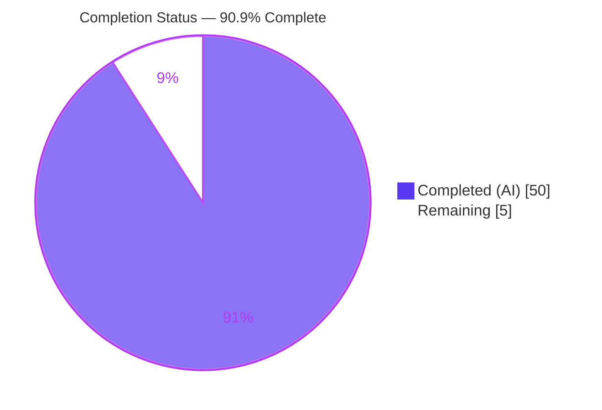
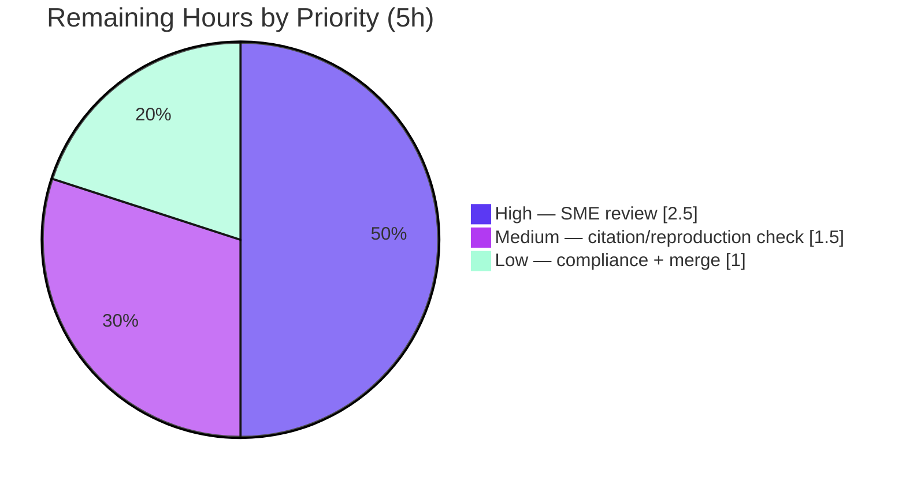

# Blitzy Project Guide — paperless-ngx Runtime Investigation (QnA)

> **Repository:** paperless-ngx @ commit `542221a38dff` · **Branch:** `blitzy-5fa640eb-6577-4b56-a9e5-a622258d47bf` · **HEAD:** `ea34e6f47`
> **Task type:** Read-only investigation & documentation (QnA) · **Sole deliverable:** `blitzy/documentation/paperless-ngx_542221a38dff.md`
>
> **Legend / Blitzy brand colors:** Completed / AI Work = Dark Blue `#5B39F3` · Headings / Accents = Violet-Black `#B23AF2` · Highlight = Mint `#A8FDD9` · Remaining / Not Completed = White `#FFFFFF`

---

## 1. Executive Summary

### 1.1 Project Overview

This project is a **read-only runtime investigation** of the paperless-ngx document-management platform (v1.7.0-era, commit `542221a38dff`), commissioned to explain reported *non-deterministic* failures in the document-classification tests. The autonomous work exercised four subsystems — the scikit-learn document classifier, automatic (`MATCH_AUTO`) correspondent matching, the ocrmypdf text-less OCR path, and barcode-based page splitting — through their real entry points, capturing complete runtime output. The single deliverable is a 4,845-line Markdown answer document that answers four questions with observed values and exact `file:line` citations. No application source was created, modified, or deleted; the target audience is the engineering SME who posed the questions.

### 1.2 Completion Status

Completion is computed with the PA1 AAP-scoped hours methodology: `Completion % = Completed Hours / (Completed Hours + Remaining Hours) × 100 = 50 / 55 = 90.9%`.



| Metric | Hours |
|--------|-------|
| **Total Hours** | **55** |
| Completed Hours (AI) | 50 |
| Completed Hours (Manual) | 0 |
| **Completed Hours (AI + Manual)** | **50** |
| **Remaining Hours** | **5** |
| **Percent Complete** | **90.9%** |

> The 50 completed hours are 100% autonomous (AI) work. The 5 remaining hours are human acceptance/path-to-production (SME review, spot-check, merge) — **not** engineering rework. All 17 AAP requirements are delivered and validated; completion is capped below 100% because human acceptance has not yet occurred.

### 1.3 Key Accomplishments

- ✅ **Sole deliverable created & committed:** `blitzy/documentation/paperless-ngx_542221a38dff.md` (4,845 lines, 88 fenced evidence blocks) — the exact required name and location.
- ✅ **All four questions answered by name, from observed runtime output** — Q1 (classifier reuse vs. retrain), Q2 (a/b/c auto-correspondent matching), Q3 (a/b text-less OCR), Q4 (a/b/c/d barcode splitting), plus a non-determinism root-cause characterization.
- ✅ **Canonical entry points exercised at runtime** in the pinned Python 3.9.23 container — `tasks.train_classifier`, `DocumentClassifier.train`/`predict_correspondent`, `RasterisedDocumentParser.parse` + `ocrmypdf.ocr`, and `scan_file_for_separating_barcodes`/`separate_pages`/`consume_file`.
- ✅ **69 `file:line` citations across 13 source files validated** (0 problems); an independent 8/8 spot-check was exact.
- ✅ **Non-determinism root cause identified & reproduced** — an unseeded `MLPClassifier(tol=0.01)`; the argmax flip was reproduced on a byte-identical corpus under pytest-xdist (128 workers).
- ✅ **Read-only compliance proven** — zero `src/**` changes; the 13 exercised files are byte-identical (md5) to commit `542221a38dff`; working tree clean; single-file diff.
- ✅ **Two-run stability & ×3 suite reproduction** — every magnitude/timing claim confirmed across ≥2 runs; canonical suites reproduced (62 passed, 1 skipped ×3; 35 passed).
- ✅ **One documentation defect found & fixed** during validation — 8 raw ANSI ESC bytes normalized to literal `\x1b` (commit `ea34e6f47`).

### 1.4 Critical Unresolved Issues

| Issue | Impact | Owner | ETA |
|-------|--------|-------|-----|
| _None._ All 17 AAP requirements delivered and validated; the validator reports zero unresolved issues. | No release blocker | — | — |

> There are **no critical unresolved issues**. The only outstanding activity is human SME acceptance of the QnA answer (see Sections 1.6 and 2.2), which is a standard handoff step, not a defect.

### 1.5 Access Issues

| System / Resource | Type of Access | Issue Description | Resolution Status | Owner |
|-------------------|----------------|-------------------|-------------------|-------|
| Canonical Docker image `paperless-ngx-qna:ready` | Container runtime | Reproduction requires the pinned Python 3.9.23 image (local host Python 3.12/3.13 cannot install scipy 1.8.0 / the pinned stack) | Documented & mitigated (image id + `ghcr.io/scaleapi/swe-atlas` digest recorded in §1.1 of the deliverable; reproduction steps in §7.1) | Reviewer |

> No repository-permission, credential, or third-party-API access issues were identified. The single item above is an environment-reproduction note, already mitigated by the deliverable's recorded image ids and reproduction instructions.

### 1.6 Recommended Next Steps

1. **[High]** Have a paperless-ngx / scikit-learn / ocrmypdf SME read the deliverable and verify each answer (Q1–Q4 + non-determinism) is technically correct and complete (~2.5h).
2. **[Medium]** Independently spot-check a sample of the 69 `file:line` citations against commit `542221a38dff`, and optionally rebuild the canonical container to reproduce 1–2 observations (~1.5h).
3. **[Low]** Confirm read-only compliance (`git diff --name-status 542221a38dff..HEAD` → only the deliverable) and accept/merge (~1.0h).
4. **[Low]** (Optional, separate initiative) If the flaky classification tests should be *fixed* (explicitly out of scope here), open a follow-up to seed `MLPClassifier` / stabilize the argmax path per the root cause in §6.

---

## 2. Project Hours Breakdown

### 2.1 Completed Work Detail

Each completed component traces to a specific AAP requirement or path-to-production activity. Total = **50 hours** (100% autonomous).

| Component | Hours | Description |
|-----------|-------|-------------|
| Canonical container environment & source-integrity verification (§1) | 6 | Build/run Python 3.9.23 container with the pinned stack (scikit-learn 1.0.2, numpy 1.22.3, scipy 1.8.0, ocrmypdf 13.4.3, pikepdf 5.1.1, pdf2image 1.16.0, pyzbar 0.1.9, python-magic 0.4.25, django 4.0.4, django-q 1.3.9) + system bins (tesseract 4.1.1, gs 9.53.3, unpaper, libzbar0, poppler); capture every version with its producing command; verify 13 exercised files md5-identical to `542221a38dff`; `manage.py check` clean. |
| Q1 — classifier reuse-vs-retrain investigation & authoring (§2) | 7 | Drive `tasks.train_classifier()` ×3 (initial/unchanged/changed); observe the SHA-1 `data_hash` guard, model mtime stability, `"Training data unchanged."` vs. re-save; `FORMAT_VERSION=7` + incompatible-model deletion; empty-corpus `ValueError`; per-test `MODEL_FILE` isolation; canonical pytest. |
| Q2 — MATCH_AUTO correspondent investigation & authoring (§3) | 6 | Insert documents and train after inserts; corpus count + inbox-tag exclusion; confirm **no** confidence threshold (hard argmax, no `predict_proba`); Django-Q hourly schedule + management-command timing; canonical Q2 tests. |
| Q3 — text-less OCR investigation & authoring (§4) | 7 | Run `RasterisedDocumentParser.parse()` on a text-less image; capture `ocrmypdf.ocr(**args)` + `skip_text`→`NoTextFoundException`→`force_ocr` fallback; Tesseract/Ghostscript/unpaper subprocess evidence; `mime_type='image/png'` via `magic.from_file` through the full Consumer path; encrypted-PDF edge; non-default `OCR_MODE` tests. |
| Q4 — barcode-splitting investigation & authoring (§5) | 7 | Run `scan_file_for_separating_barcodes`/`separate_pages`/`consume_file` over the sample PDFs; N→N+1 fragment arithmetic; trigger `"PATCHT"` across CODE39/QR/CODE128 + edges; decision site `tasks.py:108`; corpus effect (0 rows on split, +N+1 on consume); page-0 `max_workers` edge; canonical tests. |
| Non-determinism characterization (§6) | 6 | Run the two named suites 10× under `--numprocesses auto` (128 workers); identify the unseeded `MLPClassifier(tol=0.01)` root cause; reproduce the argmax flip on a byte-identical corpus; honest disclosure of assertion-level non-reproduction. |
| Complete-evidence appendix assembly (§7) | 5 | Curate the complete observation-script sources, full two-run stability captures, the ten-run probe, repo/container cleanliness proof, and the question→entry-point→citation map + reproduction instructions. |
| Citation validation & QA refinement (6 commits) | 5 | Validate 69 citation ranges against source; iterate QA — citation-precision fixes, Q3 `OCR_MODE` disclosure + inline pytest capture, Report-5 findings, ANSI ESC normalization. |
| Read-only compliance & git hygiene | 1 | Zero `src/**` modification; temp-script cleanup; clean working tree; single-file diff; UTF-8 / 0-control-char well-formedness. |
| **Total** | **50** | |

### 2.2 Remaining Work Detail

Each remaining category is human path-to-production acceptance of the QnA deliverable — **no engineering rework**. Total = **5 hours**.

| Category | Hours | Priority |
|----------|-------|----------|
| SME technical review of Q1–Q4 answers + non-determinism for accuracy & completeness | 2.5 | High |
| Independent citation spot-check + optional container reproduction (via §7.1) | 1.5 | Medium |
| Read-only compliance confirmation + acceptance/merge of the deliverable | 1.0 | Low |
| **Total** | **5.0** | |

### 2.3 Hours Reconciliation

| Check | Result |
|-------|--------|
| Section 2.1 completed total | 50h |
| Section 2.2 remaining total | 5h |
| Section 2.1 + Section 2.2 | 55h = Total (Section 1.2) ✅ |
| Remaining hours (1.2 ↔ 2.2 ↔ 7) | 5h in all three ✅ |
| Completion % (1.2 ↔ 7 ↔ 8) | 90.9% everywhere ✅ |

---

## 3. Test Results

All tests below originate from **Blitzy's autonomous validation logs** for this project (Final Validator Gate 1 + deliverable §2.3/§3.3/§5.6/§7.4). This is a read-only QnA investigation; the canonical test suites are the paperless-ngx suites that the deliverable cites and reproduces, executed in the canonical Python 3.9.23 container as `testuser`.

| Test Category | Framework | Total Tests | Passed | Failed | Skipped | Coverage % | Notes |
|---------------|-----------|-------------|--------|--------|---------|------------|-------|
| Classifier + Tasks (Q1/Q2/Q4 canonical) | pytest 8.4.2 + pytest-django 4.11.1 | 63 | 62 | 0 | 1 | N/A¹ | `test_classifier.py` + `test_tasks.py`; reproduced **×3 identical**. The 1 skip is the in-memory classifier-cache test, skipped at this commit. |
| OCR Parser (Q3 canonical) | pytest 8.4.2 + pytest-django 4.11.1 | 35 | 35 | 0 | 0 | N/A¹ | `paperless_tesseract/tests/test_parser.py`; text-less OCR + parser wiring. |
| Non-determinism probe | pytest-xdist 3.8.0 (128 workers) | 10 runs | 10 | 0 | — | N/A¹ | Two named suites run 10× from a byte-identical state; all pass. Prediction-level argmax flip reproduced separately (§6.5). |
| **Total** | | **98 tests + 10 probe runs** | **97** | **0** | **1** | | Zero failures. |

> ¹ **Coverage %** is N/A: this is a QnA investigation, not a coverage-driven effort. No coverage target was in the AAP scope; the tests are executed to *reproduce documented observations*, not to raise coverage. Every documented observation reproduced with **zero discrepancies** (modulo disclosed ephemera: `mkdtemp` suffixes, `st_mtime`, pikepdf non-deterministic PDF digests).

---

## 4. Runtime Validation & UI Verification

Legend: ✅ Operational · ⚠ Partial · ❌ Failing

**Runtime health — canonical code paths (all exercised through real entry points):**

- ✅ **Q1 path** — `tasks.train_classifier()` → `DocumentClassifier.train()`/`save()`: SHA-1 reuse guard + mtime stability observed; reproduced ×2/×3.
- ✅ **Q2 path** — `DocumentClassifier.train()`/`predict_correspondent()` + `matching.match_correspondents()`: hard-argmax acceptance, no confidence threshold, confirmed at runtime.
- ✅ **Q3 path** — `RasterisedDocumentParser.parse()` → `ocrmypdf.ocr()` spawning **Tesseract 4.1.1** + **Ghostscript 9.53.3** + **unpaper 6.1**; `skip_text`→`NoTextFoundException`→`force_ocr` fallback observed; MIME persisted as `image/png` via the full Consumer path.
- ✅ **Q4 path** — `scan_file_for_separating_barcodes()`/`separate_pages()`/`consume_file()`: N→N+1 fragments, `"PATCHT"` trigger, decision site, and corpus effect observed; page-0 `max_workers` edge reproduced.
- ✅ **Django system check** — `manage.py check` → "System check identified no issues (0 silenced)", exit 0.
- ✅ **Non-determinism probe** — pytest-xdist 128 workers, 10 runs completed; distribution reported.

**API integration:**

- ➖ **N/A** — no REST API or external service was exercised; the investigation drives Python entry points directly (canonical), by design and per AAP scope.

**UI verification:**

- ➖ **N/A** — paperless-ngx's Angular UI (`src-ui`) is **explicitly out of AAP scope**. This is a backend runtime investigation; no UI was built, changed, or verified. No screenshots apply.

**Partial / disclosed item:**

- ⚠ **Assertion-level non-determinism reproduction** — the argmax flip is reproduced at the **prediction** level on a byte-identical corpus, but the two named suites still **pass 10/10** at the assertion level. This honest non-reproduction is disclosed in the deliverable (§6.6); only the prediction→assertion link is labeled `[inferred]`.

---

## 5. Compliance & Quality Review

AAP deliverables cross-mapped to Blitzy's quality/compliance benchmarks. Progress: ✅ Pass · ⚠ Partial · ➖ N/A.

| Benchmark (AAP requirement) | Status | Progress | Notes |
|------------------------------|--------|----------|-------|
| Deliverable naming & location | ✅ Pass | 100% | `blitzy/documentation/paperless-ngx_542221a38dff.md` exactly. |
| All 4 questions + every sub-part answered by name | ✅ Pass | 100% | Q1; Q2 a/b/c; Q3 a/b; Q4 a/b/c/d; non-determinism. |
| Run-first mandate (observed, not read-only) | ✅ Pass | 100% | §7.2 observation scripts; all paths exercised at runtime. |
| Canonical entry points only | ✅ Pass | 100% | Real `train_classifier`/`parse`/`consume_file`; non-canonical values labeled `[non-canonical]`. |
| Magnitude/timing verified ≥2 runs | ✅ Pass | 100% | §7.3 two-run captures; suites reproduced ×3. |
| Reproduce actual inconsistency (no cherry-pick) | ✅ Pass | 100% | §6.5 argmax flip; §7.4 ten-run probe with distribution. |
| Complete/unedited output + commands | ✅ Pass | 100% | 88 fenced code blocks, each with command + full output. |
| `file:line` citations + exactness | ✅ Pass | 100% | 69 ranges validated (0 problems); 8/8 independent spot-check exact. |
| Environment/methodology documented | ✅ Pass | 100% | §1.1–1.5 provenance, versions-with-commands, integrity, harness. |
| Read-only source (no `src/**` modification) | ✅ Pass | 100% | Zero `src/` diff; 13 files md5 byte-identical host↔container. |
| Temp scripts removed + git clean | ✅ Pass | 100% | §7.5 cleanliness; clean tree; single-file diff; zero leaked scripts. |
| Canonical container (Python 3.9) | ✅ Pass | 100% | `paperless-ngx-qna:ready`, Python 3.9.23; 11 pins exact. |
| Well-formedness & encoding | ✅ Pass | 100% | UTF-8, 0 control chars (ANSI ESC defect fixed in `ea34e6f47`). |
| SME acceptance of answers | ⚠ Pending | 0% | Human review/merge outstanding (Section 2.2) — not a defect. |

**Fixes applied during autonomous validation:**

- `fce84f647` — corrected 3 minor `file:line` citation-precision issues.
- `d69ba06cb` — addressed Q3-DOC-1/Q3-DOC-2: non-default `OCR_MODE` disclosure + inline pytest capture (§4.5).
- `12f0f3e9a` — addressed Report-5 QA findings.
- `ea34e6f47` — normalized 8 residual raw ANSI ESC (`0x1b`) bytes to the document's visible `\x1b` convention in the §7.3.8 Q4 matrix blocks (lossless; git diff = exactly 8 lines; only the deliverable touched).

**Outstanding compliance items:** none, other than human SME acceptance.

---

## 6. Risk Assessment

Overall posture: **LOW**. This is a read-only documentation deliverable with no production-software attack or deployment surface.

| Risk | Category | Severity | Probability | Mitigation | Status |
|------|----------|----------|-------------|------------|--------|
| T1 — Citation drift if reviewed against a different commit | Technical | Low | Low | Deliverable §1.4 pins commit `542221a38dff` + byte-identity; validate against that commit | Mitigated |
| T2 — One `[inferred]` claim (prediction→assertion link in non-determinism) | Technical | Low | Low | Clearly labeled; argmax flip reproduced; 10/10 suite-pass disclosed | Disclosed / Accepted |
| T3 — Reproduction requires the canonical container (local Python can't install pinned stack) | Technical | Low | Medium | §7.1 reproduction steps + exact image id/digest + pins recorded | Mitigated |
| S1 — Security attack surface | Security | None | — | No code added to source, no dependency changes; container run as non-root `testuser` (uid 1000) | N/A |
| O1 — paperless-ngx test non-determinism remains unfixed | Operational | Low (informational) | Low | Explicitly out of scope by design — task explains, does not remedy (§6.6) | Accepted |
| O2 — Deliverable staleness over time (line refs vs. future code) | Operational | Low | Medium | Commit pin + §7.6 citation map | Mitigated |
| I1 — Integration/deploy surface | Integration | None | — | Standalone Markdown doc; no build/deploy/services/keys/CI-CD | N/A |

**Resolved (no longer open):** 8 raw ANSI ESC bytes in the deliverable — found and fixed by the validator (`ea34e6f47`).

---

## 7. Visual Project Status

**Project hours breakdown** (Completed = Dark Blue `#5B39F3`, Remaining = White `#FFFFFF`; "Remaining Work" = 5h matches Section 1.2 and the Section 2.2 total):


**Remaining work by priority** (sums to the 5h remaining):



**Remaining hours per category (Section 2.2):**

| Category | Hours | Bar |
|----------|-------|-----|
| SME technical review (High) | 2.5 | ██████████████████████████ |
| Citation spot-check + reproduction (Medium) | 1.5 | ████████████████ |
| Compliance confirm + merge (Low) | 1.0 | ██████████ |
| **Total** | **5.0** | |

---

## 8. Summary & Recommendations

**Achievements.** The autonomous work delivered a complete, evidence-backed answer to all four questions plus a non-determinism root-cause analysis, packaged in the single required file `blitzy/documentation/paperless-ngx_542221a38dff.md`. Every behavioral claim is grounded in runtime output captured through canonical entry points and cited to exact `file:line` locations (69 ranges validated, 0 problems). The read-only constraint was honored perfectly: zero `src/**` changes, byte-identical sources, and a clean single-file diff.

**Remaining gaps.** None in the autonomous scope. The **5 remaining hours (9.1%)** are human path-to-production acceptance: SME technical review, an independent citation/reproduction spot-check, and merge. These are inherent handoff steps for a QnA deliverable, not defects or rework.

**Critical path to production.** (1) SME reviews the answers → (2) spot-check citations/reproduce 1–2 observations → (3) confirm read-only compliance and merge. No infrastructure, deployment, or code changes are required.

**Success metrics.**

| Metric | Target | Actual |
|--------|--------|--------|
| Questions answered (with sub-parts) | 4 (Q1; Q2 a/b/c; Q3 a/b; Q4 a/b/c/d) + non-determinism | ✅ All |
| Citations validated | 100% in-range | ✅ 69/69, 0 problems |
| Canonical suites reproduced | Pass | ✅ 62 pass/1 skip ×3; 35 pass |
| Read-only compliance | 0 `src/**` changes | ✅ 0 changes; byte-identical |
| Two-run stability | ≥2 runs | ✅ ×2 / ×3 |

**Production readiness.** The project is **90.9% complete** and **production-ready as a QnA deliverable**, pending only human SME acceptance. Recommendation: **approve after the ~5h review/merge path** in Section 1.6.

---

## 9. Development Guide

This guide covers how to **view**, **verify**, and **reproduce** the investigation. Two command classes: **[HOST-TESTED]** commands were run and verified in the assessment environment; **[CONTAINER]** commands are documented verbatim from the deliverable (§1.1/§7.1) and require the canonical image.

### 9.1 System Prerequisites

- **To view & verify (host):** `git` ≥ 2.x, a text pager/editor, ~400 KB free disk. (Assessment host used: Python 3.13.7, git 2.51.0.)
- **To reproduce observations (container):** Docker; the canonical image `paperless-ngx-qna:ready` (`sha256:e565fd72…`) derived from `ghcr.io/scaleapi/swe-atlas:swe_atlas_QnA_paperless-ngx_…_qna_1.01`; Python **3.9.23** inside.
- ⚠ The local host Python (3.12/3.13) **cannot** install the pinned stack (scipy 1.8.0 requires Python < 3.11). Runtime reproduction is **container-only**.

### 9.2 Environment Setup (canonical container)

```bash
# [CONTAINER] Start the persistent canonical container (from deliverable §1.1)
docker run -d --name pngx-qna --entrypoint sleep paperless-ngx-qna:ready infinity

# [CONTAINER] Sanity: interpreter, commit, and Django system check
docker exec -u testuser pngx-qna python3 --version                    # Python 3.9.23
docker exec -u testuser pngx-qna git -C /app rev-parse HEAD           # 542221a38dff...
docker exec -u testuser -w /app/src pngx-qna bash -c 'python3 manage.py check; echo exit=$?'
# -> System check identified no issues (0 silenced).  exit=0
```

### 9.3 Dependency Versions (verified; deliverable §1.2)

`scikit-learn 1.0.2 · numpy 1.22.3 · scipy 1.8.0 · joblib 1.1.0 · threadpoolctl 3.1.0 · django 4.0.4 · django-q 1.3.9 · ocrmypdf 13.4.3 · pikepdf 5.1.1 · pdf2image 1.16.0 · pyzbar 0.1.9 · python-magic 0.4.25 · fuzzywuzzy 0.18.0 · pytest 8.4.2 · pytest-xdist 3.8.0 · pytest-django 4.11.1 · factory-boy 3.3.3`. System bins: `tesseract 4.1.1 · gs 9.53.3 · pdftoppm 20.09.0 · unpaper 6.1 · qpdf 10.1.0`.

### 9.4 View the Deliverable & Verify Read-Only Compliance (host — tested)

```bash
# Run from the repository root
cd /tmp/blitzy/paperless-ngx/blitzy-5fa640eb-6577-4b56-a9e5-a622258d47bf_735501

# [HOST-TESTED] Read the answer document
sed -n '1,60p' blitzy/documentation/paperless-ngx_542221a38dff.md

# [HOST-TESTED] Prove read-only compliance: ONLY the deliverable was added
git diff --name-status 542221a38dff..HEAD
# -> A   blitzy/documentation/paperless-ngx_542221a38dff.md   (exit 0)

# [HOST-TESTED] Confirm a cited source file is byte-identical to the base commit
git diff --stat 542221a38dff..HEAD -- src/documents/classifier.py
# -> (empty output = identical)

# [HOST-TESTED] Spot-check a citation (Q1 SHA-1 reuse guard)
sed -n '163,164p' src/documents/classifier.py
# -> if self.data_hash and new_data_hash == self.data_hash:
# ->     return False
```

### 9.5 Reproduce an Observation (container — from deliverable §7.1)

```bash
# [CONTAINER] Save a script from the deliverable §7.2 locally (e.g. obs_q1_hires.py), then:
docker cp obs_q1_hires.py pngx-qna:/tmp/obs_q1_hires.py
docker exec -u testuser -w /app/src \
  -e PYTHONPATH=/app/src -e DJANGO_SETTINGS_MODULE=paperless.settings \
  pngx-qna python3 /tmp/obs_q1_hires.py 1      # trailing int = run index (1, 2, ...)

# Substitute obs_q2.py / obs_q3.py / obs_q4.py / obs_q4_matrix.py / obs_q4_page0.py / obs_q6_nd.py
```

### 9.6 Run the Canonical Test Suites (container)

```bash
# [CONTAINER] Q1/Q2/Q4 canonical suites -> 62 passed, 1 skipped
docker exec -u testuser -w /app/src pngx-qna \
  python3 -m pytest documents/tests/test_classifier.py documents/tests/test_tasks.py -p no:cacheprovider -o addopts=""

# [CONTAINER] Q3 canonical OCR suite -> 35 passed
docker exec -u testuser -w /app/src pngx-qna \
  python3 -m pytest paperless_tesseract/tests/test_parser.py -p no:cacheprovider -o addopts=""
```

### 9.7 Verification / Expected Outputs

- Read-only check → a single `A` line for the deliverable; exit 0.
- Citation spot-check → source lines match the deliverable's quoted code exactly.
- Container check → "System check identified no issues (0 silenced)", exit 0.
- Observation scripts → self-cleaning (per-probe `mkdtemp` mode `0700`, `try/finally` inventory); leave the repository unchanged.

### 9.8 Troubleshooting

- **`externally-managed-environment` / import errors on host** → expected; the pinned stack is Python < 3.11 only. Use the canonical container.
- **`pyzbar` ImportError** → system `libzbar0` missing; use the canonical image (it is baked in).
- **Citations don't line up** → ensure the checkout is exactly commit `542221a38dff`; line numbers are commit-specific.
- **Non-determinism probe shows suites passing 10/10** → expected and disclosed (§6.6). The argmax flip is reproduced at the *prediction* level on a byte-identical corpus, not at the assertion level.
- **Different `mkdtemp` suffixes / `st_mtime` / pikepdf PDF digests between runs** → expected, by-design ephemera; disclosed in the deliverable.

---

## 10. Appendices

### Appendix A — Command Reference

| Purpose | Command |
|---------|---------|
| Prove read-only compliance | `git diff --name-status 542221a38dff..HEAD` |
| Quantify the diff | `git diff --numstat 542221a38dff..HEAD` |
| List branch commits | `git log --pretty=format:"%h %an %s" 542221a38dff..HEAD` |
| View the deliverable | `sed -n '1,60p' blitzy/documentation/paperless-ngx_542221a38dff.md` |
| Verify a citation | `sed -n '163,164p' src/documents/classifier.py` |
| Confirm a file untouched | `git diff --stat 542221a38dff..HEAD -- <path>` |
| Start container | `docker run -d --name pngx-qna --entrypoint sleep paperless-ngx-qna:ready infinity` |
| Django check | `docker exec -u testuser -w /app/src pngx-qna bash -c 'python3 manage.py check'` |
| Reproduce observation | `docker exec -u testuser -w /app/src -e PYTHONPATH=/app/src -e DJANGO_SETTINGS_MODULE=paperless.settings pngx-qna python3 /tmp/<script>.py <run-index>` |

### Appendix B — Port Reference

➖ **N/A.** No servers or network ports are involved. The investigation runs Python entry points and pytest inside a sleeping, unprivileged container with the default bridge network and no bind mounts. paperless-ngx's usual runtime ports (e.g., web UI) are not exercised.

### Appendix C — Key File Locations

| Path | Role |
|------|------|
| `blitzy/documentation/paperless-ngx_542221a38dff.md` | **The sole deliverable** (answer document) |
| `src/documents/classifier.py` | Q1/Q2 — classifier load/train/save, SHA-1 guard, `predict_correspondent` |
| `src/documents/tasks.py` | Q1 `train_classifier`; Q4 barcode scan/separate/consume |
| `src/documents/matching.py` | Q2 — `match_correspondents` accept rule |
| `src/documents/consumer.py` | Q3 — MIME detection (`magic.from_file`) + persistence |
| `src/paperless_tesseract/parsers.py` | Q3 — `parse()`, `ocrmypdf.ocr`, no-text fallback |
| `src/paperless/settings.py` | Defaults — `MODEL_FILE`, `CONSUMER_BARCODE_STRING`, `OCR_MODE` |
| `src/documents/tests/{test_classifier.py,test_tasks.py,utils.py}` | Canonical tests + `DirectoriesMixin` isolation |
| `src/paperless_tesseract/tests/test_parser.py` | Q3 canonical OCR tests |
| `src/setup.cfg` | pytest config (`--numprocesses auto`) |

### Appendix D — Technology Versions

Python **3.9.23** (canonical). Key pins: `scikit-learn 1.0.2`, `numpy 1.22.3`, `scipy 1.8.0`, `django 4.0.4`, `django-q 1.3.9`, `ocrmypdf 13.4.3`, `pikepdf 5.1.1`, `pdf2image 1.16.0`, `pyzbar 0.1.9`, `python-magic 0.4.25`, `pytest 8.4.2`, `pytest-xdist 3.8.0`, `pytest-django 4.11.1`, `factory-boy 3.3.3`. System: `tesseract 4.1.1`, `Ghostscript 9.53.3`, `poppler/pdftoppm 20.09.0`, `unpaper 6.1`, `qpdf 10.1.0`. Classifier on-disk `FORMAT_VERSION = 7`.

### Appendix E — Environment Variable Reference

| Variable | Value used | Purpose |
|----------|------------|---------|
| `DJANGO_SETTINGS_MODULE` | `paperless.settings` | Django settings module for scripts/pytest |
| `PYTHONPATH` | `/app/src` | Resolve project imports inside the container |
| `PAPERLESS_OCR_MODE` | default `skip` (settings.py:522) | Governs `skip_text=True`; the no-text path (Q3) |
| `PAPERLESS_CONSUMER_BARCODE_STRING` | default `PATCHT` (settings.py:506) | Barcode split trigger value (Q4) |
| `PAPERLESS_CONSUMER_ENABLE_BARCODES` | default `False` (settings.py:502) | Gates the whole barcode path (Q4) |
| `PAPERLESS_DISABLE_DBHANDLER` | `true` (setup.cfg) | Test-time DB log-handler disable |

> These settings were toggled only *transiently at runtime* (via `@override_settings`/env in temporary scripts) to exercise code paths; no configuration file was edited.

### Appendix F — Developer Tools Guide

- **git** — read-only compliance and citation verification (Appendix A).
- **Docker** — run the canonical Python 3.9.23 image for faithful reproduction.
- **pytest / pytest-xdist / pytest-django** — reproduce the canonical suites and the non-determinism probe (128 workers via `--numprocesses auto`).
- **Deliverable §7.2 observation scripts** — the exact, self-cleaning probes that produced every observation; §7.6 maps each question → entry point → citation.

### Appendix G — Glossary

| Term | Meaning |
|------|---------|
| **QnA deliverable** | The read-only investigation answer document; the sole artifact of this task. |
| **Canonical entry point** | The real code path (`train_classifier`, `parse`, `consume_file`, …) — as opposed to a mock/fallback/synthetic stand-in. |
| **`FORMAT_VERSION`** | The classifier's on-disk model schema version (`7`); an incompatible version triggers model-file deletion on load. |
| **`data_hash`** | SHA-1 digest over ordered preprocessed content + label ids; equality short-circuits `train()` (reuse vs. retrain). |
| **`MATCH_AUTO`** | Correspondent matching driven entirely by the ML classifier's argmax prediction — no confidence threshold. |
| **`PATCHT`** | Default `CONSUMER_BARCODE_STRING`; a decoded barcode equal to this value triggers a page split. |
| **N→N+1** | N separator pages yield N+1 document fragments in `separate_pages`. |
| **pytest-xdist** | Parallel test runner; `--numprocesses auto` → 128 workers here; the structural context for the reported non-determinism. |
| **`[inferred]` / `[observed]` / `[code-grounded]` / `[non-canonical]` / `[fallback]`** | The deliverable's honest evidence labels distinguishing runtime observation from code reading and inference. |