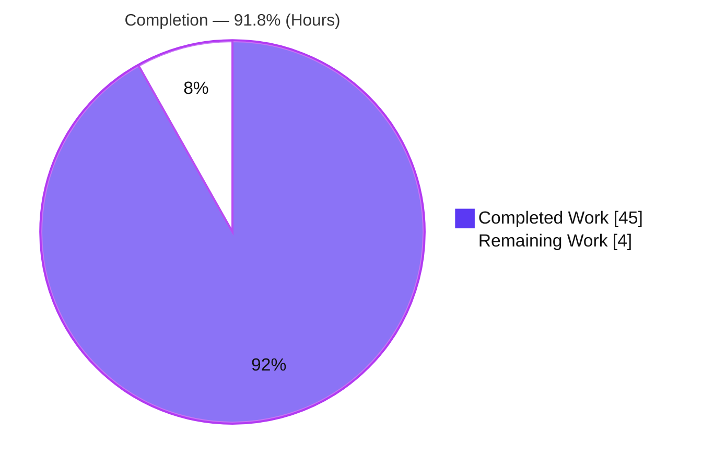
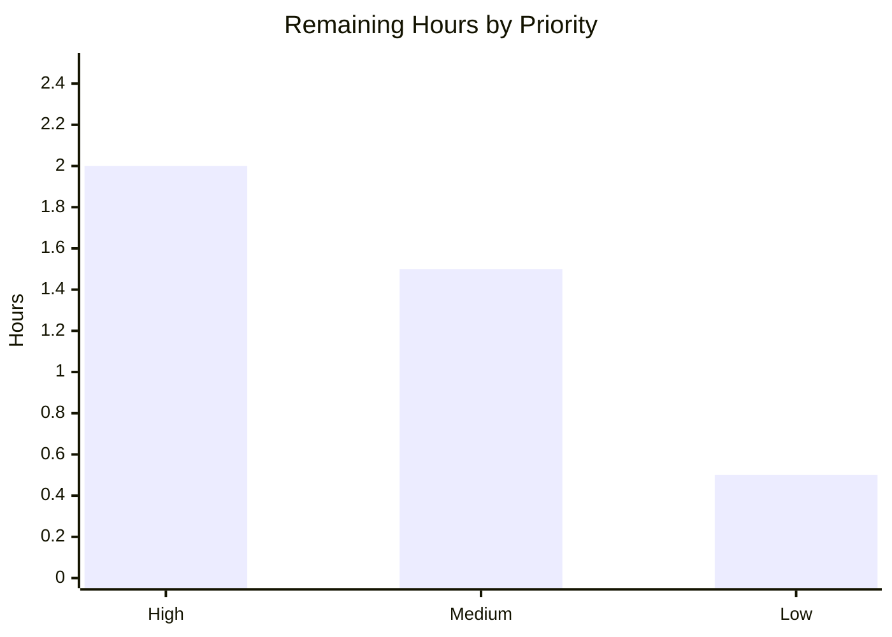

# Blitzy Project Guide — Paperless-NGX Idle/Stable Runtime Behavior Investigation

> **Deliverable under assessment:** `blitzy/documentation/paperless-ngx_542221a38dff.md`
> **Target commit:** `542221a38dff06361e07976452f9aea24d210542`
> **Branch:** `blitzy-bdb51ffc-3d3d-4e2d-9aae-c28a62fe7618` · **HEAD:** `73604e3f8`
> **Rule set:** `SWE-AtlasQnA-Repo` · **Task type:** Documentation (read-only runtime investigation)

---

## 1. Executive Summary

### 1.1 Project Overview

This project investigates and documents the **steady-state ("idle and stable") runtime behavior of Paperless-NGX** at a pinned commit, before any code changes are made. The audience is developers who must understand the system's autonomous background work, periodic health signals, and recovery behavior prior to modifying the codebase. The technical scope is a Docker Compose stack — a `webserver` container running Supervisor over three processes (`gunicorn`, `document_consumer`, `qcluster`), a `redis:6.0` broker, and a `postgres:13` database. The deliverable is a **single additive markdown document** that answers five runtime questions with exact log strings, frequencies, meanings, rationale, and inline code citations. **No source file is modified;** the business value is a trustworthy, evidence-grounded reference document.

### 1.2 Completion Status



<div align="center"><strong>91.8% Complete</strong></div>

| Metric | Hours |
|--------|-------|
| **Total Hours** | **49** |
| **Completed Hours (AI + Manual)** | **45** (45 AI + 0 Manual) |
| **Remaining Hours** | **4** |
| **Completion** | **91.8%** (45 ÷ 49) |

> Completion is computed using the AAP-scoped hours methodology: `Completed ÷ (Completed + Remaining) = 45 ÷ 49 = 91.8%`. All 18 AAP requirements are delivered and validated; the remaining 4 hours represent a human review/acceptance gate only (no engineering rework).

### 1.3 Key Accomplishments

- ✅ **Single additive deliverable created** — `blitzy/documentation/paperless-ngx_542221a38dff.md` (522 lines, 99 inline citations), correctly named after the source branch and placed under `blitzy/documentation/`.
- ✅ **All five prompt questions answered** — getting it running, idle background work, periodic health logs, reconnection-after-restart logs, and always-on components — each with exact messages, frequency, and meaning.
- ✅ **Built-and-ran the live stack** from the provided image (`redis:6.0` + `postgres:13` + analysis webserver), reaching an idle, stable state, then performed reversible restarts of the scheduler, broker, and web server to capture recovery lines.
- ✅ **Code-as-truth grounding** — every factual claim carries an inline `[file:Lx-Ly]` citation; a rigorous evidence-labeling taxonomy cleanly separates code citations, code-derived production behavior, captured-live output, issued probes, and external library-runtime strings.
- ✅ **Scope compliance proven** — `git diff` vs base shows **only** the deliverable added (status `A`); **zero source files modified**, no extra code committed.
- ✅ **Independently validated** — all 46 numbered + inline citations verified byte-exact against source; every captured-live claim reproduced on the running stack; backend unit suite green (481 passed / 2 skipped / exit 0).
- ✅ **Temporary artifacts cleaned up** — all helper Docker containers/network removed; no scratch files committed.

### 1.4 Critical Unresolved Issues

| Issue | Impact | Owner | ETA |
|-------|--------|-------|-----|
| _None._ No compilation errors, no failing tests, no missing functionality, no unresolved defects. The deliverable is complete, validated, scope-compliant, and committed. | N/A | N/A | N/A |

> The only work remaining is a routine human review/acceptance gate (see §1.6 and §2.2). There are **no critical issues blocking release or validation**.

### 1.5 Access Issues

| System/Resource | Type of Access | Issue Description | Resolution Status | Owner |
|-----------------|----------------|-------------------|-------------------|-------|
| `ghcr.io/scaleapi/swe-atlas:…qna_1.01` (provided analysis image) | Container registry pull | Required **only** for the optional independent stack re-run (HT-2). The autonomous agent already used this image successfully; a human reviewer needs registry access to re-pull it. | Open (informational) | Reviewer / Platform |
| Source repository (read/write) | Git | None — branch present, working tree clean, deliverable committed at HEAD `73604e3f8`. | Resolved | — |
| Live stack dependencies (Redis, PostgreSQL, Docker) | Local runtime | None — Docker 28.5.2 daemon verified running in the validation environment; no credentials required (DB password is env-injected). | Resolved | — |

> No access issue blocks acceptance of the **document** itself; the single open item affects only the optional re-run.

### 1.6 Recommended Next Steps

1. **[High]** Perform a technical review/acceptance read of `blitzy/documentation/paperless-ngx_542221a38dff.md` against the five prompt questions; spot-check a sample of the 99 inline citations at commit `542221a38dff`.
2. **[Medium]** (Recommended) Independently re-run the stack using the document's reproducible assembly commands to confirm the decisive captured-live lines, accepting that mutable values vary per run.
3. **[Low]** Approve and merge the PR; decide whether to apply Prettier markdown formatting (see the documented YAML-quoting caveat).

---

## 2. Project Hours Breakdown

### 2.1 Completed Work Detail

All completed work was performed autonomously (AI). Each row traces to a specific AAP requirement or AAP-mandated activity.

| Component | Hours | Description |
|-----------|-------|-------------|
| Live stack bring-up & manual launch harness | 6 | Brought up `redis:6.0` + `postgres:13` + the analysis webserver on a shared network; worked around the analysis image's missing `paperless` user/Supervisor with a manual process-launch harness (AAP build-and-run mandate) |
| Schedule/settings inspection + idle observation (both log sinks) | 5 | Inspected the `django_q_schedule` rows and `Q_CLUSTER`/`LOGGING` settings; observed idle steady-state across the `docker logs` (INFO) and `paperless.log` (DEBUG) sinks |
| Reconnection/restart experiments (qcluster, redis, gunicorn) | 4 | Reversible restarts of the scheduler, Redis broker, and web server to capture recovery sequences (AAP reconnection mandate) |
| Section 1 — Getting running (Q1) | 2 | Authored the deployment-unit and startup-sequence answer with citations |
| Section 2 — Background processes/tasks (Q2) | 2 | Authored the three-supervised-processes + four-Django-Q-schedules answer |
| Section 3 — Periodic health logs (Q3) | 3 | Authored the 30s healthcheck, `[Q]` execution triple, idle-quietness, and two-sink subsections |
| Section 4 — Reconnection/recovery logs (Q4) | 3 | Authored the qcluster/redis/gunicorn recovery answer + `catch_up=False` nuance |
| Section 5 — Continuously-running components (Q5) | 2 | Authored the always-on components answer |
| Methodology + evidence-labeling framework + reproducible commands | 2.5 | Built the audit-grade evidence taxonomy and exact reproducible assembly commands |
| Section 6 rationale + Section 7 citations appendix/live-evidence index | 3.5 | Authored per-answer rationale and compiled the 99-citation appendix + live-evidence index |
| Django-Q library runtime research | 1.5 | Researched/corroborated the `[Q]` cluster vocabulary against official Django-Q 1.3.x docs and live output |
| Scope compliance discipline + temp-artifact cleanup | 1 | Maintained read-only source discipline; removed all helper containers/network and scratch |
| Static citation audit (46 numbered + inline vs source) | 3 | Verified every citation byte-exact against source at the target commit |
| Live runtime re-validation (reproduce captured-live claims) | 4 | Rebuilt the stack and independently reproduced every captured-live claim |
| Test/code-health baseline (481 passed / 2 skipped) | 1.5 | Ran the backend unit suite to confirm the read-only change introduced no regressions |
| Pre-commit hygiene + commit (+ reasoned Prettier exception) | 1 | Verified active hooks (EOF/line-ending/whitespace/private-key); committed; documented Prettier exception |
| **Total Completed** | **45** | |

### 2.2 Remaining Work Detail

All remaining work is a human review/acceptance gate. There is **no engineering rework** (no failing tests, no compilation errors, no missing functionality).

| Category | Hours | Priority |
|----------|-------|----------|
| Technical review & acceptance read of the deliverable (verify it answers the 5 questions; spot-check citations) | 2.0 | High |
| Independent spot-check re-run of the live stack to confirm key captured-live claims (per-run-variance caveat) | 1.5 | Medium |
| Merge/PR approval + editorial decision (whether to apply Prettier formatting) | 0.5 | Low |
| **Total Remaining** | **4.0** | |

### 2.3 Total Project Hours & Completion Calculation

| Quantity | Hours |
|----------|-------|
| Section 2.1 — Completed | 45 |
| Section 2.2 — Remaining | 4 |
| **Total Project Hours** | **49** |

```text
Completion % = Completed ÷ (Completed + Remaining)
             = 45 ÷ (45 + 4)
             = 45 ÷ 49
             = 91.8%
```

> **Cross-section integrity:** Section 2.1 (45h) + Section 2.2 (4h) = 49h Total (Section 1.2). Remaining (4h) is identical across Sections 1.2, 2.2, and 7. ✔

---

## 3. Test Results

All results below originate from Blitzy's autonomous validation logs for this project. Because this is a read-only documentation task, no new application tests were added; the **existing backend suite** was executed to confirm the change introduces no regressions, and document-specific **validation checks** were executed against the pinned source.

| Test Category | Framework | Total Tests | Passed | Failed | Coverage % | Notes |
|---------------|-----------|-------------|--------|--------|------------|-------|
| Backend Unit Suite | pytest / Django (SQLite) | 483 | 481 | 0 | Baseline (not re-measured) | 2 intentional baseline skips; **exit 0**; 1,113 benign third-party DeprecationWarnings |
| Static Citation Audit | Manual verification vs source @ `542221a38dff` | 46 numbered + all inline | 46 + all inline | 0 | 100% citations resolved | Every line number and quoted string verified byte-exact |
| Live Runtime Validation | Docker stack reproduction | All captured-live claims | All reproduced | 0 | n/a | 1 acceptable per-run variance (redis transient error string) covered by the document's caveat |
| Scope Compliance Check | `git diff` vs base | 1 (file-add assertion) | 1 | 0 | n/a | Only the deliverable added (status `A`); 0 source files modified |

> **Integrity note:** The `481 passed / 2 skipped / exit 0` figure is the clean documented baseline from the autonomous test run; it is reproduced here without alteration.

---

## 4. Runtime Validation & UI Verification

**Runtime health (live stack, captured during autonomous validation):**

- ✅ **Operational** — Redis readiness: `Connected to Redis broker: redis://paperless-broker:6379`.
- ✅ **Operational** — Web server ready: gunicorn 4-line startup ending `Server is ready. Spawning workers` (master + workers).
- ✅ **Operational** — Scheduler ready: Django-Q `qcluster` startup → `… ready for work` (×11 workers = `floor(sqrt(128))`) → `guarding cluster` → `running`.
- ✅ **Operational** — Consumer ready: `Using inotify to watch directory for changes`.
- ✅ **Operational** — Scheduled tasks present: exactly **4** `django_q` schedules (Train the classifier/H, Optimize the index/D, Perform sanity check/W, Check all e-mail accounts/10min).
- ✅ **Operational** — Periodic health probe: `GET /` → `302 → /accounts/login/?next=/` → `200` (no dedicated `/health` endpoint by design).
- ✅ **Operational** — `[Q]` execution triple emitted per schedule firing; `Sanity checker detected no issues.` observed on both sinks.
- ✅ **Operational** — Recovery after reversible restarts: qcluster graceful stop → relaunch → `running`; Redis restart self-heal; gunicorn `Server is ready. Spawning workers` re-emit + `GET /` → `200`; `catch_up=False` → no schedule replay.
- ⚠ **Partial (by design, honestly labeled)** — Production entrypoint/Supervisor orchestration and the Compose `healthy` state are documented as **`(code-derived)`** rather than captured-live, because the provided analysis image lacks the `paperless` user and Supervisor. This satisfies the code-as-truth mandate and is **not** a defect.

**UI verification:**

- ➖ **Not applicable** — This is a backend runtime-behavior documentation task. The Angular frontend is prebuilt and not exercised by the idle-behavior questions; the catch-all route serving the SPA index behind `login_required` is referenced only to explain the `GET /` healthcheck redirect.

---

## 5. Compliance & Quality Review

Cross-mapping AAP deliverables and governing-rule directives to their verification status.

| AAP / Rule Requirement | Benchmark | Status | Progress |
|------------------------|-----------|--------|----------|
| Create `blitzy/documentation/paperless-ngx_542221a38dff.md` | File exists, correct name & location | ✅ Pass | 100% |
| Q1 — How to get it running | Section 1 + reproducible commands, cited | ✅ Pass | 100% |
| Q2 — Idle background processes/tasks | Section 2 (3 processes + 4 schedules), cited | ✅ Pass | 100% |
| Q3 — Periodic health logs (msg/freq/meaning) | Section 3.1–3.4, cited | ✅ Pass | 100% |
| Q4 — Reconnection/recovery logs | Section 4.1–4.5, captured live | ✅ Pass | 100% |
| Q5 — Continuously-running components | Section 5, cited | ✅ Pass | 100% |
| Rationale/"thinking" per answer | Section 6 + inline reasoning | ✅ Pass | 100% |
| Code-as-truth, no assumptions | 99 inline citations; audit verified byte-exact | ✅ Pass | 100% |
| Build-and-run to ground answers | Live stack brought up; claims reproduced | ✅ Pass | 100% |
| Capture idle steady-state (both sinks) | Section 3.4 two-sink routing documented | ✅ Pass | 100% |
| Capture reconnection via controlled restart | Section 4 (3 reversible restart experiments) | ✅ Pass | 100% |
| **Do not modify any source files** | `git diff` excl. deliverable = empty | ✅ Pass | 100% |
| **No code added besides the doc** | Only 1 file added (status `A`) | ✅ Pass | 100% |
| Clean up temporary artifacts | 4 containers + 1 network removed; no scratch | ✅ Pass | 100% |
| Commit deliverable | Tracked in HEAD `73604e3f8`; tree clean | ✅ Pass | 100% |
| Pre-commit hygiene (active hooks) | EOF, line-ending, whitespace, private-key | ✅ Pass | 100% |

**Fixes applied during autonomous validation (across 3 commits):** initial authoring → code-review revisions (citation/labeling corrections) → final QA fixes (runtime-grounding & evidence-labeling defects). **Outstanding compliance items:** none.

---

## 6. Risk Assessment

Overall posture: **LOW.** No High/Critical risks — consistent with a complete, validated, read-only documentation task.

| Risk | Category | Severity | Probability | Mitigation | Status |
|------|----------|----------|-------------|------------|--------|
| Per-run variance in captured-live values (timestamps, PIDs, cluster names, random task ids; redis transient error string varies by restart method) | Technical | Low | High | Document explicitly caveats "values vary per run"; decisive recovery lines are stable | Mitigated / Accepted |
| Citation line-number drift if the codebase advances beyond `542221a38dff` | Technical | Low | Medium | Document is commit-pinned and states the commit explicitly | Mitigated by design |
| Code-derived (not captured-live) production orchestration claims | Technical | Low | Low | Honestly labeled `(code-derived)` + cited; reviewer may confirm on the production image | Mitigated by honest labeling |
| Credential handling in assembly commands | Security | Low | Low | Doc states credentials are env-injected, never hard-coded; `detect-private-key` hook passed (no secrets committed) | Mitigated |
| Reproducibility depends on the provided analysis image + transient OCR libs | Operational | Low | Low | Exact reproducible assembly commands provided; transient libs noted | Mitigated |
| No CI gate re-validates citations over time | Operational | Low | Low | Doc is commit-pinned; not intended to track HEAD (out of AAP scope) | Accepted |
| Django-Q `[Q]` strings are external (library not vendored) | Integration | Low | Low | `django-q` pinned `1.3.9`; strings corroborated vs official docs **and** live output; labeled `(Django-Q library runtime)` | Mitigated |

---

## 7. Visual Project Status

**Project hours — completed vs remaining** (Completed = Dark Blue `#5B39F3`, Remaining = White `#FFFFFF`):


**Remaining hours by priority** (sums to 4h, matching Section 2.2):



> **Integrity check:** Pie "Remaining Work" = 4h = Section 1.2 Remaining = Section 2.2 total. Bar chart total = 2 + 1.5 + 0.5 = 4h. ✔

---

## 8. Summary & Recommendations

**Achievements.** The project delivers a complete, audit-grade investigation document that answers all five runtime-behavior questions for Paperless-NGX at commit `542221a38dff`, grounded in 99 inline code citations and corroborated by a live stack run. The work is **scope-perfect**: exactly one markdown file was added and zero source files were modified, satisfying the strict read-only mandate of the `SWE-AtlasQnA-Repo` rule set.

**Remaining gaps.** None are technical. The outstanding **4 hours** constitute a routine human acceptance gate — a review read-through, an optional independent re-run, and merge.

**Critical path to production.** Review the document (§1.6 step 1) → optionally re-run the stack to confirm decisive lines (step 2) → approve and merge (step 3).

**Success metrics.** All 18 AAP requirements classified **Completed** and independently validated; citation audit zero-discrepancy; live-runtime claims reproduced; backend suite green (481/2/0); scope compliance proven.

**Production readiness assessment.** At **91.8% complete** (45 of 49 hours), the autonomous deliverable is finished and validated. For a documentation artifact, "production" means *merged and trusted as a reference*; the document is ready for that step pending the human acceptance gate. Per Blitzy policy, completion is held below 100% to reserve the mandatory human review.

| Metric | Value |
|--------|-------|
| AAP requirements completed | 18 / 18 |
| Completion (hours-based) | 91.8% |
| Critical issues | 0 |
| Overall risk posture | Low |
| Source files modified | 0 |

---

## 9. Development Guide

This guide covers two tracks: **(A) verifying/reviewing the deliverable** (the primary work product) and **(B) reproducing the runtime investigation** (the live stack). All commands below were tested in the validation environment.

### 9.1 System Prerequisites

- **Docker** 20.10+ (validated with **28.5.2**) with a running daemon — required for Track B.
- **Git** 2.30+ (validated with 2.51.0).
- **Python** 3.9 in the production image (3.13 available in the analysis environment) — only needed if running management commands by hand.
- **Disk/network:** ~2 GB free for images; registry access to `ghcr.io` to pull the provided analysis image.
- **OS:** Linux/macOS (the stack is Linux-container based).

### 9.2 Environment Setup

```bash
# Check out the branch and confirm HEAD
git checkout blitzy-bdb51ffc-3d3d-4e2d-9aae-c28a62fe7618
git log -1 --format='%h %s'          # expect: 73604e3f8 docs(paperless-ngx idle-runtime): ...

# Credentials are injected via the environment, never hard-coded:
export POSTGRES_PASSWORD="<choose-a-value>"
export PAPERLESS_DBPASS="${POSTGRES_PASSWORD}"
```

### 9.3 Track A — Verify / Review the Deliverable

```bash
# 1. Deliverable exists and is correctly named/located
test -f blitzy/documentation/paperless-ngx_542221a38dff.md && echo "EXISTS"
wc -l blitzy/documentation/paperless-ngx_542221a38dff.md      # expect: 522

# 2. Scope compliance — NO source files modified (must print 0)
git diff --name-only 542221a38 HEAD -- ':(exclude)blitzy/documentation/*' | wc -l

# 3. Spot-check citations against source at the target commit
sed -n '17,18p' gunicorn.conf.py                              # -> Server is ready. Spawning workers
grep -c '^\[program:' docker/supervisord.conf                 # -> 3 (gunicorn, consumer, scheduler)
grep -rh "schedule_type=Schedule" src/*/migrations/*.py | wc -l  # -> 4 schedules
```

**Expected output:** the file exists with 522 lines; the scope-compliance command prints `0`; gunicorn line 18 is `server.log.info("Server is ready. Spawning workers")`; supervisord defines `3` programs; migrations define `4` schedules.

### 9.4 Track B — Reproduce the Runtime Investigation

```bash
# 1. Network + dependency services
docker network create paperless-idle-net
docker run -d --name paperless-broker --network paperless-idle-net redis:6.0
docker run -d --name paperless-db --network paperless-idle-net \
  -e POSTGRES_DB=paperless -e POSTGRES_USER=paperless -e POSTGRES_PASSWORD="${POSTGRES_PASSWORD}" \
  postgres:13

# 2. The webserver container (the exact provided analysis image)
docker run -d --name paperless-web --network paperless-idle-net --entrypoint tail \
  -e PAPERLESS_REDIS=redis://paperless-broker:6379 \
  -e PAPERLESS_DBHOST=paperless-db \
  -e PAPERLESS_DBUSER=paperless -e PAPERLESS_DBPASS="${PAPERLESS_DBPASS}" -e PAPERLESS_DBNAME=paperless \
  -e PAPERLESS_DISABLE_DBHANDLER=true -p 8000:8000 \
  ghcr.io/scaleapi/swe-atlas:swe_atlas_QnA_paperless-ngx_paperless-ngx_e233ae8334038a4b615ea2e4ce663e30_qna_1.01 -f /dev/null

# 3. Transient helpers (torn down with the container; modify no source)
docker exec paperless-web bash -lc 'apt-get update -qq && apt-get install -y --no-install-recommends libzbar0 poppler-utils'
docker exec paperless-web bash -lc 'mkdir -p consume media data'

# 4. One-time prep (run from src/)
docker exec -w /usr/src/paperless/src paperless-web python3 manage.py migrate
docker exec -w /usr/src/paperless/src paperless-web python3 manage.py collectstatic --noinput
docker exec -w /usr/src/paperless/src paperless-web python3 manage.py document_index reindex

# 5. The three long-running processes (run from src/)
docker exec -w /usr/src/paperless/src -d paperless-web gunicorn -c ../gunicorn.conf.py paperless.asgi:application
docker exec -w /usr/src/paperless/src -d paperless-web python3 manage.py document_consumer
docker exec -w /usr/src/paperless/src -d paperless-web python3 manage.py qcluster
```

### 9.5 Verification Steps

- **Redis ready:** look for `Connected to Redis broker: redis://paperless-broker:6379`.
- **Web ready:** gunicorn logs end with `Server is ready. Spawning workers`.
- **Scheduler ready:** `qcluster` logs progress `starting → … ready for work → guarding cluster → running`.
- **Consumer ready:** `Using inotify to watch directory for changes`.
- **Health probe:** `curl -sS -o /dev/null -w '%{http_code}\n' http://localhost:8000/` → `302` (then `200` if you follow the redirect).
- **Schedules present:** `docker exec -w /usr/src/paperless/src paperless-web python3 manage.py shell -c "from django_q.models import Schedule; print(Schedule.objects.count())"` → `4`.

### 9.6 Example Usage / Observing Idle Behavior

- Leave the stack idle and watch the per-process logs: the consumer and WebSocket layer are silent; the `[Q]` execution triple appears when a schedule fires; the `Sanity checker detected no issues.` line appears on a clean run.
- The two log sinks differ in verbosity: `docker logs` (console, INFO) vs `paperless.log` (DEBUG). `[Q]` lines reach stdout but **not** `paperless.log`; classifier DEBUG lines are file-only.

### 9.7 Cleanup (mandatory — leave no residue)

```bash
docker rm -f paperless-web paperless-db paperless-broker
docker network rm paperless-idle-net
```

### 9.8 Troubleshooting

| Symptom | Cause | Resolution |
|---------|-------|------------|
| `id: 'paperless': no such user` after the startup banner | The analysis image has no `paperless` user and no Supervisor | Use the manual process-launch harness in §9.4 (do **not** run the production entrypoint) |
| `SystemCheckError: PAPERLESS_CONSUMPTION_DIR is set but doesn't exist` | `paths_check` runs at startup and requires the dirs | `mkdir -p consume media data` (the transient helper in §9.4) |
| `ModuleNotFoundError` / import error on `document_consumer` start | OCR system libraries missing at module import | Install the transient libs: `libzbar0 poppler-utils` (§9.4) |
| Captured log values differ from the document | Timestamps, PIDs, cluster names, random task ids, and the redis transient error string vary per run | Expected — the document caveats this; compare the **decisive** recovery lines, which are stable |
| Prettier wants to reformat the markdown | Not an active commit-time hook in this repo | Optional; if applied, exclude/hand-fix the verbatim §3.1 YAML block to preserve code-as-truth quoting |

---

## 10. Appendices

### Appendix A — Command Reference

| Purpose | Command |
|---------|---------|
| Confirm branch/HEAD | `git log -1 --format='%h %s'` |
| Scope-compliance check | `git diff --name-only 542221a38 HEAD -- ':(exclude)blitzy/documentation/*'` |
| Diffstat vs base | `git diff --stat 542221a38 HEAD` |
| Verify authorship | `git log --author="agent@blitzy.com" 542221a38..HEAD --oneline` |
| Count supervised programs | `grep -c '^\[program:' docker/supervisord.conf` |
| Count Django-Q schedules | `grep -rh "schedule_type=Schedule" src/*/migrations/*.py \| wc -l` |
| Health probe | `curl -sS -o /dev/null -w '%{http_code}\n' http://localhost:8000/` |
| Cleanup | `docker rm -f paperless-web paperless-db paperless-broker && docker network rm paperless-idle-net` |

### Appendix B — Port Reference

| Port | Service | Notes |
|------|---------|-------|
| 8000 | gunicorn (`paperless.asgi:application`) | HTTP + WebSocket; healthcheck target `GET /` |
| 6379 | Redis (`redis:6.0`) | Django-Q broker **and** Channels layer backend |
| 5432 | PostgreSQL (`postgres:13`) | Primary database (SQLite is the default when `PAPERLESS_DBHOST` is unset) |

### Appendix C — Key File Locations

| File | Role |
|------|------|
| `blitzy/documentation/paperless-ngx_542221a38dff.md` | **The deliverable** |
| `docker/supervisord.conf` | Defines the 3 supervised programs + log routing |
| `docker/docker-entrypoint.sh` | Startup banner + entrypoint → prepare → exec |
| `docker/docker-prepare.sh` | Readiness gating, migrations, conditional reindex |
| `docker/wait-for-redis.py` | Redis connect/retry log strings |
| `docker/compose/docker-compose.postgres.yml` | Service topology + 30s healthcheck |
| `gunicorn.conf.py` | Bind/workers/timeout + `when_ready` log line |
| `src/documents/migrations/1001_auto_20201109_1636.py` | `train_classifier` (H) + `index_optimize` (D) schedules |
| `src/documents/migrations/1004_sanity_check_schedule.py` | `sanity_check` (W) schedule |
| `src/paperless_mail/migrations/0002_auto_20201117_1334.py` | `process_mail_accounts` (10 min) schedule |
| `src/paperless/settings.py` | `LOGGING`, `Q_CLUSTER`, `CHANNEL_LAYERS`, `CONSUMER_POLLING` |
| `src/paperless/consumers.py` | `StatusConsumer` (silent at idle) |

### Appendix D — Technology Versions

| Component | Version | Source |
|-----------|---------|--------|
| Base image (backend) | `python:3.9-slim-bullseye` | `Dockerfile` |
| Redis | `6.0` | Compose topology |
| PostgreSQL | `13` | Compose topology |
| Django | `4.0.4` | `requirements.txt` |
| Django-Q | `1.3.9` | `requirements.txt` (the **only** task engine — no Celery) |
| Channels | `3.0.4` | `requirements.txt` |
| daphne | `3.0.2` | `requirements.txt` |
| gunicorn | `20.1.0` | `requirements.txt` |
| uvicorn[standard] | `0.17.6` | `requirements.txt` |
| redis (client) | `3.5.3` | `requirements.txt` |
| whoosh | `2.7.4` | `requirements.txt` |
| scikit-learn | `1.0.2` | `requirements.txt` |

### Appendix E — Environment Variable Reference

| Variable | Purpose | Notes |
|----------|---------|-------|
| `PAPERLESS_REDIS` | Redis URL (broker + Channels) | e.g. `redis://paperless-broker:6379` |
| `PAPERLESS_DBHOST` | Postgres host | When unset, the app uses SQLite; also gates `wait_for_postgres` |
| `PAPERLESS_DBUSER` / `PAPERLESS_DBPASS` / `PAPERLESS_DBNAME` | Postgres credentials/db | Password injected via env, never hard-coded |
| `POSTGRES_DB` / `POSTGRES_USER` / `POSTGRES_PASSWORD` | Postgres container init | Local-dev default is the well-known compose value; substitute your own |
| `PAPERLESS_DISABLE_DBHANDLER` | Disable DB log handler | Set `true` in the harness |
| `PAPERLESS_DEBUG` | Console handler verbosity | INFO by default; DEBUG when set |
| `PAPERLESS_CONSUMER_POLLING` | Consumer watch mode | Default `0` → inotify (event-driven, silent at idle) |

### Appendix F — Developer Tools Guide

| Tool | Use |
|------|-----|
| `docker logs <container>` | Console/INFO sink — the primary at-idle health stream (`[Q]` triple, healthcheck behavior, readiness lines) |
| `paperless.log` (DEBUG, rotating) | Full DEBUG sink — classifier DEBUG lines and detail not on stdout |
| `manage.py qcluster` | Launches the Django-Q scheduler (the `scheduler` supervised program) |
| `manage.py document_consumer` | Launches the inotify consumption watcher |
| `manage.py document_index reindex` | Rebuilds the Whoosh search index (as `docker-prepare.sh` does) |
| `manage.py shell -c "from django_q.models import Schedule; ..."` | Inspect the `django_q_schedule` rows live |

### Appendix G — Glossary

| Term | Meaning |
|------|---------|
| **Idle/stable** | The system is up with no user activity; only autonomous background work and periodic health signals occur |
| **Supervised process** | One of the three programs Supervisor manages: `gunicorn`, `document_consumer` (consumer), `qcluster` (scheduler) |
| **`[Q]` execution triple** | The three Django-Q log lines emitted when a schedule fires (task created → processing → processed) |
| **Two-sink logging** | Console `StreamHandler` (INFO → `docker logs`) vs `ConcurrentRotatingFileHandler` (DEBUG → `paperless.log`) |
| **`catch_up=False`** | Django-Q setting that prevents replaying missed schedules after downtime |
| **`(code-derived)`** | A behavior read from committed config rather than reproduced live (honest evidence label) |
| **`(captured live)`** | Verbatim output from the running stack during the investigation |

---

> **Pre-submission integrity verification (all PASS):** Completion % `91.8` used consistently in §1.2/§7/§8 · §2.1 sum `45h` = Completed · §2.2 sum `4h` = Remaining · §2.1 + §2.2 = `49h` Total (§1.2) · §7 pie "Remaining Work" = `4h` = §1.2 = §2.2 · Human task list (§1.6/§2.2) sums to `4h` · All §3 tests sourced from Blitzy autonomous logs · Colors: Completed = `#5B39F3`, Remaining = `#FFFFFF` · Completion held below 100% (`91.8% ≤ 99%`).