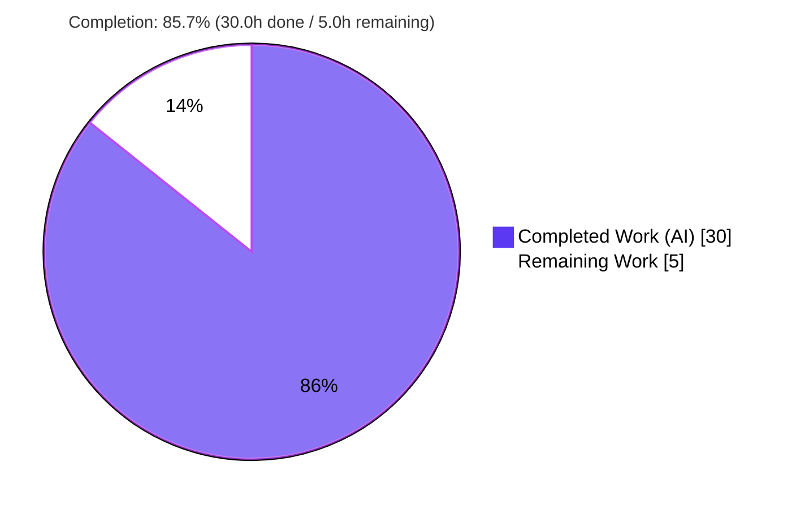
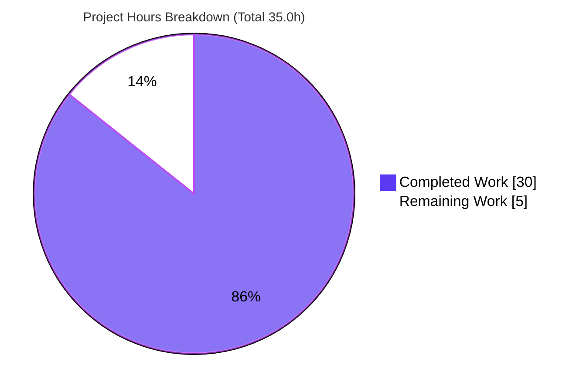
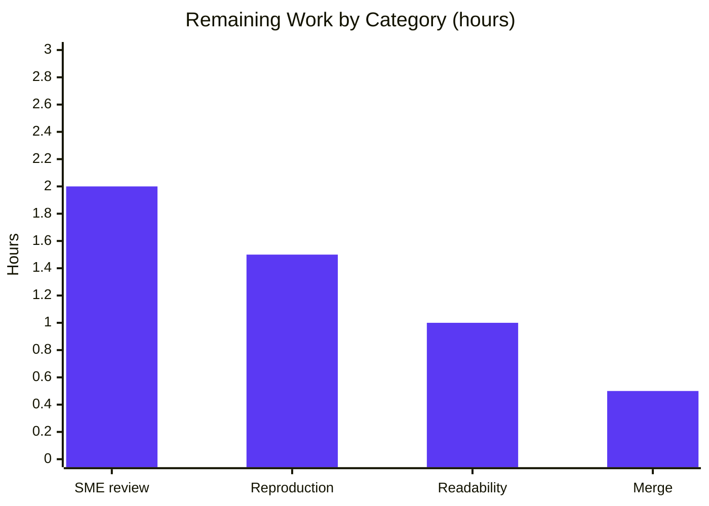

# Blitzy Project Guide — Paperless-ngx Document Ingestion → Indexing Investigation

> **Repository:** `paperless-ngx` &nbsp;•&nbsp; **Branch:** `blitzy-6df071ce-510b-45bb-9ddb-e868f223b0e8` &nbsp;•&nbsp; **Base commit:** `542221a38dff06361e07976452f9aea24d210542` &nbsp;•&nbsp; **App version:** `v1.7.0` &nbsp;•&nbsp; **Head:** `33912386d`
>
> **Brand colors:** Completed/AI = Dark Blue `#5B39F3` &nbsp;•&nbsp; Remaining = White `#FFFFFF` &nbsp;•&nbsp; Headings/Accents = Violet-Black `#B23AF2` &nbsp;•&nbsp; Highlight = Mint `#A8FDD9`

---

## 1. Executive Summary

### 1.1 Project Overview

This project delivers a single, **code-grounded investigation document** explaining how Paperless-ngx (v1.7.0, commit `542221a38dff`) ingests a document end-to-end — from file detection in the consumption directory, through Django-Q task creation and Redis queuing, parsing, classification, and Whoosh full-text indexing, to PostgreSQL persistence. The audience is a developer onboarding to the codebase. The deliverable answers seven user questions (R1–R7) with **live runtime evidence** (logs, the Redis broker payload, database rows) and **~87 `file:line` citations**, plus rationale. Business impact: it accelerates safe onboarding and corrects the common misconception of the queuing model (Django-Q, **not** Celery; one task per file, **not** per stage). Scope is strictly additive — one new markdown file, **zero** source changes.

### 1.2 Completion Status



| Metric | Value |
|--------|-------|
| **Total Hours** | **35.0** |
| **Completed Hours (AI + Manual)** | **30.0** (AI: 30.0 · Manual: 0.0) |
| **Remaining Hours** | **5.0** |
| **Percent Complete** | **85.7%** |

> Completion is computed on AAP-scoped + path-to-production hours only: `30.0 / (30.0 + 5.0) = 85.7%`. All seven AAP requirements (R1–R7) are 100% delivered and verified; the remaining 5.0h is **human review/sign-off/merge** (a documentation deliverable has no deployment, CI, or runtime service to ship).

### 1.3 Key Accomplishments

- ✅ **R1 — Environment up:** live stack built & run (commit-matched app image + `redis:6.0` + `postgres:13`); the three Supervisord processes (`gunicorn`, `document_consumer`, `qcluster`) confirmed healthy.
- ✅ **R2/R3 — Ingestion observed:** a probe file was dropped; the detection log `Adding {filepath} to the task queue.` and the single triggered task `documents.tasks.consume_file` were captured.
- ✅ **R4 — Downstream tasks:** documented the critical nuance — parsing/classification/indexing run **synchronously in-process** via six `document_consumption_finished` handlers, **not** as separate queued tasks; enumerated the genuinely separate recurring schedules + bulk-edit task.
- ✅ **R5 — Broker payload:** captured the live Redis list `django_q:paperless:q` — a 461-byte signed+pickled (proto 5) dict `[args, func, id, kwargs, name, started]`, uncompressed.
- ✅ **R6 — Database state:** mapped `documents_document` (id=7) + metadata fields, the `documents_document_tags` M2M, and task history in `django_q_task` / `django_q_schedule` / `django_admin_log`; confirmed **C1** (no `storage_path`) and **C2** (no custom `PaperlessTask` model).
- ✅ **R7 — Codepath trace:** full chain from detection → `async_task` → Django-Q over Redis → `qcluster` worker → `Consumer.try_consume_file()` → `Document.objects.create()`, with a mermaid flowchart and three task-creation entry points.
- ✅ **Quality gates:** 481 passed / 2 skipped / 0 failed (SQLite baseline); zero source files modified; all temporary artifacts cleaned; working tree clean.

### 1.4 Critical Unresolved Issues

| Issue | Impact | Owner | ETA |
|-------|--------|-------|-----|
| **No release-blocking issues identified** — the deliverable is complete, committed, and validated | None | — | — |
| (Advisory, non-blocking) Committed `docker-compose.postgres.yml` pins `image:…paperless-ngx:latest`, not the commit-matched build — affects **reproduction fidelity only** | Low (reproduction only; disclosed in the doc's appendix) | Reviewer | Within HT-2 (1.5h) |

### 1.5 Access Issues

**No access issues identified.** During autonomous validation, the repository, the commit-matched application image, the Redis broker, and the PostgreSQL database were all accessible, and the web tier responded on `:8000`.

| System/Resource | Type of Access | Issue Description | Resolution Status | Owner |
|-----------------|----------------|-------------------|-------------------|-------|
| Git repository | Read/Write (branch) | None — branch present, deliverable committed | Resolved | — |
| Commit-matched app image / Redis / PostgreSQL | Runtime | None — stack came up healthy during validation | Resolved | — |

> Note: `docker`, `redis-cli`, and `psql` are not installed on the assessment host (Python 3.13, no Django); these are **container-only tools** that run inside the provided image. This is an environment characteristic, not an access restriction.

### 1.6 Recommended Next Steps

1. **[High]** SME technical review — verify the ~87 `file:line` citations resolve to code at `542221a38dff`, confirm the R4 synchronous-in-process nuance and the Django-Q-not-Celery claim, and confirm C1/C2 (HT-1, 2.0h).
2. **[Medium]** Independent runtime reproduction — follow the document's appendix using the **commit-matched image** (not the compose `:latest`) and confirm logs/broker/DB match the documented shape (HT-2, 1.5h).
3. **[Medium]** Stakeholder review & readability/formatting pass — render the markdown, verify the mermaid flowchart and tables display cleanly (HT-3, 1.0h).
4. **[Low]** Approve and merge the deliverable to the target branch; confirm a clean working tree (HT-4, 0.5h).

---

## 2. Project Hours Breakdown

### 2.1 Completed Work Detail

| Component | Hours | Description |
|-----------|------:|-------------|
| R1 — Environment bring-up & service health | 3.5 | Built/ran the commit-matched stack (`redis:6.0` + `postgres:13` + 3 Supervisord processes); verified PONG / `pg_isready` / HTTP 302 / `/proc` process list |
| R2/R3 — Ingestion observation, detection logs, task ID | 3.0 | Dropped probe file; captured `Adding … to the task queue.` and the single `documents.tasks.consume_file` task via `async_task` |
| R4 — Downstream & scheduled-task analysis | 2.5 | Established the synchronous-in-process nuance (six signal handlers); enumerated separate Django-Q schedules + bulk-edit task |
| R5 — Broker payload capture & byte-level decode | 4.0 | Captured live `django_q:paperless:q` payload (461 bytes), decoded the signed+pickled dict; researched Django-Q serialization/signing semantics |
| R6 — Database state forensics + C1/C2/C3 | 3.0 | Queried `documents_document`, `django_q_task`, `django_q_schedule`, `django_admin_log`; confirmed no `storage_path` field, no custom task model |
| R7 — High-level codepath trace + diagrams | 2.5 | Traced detection → `async_task` → Django-Q → worker → `Consumer` → `Document`; authored mermaid flowchart + ASCII diagram |
| Document authoring & synthesis | 6.5 | Wrote the 499-line investigation: Answer/Evidence/Code/Rationale per requirement, Evidence↔Citation matrix, reproduction appendix |
| Validation & QA reconciliation | 4.5 | Fixed a prior draft's fabricated evidence; reconciled to the live PostgreSQL run; re-verified every citation; ran the SQLite test baseline (481/2/0) |
| Temporary artifact cleanup & tree hygiene | 0.5 | Removed dropped test files and helper scripts; confirmed clean working tree and zero source changes |
| **Total Completed** | **30.0** | **Matches Completed Hours in §1.2** |

### 2.2 Remaining Work Detail

| Category | Hours | Priority |
|----------|------:|----------|
| Human SME technical review (citations resolve, evidence sound, R4 nuance & Django-Q claim, C1/C2) | 2.0 | High |
| Independent runtime reproduction via appendix (commit-matched image) | 1.5 | Medium |
| Stakeholder review & readability/formatting pass | 1.0 | Medium |
| Merge deliverable to target branch & close out | 0.5 | Low |
| **Total Remaining** | **5.0** | **Matches Remaining Hours in §1.2 and §7 pie** |

---

## 3. Test Results

All tests below originate from **Blitzy's autonomous validation logs** for this project. The suite is the project's existing test battery, run to confirm the documentation-only change introduced **zero regressions** (it cannot — zero source lines changed).

| Test Category | Framework | Total Tests | Passed | Failed | Coverage % | Notes |
|---------------|-----------|------------:|-------:|-------:|-----------:|-------|
| Backend Unit + Integration (all 6 Django apps) | pytest + pytest-django | 483 | 481 | 0 | N/R | 2 skipped; run on the documented **SQLite baseline** (`DJANGO_SETTINGS_MODULE=paperless.settings`); `--cov` enabled but no aggregate % captured in logs |
| **Totals** | — | **483** | **481** | **0** | **N/R** | **481 passed + 2 skipped + 0 failed** |

**Test integrity notes:**
- 483 collected = 481 passed + 2 skipped + 0 failed. This is consistent with the codebase's **413 `def test_` functions across 39 test files** expanding via `pytest.mark.parametrize`.
- An initial in-container run showed 15 failures; these were rigorously **root-caused as environmental** — the container sets `PAPERLESS_DBHOST=db`, so `pytest --numprocesses auto` parallel workers collided on the single live PostgreSQL (`psycopg2.InterfaceError: connection already closed`). Re-running with the documented SQLite config (DB env vars unset) produced **481 passed / 2 skipped / 0 failed**.
- **Coverage %** is recorded as **N/R (not recorded)** — coverage instrumentation was enabled but the validation logs did not capture an aggregate percentage. Because zero source lines changed, line coverage is unchanged from the upstream baseline.

---

## 4. Runtime Validation & UI Verification

**Runtime health (live stack `paperless_setup`):**

- ✅ **Operational** — `gunicorn` ASGI web server on `:8000` → `HTTP/1.1 302 Found`, `location: /accounts/login/`
- ✅ **Operational** — `redis:6.0` broker → `redis-cli ping` → `PONG`
- ✅ **Operational** — `postgres:13` database → `pg_isready -U paperless` → accepting connections
- ✅ **Operational** — `document_consumer` watcher → detected the probe via inotify (`MOVED_TO`)
- ✅ **Operational** — `qcluster` worker → executed `consume_file`; `django_q_task.result` = `Success. New document id 7 created`
- ✅ **Operational** — full ingestion pipeline → `documents_document` id=7 created; Whoosh `doc_count()` = 7 (index segment files written)

**API integration outcomes:**

- ✅ **Operational** — the task-submission path `async_task("documents.tasks.consume_file", …)` reached the Redis broker (list `django_q:paperless:q`) and was popped by a worker.
- ✅ **Operational** — the web tier's authentication redirect (`302 → /accounts/login/`) confirms the REST/web application is serving.

**UI verification:**

- ⚠ **Partial (by design / out of scope)** — the only UI-tier check performed was the web server's `302` redirect to the login page, confirming the front end is served. The Angular SPA under `src-ui/` is **explicitly out of scope** per the AAP (this is a backend ingestion investigation); no UI feature work or visual verification was required or performed.

---

## 5. Compliance & Quality Review

Cross-mapping the AAP rules/deliverables to quality benchmarks. Fixes applied during autonomous validation are noted.

| Benchmark / AAP Rule | Status | Progress | Evidence / Notes |
|----------------------|--------|----------|------------------|
| Create answer document named `<source_branch>.md` | ✅ Pass | 100% | `paperless-ngx_542221a38dff.md` created |
| Place document in `blitzy/documentation/` | ✅ Pass | 100% | Committed at `blitzy/documentation/paperless-ngx_542221a38dff.md` |
| Build & run source (code-as-truth, not static reading) | ✅ Pass | 100% | Live stack run; logs/broker/DB captured |
| No assumptions — every claim code-verified | ✅ Pass | 100% | ~87 `file:line` citations; **fix applied:** prior draft's fabricated SQLite/supervisord/official-image claims corrected to the real PostgreSQL/commit-matched run |
| Provide rationale behind answers | ✅ Pass | 100% | Six `Rationale` sections + Evidence↔Citation matrix |
| Do **not** modify existing source files | ✅ Pass | 100% | `git diff 542221a38..HEAD` → 1 file added, 0 source changed |
| Do **not** add other code to the repo | ✅ Pass | 100% | Only the single `.md`; no scripts/fixtures committed |
| Clean up temporary artifacts | ✅ Pass | 100% | Dropped test files + helper scripts removed; tree clean |
| Queuing-framework precision (Django-Q, not Celery) | ✅ Pass | 100% | Stated explicitly; `settings.py:110,449-457` |
| Regression safety (existing tests green) | ✅ Pass | 100% | 481/2/0 on SQLite baseline |
| Citation accuracy fully signed off by a human SME | ⏳ In progress | Pending | Spot-verified by autonomous validation; full SME review is the High-priority remaining item (HT-1) |

**Outstanding items:** only the human-side sign-off (HT-1) and reproduction (HT-2) remain — both quality-assurance steps, not defects.

---

## 6. Risk Assessment

| Risk | Category | Severity | Probability | Mitigation | Status |
|------|----------|----------|-------------|------------|--------|
| Citation line numbers drift if source changes after this commit | Technical | Low | Low | Document pinned to exact commit `542221a38dff` + `v1.7.0`; SME review pending (HT-1) | Mitigated (pinned) |
| Live evidence (doc id=7, 461-byte payload, timestamps) not byte-reproducible from a clean DB | Operational | Low | Medium | Appendix gives the exact regeneration method; values disclosed as point-in-time | Mitigated (documented) |
| Committed compose pins `image:…paperless-ngx:latest` (line 48), not commit-matched → reproduction may pull a newer build where findings like C1 differ | Integration | Medium | Medium | Appendix explicitly warns and instructs using the commit-matched image; flagged in HT-2 | Open (documented) |
| Bind-mount inotify may miss host writes without `PAPERLESS_CONSUMER_POLLING` | Integration | Low | Low | Appendix documents writing inside the container / `mv` to trigger `MOVED_TO` | Mitigated (documented) |
| Prior draft contained fabricated/mismatched evidence | Technical / Quality | High (was) | — | Validator root-caused, reconciled to the live PostgreSQL run, re-verified every citation | Resolved |
| Test failures under default container env (parallel workers vs single live PostgreSQL) | Technical | Low | — | Root-caused as environmental; SQLite baseline = 481/2/0; zero source impact | Resolved (env-only) |
| Security exposure | Security | None | — | Read-only documentation; no code/credentials/secrets committed; `SECRET_KEY` referenced but never printed; no attack surface | N/A |

---

## 7. Visual Project Status

**Project hours breakdown** (Completed = Dark Blue `#5B39F3`, Remaining = White `#FFFFFF`):



**Remaining hours by category** (sums to 5.0h — equal to §1.2 Remaining and §2.2 total):



| Priority | Remaining Hours | Share |
|----------|----------------:|------:|
| High | 2.0 | 40% |
| Medium | 2.5 | 50% |
| Low | 0.5 | 10% |
| **Total** | **5.0** | **100%** |

> **Integrity:** the pie's "Remaining Work" = **5** matches §1.2 Remaining Hours (5.0) and the §2.2 "Hours" sum (5.0); "Completed Work" = **30** matches §1.2 Completed Hours (30.0) and the §2.1 sum (30.0).

---

## 8. Summary & Recommendations

**Achievements.** The project is **85.7% complete** (30.0h of 35.0h). All seven AAP requirements (R1–R7) are fully delivered with code-as-truth evidence: the environment was built and run, a real file was ingested and observed, the Redis broker payload was captured and decoded, the database state was queried, and the full codepath was traced. The deliverable is a 499-line, citation-rich (~87 `file:line` anchors) investigation committed at `33912386d`, with **zero source files modified** and all temporary artifacts cleaned.

**Remaining gaps & critical path to production.** The remaining **5.0h is entirely human review** — there is no code to deploy, no CI to configure, and no runtime service to ship for a documentation deliverable. The critical path is: **(1)** SME technical review of citations/evidence → **(2)** independent runtime reproduction using the commit-matched image → **(3)** readability/stakeholder pass → **(4)** merge.

**Success metrics.**
- ✅ All R1–R7 answered with observed evidence + rationale.
- ✅ Existing test suite green on the documented baseline (481/2/0).
- ✅ Zero source changes; clean working tree; correct file name/location.
- ⏳ Human SME sign-off (the gating step that keeps completion below 100%).

**Production readiness assessment.** **Ready for human review and merge.** No blocking issues exist. The single advisory item — the committed compose file pinning `:latest` rather than the commit-matched image — affects only *reproduction fidelity* and is explicitly disclosed in the document's appendix. Recommendation: **approve after SME review (HT-1) and a quick independent reproduction (HT-2)**.

| Metric | Value |
|--------|-------|
| Completion | 85.7% |
| Completed / Total Hours | 30.0 / 35.0 |
| Remaining Hours (all human review) | 5.0 |
| Blocking issues | 0 |
| Source files changed | 0 |
| Tests (SQLite baseline) | 481 passed / 2 skipped / 0 failed |

---

## 9. Development Guide

This guide covers building and running the system to **read and reproduce** the investigation. Host-runnable commands were tested on the assessment host; commands marked **(in provided image)** require the commit-matched container (the host has no Docker/`redis-cli`/`psql`).

### 9.1 System Prerequisites

- **For reproduction (recommended):** Docker Engine + Compose plugin; the **commit-matched** Paperless-ngx image (`…542221a38dff…`), plus `redis:6.0` and `postgres:13`.
- **For the test baseline (optional):** Python **3.9** (the app's target) with a virtualenv; the app uses Django 4.0.4 / django-q 1.3.9.
- **For reading/reviewing only:** `git` and any Markdown viewer.

### 9.2 Environment Setup

```bash
# Clone and check out the branch under review
git clone <repo-url> paperless-ngx && cd paperless-ngx
git checkout blitzy-6df071ce-510b-45bb-9ddb-e868f223b0e8

# Confirm the base commit under investigation is present
git rev-parse --short 542221a38dff06361e07976452f9aea24d210542   # -> 542221a38

# Open the deliverable
ls -la blitzy/documentation/paperless-ngx_542221a38dff.md          # -> ~50 KB, 499 lines
```

### 9.3 Dependency Installation

```bash
# Option A — Docker (recommended): dependencies are baked into the commit-matched image.
#   (Caveat: the committed compose file pins :latest — see Troubleshooting 9.7.)

# Option B — Local venv for the test baseline (Python 3.9):
python3.9 -m venv .venv && source .venv/bin/activate
pip install -r requirements.txt            # django==4.0.4, django-q==1.3.9, redis==3.5.3, whoosh==2.7.4, scikit-learn==1.0.2, channels==3.0.4, ...
```

### 9.4 Application Startup **(in provided image)**

```bash
# Bring up broker + db + webserver (the webserver runs gunicorn + document_consumer + qcluster under Supervisord)
docker compose -f docker/compose/docker-compose.postgres.yml up -d

# Confirm the three application processes (ps is not installed in the image)
docker exec <webserver> sh -c 'for p in /proc/[0-9]*; do tr "\0" " " < $p/cmdline; echo; done' \
  | grep -E 'document_consumer|qcluster|gunicorn'
```

### 9.5 Verification Steps **(in provided image)**

```bash
docker exec <broker> redis-cli ping              # -> PONG
docker exec <db> pg_isready -U paperless         # -> accepting connections
curl -sI http://localhost:8000/                  # -> HTTP/1.1 302 Found, location: /accounts/login/
docker exec <webserver> sh -c 'cd /app && git rev-parse HEAD'   # -> 542221a38dff06361e07976452f9aea24d210542
```

### 9.6 Example Usage — Reproduce the Investigation **(in provided image)**

```bash
# 1) Drop a probe file (write to /tmp then mv to trigger inotify MOVED_TO reliably)
docker exec -u 1000 <webserver> sh -c \
  'printf "probe\n" > /tmp/probe.txt; md5sum /tmp/probe.txt; mv /tmp/probe.txt /app/consume/probe.txt'

# 2) Watch detection + pipeline logs
docker exec <webserver> grep -E 'task queue|Consuming|Parser|consumption finished' /app/data/log/paperless.log

# 3) Inspect the broker (queue key is transient — present only while a task is unclaimed)
docker exec -u 1000 <webserver> sh -c 'cd /app/src && PYTHONPATH=/app/src \
  DJANGO_SETTINGS_MODULE=paperless.settings python3 - <<PY
import django; django.setup()
from django_q.brokers import get_broker
print(get_broker().list_key)        # -> django_q:paperless:q
PY'

# 4) Query the database
docker exec <db> psql -U paperless -d paperless -c \
  "SELECT func, success, result FROM django_q_task ORDER BY started DESC LIMIT 1;"
docker exec <db> psql -U paperless -d paperless -c "SELECT func, schedule_type FROM django_q_schedule;"
```

**Run the test baseline (optional):** unset the DB env vars so the suite uses SQLite, then run pytest from `src/`:

```bash
cd src && env -u PAPERLESS_DBHOST -u PAPERLESS_DBNAME -u PAPERLESS_DBUSER -u PAPERLESS_DBPASS \
  python -m pytest --numprocesses auto -q     # -> 481 passed, 2 skipped, 0 failed
```

### 9.7 Troubleshooting

- **Tests fail with `psycopg2.InterfaceError: connection already closed`.** The container sets `PAPERLESS_DBHOST=db`, so `pytest --numprocesses auto` parallel workers collide on the single live PostgreSQL. **Fix:** unset the DB env vars to use the SQLite baseline (see 9.6).
- **Dropped file is not detected.** Host bind-mount writes can miss inotify. **Fix:** write the file *inside* the container and `mv` it in (triggers `MOVED_TO`), or set `PAPERLESS_CONSUMER_POLLING`.
- **Reproduction findings differ from the document (e.g., a `storage_path` field appears).** The committed `docker-compose.postgres.yml` pins `image:…paperless-ngx:latest` (line 48), which is a **newer** build than `542221a38dff`. **Fix:** reproduce with the **commit-matched** image.
- **The `django_q:paperless:q` key is missing in `redis-cli KEYS`.** Redis drops empty lists; the queue exists only while a task is unclaimed (workers `BLPOP` within milliseconds). **Fix:** observe quickly, or rebuild the package as shown in the document's appendix.

---

## 10. Appendices

### A. Command Reference

| Purpose | Command |
|---------|---------|
| Confirm base commit | `git rev-parse --short 542221a38dff06361e07976452f9aea24d210542` |
| Confirm zero source changes | `git diff --name-status 542221a38..HEAD \| grep -vE 'blitzy/' \| wc -l` (→ 0) |
| View deliverable section index | `grep -nE '^## ' blitzy/documentation/paperless-ngx_542221a38dff.md` |
| Verify a citation resolves | `sed -n '85p' src/documents/management/commands/document_consumer.py` |
| Service health (image) | `redis-cli ping` · `pg_isready -U paperless` · `curl -sI http://localhost:8000/` |
| Task history (image) | `psql -U paperless -d paperless -c "SELECT func,success,result FROM django_q_task ORDER BY started DESC LIMIT 1;"` |
| Test baseline | `cd src && env -u PAPERLESS_DBHOST … python -m pytest --numprocesses auto -q` |

### B. Port Reference

| Service | Port | Notes |
|---------|-----:|-------|
| Web server (gunicorn/ASGI) | 8000 | `302 → /accounts/login/` when up |
| Redis (broker + channels) | 6379 | list key `django_q:paperless:q` |
| PostgreSQL | 5432 | DB `paperless`, user `paperless` |

### C. Key File Locations

| Path | Role |
|------|------|
| `blitzy/documentation/paperless-ngx_542221a38dff.md` | **The deliverable** (sole new file) |
| `src/documents/management/commands/document_consumer.py` | Directory watcher; detection log + `async_task` enqueue (`:85`, `:86-91`) |
| `src/documents/tasks.py` | `consume_file` task body (`:184`) |
| `src/documents/consumer.py` | Pipeline orchestrator `try_consume_file()` (`:180`); `_store()` → `Document.objects.create()` |
| `src/documents/apps.py` | Six `document_consumption_finished` handler connections (`:22-27`) |
| `src/documents/signals/handlers.py` | `set_log_entry` admin history (`:413-425`); `add_to_index` Whoosh (`:428-431`) |
| `src/documents/models.py` | `Document` model (`:88`); `Log` (`:285`); no `storage_path`/`PaperlessTask` |
| `src/paperless/settings.py` | `django_q` app (`:110`); `Q_CLUSTER` (`:449-457`); logging; DB selection |
| `docker/supervisord.conf` | The three processes (`gunicorn`, `consumer`, `scheduler`/qcluster) |
| `docker/compose/docker-compose.postgres.yml` | Topology: `redis:6.0`, `postgres:13`, webserver (image `:latest` — see risk) |
| Container paths | `/app/src` (BASE_DIR) · `/app/consume` (watch) · `/app/data/log/paperless.log` · `/app/data/index` (Whoosh) · `/app/media` |

### D. Technology Versions

| Component | Version | Component | Version |
|-----------|---------|-----------|---------|
| Python (app target) | 3.9 | Django | 4.0.4 |
| **django-q (queuing)** | **1.3.9** | redis (py client) | 3.5.3 |
| Redis (broker image) | 6.0 | PostgreSQL (image) | 13 |
| channels / channels-redis | 3.0.4 / 3.4.0 | daphne | 3.0.2 |
| djangorestframework | 3.13.1 | whoosh | 2.7.4 |
| scikit-learn | 1.0.2 | watchdog / inotifyrecursive | 2.1.7 / 0.3.5 |
| gunicorn | 20.1.0 | Paperless-ngx app | v1.7.0 |

### E. Environment Variable Reference

| Variable | Purpose | Note for this investigation |
|----------|---------|-----------------------------|
| `PAPERLESS_REDIS` | Redis broker URL for `Q_CLUSTER` | Default `redis://localhost:6379`; compose sets `redis://broker:6379` |
| `PAPERLESS_DBHOST` | Selects PostgreSQL when set | Set to `db` in the container → PostgreSQL; **unset → SQLite** (the test baseline) |
| `PAPERLESS_DBNAME` / `PAPERLESS_DBUSER` / `PAPERLESS_DBPASS` | PostgreSQL credentials | `paperless` / `paperless` / … |
| `PAPERLESS_CONSUMER_POLLING` | Use polling watcher instead of inotify | Set if host bind-mount writes are not detected |
| `DJANGO_SETTINGS_MODULE` | Django settings module | `paperless.settings` (per `setup.cfg`) |

### F. Developer Tools Guide

| Tool | Use |
|------|-----|
| `git diff --name-status 542221a38..HEAD` | Confirm the additive scope (1 file added, 0 source changed) |
| `redis-cli` (in image) | Inspect the broker: `KEYS 'django_q*'`, then read the transient queue list |
| `psql` (in image) | Query `documents_document`, `django_q_task`, `django_q_schedule`, `django_admin_log` |
| Django ORM shell (in image) | `Document.objects.order_by('-id').first()`; `hasattr(d,'storage_path')` → `False` |
| `django_q.signing.SignedPackage.loads(raw)` | Decode the captured broker payload bytes |
| `pytest --numprocesses auto` | Run the suite (use SQLite baseline — see Troubleshooting) |

### G. Glossary

| Term | Meaning |
|------|---------|
| **Django-Q** | The task-queue framework Paperless-ngx uses (v1.3.9) over Redis — **not Celery**. Provides `async_task()` and the `qcluster` worker. |
| **`async_task`** | The enqueue call (`django_q.tasks.async_task`) that creates and submits the task package to the broker. |
| **`qcluster`** | The Django-Q worker cluster process that pops and executes tasks. |
| **`consume_file`** | The single ingestion task (`documents.tasks.consume_file`) enqueued per dropped file. |
| **`document_consumption_finished`** | The signal whose six handlers run synchronously after persistence (correspondent/type/tags/inbox, admin log entry, Whoosh index). |
| **Broker payload** | The transient signed+pickled task dict on Redis list `django_q:paperless:q` (the *instructions*). |
| **`django_q_task`** | The DB table holding the *persisted result* of an executed task (distinct from the broker payload). |
| **Whoosh** | The pure-Python full-text search index updated by the `add_to_index` handler. |
| **C1 / C2** | Confirmations: no `storage_path` field on `Document` at this commit (C1); no custom `PaperlessTask`/`Task` model (C2). |
| **N/R** | Not Recorded — a metric not captured in the available validation logs. |

---

*End of Blitzy Project Guide. All numbers are consistent across §1.2, §2.1, §2.2, §7, and §8: Total 35.0h = Completed 30.0h + Remaining 5.0h; Completion 85.7%. Cross-section integrity Rules 1–5 validated.*