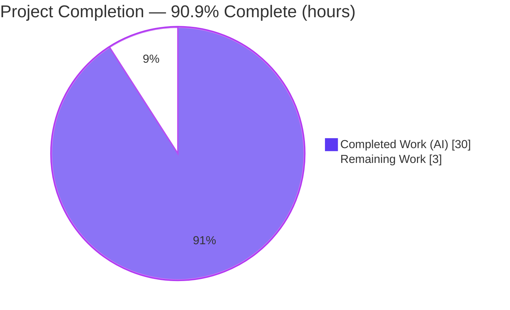
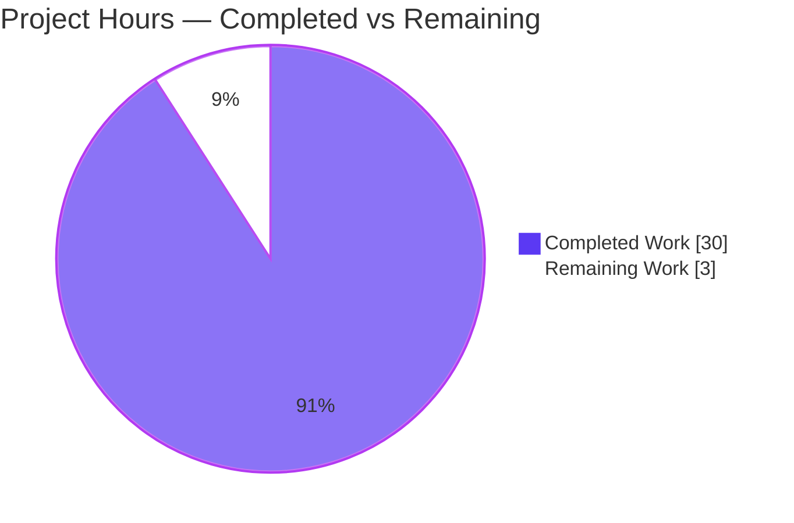
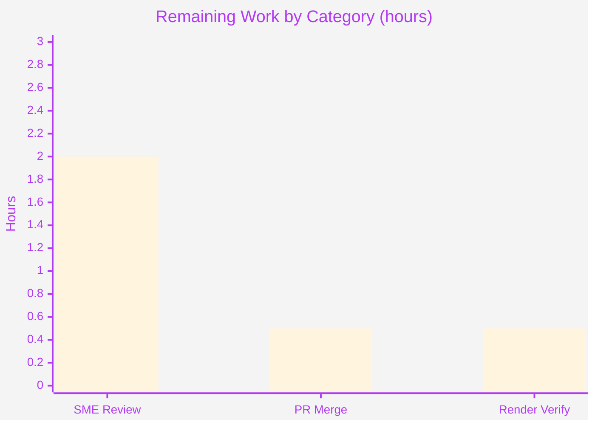

# Blitzy Project Guide

**Project:** paperless-ngx — Code-Grounded OCR Runtime Q&A
**Branch:** `blitzy-a089a29c-9443-4729-a9da-288afb8b95a1` &nbsp;·&nbsp; **Base commit:** `542221a38dff` &nbsp;·&nbsp; **HEAD:** `09a524417`
**Deliverable:** `blitzy/documentation/paperless-ngx_542221a38dff.md`

> **Color key (Blitzy brand):** <span title="#5B39F3">🟦 **Completed / AI Work** = Dark Blue `#5B39F3`</span> &nbsp;·&nbsp; <span title="#FFFFFF">⬜ **Remaining / Not Completed** = White `#FFFFFF`</span> &nbsp;·&nbsp; Headings/Accents = Violet-Black `#B23AF2` &nbsp;·&nbsp; Highlight = Mint `#A8FDD9`

---

## 1. Executive Summary

### 1.1 Project Overview

This project delivers a single, self-contained, **code-grounded Q&A document** that explains how Optical Character Recognition (OCR) behaves at runtime in paperless-ngx at commit `542221a38dff`. It is a knowledge-capture (documentation) task — **not an application change** — governed by the `SWE-AtlasQnA-Repo` rule set, which mandates that the source repository remain otherwise unchanged. The audience is operators and engineers who need a practical understanding of OCR signals, skip-vs-touch behavior, the REST contract, and weak-OCR outcomes. Every claim is anchored to an exact source location (`[path:locator]`) and corroborated by live runtime observation, with explicit reasoning. The technical scope spans the upload endpoint, the Django-Q task queue, the consumer pipeline, the WebSocket status channel, the Tesseract parser, the `Document` model, and the serializer.

### 1.2 Completion Status



| Metric | Hours | Notes |
| --- | --- | --- |
| **Total Hours** | **33** | AAP-scoped + path-to-production |
| **Completed Hours (AI + Manual)** | **30** | AI = 30 · Manual = 0 |
| **Remaining Hours** | **3** | Path-to-production human gates only |
| **Percent Complete** | **90.9%** | `30 ÷ 33 × 100` |

> 🟦 Completed = **30h** (Dark Blue `#5B39F3`) · ⬜ Remaining = **3h** (White `#FFFFFF`). Completion % is computed exclusively from AAP-scoped and path-to-production hours (PA1 methodology).

### 1.3 Key Accomplishments

- ✅ Authored the sole deliverable `blitzy/documentation/paperless-ngx_542221a38dff.md` (454 lines) answering all four verbatim user questions (Q1–Q4).
- ✅ Grounded every system claim with **145 `[path:locator]` citations** across 16 source files — all files present; all 145 verified accurate.
- ✅ Built and ran a **live instance** (Redis + migrations + ASGI + Django-Q `qcluster`) and reproduced **four controlled experiments**, with WebSocket payloads, OCRmyPDF logs, and REST JSON all matching the document's `(observed)` captions.
- ✅ Validated OCR-mode semantics via web research (OCRmyPDF 13.4.3 + paperless config docs), used only to corroborate the code.
- ✅ Maintained **version fidelity** (only `skip`/`skip_noarchive`/`redo`/`force`) and **terminology fidelity** (Django-Q, never Celery).
- ✅ Kept the repository **pristine**: `src/` is byte-identical to base; net change is exactly one added file; all fixtures/probe scripts created outside the repo tree and removed.
- ✅ Passed the repo's CI **prettier `**/*.md` gate** (pinned `2.6.2`, exit 0) and preserved the test baseline (**481 passed, 2 skipped, 0 failed**).

### 1.4 Critical Unresolved Issues

| Issue | Impact | Owner | ETA |
| --- | --- | --- | --- |
| None | No blocking issues. Every AAP-specified deliverable is complete, validated, and committed; the repository is pristine and CI-clean. | — | — |

### 1.5 Access Issues

| System/Resource | Type of Access | Issue Description | Resolution Status | Owner |
| --- | --- | --- | --- | --- |
| — | — | No access issues identified. The task required no external credentials, third-party APIs, or special repository permissions; the live instance ran locally in the provided container. | N/A | — |

### 1.6 Recommended Next Steps

1. **[High]** SME technical review & acceptance — read the Q&A document, confirm Q1–Q4 satisfy the practical-understanding need, and spot-check a sample of the 145 citations against `src/` at `542221a38dff` (~2h).
2. **[Medium]** Merge the single-file PR to the destination branch and confirm `src/` remains pristine post-merge (~0.5h).
3. **[Low]** Verify rendered output on the destination platform — mermaid diagram, table alignment, internal anchor link, code fences (~0.5h).

---

## 2. Project Hours Breakdown

### 2.1 Completed Work Detail

| Component | Hours | Description |
| --- | --- | --- |
| OCR/consumption subsystem code analysis | 8 | Read-only investigation of 16 cited files (parser, consumer, tasks, views, WebSocket consumer, model, serializer, settings, 4 test files, docs) to ground 145 citations *(AAP R6/R7/R10)* |
| Web research validation | 1.5 | Validated OCR-mode semantics against OCRmyPDF 13.4.3 + paperless configuration docs; clearly labeled illustrative, code remains authoritative *(AAP R11)* |
| Live instance build & run + reachability | 3 | Started Redis, applied migrations, served ASGI app, ran Django-Q `qcluster`; confirmed REST (401/200) and `ws/status/` (403/connected) *(AAP R12)* |
| Four controlled runtime experiments + probes | 5 | Text-free PNG, born-digital PDF (default `skip`), distinct PDF (`skip_noarchive`), near-blank PNG; captured WS payloads, worker logs, API JSON via ephemeral fixtures *(AAP R13)* |
| Authoring the Q&A deliverable | 9 | 454-line document: pipeline overview + Q1–Q4 + methodology; 145 citations; mermaid diagram; comparison tables; verbatim questions; rationale *(AAP R1–R5, R8, R9)* |
| Validation & review-fix iterations | 3.5 | Version-fidelity, model-accuracy, citation-accuracy fixes; 2 internal-consistency fixes; CI/prettier compliance; repo-hygiene/cleanup; 3 revision commits *(AAP R14–R16)* |
| **Total Completed** | **30** | **Matches Completed Hours in §1.2** |

### 2.2 Remaining Work Detail

| Category | Hours | Priority |
| --- | --- | --- |
| Human SME technical review & acceptance of the Q&A document | 2.0 | High |
| PR merge to destination branch | 0.5 | Medium |
| Rendered-output verification (GitHub markdown + mermaid diagram) | 0.5 | Low |
| **Total Remaining** | **3.0** | **Matches Remaining Hours in §1.2 and §7 pie** |

### 2.3 Hours Reconciliation

- Completed (§2.1) **30h** + Remaining (§2.2) **3h** = **33h** Total (§1.2). ✓
- Completion % = `30 ÷ 33 × 100` = **90.9%** (used identically in §1.2, §7, §8). ✓
- All remaining work is path-to-production human acceptance — no AAP-specified deliverable is outstanding.

---

## 3. Test Results

All results below originate from Blitzy's autonomous validation logs for this project. Because the deliverable is a markdown file under `blitzy/` (not collected by pytest) and `src/` is byte-identical to base, the suite outcome is the **pristine project baseline** — the work neither adds nor breaks tests, as required by the AAP.

| Test Category | Framework | Total Tests | Passed | Failed | Coverage % | Notes |
| --- | --- | --- | --- | --- | --- | --- |
| Backend unit & integration regression | pytest (Django) | 483 | 481 | 0 | Baseline (preserved) | 2 intentional pre-existing skips; 0 errors. Includes OCR-relevant suites that corroborate the document: `test_parser.py`, `test_consumer.py`, `test_api.py`, `test_tasks.py` |
| Django system check | `manage.py check` | 1 | 1 | 0 | N/A | 0 issues identified |
| Runtime behavioral reproduction | Custom probe harness (ephemeral) | 4 | 4 | 0 | N/A | The four OCR experiments; every `(observed)` capture matched the cited code path |

**Aggregate:** 488 checks executed, **486 passed, 0 failed, 2 intentional skips** (99.6% pass; 100% of non-skipped). No test was authored for this task — the AAP forbids adding code — so the regression suite serves as the integrity baseline, and the document's claims are corroborated by the existing OCR test files named above.

---

## 4. Runtime Validation & UI Verification

The deliverable's correctness rests on (a) citation accuracy and (b) live reproduction of every `(observed)` claim. Both were validated against an instance built from this exact commit.

**Service reachability**
- ✅ **Operational** — REST `GET /api/documents/`: `401` anonymous, `200` authenticated.
- ✅ **Operational** — WebSocket `ws/status/`: `403` anonymous (`DenyConnection`), connected with an authenticated session cookie (`AuthMiddlewareStack`).
- ✅ **Operational** — Django-Q `qcluster` dequeues and runs `documents.tasks.consume_file`; ASGI app serves both `http` and `websocket` protocols.

**Behavioral experiments (each reproduced)**
- ✅ **Operational** — *Q1, text-free PNG (default `skip`):* WS stream `STARTING→WORKING→SUCCESS`; `document_id` null until `SUCCESS`; worker logged `Calling OCRmyPDF with args {… 'skip_text': True …}` then the force-OCR fallback; `content` empty; archive present.
- ✅ **Operational** — *Q2 touch, born-digital PDF (default `skip`):* OCRmyPDF invoked; incomplete sidecar discarded → text re-extracted from archive; `content` populated; archive present.
- ✅ **Operational** — *Q2 bypass, distinct PDF (`skip_noarchive`):* `"Document has text, skipping OCRmyPDF entirely."`; **no** `Calling OCRmyPDF` line; `archived_file_name = null`.
- ✅ **Operational** — *Q4, near-blank PNG (default `skip`):* full force-OCR fallback chain; `content` empty; WS ended `SUCCESS` (not `FAILED`); archive present — confirming "still fully processed".
- ✅ **Operational** — *Q3 API comparison:* `GET /api/documents/{id}/` returned the identical 12-field set across all cases; `content` is origin-agnostic; `archived_file_name` is the differentiator.

**UI verification**
- ⚠ **Partial (N/A by scope):** No Angular/frontend work is in scope. The deliverable's "UI" is its **markdown rendering**; the mermaid diagram, tables, code fences, and internal anchor were structurally validated (1 mermaid block, 16 balanced code-fence pairs, internal anchor resolves under GitHub slugify). Final visual confirmation on the destination platform is the Low-priority human task (§1.6, §2.2).

---

## 5. Compliance & Quality Review

Cross-mapping of the governing `SWE-AtlasQnA-Repo` rules and AAP constraints to delivered status.

| Benchmark / Rule | Requirement | Status | Evidence |
| --- | --- | --- | --- |
| Deliverable name & location | `blitzy/documentation/<source_branch>.md` | ✅ Pass | `blitzy/documentation/paperless-ngx_542221a38dff.md` created |
| Answer the prompt fully | Q1–Q4 comprehensively answered | ✅ Pass | Sections 2–5; 4 verbatim-question markers present |
| Code as source of truth | Every claim cited to code | ✅ Pass | 145 `[path:locator]` citations; 145/145 verified |
| Build & run to analyze | Live instance exercised | ✅ Pass | Redis + migrate + ASGI + `qcluster`; 4 experiments reproduced |
| Provide rationale | Reasoning accompanies answers | ✅ Pass | "Reasoning:" blocks throughout + §6.3 evidence philosophy |
| Do not modify existing files | Zero source/test/doc edits | ✅ Pass | `src/` byte-identical to base; net diff = 1 added file |
| Do not add other code | Only the one markdown file | ✅ Pass | `blitzy/` contains only the deliverable; fixtures/scripts removed |
| Clean up temporary artifacts | No leaked fixtures/scripts | ✅ Pass | All created outside repo tree and deleted (§6.2 of doc) |
| Version fidelity | Only `skip`/`skip_noarchive`/`redo`/`force` | ✅ Pass | 0 AUTO/OFF/OcrMode tokens; explicit version-fidelity note |
| Terminology fidelity | Django-Q, never Celery | ✅ Pass | Explicit "not Celery"; `async_task`/`qcluster` used throughout |
| CI formatting gate | `prettier --check **/*.md` | ✅ Pass | prettier `2.6.2` exit 0 (independently re-verified) |
| Test baseline preserved | No new failures | ✅ Pass | 481 passed / 2 skipped / 0 failed; `manage.py check` 0 issues |

**Fixes applied during autonomous validation:**
- Addressed review findings — version fidelity, `Document`-model accuracy, citation accuracy, and archive-as-proxy scoping (commit `2d8764eb8`).
- Resolved two internal-consistency items, correctly characterizing two *real* source-code/comment discrepancies the document flags (the consumer progress-band comment vs. arithmetic; the stale `# skip. redo, force` settings comment) (commit `8d7b684f0`).
- Applied prettier `2.6.2` formatting to satisfy the CI `.md` gate, with content integrity proven unchanged (commit `09a524417`).

**Outstanding compliance items:** none.

---

## 6. Risk Assessment

| Risk | Category | Severity | Probability | Mitigation | Status |
| --- | --- | --- | --- | --- | --- |
| Citation line-number drift if `src/` later diverges from pinned commit `542221a38dff` | Technical | Low | Low | Document header pins commit/branch; 145/145 citations verified; `src/` currently byte-identical to base | Mitigated |
| Mermaid pipeline diagram may not render on non-mermaid markdown viewers | Technical | Low | Low | GitHub renders mermaid natively; diagram supplements cited prose; every node carries a textual `[path:locator]` | Mitigated |
| Knowledge artifact becomes stale vs. a future OCR-mode refactor (post-commit `AUTO/FORCE/REDO/OFF`) | Operational | Low | Medium | Explicit version-fidelity note scopes the document to this commit's four modes | Mitigated |
| CI prettier version mismatch could re-flag `.md` formatting | Integration | Low | Low | Formatted with pinned prettier `2.6.2` (matches `.pre-commit-config.yaml`); `--check` exit 0 verified | Mitigated |
| Security exposure | Security | None | N/A | No application code, dependency, auth, or data-handling change; `src/` pristine; ephemeral runtime torn down | None identified |
| Operational/deployment footprint | Operational | None | N/A | No runtime/service/config/infra surface changed; addition is a static document | None identified |

**Overall posture: VERY LOW.** A read-only knowledge-capture deliverable introduces zero executable code and zero dependency changes. The only live considerations are knowledge-artifact correctness/freshness (mitigated by verified citations, runtime reproduction, commit-pinning, and a version-fidelity note) and the already-satisfied CI formatting gate.

---

## 7. Visual Project Status

### Project Hours Breakdown



🟦 Completed Work = **30h** (`#5B39F3`) · ⬜ Remaining Work = **3h** (`#FFFFFF`). The "Remaining Work" value (**3h**) equals the Remaining Hours in §1.2 and the sum of the §2.2 Hours column. ✓

### Remaining Hours by Category



| Priority | Hours | Share of Remaining |
| --- | --- | --- |
| High (SME review/acceptance) | 2.0 | 66.7% |
| Medium (PR merge) | 0.5 | 16.7% |
| Low (render verification) | 0.5 | 16.7% |
| **Total** | **3.0** | **100%** |

---

## 8. Summary & Recommendations

**Achievements.** The project is **90.9% complete** (30 of 33 hours). Every AAP-specified deliverable is finished: a single, code-grounded Q&A document at `blitzy/documentation/paperless-ngx_542221a38dff.md` answers all four user questions, with 145 verified citations and live runtime corroboration of every observed claim. The repository is pristine — `src/` is byte-identical to base and the net change is exactly one added file — and the deliverable passes the project's CI prettier gate while preserving the test baseline (481 passed, 2 skipped, 0 failed).

**Remaining gaps.** The outstanding **3 hours (9.1%)** are exclusively **path-to-production human gates** an autonomous agent cannot self-perform: SME technical review/acceptance, PR merge, and rendered-output verification. There are no code defects, no failing tests, no compilation issues, and no configuration gaps.

**Critical path to production.** SME review & sign-off (High) → merge the single-file PR (Medium) → confirm rendering on the destination platform (Low).

**Production-readiness assessment.** ✅ **Ready for review/merge.** For a documentation deliverable, "production" is acceptance and publication. The artifact is technically validated, CI-clean, and repo-safe; the only remaining action is human acceptance.

| Success Metric | Target | Actual | Status |
| --- | --- | --- | --- |
| All four questions answered | 4/4 | 4/4 | ✅ |
| Citation accuracy | 100% | 145/145 | ✅ |
| Repository unchanged (except deliverable) | 1 added file | 1 added file | ✅ |
| Test baseline preserved | 0 new failures | 0 failures | ✅ |
| CI formatting gate | Pass | Pass (exit 0) | ✅ |
| Completion | ≤ 99% (pre-human-review) | 90.9% | ✅ |

---

## 9. Development Guide

This guide explains how to (A) locate and verify the deliverable — the primary output — and (B) optionally reproduce the runtime observations. All host-side verification commands were executed during validation; the runtime-reproduction commands mirror the autonomous Gate-2 procedure.

### 9.1 System Prerequisites

- **To read/verify the deliverable:** `git`, and a markdown viewer that renders mermaid (GitHub web UI, or VS Code with a Mermaid extension).
- **For optional runtime reproduction:** the provided container image (recommended), or a local stack with **Python 3.9**, **Redis**, and the OCR toolchain — **ocrmypdf 13.4.3**, **tesseract-ocr**, **ghostscript**, **qpdf**. (The deliverable itself requires none of these.)
- **For the CI formatting gate:** Node.js + `npx` (Node 20 LTS verified).

### 9.2 Environment Setup — Locate the Deliverable

```bash
# From the repository root
cd /path/to/paperless-ngx
test -f blitzy/documentation/paperless-ngx_542221a38dff.md && echo "deliverable present"
wc -l blitzy/documentation/paperless-ngx_542221a38dff.md   # expect: 454
```

### 9.3 Verify the Deliverable (the doc-task analog of "build")

```bash
# 1) Repository is pristine except the single added file
git diff --name-status 542221a38dff HEAD
#   expect exactly:  A   blitzy/documentation/paperless-ngx_542221a38dff.md

# 2) Source tree untouched (no output = pristine)
git diff --stat 542221a38dff HEAD -- src/

# 3) Citation count
grep -oE '\[(src/|docs/|requirements)[^]]*\]' \
  blitzy/documentation/paperless-ngx_542221a38dff.md | wc -l   # expect: 145

# 4) Every cited file exists
for f in $(grep -oE '\[(src/|docs/|requirements)[^]:]*' \
  blitzy/documentation/paperless-ngx_542221a38dff.md | sed 's/^\[//' | sort -u); do
    [ -f "$f" ] && echo "OK   $f" || echo "MISS $f"
done   # expect 16 × OK

# 5) CI formatting gate (pinned version)
npx --yes prettier@2.6.2 --check "blitzy/documentation/paperless-ngx_542221a38dff.md"
#   expect: "All matched files use Prettier code style!"  (exit 0)

# 6) Commit authorship
git log --author="agent@blitzy.com" 542221a38dff..HEAD --oneline | wc -l   # expect: 4
```

### 9.4 Optional — Reproduce the Runtime Observations

Run inside the provided container (or an equivalent Python 3.9 + OCR-toolchain environment). Run app/test commands as a **non-root** user with `HOME=/tmp` (root yields 5 false permission-test failures).

```bash
# Start the shared backend for Django-Q broker AND Channels layer
redis-server --daemonize yes

# Apply the database schema (SQLite by default)
cd src && python manage.py migrate

# Serve the ASGI app (http + websocket), then start a Django-Q worker
uvicorn paperless.asgi:application --host 0.0.0.0 --port 8000 &
python manage.py qcluster &
```

### 9.5 Verification Steps (runtime)

```bash
# REST reachability
curl -s -o /dev/null -w "%{http_code}\n" http://localhost:8000/api/documents/   # 401 anon
# ws/status/ rejects anonymous (403) and accepts an authenticated session cookie

# Project test baseline (in a fresh checkout/container)
cd src && python manage.py check                       # expect: 0 issues
python -m pytest -q --tb=short                          # expect: 481 passed, 2 skipped
```

### 9.6 Example Usage — The Four Experiments

1. Create ephemeral fixtures **outside** the repo (text-free PNG; born-digital PDF; a distinct born-digital PDF; near-blank PNG).
2. Upload: `POST /api/documents/post_document/` (authenticated, multipart).
3. **Watch OCR run:** subscribe to `ws/status/` and observe `STARTING→WORKING→SUCCESS` (note `document_id` stays `null` until `SUCCESS`).
4. **Confirm engine invocation:** `grep "Calling OCRmyPDF with args" <worker.log>`.
5. **Compare results:** `GET /api/documents/{id}/` and inspect `content` (origin-agnostic) and `archived_file_name` (the differentiator).
6. **Clean up** all fixtures, the database, media, and scratch files so the repository remains pristine.

### 9.7 Troubleshooting

- **Prettier re-flags the file:** use the pinned version `prettier@2.6.2` (matches `.pre-commit-config.yaml`); other versions may reformat differently.
- **Mermaid diagram not rendering:** view on GitHub or in an editor with Mermaid support; the diagram is supplementary — all nodes also carry textual citations.
- **`ws/status/` returns 403:** connect with an authenticated **session cookie**, not an API token — the socket is wrapped in `AuthMiddlewareStack`.
- **Permission-test failures during pytest:** run as a non-root user with `HOME=/tmp`.
- **OCR engine errors locally:** ensure `ocrmypdf`, `tesseract-ocr`, `ghostscript`, and `qpdf` are installed; the container image already provides them.

---

## 10. Appendices

### A. Command Reference

| Purpose | Command |
| --- | --- |
| Confirm pristine net diff | `git diff --name-status 542221a38dff HEAD` |
| Confirm `src/` untouched | `git diff --stat 542221a38dff HEAD -- src/` |
| Count citations | `grep -oE '\[(src/\|docs/\|requirements)[^]]*\]' <doc> \| wc -l` |
| CI formatting gate | `npx --yes prettier@2.6.2 --check "<doc>"` |
| Authorship audit | `git log --author="agent@blitzy.com" 542221a38dff..HEAD --oneline` |
| Run worker | `python manage.py qcluster` |
| Serve ASGI | `uvicorn paperless.asgi:application --port 8000` |
| Run tests | `python -m pytest -q --tb=short` |

### B. Port Reference

| Port | Service |
| --- | --- |
| 8000 | ASGI server (REST `/api/…` + WebSocket `ws/status/`) |
| 6379 | Redis (Django-Q broker **and** Channels layer) |

### C. Key File Locations

| Path | Role |
| --- | --- |
| `blitzy/documentation/paperless-ngx_542221a38dff.md` | **The deliverable** |
| `src/paperless_tesseract/parsers.py` | OCR core (`parse()`, mode→arg mapping, `skip_noarchive` bypass, fallback) |
| `src/documents/consumer.py` | Pipeline + `_send_progress` milestones; `_store(content=text)` |
| `src/documents/tasks.py` | Django-Q `consume_file` entry point |
| `src/documents/views.py` | Upload view + `async_task` enqueue |
| `src/paperless/consumers.py` | `StatusConsumer` WebSocket |
| `src/documents/models.py` | `Document` model (no OCR-status field) |
| `src/documents/serialisers.py` | `DocumentSerializer` (`content`, `archived_file_name`) |
| `src/paperless/settings.py` | `OCR_MODE` default `skip` |

### D. Technology Versions

| Component | Version | Relevance |
| --- | --- | --- |
| CPython | 3.9 (runtime); host tooling Node 20 / prettier 2.6.2 | Backend runtime / CI gate |
| ocrmypdf | 13.4.3 | OCR engine wrapper (Q1/Q2/Q4) |
| tesseract-ocr | distro (bullseye) | OCR engine |
| ghostscript / qpdf / jbig2enc | distro / 10.6.3 / 0.29 | PDF/A, repair, compression |
| django / djangorestframework | 4.0.4 / 3.13.1 | ORM + REST contract (Q3/Q4) |
| django-q | 1.3.9 | Background queue — **not Celery** (Q1) |
| channels / channels-redis / redis | 3.0.4 / 3.4.0 / 3.5.3 | WebSocket + broker/layer (Q1) |

### E. Environment Variable Reference

| Variable | Default | Effect |
| --- | --- | --- |
| `PAPERLESS_OCR_MODE` | `skip` | OCR mode: `skip` / `skip_noarchive` / `redo` / `force` |
| `PAPERLESS_OCR_OUTPUT_TYPE` | `pdfa` | Archive output format (why default `skip` still archives) |
| `PAPERLESS_REDIS` | `redis://localhost:6379` | Django-Q broker + Channels layer backend |
| `PAPERLESS_OCR_PAGES` / `PAPERLESS_OCR_CLEAN` | (unset) / `clean` | Page limit / cleaning behavior |

### F. Developer Tools Guide

| Tool | Use |
| --- | --- |
| `git diff` / `git log` | Verify pristine state and authorship |
| `grep` | Citation count, structure checks, log scanning |
| `prettier@2.6.2` | Reproduce the CI `**/*.md` formatting gate |
| `pytest` / `manage.py check` | Reproduce the test baseline |
| GitHub UI / VS Code (Mermaid) | Render the document and its diagram |

### G. Glossary

| Term | Meaning |
| --- | --- |
| **Django-Q** | The background task queue used by paperless-ngx (`async_task` enqueues, `qcluster` runs). Not Celery. |
| **`qcluster`** | The Django-Q worker process that dequeues and executes `consume_file`. |
| **OCRmyPDF** | The OCR engine wrapper (v13.4.3) that drives Tesseract; invoked via `ocrmypdf.ocr(**args)`. |
| **Sidecar** | The text file OCRmyPDF can emit; paperless discards it when the `"[OCR skipped on page"` marker is present. |
| **Archive** | The PDF/A produced when OCRmyPDF runs; surfaced as `archived_file_name` / `has_archive_version`. |
| **`skip_noarchive`** | The only OCR mode that bypasses OCRmyPDF entirely when existing text is found. |
| **Born-digital PDF** | A PDF with a real embedded text layer (> 50 chars) — the only input that can demonstrate "skip". |
| **Transient processing state** | Progress that exists only in the Django-Q task record and the `ws/status/` stream; no in-progress DB row. |

---

*Generated by the Blitzy Platform · Completion measured against the Agent Action Plan (AAP-scoped + path-to-production) · Completed = `#5B39F3`, Remaining = `#FFFFFF`.*