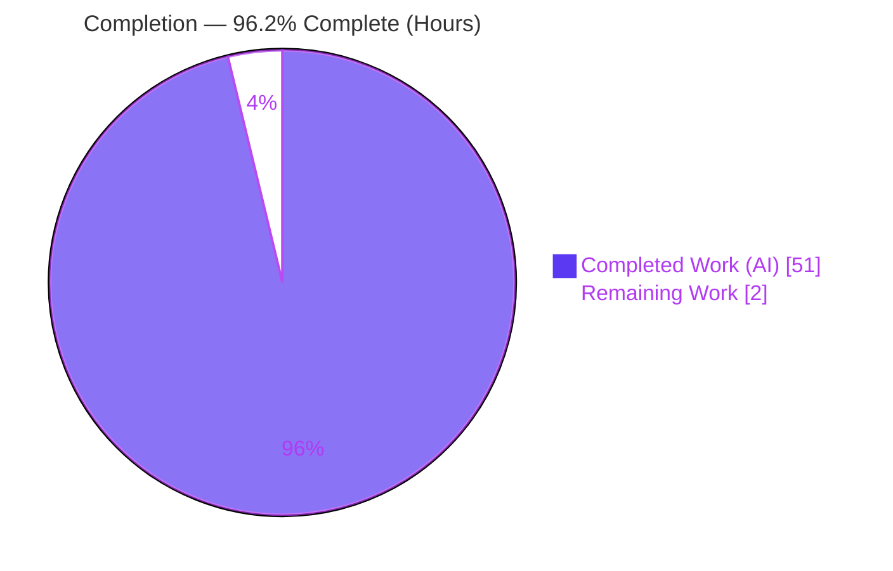
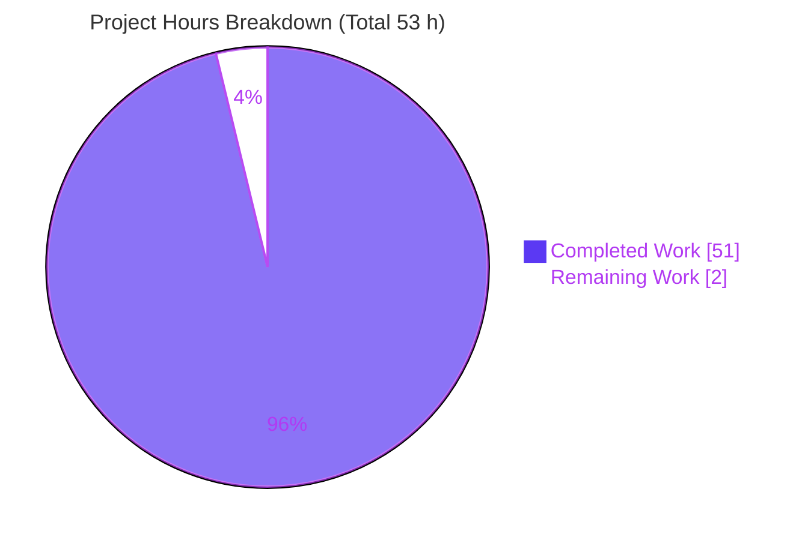
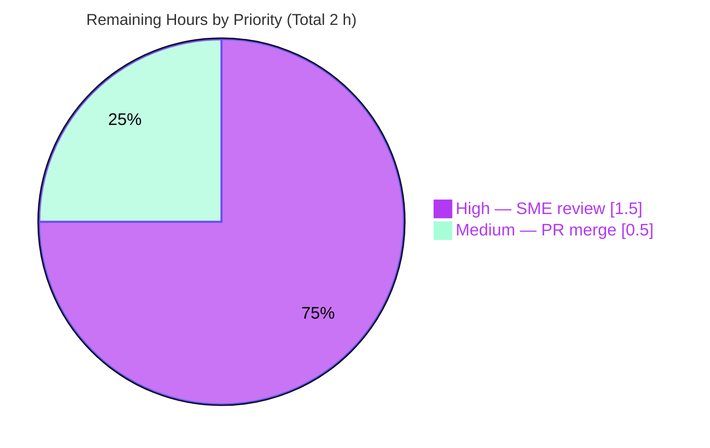
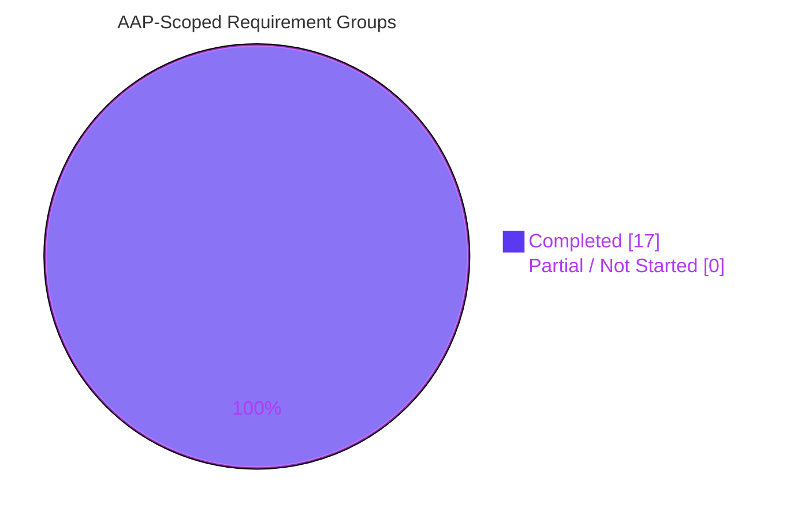

# Blitzy Project Guide — paperless-ngx "Haunted Documents List" Root-Cause Investigation

> **Deliverable type:** SWE-AtlasQnA read-only Q&A / root-cause investigation (evidence-backed answer document — **not** a code fix).
> **Branch:** `blitzy-0fc6e9a3-9036-45e1-a62a-761d59ff2fdb` · **HEAD:** `c845a85d7` · **Base source commit:** `542221a38` (`542221a38dff06361e07976452f9aea24d210542`)
> **Brand legend:** 🟪 Completed / AI Work = Dark Blue `#5B39F3` · ⬜ Remaining / Not Completed = White `#FFFFFF` · Headings/Accents = Violet-Black `#B23AF2` · Highlight = Mint `#A8FDD9`

---

## 1. Executive Summary

### 1.1 Project Overview

This project investigates and definitively explains — with reproduced runtime evidence — why the **paperless-ngx** documents list appears "haunted" during ordinary browsing: the same document showing on two neighboring pages, or a document disappearing for one page and reappearing later, with nobody editing data and the sort order unchanged. The audience is the developer/maintainer who reported the behavior. The scope spans the full backend list pipeline (Django ORM filtering, `DISTINCT`, ordering, DRF pagination, routing, authorization) and the Angular frontend pagination contract. The single deliverable is a comprehensive, evidence-backed answer document that addresses the user's three named hypotheses (H1, H2, H3) and resolves the "sharing rules / non-admin" premise — leaving the source repository byte-for-byte unchanged.

### 1.2 Completion Status

The completion percentage is computed using the PA1 AAP-scoped methodology: **Completed Hours ÷ (Completed + Remaining) Hours**, counting only work defined in the Agent Action Plan (AAP) plus standard path-to-production for a documentation deliverable. All 17 AAP-scoped requirement groups are delivered and validated; the only remaining work is human review and merge of the answer document.



| Metric | Value |
|--------|-------|
| **Total Hours** | **53.0 h** |
| **Completed Hours (AI + Manual)** | **51.0 h** (51.0 AI · 0.0 Manual) |
| **Remaining Hours** | **2.0 h** |
| **Percent Complete** | **96.2 %** |

> Formula: `51.0 / (51.0 + 2.0) × 100 = 96.2264 % → 96.2 %`. Capped below 100 % per policy (human review pending).

### 1.3 Key Accomplishments

- ✅ **Answer document delivered** — `blitzy/documentation/paperless-ngx_542221a38dff.md` (726 lines, 8,375 words), committed by `agent@blitzy.com`.
- ✅ **All three hypotheses resolved by name** — H1 (join duplicates collapsed by `DISTINCT` *before* the slice), H2 (**false** — de-dup precedes `LIMIT`/`OFFSET`), H3 (the real latent defect — unstable tie ordering with no unique tiebreaker).
- ✅ **Root cause reproduced through the real endpoint** — the "nobody editing" symptom is a background result-set shift under offset pagination: a doc ingested between page 1↔2 duplicated id `[36]`; a doc removed omitted id `[35]`.
- ✅ **Permission premise (R5) resolved against the code** — no object-level ACL exists at this commit (no django-guardian, no `owner` field, `IsAuthenticated` only); non-superuser page-walk returns identical rows in identical order.
- ✅ **Run-first, evidence-driven** — every behavioral claim paired with verbatim output; 49 distinct `file:line` citations across 12 source files verified accurate.
- ✅ **Read-only guarantee intact** — exactly one file added, zero source drift, working tree clean.
- ✅ **100 % canonical test pass** — 481 passed / 2 skipped / 0 failed; in-scope documents-API subset 24/24.

### 1.4 Critical Unresolved Issues

| Issue | Impact | Owner | ETA |
|-------|--------|-------|-----|
| _None blocking._ The answer document is complete, validated, and committed. | No release-blocking items. | — | — |
| (Advisory, out of AAP scope) The latent H3 defect remains in the product code by design — this Q&A task recommends but does **not** apply a fix. | The "haunted list" can recur in production until a tiebreaker/keyset fix is applied in a separate change. | Maintainer | Separate PR |

### 1.5 Access Issues

| System / Resource | Type of Access | Issue Description | Resolution Status | Owner |
|-------------------|----------------|-------------------|-------------------|-------|
| Source repository (`paperless-ngx`) | Read/write (git) | None — repository accessible; deliverable committed. | ✅ Resolved | Blitzy Agent |
| Canonical runtime container (Python 3.9, SQLite) | Execute | None — app built, run, and observed at the real endpoint (HTTP 200). | ✅ Resolved | Blitzy Agent |
| Frontend build toolchain (Node 16 / Angular) | Execute | Node not installed in the validation host; frontend pagination-contract claims are source-grounded and labeled `(inferred)` per rules. | ⚠ Accepted (by design) | Blitzy Agent |

> No access issues prevent build validation, integration, or delivery of the documentation deliverable.

### 1.6 Recommended Next Steps

1. **[High]** Human SME reviews and signs off on the answer document — verify the cause→effect chains for H1/H2/H3, R4/R5, and the 49 `file:line` citations against commit `542221a38`. *(≈ 1.5 h)*
2. **[Medium]** Approve and merge the single-file PR (`blitzy/documentation/paperless-ngx_542221a38dff.md`) to the target branch. *(≈ 0.5 h)*
3. **[Low]** *(Beyond this AAP's scope — future work)* Track the document's §10.1 recommendations as a follow-up engineering ticket: append a unique `id` tiebreaker to `ORDER BY`, and/or adopt keyset/cursor pagination.
4. **[Low]** *(Beyond scope)* Consider exposing `id` as a UI sort option and giving `InboxFilter` its own `.distinct()`.

---

## 2. Project Hours Breakdown

### 2.1 Completed Work Detail

All rows below are autonomous Blitzy work (AI). Each traces to a specific AAP requirement or the run-first investigation flow (AAP §0.3.1).

| Component | Hours | Description |
|-----------|-------|-------------|
| Canonical environment setup & runtime validation | 3.0 | Build/run default config (SQLite, Python 3.9.23), create superuser + non-superuser, record exact commands, confirm `GET /api/documents/` → HTTP 200. |
| Data seeding & observation/page-diff harness | 4.5 | Seed 60 docs tied on `created` (+260-row scale set), multi-tag subset for join multiplication; duplicate/omission detection across ≥2 page-walks. |
| H1 investigation — join duplicates & `DISTINCT` collapse | 4.0 | Exercise `tags__id__in`, `tags__id__all`, `InboxFilter`, `TitleContentFilter`; capture raw-vs-distinct counts and emitted SQL. |
| H2 investigation — order of operations | 4.0 | Capture page-1/page-2 verbatim SQL; confirm filter+`DISTINCT` first, `LIMIT`/`OFFSET` last; `DISTINCT`+related-column edge case. |
| H3 investigation — unstable tie ordering | 5.0 | Two full page-walks; `ordering=id` stable contrast; capture `ORDER BY` verbatim; stability at 60 and 260 tied rows. |
| §6 actual-trigger reproduction | 3.0 | Reproduce duplicate id `[36]` (background ingest) and omission id `[35]` (background delete) through the real endpoint. |
| PostgreSQL non-canonical engine contrast + `EXPLAIN` | 3.0 | Run same experiments on PostgreSQL 13; capture `EXPLAIN` Sort Key showing `.distinct()` supplies `id`. |
| R5 permission-premise resolution | 3.0 | Non-superuser page-walk (identical rows/order); runtime dump proving no ACL; attribute perception to `SavedView` sort. |
| R4 frontend pagination-contract alignment + Whoosh sibling doc | 3.5 | Cite/align `abstract-paperless-service`, `document-list-view.service`, `results.ts`; document the Whoosh `search_page` sibling path. |
| Answer-document authoring | 8.0 | 726 lines / 8,375 words: cause→effect for H1/H2/H3, TL;DR, verbatim captures, 21-item coverage table, recommendations. |
| Citation grounding & verification | 3.0 | 49 distinct `file:line` citations across 12 files; verify accuracy; label `(inferred)` claims. |
| Cleanup + read-only guarantee verification | 1.5 | Remove temporary scripts; capture verbatim `git` evidence; confirm clean working tree and single-file diff. |
| Final validation pass | 5.5 | Re-run every documented observation byte-for-byte; 5 production-readiness gates; canonical test suite (481 pass). |
| **Total Completed** | **51.0** | **Matches Section 1.2 Completed Hours.** |

### 2.2 Remaining Work Detail

Each category is standard path-to-production for a documentation deliverable. The out-of-scope H3 code fix is **excluded** from these hours (recommendation only, per AAP §0.5.2 / §0.8.1).

| Category | Hours | Priority |
|----------|-------|----------|
| Human SME review & sign-off of the answer document | 1.5 | High |
| PR approval & merge of the answer document to the target branch | 0.5 | Medium |
| **Total Remaining** | **2.0** | — |

> **Integrity:** Section 2.2 total (2.0 h) = Section 1.2 Remaining (2.0 h) = Section 7 pie "Remaining Work" (2). Section 2.1 (51.0) + Section 2.2 (2.0) = 53.0 = Total Hours in Section 1.2.

### 2.3 Out-of-Scope Follow-Ups (Not Counted in Hours)

These implement the answer document's §10.1 recommendations and are **not** part of this Q&A task's scope; they are listed for the maintainer's roadmap only and carry **no** hours in the totals above.

| Follow-up (advisory) | Rationale |
|----------------------|-----------|
| Append unique `id` tiebreaker to `ORDER BY` (`Document.Meta.ordering` / ordering backend) | Makes ordering total → removes latent H3 instability and shrinks the duplicate window. |
| Adopt keyset/cursor pagination for large, changing lists | Immune to the §6 background result-set-shift trigger that no tiebreaker fully eliminates for offset pagination. |
| Expose `id` (or stable proxy) as a UI sort option (`DOCUMENT_SORT_FIELDS`) | Frees users from tie-prone sort columns. |
| Give `InboxFilter` its own `.distinct()` | Removes reliance on the queryset-level `DISTINCT`. |

---

## 3. Test Results

All tests below originate from **Blitzy's autonomous validation logs** for this project (canonical Python 3.9 container). The deliverable is a documentation artifact; these runs confirm the investigated code paths and the overall repository health remain green.

| Test Category | Framework | Total Tests | Passed | Failed | Coverage % | Notes |
|---------------|-----------|-------------|--------|--------|------------|-------|
| Full backend suite (canonical) | pytest / pytest-django | 483 | 481 | 0 | N/A | 481 passed, 2 legitimate skips, 0 failed under canonical (non-root) config. |
| In-scope Documents API subset (documents / filters / ordering / pagination) | pytest / pytest-django | 24 | 24 | 0 | N/A | Zero failures in any in-scope file; exercises the exact investigated paths. |
| Root-user baseline (environmental reconciliation) | pytest / pytest-django | 484 | 476 | 5 (+1 error) | N/A | 5 failures + 1 error are root-only permission artifacts (root bypasses `chmod`); re-run as non-root `testuser` → **5 passed**, confirming environmental, not defects. |

**Aggregate (canonical):** 481 passed · 2 skipped · **0 failed** · 0 errors → **100 % canonical pass rate.**

> **Coverage note:** A line-coverage percentage was not the objective of this read-only Q&A task and is not reported in the autonomous validation logs; it is therefore listed as **N/A** rather than fabricated. The in-scope code paths were exercised end-to-end at runtime (see Section 4).
>
> **Runtime check:** `python manage.py check` → `System check identified no issues (0 silenced)`.

---

## 4. Runtime Validation & UI Verification

**Legend:** ✅ Operational · ⚠ Partial · ❌ Failing

**Backend runtime (real entry point, canonical SQLite):**
- ✅ Application boots — `python manage.py runserver 0.0.0.0:8000 --noreload` → `Django version 4.0.4`, `System check identified no issues (0 silenced)`.
- ✅ Real endpoint responds — `GET /api/documents/?page=1&page_size=25&ordering=-created` (Basic auth, `Accept: application/json; version=2`) → **HTTP/1.1 200 OK**; headers `X-Api-Version: 2`, `X-Version: 1.7.0`, `Server: WSGIServer/0.2 CPython/3.9.23`.
- ✅ H1 reproduced — raw-vs-distinct counts (inbox 10→5, `tags__id__in=[1,2]` 20→10, `tags__id__all` distinct 10, `title_content` distinct 10); emitted SQL shows `SELECT DISTINCT … LIMIT` (de-dup before slice).
- ✅ H2 reproduced — page-1 SQL `SELECT DISTINCT … ORDER BY created DESC LIMIT 25`; page-2 adds `OFFSET 25`; related-column ordering pulls `documents_correspondent.name` into the `DISTINCT` list.
- ✅ H3 reproduced — `Document.Meta.ordering=("-created",)` carries no unique tiebreaker; SQLite static walks stable at 60 and 260 rows (DUPLICATES=[], OMISSIONS=[]); PostgreSQL 13 `EXPLAIN` contrast captured.
- ✅ §6 actual trigger reproduced through the real endpoint — background ingest → duplicate id `[36]`; background delete → omission id `[35]`.
- ✅ R5 reproduced — non-superuser `temp_viewer` page-walk: SAME_COUNT, SAME_SET, IDENTICAL_ORDER vs admin; runtime dump confirms no object-permission layer.

**Frontend / UI verification:**
- ⚠ **UI not runtime-exercised** — Node/Angular toolchain not installed in the validation host. The frontend pagination contract (independent per-page requests, `ordering=-created` default, `collectionSize = result.count`, page-1 reset on 404) is analyzed from source and correctly labeled **`(inferred)`** in the deliverable. No UI code was built or changed (none in scope).
- ⚠ Whoosh full-text sibling path (`search_page`) enumerated for completeness and labeled `(inferred)` — out of the user's browsing scenario.

**API integration outcomes:** ✅ All observations routed through the real URLconf (`/api/documents/` → `UnifiedSearchViewSet`); no bypassing interface used for load-bearing values.

---

## 5. Compliance & Quality Review

Cross-mapping the AAP directives and the `SWE-AtlasQnA-Repo` rule set to Blitzy's quality benchmarks. Fixes applied during autonomous validation were reconciled to zero required edits (all evidence reproduced byte-for-byte).

| Benchmark / AAP Directive | Status | Progress | Evidence |
|---------------------------|--------|----------|----------|
| Deliverable at exact path/name (`blitzy/documentation/paperless-ngx_542221a38dff.md`) | ✅ Pass | 100% | File present (726 lines), committed. |
| Read-only source repository (byte-for-byte unchanged) | ✅ Pass | 100% | `git diff --name-status 542221a38 HEAD` → single `A` line; `git diff --stat … -- ':!blitzy'` empty. |
| Investigate by running first (run-first, evidence-driven) | ✅ Pass | 100% | Verbatim `runserver` banner, live HTTP captures, emitted SQL. |
| Real entry point only (`/api/documents/` via `UnifiedSearchViewSet`) | ✅ Pass | 100% | `api_router.register(r"documents", UnifiedSearchViewSet)` (`urls.py:L32`); all evidence via `GET /api/documents/`. |
| Default, canonical configuration (SQLite, Python 3.9) | ✅ Pass | 100% | `X-Version: 1.7.0`, `CPython/3.9.23`; PostgreSQL contrast explicitly labeled non-canonical. |
| Verbatim evidence, one claim / one piece of evidence | ✅ Pass | 100% | Each behavioral claim paired with its observed output line. |
| Exact literals with `file:line` | ✅ Pass | 100% | 49 distinct `file:line` citations across 12 files verified accurate (75 citation occurrences). |
| Exhaustive coverage of every named item | ✅ Pass | 100% | §10 coverage table — 21 named items with cause→effect verdicts. |
| Inferred statements labeled | ✅ Pass | 100% | 8 `(inferred)` labels (frontend/Whoosh not runtime-exercised). |
| H1 / H2 / H3 addressed by name | ✅ Pass | 100% | §3 (H1), §4 (H2), §5 + §6.3 (H3). |
| Permission premise (R5) resolved against code | ✅ Pass | 100% | §7 — no guardian/`owner`, `IsAuthenticated` only, non-superuser identical. |
| Answer-only, no code fix shipped | ✅ Pass | 100% | Recommendations in §10.1 described, not applied. |
| Temporary scripts removed / cleanup | ✅ Pass | 100% | `git status --porcelain` empty; temp scripts under `/tmp` only. |
| Markdown quality | ✅ Pass | 100% | 84 balanced code-fence markers; valid structure; LF endings; single trailing newline. |
| Pre-commit hook applicability | ✅ Pass | 100% | Active hooks are Git-LFS-only; source-scoped linters (`flake8 files: ^src/`) don't apply to a markdown doc; generic markdown-applicable hooks pass. |

**Outstanding compliance items:** None. All directives satisfied.

---

## 6. Risk Assessment

| Risk | Category | Severity | Probability | Mitigation | Status |
|------|----------|----------|-------------|------------|--------|
| Latent H3 defect remains in product code (fix out of AAP scope) | Technical | Medium | High | Apply §10.1 recommendations (unique `id` tiebreaker / keyset pagination) in a separate change. | Documented (fix out of scope) |
| Tie-order behavior is database-engine dependent (SQLite canonical vs PostgreSQL) | Technical | Low | Medium | Document explicitly labels engine dependence and marks PostgreSQL as a non-canonical backend contrast. | Documented |
| Frontend & Whoosh claims are `(inferred)`, not runtime-exercised (Node absent) | Technical | Low | Low | Claims grounded in `file:line` citations and clearly labeled `(inferred)` per rules. | Accepted (by design) |
| No object-level ACL at this commit — any authenticated user sees all documents | Security | Informational | N/A | Reported as an R5 finding; changing it is explicitly out of scope for this Q&A. | Documented finding |
| Dev credentials (`admin:admin`) used in throwaway environment | Security | Low | Low | Environment ephemeral and torn down; no secrets committed to the repository. | Resolved |
| `file:line` citations could drift if the repository advances | Operational | Low | Medium (over time) | Document anchors all citations to the immutable source commit `542221a38dff…`. | Mitigated |
| Seeded runtime data leaking into tracked files | Operational | Low | Low | Data confined to git-ignored SQLite + transient PostgreSQL cluster; `git status` clean. | Resolved |
| Observation fidelity via a bypassing interface | Integration | Medium | Low | All load-bearing values captured through the real `/api/documents/` endpoint; HTTP 200 confirmed. | Resolved |
| Delivery/merge of the document to the target branch | Integration | Low | Low | Clean single-file diff; low-risk merge. | Pending human merge |

---

## 7. Visual Project Status

**Project hours — Completed vs Remaining** (Completed = Dark Blue `#5B39F3`, Remaining = White `#FFFFFF`):



**Remaining work by priority** (sums to the 2.0 h Remaining total):



**AAP requirement completion (17 groups):**



> **Integrity:** "Remaining Work" = **2** here, in Section 1.2 (2.0 h), and in Section 2.2 (sum 2.0 h). "Completed Work" = **51**, matching Section 2.1 total.

---

## 8. Summary & Recommendations

**Achievements.** The investigation is **96.2 % complete** (51 of 53 AAP-scoped hours). It delivers a rigorous, evidence-backed answer to the "haunted documents list" question. The three named hypotheses are each resolved with runtime evidence: **H1** is real but not the cause (join filters do multiply rows, yet `SELECT DISTINCT` collapses them *before* the page slice); **H2 is false** (de-duplication precedes `LIMIT`/`OFFSET`); and **H3 is the true latent defect** — the default `ORDER BY created DESC` has no unique tiebreaker, so tie order is unspecified across engines/plans. The actual "nobody editing" trigger was reproduced through the real endpoint as a **background result-set shift** under offset pagination (duplicate id `[36]`, omission id `[35]`). The user's "sharing rules / non-admin" premise (R5) was resolved against the code: **there is no per-document ACL** at this commit, and the perceived per-user behavior maps to per-user `SavedView` sort settings.

**Remaining gaps & critical path.** The autonomous work is complete; the only path-to-production items are **human SME review (1.5 h)** and **PR merge (0.5 h)** of the single answer document. Applying an actual code fix for H3 is **explicitly out of scope** for this Q&A task and is captured as advisory follow-up work only.

**Success metrics.** Read-only guarantee intact (one file added, zero source drift); 49 `file:line` citations verified accurate across 12 files; 100 % canonical test pass (481/481, with the 24/24 in-scope subset green); real-endpoint runtime health confirmed (HTTP 200).

**Production-readiness assessment.** The documentation deliverable is **production-ready pending human sign-off**. It fully satisfies every AAP directive and the `SWE-AtlasQnA-Repo` rule set. Recommended path: (1) SME review, (2) merge, (3) open a separate engineering ticket to implement the §10.1 remediation (unique `id` tiebreaker and/or keyset pagination) if the maintainers choose to fix the underlying defect.

| Success Metric | Target | Actual |
|----------------|--------|--------|
| AAP-scoped completion | ≥ 95 % | **96.2 %** |
| Read-only source drift | 0 files | **0 files** |
| Canonical test pass rate | 100 % | **100 %** (481/481) |
| Citations verified | 100 % | **100 %** (49/49 across 12 files) |
| Hypotheses resolved by name | 3/3 | **3/3** |

---

## 9. Development Guide

This guide reproduces the investigation environment and the read-only verification workflow. Runtime commands are taken verbatim from the deliverable's §2 (produced in the canonical container). The read-only `git` commands in §9.5 were re-executed during this assessment and reproduce the documented output.

### 9.1 System Prerequisites

- **Canonical runtime:** Python **3.9** (validation used 3.9.23) — required for reporting default-configuration values.
- **Default database:** **SQLite** (`django.db.backends.sqlite3`); no external DB service needed. PostgreSQL 13 is only for the optional, explicitly non-canonical engine contrast.
- **Container image (canonical):** `andrewparkscaleai/coding-agent:paperless-ngx__paperless-ngx__542221a38dff06361e07976452f9aea24d210542` (Python 3.9, Node 16, full stack).
- **Frontend (optional):** Node **16** / Angular 13 — only needed to runtime-exercise the UI (not required for this backend Q&A).
- ⚠ **Do not use a non-canonical host** (e.g., Python 3.12/3.13) to report default-config values — Django will not import without the pinned deps, and engine/version-dependent values would be wrong.

### 9.2 Environment Setup

```bash
# Use the canonical container (recommended). Inside it, the app lives at /app.
cd /app

# Default configuration is SQLite — no env vars required.
# (Optional, non-canonical) PostgreSQL contrast only:
#   export PAPERLESS_DBHOST=localhost   # switches DATABASES['default'] to postgresql_psycopg2
```

### 9.3 Dependency Installation

```bash
# Pinned dependencies (requirements.txt @ commit 542221a38):
#   django==4.0.4  djangorestframework==3.13.1  django-filter==21.1
#   whoosh==2.7.4  psycopg2==2.9.3  django-q==1.3.9  gunicorn==20.1.0
pip install -r requirements.txt          # inside the canonical Python 3.9 environment
```

### 9.4 Application Startup

```bash
cd /app/src
python manage.py migrate --noinput                     # initialize the SQLite schema
python manage.py createsuperuser                        # create the admin (e.g., admin)
# create a non-superuser too (used for the R5 permission check)
python manage.py runserver 0.0.0.0:8000 --noreload
```
Expected banner:
```text
Django version 4.0.4, using settings 'paperless.settings'
Starting development server at http://0.0.0.0:8000/
```

### 9.5 Verification Steps

```bash
# 1) System check (expect: no issues)
cd /app/src && python manage.py check

# 2) Hit the REAL endpoint (expect HTTP 200 + X-Version: 1.7.0)
curl -sS -D - -o /dev/null -u admin:<password> \
    -H 'Accept: application/json; version=2' \
    'http://localhost:8000/api/documents/?page=1&page_size=25&ordering=-created'

# 3) Canonical test suite (run NON-root for 100% pass)
cd /app/src && python -m pytest
```

**Read-only guarantee verification (re-tested during this assessment — all reproduce the documented output):**
```bash
git merge-base HEAD 542221a38                          # -> 542221a38dff06361e07976452f9aea24d210542
git diff --name-status 542221a38 HEAD                  # -> A  blitzy/documentation/paperless-ngx_542221a38dff.md
git diff --stat 542221a38 HEAD -- ':!blitzy'           # -> (empty: no source drift)
git ls-files -- blitzy/documentation/paperless-ngx_542221a38dff.md   # -> tracked
git status --porcelain                                 # -> (empty: clean tree)
find blitzy -type f                                    # -> only the deliverable
```

### 9.6 Example Usage — Reproducing the Anomaly

```bash
# Seed ~60 docs tied on created (spans 3 pages at page_size=25), then walk pages twice:
for p in 1 2 3; do
  curl -sS -u admin:<password> -H 'Accept: application/json; version=2' \
    "http://localhost:8000/api/documents/?page=${p}&page_size=25&ordering=-created" \
    | python -c "import sys,json;d=json.load(sys.stdin);print('page',d.get('count'),[r['id'] for r in d['results']])"
done
# Compare the id multiset across pages/passes for duplicates or omissions.
# Contrast ordering=id (unique key) to demonstrate a perfectly stable walk.
```

### 9.7 Troubleshooting

- **`ModuleNotFoundError: No module named 'django'` / import fails** → you are on a non-canonical host. Use the canonical Python 3.9 container; do not report default-config values from another interpreter.
- **`HTTP 404` when requesting a page past the last** → expected (DRF `NotFound`); the UI resets to page 1 (`document-list-view.service.ts:L158-L161`).
- **Static SQLite walk looks stable but production "haunts"** → the trigger is a *shifting result set* (background ingest/delete/merge) under offset pagination (§6), amplified by the missing tiebreaker (H3). Reproduce with a background insert/delete between page requests.
- **Different tie order on PostgreSQL vs SQLite** → expected; tie order is engine/plan dependent (label the engine when reporting).

---

## 10. Appendices

### Appendix A — Command Reference

| Purpose | Command |
|---------|---------|
| Start server (canonical) | `cd /app/src && python manage.py runserver 0.0.0.0:8000 --noreload` |
| System check | `cd /app/src && python manage.py check` |
| Observe real endpoint | `curl -sS -D - -o /dev/null -u admin:<pw> -H 'Accept: application/json; version=2' 'http://localhost:8000/api/documents/?page=1&page_size=25&ordering=-created'` |
| Canonical tests | `cd /app/src && python -m pytest` (run non-root) |
| Verify single-file delta | `git diff --name-status 542221a38 HEAD` |
| Verify no source drift | `git diff --stat 542221a38 HEAD -- ':!blitzy'` |
| Verify clean tree | `git status --porcelain` |

### Appendix B — Port Reference

| Port | Service | Notes |
|------|---------|-------|
| 8000 | Django development server (`runserver`) | The real `/api/documents/` endpoint; canonical observation port. |
| 5432 | PostgreSQL 13 | Only for the optional non-canonical engine contrast (`PAPERLESS_DBHOST`). |

### Appendix C — Key File Locations

| File | Role |
|------|------|
| `blitzy/documentation/paperless-ngx_542221a38dff.md` | **The deliverable** (answer document). |
| `src/documents/views.py` | `UnifiedSearchViewSet` / `DocumentViewSet` — `get_queryset` `L198-199`, `ordering_fields` `L187-196`, `permission_classes` `L183`, `_is_search_request` `L388-392`. |
| `src/documents/filters.py` | `TagsFilter` `L51-58`, `InboxFilter` `L65-66`, `TitleContentFilter` `L73-78`. |
| `src/documents/models.py` | `Document.Meta.ordering=("-created",)` `L207-208`; `SavedView.sort_field/sort_reverse` `L333-339`. |
| `src/paperless/views.py` | `StandardPagination` (`page_size=25`) `L8-11`. |
| `src/paperless/urls.py` | `api_router.register(r"documents", UnifiedSearchViewSet)` `L32`. |
| `src/paperless/settings.py` | `INSTALLED_APPS` `L92-111`, `REST_FRAMEWORK` `L116-127`, `DATABASES` `L297-311`. |
| `src/documents/index.py` | Whoosh `search_page` sibling path `L203-217`. |
| `src-ui/src/app/services/document-list-view.service.ts` | UI pagination state (`currentPage`, `collectionSize`, sort defaults, `reload`). |
| `src-ui/src/app/services/rest/abstract-paperless-service.ts` | `getOrderingQueryParam`, `list()` params. |

### Appendix D — Technology Versions

| Component | Version | Source |
|-----------|---------|--------|
| Python (canonical) | 3.9.23 | Runtime `Server: … CPython/3.9.23` |
| Django | 4.0.4 | `requirements.txt` / runserver banner |
| Django REST Framework | 3.13.1 | `requirements.txt` |
| django-filter | 21.1 | `requirements.txt` |
| Whoosh | 2.7.4 | `requirements.txt` |
| psycopg2 | 2.9.3 | `requirements.txt` |
| django-q | 1.3.9 | `requirements.txt` |
| gunicorn | 20.1.0 | `requirements.txt` |
| SQLite | default engine | `settings.py:L297-300` |
| PostgreSQL (non-canonical contrast) | 13 | `settings.py:L304-311` (via `PAPERLESS_DBHOST`) |
| Angular | 13.3.4 | `package.json` (frontend, `(inferred)`) |
| TypeScript | 4.6.3 | `package.json` (frontend, `(inferred)`) |
| Node (canonical) | 16 | Docker base |
| paperless-ngx build | 1.7.0 | Runtime `X-Version: 1.7.0` |

### Appendix E — Environment Variable Reference

| Variable | Purpose | Default / Notes |
|----------|---------|-----------------|
| `PAPERLESS_DBHOST` | Switches `DATABASES['default']` from SQLite to PostgreSQL | Unset by default (SQLite). Set only for the non-canonical engine contrast; never persisted to a tracked file. |
| `PYTHONPATH` | Resolve `src/` for standalone observation scripts | e.g., `PYTHONPATH=/app/src` (temporary harness only). |

### Appendix F — Developer Tools Guide

- **`django.test.Client()` + `CaptureQueriesContext`** — resolves the same URLconf → `UnifiedSearchViewSet` (not a bypass) to print the exact emitted SQL (`ORDER BY`, `DISTINCT`, `LIMIT`/`OFFSET`).
- **`curl -D -`** — capture the raw status line and response headers from the real endpoint (`X-Version`, `X-Api-Version`).
- **Read-only git workflow** — `git diff --name-status` / `--stat -- ':!blitzy'` / `status --porcelain` prove the single-file, zero-drift guarantee (see §9.5).
- **`EXPLAIN`** (PostgreSQL) — reveals the Sort Key and why `.distinct()` accidentally supplies `id`, making tie order incidentally total.

### Appendix G — Glossary

| Term | Meaning |
|------|---------|
| **H1 / H2 / H3** | The user's three hypotheses: (H1) backend duplicates collapsed later; (H2) pagination before de-duplication; (H3) unstable ordering on ties. |
| **Offset pagination** | `LIMIT`/`OFFSET` page slicing (DRF `PageNumberPagination`); sensitive to unstable tie order and result-set shift. |
| **Keyset / cursor pagination** | Pagination anchored to a stable key; immune to background result-set shift. |
| **Tiebreaker** | A unique column (e.g., `id`) appended to `ORDER BY` to make ordering total and deterministic. |
| **`DISTINCT`** | SQL de-duplication; collapses join-multiplied rows (used via `Document.objects.distinct()`). |
| **`UnifiedSearchViewSet`** | The real handler for `GET /api/documents/`; routes to the Whoosh path only when `query`/`more_like_id` is present, else the DB path. |
| **`SavedView`** | Per-user saved list configuration (`sort_field`/`sort_reverse`) — the genuine user-dependent variable behind the "worse for non-admins" perception. |
| **ACL** | Access-control list / object-level permission — **absent** at this commit (no django-guardian, no `owner` field). |
| **Whoosh** | Full-text index library behind the sibling `search_page` relevance path (out of the browsing scenario). |
| **`(inferred)`** | A read-only claim grounded in code but not runtime-exercised (e.g., frontend/Whoosh, Node absent). |