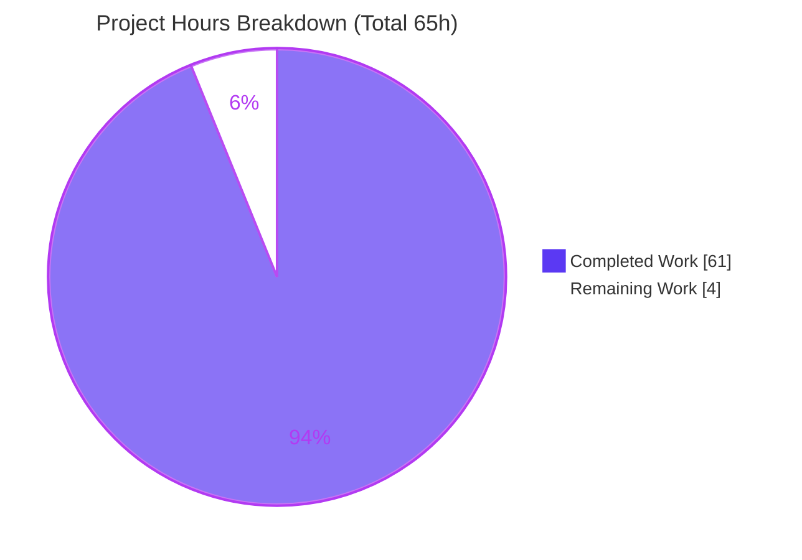
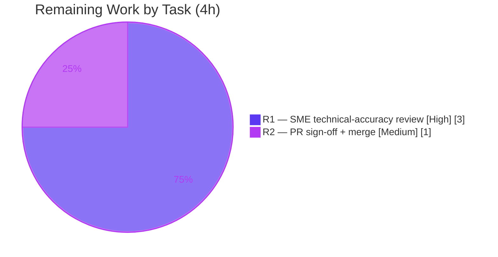

# Blitzy Project Guide — Paperless-ngx Runtime-Behavior Investigation (v1.7.0 @ `542221a38dff`)

> **Deliverable under assessment:** `blitzy/documentation/paperless-ngx_542221a38dff.md` (1,894 lines, 152,641 bytes)
> **Brand color legend:** <span style="color:#5B39F3">■</span> **Completed / AI Work = Dark Blue `#5B39F3`** · <span style="color:#FFFFFF;background:#333;padding:0 4px">■</span> **Remaining = White `#FFFFFF`** · Headings/Accents = Violet-Black `#B23AF2` · Highlights = Mint `#A8FDD9`

---

## 1. Executive Summary

### 1.1 Project Overview

This project is a **run-first, evidence-grounded runtime-behavior investigation** of Paperless-ngx v1.7.0 (pinned at commit `542221a38dff`), delivered as a single Markdown Q&A document for platform operators and maintainers. It answers four questions — idle background processing (Q1), periodic health/ready log cadence (Q2), reconnection/recovery signals (Q3), and continuously-running components (Q4) — by **building and running the canonical Docker stack first**, capturing real unedited output, and grounding every claim with `file:line` citations. The business value is authoritative operational documentation of what the system does while idle and during fault recovery. Technical scope is strictly read-only source with one additive documentation file.

### 1.2 Completion Status

The project is **93.8% complete** on an AAP-scoped basis (61 of 65 hours delivered autonomously). The only remaining work is human path-to-production: a technical-accuracy sign-off and the merge.


| Metric | Value |
|--------|-------|
| **Total Hours** | **65** |
| **Completed Hours (AI + Manual)** | **61** (61 AI + 0 Manual) |
| **Remaining Hours** | **4** |
| **Percent Complete** | **93.8%** |

> Completion % = Completed ÷ Total = 61 ÷ 65 = **93.8%** (93.8462% → reported as 93.8% throughout).

### 1.3 Key Accomplishments

- ✅ **Canonical runtime stood up and observed** — official image (base `python:3.9-slim-bullseye`, `Dockerfile:18`), default SQLite + mandatory Redis, default logging; Supervisord PID 1 with 3 children (`gunicorn`, `document_consumer`, `qcluster`).
- ✅ **All four questions answered with real captured output** — 73 code blocks of raw, unedited evidence, each paired with the command that produced it.
- ✅ **Two authoritative headline findings established by live introspection** — (1) the Django-Q **`INFO` startup banner is VISIBLE** (self-configured `[Q]` logger, `django_q/conf.py:207-218`, preserved by `disable_existing_loggers:False`, `settings.py:375`); (2) the **30 s Docker healthcheck is SILENT in application logs** (`uvicorn.access`/`gunicorn.access` effective `WARNING`, no handlers).
- ✅ **Fault-injection recovery fully exercised (Q3)** — worker `kill -9`, Redis stop/start, scheduler-restart-while-down, and `wait-for-redis.py` both branches; before/during/after captured; confirmed **no explicit "reconnected" string exists** (grep = 0).
- ✅ **Q4 always-on backbone verified** — Supervisord (`nodaemon`), Django-Q guard loop (~0.5 s heartbeat) + polling pusher, Redis dual role (broker + channel layer, not pub/sub), and the ASGI `StatusConsumer` WebSocket (unauth 403 / auth 101 / exact JSON `group_send`).
- ✅ **137 `file:line` citations verified exact** (repository + pinned site-packages: django-q 1.3.9, uvicorn 0.17.6); 29/29 internal anchors resolve; 146 code fences balanced; valid UTF-8.
- ✅ **Repository left pristine** — diff vs base = exactly one file added; source tree untouched; all observation containers/scripts torn down; `git status` clean.

### 1.4 Critical Unresolved Issues

| Issue | Impact | Owner | ETA |
|-------|--------|-------|-----|
| Logging-finding divergence: the live runtime finding (django-q `INFO` banner **VISIBLE**) refines the AAP §0.5.3 static prediction (`INFO` **SUPPRESSED**). | **Non-blocking.** Intentional & correct under the binding run-first rule (§0.8.2); validated byte-for-byte twice. Needs routine SME sign-off. | Human SME reviewer | 3 h (task R1) |

> **No release-blocking defects exist.** The deliverable is byte-for-byte validated and the repository is pristine (zero fixes were required in the final validation session). The single item above is a **review gate**, not a defect.

### 1.5 Access Issues

**No access issues identified.** The investigation ran entirely on the user-provided container image and local Docker; no external repository permissions, service credentials, or third-party API access were required or blocked.

| System/Resource | Type of Access | Issue Description | Resolution Status | Owner |
|-----------------|----------------|-------------------|-------------------|-------|
| — | — | No access issues identified | N/A | — |

### 1.6 Recommended Next Steps

1. **[High]** Conduct SME technical-accuracy review of the two headline findings — confirm the *INFO-banner-VISIBLE* determination and the *healthcheck-SILENT* determination are authoritative, and spot-check a sample of the 137 `file:line` citations. *(3 h)*
2. **[Medium]** Sign off the pull request and **merge/publish** the documentation to the target branch. *(1 h)*
3. **[Low]** *(Optional, out of current AAP scope)* Add secondary-condition appendices — PostgreSQL-topology healthcheck and `PAPERLESS_CONSUMER_POLLING` — if broader coverage is later desired.

---

## 2. Project Hours Breakdown

### 2.1 Completed Work Detail

All completed work is autonomous (authored by `agent@blitzy.com`) and traces to a specific AAP requirement.

| Component | Hours | Description |
|-----------|-------|-------------|
| **C1** — Canonical Docker runtime bring-up & idle baseline | 6 | Wrapper image, entrypoint chain (`wait-for-redis` → `migrate` → `reindex` → superuser → Supervisord), pristine idle baseline (`--tmpfs`), canonicality verification (PID 1 + 3 children). |
| **C2** — Q1: Idle background processing | 6 | Enumerate 3 Supervisord programs, Django-Q topology (sentinel/guard, 11 workers, monitor, pusher), 4 recurring schedules with target functions + migrations, idle email no-op, inotify silence. |
| **C3** — Q2: Health/ready cadence + logging-gating headline finding | 9 | Docker healthcheck 30 s cadence (×2 windows); live logger introspection establishing the `[Q]` `INFO`-visible finding and the healthcheck-silent finding; `/health` negative result; email 10-min cadence. |
| **C4** — Q3: Reconnection/recovery fault-injection | 8 | Five experiments (worker `kill -9`, Redis stop, Redis start + `async_task`, scheduler restart while down, `wait-for-redis.py` both branches); before/during/after capture; no-explicit-string proof. |
| **C5** — Q4: Continuous components + WebSocket lifecycle probing | 8 | Supervisord/guard/pusher/Redis dual-role verification; 4 WS helper scripts covering 403/101, group add/discard lifecycle, and exact-JSON `group_send`. |
| **C6** — Document structure, diagrams, terminology, TOC, appendix ledger | 5 | 9 H2 / 33 H3, 2 Mermaid diagrams (topology + recovery sequence), terminology, TOC with 29 resolving anchors, full command/output appendix. |
| **C7** — `file:line` citation grounding & verification | 3 | 137 references across repository + pinned site-packages, each cross-checked exact. |
| **C8** — Remediation of 12 code-review findings (`b8c9d7408`) | 6 | +1,567 / −522 line revision resolving reviewer findings. |
| **C9** — Q4 `CHANNEL_LAYERS` off-by-one precision fix (`2b78bd372`) | 1 | Corrected a client-count off-by-one in the WebSocket section. |
| **C10** — Scope/read-only compliance & cleanup/teardown | 1 | Container/network/script teardown; verified single-file diff and clean `git status`. |
| **C11** — Independent autonomous validation reproduction | 8 | Full re-run on a fresh canonical stack; every Q1–Q4 claim reproduced or explained; both headline findings re-confirmed byte-for-byte. |
| **Total** | **61** | **Matches Completed Hours in Section 1.2.** |

### 2.2 Remaining Work Detail

Remaining work is exclusively human **path-to-production**; each item traces to a production gate, not to missing AAP content.

| Category | Hours | Priority |
|----------|-------|----------|
| **R1** — Human SME technical-accuracy review (confirm both headline findings authoritative + `file:line` citation spot-check) | 3 | High |
| **R2** — PR sign-off + merge/publish the documentation | 1 | Medium |
| **Total** | **4** | **Matches Remaining Hours in Section 1.2 and Section 7.** |

> **Low-priority optional enhancements (HT-6 PostgreSQL appendix, HT-7 polling-consumer observation) are out of the AAP's default-configuration scope and are counted at 0 h** — they are not required for completion and are intentionally excluded from the remaining total to preserve cross-section integrity.

### 2.3 Basis of Estimate

Hours were estimated with the PA2 framework, anchored to observed artifacts: document volume (1,894 lines / 73 code blocks), commit deltas (`+849`, `+1,567/−522`, `+4/−4`), citation count (137), and the discrete runtime experiments recorded in Blitzy's autonomous validation logs. Confidence is **High** — the scope is a single, fully-delivered, twice-validated file with a small, well-defined human sign-off tail.

---

## 3. Test Results

> **Context:** This is a read-only Markdown deliverable; **no unit tests are in scope** (the AAP forbids authoring/executing tests as a deliverable). The equivalent validation — and the sole "test suite" here — is **Blitzy's autonomous runtime-reproduction**: every Q1–Q4 claim, value, and citation was reproduced against a live canonical run. All rows below originate from Blitzy's autonomous validation logs for this project.

| Test Category | Framework / Method | Total | Passed | Failed | Coverage % | Notes |
|---------------|--------------------|------:|-------:|-------:|-----------:|-------|
| Q1 — Idle-process reproduction | `docker exec` · `ps -efH` · supervisord log | 11 | 11 | 0 | 100% | 3 programs + Django-Q topology (11 workers/monitor/pusher) + 4 schedules + idle no-op + inotify silence |
| Q2 — Health/ready cadence reproduction | Docker health log · log tail · `curl` | 12 | 12 | 0 | 100% | `[Q]` `INFO` banner VISIBLE; 30 s healthcheck SILENT; email 10-min ×2; `/api/`→200, `/`→302 |
| Q3 — Fault-injection experiments | `docker kill/stop/start` · `async_task` · `grep` | 6 | 6 | 0 | 100% | 5 experiments (a–e) + negative-result grep (no "reconnected"/"recovered" string) |
| Q4 — Continuous-component + WebSocket probing | `ps` · `redis-cli` · WS client scripts | 9 | 9 | 0 | 100% | PID 1 + guard/pusher + Redis dual-role (not pub/sub) + WS 403/101/group lifecycle/exact JSON |
| Document structural validation | UTF-8 · fence · Mermaid · anchor checks | 4 | 4 | 0 | 100% | 0 NUL bytes, 146 balanced fences, 2 Mermaid blocks, 29/29 anchors resolve |
| Citation grounding verification | `grep` + `file:line` cross-check | 137 | 137 | 0 | 100% | Repository + pinned site-packages (django-q 1.3.9, uvicorn 0.17.6) exact |
| **Total** | | **179** | **179** | **0** | **100%** | All reproduced/explained against the live canonical runtime |

**Result: 179 / 179 reproduction checks passed (0 failed).** Per-run non-determinism (e.g., Redis `Error -5` count 32 vs 31; WS baseline client count 4 vs 5) was correctly framed by the deliverable as timing/environment variance, not as errors, in honest compliance with §0.8.2.

---

## 4. Runtime Validation & UI Verification

**Legend:** ✅ Operational · ⚠ Partial · ❌ Failing

**Runtime health (canonical stack, live):**
- ✅ **Supervisord (PID 1, `nodaemon`)** — reached `RUNNING` with 3 children.
- ✅ **`gunicorn` ASGI web server** — master + 2 Uvicorn workers; `/` → `302 → /accounts/login/`; `/api/` → `200`.
- ✅ **`qcluster` (Django-Q)** — sentinel + 11 workers + monitor + pusher; `INFO` banner emitted and visible.
- ✅ **`document_consumer`** — inotify mode, event-driven, silent at idle (expected).
- ✅ **Redis (`redis:6.0`)** — dual role: Django-Q broker (`django_q:*`) + Channels layer (`asgi:group:*`); confirmed **not** pub/sub (`numpat 0`).
- ✅ **Docker healthcheck** — `curl -f http://localhost:8000` every 30 s, `exit=0`, stable across two windows (~30.08 s deltas).

**API / integration outcomes:**
- ✅ **HTTP endpoints** — `/` (302), `/api/` (200) verified via `curl -i`.
- ✅ **WebSocket `StatusConsumer` (`ws/status/`)** — unauth → `403 DenyConnection`; auth → `101 Switching Protocols`; `group_send` delivered exact JSON `{"task_id":"q4-probe","current_progress":1,"max_progress":1,"status":"WORKING"}` byte-for-byte.
- ✅ **Fault recovery** — all five Q3 experiments recovered via guard-driven reincarnation; startup readiness helper (`wait-for-redis.py`) verified on both success and failure branches.

**UI verification:**
- ⚠ **Out of scope by design.** The AAP is a runtime-behavior investigation, not a UI feature task. UI validation was limited to HTTP endpoint responses (login redirect + API 200). Per the read-only/cleanup rules, the stack was **torn down** after observation, so no live UI screenshots were captured. This is expected and compliant — not a gap.

---

## 5. Compliance & Quality Review

**AAP binding-rule → benchmark compliance matrix (SWE-AtlasQnA-Repo + §0.7/§0.8):**

| # | AAP / Rule Requirement | Status | Evidence |
|---|------------------------|--------|----------|
| 1 | **Run first, then write** (build & run as the first step) | ✅ Pass | Canonical Docker bring-up performed before authoring; commands in the Canonical Environment section. |
| 2 | **Actual unedited output for every claim** + producing command | ✅ Pass | 73 code blocks of raw captures, each with its command. |
| 3 | **Observe real magnitude/frequency across ≥2 runs** | ✅ Pass | 30 s healthcheck confirmed across two windows; email 10-min cadence across two fires. |
| 4 | **Use the real entry point; label non-canonical** | ✅ Pass | Real Supervisord-managed processes; 4 shims explicitly labelled non-canonical. |
| 5 | **Report canonical build/configuration** | ✅ Pass | Default SQLite + Redis + default logging; exact build/run commands stated. |
| 6 | **Exercise every condition (primary + error/edge/transitional; before/during/after)** | ✅ Pass | Q3 before/during/after states; `wait-for-redis.py` both branches; error paths captured. |
| 7 | **Answer every part; name mechanisms/functions/files/flags** | ✅ Pass | Coverage grep confirmed all named schedules, roles, functions, flags addressed. |
| 8 | **Be exact & grounded** (`file:line` + named function) | ✅ Pass | 137 exact citations; specific functions named (`guard()`, `Sentinel.start()`, `_send_progress()`, etc.). |
| 9 | **Read-only source tree** | ✅ Pass | Branch diff = exactly one file added; no source/config/test edits. |
| 10 | **Remove temp scripts; leave repo clean** | ✅ Pass | Containers/network/scripts removed; `git status --porcelain` empty. |
| 11 | **Deliverable name/location = `<branch>.md` in `blitzy/documentation/`** | ✅ Pass | `blitzy/documentation/paperless-ngx_542221a38dff.md` confirmed. |

**Fixes applied during autonomous validation:**
- ✅ 12 code-review findings remediated (`b8c9d7408`, +1,567/−522).
- ✅ Q4 `CHANNEL_LAYERS` off-by-one corrected (`2b78bd372`).
- ✅ Final validation session required **zero** additional fixes — the deliverable was already accurate.

**Outstanding quality item:** SME sign-off of the plan-vs-runtime logging divergence (T1 → task R1). This is a correctness confirmation, not a rework item.

---

## 6. Risk Assessment

| Risk | Category | Severity | Probability | Mitigation | Status |
|------|----------|----------|-------------|------------|--------|
| **T1** — Live logging finding (`INFO` banner VISIBLE) refines AAP §0.5.3 static prediction (SUPPRESSED) | Technical | Medium | Low | Correct under run-first rule §0.8.2; mechanism explained via live logger introspection; validated byte-for-byte twice | Documented & validated; pending SME sign-off (R1) |
| **T2** — Per-run non-determinism in captured values (Redis `Error -5` 32 vs 31; WS baseline client 4 vs 5) | Technical | Low | Low | Framed as timing/environment variance per §0.8.2; ≥2-run stability confirmed for load-bearing cadences | Documented as expected variance |
| **T3** — Site-packages `file:line` citations are version-specific | Technical | Low | Low | Exact version pinned beside each site-packages citation (django-q 1.3.9, uvicorn 0.17.6); frozen at commit | Accurate for pinned versions |
| **S1** — Ephemeral hardcoded superuser password used only in torn-down observation container | Security | Low (informational) | N/A | Container fully removed; never committed; read-only source | No residual risk |
| **S2** — No dependency changes | Security | Low | N/A | Zero manifest edits → no new CVEs / attack surface | N/A |
| **O1** — Reproducibility depends on Docker + user image + `redis:6.0` | Operational | Low | Medium | Full command ledger + wrapper Dockerfile + exact tags embedded; raw captures readable without re-run | Mitigated |
| **O2** — Value realized only once merged | Operational | Low | Low | Merge task R2 | Pending merge |
| **I1** — Deliverable must land at `blitzy/documentation/<branch>.md` | Integration | Low | Low | Filename = source branch name per convention; location verified | Correct location confirmed |
| **I2** — No external service integration introduced | Integration | Low | N/A | No API keys/webhooks/credentials required for the deliverable | No integration risk |

**Overall risk posture: LOW.** Pristine repository, byte-for-byte-validated deliverable, zero code/security/dependency changes. The only item warranting human attention is **T1**, an intentional and correct plan-vs-runtime divergence — a sign-off item, not a defect.

---

## 7. Visual Project Status

**Project hours breakdown** (Completed = Dark Blue `#5B39F3`, Remaining = White `#FFFFFF`):



**Remaining hours by category** (Section 2.2 → total 4 h):



> **Integrity check:** "Remaining Work" = **4 h** here equals the Remaining Hours in Section 1.2 and the sum of the Section 2.2 "Hours" column. "Completed Work" = **61 h** equals Section 1.2 Completed Hours and the Section 2.1 total.

---

## 8. Summary & Recommendations

**Achievements.** The project delivers a comprehensive, evidence-first runtime-behavior document for Paperless-ngx v1.7.0, produced exactly as the AAP mandates: **run first, then write**. All four questions are answered with raw captured output and 137 exact `file:line` citations. Two operationally important, non-obvious findings were established by live introspection — the Django-Q `INFO` startup banner is **visible** (via a self-configured `[Q]` logger), and the 30 s Docker healthcheck is **silent** in application logs — and both were re-confirmed byte-for-byte during independent validation.

**Remaining gaps.** None in content. The **4 remaining hours** are pure path-to-production: a 3-hour SME technical-accuracy sign-off (R1) and a 1-hour merge/publish (R2).

**Critical path to production.** SME review → PR sign-off → merge. There are no blocking defects and no code, security, or dependency risks.

**Production readiness.** The repository is **pristine** (single-file additive diff, clean `git status`), the deliverable is structurally valid and twice-validated, and the risk posture is **LOW**. The project is assessed at **93.8% complete (61 of 65 AAP-scoped hours)**, with the balance reserved for the standard human review-and-merge gate.

| Success Metric | Target | Actual | Status |
|----------------|--------|--------|--------|
| All four questions answered with captured evidence | 4/4 | 4/4 | ✅ |
| Claims reproduced against live runtime | 100% | 179/179 | ✅ |
| `file:line` citations verified exact | 100% | 137/137 | ✅ |
| Source tree unmodified (read-only) | Yes | Yes (1 file added) | ✅ |
| Repository clean after teardown | Yes | Yes | ✅ |
| AAP-scoped completion | ~99% (pre-merge cap) | 93.8% | ✅ |

**Recommendation:** Proceed to SME review and merge. No engineering rework is required.

---

## 9. Development Guide

This guide reproduces the **canonical runtime** used to generate and validate the deliverable, and shows how to view/verify the document itself. All commands are copy-pasteable.

### 9.1 System Prerequisites

- **Docker Engine** 28.x (validated: `28.5.2`) with the Compose plugin.
- **curl** (validated: `8.14.1`), **git** (validated: `2.51.0`).
- **~2 GB RAM** free for the app + Redis containers.
- The **user-provided image** `paperless-ngx-qna:ready` (contains the `/app` tree at commit `542221a38dff`) and **`redis:6.0`**.
- Canonical application Python is **3.9** (image base `python:3.9-slim-bullseye`, `Dockerfile:18`) — *not* the host Python.

### 9.2 Environment Setup

- **Database:** SQLite (default — do **not** set `PAPERLESS_DBHOST`).
- **Redis:** mandatory; serves **both** the Django-Q broker (`Q_CLUSTER["redis"]`, `settings.py:456`) and the Channels layer (`CHANNEL_LAYERS`, `settings.py:178-187`).
- **Logging:** default configuration (`settings.py:373-412`) — leave unmodified so the `[Q]` `INFO` banner remains visible.
- **Primary env var:** `PAPERLESS_REDIS=redis://broker:6379`.

### 9.3 Build the Canonical Wrapper Image

The wrapper only adds Supervisord + a canonical entrypoint on top of the user image (no source changes):

```dockerfile
FROM paperless-ngx-qna:ready                 # user-provided image, /app @ 542221a38dff
USER root
RUN pip install --no-cache-dir "supervisor==4.3.0"
RUN groupmod -n paperless testuser \
 && usermod -l paperless -d /usr/src/paperless -s /bin/bash testuser
RUN ln -s /app /usr/src/paperless
RUN mkdir -p /var/log/supervisord /var/run/supervisord \
 && cp /app/docker/supervisord.conf /etc/supervisord.conf
COPY canonical-entrypoint.sh /usr/local/bin/canonical-entrypoint.sh
RUN chmod 0755 /usr/local/bin/canonical-entrypoint.sh
WORKDIR /usr/src/paperless/src
ENTRYPOINT ["/usr/local/bin/canonical-entrypoint.sh"]
```

`canonical-entrypoint.sh` (mirrors the real `docker/docker-prepare.sh` chain):

```bash
#!/bin/bash
set -e
cd /usr/src/paperless/src
rm -f /usr/src/paperless/consume/*
python3 /usr/src/paperless/docker/wait-for-redis.py      # docker-prepare.sh:33
python3 manage.py migrate --skip-checks                  # docker-prepare.sh:45
python3 manage.py document_index reindex                 # docker-prepare.sh:55
DJANGO_SUPERUSER_USERNAME=admin DJANGO_SUPERUSER_PASSWORD=adminpass123 \
  DJANGO_SUPERUSER_EMAIL=admin@example.com \
  python3 manage.py createsuperuser --noinput            # docker-prepare.sh:60 (only for the Q4 authenticated WS path)
chown -R paperless:paperless /usr/src/paperless/{data,media,consume,export,static}
exec /usr/local/bin/supervisord -c /etc/supervisord.conf # supervisord.conf:2 nodaemon=true -> PID 1
```

Build:

```bash
docker build -t paperless-ngx-canon:local .
```

### 9.4 Application Startup Sequence

```bash
docker network create paperless-net-canon
docker run -d --name paperless-redis-canon --network paperless-net-canon --network-alias broker redis:6.0
docker run -d --name paperless-app-canon --network paperless-net-canon \
  -e PAPERLESS_REDIS=redis://broker:6379 -p 8000:8000 \
  --tmpfs /app/data --tmpfs /app/media \
  --health-cmd 'curl -f http://localhost:8000 || exit 1' \
  --health-interval 30s --health-timeout 10s --health-retries 5 \
  paperless-ngx-canon:local
```

Startup order inside the container: `wait-for-redis.py` → `migrate` → `document_index reindex` → optional superuser → **Supervisord** launches `gunicorn`, `document_consumer`, `qcluster`.

### 9.5 Verification Steps

```bash
# 1) PID 1 is Supervisord with exactly 3 children
docker exec paperless-app-canon ps -efH
# expect: PID 1 supervisord -> document_consumer, gunicorn paperless.asgi:application, qcluster

# 2) Healthcheck is green at a 30s cadence (exit=0)
docker inspect --format '{{json .State.Health.Log}}' paperless-app-canon | python3 -m json.tool

# 3) HTTP endpoints
curl -i http://localhost:8000/        # -> HTTP/1.1 302 Found, Location: /accounts/login/
curl -i http://localhost:8000/api/    # -> HTTP/1.1 200 OK

# 4) The visible Django-Q INFO banner (Q2 headline finding)
docker logs paperless-app-canon 2>&1 | grep '\[Q\]'
# expect: "Q Cluster ... starting.", "... ready for work", "... monitoring", "guarding cluster", "pushing tasks", "Q Cluster ... running."
```

### 9.6 Example Usage — Reproduce the Findings

```bash
# Q3: worker recovery (guard-driven reincarnation)
WPID=$(docker exec paperless-app-canon pgrep -f 'qcluster' | tail -1)
docker exec paperless-app-canon kill -9 "$WPID"
docker logs -f paperless-app-canon 2>&1 | grep -E 'reincarnated|ready for work'

# Q3: Redis outage + recovery
docker stop paperless-redis-canon      # errors begin (ConnectionError / Error -5 loop)
docker start paperless-redis-canon     # guard reincarnates pusher -> "pushing tasks"

# Q3: startup readiness helper, both branches
docker exec paperless-app-canon python3 /app/docker/wait-for-redis.py ; echo "exit=$?"   # success -> "Connected to Redis broker" exit 0

# Q4: WebSocket status channel presence in Redis
docker exec paperless-redis-canon redis-cli ZRANGE asgi:group:status_updates 0 -1
```

### 9.7 View & Verify the Deliverable

```bash
cd /tmp/blitzy/paperless-ngx/blitzy-2b47354c-a8e3-4daa-b5b4-1c2fde48defe_c835fd
wc -l blitzy/documentation/paperless-ngx_542221a38dff.md      # 1894
grep -c '^```' blitzy/documentation/paperless-ngx_542221a38dff.md         # 146 (balanced)
grep -c '^```mermaid' blitzy/documentation/paperless-ngx_542221a38dff.md  # 2
git status --porcelain                                        # empty (clean)
git diff --stat 542221a38dff06361e07976452f9aea24d210542 HEAD # 1 file changed, 1894 insertions(+)
```

### 9.8 Troubleshooting

- **App container exits at boot** → Redis not reachable. Check `docker logs paperless-redis-canon`; confirm the `--network-alias broker` and `PAPERLESS_REDIS=redis://broker:6379` match.
- **Health shows `starting`/`unhealthy`** → first boot runs `migrate` + `reindex` and is slower; wait and re-check, or `curl http://localhost:8000` manually.
- **No `[Q]` banner in logs** → default logging was altered; confirm `disable_existing_loggers: False` (`settings.py:375`) and that no override forces the root/Q logger to `WARNING`.
- **Port 8000 already in use** → change the host port mapping (e.g., `-p 8080:8000`).
- **Teardown (leave host clean):**
  ```bash
  docker rm -f paperless-app-canon paperless-redis-canon
  docker network rm paperless-net-canon
  ```

---

## 10. Appendices

### Appendix A — Command Reference

| Purpose | Command |
|---------|---------|
| Create network | `docker network create paperless-net-canon` |
| Start Redis | `docker run -d --name paperless-redis-canon --network paperless-net-canon --network-alias broker redis:6.0` |
| Start app | `docker run -d --name paperless-app-canon --network paperless-net-canon -e PAPERLESS_REDIS=redis://broker:6379 -p 8000:8000 --tmpfs /app/data --tmpfs /app/media --health-cmd 'curl -f http://localhost:8000 || exit 1' --health-interval 30s --health-timeout 10s --health-retries 5 paperless-ngx-canon:local` |
| Process tree | `docker exec paperless-app-canon ps -efH` |
| Health log | `docker inspect --format '{{json .State.Health.Log}}' paperless-app-canon` |
| Combined logs | `docker logs -f paperless-app-canon` |
| Redis broker keys | `docker exec paperless-redis-canon redis-cli KEYS 'django_q:*'` |
| WS group members | `docker exec paperless-redis-canon redis-cli ZRANGE asgi:group:status_updates 0 -1` |
| Teardown | `docker rm -f paperless-app-canon paperless-redis-canon && docker network rm paperless-net-canon` |

### Appendix B — Port Reference

| Port | Service | Notes |
|------|---------|-------|
| 8000 | `gunicorn` / ASGI app | `/` → 302 login redirect; `/api/` → 200; `ws/status/` WebSocket |
| 6379 | Redis (`redis:6.0`) | Django-Q broker **and** Channels layer (dual role) |

### Appendix C — Key File Locations

| File | Role |
|------|------|
| `blitzy/documentation/paperless-ngx_542221a38dff.md` | **The deliverable** (1,894 lines) |
| `docker/supervisord.conf` | 3 long-running programs (`:11`, `:20`, `:29`); `nodaemon` (`:2`) |
| `gunicorn.conf.py` | Web-server config + `when_ready` hook (`:3-39`) |
| `src/paperless/workers.py` | Uvicorn ASGI worker class (`:4`, `:9`) |
| `src/paperless/asgi.py` | `ProtocolTypeRouter` HTTP/WebSocket routing (`:17-21`) |
| `src/paperless/consumers.py` | `StatusConsumer` WebSocket endpoint |
| `src/paperless/settings.py` | `Q_CLUSTER` (`:449-457`), `CHANNEL_LAYERS` (`:178-190`), `LOGGING` (`:373-411`) |
| `docker/wait-for-redis.py` | Startup readiness signal (`:21`, `:41`) |
| `docker/compose/docker-compose.sqlite.yml` | Healthcheck cadence (`:42-45`) |
| `src/paperless/version.py` | `__version__ = (1, 7, 0)` (`:1`) |

### Appendix D — Technology Versions

| Component | Version | Source |
|-----------|---------|--------|
| Paperless-ngx | 1.7.0 | `src/paperless/version.py:1` |
| Python (app runtime) | 3.9 | `Dockerfile:18` (`python:3.9-slim-bullseye`) |
| Django | 4.0.4 | `requirements.txt:38` |
| django-q | 1.3.9 | `requirements.txt:37` |
| channels | 3.0.4 | `requirements.txt:23` |
| channels-redis | 3.4.0 | `requirements.txt:22` |
| daphne | 3.0.2 | `requirements.txt:31` |
| uvicorn[standard] | 0.17.6 | `requirements.txt:104` |
| gunicorn | 20.1.0 | `requirements.txt:42` |
| redis (client) | 3.5.3 | `requirements.txt:84` |
| Redis (server) | 6.0 | `redis:6.0` container |

### Appendix E — Environment Variable Reference

| Variable | Default (canonical) | Purpose |
|----------|---------------------|---------|
| `PAPERLESS_REDIS` | `redis://broker:6379` | Redis URL — Django-Q broker + Channels layer (**mandatory**) |
| `PAPERLESS_DBHOST` | *(unset)* | If set, switches DB from SQLite to PostgreSQL (non-default) |
| `PAPERLESS_TASK_WORKERS` | *(unset → derived)* | Django-Q worker count (default derived from CPU count) |
| `PAPERLESS_WORKER_TIMEOUT` | *(unset)* | Task timeout for the Q cluster |
| `PAPERLESS_CONSUMER_POLLING` | *(unset → inotify)* | If set, switches the consumer to polling mode (non-default) |
| `PAPERLESS_DEBUG` | `false` | Debug mode (kept off in canonical run; `settings.py:50`) |

### Appendix F — Developer Tools Guide

| Task | Tool / Command |
|------|----------------|
| Inspect process tree | `docker exec … ps -efH` |
| Watch health cadence | `docker inspect --format '{{json .State.Health.Log}}' …` |
| Tail application logs | `docker logs -f …` |
| Query Redis (broker/channel) | `docker exec … redis-cli KEYS 'django_q:*'` / `ZRANGE asgi:group:status_updates 0 -1` |
| Verify document structure | `grep -c '^```'` (fences) · `grep -c '^```mermaid'` (diagrams) |
| Confirm read-only compliance | `git diff --stat <base> HEAD` · `git status --porcelain` |

### Appendix G — Glossary

| Term | Definition |
|------|------------|
| **Supervisord** | Foreground process supervisor running as container PID 1 (`nodaemon`); starts/restarts the 3 long-running programs. |
| **Django-Q (`qcluster`)** | Task queue/scheduler cluster (v1.3.9): sentinel/guard, workers, monitor, pusher. |
| **Guard loop** | Django-Q sentinel routine that health-checks and reincarnates dead role processes (~0.5 s heartbeat). |
| **Pusher** | Django-Q process that continuously polls (BLPOP) the Redis broker for task packages. |
| **Channel layer** | Redis-backed Django Channels transport for the real-time WebSocket status group (`asgi:group:*`). |
| **`StatusConsumer`** | ASGI WebSocket consumer at `ws/status/` emitting document-processing progress. |
| **Healthcheck** | Docker liveness probe `curl -f http://localhost:8000` every 30 s (silent in app logs). |
| **Canonical run** | The default configuration (official image, SQLite, Redis, default logging) a normal operator would use. |
| **Non-canonical shim** | A deviation from canonical (e.g., a launcher wrapper) that is explicitly labelled and shown not to change observed behavior. |

---

*Prepared per the Blitzy Project Guide Template (10 mandatory sections). Completion is AAP-scoped: **61 of 65 hours = 93.8%**. Cross-section integrity validated — remaining hours = **4 h** across Sections 1.2, 2.2, and 7; Section 2.1 (61) + Section 2.2 (4) = 65 = Total.*