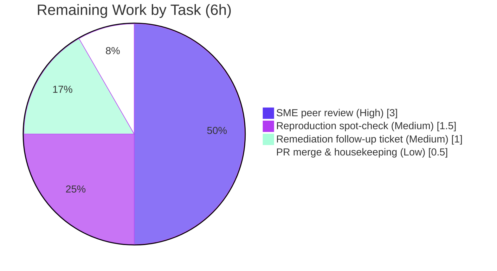

# Blitzy Project Guide — Paperless-ngx "Haunted Documents List" Root-Cause Analysis

> **Brand color legend:** Completed / AI Work = **Dark Blue `#5B39F3`** · Remaining / Not Completed = **White `#FFFFFF`** · Headings / Accents = Violet-Black `#B23AF2` · Highlight = Mint `#A8FDD9`.

---

## 1. Executive Summary

### 1.1 Project Overview

This project delivers a **runtime-grounded root-cause analysis** explaining why the Paperless-ngx documents list "feels haunted" during ordinary browsing — the same document appearing twice across neighbouring pages, or vanishing for a page and returning — while nobody edits data and the visible sort looks unchanged. Targeted at Paperless-ngx maintainers and backend engineers, the analysis proves, from live `/api/documents/` observation, that the root cause is a **non-unique `ORDER BY -created` with no tiebreaker under per-page `LIMIT/OFFSET`** (hypothesis H3). The scope is strictly **read-only**: a single Markdown artifact is produced, no source file is modified, and remediation is documented as a finding only. Business impact: a precise, evidence-backed defect explanation that de-risks a future fix.

### 1.2 Completion Status

The project is **90.3% complete** on an AAP-scoped, hours-based basis (PA1). All 21 substantive Agent Action Plan requirements are delivered and validated; the only remaining work is human peer review and merge of the documentation artifact (nothing ships to a runtime, so there is no deploy/integration/config work).


| Metric | Hours |
|--------|-------|
| **Total Project Hours** | **62** |
| Completed Hours (AI + Manual) | **56** (AI: 56 · Manual: 0) |
| Remaining Hours | **6** |
| **Percent Complete** | **90.3%** |

> Calculation: `Completion % = Completed / (Completed + Remaining) = 56 / (56 + 6) = 56 / 62 = 90.3%`.

### 1.3 Key Accomplishments

- ✅ **Single deliverable created at the exact mandated path** — `blitzy/documentation/paperless-ngx_542221a38dff.md` (779 lines), named after the source branch, verified by `git diff 542221a38 --name-status` showing exactly one added file.
- ✅ **All three named hypotheses answered by name with runtime evidence** — H1 (Partially yes — M2M JOIN fan-out collapsed by `SELECT DISTINCT` in-DB), H2 (No — DISTINCT precedes LIMIT), H3 (Yes — the root cause).
- ✅ **Non-admin / sharing-rules dimension reported honestly as a negative result** — admin and non-admin receive byte-for-byte identical responses (identical SHA-256); no object-level permissions exist at this commit.
- ✅ **Both list paths exercised** — the database queryset path and the Whoosh full-text path, each shown to carry the same tie-instability class.
- ✅ **Runtime-first method honored** — the code was built and run in the canonical Docker image (Python 3.9.23, Django 4.0.4, DRF 3.13.1, PostgreSQL 13, Whoosh 2.7.4) before any prose was written; every claim carries its command, unedited output, and a `file:line` citation (55 citations, 39 evidence blocks).
- ✅ **Read-only scope maintained** — zero source files modified; temporary scripts and seeded data removed; database restored to `count = 0`.
- ✅ **Production-readiness gates passed** — Final Validator confirmed 10 passed / 1 skipped tests on the analyzed paths, `manage.py check` clean, and the CI prettier gate green (independently re-verified: `exit=0`).

### 1.4 Critical Unresolved Issues

| Issue | Impact | Owner | ETA |
|-------|--------|-------|-----|
| Underlying pagination defect persists in production code (remediation is finding-only by AAP scope) | Product bug remains until fixed; **not a deliverable defect** — the analysis is complete | Paperless-ngx maintainers (via follow-up ticket HT-3) | Post-merge backlog |

> There are **no unresolved issues in the deliverable itself.** The single item above is the persistence of the *product* defect the analysis explains, which the Agent Action Plan explicitly places out of scope (remediation documented, not applied).

### 1.5 Access Issues

| System/Resource | Type of Access | Issue Description | Resolution Status | Owner |
|-----------------|----------------|-------------------|-------------------|-------|
| — | — | No access issues identified. Repository, canonical Docker image, PostgreSQL, and CI tooling were all accessible during autonomous validation. | N/A | — |

**No access issues identified.**

### 1.6 Recommended Next Steps

1. **[High]** Conduct SME technical peer review of the root-cause analysis (H3 reasoning, H1/H2 SQL claims, non-admin negative result) — **HT-1, 3h**.
2. **[Medium]** Independently spot-check the headline H3 and Whoosh reproductions in the canonical environment, accepting that snapshot-specific values vary per the document's caveats — **HT-2, 1.5h**.
3. **[Medium]** File the finding-only remediation (add `("-created", "pk")` tiebreaker / switch to `CursorPagination` / add an `id` key to the Whoosh sort map) as a tracked backlog ticket — **HT-3, 1h**.
4. **[Low]** Approve and merge the single-file PR and confirm the CI prettier gate stays green — **HT-4, 0.5h**.

---

## 2. Project Hours Breakdown

### 2.1 Completed Work Detail

All completed work was performed autonomously by Blitzy agents (Manual = 0h). Each component traces to a specific AAP requirement or method rule.

| Component | Hours | Description |
|-----------|-------|-------------|
| A. Canonical environment build & runtime setup | 5 | Built/ran the canonical Docker image (Python 3.9.23, PostgreSQL 13, Redis 6.0, Whoosh 2.7.4); migrations; verified versions against `requirements.txt`; throwaway admin/viewer users |
| B. Read-only scope discovery & codebase comprehension | 7 | Read 14 backend/frontend files; reconstructed the `/api/documents/` request flow; identified the defect surface (ordering, pagination, distinct, filters, Whoosh) |
| C. Observation harness (throwaway scripts) | 4 | Wrote tie-seeding, per-page ID capture, `EXPLAIN`/SQL, SHA-256, and Whoosh re-index probe scripts (all under `/tmp`, later deleted) |
| D. H1 reproduction & analysis | 3 | M2M JOIN fan-out (24 rows) → `Document.objects.distinct()` collapse (12) proven in-DB; endpoint shows 0 duplicate ids |
| E. H2 reproduction & analysis | 2 | Captured emitted SQL (`str(qs.query)` + live `CaptureQueriesContext`): `SELECT DISTINCT … ORDER BY created DESC LIMIT/OFFSET` — DISTINCT precedes LIMIT |
| F. H3 reproduction & root-cause analysis | 8 | `EXPLAIN ANALYZE` across plans; `enable_hashagg` toggle; per-page plan-flip "smoking gun"; repeated runs reporting the duplicate/skip distribution |
| G. Control condition (`ordering=id`) | 1.5 | Unique-key paging stable across 3 runs, per-page Sort Key leads with `id` — isolates tie-specificity |
| H. Non-admin dimension | 2.5 | Admin vs viewer byte-identical (SHA-256) on DB + Whoosh paths; confirmed no owner field / no guardian; only `SavedView` user-scoped |
| I. Whoosh full-text path | 4 | Relevance scores tie at 1.0; `ordering=id` silently ignored; one re-index reproduced neighbouring-page duplicate + disappear/comeback |
| J. Backend ↔ UI correlation | 2 | Correlated constant `count`/shuffling rows with the Angular list model that never de-duplicates across pages (read-only citation) |
| K. Web research (anti-pattern validation) | 1.5 | Django ticket #34251, DRF discussions on non-unique ORDER BY pagination instability and cursor pagination remediation |
| L. Authoring deliverable + coverage pass | 7 | Wrote the 779-line evidence-embedded analysis, verdict table, and §12 coverage matrix |
| M. Code-review remediation | 2 | Addressed code-review findings (commit `adbd279dc`) |
| N. Reproducibility caveats (QA #1, LOW) | 1.5 | Added caveats separating invariant verdicts/mechanism from snapshot-specific values (commit `f9cabe46d`) |
| O. CI prettier gate fix | 1 | Applied canonical prettier formatting so the only tracked `.md` passes the frontend CI gate (commit `23dada6d7`) |
| P. Final validation & cleanup | 4 | Re-reproduced every hypothesis, audited 30+ citations, restored DB (`count=0`), removed temp scripts, confirmed pristine tree |
| **Total Completed** | **56** | **Matches Completed Hours in Section 1.2** |

### 2.2 Remaining Work Detail

Each remaining item is path-to-production for a documentation artifact (review + handoff + merge). No code fixes are required — the deliverable is fully validated.

| Category | Hours | Priority |
|----------|-------|----------|
| SME technical peer review & sign-off (HT-1) | 3 | High |
| Independent reproduction spot-check in canonical env (HT-2) | 1.5 | Medium |
| File remediation as a tracked follow-up ticket (HT-3, handoff only) | 1 | Medium |
| PR merge & documentation housekeeping (HT-4) | 0.5 | Low |
| **Total Remaining** | **6** | **Matches Remaining Hours in Section 1.2 and Section 7** |

### 2.3 Hours Reconciliation Summary

| Check | Value | Status |
|-------|-------|--------|
| Section 2.1 total (Completed) | 56h | ✅ |
| Section 2.2 total (Remaining) | 6h | ✅ |
| 2.1 + 2.2 = Total Project Hours (Section 1.2) | 56 + 6 = 62h | ✅ |
| Remaining consistent across §1.2 ↔ §2.2 ↔ §7 | 6h everywhere | ✅ |
| Completion % (§1.2 = §7 = §8) | 56 / 62 = 90.3% | ✅ |

---

## 3. Test Results

The task is **read-only documentation**, so the primary correctness gate is **runtime reproduction** (Section 4). As a supplementary check, Blitzy's autonomous validation executed the upstream backend test suite scoped to the exact analyzed code paths, run serially (`-n 0`) as a non-root user. **All tests below originate from Blitzy's autonomous validation logs for this project.**

| Test Category | Framework | Total Tests | Passed | Failed | Coverage % | Notes |
|---------------|-----------|-------------|--------|--------|------------|-------|
| Document filtering (H1 — M2M fan-out) | pytest (Django) | 2 | 2 | 0 | Not measured¹ | `test_document_filters`, `test_documents_title_content_filter` |
| Full-text search & pagination (H3 — Whoosh path) | pytest (Django) | 8 | 7 | 0 | Not measured¹ | 7 passed; 1 skipped² — `test_search_multi_page`, `test_search_invalid_page`, `test_search_autocomplete`, `test_search_more_like`, `test_search_filtering`, `test_search_sorting`, `test_search` |
| Whoosh index / autocomplete | pytest (Django) | 1 | 1 | 0 | Not measured¹ | `test_auto_complete` |
| **TOTAL** | **pytest (Django)** | **11** | **10** | **0** | **Not measured¹** | **10 passed · 1 skipped · 0 failed** |

¹ Coverage was intentionally not measured (`--no-cov`); for a read-only investigation the meaningful gate is live runtime reproduction, not line coverage.
² The 1 skip is `test_search_spelling_correction` — a **pre-existing upstream placeholder** ("Not implemented yet"), unrelated to this work.

> **Environmental note (from validation logs):** the project's `setup.cfg` `--numprocesses auto` causes pytest-xdist worker crashes in the validation container; running serially (`-n 0`) executes cleanly. This is an environment quirk, not a product or deliverable defect.

---

## 4. Runtime Validation & UI Verification

Every headline claim was reproduced through the **real** `/api/documents/` endpoint (`UnifiedSearchViewSet`) in the canonical image. Status legend: ✅ Operational · ⚠ Partial · ❌ Failing.

**Backend runtime (database path):**
- ✅ **H1 — Backend duplicates:** M2M inbox/tag filter JOIN fanned out 24 rows → `Document.objects.distinct()` collapsed to 12 **in the database**; the endpoint body contained **no** duplicate ids (`has_duplicates=False`).
- ✅ **H2 — Pagination before de-dup:** captured SQL (both `str(qs.query)` and a live `CaptureQueriesContext`) = `SELECT DISTINCT <cols> … ORDER BY created DESC LIMIT 3 OFFSET 3` — DISTINCT precedes LIMIT.
- ✅ **H3 — Unstable ordering on ties (ROOT CAUSE):** with tied `created`, forcing `enable_hashagg=off` gave an id-total order while `on` scrambled it; a forward page walk duplicated boundary documents and skipped others with `count` constant throughout. The per-page plan flip (Sort+Unique vs HashAggregate) is the smoking gun.
- ✅ **Control (`ordering=id`):** stable pages across 3 repeated runs; every page's Sort Key leads with unique `id` — confirms the instability is tie-specific.

**Backend runtime (Whoosh full-text path):**
- ✅ **H3 twin:** all relevance scores tie at 1.0; `sort_fields_map` has no `id` key so `?ordering=id` is silently ignored; a single ordinary re-index produced a neighbouring-page duplicate plus a disappear/comeback — deterministically.

**Authorization dimension:**
- ✅ **Non-admin negative result:** admin and viewer responses are byte-for-byte identical (identical full-body SHA-256) on both DB and Whoosh paths; no `owner` field, no `django-guardian`; only `SavedView` is user-scoped. The instability is viewer-independent.

**System health:**
- ✅ `manage.py check` → "System check identified no issues (0 silenced)".
- ✅ Migrations applied cleanly; canonical PostgreSQL engine confirmed in use.

**UI verification:**
- ⚠ **Frontend not built (by design/scope):** the Angular ~13.3.4 SPA was **not** compiled — Angular 13 build tooling is incompatible with the host Node 22, and the AAP scopes the frontend as a **read-only citation** target. The four frontend files are cited by `file:line` to establish the UI pagination model (each page fetched independently; `collectionSize = count`; no cross-page de-duplication), which correlates with the observed backend behavior. This is appropriate for a read-only investigation and is not a gap in the deliverable.

---

## 5. Compliance & Quality Review

AAP deliverables and method rules cross-mapped to quality benchmarks. Progress: 🟪 Complete (`#5B39F3`) · ⬜ Outstanding (`#FFFFFF`).

| Benchmark / AAP Requirement | Status | Progress | Evidence |
|------------------------------|--------|----------|----------|
| Deliverable at exact mandated path & name | Pass | 🟪 | `git diff` shows `A blitzy/documentation/paperless-ngx_542221a38dff.md` |
| H1 answered by name (Partially yes) | Pass | 🟪 | §4 + verdict table + §12 coverage |
| H2 answered by name (No) | Pass | 🟪 | §5 SQL capture |
| H3 answered by name (Yes — root cause) | Pass | 🟪 | §6.1–6.3 with `EXPLAIN ANALYZE` |
| Control condition (`ordering=id`) | Pass | 🟪 | §7 (3 stable runs) |
| Non-admin / sharing dimension (honest negative) | Pass | 🟪 | §8 (identical SHA-256) |
| Whoosh full-text path exercised | Pass | 🟪 | §9 (re-index reshuffle) |
| Backend ↔ UI correlation | Pass | 🟪 | §10 |
| Runtime-first (build & run before writing) | Pass | 🟪 | §3 commands + embedded output |
| Reproduce run-to-run (same input, no stabilizing) | Pass | 🟪 | §6.1 ×3, §9 ×3 walks — distribution reported |
| Real entry point `GET /api/documents/` | Pass | 🟪 | §3 curl via `UnifiedSearchViewSet` |
| Canonical config + exact commands | Pass | 🟪 | §3 versions + invocation |
| Unedited output + command + `file:line` per claim | Pass | 🟪 | 39 evidence blocks, 55 citations |
| Inferred statements labelled | Pass | 🟪 | 3 "(inferred)" labels |
| Coverage pass | Pass | 🟪 | §12 matrix |
| Lead with direct answer, then nuance | Pass | 🟪 | §2 TL;DR precedes detail |
| Read-only: no source file modified | Pass | 🟪 | `git numstat` = 1 file, +779 / −0 |
| No code added except the answer doc | Pass | 🟪 | `git diff` shows only the `.md` |
| Temp scripts removed; DB/repo restored | Pass | 🟪 | §13 cleanup note; `DOC_COUNT=0` |
| Remediation documented as finding only | Pass | 🟪 | §11 (not applied) |
| CI prettier gate (frontend `**/*.md`) | Pass | 🟪 | `prettier@2.6.2 --check` → `exit=0` (independently re-verified) |
| Human peer review & merge | Outstanding | ⬜ | Path-to-production (HT-1…HT-4) |

**Fixes applied during autonomous validation:** the deliverable initially failed the frontend CI prettier gate (it is the only tracked `.md` matched by `**/*.md`); `prettier --write` was applied (prose-only normalization) and committed (`23dada6d7`), preserving all fenced evidence and citations byte-for-byte.

---

## 6. Risk Assessment

| Risk | Category | Severity | Probability | Mitigation | Status |
|------|----------|----------|-------------|------------|--------|
| Snapshot-specific values (IDs, digests, which docs dup/skip) vary across re-seeds/query plans and could make a reviewer doubt the analysis | Technical | Low | Medium | §12 note + commit `f9cabe46d` separate invariant verdicts/mechanism from illustrative values | Mitigated |
| Reproduction requires the exact canonical env (PostgreSQL 13, Python 3.9, Whoosh 2.7.4); other backends may differ | Technical | Low | Low | Doc states exact image, versions, and commands (§3) | Mitigated |
| Underlying pagination defect persists in production code (remediation is finding-only) | Technical / Product | Medium | High | §11 documents minimal fixes; handed off as ticket HT-3 + Next Steps | Open (by design — out of scope) |
| No new attack surface; pre-existing "all authenticated users see all documents" disclosed as a finding | Security | Informational | N/A | Property of commit `542221a38`, not introduced; documented in §8 | Documented |
| Deliverable embeds throwaway local Basic-auth creds (`admin` / `viewer`) | Security | Low | Low | Well-known throwaway users of the local investigation image; not production secrets | Acceptable |
| Analysis pinned to commit `542221a38`; later releases added object-level permissions, so the non-admin result is commit-specific | Operational | Low | Medium | Doc pins commit + versions; AAP compatibility constraint noted | Mitigated |
| Doc-only deliverable has zero runtime/deploy footprint | Operational | Informational | N/A | No monitoring/rollback needed — positive posture | N/A (positive) |
| Deliverable is the only tracked `.md` checked by the frontend CI prettier gate; initially failed | Integration | Low | Low | `prettier --write` applied & committed (`23dada6d7`); re-verified `exit=0` | Resolved |
| Frontend (Angular 13) not built (host Node 22 incompatible); frontend claims are inferred-from-reading | Integration | Low | N/A | AAP scopes frontend as read-only citation; backend paths are runtime-exercised | By design/scope |

**Overall risk posture: LOW.** A read-only documentation deliverable introduces essentially no technical, security, operational, or integration risk. The single material item is the persistence of the *product* defect the analysis explains — explicitly out of scope and handed off as remaining work.

---

## 7. Visual Project Status

**Project hours breakdown** (Completed = Dark Blue `#5B39F3`, Remaining = White `#FFFFFF`):


**Remaining hours by category** (sums to 6h — consistent with Section 2.2 and Section 1.2):



| Priority | Remaining Hours | Share |
|----------|-----------------|-------|
| High | 3.0 | 50% |
| Medium | 2.5 | 42% |
| Low | 0.5 | 8% |
| **Total** | **6.0** | **100%** |

---

## 8. Summary & Recommendations

**Achievements.** The project is **90.3% complete** (56 of 62 AAP-scoped hours). Blitzy autonomously produced a rigorous, runtime-grounded root-cause analysis that answers all three named hypotheses by name — **H1** (Partially yes: duplicates are produced by an M2M JOIN and collapsed by `SELECT DISTINCT` *in the database*, not later), **H2** (No: DISTINCT precedes the `LIMIT` slice), and **H3** (Yes: the root cause is a non-unique `ORDER BY -created` with no tiebreaker under per-page `LIMIT/OFFSET`) — plus an honest negative result on the non-admin/sharing dimension and full coverage of the Whoosh full-text path. Every claim is backed by an exact command, its unedited output, and a `file:line` citation.

**Remaining gaps.** Only path-to-production work remains (6h): human SME review, an independent reproduction spot-check, filing the finding-only remediation as a backlog ticket, and merging the single-file PR. There are **no deliverable defects, no failing tests, and no unresolved errors.**

**Critical path to production.** Peer review (HT-1) → reproduction spot-check (HT-2) → merge (HT-4), with the remediation ticket (HT-3) filed in parallel. Because nothing ships to a runtime, the path is short and low-risk.

**Success metrics.** ✅ Exactly one file added, zero source files modified (read-only honored); ✅ all named items answered with evidence; ✅ 10 passed / 1 skipped tests on analyzed paths; ✅ `manage.py check` clean; ✅ CI prettier gate green; ✅ repository/database restored to a pristine state.

**Production-readiness assessment.** The deliverable is **production-ready** as a documentation artifact: complete, accurate, self-contained, reproducible (with documented caveats), and CI-compliant. It is recommended for merge following SME sign-off. The underlying product defect it identifies should be scheduled separately via the finding-only remediation.

---

## 9. Development Guide

This guide covers (a) verifying the deliverable and repository state, and (b) reproducing the full investigation in the canonical environment. All commands were tested during assessment.

### 9.1 System Prerequisites

- **Docker** 28.x (verified: `Docker version 28.5.2`) — the canonical investigation image runs Docker-in-Docker.
- **git** 2.x (verified: `git version 2.51.0`).
- **Node.js** & **npm** for the CI prettier gate only (verified: Node `v22.23.1`, npm `11.1.0`).
- **Canonical reproduction runtime** (baked into the image, not installed by hand): Python **3.9.23**, PostgreSQL **13**, Redis **6.0**, Whoosh **2.7.4**, Django **4.0.4**, DRF **3.13.1**, django-filter **21.1**, psycopg2 **2.9.3**.

### 9.2 Environment Setup (canonical reproduction)

The system runs in its default configuration inside the provided image with three Docker-in-Docker containers on network `paperless-net`: `paperless-app` (application, publishes `:8000`), `paperless-db` (`postgres:13`), and `paperless-broker` (`redis:6.0`). PostgreSQL is the backend on which the tie-ordering non-determinism manifests. No `.env` editing is required for the default run.

### 9.3 Dependency Installation

```bash
# No dependencies are installed by hand — this is a read-only task and all
# backend dependencies are pre-baked into the canonical image. Verify them:
docker exec paperless-app python3 -c 'import django, rest_framework, django_filters, whoosh, psycopg2; \
  print("Django", django.get_version()); print("DRF", rest_framework.VERSION); \
  print("django-filter", django_filters.__version__)'
# Expected: Django 4.0.4 / DRF 3.13.1 / django-filter 21.1
```

### 9.4 Application Startup

```bash
# Apply migrations and start the real API entry point (canonical invocation):
docker exec paperless-app bash -lc 'cd /app/src && python3 manage.py migrate && \
  python3 manage.py runserver 0.0.0.0:8000 --noreload --insecure'

# Confirm migrations are current:
docker exec paperless-app bash -lc 'cd /app/src && python3 manage.py migrate --check'
# Expected: "No migrations to apply."
```

### 9.5 Verification Steps

```bash
# 1) Verify read-only compliance — exactly one added file, zero source changes:
git diff 542221a38 --name-status
# Expected: A  blitzy/documentation/paperless-ngx_542221a38dff.md

# 2) Verify the deliverable is present (779 lines):
test -f blitzy/documentation/paperless-ngx_542221a38dff.md && \
  wc -l blitzy/documentation/paperless-ngx_542221a38dff.md

# 3) Verify the CI prettier gate stays green (the only gate the .md must pass):
npx --yes prettier@2.6.2 --check "blitzy/documentation/paperless-ngx_542221a38dff.md"
# Expected: "All matched files use Prettier code style!" (exit=0)

# 4) System check on the analyzed backend:
docker exec paperless-app bash -lc 'cd /app/src && python3 manage.py check'
# Expected: "System check identified no issues (0 silenced)."
```

### 9.6 Example Usage (reproducing the "haunting")

```bash
# Exercise the real endpoint (constant count):
curl -s -u admin:admin123 "http://localhost:8000/api/documents/?page_size=1" \
  | python3 -c "import sys,json;print('count=',json.load(sys.stdin)['count'])"

# H3 database-path page walk — page_size=3 puts a boundary inside the tied block:
for run in 1 2 3; do echo -n "run$run: "; \
  for p in 1 2 3 4; do \
    curl -s -u admin:admin123 "http://localhost:8000/api/documents/?is_in_inbox=true&page=$p&page_size=3&fields=id" \
    | python3 -c "import sys,json;print([r['id'] for r in json.load(sys.stdin)['results']],end=' ')"; \
  done; echo; done

# Control (stable) — unique key:
curl -s -u admin:admin123 "http://localhost:8000/api/documents/?ordering=id&page=1&page_size=3&fields=id"

# Whoosh full-text path:
curl -s -u admin:admin123 "http://localhost:8000/api/documents/?query=haunted&page=1&page_size=3&fields=id"

# Non-admin equivalence (compare against admin — expect identical ids):
curl -s -u viewer:viewer123 "http://localhost:8000/api/documents/?page=1&page_size=3&fields=id"
```

### 9.7 Troubleshooting

- **pytest xdist worker crashes** — the project `setup.cfg` sets `--numprocesses auto`; run serially instead: `python3 -m pytest … -n 0 --no-cov`.
- **prettier gate fails after editing the `.md`** — re-normalize: `npx prettier@2.6.2 --write --config .prettierrc "blitzy/documentation/paperless-ngx_542221a38dff.md"`, preserving fenced evidence verbatim.
- **DB-path instability won't reproduce** — you are likely on SQLite; use the canonical **PostgreSQL** backend, and ensure `created` timestamps actually tie and a page boundary falls inside the tied block (`page_size=3`).
- **Frontend won't build** — Angular ~13.3.4 tooling is incompatible with Node 22; the frontend is out of scope for this read-only investigation and is cited by `file:line` only.

---

## 10. Appendices

### Appendix A — Command Reference

| Purpose | Command |
|---------|---------|
| Read-only compliance check | `git diff 542221a38 --name-status` |
| Commit/authorship review | `git log --format="%h %an <%ae> %s" 542221a38..HEAD` |
| Deliverable line count | `wc -l blitzy/documentation/paperless-ngx_542221a38dff.md` |
| CI prettier gate | `npx prettier@2.6.2 --check "blitzy/documentation/paperless-ngx_542221a38dff.md"` |
| prettier auto-fix | `npx prettier@2.6.2 --write --config .prettierrc "<file>.md"` |
| Migrate & serve | `docker exec paperless-app bash -lc 'cd /app/src && python3 manage.py migrate && python3 manage.py runserver 0.0.0.0:8000 --noreload --insecure'` |
| System check | `docker exec paperless-app bash -lc 'cd /app/src && python3 manage.py check'` |
| Scoped test run (serial) | `docker exec -u testuser paperless-app bash -lc 'cd /app/src && python3 -m pytest documents/tests/test_api.py documents/tests/test_index.py -k "search or filter or sort or order" -n 0 --no-cov'` |
| Exercise endpoint | `curl -s -u admin:admin123 "http://localhost:8000/api/documents/?page=N&page_size=3&fields=id"` |

### Appendix B — Port Reference

| Port | Service | Notes |
|------|---------|-------|
| 8000 | Paperless-ngx application (`runserver`) | Published by `paperless-app`; the real API entry point |
| 5432 | PostgreSQL (`paperless-db`, `postgres:13`) | Canonical backend where tie-ordering non-determinism manifests |
| 6379 | Redis (`paperless-broker`, `redis:6.0`) | `django-q` task broker (contextual) |

### Appendix C — Key File Locations

| Path | Role |
|------|------|
| `blitzy/documentation/paperless-ngx_542221a38dff.md` | **The deliverable** (only file added) |
| `src/documents/models.py` | `created` field (non-unique, line 152); `Meta.ordering = ("-created",)` (207–208) |
| `src/documents/views.py` | `DocumentViewSet.get_queryset → Document.objects.distinct()` (198–199); `ordering_fields` (187–196); `UnifiedSearchViewSet` (377–426) |
| `src/paperless/views.py` | `StandardPagination` — `page_size=25`, `LIMIT/OFFSET` model (8–11) |
| `src/documents/filters.py` | `DocumentFilterSet` M2M fan-out filters (41–117) |
| `src/documents/index.py` | Whoosh `DelayedQuery` sort/paging; `sort_fields_map` has no `id` key (171–179) |
| `src/paperless/urls.py` | `documents` route → `UnifiedSearchViewSet` (32) |
| `.github/workflows/reusable-ci-frontend.yml` | CI prettier gate over `**/*.md` (25) |

### Appendix D — Technology Versions

| Component | Version | Source |
|-----------|---------|--------|
| Python | 3.9.23 (canonical) / 3.13.7 (host) | `Dockerfile:18` `FROM python:3.9-slim-bullseye` |
| Django | 4.0.4 | `requirements.txt` |
| Django REST Framework | 3.13.1 | `requirements.txt` |
| django-filter | 21.1 | `requirements.txt` |
| Whoosh | 2.7.4 | `requirements.txt` |
| psycopg2 | 2.9.3 | `requirements.txt` |
| PostgreSQL | 13 | `paperless-db` container |
| Redis | 6.0 | `paperless-broker` container |
| Angular | ~13.3.4 (not built) | `src-ui/package.json` |
| Docker | 28.5.2 | host |
| prettier | 2.6.2 | CI gate |

### Appendix E — Environment Variable Reference

| Variable | Role in this investigation |
|----------|----------------------------|
| `PAPERLESS_DBHOST` | Presence switches the backend to PostgreSQL (`src/paperless/settings.py:304–318`); required for the DB-path tie-instability to manifest |
| `CI` | Set `true` for non-interactive Node/npm tooling when running the prettier gate |

> No environment variables are added or changed by this project; the table documents only variables relevant to reproducing the canonical run.

### Appendix F — Developer Tools Guide

- **git** — verify read-only compliance and authorship (`git diff 542221a38 --name-status`, `git log … 542221a38..HEAD`).
- **prettier 2.6.2** — the CI markdown gate; run `--check` before merge and `--write` after any `.md` edit.
- **pytest (Django)** — supplementary backend tests; use `-n 0` to avoid xdist worker crashes in-container.
- **Django `manage.py`** — `migrate`, `migrate --check`, `check`, `runserver … --noreload --insecure`, and `shell -c` for `EXPLAIN`/SQL probes.
- **curl + python3 `json.tool`** — drive the real endpoint and parse `count`/`results` per page.

### Appendix G — Glossary

| Term | Meaning |
|------|---------|
| **H1 / H2 / H3** | The three user hypotheses: backend duplicates collapsed later / pagination before de-dup / unstable ordering on ties |
| **Tie / non-total order** | Multiple rows share the primary sort key (`created`); with no unique tiebreaker their relative order is unspecified |
| **`LIMIT/OFFSET`** | Per-page SQL slice; each page is an independent evaluation of the (non-total) order |
| **`SELECT DISTINCT`** | Full-row de-duplication emitted by `Document.objects.distinct()`; on the simplest plan it accidentally folds unique `id` into the sort |
| **HashAggregate plan** | An alternate PostgreSQL plan that de-duplicates without keeping `id` in the sort — removing the accidental stability rescue |
| **Whoosh** | The on-disk full-text index; equal relevance scores tie with no `id` tiebreaker in `sort_fields_map` |
| **Finding-only** | A remediation documented but deliberately **not** applied, per the read-only scope |
| **Canonical configuration** | The default build/run environment (Python 3.9 + PostgreSQL) in which reported values were observed |