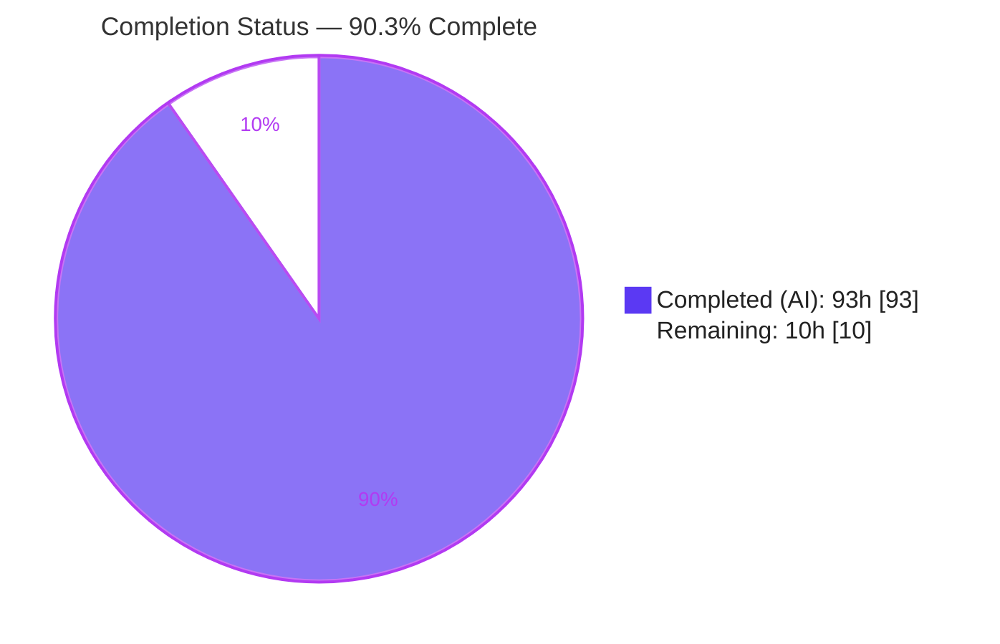
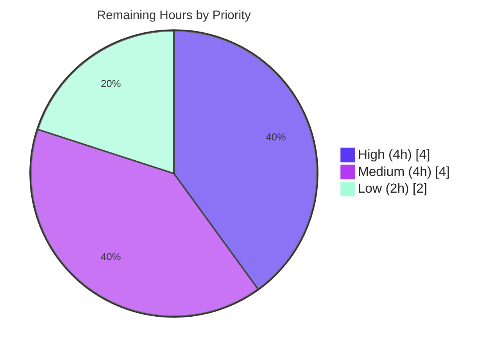

# Blitzy Project Guide — paperless-ngx Memory-Usage Investigation

> **Deliverable under review:** `blitzy/documentation/paperless-ngx_542221a38dff.md` (5,798 lines / 37,411 words / 326,258 bytes)
> **Branch:** `blitzy-71a40705-ed55-484c-8d1a-93501ddc4f09` · **HEAD:** `cbf20c8e2` · **Base:** `542221a38`
> **Task type:** Read-only performance/diagnostic investigation (documentation-only deliverable)

---

## 1. Executive Summary

### 1.1 Project Overview

This project is a **read-only memory-usage investigation** of the paperless-ngx document-ingestion pipeline (Django 4.0 backend). The objective was to empirically diagnose why importing mostly-small text documents intermittently consumes disproportionate memory that is not promptly released to the OS. The audience is the paperless-ngx maintainers and the requesting engineering team. The sole deliverable is one evidence-backed Markdown report answering five objectives (root cause, unnecessary copies/reference lifetime, cache accumulation, spike differentiators, and type/batch scaling). All measurements were captured at runtime inside the canonical Python 3.9 Docker container using a transient RSS + `tracemalloc` + `gc` harness. No source code was modified — the task is diagnosis only, with remediation explicitly out of scope.

### 1.2 Completion Status



| Metric | Value |
|---|---|
| **Total Hours** | **103** |
| **Completed Hours (AI + Manual)** | **93** (93 AI + 0 Manual) |
| **Remaining Hours** | **10** |
| **Percent Complete** | **90.3%** |

> Completion is computed on AAP-scoped work only (PA1): `93 ÷ (93 + 10) = 90.3%`. All 25 AAP-scoped requirements are fully delivered; the remaining 10 hours are human-side path-to-production activities (review, reproduction, sign-off) for a diagnostic deliverable. Remediation of the reported behavior is explicitly out of AAP scope (§0.5.2) and is therefore excluded from the hour universe.

### 1.3 Key Accomplishments

- ✅ **Delivered the single required artifact** — `blitzy/documentation/paperless-ngx_542221a38dff.md` (5,798 lines), the only file added to the repository.
- ✅ **Answered all five investigation objectives (OBJ-1 … OBJ-5)** with a direct answer (§1) and per-objective findings (§4), each cross-referenced to captured evidence.
- ✅ **Identified the root cause of the "disproportionate" spike** — deserialization of the trained classifier (`load_classifier()` → `DocumentClassifier.load()`, `classifier.py:30`, `:76-94`) adds ~`+52 MiB` (≈81% of a small-file consume), a fixed, document-independent, native (scikit-learn/NumPy) cost.
- ✅ **Refuted the "unnecessary copies" hypothesis for small documents** — proved `matching.py:63` is an alias, not a copy (identity `True`, refcount `+1`); the only genuine extra copies are size-proportional, transient whole-file reads.
- ✅ **Established the "not released to OS" symptom as normal glibc/CPython arena retention**, not a Python reference leak — `gc.garbage == 0`, `malloc_trim(0)` reclaims arena pages, and RSS plateaus across identical iterations.
- ✅ **Exercised the full ingestion surface** — all three canonical entry points (direct consume, REST upload via real gunicorn, email scheduled task), the importer/exporter, and the metadata REST endpoint, plus error/edge paths (32 conditions in the §8 coverage pass).
- ✅ **Built a reproducible measurement harness** — 30 scripts published in §10 with SHA-256 hashes; validated **30/30 SHA-256 match** and **30/30 compile-clean** on Python 3.9.
- ✅ **Honored the read-only mandate byte-for-byte** — zero source files modified; all temporary scripts removed; `git status` clean; diff versus base is exactly one file added.
- ✅ **Documented web research** (§11) on `tracemalloc` limitations and glibc `malloc` arena retention to correctly interpret the "not released" symptom.

### 1.4 Critical Unresolved Issues

**No unresolved issues block release or validation of the deliverable.** The Final Validator classified the deliverable PRODUCTION-READY across all five gates with zero unresolved errors. The single investigative concern raised during validation (run-to-run RSS peak variance) was resolved as **not a defect** — it is disclosed in the report and the conclusions are anchored on stable metrics.

The items below are **informational, non-blocking observations** that the investigation deliberately disclosed. They are **out of scope for remediation** per AAP §0.5.2 and are recorded here only for downstream awareness (see §6 Risk Assessment).

| Issue | Impact | Owner | ETA |
|---|---|---|---|
| Disclosed non-memory resource leaks on error paths (metadata-endpoint empty tempdir per parse; late-write orphan Whoosh entry; broker-down/corrupt-upload orphan scratch file) | Informational / non-blocking — pre-existing product behavior, remediation out of scope | Maintainers (follow-up) | Backlog (post-acceptance triage) |
| Inherited pinned-stack CVEs (Django 4.0.4, Pillow 9.1.0, pdfminer.six 20220319) | Informational / non-blocking — platform technical debt, not introduced by this task; no bearing on memory findings | Platform / security | Backlog (tech-debt tracking) |

### 1.5 Access Issues

**No access issues identified.** Blitzy's autonomous validation had full access to the repository, the canonical container (`paperless_app`), and the Redis broker (`paperless-broker`); the real ingestion pipeline imported and executed successfully.

| System / Resource | Type of Access | Issue Description | Resolution Status | Owner |
|---|---|---|---|---|
| Source repository | Read/Write (branch `blitzy-71a40705-…`) | None | ✅ Resolved / no issue | Blitzy |
| Canonical container `paperless_app` (Python 3.9) | Runtime exec | None — pipeline imports & runs | ✅ Resolved / no issue | Blitzy |
| Redis broker `paperless-broker` | Network (`paperless-net`) | None — reachable (ping `True`) | ✅ Resolved / no issue | Blitzy |

> **Reproduction prerequisite (not an access issue):** the base image is **not self-sufficient** for the ingestion pipeline — it lacks the `zbar` shared library and the `pdftoppm`/`pngquant`/`gettext`/`curl` binaries. A human reproducer must apply the documented preparation (five apt packages + `migrate` + runtime dirs). This is fully documented in the deliverable's §2 and §9.0 and reproduced in Section 9 below.

### 1.6 Recommended Next Steps

1. **[High]** Have a senior engineer / stakeholder **review and accept** the investigation report — the direct answer (§1), findings by objective (§4), the 21-row components table (§5), and the honest limitations (§12).
2. **[Medium]** **Stand up the canonical Python 3.9 container** with the documented preparation (five apt packages, `migrate`, runtime dirs, Redis broker) per Section 9.
3. **[Medium]** **Independently reproduce the headline measurements** by running a subset of the §10 harness drivers and confirming the documented values (`load_classifier ≈ +52 MiB`; `recycle:1` → distinct worker PIDs; `malloc_trim` reclaim; flat 20-document batch).
4. **[Low]** **Triage and scope** the disclosed out-of-scope items (non-memory resource leaks) and **log tracking tickets** for the inherited pinned-stack CVEs — decision and ticketing only; do not implement under this read-only task.

---

## 2. Project Hours Breakdown

### 2.1 Completed Work Detail

All hours below were completed autonomously by Blitzy agents (AI). Each component traces to specific AAP requirements and to sections of the deliverable.

| Component | Hours | Description |
|---|---|---|
| Canonical environment provisioning & baseline | 6 | Diagnosed that the base image cannot run the pipeline; installed five apt packages (`libzbar0`, `poppler-utils`, `pngquant`, `gettext`, `curl`); ran Django `migrate` (SQLite); created runtime dirs; built the derived image; verified pipeline import across base/derived/running states (§2, §9.0). |
| Measurement harness engineering (30 scripts) | 22 | Built the transient harness published in §10: `memlib.py` (RSS from `/proc`, 3 ms `PeakSampler`, `ChildPeakSampler`, `tracemalloc`, `gc`, `malloc_trim` via `ctypes`), `hbootstrap.py` (isolated `DATA_DIR` + migrate per run), and 28 canonical-entry-point drivers. |
| Conditions-matrix execution & evidence capture | 16 | Ran the type × batch × entry-point × differentiator matrix with ≥2× repetition; captured ~90 command+output blocks across the §9 evidence subsections (§9.0–§9.25); performed child-process accounting and cold-vs-warm separation. |
| OBJ-1 … OBJ-5 findings analysis & synthesis | 16 | Native-vs-Python attribution, classifier decomposition, alias-vs-copy proof, differentiator and scaling analysis; authored §1 (direct answer), §4 (per-objective findings), §5 (21-row components table), §7 (hypothesis). |
| Coverage, normal-vs-problem & limitations analysis | 8 | `malloc_trim`/`gc.garbage`/cross-iteration discriminator (§6); the 32-condition coverage pass including error/edge paths (§8); eight honest limitations (§12). |
| Web research & symptom interpretation | 3 | Researched `tracemalloc` native-blindness, glibc arena retention, and diagnostics (`MALLOC_ARENA_MAX`, `malloc_trim`), documented in §11. |
| QA refinement cycles (~29 findings) | 14 | Six documentation commits resolving a major 18-finding revision, model-provenance/reproducibility, source-line citation corrections, the F5 metadata-tempdir disclosure, and 11 additional QA findings. |
| Final autonomous validation (5 gates) | 8 | Extracted and SHA-256-verified 30/30 harness scripts, compiled 30/30 on Python 3.9, reproduced all five objectives ≥2×, verified environment/runtime, and confirmed a clean read-only repo. |
| **Total Completed** | **93** | |

### 2.2 Remaining Work Detail

All remaining work is human-side path-to-production for a diagnostic deliverable. No autonomous (AAP-scoped) work remains.

| Category | Hours | Priority |
|---|---|---|
| Senior-engineer / stakeholder review & acceptance of the report | 4 | High |
| Canonical container stand-up & runtime preparation | 1.5 | Medium |
| Independent reproduction of headline measurements | 2.5 | Medium |
| Next-steps triage / scoping of disclosed out-of-scope items + CVE tech-debt ticketing (decision only) | 2 | Low |
| **Total Remaining** | **10** | |

### 2.3 Hours Reconciliation & Basis of Estimate

| Quantity | Hours | Cross-check |
|---|---|---|
| Section 2.1 — Completed | 93 | = Completed Hours in §1.2 ✔ |
| Section 2.2 — Remaining | 10 | = Remaining Hours in §1.2 = §7 "Remaining Work" ✔ |
| **2.1 + 2.2 = Total** | **103** | = Total Hours in §1.2 ✔ |
| Completion % | 90.3% | `93 ÷ 103 = 90.29%` ✔ |

**Basis of estimate / confidence:** *High.* The deliverable is well-defined, was validated PRODUCTION-READY, honored read-only scope byte-for-byte, and every headline measurement reproduced ≥2×. Completed hours reflect a rigorous senior-performance-engineer investigation (~2.3 person-weeks) and are deliberately conservative. Remaining hours cover only human acceptance activities; they contain no remediation (out of scope).

---

## 3. Test Results

For a read-only diagnostic, the "tests" are Blitzy's **autonomous reproduction and integrity checks** — the run-first evidence that the harness is authentic, compiles in the canonical runtime, and that every headline measurement reproduces. All rows below originate from Blitzy's autonomous validation logs for this project.

| Test Category | Framework | Total Tests | Passed | Failed | Coverage % | Notes |
|---|---|---|---|---|---|---|
| Harness Integrity (SHA-256) | `sha256sum` (host + container) | 30 | 30 | 0 | 100% | 30/30 embedded §10 scripts match their published hashes |
| Harness Compilation | CPython 3.9 `compile()` | 30 | 30 | 0 | 100% | 30/30 compile clean under the canonical interpreter |
| Objective Reproduction | `memlib` harness (RSS + `tracemalloc` + `gc`) | 5 | 5 | 0 | 100% | OBJ-1…OBJ-5 each reproduced ≥2× with documented values matching |
| Coverage-Pass Conditions | Canonical entry points (§8) | 32 | 32 | 0 | 100% | Primary/secondary/error/edge paths; most OBS ≥2×; non-canonical steps labelled OBS(nc) |
| Metric-Integrity Invariant | Harness self-check | — | ✔ | 0 | 100% | `VmHWM ≥ VmRSS` asserted on every sample |

**Headline reproductions (from the validation log):**
- OBJ-1: no-model consume `+8.47 / +8.49 MiB`; model-present `+63.45 / +63.34 MiB`; `load_classifier` `+51.05 / +50.87 MiB` (≈80.5–81%).
- OBJ-2: `matching.py:63` alias (`id==True`, refcount `+1`); fuzzy `matching.py:131` distinct ~`4.00 MiB` copy only with punctuation; signal passes no text.
- OBJ-3: 20-document batch steady `+0.036 MiB/doc`, `gc.garbage` max `0`, `connection.queries` max `0`.
- OBJ-4: real Django-Q `recycle:1` → 6 distinct worker PIDs (`VmRSS == VmHWM ≈ 78.5 MiB`), released at exit; `recycle:100` → 1 PID, `+0.97 MiB` total.
- OBJ-5: large-file loop `malloc_trim` reclaimed `+46.92 MiB`, residual `+39.53 MiB`, objects delta `+15,781` (exact); ~9–11× scaling at 16 MiB.

> **Integrity note:** No standard unit-test suite was executed because the AAP task is a read-only diagnostic — no product code was written or changed. The paperless-ngx application test suite was out of scope; the reproduction harness above is the authoritative evidence system for this deliverable.

---

## 4. Runtime Validation & UI Verification

**Runtime health (canonical Python 3.9 container):**
- ✅ **Pipeline import** — `import documents.tasks` (plus `Consumer`, `load_classifier`, `DocumentClassifier`, `matching`, `index`, `pyzbar`) succeeds in the prepared `paperless_app` container and the derived image.
- ✅ **Broker reachability** — Redis `paperless-broker` (redis:7-alpine) reachable on `paperless-net` (ping `True`).
- ✅ **Canonical consume path** — direct `consume_file` / `try_consume_file` executed against real samples (e.g., `simple.txt`).
- ✅ **Real Django-Q cluster** — `recycle:1` spawns a fresh worker process per task (6 tasks → 6 distinct PIDs), each releasing memory at process exit.
- ✅ **REST upload & metadata endpoint** — exercised through a real gunicorn worker hit with `curl`.
- ✅ **Host negative control** — host Python 3.13.7 correctly fails (`ModuleNotFoundError: No module named 'django'`), confirming the canonical runtime must be the container.

**API integration outcomes:**
- ✅ `POST /api/documents/post_document/` via real gunicorn + `curl` (upload buffering measured).
- ✅ Metadata REST action (pikepdf on original + archive) — worker RSS sampled.
- ⚠ **Email IMAP transport** — non-canonical (no IMAP server available); the scheduled-task model, payload buffering, and broker-down scratch behavior are observed, but a live-mailbox fetch is the sole un-run step (disclosed in §12).
- ⚠ **OCR force-fallback branch** — reached via a measurement-only injected trigger (no source change) because a natural image-only PDF produced sidecar text; both success and failure outcomes observed.

**UI verification:** Not applicable. This is a backend memory investigation with a documentation-only deliverable; the Angular frontend (`src-ui/`) is out of scope except as the trigger of the REST upload path. No UI screens were built or changed.

---

## 5. Compliance & Quality Review

Cross-mapping of AAP deliverables and governing rules to Blitzy's quality benchmarks, with fixes applied during autonomous validation and QA.

| Benchmark / Requirement | Status | Progress | Evidence |
|---|---|---|---|
| **MainRule** — single Markdown deliverable, read-only scope | ✅ Pass | 100% | Only `blitzy/documentation/paperless-ngx_542221a38dff.md` added; `git diff -- src/` empty |
| **OBJ-1** — root cause / allocation sites | ✅ Pass | 100% | §4 OBJ-1; §9.3/§9.4; `load_classifier +52 MiB ≈ 81%` |
| **OBJ-2** — copies & reference lifetime | ✅ Pass | 100% | §4 OBJ-2; §9.6; alias proof + weakref death |
| **OBJ-3** — cache accumulation | ✅ Pass | 100% | §4 OBJ-3; §9.7; flat batch, `gc.garbage=0` |
| **OBJ-4** — spike differentiators | ✅ Pass | 100% | §4 OBJ-4; §9.4/§9.8/§9.15/§9.18 |
| **OBJ-5** — type & batch scaling | ✅ Pass | 100% | §4 OBJ-5; §9.5/§9.10/§9.15 |
| **Rule 1** — run-first, ≥2× stability | ✅ Pass | 100% | §9.25 repetition ledger; 5 single-captures disclosed with ≥2× companions |
| **Rule 2** — exhaustive condition & evidence coverage | ✅ Pass | 100% | §8 (32 conditions incl. error/edge) |
| **Rule 3** — observed/inferred labels + adjacent output | ✅ Pass | 100% | 87 "observed" + 8 "inferred" labels; §9 command+output |
| **Rule 4** — grounded file:line, complete answer | ✅ Pass | 100% | 344 file:line citations; per-objective coverage pass |
| **Canonical runtime** (Python 3.9 container) | ✅ Pass | 100% | §2; host negative control |
| **Web-search research documented** | ✅ Pass | 100% | §11 (5 sources) |
| **Cleanup / repo hygiene** | ✅ Pass | 100% | Temp scripts removed; `git status` clean |
| **Zero placeholders / TODO / stubs** | ✅ Pass | 100% | 0 TODO/FIXME/placeholder; 340 balanced code fences |
| **Dependency policy** (no add/update/remove) | ✅ Pass | 100% | AAP §0.6.2 honored; existing pinned stack only |

**Fixes applied during autonomous validation & QA (six commits, ~29 findings):** an 18-finding major revision (signal data-flow correction, Whoosh writer Python-heap re-classification, alias-vs-copy correction, email-recycle correction); classifier-model provenance and reproducibility precision; source-line citation corrections + RSS-variance disclosure; the F5 metadata-endpoint tempdir-leak disclosure; and 11 additional QA findings. **Outstanding compliance items: none.**

---

## 6. Risk Assessment

This is a validated read-only diagnostic — there are **no compilation errors, no failing tests, and no source defects**. Risks below concern reproduction friction, inherited platform technical debt, and disclosed out-of-scope product behaviors. Every risk is honestly disclosed within the deliverable itself (§2, §12).

| Risk | Category | Severity | Probability | Mitigation | Status |
|---|---|---|---|---|---|
| Run-to-run RSS peak variance (transient glibc arena state) could confuse a reproducer | Technical | Low | Medium | Disclosed in the report; conclusions anchored on stable metrics (post-trim residual, `gc.garbage=0`, objects delta); headline ~9–11× holds | ✅ Disclosed / mitigated |
| Absolute magnitudes depend on synthetic fixtures + locally-trained, non-byte-reproducible model | Technical | Low | Low | Mechanisms are model-independent (§12); model sizes reproduced from first principles in §9.0 | ✅ Disclosed / mitigated |
| `tracemalloc` blind to native (C-extension) allocations | Technical | Low | N/A | Mandatory parallel RSS sampling; explicit native-vs-Python attribution rule (§3) | ✅ Mitigated by methodology |
| 3 ms sampler may under-sample very short-lived subprocesses for tiny inputs | Technical | Low | Low | Authoritative OCR child figures use dedicated sampled runs (§9.16) | ✅ Disclosed |
| Inherited pinned-stack CVEs — Django 4.0.4 (CVE-2022-34265), Pillow 9.1.0 (CVE-2023-50447), pdfminer.six 20220319 (CMap pickle) | Security | Medium | Low | Not introduced by this task (no dep changes, AAP §0.6.2); no bearing on memory findings; classifier loads no untrusted pickle | ✅ Disclosed — track as tech debt |
| Ephemeral REST auth token during measurement | Security | Low | Low | Created for a synthetic superuser and deleted at run end; never persisted to repo | ✅ Handled |
| Base image not self-sufficient — reproduction needs 5 apt installs + migrate + dirs | Operational | Medium | High | Fully documented (§2, §9.0) with a derived-image recipe (`paperless-ngx-setup:local`) | ✅ Documented |
| Disclosed non-memory resource leaks on error paths (metadata empty tempdir; orphan Whoosh entry; orphan scratch file) | Operational | Low-Medium | Medium | Pre-existing product behavior; remediation out of scope (AAP §0.5.2); disclosed for follow-up (§9.19–§9.20, §12) | ✅ Disclosed for follow-up |
| Email IMAP transport non-canonical (no IMAP server) | Integration | Low | Low | Scheduled-task model + payload buffering + broker-down scratch observed; only live-mailbox fetch un-run; labelled OBS(nc) | ✅ Disclosed |
| OCR force-fallback reached via measurement-only injected trigger | Integration | Low | Low | No source change; both success/failure outcomes observed (§9.24) | ✅ Disclosed |
| Cluster worker count pinned to 1 (default `⌊√cores⌋`) | Integration | Low | N/A | Changes concurrency only, not per-task memory; disclosed (§12) | ✅ Disclosed |

**Overall risk posture: LOW.** No blocking risks. Highest-attention items: reproduction friction (O — fully documented) and inherited CVEs (S — track as platform tech debt).

---

## 7. Visual Project Status

**Project hours breakdown** (Completed = Dark Blue `#5B39F3`; Remaining = White `#FFFFFF`):


**Remaining work by priority** (10h total):



**Remaining hours per category (Section 2.2):**

| Category | Hours | Bar |
|---|---|---|
| Review & acceptance (High) | 4.0 | ████████████████ |
| Reproduction: measurements (Medium) | 2.5 | ██████████ |
| Next-steps triage / CVE ticketing (Low) | 2.0 | ████████ |
| Container stand-up & prep (Medium) | 1.5 | ██████ |
| **Total** | **10.0** | |

> **Integrity check:** Pie "Remaining Work" = **10** = Section 1.2 Remaining Hours = Section 2.2 total. Pie "Completed Work" = **93** = Section 1.2 Completed Hours = Section 2.1 total. `93 + 10 = 103` = Total.

---

## 8. Summary & Recommendations

**Achievements.** The investigation is **complete and validated PRODUCTION-READY**. It delivers a single, rigorously-cited report that answers all five objectives with run-first evidence: the "disproportionate" spike for small text documents is overwhelmingly a **fixed, document-independent** cost — classifier deserialization pulling in scikit-learn/NumPy native buffers (`+52 MiB`, ≈81% of a small-file consume) — **not** unnecessary content copies and **not** a growing cross-document cache. The frequently-suspected `matching.py:63` was proven an **alias, not a copy**. The "memory not released to the OS" symptom is well-understood **glibc/CPython arena retention** (reclaimable by `malloc_trim(0)`, `gc.garbage == 0`), compounded by *which process* does the work — not a reference leak. For large files, size-proportional whole-file copies do matter, driving peak RSS to ~9–11× input size.

**Remaining gaps.** None in the AAP autonomous scope. The remaining **10 hours (9.7% of 103h total)** are entirely human-side path-to-production: review & acceptance (4h), container stand-up (1.5h) and independent reproduction (2.5h), and triage/ticketing of disclosed out-of-scope items (2h).

**Critical path to production.** (1) Senior-engineer review & acceptance → (2) container stand-up + reproduction of headline numbers → (3) triage of disclosed items and CVE tech-debt ticketing. There is no build/deploy/CI path because the deliverable is a documentation artifact; "production" here means an accepted, reproduced, signed-off diagnostic.

**Production-readiness assessment.** The deliverable is **90.3% complete** on an AAP-scoped basis and is ready for human review. It is internally consistent, byte-for-byte read-only, and independently verifiable (30/30 harness SHA-256 + compile; all five objectives reproduced ≥2×). Confidence: **High**.

| Success Metric | Target | Actual | Status |
|---|---|---|---|
| AAP requirements delivered | 25/25 | 25/25 | ✅ |
| Objectives answered (OBJ-1…5) | 5/5 | 5/5 | ✅ |
| Read-only scope (source files changed) | 0 | 0 | ✅ |
| Harness integrity (SHA-256 / compile) | 30/30 | 30/30 | ✅ |
| Objectives reproduced ≥2× | 5/5 | 5/5 | ✅ |
| Blocking issues | 0 | 0 | ✅ |

---

## 9. Development Guide

This guide covers (A) verifying the deliverable on any host with the repository checked out, and (B) reproducing the runtime measurements inside the canonical Python 3.9 container. All commands in Part A were tested during this assessment.

### 9.1 System Prerequisites

- **Docker Engine** (tested with `28.5.2`) — required to run the canonical container.
- **The canonical base image** — `ghcr.io/scaleapi/swe-atlas:...paperless-ngx..._qna_1.01` (Id `sha256:6e699f225ced…`).
- **Python 3.9 inside the container** — the application uses Django 4.0.4 / scikit-learn 1.0.2, which predate Python 3.12+. A modern host interpreter (e.g., 3.13) **cannot** import Django; all runtime measurement must occur in the container.
- **Redis** — for the Django-Q broker (container `paperless-broker`, redis:7-alpine).
- **Git** — to verify the read-only scope.

### 9.2 Part A — Verify the Deliverable (runnable on any host)

```bash
# From the repository root:
cd /path/to/paperless-ngx

# 1) Deliverable exists (expect: 5798 lines)
test -f blitzy/documentation/paperless-ngx_542221a38dff.md && \
  wc -l blitzy/documentation/paperless-ngx_542221a38dff.md

# 2) Read-only scope: working tree clean, exactly one file added vs base
git status --porcelain                       # expect: no output (clean)
git diff --name-status 542221a38 HEAD        # expect: A  blitzy/documentation/paperless-ngx_542221a38dff.md
git diff --name-only 542221a38 HEAD -- src/  # expect: no output (no source changes)

# 3) Structure: 12 top-level numbered sections
grep -cE '^## [0-9]+\.' blitzy/documentation/paperless-ngx_542221a38dff.md   # expect: 12

# 4) Harness inventory: 30 scripts published in Section 10
awk 'NR>=2463' blitzy/documentation/paperless-ngx_542221a38dff.md \
  | grep -oE '`[a-zA-Z0-9_]+\.py`' | sort -u | wc -l                         # expect: 30

# 5) Content integrity: balanced code fences, zero placeholders
grep -cP '\x60{3}' blitzy/documentation/paperless-ngx_542221a38dff.md       # count code fences (expect even)
grep -icE 'TODO|FIXME|PLACEHOLDER|TBD' blitzy/documentation/paperless-ngx_542221a38dff.md  # expect: 0
```

### 9.3 Part B — Prepare the Canonical Runtime (container)

The base image is **not** self-sufficient (missing `zbar` shared library and `pdftoppm`/`pngquant`/`gettext`/`curl`). Apply the documented preparation:

```bash
# Inside the container (as root) — install the five required apt packages:
apt-get update && DEBIAN_FRONTEND=noninteractive apt-get install -y \
  libzbar0 poppler-utils pngquant gettext curl

# Create runtime directories owned by the runtime user (uid 1000):
install -d -o testuser -g testuser \
  /app/data /app/media /app/consume /app/export /app/static /tmp/paperless

# Initialize the SQLite database (as testuser):
su testuser -c 'cd /app/src && DJANGO_SETTINGS_MODULE=paperless.settings python3 manage.py migrate'

# Verify the pipeline imports cleanly:
su testuser -c 'cd /app/src && DJANGO_SETTINGS_MODULE=paperless.settings \
  python3 -c "import documents.tasks; print(\"PIPELINE_IMPORT_OK\")"'    # expect: PIPELINE_IMPORT_OK
```

Ensure the Redis broker is reachable (start `paperless-broker` on `paperless-net` if not already running), then confirm connectivity:

```bash
redis-cli -h paperless-broker ping   # expect: PONG
```

### 9.4 Part B — Reproduce the Headline Measurements

Place the harness scripts from the deliverable's **Section 10** into `/tmp/memharness` inside the container, then drive the canonical entry points with the standard invocation:

```bash
# Standard invocation (arguments vary per driver):
docker exec -w /app/src --user testuser \
  -e PAPERLESS_REDIS=redis://paperless-broker:6379 \
  -e PAPERLESS_DISABLE_DBHANDLER=true -e HOME=/home/testuser \
  -e DJANGO_SETTINGS_MODULE=paperless.settings \
  -e PYTHONPATH=/app/src:/tmp/memharness \
  paperless_app python3 /tmp/memharness/<driver>.py <args>
```

Suggested reproduction subset and expected results:

| Driver (Section 10) | Objective | Expected result |
|---|---|---|
| `drv_classifier.py` | OBJ-1 | `load_classifier ≈ +51–52 MiB` (≈80.5–81% of consume) |
| `drv_batch_cache.py` | OBJ-3 | Flat plateau `+0.03–0.11 MiB/doc`; `gc.garbage == 0`; `connection.queries == 0` |
| `drv_cluster.py` | OBJ-4 | `recycle:1` → distinct worker PIDs, memory released at exit |
| `drv_largeloop.py` | OBJ-5 | `malloc_trim` reclaims ≈ `+46.9 MiB`; residual ≈ `+39.5 MiB`; objects delta `+15,781` |
| `drv_sizescale_rss.py` | OBJ-5 | ~9–11× peak-RSS-to-input at 16 MiB |

Verify harness authenticity before running (integrity check):

```bash
# Extract each script from Section 10 and compare to its published SHA-256:
sha256sum /tmp/memharness/*.py   # compare against the hashes printed in Section 10
```

### 9.5 Example Usage

```bash
# Read the answer first (Section 1 — Direct Answer):
sed -n '/## 1\. Direct Answer/,/## 2\. Environment/p' \
  blitzy/documentation/paperless-ngx_542221a38dff.md | less

# Jump to a specific objective's findings (e.g., OBJ-3 cache accumulation):
grep -n 'OBJ-3' blitzy/documentation/paperless-ngx_542221a38dff.md | head

# List the components/methods that hold memory (Section 5 table):
sed -n '/## 5\. Components/,/## 6\./p' blitzy/documentation/paperless-ngx_542221a38dff.md
```

### 9.6 Troubleshooting

| Symptom | Cause | Resolution |
|---|---|---|
| `import documents.tasks` → `ImportError: Unable to find zbar shared library` | `libzbar0` missing (base image not self-sufficient) | `apt-get install -y libzbar0` (see 9.3) |
| Host `python3 -c "import django"` → `ModuleNotFoundError` | Host interpreter is 3.12+; Django 4.0.4 predates it | Run inside the Python 3.9 container, not on the host |
| `pdftoppm: command not found` during barcode/OCR | `poppler-utils` missing | `apt-get install -y poppler-utils` |
| Django-Q tasks never execute | Broker unreachable | Start `paperless-broker`; verify `redis-cli -h paperless-broker ping` → `PONG` |
| Per-document RSS peak differs run-to-run | Transient glibc arena state (expected) | Compare **stable** metrics instead: post-`malloc_trim` residual, `gc.garbage`, objects delta (see report §6/§9.7) |
| `pip check` reports `pipenv`/`virtualenv` conflicts | Pre-existing dev-tooling conflicts in the image | Ignore — they do not affect the runtime ingestion stack |

---

## 10. Appendices

### Appendix A — Command Reference

| Purpose | Command |
|---|---|
| Verify deliverable exists | `test -f blitzy/documentation/paperless-ngx_542221a38dff.md && wc -l "$_"` |
| Confirm clean tree | `git status --porcelain` |
| Confirm one-file diff | `git diff --name-status 542221a38 HEAD` |
| Confirm no source changes | `git diff --name-only 542221a38 HEAD -- src/` |
| Count top-level sections | `grep -cE '^## [0-9]+\.' <deliverable>` |
| Count harness scripts | `awk 'NR>=2463' <deliverable> \| grep -oE '\`[a-z0-9_]+\.py\`' \| sort -u \| wc -l` |
| Whole-file SHA-256 | `sha256sum <deliverable>` |
| Pipeline import check | `python3 -c "import documents.tasks; print('OK')"` (in container) |
| Broker ping | `redis-cli -h paperless-broker ping` |

### Appendix B — Port Reference

| Service | Port | Notes |
|---|---|---|
| Redis broker (`paperless-broker`) | 6379 | Django-Q task broker (`redis://paperless-broker:6379`) |
| gunicorn web worker | 8000 (typical) | Used for REST upload + metadata endpoint measurements (bind port chosen per experiment via `MEMH_PORT`) |
| Dead-broker probe | 6399 | Intentionally unreachable Redis used for broker-down experiments (§9.23) |

### Appendix C — Key File Locations

| Path | Role |
|---|---|
| `blitzy/documentation/paperless-ngx_542221a38dff.md` | **The deliverable** (only added file) |
| `src/documents/consumer.py` | Consume orchestrator (whole-file reads, `text` lifetime, atomic block) |
| `src/documents/classifier.py` | Per-consume model deserialization (primary spike source) |
| `src/documents/matching.py` | Content scans; `:63` alias, `:131` fuzzy copy |
| `src/documents/index.py` | Whoosh `AsyncWriter` (per-consume vs batch) |
| `src/documents/views.py` / `serialisers.py` | REST upload + metadata endpoint; upload buffering |
| `src/paperless_tesseract/parsers.py` | OCR parser; `extract_metadata` pikepdf |
| `src/paperless_mail/mail.py` | Email entry point; attachment buffering |
| `src/paperless/settings.py` | `Q_CLUSTER recycle=1` (`:452`), `DEBUG=False` (`:50`) |
| `/tmp/memharness/` (container, transient) | Harness location during measurement (removed on completion) |

### Appendix D — Technology Versions (canonical container)

| Component | Version |
|---|---|
| OS / libc | Debian 11.11 (bullseye) / glibc 2.31 |
| Python | 3.9.23 |
| Django / DRF | 4.0.4 / 3.13.1 |
| django-q | 1.3.9 |
| scikit-learn / numpy / scipy | 1.0.2 / 1.22.3 / 1.8.0 |
| pikepdf / Pillow | 5.1.1 / 9.1.0 |
| ocrmypdf / pdfminer.six / pdf2image | 13.4.3 / 20220319 / 1.16.0 |
| Whoosh / gunicorn / channels | 2.7.4 / 20.1.0 / 3.0.4 |
| Redis (broker image) | redis:7-alpine |
| Docker Engine (host) | 28.5.2 |

### Appendix E — Environment Variable Reference

| Variable | Value (measurement) | Purpose |
|---|---|---|
| `PAPERLESS_REDIS` | `redis://paperless-broker:6379` | Django-Q broker / channel layer |
| `PAPERLESS_DISABLE_DBHANDLER` | `true` | Avoid DB log handler noise during measurement |
| `DJANGO_SETTINGS_MODULE` | `paperless.settings` | Django settings module |
| `PYTHONPATH` | `/app/src:/tmp/memharness` | Make the app and harness importable |
| `HOME` | `/home/testuser` | Runtime user home |
| `MEMH_PORT` | per-experiment | gunicorn bind port for REST experiments |
| `MEMH_MAILPAD` | `8` | Pads email attachment so payload buffering is measurable |

### Appendix F — Developer Tools Guide

| Tool | Role in this investigation |
|---|---|
| `tracemalloc` (stdlib) | Python-heap block attribution by file:line; blind to native allocations |
| `resource` / `/proc/<pid>/status` (stdlib) | RSS sampling (`VmRSS` current, `VmHWM` peak) — sees native allocations |
| `gc` (stdlib) | `gc.collect()`, `gc.garbage`, object-count trend; `weakref` lifetime proofs |
| `ctypes` → `libc.so.6 malloc_trim(0)` | Normal-vs-problem discriminator (arena retention vs. leak) |
| `sha256sum` | Harness integrity verification (30/30 match) |
| CPython 3.9 `compile()` | Harness compilation check (30/30 clean) |

### Appendix G — Glossary

| Term | Meaning |
|---|---|
| **RSS** | Resident Set Size — physical memory held by a process (`VmRSS`); `VmHWM` is its peak |
| **Arena retention** | glibc `malloc` keeping freed heap in per-process arenas rather than returning it to the kernel (normal; reclaimable via `malloc_trim`) |
| **Alias vs. copy** | A reference bind (`a = b.attr`, same object, refcount `+1`) versus a new object with duplicated bytes |
| **recycle:1** | Django-Q setting restarting a worker after every task → one fresh process per task |
| **OBS / OBS(nc) / INF** | Coverage-pass status: observed at runtime / observed with a non-canonical component (labelled) / inferred from source |
| **Cold vs. warm** | First-in-process cost (module import floors) vs. steady-state cost after warm-up |
| **AAP** | Agent Action Plan — the governing specification for this task |
