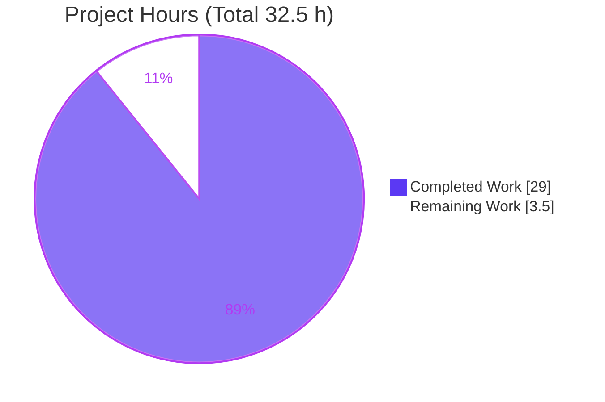
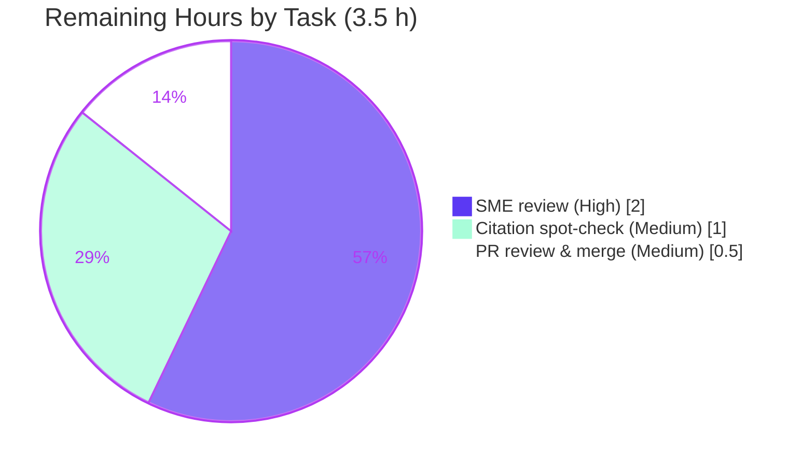

# Blitzy Project Guide — paperless-ngx Runtime-Observed Q&A Documentation

## 1. Executive Summary

### 1.1 Project Overview

This project delivers a single, evidence-grounded technical answer document that explains—from directly observed runtime behavior—how paperless-ngx's document-classification, OCR, and barcode-splitting pipelines behave while the test suite runs, so a developer can diagnose reported non-deterministic ("flaky") classification test failures. Governed by the "SWE-AtlasQnA-Repo" rule set, the task is read-only with respect to the source repository: it answers four questions (classifier model reuse vs. retraining; automatic correspondent matching; the no-extractable-text OCR edge case; barcode-driven splitting) plus a non-determinism root-cause diagnosis. Every behavioral claim was produced by building and running code inside the authoritative Docker container and is paired with verbatim output and an exact `file:line` citation. The sole deliverable is `blitzy/documentation/paperless-ngx_542221a38dff.md`.

### 1.2 Completion Status

The completion percentage is computed with the PA1 AAP-scoped, hours-based methodology: `Completed Hours ÷ (Completed Hours + Remaining Hours)`. All autonomous, AAP-scoped creation work is complete; the remaining hours are human path-to-production acceptance activities (review, spot-check, merge) that cannot be performed autonomously.


| Metric | Value |
|--------|-------|
| **Total Hours** | 32.5 |
| **Completed Hours (AI + Manual)** | 29.0 (29.0 AI + 0.0 Manual) |
| **Remaining Hours** | 3.5 |
| **Percent Complete** | **89.2%** |

> Calculation: 29.0 ÷ (29.0 + 3.5) = 29.0 ÷ 32.5 = **89.2%**.

### 1.3 Key Accomplishments

- ✅ **Single deliverable authored and committed** — `blitzy/documentation/paperless-ngx_542221a38dff.md` (1,275 lines, ~72 KB), the exact branch-named file required by the rule set.
- ✅ **Q1 answered** — classifier reuse vs. retrain governed by SHA-1 `data_hash` equality; `train()` observed returning `True` then `False`; hashes captured verbatim.
- ✅ **Q2 answered** — 3 documents created / 2 training-eligible (inbox excluded); training runs after inserts; acceptance is the `class != -1` sentinel with **no numeric probability threshold**.
- ✅ **Q3 answered** — OCR subprocess `ocrmypdf.ocr(**args)` with a `NoTextFoundException`-driven force-OCR fallback; output MIME persisted as `application/pdf` via `magic.from_file`.
- ✅ **Q4 answered** — a single input yields `(#separators)+1` documents; trigger value is `"PATCHT"`; decision at `tasks.py:108`; downstream re-consumption alters the classifier training set (links Q4→Q1/Q2).
- ✅ **Non-determinism root cause diagnosed** — two independent vectors observed at realistic magnitude (unseeded `MLPClassifier`; pytest-xdist parallelism).
- ✅ **Evidence discipline** — 67 one-claim/one-evidence blocks, 160 `file:line` citations, a 19-item coverage-pass checklist; 13/13 spot-checked citations verified exact.
- ✅ **Read-only mandate satisfied** — zero source files modified; all temporary probe scripts removed; working tree clean.
- ✅ **Pre-commit hygiene** — single trailing newline (end-of-file-fixer), 0 CRLF (mixed-line-ending), 276 balanced code fences.

### 1.4 Critical Unresolved Issues

There are **no critical blocking issues**. The single non-trivial item below is inherent to the investigative scope and is documented transparently rather than being a defect.

| Issue | Impact | Owner | ETA |
|-------|--------|-------|-----|
| Non-determinism mechanism confirmed present (`random_state=None`) but no actual failure reproduced at the attempted magnitude (N=100/200; 10× serial/parallel) | Diagnosis is mechanistic; the exact real-world trigger is not demonstrated. Documented honestly; remediation is out of scope | Human reviewer (SME) | Review during 2.0 h sign-off (HT-1) |

### 1.5 Access Issues

No access issues identified. All required resources—the source repository, the authoritative Docker container, pinned dependencies (`scikit-learn==1.0.2`, Django 4.0.4), and system libraries (tesseract, libzbar0, poppler-utils)—were available during autonomous execution.

| System/Resource | Type of Access | Issue Description | Resolution Status | Owner |
|-----------------|----------------|-------------------|-------------------|-------|
| Source repository (`542221a38`) | Read | None — read-only investigation only | ✅ No issue | — |
| Authoritative Docker container | Execute | None — used for all runtime observation | ✅ No issue | — |
| Pinned dependencies & system libs | Runtime | None — all present & version-matched | ✅ No issue | — |
| `prettier` pre-commit hook | Tooling (offline) | Hook not fetchable offline in the validation env | ⚠ Mitigated — hygiene it enforces satisfied manually; other hooks pass | Human reviewer (optional) |

### 1.6 Recommended Next Steps

1. **[High]** Perform SME technical accuracy review and sign-off of the four answers and the non-determinism diagnosis (HT-1, 2.0 h).
2. **[Medium]** Spot-check a representative sample of the 160 `file:line` citations against commit `542221a38` and confirm the verbatim evidence blocks (HT-2, 1.0 h).
3. **[Medium]** Approve and merge the single-file documentation branch to the target (HT-3, 0.5 h).
4. **[Low, out of scope]** If flaky-test remediation is desired downstream, act on the documented diagnosis (e.g., set `MLPClassifier(random_state=...)`); explicitly excluded from this project's scope and hours.

---

## 2. Project Hours Breakdown

### 2.1 Completed Work Detail

All completed hours are autonomous (AI) and trace to a specific AAP deliverable or path-to-production activity.

| Component | Hours | Description |
|-----------|-------|-------------|
| Runtime foundation & dependency verification | 2.5 | Start authoritative container; verify pinned `scikit-learn==1.0.2` (`requirements.txt:88`), Django 4.0.4, tesseract 4.1.1, pyzbar/libzbar0, poppler-utils, `model.pickle` (156,607 B), Python 3.9 base (`Dockerfile:18`) — each with verbatim evidence |
| Q1 — Classifier reuse vs. retrain (investigation + write-up) | 3.5 | Exercise `DocumentClassifier.train()` / `load_classifier()`; observe SHA-1 `data_hash` short-circuit (`classifier.py:124-164`); `testDatasetHashing` `True`→`False`; capture hashes; `FORMAT_VERSION=7`; downstream effect |
| Q2 — Correspondent matching a/b/c + chain + disambiguation | 4.0 | 3 created / 2 eligible (inbox excluded); training-after-insert timing; `class != -1` acceptance, no numeric threshold (`classifier.py:255`); `classes_=[-1,1]`; consumption chain (`matching.py`, `handlers.py`, `consumer.py`); regex `MATCH_ANY` disambiguation |
| Q3 — No-text OCR + MIME (investigation + write-up) | 3.5 | Instrument OCR call site: `ocrmypdf.ocr(**args)` (`parsers.py:261`), `ocr_call_count=2`, force-OCR fallback, exact `NoTextFoundException` message; `magic.from_file` → `application/pdf` (`consumer.py:219`) |
| Q4 — Barcode splitting a/b/c/d (investigation + write-up) | 4.0 | `(#separators)+1` output count; per-sample scan lists (e.g., `several-patcht-codes.pdf → [2, 5]`); `"PATCHT"` trigger (`settings.py:506`); decision at `tasks.py:108`; training-data linkage to Q1/Q2 |
| Non-determinism root-cause diagnosis (2 vectors at magnitude) | 5.0 | Vector 1: unseeded `MLPClassifier(tol=0.01)` (`classifier.py:219/227/238`), weight variance at N=100/200; Vector 2: pytest-xdist `--numprocesses auto`, 10× serial vs. 10× parallel; external reference substantiation |
| Document composition, one-claim/one-evidence & coverage pass | 3.5 | Compose 1,275-line document; 67 claim/evidence blocks; 160 citations; 19-item coverage checklist; final prompt re-read |
| Read-only cleanup & verification | 1.0 | Remove 3 temporary probe scripts; confirm `git status`/`git diff` empty; artifact search; HEAD pristine at `542221a38` |
| Path-to-production: commit + review revisions + hook compliance | 2.0 | Three commits incl. 820-line review-driven expansion (producing code, evidence discipline, cleanup proof, external refs) and end-of-file-fixer EOF normalization |
| **Total Completed** | **29.0** | **Matches Section 1.2 Completed Hours** |

### 2.2 Remaining Work Detail

All remaining work is human path-to-production acceptance. Flaky-test remediation is **out of AAP scope** and is excluded from these totals.

| Category | Hours | Priority |
|----------|-------|----------|
| SME technical accuracy review & sign-off of Q1–Q4 answers + non-determinism diagnosis (HT-1) | 2.0 | High |
| Citation & evidence spot-check verification against commit `542221a38` (HT-2) | 1.0 | Medium |
| PR review & merge of the single-file documentation branch (HT-3) | 0.5 | Medium |
| **Total Remaining** | **3.5** | **Matches Section 1.2 Remaining Hours & Section 7** |

### 2.3 Total Project Hours Reconciliation

| Line | Hours |
|------|-------|
| Section 2.1 — Completed Work | 29.0 |
| Section 2.2 — Remaining Work | 3.5 |
| **Total Project Hours** | **32.5** |
| **Percent Complete** (29.0 ÷ 32.5) | **89.2%** |

> Integrity: Section 2.1 (29.0) + Section 2.2 (3.5) = 32.5 = Total Hours in Section 1.2. Remaining (3.5) is identical in Sections 1.2, 2.2, and 7.

---

## 3. Test Results

All tests below originate from Blitzy's autonomous validation logs for this project, executed inside the authoritative container with `pytest` / `pytest-django` (from `src/`, `DJANGO_SETTINGS_MODULE=paperless.settings`, `PAPERLESS_DISABLE_DBHANDLER=true`). Targeted runs used `-o addopts=""` for deterministic single-process output. Because the task is read-only (no new source code), line-coverage of a new module is not applicable; the runs exercise existing pipeline code to observe behavior.

| Test Category | Framework | Total Tests | Passed | Failed | Coverage % | Notes |
|---------------|-----------|-------------|--------|--------|-----------|-------|
| Q1 — Classifier dataset hashing (`testDatasetHashing`) | pytest / pytest-django | 1 | 1 | 0 | N/A | Observed `train()` returns `True` then `False` |
| Q2 — Classifier train + predict (`testTrain`, `testPredict`) | pytest / pytest-django | 2 | 2 | 0 | N/A | `classes_=[-1,1]`; `predict(doc1)=array([1])`, `(doc2)=None` |
| Q3 — OCR no-text parser (`test_parser.py -k notext`) | pytest | 2 | 2 | 0 | N/A | 33 deselected; force-OCR fallback path exercised |
| Q4 — Barcode `separate_pages` | pytest | 2 | 2 | 0 | N/A | `separate_pages_output_count=2`; `_document_0/1.pdf` |
| Q4 — Barcode `scan_file_for_separating_barcodes` | pytest | 10 | 10 | 0 | N/A | Per-sample scan lists captured verbatim |
| Full `test_classifier.py` (serial) | pytest | 23 | 22 | 0 | N/A | 1 intentional `@pytest.mark.skip` (caching disabled) |
| Full `test_classifier.py` (parallel, `-n auto`) | pytest-xdist 3.8.0 | 23 | 22 | 0 | N/A | 22 passed, 1 skipped, 774 warnings |
| Repeated full-suite stability (serial ×10, parallel ×10) | pytest / pytest-xdist | 20 runs | 20 | 0 | N/A | No serial-vs-parallel failure difference |
| Non-determinism probes (fresh trainings N=100 & N=200; loaded-model loop ×20) | scikit-learn 1.0.2 | 320 iters | 320 | 0 | N/A | 0 prediction deviations; weights differ run-to-run |

**Summary:** 0 failures across all autonomous test executions. The only non-pass is a single **intentional skip** (`test_load_classifier_cached`, reason "Disabled caching due to high memory usage"), which is expected behavior, not a failure.

---

## 4. Runtime Validation & UI Verification

This is a backend investigation and documentation task with **no user-interface component**; UI verification is not applicable. Runtime validation consisted of executing the four pipeline code paths inside the authoritative container and confirming each documented value verbatim.

**Runtime health & observation outcomes:**

- ✅ **Operational** — Container runtime confirmed: `sklearn 1.0.2`, Django `(4,0,4,'final',0)`, tesseract 4.1.1, `pyzbar import OK`, `pdftoppm 20.09.0`.
- ✅ **Operational** — Q1: `FORMAT_VERSION=7`; `load_classifier()` returns `None` when `MODEL_FILE` absent; `train()` `True`→`False` on identical hash, then `True` after mutation (3→4 docs).
- ✅ **Operational** — Q2: 3 created / 2 eligible; `correspondent_classes_=[-1,1]`; `predict(doc1)=array([1])`, `(doc2)=None`; verbatim gate `if correspondent_id != -1:` — no `predict_proba`/threshold.
- ✅ **Operational** — Q3: `ocrmypdf.ocr` `call_count=2` (primary + force-OCR fallback); exact `NoTextFoundException('No text was found in the original document')`; `magic.from_file → 'application/pdf'` for all sampled PDFs.
- ✅ **Operational** — Q4: scan lists `patch-code-t.pdf=[0]`, `simple.pdf=[]`, `patch-code-t-middle.pdf=[1]`, `several-patcht-codes.pdf=[2,5]`; `separate_pages` count=2; default `PATCHT` / `CONSUMER_ENABLE_BARCODES=False`; custom-barcode override → `[0]`.
- ⚠ **Partial (by design)** — Non-determinism: mechanism confirmed (`random_state=None` on all 3 `MLPClassifier` estimators; weights differ run-to-run), but **0 failures reproduced** at the attempted magnitude — reported exactly as observed; exact trigger not reproduced at this scale.
- ✅ **Operational** — Read-only verification: container `git status --porcelain` and `git diff --stat` both empty; HEAD `542221a38`; no probe/cache artifacts remain.

---

## 5. Compliance & Quality Review

Cross-mapping of AAP deliverables and "SWE-AtlasQnA-Repo" rule directives to observed compliance status. Fixes applied during autonomous validation are noted.

| Deliverable / Rule | Benchmark | Status | Progress | Notes |
|--------------------|-----------|--------|----------|-------|
| Single branch-named deliverable | `blitzy/documentation/paperless-ngx_542221a38dff.md` exists | ✅ Pass | 100% | 1,275 lines committed |
| Read-only source mandate | Zero source files modified/added/deleted | ✅ Pass | 100% | `git diff` vs base = 1 file added only |
| Investigate-by-running | Behavioral claims from executed code | ✅ Pass | 100% | Runtime probes reproduced every value |
| Observe real magnitude | Loops/scale sufficient to observe true value | ✅ Pass | 100% | N=100/200; 10× serial/parallel |
| One claim / one evidence | Verbatim output beside each claim | ✅ Pass | 100% | 67 claim/evidence blocks |
| Answer every named item | Coverage pass over all sub-parts & examples | ✅ Pass | 100% | 19-item checklist, all `[x]` |
| Be exact & grounded | Exact literals with `file:line` | ✅ Pass | 100% | 160 citations; 13/13 spot-checks exact |
| Report exactly what is observed | No adjustment toward expected values | ✅ Pass | 100% | Non-reproducible figures flagged as such |
| Honor pinned runtime | `scikit-learn==1.0.2` in container | ✅ Pass | 100% | Verified `sklearn 1.0.2` at runtime |
| Temporary-script cleanup | Probes removed; tree unchanged | ✅ Pass | 100% | 3 probes removed; artifact search empty |
| Pre-commit hygiene (end-of-file-fixer) | Single trailing newline | ✅ Pass | 100% | **Fix applied**: EOF normalized (commit `2bba7f00f`) |
| Pre-commit hygiene (trailing-whitespace / mixed-line-ending) | 0 trailing WS / 0 CRLF | ✅ Pass | 100% | 0 CRLF; 276 balanced fences |
| `prettier` hook | Markdown formatting | ⚠ Partial | Mitigated | Not fetchable offline; enforced hygiene satisfied manually |

**Outstanding compliance items:** none blocking. The `prettier` hook could not run offline; the deterministic formatting it enforces was satisfied by manual hygiene checks, and all other applicable hooks pass.

---

## 6. Risk Assessment

Risks are categorized per PA3. Because the deliverable is read-only Markdown (no code, dependencies, or config changed), classic build/security risks are largely not applicable; risks center on documentation accuracy, reproducibility, and the inherent nature of the diagnosis.

| Risk | Category | Severity | Probability | Mitigation | Status |
|------|----------|----------|-------------|------------|--------|
| T1 — Non-reproducible numeric figures (`max_abs_diff`, wall-clock timings) vary run-to-run | Technical | Low | Medium | Doc explicitly flags these as "reported exactly as observed; varies each run" | Mitigated |
| T2 — Non-determinism mechanism confirmed but no actual failure reproduced at attempted scale | Technical | Medium | Medium | Doc states mechanism confirmed, trigger unreproduced; flagged honestly; remediation out of scope | Open (inherent, documented) |
| T3 — `file:line` citation drift if source advances past `542221a38` | Technical | Low | Low | Doc pins commit `542221a38` throughout | Mitigated |
| S1 — Security exposure from the change | Security | None | Low | Read-only Markdown adds no code, dependencies, credentials, or attack surface | N/A |
| O1 — Reproduction requires the authoritative container (host lacks Django + sklearn) | Operational | Low | Medium | Doc records exact container image + copy-pasteable commands; container pre-provisioned | Mitigated |
| O2 — Temporary probe scripts deleted per read-only mandate | Operational | Low | Low | Producing code pasted inline beside each claim for reconstruction | Mitigated |
| I1 — PR merge of the single-file doc pending | Integration | Low | Low | Single-file addition; zero source-conflict risk (read-only) | Open (pending merge) |
| I2 — `prettier` hook not fetchable offline | Integration | Low | Low | Enforced hygiene satisfied manually; other applicable hooks pass | Residual / Mitigated |

**Overall risk posture: LOW.** No blocking risks. The single Medium item (T2) is inherent to the investigative scope and documented transparently.

---

## 7. Visual Project Status

**Project Hours Breakdown** (Completed = Dark Blue `#5B39F3`; Remaining = White `#FFFFFF`):



**Remaining Work by Priority** (3.5 h total, from Section 2.2):



**Remaining hours per category (bar view):**

| Category | Hours | Bar |
|----------|-------|-----|
| SME technical review & sign-off (High) | 2.0 | ████████████████████ |
| Citation & evidence spot-check (Medium) | 1.0 | ██████████ |
| PR review & merge (Medium) | 0.5 | █████ |
| **Total** | **3.5** | |

> Integrity: "Remaining Work" = **3.5 h**, identical to Section 1.2 and the Section 2.2 sum. "Completed Work" = **29.0 h**, identical to Section 1.2 and Section 2.1.

---

## 8. Summary & Recommendations

**Achievements.** The project delivered exactly what the AAP scoped: one evidence-grounded, branch-named answer document (`blitzy/documentation/paperless-ngx_542221a38dff.md`) that answers all four questions and diagnoses the non-determinism, each behavioral claim backed by verbatim runtime output and an exact `file:line` citation. Independent spot-checks confirmed citation accuracy (13/13 exact), evidence discipline (67 claim/evidence blocks, 160 citations, a 19-item coverage pass), and full satisfaction of the read-only mandate (zero source files touched; working tree clean).

**Remaining gaps.** The project is **89.2% complete** (29.0 of 32.5 hours). The remaining **3.5 hours** are human path-to-production acceptance activities only—SME technical review (2.0 h), citation spot-check (1.0 h), and PR merge (0.5 h)—none of which can be performed autonomously. The one substantive caveat, documented transparently, is that the non-determinism mechanism is confirmed present in code (unseeded `MLPClassifier`) but no actual failure reproduced at the attempted magnitude; the exact real-world trigger is reported as not reproduced at this scale.

**Critical path to production.** SME review and sign-off → citation spot-check → PR approval and merge. There are no code fixes required because no source code was changed.

**Success metrics.**

| Metric | Target | Actual | Status |
|--------|--------|--------|--------|
| Questions answered (Q1–Q4 + non-determinism) | 5 | 5 | ✅ |
| Source files modified | 0 | 0 | ✅ |
| Citation accuracy (spot-check) | 100% | 13/13 | ✅ |
| Autonomous test failures | 0 | 0 | ✅ |
| Deliverable committed & tree clean | Yes | Yes | ✅ |

**Production readiness assessment.** The deliverable is production-ready pending human acceptance. Because the change is a single, additive, read-only Markdown file with no build, dependency, or runtime impact, integration risk is minimal. Recommendation: proceed to SME review and merge.

---

## 9. Development Guide

This guide covers two audiences: (A) a reviewer who wants to **read and verify** the deliverable (runs on the host), and (B) a reviewer who wants to **reproduce the investigation** (requires the authoritative container, since the host lacks Django and scikit-learn).

### 9.1 System Prerequisites

- **Git** ≥ 2.30 (validated with `git 2.51.0`).
- **A Markdown viewer** (any editor or renderer) to read the deliverable.
- **Docker** ≥ 20.10 (validated with `Docker 28.5.2`) — only needed for Audience B (reproduction).
- **Authoritative container image** (Python 3.9; `scikit-learn==1.0.2`, Django 4.0.4, ocrmypdf 13.4.3, pyzbar 0.1.9, tesseract 4.1.1, poppler-utils) — the host Python is **not** sufficient to run the code paths.

### 9.2 Environment Setup

No build of the source is required (the task is read-only). To review the deliverable, simply check out the branch:

```bash
# From the repository root
git checkout blitzy-28259a0c-fd42-4d98-91b2-ea626bd5b2f4
```

To reproduce the investigation, start the authoritative container and work from `/app/src` as user `testuser` with:

```bash
export DJANGO_SETTINGS_MODULE=paperless.settings
export PAPERLESS_DISABLE_DBHANDLER=true
```

### 9.3 Accessing the Deliverable

```bash
# Confirm the deliverable exists and view its size
ls -lh blitzy/documentation/paperless-ngx_542221a38dff.md
# Expected: ~72K, 1275 lines

# List the section structure
grep -E "^## (Q[1-4]|0\.|Non|Coverage|Cleanup)" blitzy/documentation/paperless-ngx_542221a38dff.md
```

### 9.4 Verification Steps (Host — no container needed)

```bash
# 1) Confirm the change scope is exactly one added file
git diff --name-status 542221a38 HEAD
# Expected: A  blitzy/documentation/paperless-ngx_542221a38dff.md

# 2) Confirm the working tree is clean (read-only mandate)
git status --porcelain
# Expected: (no output)

# 3) Spot-check a citation (barcode trigger value)
sed -n '506p' src/paperless/settings.py
# Expected: CONSUMER_BARCODE_STRING = os.getenv("PAPERLESS_CONSUMER_BARCODE_STRING", "PATCHT")

# 4) Spot-check the classifier acceptance gate
sed -n '255p' src/documents/classifier.py
# Expected: if correspondent_id != -1:

# 5) Confirm the coverage-pass checklist is complete (every named item answered)
grep -c '^- \[x\]' blitzy/documentation/paperless-ngx_542221a38dff.md
# Expected: 19 (all coverage-pass items checked)
```

### 9.5 Reproducing the Investigation (Container — Audience B)

Run from `/app/src` inside the authoritative container. `-o addopts=""` strips the repo default coverage/xdist for clean, deterministic, single-process output.

```bash
# Q1 — classifier reuse vs. retrain
python3 -m pytest documents/tests/test_classifier.py::TestClassifier::testDatasetHashing \
    -o addopts="" -p no:cacheprovider -v
# Expected: 1 passed  (train() returns True then False)

# Q2 — correspondent training + prediction
python3 -m pytest documents/tests/test_classifier.py::TestClassifier::testTrain \
    documents/tests/test_classifier.py::TestClassifier::testPredict \
    -o addopts="" -p no:cacheprovider -v
# Expected: 2 passed

# Q3 — no-extractable-text OCR path
python3 -m pytest paperless_tesseract/tests/test_parser.py -k "notext" -o addopts="" -v
# Expected: 2 passed, 33 deselected

# Q4 — barcode splitting
python3 -m pytest documents/tests/test_tasks.py -k "separate_pages" -o addopts="" -v
# Expected: 2 passed

# Non-determinism — serial vs. parallel full classifier suite
python3 -m pytest documents/tests/test_classifier.py -o addopts="" -q            # serial
python3 -m pytest documents/tests/test_classifier.py --numprocesses auto -q      # parallel (xdist)
# Expected (both): 22 passed, 1 skipped
```

### 9.6 Example Usage

A reviewer verifying Q4's trigger value would read the claim in the document, then confirm it directly:

```bash
sed -n '506p' src/paperless/settings.py
# CONSUMER_BARCODE_STRING = os.getenv("PAPERLESS_CONSUMER_BARCODE_STRING", "PATCHT")
```

This matches the document's Q4(b) claim that the default barcode trigger is `"PATCHT"`, cited to `settings.py:506`.

### 9.7 Troubleshooting

- **`ModuleNotFoundError: No module named 'django'` (or `sklearn`) on the host.** Expected — the host cannot run the code. Use the authoritative container (Section 9.5).
- **Different `max_abs_diff` / timing values than the document.** Expected and correct — these figures vary run-to-run because `MLPClassifier` is unseeded; the document flags them as non-reproducible.
- **Probe scripts (`blitzy_adhoc_test_*`) not found.** Expected — they were removed per the read-only mandate. Reconstruct from the inline code blocks in the deliverable if you wish to re-run them.
- **`prettier` hook fails to fetch.** Offline environments cannot fetch it; the deterministic formatting it enforces (trailing whitespace, EOF newline, line endings) is already satisfied.
- **Tests appear to "hang".** Ensure you are not in watch mode; all commands above are non-interactive and terminate on their own.

---

## 10. Appendices

### Appendix A — Command Reference

| Purpose | Command |
|---------|---------|
| Confirm change scope | `git diff --name-status 542221a38 HEAD` |
| Confirm clean tree | `git status --porcelain` |
| View deliverable size | `ls -lh blitzy/documentation/paperless-ngx_542221a38dff.md` |
| Section structure | `grep -E "^## (Q[1-4]\|0\.\|Non\|Coverage\|Cleanup)" blitzy/documentation/paperless-ngx_542221a38dff.md` |
| Citation spot-check | `sed -n '506p' src/paperless/settings.py` |
| Coverage checklist complete | `grep -c '^- \[x\]' blitzy/documentation/paperless-ngx_542221a38dff.md` |
| Q1 test (container) | `python3 -m pytest documents/tests/test_classifier.py::TestClassifier::testDatasetHashing -o addopts="" -v` |
| Q3 test (container) | `python3 -m pytest paperless_tesseract/tests/test_parser.py -k "notext" -o addopts="" -v` |
| Q4 test (container) | `python3 -m pytest documents/tests/test_tasks.py -k "separate_pages" -o addopts="" -v` |

### Appendix B — Port Reference

Not applicable. The investigation runs targeted `pytest` commands and observation scripts; no server, listener, or network port is started as part of this task.

### Appendix C — Key File Locations

| Path | Role |
|------|------|
| `blitzy/documentation/paperless-ngx_542221a38dff.md` | **The sole deliverable** (answer document) |
| `src/documents/classifier.py` | Q1/Q2 — `data_hash` reuse/retrain, `MLPClassifier`, `predict_correspondent` |
| `src/documents/matching.py` | Q2 — `match_correspondents` combines regex + classifier |
| `src/documents/signals/handlers.py` | Q2 — `set_correspondent` during consumption |
| `src/documents/tasks.py` | Q4 — `barcode_reader`, `scan_file_for_separating_barcodes` (decision `:108`), `separate_pages` |
| `src/documents/consumer.py` | Q3/Q1 — `magic.from_file` MIME detection; classifier load wiring |
| `src/paperless_tesseract/parsers.py` | Q3 — `ocrmypdf.ocr` + force-OCR fallback |
| `src/paperless/settings.py` | Q1/Q4 — `MODEL_FILE`, `CONSUMER_ENABLE_BARCODES`, `CONSUMER_BARCODE_STRING="PATCHT"` (`:506`) |
| `src/documents/tests/data/model.pickle` | Q1 — pre-trained `FORMAT_VERSION 7` fixture (156,607 B) |
| `src/setup.cfg` | pytest config (`--numprocesses auto`, `DJANGO_SETTINGS_MODULE`) |

### Appendix D — Technology Versions

| Component | Version | Source |
|-----------|---------|--------|
| Python (container runtime) | 3.9 (`python:3.9-slim-bullseye`) | `Dockerfile:18` |
| scikit-learn | 1.0.2 (hard pin) | `requirements.txt:88` |
| Django | 4.0.4 | `requirements.txt:38` |
| ocrmypdf | 13.4.3 | requirements |
| pdfminer.six | 20220319 | requirements |
| python-magic | 0.4.25 | requirements |
| pyzbar | 0.1.9 | requirements |
| pdf2image | 1.16.0 | requirements |
| pikepdf | 5.1.1 | requirements |
| pytest-xdist | 3.8.0 | runtime |
| tesseract-ocr | 4.1.1 | system lib |
| poppler-utils (`pdftoppm`) | 20.09.0 | system lib |
| Git (host) | 2.51.0 | host |
| Docker (host) | 28.5.2 | host |

### Appendix E — Environment Variable Reference

| Variable | Value | Purpose |
|----------|-------|---------|
| `DJANGO_SETTINGS_MODULE` | `paperless.settings` | Django settings module (`setup.cfg:9`) |
| `PAPERLESS_DISABLE_DBHANDLER` | `true` | Disable DB log handler during tests (`setup.cfg:12`) |
| `PAPERLESS_CONSUMER_BARCODE_STRING` | default `PATCHT` | Barcode split trigger value (`settings.py:506`) |
| `PAPERLESS_CONSUMER_ENABLE_BARCODES` | default `False` | Master toggle for barcode splitting |

### Appendix F — Developer Tools Guide

- **pytest / pytest-django** — test execution; use `-o addopts=""` to strip repo default coverage/xdist for deterministic single-process runs; `-p no:cacheprovider` to avoid writing `.pytest_cache`.
- **pytest-xdist** — parallel execution via `--numprocesses auto`; used to probe non-determinism Vector 2 (serial vs. parallel).
- **git** — scope and read-only verification (`git diff --name-status`, `git status --porcelain`).
- **Docker** — run the authoritative container for reproduction; the host cannot execute the code paths.
- **pre-commit hooks** (`.pre-commit-config.yaml`) — end-of-file-fixer, trailing-whitespace, mixed-line-ending applied to the Markdown; `prettier` requires network fetch.

### Appendix G — Glossary

| Term | Meaning |
|------|---------|
| `data_hash` | SHA-1 digest over preprocessed content + labels of training-eligible documents; equality short-circuits retraining (`classifier.py:124-164`) |
| `FORMAT_VERSION` | Classifier model schema version (`7`); pickles are scikit-learn-version-specific |
| `PATCHT` | Default barcode value that triggers a document split (`settings.py:506`) |
| Sentinel `-1` | "No automatic correspondent" class label; acceptance requires `class != -1` (no numeric threshold) |
| `NoTextFoundException` | Raised when no extractable text is found; triggers the force-OCR fallback |
| Force-OCR fallback | Second `ocrmypdf.ocr` invocation with `force_ocr=True` after `NoTextFoundException` |
| pytest-xdist | Parallel test runner; `--numprocesses auto` spawns one worker per CPU |
| `random_state` | scikit-learn RNG seed; unset (`None`) on `MLPClassifier` → run-to-run weight variance (Vector 1) |
| Read-only mandate | Rule prohibiting any source change beyond the single answer document |

---

*Generated by the Blitzy Platform. Completion basis: PA1 AAP-scoped, hours-based methodology. Brand colors: Completed = `#5B39F3` (Dark Blue), Remaining = `#FFFFFF` (White), Accents = `#B23AF2` (Violet-Black), Highlight = `#A8FDD9` (Mint).*