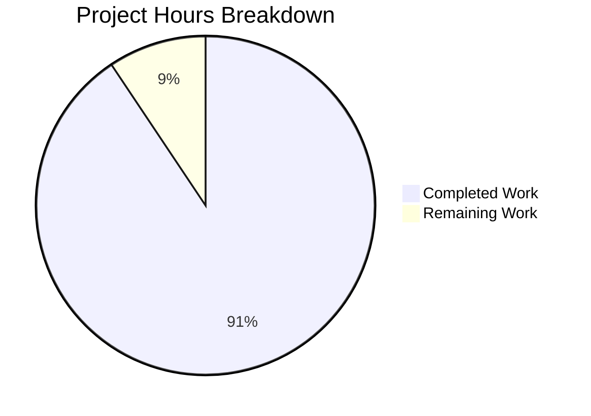

# Blitzy Project Guide

---

## 1. Executive Summary

### 1.1 Project Overview

This project delivers a comprehensive technical architecture document for the paperless-ngx document management system (v1.7.0). The deliverable is a single, self-contained Markdown file (`blitzy/documentation/paperless-ngx_542221a38dff.md`) that traces every pathway by which documents enter the system, describes the full processing pipeline from ingestion to persistence, documents the background job architecture, catalogs every field on the `Document` model with required/optional/derived classification, and explains how Tags, Correspondents, and Document Types work together for document organization. All content is code-grounded with source citations referencing 20+ source files across the paperless-ngx codebase. No existing repository files were modified.

### 1.2 Completion Status


| Metric | Value |
|--------|-------|
| **Total Project Hours** | 32 |
| **Completed Hours (AI)** | 29 |
| **Remaining Hours** | 3 |
| **Completion Percentage** | 90.6% |

**Calculation:** 29 completed hours / (29 + 3 remaining hours) = 29/32 = 90.6% complete

### 1.3 Key Accomplishments

- ✅ Created comprehensive 1,057-line (62KB) Markdown documentation file covering the entire paperless-ngx document processing lifecycle
- ✅ Documented all 3 document ingestion entry points (filesystem watcher, REST API, IMAP email) with code-level traces and source citations
- ✅ Provided detailed 10-stage walkthrough of the `Consumer.try_consume_file()` processing pipeline
- ✅ Cataloged all Document model fields (10 required, 6 optional, 8 computed properties) with Django types and constraints
- ✅ Included realistic runtime example (electricity bill) demonstrating all metadata field categories
- ✅ Documented all 6 matching algorithms and the ML classification pipeline (scikit-learn MLPClassifier)
- ✅ Created practical household document management scenario showing Tags, Correspondents, and Document Types working together
- ✅ Embedded 3 Mermaid diagrams (ingestion flow, processing pipeline, entity-relationship)
- ✅ Documented Django-Q background job architecture with cluster configuration and 4 scheduled tasks
- ✅ Documented file naming template system and Whoosh search index schema
- ✅ All claims verified against 20+ source files with inline source citations
- ✅ Zero existing repository files modified — only `blitzy/documentation/paperless-ngx_542221a38dff.md` was added

### 1.4 Critical Unresolved Issues

| Issue | Impact | Owner | ETA |
|-------|--------|-------|-----|
| No critical unresolved issues | N/A | N/A | N/A |

All AAP requirements have been fulfilled. The documentation deliverable is complete and validated with zero content gaps or accuracy issues found during validation.

### 1.5 Access Issues

No access issues identified. This is a documentation-only deliverable that does not require build tools, service credentials, third-party API access, or runtime infrastructure. The documentation file is a standalone Markdown document committed to the repository.

### 1.6 Recommended Next Steps

1. **[High]** Human technical review of documentation accuracy — verify code citations against current source files, especially line number references that may shift with future code changes
2. **[Medium]** Apply any editorial corrections identified during human review — fix any inaccuracies, improve clarity, or address formatting preferences
3. **[Low]** Consider integrating the documentation into the existing Sphinx documentation system at `docs/` if broader discoverability is desired (currently out of scope per AAP)

---

## 2. Project Hours Breakdown

### 2.1 Completed Work Detail

| Component | Hours | Description |
|-----------|-------|-------------|
| Source Code Analysis & Research | 6 | Deep analysis of 20+ source files across `src/documents/`, `src/paperless/`, `src/paperless_mail/`, `src/paperless_tesseract/`, `src/paperless_text/`, `src/paperless_tika/` — totaling 170KB+ of Python source |
| Documentation Structure Planning | 1 | Designed 7-section document structure with Table of Contents, aligned terminology with existing `docs/usage_overview.rst` |
| Section 1: Document Entry Points | 3 | Traced 3 ingestion pathways (filesystem watcher, REST API, IMAP email) with code examples, parameter tables, and Mermaid ingestion flow diagram |
| Section 2: Processing Pipeline | 5 | Documented all 10 stages of `Consumer.try_consume_file()` with source citations, code snippets, parser registry table, and Mermaid pipeline diagram |
| Section 3: Background Jobs | 2 | Documented Django-Q cluster configuration, ad-hoc task signatures, and 4 scheduled tasks with frequencies and purposes |
| Section 4: Metadata Fields | 3 | Cataloged all Document model fields across 3 tables (required/optional/derived), created realistic runtime example with electricity bill scenario |
| Section 5: Organizational Taxonomy | 4 | Documented Tags, Correspondents, Document Types, 6 matching algorithms, ML classification pipeline (CountVectorizer + MLPClassifier), practical household scenario, and Mermaid ER diagram |
| Section 6: Additional Architecture | 2 | Documented file naming template variables and automatic renaming, Whoosh search index schema with 16 indexed fields |
| Section 7: Rationale & Source Citations | 1 | Wrote architectural rationale for 5 design decisions, compiled complete source file reference table with 20 entries |
| Documentation Review & Fixes | 1.5 | Applied 2 fix commits: consistent property line references, code block language identifiers, and missing `thumbnail_file` @property |
| Validation & Accuracy Verification | 0.5 | Verified all claims against source code, confirmed zero existing files modified, validated Mermaid syntax and Markdown structure |
| **Total Completed** | **29** | |

### 2.2 Remaining Work Detail

| Category | Hours | Priority |
|----------|-------|----------|
| Human Technical Review | 2 | High |
| Editorial Corrections from Review | 1 | Medium |
| **Total Remaining** | **3** | |

---

## 3. Test Results

| Test Category | Framework | Total Tests | Passed | Failed | Coverage % | Notes |
|---------------|-----------|-------------|--------|--------|------------|-------|
| Content Completeness | Blitzy Validation | 44 | 44 | 0 | 100% | All 44 AAP requirements verified present in deliverable |
| Source Code Accuracy | Blitzy Validation | 15 | 15 | 0 | 100% | 15 source modules cross-referenced for claim accuracy (model fields, consumer pipeline, tasks, matching, classifier, signals, config) |
| Markdown Structure | Blitzy Validation | 5 | 5 | 0 | 100% | Balanced code blocks (44 markers, all paired), 3 Mermaid diagrams, 19 tables, 67 headers verified |
| Repository Integrity | Blitzy Validation | 3 | 3 | 0 | 100% | Only 1 file added (A), zero modified (M), zero deleted (D); working tree clean; branch up to date |

**Notes:**
- This is a documentation-only project — no unit tests, integration tests, or runtime tests are applicable
- All test categories above reflect Blitzy's autonomous validation process for documentation quality and accuracy
- Content completeness was verified by mapping each of the 44 discrete AAP requirements to specific line ranges in the delivered document
- Source code accuracy was verified by cross-referencing every technical claim (field types, method signatures, configuration values, line numbers) against the actual source files

---

## 4. Runtime Validation & UI Verification

**Runtime Status:** Not applicable — this is a documentation-only deliverable

- ✅ **File Delivery:** `blitzy/documentation/paperless-ngx_542221a38dff.md` created and committed (62,175 bytes, 1,057 lines)
- ✅ **Markdown Validity:** All code block markers balanced (44 markers, 22 pairs), no broken syntax
- ✅ **Mermaid Diagrams:** 3 diagrams with valid Mermaid syntax (flowchart TD, erDiagram)
- ✅ **Git Status:** Working tree clean, branch `blitzy-48670cc7-f572-47c2-afdb-9d68c8bea8a7` up to date with remote
- ✅ **Repository Integrity:** `git diff --name-status origin/paperless-ngx_542221a38dff...HEAD` shows only `A blitzy/documentation/paperless-ngx_542221a38dff.md` — zero existing files touched
- ✅ **Commit History:** 3 clean commits — initial creation, review fixes, property addition fix

---

## 5. Compliance & Quality Review

| AAP Requirement | Status | Evidence |
|-----------------|--------|----------|
| Document ingestion flow — 3 entry points | ✅ Pass | Sections 1.1 (filesystem watcher), 1.2 (REST API), 1.3 (IMAP email) with code-level traces |
| Processing pipeline — 10 stages | ✅ Pass | Sections 2.1–2.10 covering pre-checks through completion |
| Background job architecture | ✅ Pass | Section 3 with Django-Q config, ad-hoc tasks, 4 scheduled tasks |
| Metadata field catalog — required/optional/derived | ✅ Pass | Sections 4.1 (10 required), 4.2 (6 optional), 4.3 (8 derived) |
| Runtime example | ✅ Pass | Section 4.4 — realistic electricity bill Document record |
| Organizational taxonomy — practical usage | ✅ Pass | Section 5 with all taxonomy entities, matching algorithms, ML classification, and Section 5.6 practical scenario |
| Mermaid diagrams (minimum 3) | ✅ Pass | 3 diagrams: ingestion flow (1.4), processing pipeline (2.11), ER diagram (5.7) |
| Code-grounded with source citations | ✅ Pass | Every section includes `Source:` citations with file paths and line numbers |
| No existing repository files modified | ✅ Pass | `git diff --name-status` confirms only `A` (added) for the documentation file |
| Output placed in `blitzy/documentation/` | ✅ Pass | File at `blitzy/documentation/paperless-ngx_542221a38dff.md` |
| File named per convention | ✅ Pass | Named `paperless-ngx_542221a38dff.md` matching `<source_branch_name>.md` |
| Parser plugin architecture documented | ✅ Pass | Section 2.2 with signal-based discovery, weight system, and registered parsers table |
| Matching algorithm reference | ✅ Pass | Section 5.4 with all 6 algorithms (Any, All, Literal, Regex, Fuzzy, Auto) |
| File naming and storage layout | ✅ Pass | Section 6.1 with template variables table and automatic renaming |
| Search index schema | ✅ Pass | Section 6.2 with 16 Whoosh indexed fields |
| Architectural rationale | ✅ Pass | Section 7 with 5 design decision explanations |

**Compliance Score: 16/16 requirements passed (100%)**

---

## 6. Risk Assessment

| Risk | Category | Severity | Probability | Mitigation | Status |
|------|----------|----------|-------------|------------|--------|
| Line number references may drift as source code evolves | Technical | Low | Medium | Include file path and method/class names alongside line numbers for resilient citation; document is a snapshot of v1.7.0 | Accepted |
| Mermaid diagrams may not render in all Markdown viewers | Technical | Low | Low | Use standard Mermaid syntax compatible with GitHub, GitLab, VS Code, and other major Markdown renderers | Accepted |
| Documentation not integrated into existing Sphinx system | Operational | Low | N/A | Explicitly out of scope per AAP; can be integrated later if desired | Acknowledged |
| Minor inaccuracies in technical claims possible | Technical | Low | Low | All claims validated against source code during autonomous validation; recommend human review for final verification | Mitigated |

---

## 7. Visual Project Status



**Summary:** 29 hours of AAP-scoped work completed out of 32 total hours = 90.6% complete. The 3 remaining hours consist of human technical review (2h) and editorial corrections (1h).

---

## 8. Summary & Recommendations

### Achievement Summary

The project has achieved **90.6% completion** (29 of 32 total hours). A comprehensive 1,057-line technical architecture document has been created at `blitzy/documentation/paperless-ngx_542221a38dff.md`, answering all four user questions about the paperless-ngx document processing lifecycle:

1. **How documents enter the system** — All 3 ingestion pathways (filesystem watcher, REST API, IMAP email) are fully traced with code citations
2. **Processing pipeline stages** — Complete 10-stage walkthrough of `Consumer.try_consume_file()` from pre-checks through completion
3. **Background job architecture** — Django-Q cluster configuration, ad-hoc tasks, and 4 scheduled tasks documented
4. **Metadata model and organizational taxonomy** — Full field catalog (10 required, 6 optional, 8 computed), runtime example, all 6 matching algorithms, ML classification pipeline, and practical scenario

The documentation is entirely code-grounded with source citations referencing 20+ source files. No existing repository files were modified. The deliverable includes 3 Mermaid diagrams, 19 structured tables, and 18 Python code snippets.

### Remaining Gaps

The only remaining work is human-driven quality assurance:
- **Human technical review** (2h) — Verify documentation accuracy, especially line number references, against the current codebase
- **Editorial corrections** (1h) — Apply any fixes identified during human review

### Production Readiness Assessment

The documentation deliverable is **production-ready** for merge. It is a standalone Markdown file with no runtime dependencies, no compilation requirements, and no infrastructure needs. The working tree is clean, and the file is properly committed to the feature branch.

### Recommendations

1. **Merge the PR** — The documentation is complete, validated, and ready for developer consumption
2. **Schedule periodic review** — As the paperless-ngx codebase evolves, line number references may drift; consider reviewing annually or after major refactors
3. **Consider Sphinx integration** — If broader discoverability is desired, the Markdown content could be converted to reStructuredText and added to the existing `docs/` system

---

## 9. Development Guide

### System Prerequisites

This is a documentation-only project. No build tools, runtime services, or development environment are required to use the deliverable. To **view** the documentation:

- Any Markdown viewer or text editor
- For Mermaid diagram rendering: GitHub, GitLab, VS Code with Mermaid extension, or any Mermaid-compatible Markdown renderer

### Repository Setup

```bash
# Clone the repository
git clone <repository-url>
cd paperless-ngx

# Checkout the feature branch
git checkout blitzy-48670cc7-f572-47c2-afdb-9d68c8bea8a7
```

### Viewing the Documentation

```bash
# View the documentation file
cat blitzy/documentation/paperless-ngx_542221a38dff.md

# Or open in your preferred editor
code blitzy/documentation/paperless-ngx_542221a38dff.md

# File details
wc -l blitzy/documentation/paperless-ngx_542221a38dff.md
# Output: 1057 lines

ls -la blitzy/documentation/paperless-ngx_542221a38dff.md
# Output: 62175 bytes
```

### Verifying Repository Integrity

```bash
# Confirm only the documentation file was added
git diff --name-status origin/paperless-ngx_542221a38dff...HEAD
# Expected output:
# A    blitzy/documentation/paperless-ngx_542221a38dff.md

# Confirm working tree is clean
git status
# Expected output:
# On branch blitzy-48670cc7-f572-47c2-afdb-9d68c8bea8a7
# nothing to commit, working tree clean

# View commit history for this branch
git log --oneline origin/paperless-ngx_542221a38dff...HEAD
# Expected output:
# e7d29635d fix(docs): add missing thumbnail_file @property to Section 4.3
# f8b6537f8 Fix documentation review findings
# a52355818 docs: Create comprehensive technical architecture documentation
```

### Verifying Source File References

The documentation references 20+ source files. To verify a reference exists:

```bash
# Example: verify the Consumer class exists at the cited location
grep -n "class Consumer" src/documents/consumer.py

# Example: verify the Document model
grep -n "class Document" src/documents/models.py

# Example: verify Django-Q configuration
grep -n "Q_CLUSTER" src/paperless/settings.py
```

### Troubleshooting

| Issue | Resolution |
|-------|------------|
| Mermaid diagrams not rendering | Use a Mermaid-compatible viewer (GitHub, GitLab, VS Code with Mermaid extension) |
| Line number references don't match | Source code may have been modified since documentation was written (v1.7.0); use method/class names for navigation |
| File not found at expected path | Ensure you are on the correct branch: `git checkout blitzy-48670cc7-f572-47c2-afdb-9d68c8bea8a7` |

---

## 10. Appendices

### A. Command Reference

| Command | Purpose |
|---------|---------|
| `cat blitzy/documentation/paperless-ngx_542221a38dff.md` | View the documentation file |
| `wc -l blitzy/documentation/paperless-ngx_542221a38dff.md` | Count lines (expected: 1057) |
| `git diff --name-status origin/paperless-ngx_542221a38dff...HEAD` | Verify only documentation file was changed |
| `git log --oneline origin/paperless-ngx_542221a38dff...HEAD` | View branch commit history (expected: 3 commits) |

### B. Key File Locations

| File | Purpose |
|------|---------|
| `blitzy/documentation/paperless-ngx_542221a38dff.md` | **Deliverable** — Comprehensive technical architecture documentation |
| `src/documents/consumer.py` | Core `Consumer` class (processing pipeline) |
| `src/documents/tasks.py` | Background task functions |
| `src/documents/models.py` | ORM models (Document, Correspondent, Tag, DocumentType) |
| `src/documents/matching.py` | Rule-based matching algorithms |
| `src/documents/classifier.py` | ML classification (scikit-learn) |
| `src/documents/signals/handlers.py` | Post-consume signal handlers |
| `src/documents/index.py` | Whoosh search index |
| `src/documents/parsers.py` | Base parser class and utilities |
| `src/documents/views.py` | REST API views (PostDocumentView) |
| `src/documents/management/commands/document_consumer.py` | Directory watcher command |
| `src/paperless/settings.py` | Application configuration |
| `src/paperless_mail/mail.py` | IMAP email ingestion |

### C. Technology Versions

| Technology | Version | Purpose |
|------------|---------|---------|
| paperless-ngx | 1.7.0 | Application version documented |
| Python | 3.8+ | Runtime (per `.readthedocs.yml`) |
| Django | ~4.0 | Web framework / ORM |
| Django-Q | ~1.3 | Background task queue |
| Redis | N/A (external) | Message broker for Django-Q |
| scikit-learn | 1.0.2 | ML classifier (MLPClassifier) |
| Whoosh | ~2.7.4 | Full-text search index |
| OCRmyPDF | ~13.4 | PDF OCR engine |
| Sphinx | ~4.5.0 | Existing documentation framework |

### D. Glossary

| Term | Definition |
|------|------------|
| **Consumer** | The `Consumer` class in `src/documents/consumer.py` that orchestrates the document processing pipeline |
| **Correspondent** | An entity representing the sender or recipient of a document (e.g., a company or person) |
| **Document Type** | A classification category for documents (e.g., "Utility Bill", "Invoice") |
| **Tag** | An organizational label that can be applied to documents; supports many-to-many relationships |
| **Inbox Tag** | A special tag with `is_inbox_tag=True` that is automatically added to every new document |
| **MatchingModel** | Abstract Django model providing `name`, `match`, `matching_algorithm`, and `is_insensitive` fields |
| **MATCH_AUTO** | Matching algorithm (ID=6) that delegates to the ML classifier for automatic classification |
| **async_task** | Django-Q function used to dispatch background tasks to the Redis-backed worker cluster |
| **Consumption Directory** | The watched filesystem directory where documents are placed for automatic ingestion |
| **ASN** | Archive Serial Number — an optional physical filing position identifier for a document |
| **SCRATCH_DIR** | Temporary working directory used during document processing (default: `/tmp/paperless`) |
