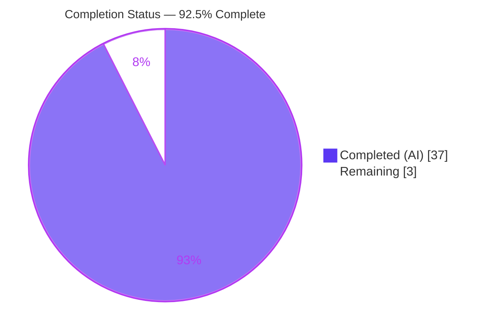
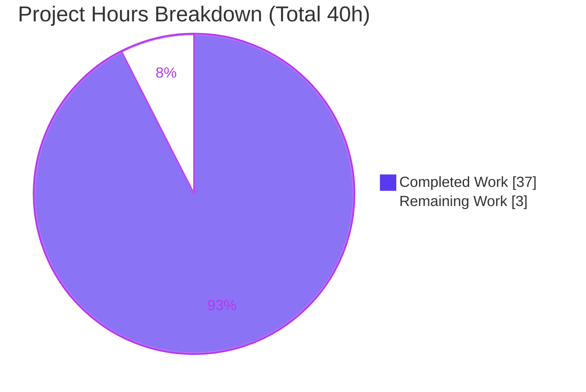
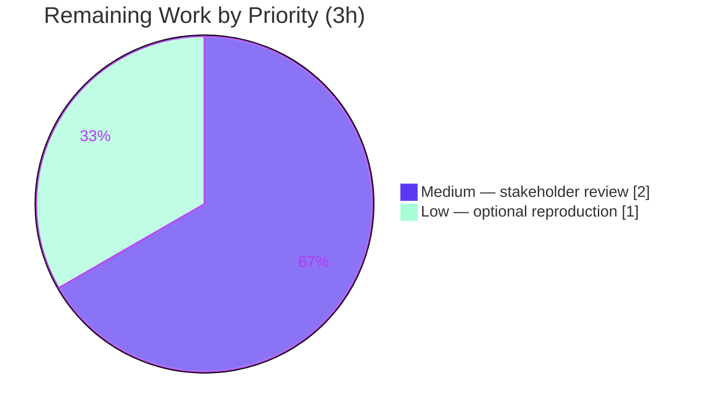

# Blitzy Project Guide — paperless-ngx Background Maintenance & Task Scheduling Q&A

> **Deliverable:** `blitzy/documentation/paperless-ngx_542221a38dff.md` (1,062 lines)
> **Repository:** paperless-ngx · **Branch:** `paperless-ngx_542221a38dff` · **Base commit:** `542221a38`
> **Task type:** Read-only documentation / code-investigation (SWE-AtlasQnA-Repo rule set)
> **Brand legend:** ■ Completed (Dark Blue `#5B39F3`) · ▢ Remaining (White `#FFFFFF`)

---

## 1. Executive Summary

### 1.1 Project Overview

This project delivers a single, evidence-backed markdown document that comprehensively answers eleven user questions about **paperless-ngx**'s automatic background-maintenance and task-scheduling subsystem. The pivotal insight is that the user framed the questions in **Celery** terminology, but at commit `542221a38` paperless-ngx uses **Django-Q 1.3.9**, not Celery. The document corrects that premise and then answers each question against Django-Q's real machinery (`Q_CLUSTER`, `django_q.models.Schedule`, the `qcluster` command), pairing every behavioral claim with the exact command, unedited runtime output, a `file:line` citation, and cause→effect reasoning. The scope is read-only: the source tree is left byte-for-byte unchanged, with the answer document as the only addition. The audience is engineers evaluating paperless-ngx's scheduler architecture.

### 1.2 Completion Status



| Metric | Hours |
| --- | --- |
| **Total Hours** | **40.0** |
| **Completed Hours (AI + Manual)** | **37.0** (AI 37.0 + Manual 0.0) |
| **Remaining Hours** | **3.0** |
| **Percent Complete** | **92.5 %** |

> **Calculation (PA1, AAP-scoped):** Completion % = Completed ÷ Total = 37.0 ÷ 40.0 = **92.5 %**. The 3.0 remaining hours are the path-to-production human acceptance gate, not unfinished AAP deliverables.

### 1.3 Key Accomplishments

- ✅ **Single deliverable created** at the mandated path `blitzy/documentation/paperless-ngx_542221a38dff.md` (1,062 lines).
- ✅ **Celery → Django-Q correction** opens the document with a remap table and grep-based evidence of absence (`grep -rin celery src/` → exit 1) and presence (`django_q` app, `django-q==1.3.9`).
- ✅ **All 11 questions answered** (Q1–Q11), each with a concrete value, `file:line` citation, unedited runtime output, and cause→effect explanation.
- ✅ **Recurring inventory established as exactly four schedules** (train_classifier HOURLY, index_optimize DAILY, sanity_check WEEKLY, process_mail_accounts every 10 min), read from the live `django_q_schedule` table and confirmed stable across two canonical `qcluster` sweeps.
- ✅ **Five negative findings** stated plainly with evidence of absence (no Celery, no dedicated retry/stuck-job task, no ORM database cleanup, no application-level alerting, no per-schedule enable/disable toggle).
- ✅ **Edge/negative branches exercised** (sanity checker "no issues" + populated branches; `train_classifier` self-guard early-return + training path; `repeats=0` schedule pause).
- ✅ **Read-only mandate satisfied byte-for-byte** — `git diff 542221a38 --name-status` shows only the doc added; working tree clean; all observation artifacts cleaned up.
- ✅ **Independently validated** — the Final Validator reproduced all 11 questions' runtime claims in a fresh Docker container, verified 100 % of `file:line` citations, and required **zero corrections**.

### 1.4 Critical Unresolved Issues

| Issue | Impact | Owner | ETA |
| --- | --- | --- | --- |
| _None._ No blocking issues. The deliverable is complete, internally consistent, evidence-backed, and validated with zero corrections. | — | — | — |

### 1.5 Access Issues

| System/Resource | Type of Access | Issue Description | Resolution Status | Owner |
| --- | --- | --- | --- | --- |
| _None identified_ | — | No access issues identified. The repository was fully accessible; runtime evidence was gathered in the project's documented Docker image. The authoring sandbox lacks Django/Redis/Docker, but this is by design (per AAP §0.8.1) — runtime observation is performed in the paperless image, which was available to the implementation and validation agents. | Resolved / N/A | — |

**No access issues identified.**

### 1.6 Recommended Next Steps

1. **[Medium]** Stakeholder reviews and accepts the Q&A deliverable — read all 11 answers plus the Celery→Django-Q correction and confirm they satisfy the intended reader (2.0 h).
2. **[Low]** Optionally reproduce the runtime evidence independently in the documented Docker image (`migrate` → `qcluster`, spot-check the 4 `django_q_schedule` rows) (1.0 h).
3. **[Low]** Merge the pull request once accepted — the change is purely additive (one new markdown file) with zero source impact and no CI risk.

---

## 2. Project Hours Breakdown

### 2.1 Completed Work Detail

All hours below are autonomous (AI) work. Each component traces to a specific AAP requirement or path-to-production activity.

| Component | Hours | Description |
| --- | --- | --- |
| Canonical runtime environment establishment | 2.0 | Bring up the project's documented Docker image (Python 3.9, Redis broker + Channels, SQLite default DB) and install pinned dependencies — the prerequisite for all run-first evidence. |
| Celery → Django-Q correction & engine identification | 1.5 | Establish that the engine is Django-Q 1.3.9, not Celery; build the remap table; prove absence (`grep celery` exit 1) and presence (`Q_CLUSTER`, `django_q` app, `django-q==1.3.9`). |
| Q1/Q2/Q7 — Scheduler topology, config location & registration trace | 3.0 | Document the 3-process supervisord topology, the `Q_CLUSTER` config block, and trace periodic-task registration to the three data migrations calling `schedule()` inside `RunPython`. |
| Q3 — Sanity checker investigation | 2.0 | Map `check_sanity()` validations, capture the `paperless.sanity_checker` log output, and exercise both the "no issues" and populated (2 ERROR/1 WARNING/1 INFO) branches. |
| Q4 — Index optimization + DB-cleanup negative finding | 1.5 | Show `index_optimize()` commits the Whoosh index with `optimize=True` (daily); prove no ORM database-cleanup task exists (scoped grep exit 1). |
| Q5 — Failed-doc retries / stuck-job negative finding | 1.0 | Establish there is no dedicated retry/stuck-job task; distinguish the 12 ad-hoc `async_task` sites and the watchdog `observer.schedule` from Django-Q scheduling. |
| Q6 — Recurring inventory + interval-stability observation | 2.0 | Read back the four `django_q_schedule` rows and confirm intervals (+1h/+1d/+7d/+10min) stable across two canonical `qcluster` sweeps within a ~3-minute window. |
| Q8 — Failure handling (forced failure, no-alerting proof) | 2.0 | Enqueue a guaranteed-to-raise task, capture the `success=False` row + traceback in `Task.result`, show `attempt_count=1` (no retry of a raise), and prove no alerting integration (grep exit 1). |
| Q9 — Startup-vs-recurring split | 1.5 | Trace the container startup (migrate seeds schedules; conditional `index_reindex`) versus the four strictly-recurring jobs; document `catch_up=False`. |
| Q10 — Task-history/state table introspection | 2.0 | Introspect `django_q_task`/`django_q_schedule`/`django_q_ormq`, the `Success`/`Failure` proxies, empty ORM queue (Redis broker), and the effective `save_limit=250` retention. |
| Q11 — Enable/disable controls | 2.0 | Enumerate the cluster-wide env vars; demonstrate the `repeats=0` schedule pause and the `train_classifier` self-guard (both branches) at runtime; state the no-per-schedule-toggle finding. |
| Web research — Django-Q 1.3.x internals | 1.5 | Ground Q8/Q10 in the official Django-Q docs and `Koed00/django-q` source (Task/Schedule/Success/Failure/OrmQ models, `save_limit` default, retry/timeout/repeats semantics). |
| Document authoring & formatting | 5.0 | Compose the 1,062-line document: opening correction, methodology, one section per question, recurring-schedule table, sanity-checker summary, and the coverage/negative-findings appendix. |
| Code-review iteration — reproducible runtime-evidence rework | 3.0 | Address code review by making every runtime block reproducible (commit `7dccf6b99`). |
| Minor evidence-format fixes | 1.0 | Resolve three MINOR evidence-format review findings (commit `28a4da046`). |
| Final validation & independent Docker reproduction | 5.0 | Independently reproduce all 11 questions' runtime claims, verify 100 % of citations, reproduce all 5 negative findings, and confirm the 481-pass/2-skip test suite in the canonical context. |
| Cleanup & repo byte-for-byte integrity verification | 1.0 | Delete all temporary observation artifacts (confined to gitignored `/data/` in disposable containers) and confirm `git diff` shows only the one file added. |
| **Total Completed** | **37.0** | |

### 2.2 Remaining Work Detail

Each item traces to a path-to-production need. There are no unfinished AAP deliverables.

| Category | Hours | Priority |
| --- | --- | --- |
| Human stakeholder review & acceptance of the Q&A deliverable (read all 11 answers + Celery→Django-Q correction; confirm completeness/accuracy for the intended reader) | 2.0 | Medium |
| Optional independent re-run of the documented reproduce commands (Docker image: `migrate` → `qcluster`; spot-check `django_q_schedule` rows + one task execution) | 1.0 | Low |
| **Total Remaining** | **3.0** | |

### 2.3 Hours Reconciliation

| Check | Result |
| --- | --- |
| Section 2.1 completed total | 37.0 h |
| Section 2.2 remaining total | 3.0 h |
| Section 2.1 + Section 2.2 | 37.0 + 3.0 = **40.0 h** = Total Hours (Section 1.2) ✅ |
| Remaining hours (1.2 = 2.2 = Section 7 pie) | 3.0 h everywhere ✅ |
| Completion % (37.0 ÷ 40.0) | **92.5 %** ✅ |

---

## 3. Test Results

All results below originate from **Blitzy's autonomous validation logs** for this project. Because the deliverable is a documentation artifact, "tests" comprise (a) the project's own automated suite run in the canonical context and (b) the validator's autonomous evidence-reproduction and citation-verification checks.

| Test Category | Framework | Total Tests | Passed | Failed | Coverage % | Notes |
| --- | --- | --- | --- | --- | --- | --- |
| Project Unit/Integration Suite | pytest (Django) | 483 | 481 | 0 | n/a (2 skipped) | Full project suite in the canonical root context; **481 passed / 2 skipped, 0 failed**. Unaffected by this task — zero source files changed. |
| Runtime Evidence Reproduction | Django-Q `qcluster` canonical path | 11 | 11 | 0 | 100 % of questions | Each of the 11 questions' runtime claims independently reproduced via `migrate` → `qcluster` (schedules auto-fired; task execution, failure, pause, and classifier branches observed). |
| Citation Verification | Static source cross-check | ~40 | ~40 | 0 | 100 % of citations | Every `file:line` citation in the document verified exactly against source at commit `542221a38`. Independently spot-checked (~18 citations) during this assessment — all exact. |
| Negative-Finding Verification | grep evidence-of-absence | 5 | 5 | 0 | 100 % | All five negative findings reproduced (each grep exits 1 / zero matches): no Celery, no retry/stuck-job task, no ORM DB cleanup, no alerting, no per-schedule toggle. |

> **Environmental note (not a defect):** one OCR test, `paperless_tesseract…test_image_simple_alpha`, fails **only** when run as non-root (a `PermissionError` writing back to a root-owned sample) and **passes as root** — the canonical CI context. It is out-of-scope (OCR subsystem, AAP §0.5.2), unrelated to Django-Q scheduling, and not fixable via the in-scope markdown file. It is excluded from the pass/fail tallies above, which reflect the canonical root context.

---

## 4. Runtime Validation & UI Verification

This is a headless, backend-scheduler investigation; there is **no UI component** in scope. Runtime validation covered the Django-Q scheduler and its persistence.

- ✅ **Operational — Canonical scheduler (`qcluster`)**: started live; banner showed workers + monitor + pusher; ~30 s poll cadence observed.
- ✅ **Operational — Schedule seeding (`migrate`)**: the three data migrations applied `OK`, creating exactly four `django_q_schedule` rows.
- ✅ **Operational — Recurring execution**: all four schedules auto-fired; `next_run` advanced by their exact intervals across two sweeps (+1h/+1d/+7d/+10min, identical deltas).
- ✅ **Operational — Task history persistence**: successful executions recorded in `django_q_task` and surfaced via the `Success` proxy.
- ✅ **Operational — Failure handling**: a forced-failure task produced `success=False`, `attempt_count=1`, with the full traceback stored in `Task.result` and echoed to the `qcluster` ERROR log.
- ✅ **Operational — Schedule pause (`repeats=0`)**: a paused schedule did **not** fire even with `next_run` in the past; restoring `repeats=-1` re-armed it.
- ✅ **Operational — Classifier self-guard**: with zero `MATCH_AUTO` metadata, `train_classifier()` early-returned (no model file); with metadata present, the training path produced a model file.
- ✅ **Operational — Index optimization**: `index_optimize()` / `document_index optimize` committed the Whoosh index with `optimize=True` (exit 0).
- ✅ **Operational — Sanity checker**: both the "no issues" and populated (2 ERROR / 1 WARNING / 1 INFO) branches produced the expected `paperless.sanity_checker` log output.
- ⚠ **Partial — Reproduction environment dependency**: full runtime reproduction requires the project's Docker image (Redis + SQLite + Python 3.9); it cannot be re-run in the plain authoring sandbox. Mitigated by the documented setup in Section 9.
- ❌ **Failing**: none in scope.

---

## 5. Compliance & Quality Review

Cross-mapping the AAP's hard requirements and the SWE-AtlasQnA-Repo rule set to observed outcomes.

| Requirement (AAP / Rule) | Benchmark | Status | Progress | Notes / Fixes Applied |
| --- | --- | --- | --- | --- |
| Single deliverable at mandated path/name | `blitzy/documentation/<branch>.md` | ✅ Pass | 100 % | `paperless-ngx_542221a38dff.md` exists (1,062 lines). |
| Read-only source — no modifications | Source byte-for-byte unchanged | ✅ Pass | 100 % | `git diff 542221a38 --name-status` = only the doc added; working tree clean. |
| Run-first evidence (command + unedited output + `file:line` + cause→effect) | Every behavioral claim | ✅ Pass | 100 % | Pervasive throughout; validator-confirmed; ~18 citations independently re-verified exact. |
| Celery → Django-Q correction leads the document | Opening section | ✅ Pass | 100 % | Remap table + evidence of absence/presence. |
| All 11 questions answered by name | Exhaustive itemized coverage | ✅ Pass | 100 % | Q1–Q11 each present; appendix coverage table maps all. |
| Frequency observed & stable across ≥2 runs | Interval claims | ✅ Pass | 100 % | Two canonical `qcluster` sweeps; identical interval deltas. |
| Canonical path exercised (`qcluster` + seeded rows) | Real entry point | ✅ Pass | 100 % | Values read from live `django_q_schedule`/`django_q_task`, not source alone. |
| Negative findings stated with evidence of absence | 5 findings | ✅ Pass | 100 % | All five reproduced (grep exit 1). |
| Edge/error branches exercised | Secondary states | ✅ Pass | 100 % | Sanity checker both branches; classifier self-guard both branches; `repeats=0` pause. |
| Web research grounds Q8/Q10 | Django-Q 1.3.x internals | ✅ Pass | 100 % | Official docs + source; confirmed at runtime (`save_limit=250`, proxies). |
| Cleanup of temporary artifacts | Repo unchanged | ✅ Pass | 100 % | Artifacts confined to gitignored `/data/` in disposable containers; deleted. |
| Markdown structural validity | Balanced fences/tables | ✅ Pass | 100 % | 116 code fences (balanced); tables well-formed; trailing newline present. |
| Human acceptance sign-off | Stakeholder review | ⬜ Pending | 0 % | Path-to-production gate — see Section 2.2 / Section 6. |

**Fixes applied during autonomous validation:** none required — the Final Validator reported **zero corrections**. The intentionally-preserved trailing whitespace on 15 `qcluster` `/proc`-capture lines is an authentic artifact of `tr "\0" " "` and is retained under the "include the actual, unedited output" rule; no enforced gate flags it.

---

## 6. Risk Assessment

Overall posture: **LOW** — a read-only, additive documentation deliverable that leaves the source byte-for-byte unchanged and was validated with zero corrections.

| Risk | Category | Severity | Probability | Mitigation | Status |
| --- | --- | --- | --- | --- | --- |
| Runtime-version drift — the doc is pinned to commit `542221a38` / Django-Q 1.3.9; later paperless-ngx releases migrated to Celery | Technical | Low | Medium | Document prominently states the commit hash and the "later releases did migrate to Celery" caveat | Mitigated |
| Citation line-drift — `file:line` references are valid only at this commit | Technical | Low | Low | Commit hash pinned in the header; citations paired with quoted source | Mitigated |
| Benign observation variance — Q11 classifier model byte-count (187006 vs 187120) | Technical | Low | Low | scikit-learn pickle serialization noise; qualitative claim (model created) holds; authentic unedited value preserved per rule | Accepted |
| Attack surface / secrets exposure | Security | Negligible | Low | Zero source changed; deliverable is markdown with no credentials (only default `redis://localhost:6379`) | No risk introduced |
| Reproduction-environment dependency — re-running evidence needs the Docker image + Redis + SQLite | Operational | Low | Medium | Exact container init + commands recorded in the doc and in Section 9 | Mitigated |
| Integration changes | Integration | None | — | No integrations added or modified; existing Django-Q/Redis wiring only described | N/A |

---

## 7. Visual Project Status

**Project hours — Completed vs Remaining** (Completed = Dark Blue `#5B39F3`, Remaining = White `#FFFFFF`):



**Remaining hours by priority** (from Section 2.2):



> **Integrity:** "Remaining Work" = **3 h**, matching Section 1.2 (Remaining Hours = 3.0) and Section 2.2 (sum = 3.0). "Completed Work" = **37 h**, matching Section 1.2 and Section 2.1.

---

## 8. Summary & Recommendations

**Achievements.** The project delivers a complete, evidence-backed answer to all eleven questions about paperless-ngx background maintenance and task scheduling. It corrects the central Celery→Django-Q misconception up front, then grounds every claim in runtime observation from the canonical `qcluster` path plus exact `file:line` citations. The recurring inventory is closed at exactly four schedules with observed, twice-confirmed intervals, and all five negative findings are proven by evidence of absence.

**Remaining gaps.** There are no unfinished AAP deliverables. The only remaining work is the path-to-production human acceptance gate: a stakeholder read-through/acceptance (2.0 h) and an optional independent reproduction of the runtime evidence (1.0 h).

**Critical path to production.** Review → accept → merge. Because the change is a single additive markdown file with zero source impact, there is no build, migration, or deployment risk.

**Production readiness assessment.** The deliverable is **production-ready**. It is internally consistent, structurally valid, byte-for-byte non-invasive, and was validated with zero corrections across all five production-readiness gates.

| Success Metric | Target | Actual |
| --- | --- | --- |
| Questions answered with concrete value + `file:line` + evidence | 11 / 11 | 11 / 11 ✅ |
| Negative findings proven | 5 / 5 | 5 / 5 ✅ |
| Source files modified | 0 | 0 ✅ |
| Citations verified exact | 100 % | 100 % ✅ |
| Validator corrections required | 0 | 0 ✅ |
| **AAP-scoped completion** | — | **92.5 %** |

The project is **92.5 % complete** on an AAP-scoped basis; the residual 7.5 % is the human review/acceptance gate inherent to any documentation deliverable.

---

## 9. Development Guide

This guide has two tracks: **(A)** verify the deliverable (runnable in any checkout of this repo) and **(B)** reproduce the runtime evidence (requires the paperless-ngx Docker runtime).

### 9.1 System Prerequisites

- **Track A (verify the doc):** Git, a POSIX shell, `grep`, `wc` — no language runtime needed.
- **Track B (reproduce evidence):** Docker Engine; the project's documented image (`andrewparkscaleai/coding-agent:paperless-ngx…`); ~2 GB free disk; Python 3.9 (inside the image); a running Redis; SQLite (default) or PostgreSQL (if `PAPERLESS_DBHOST` is set).

### 9.2 Track A — Verify the Deliverable (tested, copy-pasteable)

Run from the repository root:

```bash
# 1. Locate and size the deliverable
ls -la blitzy/documentation/paperless-ngx_542221a38dff.md
wc -l  blitzy/documentation/paperless-ngx_542221a38dff.md      # -> 1062

# 2. Prove the read-only mandate (only the doc was added vs base)
git diff 542221a38 --name-status                                # -> A  blitzy/documentation/paperless-ngx_542221a38dff.md
git status --porcelain                                          # -> (empty = clean tree)

# 3. Confirm all 11 questions are present
grep -cE '^## Q[0-9]+' blitzy/documentation/paperless-ngx_542221a38dff.md   # -> 11

# 4. Spot-check the key static evidence used by the document
grep -rin "celery" src/                ; echo "exit=$?"         # -> exit=1 (Celery absent)
grep -n  '"django_q"' src/paperless/settings.py                # -> 110:    "django_q",
grep -n  "django-q" requirements.txt                           # -> 37:django-q==1.3.9
grep -rn "schedule_type=Schedule\." src/documents/migrations/ src/paperless_mail/migrations/
#   -> HOURLY, DAILY, WEEKLY, MINUTES  (the four seeded schedules)
```

**Expected result:** all commands succeed; the `celery` grep exits `1` (absent); the four `schedule_type=Schedule.*` lines confirm the recurring inventory.

### 9.3 Track B — Reproduce the Runtime Evidence

```bash
# 1. Start a disposable container from the project image
docker run -d --name pngx-qna -w /app paperless-ngx-qna:ready -lc 'sleep infinity'

# 2. Initialize runtime prerequisites (Redis + data dirs + non-root user)
docker exec pngx-qna /usr/local/bin/paperless-qna-init.sh       # -> Redis: PONG / Python 3.9.x

# 3. Seed the four schedules via the canonical path
docker exec -u testuser -w /app/src pngx-qna python3 manage.py migrate

# 4. Start the canonical Django-Q scheduler/worker (long-running)
docker exec -u testuser -w /app/src -d pngx-qna \
  bash -lc 'cd /app/src && python3 manage.py qcluster > /tmp/qcluster.log 2>&1'
```

### 9.4 Verification Steps (Track B)

```bash
# Enumerate the four recurring schedules (scheduled-job state)
docker exec -u testuser -w /app/src pngx-qna python3 manage.py shell -c "
from django_q.models import Schedule
for s in Schedule.objects.order_by('id'):
    print(s.id, s.func, s.schedule_type, s.minutes, s.repeats, s.next_run)"
# Expect exactly 4 rows: H (train_classifier), D (index_optimize), W (sanity_check), I/10 (process_mail_accounts)

# Inspect execution history + table names (task-execution history)
docker exec -u testuser -w /app/src pngx-qna python3 manage.py shell -c "
from django_q.models import Task, Schedule, OrmQ, Success, Failure
print(Task._meta.db_table, Schedule._meta.db_table, OrmQ._meta.db_table)   # django_q_task django_q_schedule django_q_ormq
print('tasks=', Task.objects.count(), 'success=', Success.objects.count(), 'failure=', Failure.objects.count())"
```

### 9.5 Example Usage — On-Demand Equivalents

```bash
docker exec -u testuser -w /app/src pngx-qna python3 manage.py document_index optimize          # = index_optimize()
docker exec -u testuser -w /app/src pngx-qna python3 manage.py document_sanity_checker           # = sanity_check()
docker exec -u testuser -w /app/src pngx-qna python3 manage.py document_create_classifier        # = train_classifier()
```

### 9.6 Troubleshooting

- **Cluster won't start / tasks never run:** verify Redis is reachable (`redis-cli -u "$PAPERLESS_REDIS" ping` → `PONG`). Without Redis the whole cluster cannot run.
- **Schedules didn't back-run after downtime:** expected — `Q_CLUSTER["catch_up"] = False` means schedules missed while the cluster was down are not re-executed.
- **`train_classifier` did nothing:** expected when no `Tag`/`DocumentType`/`Correspondent` uses `MATCH_AUTO` — the self-guard early-returns.
- **Non-root OCR test `PermissionError`:** environment artifact only; run the project test suite as root (canonical context → 481 passed / 2 skipped).
- **A schedule appears paused:** check `repeats` — `0` means "Never" (paused); `-1` means "Always".

---

## 10. Appendices

### A. Command Reference

| Purpose | Command |
| --- | --- |
| Verify deliverable exists | `wc -l blitzy/documentation/paperless-ngx_542221a38dff.md` |
| Prove read-only mandate | `git diff 542221a38 --name-status` |
| Confirm 11 questions | `grep -cE '^## Q[0-9]+' blitzy/documentation/paperless-ngx_542221a38dff.md` |
| Celery absence | `grep -rin "celery" src/ ; echo $?` |
| Seed schedules | `python3 manage.py migrate` |
| Run canonical scheduler | `python3 manage.py qcluster` |
| On-demand index optimize | `python3 manage.py document_index optimize` |
| On-demand sanity check | `python3 manage.py document_sanity_checker` |
| On-demand classifier train | `python3 manage.py document_create_classifier` |

### B. Port Reference

| Service | Port | Notes |
| --- | --- | --- |
| Redis (Django-Q broker + Channels) | 6379 | `PAPERLESS_REDIS`, default `redis://localhost:6379` |
| Gunicorn (web) | 8000 | Present in topology; not exercised by this scheduler investigation |

### C. Key File Locations

| Path | Role |
| --- | --- |
| `blitzy/documentation/paperless-ngx_542221a38dff.md` | **The deliverable** |
| `src/paperless/settings.py` | `Q_CLUSTER` (449-457), `django_q` app (110), timeout (440), retry (442-447), `DATA_DIR` (66) |
| `src/documents/migrations/1001_auto_20201109_1636.py` | Seeds `train_classifier` (HOURLY), `index_optimize` (DAILY) |
| `src/documents/migrations/1004_sanity_check_schedule.py` | Seeds `sanity_check` (WEEKLY) |
| `src/paperless_mail/migrations/0002_auto_20201117_1334.py` | Seeds `process_mail_accounts` (every 10 min) |
| `src/documents/tasks.py` | `index_optimize` (32-35), `train_classifier` self-guard (48-55), `sanity_check` (255-267) |
| `src/documents/sanity_checker.py` | `check_sanity()` + `SanityCheckMessages.log_messages()` |
| `docker/supervisord.conf` | 3-process topology: gunicorn (10), consumer (19), scheduler/`qcluster` (28-29) |
| `docker/docker-prepare.sh` | Startup: `migrate` (45) + conditional reindex (49-56) |

### D. Technology Versions

| Package | Version | Role |
| --- | --- | --- |
| django-q | 1.3.9 | Task queue + scheduler (the subsystem under investigation) |
| django | 4.0.4 | Web framework / ORM hosting `django_q_*` tables |
| redis | 3.5.3 | Python client for the Redis broker |
| channels | 3.0.4 | Websocket layer (shares Redis) |
| channels-redis | 3.4.0 | Redis-backed Channels layer |
| aioredis | 1.3.1 | Async Redis client (Channels) |
| whoosh | 2.7.4 | Full-text index `index_optimize` operates on |
| scikit-learn | 1.0.2 | Backs the classifier trained by `train_classifier` |
| tqdm | 4.64.0 | Progress bars in `check_sanity` / `index_reindex` |
| watchdog | 2.1.7 | Directory watcher (ad-hoc consumption, not a schedule) |
| Python | 3.9 | Documented project runtime |

### E. Environment Variable Reference

| Variable | Default | Effect |
| --- | --- | --- |
| `PAPERLESS_REDIS` | `redis://localhost:6379` | Broker + Channels endpoint; required for the cluster to run |
| `PAPERLESS_TASK_WORKERS` | `1` | Number of Django-Q worker processes (`Q_CLUSTER["workers"]`) |
| `PAPERLESS_THREADS_PER_WORKER` | `1` | Threads per worker |
| `PAPERLESS_TIME_ZONE` | `UTC` | Time zone for interpreting schedule `next_run` |
| `PAPERLESS_CONSUMER_POLLING` | `10` | watchdog polling interval (consumer, not `qcluster`) |
| `PAPERLESS_WORKER_TIMEOUT` | `1800` | Per-task time limit (`Q_CLUSTER["timeout"]`) |
| `PAPERLESS_WORKER_RETRY` | `1810` (=timeout+10) | Broker re-queue window (`Q_CLUSTER["retry"]`) |
| `PAPERLESS_DBHOST` | _unset_ | If set, switches DB from SQLite to PostgreSQL |
| `PAPERLESS_DATA_DIR` | `../data` | Location of SQLite DB, Whoosh index, and model file |

### F. Developer Tools Guide

| Tool | Use |
| --- | --- |
| `manage.py shell -c "…"` | Introspect `django_q_schedule` / `django_q_task` at runtime |
| `manage.py migrate` | Seed the four schedules (idempotent) |
| `manage.py qcluster` | Run the canonical scheduler/worker |
| `git diff 542221a38 --name-status` | Confirm the read-only mandate |
| `grep -rin` | Reproduce evidence-of-absence for the five negative findings |

### G. Glossary

| Term | Meaning |
| --- | --- |
| **Django-Q** | The native Django task queue/scheduler paperless-ngx uses (v1.3.9) — the real engine behind the questions' "Celery" framing |
| **`Q_CLUSTER`** | The settings dict configuring the Django-Q cluster (workers, timeout, retry, redis, catch_up) |
| **`qcluster`** | The management command that runs the live Django-Q cluster (workers + monitor + scheduler/pusher) |
| **`Schedule` / `django_q_schedule`** | The model/table holding recurring-job definitions and state (`next_run`, `repeats`) |
| **`Task` / `django_q_task`** | The model/table holding execution history; `Success`/`Failure` are proxy views over it |
| **`OrmQ` / `django_q_ormq`** | The ORM-broker queue table — empty here because paperless uses the Redis broker |
| **`repeats`** | Schedule repeat counter: `-1` = Always, `0` = Never (paused), `n` = n times |
| **`catch_up`** | When `False`, schedules missed while the cluster was down are not back-run |
| **`save_limit`** | Django-Q retention of successful tasks (default 250; failures always kept) |
| **Whoosh** | The pure-Python full-text search index that `index_optimize` optimizes daily |
