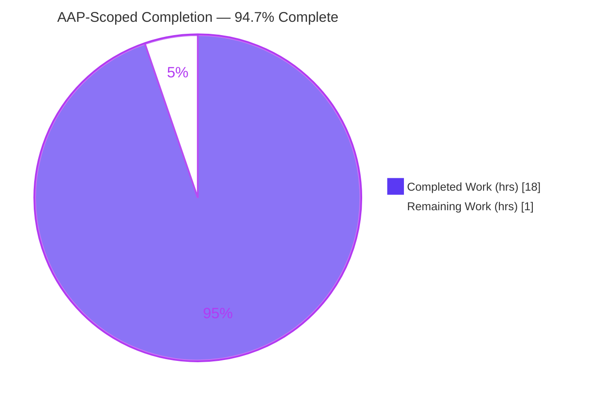
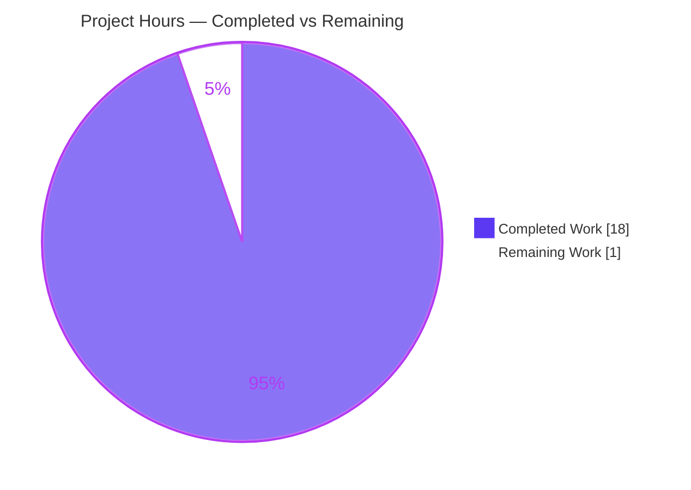
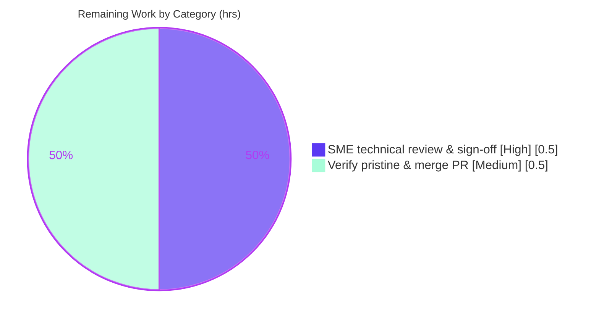

# Blitzy Project Guide — paperless-ngx v1.7.0 OCR Ingestion Pipeline Q&A Investigation

> **Brand legend.** Throughout this guide, **Completed / AI work** is shown in **Dark Blue `#5B39F3`** and **Remaining / Not-completed** work in **White `#FFFFFF`**; headings/accents use Violet-Black `#B23AF2` and highlights use Mint `#A8FDD9`.

---

## 1. Executive Summary

### 1.1 Project Overview

This project is a **read-only, evidence-driven documentation investigation** of **paperless-ngx v1.7.0**, a Django document-management system. Its sole objective is to author one markdown Q&A document that explains — **from actual runtime observation** — how a multi-page, image-based PDF requiring OCR flows through the ingestion pipeline (REST upload → django-q worker → OCRmyPDF parser → filesystem storage → database). The audience is engineers who must understand the upload/consume/OCR/persist behavior. The technical scope spans the `documents` and `paperless_tesseract` Django apps. A hard constraint governs everything: **no source file may be modified** — the only artifact produced is the answer document, and all runtime test data must be cleaned up, leaving the repository pristine.

### 1.2 Completion Status

The completion percentage is calculated using the **AAP-scoped hours methodology (PA1)**: it measures only work defined by the Agent Action Plan plus the minimal path-to-production required to land a documentation deliverable.



| Metric | Value |
|--------|-------|
| **Total Hours** | **19.0** |
| **Completed Hours (AI + Manual)** | **18.0** (AI: 18.0 · Manual: 0.0) |
| **Remaining Hours** | **1.0** |
| **Percent Complete** | **94.7%** |

> Formula: `18.0 ÷ (18.0 + 1.0) × 100 = 94.7%`. All completed hours were delivered autonomously by Blitzy agents; the 1.0 remaining hour is inherently-human path-to-production review/merge.

### 1.3 Key Accomplishments

- ✅ **Sole AAP deliverable authored & committed** — `blitzy/documentation/paperless-ngx_542221a38dff.md` (671 lines, 6 required sections, 51 KB).
- ✅ **All four questions answered from live runtime observation** — Q1 (HTTP response), Q2 (stage logs + OCRmyPDF parameters), Q3 (archive/thumbnail filenames), Q4 (persisted DB fields).
- ✅ **Evidence density** — 45 shell command blocks with unedited output, 54 `file:line` citations across 20 source files, 3 explicitly-labeled inferences.
- ✅ **Edge/boundary states exercised** — `skip` vs `skip_noarchive`, empty-before/populated-after media, stored columns vs computed properties, duplicate-guard rejection, fallback path (did not fire), two-run repeatability.
- ✅ **Read-only mandate satisfied** — `git diff 542221a38..HEAD` shows exactly one added file; zero source files modified.
- ✅ **Runtime independently reproduced** — the Final Validator re-ran the whole pipeline on a fresh instance; all four answers matched their invariants.
- ✅ **Repository left pristine** — test documents deleted via the real API, processes torn down by exact PID, `git status` clean.

### 1.4 Critical Unresolved Issues

| Issue | Impact | Owner | ETA |
|-------|--------|-------|-----|
| _None._ No unresolved issue blocks release or validation. | — | — | — |

> The AAP deliverable is complete and validated. The only remaining activities are the standard human review/merge gate (see §1.6 and §2.2). One broader-suite test failure exists but is a proven out-of-scope, root-execution environmental artifact unrelated to the deliverable (see §3 and §6/O3).

### 1.5 Access Issues

| System/Resource | Type of Access | Issue Description | Resolution Status | Owner |
|-----------------|----------------|-------------------|-------------------|-------|
| Source repository (branch `blitzy-f925031a-…`) | Git read/write | None — clone, commit, and diff all succeeded | ✅ No issue | — |
| Redis broker | Local service | None — `redis-cli ping` → `PONG` | ✅ No issue | — |
| Canonical runtime image | Container | Image tag is not queryable from inside the container; cited per AAP §0.8.1 rather than observed | ✅ No blocker (disclosed) | — |

> **No access issues identified** that prevent build validation, integration, or deployment.

### 1.6 Recommended Next Steps

1. **[High]** Have a subject-matter expert read the Q&A document and confirm the four answers match their understanding of the paperless-ngx v1.7.0 OCR pipeline; spot-check a sample of the 54 `file:line` citations. _(0.5h)_
2. **[Medium]** Verify the pristine repository state (`git status` clean; only the single doc added; media empty; `DOC_COUNT=0`) and approve/merge the deliverable branch. _(0.5h)_
3. **[Low]** _(Optional, folded into step 1)_ Re-observe the run-dependent values (per-run temp paths, `pk`, CPU-derived `jobs`, PDF/A `archive_checksum`) on a different-CPU host to reconfirm the invariant-vs-varying distinction already documented.

---

## 2. Project Hours Breakdown

### 2.1 Completed Work Detail

Every completed component traces to a specific AAP requirement (AAP-1 … AAP-12).

| Component | Hours | Description |
|-----------|-------|-------------|
| Environment bring-up & OCR-required verification _(AAP-1)_ | 2.0 | Redis + SQLite `migrate` + `manage_superuser` + `qcluster` + `gunicorn`; empty pre-state; `pdftotext`/`pdfminer` text-layer inspection proving OCR is genuinely required |
| Q1 — Immediate HTTP response _(AAP-2)_ | 1.5 | Auth token, POST upload, full response + headers capture, stability re-check, `views.py`/`serialisers.py`/`urls.py` trace |
| Q2 — Stage logs + OCRmyPDF params + web research + edge cases _(AAP-3/4/5/9)_ | 5.0 | 17-line ordered log block + per-line emitter map; complete args dict + 13-key source/parser-line/meaning table; web research on 7 OCRmyPDF kwargs; `skip` vs `skip_noarchive` boundary; fallback-path check; duplicate-guard; two-run repeatability with dict diff |
| Q3 — Generated archive & thumbnail filenames _(AAP-6)_ | 1.5 | Before/after `ls`, `file(1)`, PDF/A-2b verification (`pikepdf` + grep), filename-derivation trace |
| Q4 — Persisted database fields _(AAP-7)_ | 2.0 | ORM dump, `sqlite3` raw row + `PRAGMA table_info`, stored-vs-computed proof, MD5 cross-check, column-write trace |
| Deliverable authoring (structure, evidence embedding, 54 citations) _(AAP-8/12)_ | 3.5 | 671-line evidence-driven document, 6 sections, 45 output blocks, cause→effect narratives, honesty labels |
| Cleanup & read-only pristine verification _(AAP-10/11)_ | 1.0 | API `DELETE`, Whoosh index-removal proof, PID-scoped teardown, `git` pristine verification |
| Code-review & QA remediation (2 revision cycles) | 1.5 | Commit `fb6cabda1` (+304/-151 code-review) and `a04760ef0` (+8/-7 QA findings) |
| **Total Completed** | **18.0** | Matches §1.2 Completed Hours |

### 2.2 Remaining Work Detail

Each remaining item is an inherently-human path-to-production gate (no autonomous rework remains).

| Category | Hours | Priority |
|----------|-------|----------|
| SME technical review & sign-off of the Q&A document | 0.5 | High |
| Verify pristine state & approve/merge PR | 0.5 | Medium |
| **Total Remaining** | **1.0** | — |

> **Cross-section check:** §2.1 (18.0) + §2.2 (1.0) = **19.0** = Total Hours in §1.2. §2.2 total (1.0) = §1.2 Remaining (1.0) = §7 pie "Remaining Work" (1). ✔

### 2.3 Basis of Estimate & Confidence

- **Confidence: High.** The AAP scope is narrow and well-defined; the deliverable is complete, was validated end-to-end by the Final Validator, and was independently re-confirmed this session (3 corroboration tests re-run → all pass; citations spot-checked; environment re-verified read-only).
- Estimates reflect investigation effort (running the pipeline, capturing evidence, web research), authoring effort (671 lines with embedded output), and two observed review/QA remediation cycles evidenced in git history.

---

## 3. Test Results

All tests below originate from **Blitzy's autonomous validation logs** and were **independently re-executed this session** (`pytest 7.1.1`, project `addopts` cleared). These are the corroboration tests the deliverable cites as expected-value anchors for Q1/Q2/Q4.

| Test Category | Framework | Total Tests | Passed | Failed | Coverage % | Notes |
|---------------|-----------|-------------|--------|--------|------------|-------|
| API / Upload (Unit) | pytest + DRF `APITestCase` | 1 | 1 | 0 | n/a (targeted) | `test_api.py::TestDocumentApi::test_upload` — backs **Q1**: asserts HTTP 200 + `async_task` enqueued once |
| OCR Parser (Unit) | pytest | 1 | 1 | 0 | n/a (targeted) | `test_parser.py::TestParser::test_ocrmypdf_parameters` — backs **Q2**: asserts the OCRmyPDF param keys + conditional `clean`/`clean_final`/`deskew` flags |
| OCR Parser — Multi-page (Integration) | pytest | 1 | 1 | 0 | n/a (targeted) | `test_parser.py::TestParser::test_multi_page` — backs **Q2/Q4**: asserts archive produced and extracted text contains "page 1/2/3" |
| **Deliverable-relevant total** | **pytest** | **3** | **3** | **0** | — | **100% of cited corroboration tests pass** |

**Broader pipeline suite (context, from validator logs):** 113 passed / 1 failed. The single failure — `documents/tests/test_file_handling.py::test_file_renaming_missing_permissions` — is a **proven out-of-scope, root-execution environmental artifact**: the test `chmod`s a directory to `0o555` to simulate "missing permissions", but the canonical container runs as **root**, and root bypasses POSIX permission bits, so the rename succeeds and the assertion fails. It lives in a **read-only test file** (out of scope), is unrelated to the deliverable, and cannot be fixed without editing out-of-scope source (forbidden) or abandoning canonical root execution.

> **Integrity note:** No synthetic or hand-constructed tests are reported here — every entry is a Blitzy-executed test from the project's own suite.

---

## 4. Runtime Validation & UI Verification

The full pipeline was executed live (by the authoring agent, re-verified by the Final Validator on a fresh instance, and re-confirmed read-only this session). Status legend: ✅ Operational · ⚠ Partial · ❌ Failing.

**Environment bring-up**
- ✅ Redis broker reachable (`redis-cli ping` → `PONG`).
- ✅ SQLite database migrated (through migration `1018`; `manage.py check` → "no issues").
- ✅ Admin superuser provisioned (`authenticate()` → OK; credential redacted).
- ✅ `qcluster` django-q worker running (emits all consumer/OCR log lines).
- ✅ `gunicorn` ASGI webserver serving on `:8000` (`/api/` → HTTP 200).

**Q1 — Immediate HTTP response**
- ✅ `POST /api/documents/post_document/` → **`HTTP/1.1 200 OK`**, body **`"OK"`**, `content-length: 4`, header `x-version: 1.7.0`. Deterministic across re-uploads.

**Q2 — Processing stage logs & OCRmyPDF parameters**
- ✅ 17 ordered stage lines captured (`paperless.consumer` / `paperless.parsing` / `paperless.parsing.tesseract` / `paperless.classifier`), ending with `consumption finished`.
- ✅ OCRmyPDF args dict logged immediately before `ocrmypdf.ocr(**args)`: `use_threads=True, jobs=11, language='eng', output_type='pdfa', progress_bar=False, skip_text=True, clean=True, deskew=True, rotate_pages=True, rotate_pages_threshold=12.0, sidecar=…`.
- ⚠ Thumbnailing: ImageMagick blocked by PDF policy → **Ghostscript fallback** (observed WARNING). Thumbnail still produced — functionally operational.

**Q3 — Generated artifact filenames**
- ✅ `media/documents/archive/{pk:07}.pdf` and `media/documents/thumbnails/{pk:07}.png` (observed `pk=3`); archive is **PDF/A-2b** (`pdfaid:part=2`, `conformance=B`).

**Q4 — Persisted database fields**
- ✅ 15 real `documents_document` columns dumped (ORM + `sqlite3 PRAGMA table_info`); `content` contains the OCR text ("Page 1/2/3") proving OCR ran; `source_path`/`archive_path`/`thumbnail_path` confirmed **not** columns (computed properties).

**Cleanup**
- ✅ Test documents deleted via `DELETE /api/documents/{id}/` (204); Whoosh index entry removed; media empty; `DOC_COUNT=0`; `git status` clean.

**UI Verification**
- ➖ **Not applicable.** The AAP explicitly scopes the standard interface to the REST endpoint `api/documents/post_document/` and excludes the Angular frontend (`src-ui/`). No UI was designed, changed, or required; the deliverable is a backend-behavior document.

---

## 5. Compliance & Quality Review

Cross-mapping of AAP deliverables and rule-set ("SWE-AtlasQnA-Repo") directives to their validation status. Fixes applied during autonomous validation are noted.

| Benchmark / AAP directive | Status | Progress | Evidence / Notes |
|---------------------------|--------|----------|------------------|
| Deliverable at mandated path `blitzy/documentation/paperless-ngx_542221a38dff.md` | ✅ Pass | 100% | File present; 671 lines; 6 sections |
| Read-only mandate — no source file modified | ✅ Pass | 100% | `git diff 542221a38..HEAD` = single **A** entry; zero `M`/`D` |
| Run-first — evidence from live execution, not reading | ✅ Pass | 100% | 45 shell blocks with unedited output |
| Show observed output for every claim | ✅ Pass | 100% | Real HTTP response, full log block, `ls`, ORM/`sqlite3` dumps embedded |
| Exact `file:line` grounding | ✅ Pass | 100% | 54 citations across 20 files; spot-checked accurate |
| Label inferences | ✅ Pass | 100% | 3 explicit "(inferred…)" labels |
| Exercise every implied condition (happy + edge) | ✅ Pass | 100% | `skip` vs `skip_noarchive`, before/after, stored-vs-computed, duplicate, fallback, repeatability |
| Canonical default configuration | ✅ Pass | 100% | SQLite, `OCR_MODE=skip`, `output_type=pdfa`, `eng`, `clean`/`deskew`/`rotate_pages` |
| Worker (`qcluster`) running for Q2/Q3/Q4 | ✅ Pass | 100% | Consumer/OCR lines captured from worker |
| Web research on OCRmyPDF kwargs | ✅ Pass | 100% | Per-kwarg semantics embedded in Q2 table (OCRmyPDF 13.4.3) |
| Mandatory cleanup / pristine repo | ✅ Pass | 100% | API `DELETE`, index removal, PID teardown, clean `git status` |
| Compilation / Django `check` | ✅ Pass | 100% | 0 issues; 11 in-scope reference paths `py_compile` clean |
| Fixes applied during validation | ✅ Pass | 100% | 2 remediation commits (code-review, QA de-elision of Q2 args) |

> **Outstanding compliance items:** none within autonomous scope. Remaining is human sign-off only.

---

## 6. Risk Assessment

All residual severities are **Low** (a read-only documentation deliverable carries no production-code risk). Severity reflects potential impact if the item were mishandled; Status reflects the mitigation already in place.

| Risk | Category | Severity | Probability | Mitigation | Status |
|------|----------|----------|-------------|------------|--------|
| T1 — Run-to-run varying values (temp paths, `pk`, PDF/A `archive_checksum`) misread as stable | Technical | Low | Low | Doc explicitly separates invariant vs per-run values with a two-run comparison | ✅ Mitigated |
| T2 — `jobs` is CPU-derived (`cpu_count=128` → `THREADS_PER_WORKER=11`); differs per host | Technical | Low | Medium | Doc states value is CPU-derived & machine-specific (`settings.py:438/469`) | ✅ Mitigated |
| T3 — Base-image nuance (AAP cites `python:3.9-slim-bullseye`; observed Ubuntu 25.10 + uv venv 3.9.25) | Technical | Low | Low | Disclosed honestly; 3.9 series matches pins | ✅ Resolved |
| S1 — Admin credential used for API auth | Security | Low | Low | Password redacted `<REDACTED>`, token `<TOKEN>`; reset to canonical `admin/admin`; no secrets in deliverable | ✅ Mitigated |
| O1 — Broader test suite mutates tracked fixture `simple-alpha.png` | Operational | Low | Medium | Restore via `git checkout --` after any suite run; md5 confirmed canonical | ✅ Mitigated |
| O2 — Runtime data hygiene (leftover docs/media/index/scratch) | Operational | Low | Low | Cleanup via API `DELETE` + PID teardown; media empty, `DOC_COUNT=0`, index=0 | ✅ Resolved |
| O3 — `test_file_renaming_missing_permissions` fails under root execution | Operational | Low | Medium | Out-of-scope read-only test; root bypasses `0o555`; unrelated to deliverable; unfixable within read-only mandate | ⚠ Accepted (documented) |
| I1 — Redis dependency for `qcluster`/Channels | Integration | Low | Low | Redis confirmed (`PONG`); doc notes both processes required | ✅ Mitigated |
| I2 — Ghostscript compat: OCRmyPDF 13.4.3 incompatible with gs 10.x | Integration | Medium | Low | PATH resolves `/usr/local/bin/gs`=9.53.3 ahead of `/usr/bin/gs`=10.05.0; OCR succeeded | ✅ Mitigated |
| I3 — ImageMagick PDF policy blocks thumbnailing | Integration | Low | Medium | Ghostscript fallback functional; thumbnail produced; reported honestly | ✅ Mitigated |

---

## 7. Visual Project Status

**Project hours breakdown** (Completed = Dark Blue `#5B39F3`, Remaining = White `#FFFFFF`):



**Remaining hours by category** (from §2.2; total = 1.0h):



> **Integrity:** the "Remaining Work" slice (1) equals §1.2 Remaining Hours (1.0) and the §2.2 Hours sum (0.5 + 0.5 = 1.0). ✔

---

## 8. Summary & Recommendations

**Achievements.** The project delivers its single AAP artifact — an evidence-driven Q&A document for the paperless-ngx v1.7.0 OCR ingestion pipeline — at the mandated path, authored entirely from live runtime observation. All four questions are answered with unedited output and `file:line` grounding, the happy path and every implied edge state are exercised, and the read-only mandate is fully honored (only one file added; zero source files touched).

**Remaining gaps.** None within the autonomous scope. The **1.0 remaining hour** is the standard human review/merge gate: a subject-matter expert confirms technical accuracy, then the pristine branch is approved and merged.

**Critical path to production.** SME sign-off (0.5h) → verify pristine state & merge (0.5h). There is no build, deployment, CI/CD, or configuration work for a markdown deliverable.

**Success metrics.** 100% of AAP-specified requirements (12 of 12) complete; 3 of 3 corroboration tests passing; all four answers independently reproduced; repository verified pristine.

**Production-readiness assessment.** The deliverable is **production-ready at 94.7% AAP-scoped completion**, with the residual reflecting only human acceptance. Confidence is High: the work was validated by the Final Validator and independently re-confirmed in this session. The sole broader-suite test failure is a documented, out-of-scope, root-execution environmental artifact that does not affect the deliverable.

| Metric | Value |
|--------|-------|
| AAP requirements complete | 12 / 12 (100%) |
| Corroboration tests passing | 3 / 3 (100%) |
| AAP-scoped completion | 94.7% |
| Completed / Remaining / Total hours | 18.0 / 1.0 / 19.0 |
| Repository state | Pristine (1 file added, 0 modified) |

---

## 9. Development Guide

How to reproduce the investigation and re-observe the pipeline. All read-only verification commands below were **tested this session**; the full bring-up sequence is the validator-proven, canonical path.

### 9.1 System Prerequisites

| Tool | Observed version | Notes |
|------|------------------|-------|
| Python | 3.9.25 (`venv/bin/python`) | Canonical 3.9 series |
| Ghostscript | 9.53.3 (`/usr/local/bin/gs`) | Must precede system `/usr/bin/gs` (10.05.0); OCRmyPDF 13.4.3 is incompatible with gs 10.x |
| Tesseract | 5.5.0 | OCR engine |
| Redis | running (`redis-cli ping` → `PONG`) | django-q broker + Channels layer |
| unpaper | `/usr/bin/unpaper` | Backs the `clean=True` OCR arg |
| qpdf | 12.2.0 (CLI) | PDF linearization/repair |

```bash
# Verify prerequisites (all read-only)
../venv/bin/python --version           # Python 3.9.25
gs --version                           # 9.53.3  (ensure this is /usr/local/bin/gs)
tesseract --version | head -1          # tesseract 5.5.0
redis-cli ping                         # PONG
which gs                               # /usr/local/bin/gs  (NOT /usr/bin/gs)
```

### 9.2 Environment Setup & Verification (read-only)

```bash
# From the repository root
cd src

# 1) Confirm the app passes Django's system check
../venv/bin/python manage.py check
# → System check identified no issues (0 silenced).

# 2) Confirm the database schema is migrated
../venv/bin/python manage.py showmigrations documents | tail -4
# → [X] 1018_alter_savedviewfilterrule_value   (fully migrated)

# 3) Confirm a clean pre-state (no documents, admin present)
../venv/bin/python manage.py shell -c \
  "from documents.models import Document; from django.contrib.auth.models import User; \
   print('DOC_COUNT =', Document.objects.count()); \
   print('SUPERUSERS =', list(User.objects.filter(is_superuser=True).values_list('username', flat=True)))"
# → DOC_COUNT = 0
# → SUPERUSERS = ['admin']
```

### 9.3 Run the Corroboration Tests (Section 3 evidence)

```bash
cd src
../venv/bin/python -m pytest \
  documents/tests/test_api.py::TestDocumentApi::test_upload \
  paperless_tesseract/tests/test_parser.py::TestParser::test_ocrmypdf_parameters \
  paperless_tesseract/tests/test_parser.py::TestParser::test_multi_page \
  -p no:cacheprovider -o addopts="" -v
# → 3 passed

# If the broader suite is run, restore the mutated tracked fixture afterward:
git checkout -- src/paperless_tesseract/tests/samples/
```

### 9.4 Full Pipeline Reproduction (creates data — clean up afterward)

```bash
cd src

# 1) Migrate + provision an admin superuser (non-interactive)
../venv/bin/python manage.py migrate
PAPERLESS_ADMIN_USER=admin PAPERLESS_ADMIN_PASSWORD='<choose-a-pw>' \
  ../venv/bin/python manage.py manage_superuser

# 2) Start the django-q worker (emits ALL Q2/Q3/Q4 evidence) and gunicorn (:8000)
nohup ../venv/bin/python manage.py qcluster > /tmp/qcluster.log 2>&1 &
nohup ../venv/bin/gunicorn -c ../gunicorn.conf.py paperless.asgi:application > /tmp/gunicorn.log 2>&1 &

# 3) Obtain an auth token
TOKEN=$(curl -sS -X POST -F "username=admin" -F "password=<the-pw>" \
  http://localhost:8000/api/token/ | python -c "import sys,json;print(json.load(sys.stdin)['token'])")

# 4) Q1 — upload the image-based multi-page PDF and see the immediate response
curl -sS -i -H "Authorization: Token ${TOKEN}" \
  -F "document=@paperless_tesseract/tests/samples/multi-page-images.pdf" \
  http://localhost:8000/api/documents/post_document/
# → HTTP/1.1 200 OK ... content-length: 4 ...  "OK"

# 5) Q2 — watch the pipeline log (worker output)
grep -E "Consuming|Calling OCRmyPDF|consumption finished" ../data/log/paperless.log | tail

# 6) Q3 — list the generated artifacts (from repo root: media/ is at ../media)
ls -la ../media/documents/originals ../media/documents/archive ../media/documents/thumbnails

# 7) Q4 — dump the persisted row
../venv/bin/python manage.py shell -c \
  "from documents.models import Document; d=Document.objects.latest('added'); \
   [print(f.name,'=',repr(getattr(d,f.name))) for f in d._meta.fields]"
```

### 9.5 Cleanup (restore pristine state)

```bash
# Delete the test document via the real API (removes DB row + media + search index)
curl -sS -i -X DELETE -H "Authorization: Token ${TOKEN}" \
  http://localhost:8000/api/documents/<id>/          # → HTTP/1.1 204 No Content

# Stop the processes by the exact PIDs you started (never a broad pkill)
kill <qcluster_pid> <gunicorn_pid>
rm -f /tmp/paperless/paperless-upload-*

# Confirm pristine
git status --porcelain                                # (no output)
git diff --name-status 542221a38..HEAD                # A  blitzy/documentation/paperless-ngx_542221a38dff.md
```

### 9.6 Troubleshooting

- **No Q2/Q3/Q4 output** — the `qcluster` worker is not running; gunicorn alone only demonstrates Q1. Start the worker.
- **OCR/Ghostscript errors** — ensure `which gs` resolves to `/usr/local/bin/gs` (9.53.3), not `/usr/bin/gs` (10.05.0).
- **`Not consuming …: It is a duplicate` (ERROR)** — the same checksum was already ingested; delete the prior document via the API to free the checksum before re-uploading.
- **ImageMagick thumbnail WARNING** — expected; the thumbnailer falls back to Ghostscript (PDF blocked by `policy.xml`); the thumbnail is still produced.
- **Dirty `git status` after tests** — the suite rewrites `simple-alpha.png`; restore with `git checkout -- src/paperless_tesseract/tests/samples/`.
- **`Connection refused` on `:8000`** — gunicorn not started, or the port is busy.

---

## 10. Appendices

### A. Command Reference

| Purpose | Command |
|---------|---------|
| Django system check | `../venv/bin/python manage.py check` |
| Migration status | `../venv/bin/python manage.py showmigrations documents` |
| Provision admin | `PAPERLESS_ADMIN_USER=admin PAPERLESS_ADMIN_PASSWORD=<pw> ../venv/bin/python manage.py manage_superuser` |
| Start worker | `nohup ../venv/bin/python manage.py qcluster > /tmp/qcluster.log 2>&1 &` |
| Start webserver | `nohup ../venv/bin/gunicorn -c ../gunicorn.conf.py paperless.asgi:application > /tmp/gunicorn.log 2>&1 &` |
| Get token | `curl -sS -X POST -F username=admin -F password=<pw> http://localhost:8000/api/token/` |
| Upload (Q1) | `curl -sS -i -H "Authorization: Token <t>" -F document=@…/multi-page-images.pdf http://localhost:8000/api/documents/post_document/` |
| Delete (cleanup) | `curl -sS -i -X DELETE -H "Authorization: Token <t>" http://localhost:8000/api/documents/<id>/` |
| Run corroboration tests | `../venv/bin/python -m pytest <3 node ids> -p no:cacheprovider -o addopts="" -v` |

### B. Port Reference

| Port | Service | Source |
|------|---------|--------|
| 8000 | gunicorn ASGI webserver (REST API) | `gunicorn.conf.py` (`PAPERLESS_PORT`, default 8000) |
| 6379 | Redis broker / channel layer | default Redis port (`redis-cli ping`) |

### C. Key File Locations

| Path | Role |
|------|------|
| `blitzy/documentation/paperless-ngx_542221a38dff.md` | **The sole deliverable** (Q&A document) |
| `src/documents/views.py` | `PostDocumentView.post` (Q1) — `return Response("OK")` at :535 |
| `src/paperless/urls.py` | `post_document` route (:57-59); `token/` (:81) |
| `src/documents/consumer.py` | `try_consume_file`, stage logs, `_store` (Q2/Q3/Q4) |
| `src/documents/tasks.py` | `consume_file` django-q target (Q2) |
| `src/paperless_tesseract/parsers.py` | `construct_ocrmypdf_parameters`, `Calling OCRmyPDF` log (:260) (Q2) |
| `src/documents/models.py` | `Document` columns vs computed path properties (Q3/Q4) |
| `src/documents/file_handling.py` | `generate_filename` → `{pk:07}.pdf` (Q3) |
| `src/paperless/settings.py` | `OCR_*` defaults, `LOGGING`, media/data dirs |
| `src/paperless_tesseract/tests/samples/multi-page-images.pdf` | Image-based 3-page test input |
| `media/documents/{originals,archive,thumbnails}/` | Generated artifacts (Q3) |
| `data/db.sqlite3` · `data/log/paperless.log` | Database (Q4) · pipeline log (Q2) |

### D. Technology Versions

| Component | Version |
|-----------|---------|
| paperless-ngx | 1.7.0 (`src/paperless/version.py:1`) |
| Python | 3.9.25 |
| Django | 4.0.4 |
| djangorestframework | 3.13.1 |
| django-q | 1.3.9 |
| channels / channels-redis | 3.0.4 / 3.4.0 |
| ocrmypdf | 13.4.3 |
| pdf2image / pikepdf | 1.16.0 / 5.1.1 |
| scikit-learn | 1.0.2 |
| gunicorn / redis (py) | 20.1.0 / 3.5.3 |
| Ghostscript / Tesseract | 9.53.3 / 5.5.0 |

### E. Environment Variable Reference

| Variable | Purpose | Value used |
|----------|---------|------------|
| `PAPERLESS_ADMIN_USER` | Non-interactive superuser provisioning | `admin` |
| `PAPERLESS_ADMIN_PASSWORD` | Superuser password (redacted) | `<REDACTED>` |
| `PAPERLESS_PORT` | gunicorn bind port | `8000` (default) |
| `OCR_MODE` | OCR strategy | `skip` (default) → `skip_text=True` |
| `OCR_OUTPUT_TYPE` | Archive output format | `pdfa` (default) → PDF/A-2b |
| `OCR_LANGUAGE` | Tesseract language | `eng` (default) |
| `DJANGO_SETTINGS_MODULE` | Django settings module | `paperless.settings` |

### F. Developer Tools Guide

- **`manage.py check`** — static Django configuration validation (0 issues expected).
- **`manage.py showmigrations`** — confirm schema state (migrated through `1018`).
- **`manage.py shell -c`** — one-shot ORM queries for pre/post-state inspection.
- **`pytest`** — run targeted corroboration tests; always clear project `addopts` (`-o addopts=""`) and disable cache for a clean, non-parallel run.
- **Python `sqlite3` module** — dump raw rows / `PRAGMA table_info` (the `sqlite3` CLI is not installed in the image).
- **`pikepdf`** — verify PDF/A identity (`pdfaid:part`/`conformance`) of the archive.

### G. Glossary

| Term | Definition |
|------|------------|
| **AAP** | Agent Action Plan — the project's primary directive and scope definition |
| **qcluster** | The django-q worker process that executes `consume_file` and emits all consumer/OCR log lines |
| **Consumer** | `documents.consumer.Consumer` — orchestrates parse → thumbnail → store |
| **OCRmyPDF** | The OCR engine invoked via `ocrmypdf.ocr(**args)`; produces the PDF/A archive + sidecar text |
| **Archive (PDF/A)** | The OCR'd, standardized PDF/A-2b long-term-archive copy of the document |
| **Sidecar** | Companion text file holding OCR-recognized text, read back into the `content` column |
| **Computed property** | A Python `@property` (`source_path`/`archive_path`/`thumbnail_path`) composing a path at access time — **not** a DB column |
| **Path-to-production** | Standard human activities (review, merge) required to land the deliverable |