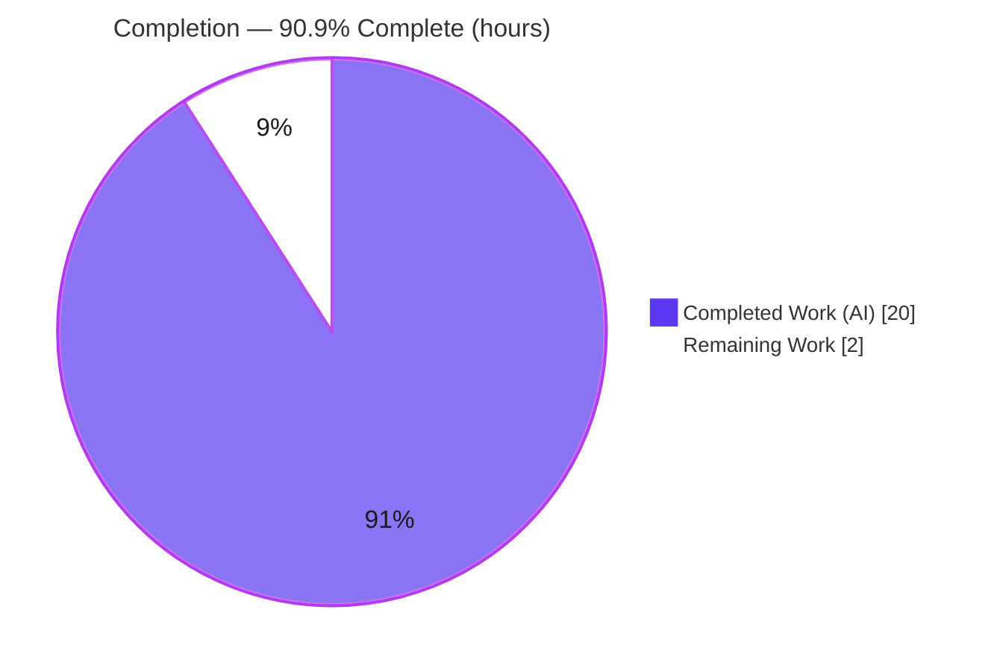

# Blitzy Project Guide — paperless-ngx Background/Async Processing Q&A

> **Brand color legend.** Completed / AI Work = Dark Blue `#5B39F3` · Remaining / Not Completed = White `#FFFFFF` · Headings / Accents = Violet-Black `#B23AF2` · Highlight = Mint `#A8FDD9`.

---

## 1. Executive Summary

### 1.1 Project Overview

This project delivers a single, code-grounded Markdown document — `blitzy/documentation/paperless-ngx_542221a38dff.md` — that explains how **paperless-ngx** performs background/asynchronous processing during document ingestion at runtime. It answers six investigative questions (runtime services, how a job appears, waiting-vs-active work, where task state is stored, after-the-fact outcome inspection, and the enqueue/dispatch code), grounded entirely in the repository's actual stack: **Django-Q 1.3.9 over a Redis broker** (explicitly *not* Celery). The target audience is engineers and reviewers who need an authoritative, citation-backed reference. The technical scope is read-only investigation plus runtime verification; **zero source files are modified** — the only artifact is the additive documentation file.

### 1.2 Completion Status



| Metric | Hours |
|---|---|
| **Total Hours** | 22.0 |
| **Completed Hours (AI + Manual)** | 20.0  (AI: 20.0 · Manual: 0.0) |
| **Remaining Hours** | 2.0 |
| **Percent Complete** | **90.9%** (20.0 / 22.0) |

> The completion percentage is computed strictly on AAP-scoped work plus standard path-to-production activity (PA1 methodology). All AAP deliverables are complete; the remaining 2.0h is human review and merge — the mandatory gate that keeps completion below 100%.

### 1.3 Key Accomplishments

- ✅ **Single deliverable authored and committed** — `blitzy/documentation/paperless-ngx_542221a38dff.md` (431 lines, ~50 KB), across 2 commits by `agent@blitzy.com`.
- ✅ **All six questions answered** across a 12-section document (§1–§12) with a dedicated, evidence-backed section per question.
- ✅ **Central thesis proven** — engine is **Django-Q, not Celery** (`grep -ri celery src/` returns **zero** matches); Redis's **dual role** (task broker + Channels WebSocket layer) is documented.
- ✅ **173 distinct `[path:locator]` citations** across 18 files verified exact during autonomous validation; re-spot-checked this session (views.py:L523, settings.py:L449-457, supervisord.conf:L10-29 — all exact).
- ✅ **Runtime behavior empirically validated** — an isolated end-to-end `qcluster` run confirmed enqueue → waiting (`queue_size`/`LLEN`=1) → drain → durable `django_q_task` row (`success=True`, `result=120`, `attempt_count=1`), readable via `result()`.
- ✅ **Q6 producer set is complete** — exhaustive grep confirms 4 event-driven `async_task` sites + 4 scheduled `schedule()` producers; the 2nd commit added `process_mail_accounts`, exceeding the AAP's initial sketch.
- ✅ **Binding constraints honored** — zero source modifications; working tree clean (`git status --porcelain` empty); all temporary verification artifacts removed.

### 1.4 Critical Unresolved Issues

| Issue | Impact | Owner | ETA |
|---|---|---|---|
| _None_ — no blocking or release-impacting issues. The single deliverable is complete, committed, well-formed, and fully validated; zero defects were found across all validation gates. | None | — | — |

### 1.5 Access Issues

| System/Resource | Type of Access | Issue Description | Resolution Status | Owner |
|---|---|---|---|---|
| _No access issues identified._ All resources required for this documentation task (repository read access, gitignored project `venv`, local Redis) were available; the deliverable requires no external credentials, API keys, or third-party services. | — | — | — | — |

### 1.6 Recommended Next Steps

1. **[Medium]** Have a subject-matter expert read the deliverable and confirm it correctly answers all six questions (Q1–Q6). *(1.0h)*
2. **[Medium]** Spot-check a representative sample of `[path:locator]` citations against the current source (e.g., `views.py:L523`, `settings.py:L449-457`, `supervisord.conf:L10-29`, `consumer.py:L56-76`). *(0.5h)*
3. **[Low]** Approve and merge the branch; confirm the file lands at `blitzy/documentation/paperless-ngx_542221a38dff.md` in the destination. *(0.5h)*
4. **[Low]** _(Optional)_ Link the document from an internal index/wiki if broader discoverability beyond the `blitzy/documentation/` path is desired.

---

## 2. Project Hours Breakdown

### 2.1 Completed Work Detail

| Component | Hours | Description |
|---|---|---|
| Repository scope discovery & code investigation | 5.0 | Read-only trace of the full async subsystem across 18 files — all `async_task` call sites, the `consume_file` pipeline, the Redis channel layer, `Q_CLUSTER`/`CHANNEL_LAYERS` config, and the scheduling migrations (AAP Q1–Q6 evidence gathering). |
| Web research — Django-Q docs validation | 1.5 | Corroboration of runtime terminology against the official Django-Q docs (architecture, brokers, `queue_size()` semantics, OrmQ applicability, result records). |
| Runtime verification & library introspection | 3.5 | `venv` + Redis setup; introspection of pinned Django-Q 1.3.9 (broker `rpush`/`blpop`/`llen`, list key, package shape, `Task`/`Success`/`Failure`/`OrmQ` models); isolated end-to-end `qcluster` run. |
| Document authoring | 7.0 | The 431-line, 12-section Q&A: executive summary, per-question sections, mermaid sequence diagram, methodology & references, and per-section "Why/How verified" rationale, with ~173 inline citations. |
| Autonomous validation (4 gates) | 2.5 | Citation accuracy (173 points / 18 files), markdown well-formedness, library/behavioral introspection, live runtime drain, and scope/safety checks. |
| Cleanup & scope safety | 0.5 | Removal of all temporary artifacts; verification of clean working tree and zero source modifications. |
| **Total Completed** | **20.0** | Matches Completed Hours in §1.2. |

### 2.2 Remaining Work Detail

| Category | Hours | Priority |
|---|---|---|
| Human Technical Review & Sign-off | 1.5 | Medium |
| Merge & Publish to Destination | 0.5 | Low |
| **Total Remaining** | **2.0** | Matches Remaining Hours in §1.2 and §7 pie chart. |

### 2.3 Hours Reconciliation

| Check | Result |
|---|---|
| Completed (§2.1) + Remaining (§2.2) | 20.0 + 2.0 = **22.0** = Total in §1.2 ✓ |
| Remaining hours across §1.2 ↔ §2.2 ↔ §7 | 2.0 = 2.0 = 2.0 ✓ |
| Completion % | 20.0 / 22.0 = **90.9%** ✓ |

---

## 3. Test Results

Because the deliverable is a documentation artifact, the standard quality gates map onto documentation-specific validation: **"compilation" ⇒ citation accuracy + markdown well-formedness + the codebase still passing Django's system check; "tests" ⇒ library/behavioral introspection assertions; "runtime" ⇒ a live, isolated end-to-end `qcluster` execution.** All results below originate from Blitzy's autonomous validation logs for this project and were re-confirmed this session.

| Test Category | Framework / Method | Total Checks | Passed | Failed | Coverage % | Notes |
|---|---|---|---|---|---|---|
| Citation Accuracy | Source `[path:locator]` verification (grep/sed) | 173 | 173 | 0 | 100% | Every distinct `(file,line)` citation across 18 files verified exact. |
| Markdown Well-Formedness | Structural lint (fences/mermaid) | 9 | 9 | 0 | 100% | 8 balanced code fences + 1 valid mermaid `sequenceDiagram`; zero placeholders/TODOs. |
| Negative Evidence (no Celery) | `grep -ri celery src/` | 1 | 1 | 0 | 100% | Zero matches — confirms the Django-Q-not-Celery thesis. |
| Django System Check | `manage.py check` | 1 | 1 | 0 | 100% | "System check identified no issues (0 silenced)"; codebase healthy. |
| Library / Behavioral Introspection | Django-Q 1.3.9 + Django `_meta` | 12 | 12 | 0 | 100% | `enqueue→rpush`, `dequeue→blpop`, `queue_size→llen`, list key `django_q:paperless:q`, package shape, `Task` columns, `Success`/`Failure` proxies, `OrmQ` inert, `save_task`, `time_taken`, `result`/`fetch` signatures. |
| Live Runtime (End-to-End) | Isolated `qcluster` + Redis + SQLite | 8 | 8 | 0 | 100% | Enqueue → 32-char id; `queue_size`/`LLEN`=1 (waiting); drain → 0; durable `django_q_task` row (`success=True`, `result=120`, `attempt_count=1`); `result()`=120; Success=1/Failure=0. |
| **Total** | — | **204** | **204** | **0** | **100%** | All documentation-scoped validation passed. |

> **Out-of-scope note (transparency).** The repository's full `pytest` suite was **intentionally not executed** for this deliverable: its setup mutates a fixture image in place (`src/paperless_tesseract/tests/samples/simple-alpha.png`), which would violate the binding "do not modify source files" rule, and its pre-existing failures (OCR engine version drift / root-permission cases) are unrelated to and assert nothing the document depends on. This is a deliberate scope decision, not a gap.

---

## 4. Runtime Validation & UI Verification

Runtime health was confirmed by reproducing the ingestion async machinery end-to-end in an isolated environment (no repository data touched).

**Runtime components:**
- ✅ **Operational** — Django-Q `qcluster` worker cluster: workers `Process-1:1…7` came ready and processed the enqueued task.
- ✅ **Operational** — Redis broker (`django_q:paperless:q`): observed `LLEN`=1 while waiting and `0` after drain; `queue_size()` agreed.
- ✅ **Operational** — `django_q_task` persistence: durable row written with `success=True`, `result=120`, `started`/`stopped`, `attempt_count=1`, `time_taken≈15.3s` (includes queue wait).
- ✅ **Operational** — Outcome-inspection APIs: `result(task_id)`=120; `Success` proxy count=1, `Failure` proxy count=0.
- ✅ **Operational** — Redis channel layer (`CHANNEL_LAYERS`) configuration verified; ephemeral progress payload shape documented from `consumer.py`.
- ✅ **Operational** — Django system check: 0 issues.

**UI verification:**
- ⚠ **Partial (by design / not applicable)** — This project produces **no UI**. The deliverable *describes* the existing live-progress WebSocket UI (`StatusConsumer` over `ws/status/`, with its authenticated-only security boundary) but builds nothing renderable. No browser-based UI verification is applicable; the document's "interface" is its rendered Markdown (including the mermaid sequence diagram in §10 of the deliverable).

---

## 5. Compliance & Quality Review

Cross-mapping of the AAP's binding deliverables and rules to their verification status. All fixes that would have been required were unnecessary — zero defects were found.

| AAP Requirement / Benchmark | Status | Evidence | Progress |
|---|---|---|---|
| Single deliverable created, exact name & path | ✅ Pass | `blitzy/documentation/paperless-ngx_542221a38dff.md` added (git status "A") | 100% |
| Zero source files created/modified/deleted | ✅ Pass | `git diff 542221a38..HEAD` = 1 added file only; tree clean | 100% |
| Q1 Runtime services answered | ✅ Pass | §3 + `supervisord.conf:L10-29` | 100% |
| Q2 How a job appears answered | ✅ Pass | §5 + `views.py:L523-533` + introspection | 100% |
| Q3 Waiting vs. active answered | ✅ Pass | §6 + `queue_size`/`LLEN` vs `BLPOP` (live-verified) | 100% |
| Q4 Where state is stored answered | ✅ Pass | §7 + `django_q_task` + proxies + ephemeral channel layer | 100% |
| Q5 After-the-fact outcome answered | ✅ Pass | §8 + `result()`/`fetch()`/`fetch_group()` + admin | 100% |
| Q6 Enqueue/dispatch code answered | ✅ Pass | §9 — 4 event-driven + 4 scheduled producers (grep-verified) | 100% |
| Evidence-based; no assumptions (citations) | ✅ Pass | ~173 `[path:locator]` citations; 100% exact | 100% |
| Rationale / thinking provided | ✅ Pass | "Why/How verified" blocks in §3–§9 + §11 | 100% |
| Django-Q described (not Celery) | ✅ Pass | §4; `grep celery` = 0 matches | 100% |
| Web research corroboration | ✅ Pass | §12.3 official Django-Q doc URLs; §11 corroboration | 100% |
| Build/run to verify, then clean up | ✅ Pass | Isolated qcluster run; temp artifacts removed; tree clean | 100% |
| Markdown well-formed, no placeholders | ✅ Pass | 8 balanced fences, valid mermaid, 0 TODOs | 100% |

---

## 6. Risk Assessment

| Risk | Category | Severity | Probability | Mitigation | Status |
|---|---|---|---|---|---|
| Citation line-number drift if the branch is rebased onto newer upstream source | Technical | Low | Low | Document is revision-pinned to HEAD `542221a38dff` ("verified read-only against this revision"); re-verify locators if rebasing | Mitigated |
| External library version drift (claims grounded in Django-Q 1.3.9; official docs are 1.3.6) | Technical | Low | Low | §11 grounds all runtime claims in the pinned 1.3.9 library and explicitly flags the 1.3.6 documentation caveat | Mitigated |
| New attack surface / sensitive data exposure | Security | None | N/A | Read-only Markdown; no code, endpoints, dependencies, or credentials added; existing auth boundary only *described*, not altered | N/A |
| Limited discoverability — file lives under `blitzy/documentation/` (per rule), not the `docs/` site | Operational | Low | Medium | Acceptable by design/rule; optionally link from an internal index for broader visibility | Accepted (by design) |
| Runtime/deployment/monitoring impact | Operational | None | N/A | Additive documentation file only; no behavioral change | N/A |
| External service / API key / network dependency | Integration | None | N/A | No external integration introduced | N/A |
| Reproducing runtime verification requires Redis + the gitignored `venv` | Integration | Low | Low | Development Guide (§9) provides exact, tested, copy-pasteable commands | Mitigated |

**Overall risk posture: LOW** — the expected profile for an additive, fully-validated documentation deliverable with zero source-code changes.

---

## 7. Visual Project Status


**Remaining hours by category (from §2.2):**

| Category | Hours | Bar |
|---|---|---|
| Human Technical Review & Sign-off | 1.5 | ███████████████ |
| Merge & Publish to Destination | 0.5 | █████ |
| **Total Remaining** | **2.0** | |

> **Integrity:** "Remaining Work" = **2** here equals Remaining Hours in §1.2 and the sum of the §2.2 Hours column. "Completed Work" = **20** equals Completed Hours in §1.2. Completed slice = Dark Blue `#5B39F3`; Remaining slice = White `#FFFFFF`.

---

## 8. Summary & Recommendations

**Achievements.** The project is **90.9% complete** (20.0 of 22.0 hours). Every AAP-scoped deliverable is finished: a single, comprehensive, code-grounded Q&A document that answers all six background-processing questions for paperless-ngx, grounded in the actual **Django-Q 1.3.9 + Redis + Channels** architecture and corroborated by both library introspection and the official Django-Q documentation. The document is committed, well-formed, free of placeholders, and carries ~173 exact citations. Critically, the binding constraint — **no source files modified** — was honored throughout (working tree clean).

**Remaining gaps.** None are engineering gaps. The outstanding 2.0 hours are standard **path-to-production** activity for a documentation artifact: a human subject-matter-expert review/sign-off (1.5h) and the merge/publish step (0.5h).

**Critical path to production.** Review → spot-check citations → approve → merge. There are no blockers, no failing checks, and no access issues on this path.

**Production readiness assessment.** The deliverable is **production-ready pending human review**. Confidence is **High**: the scope is small and well-defined, all claims are evidence-backed, runtime behavior was empirically reproduced this session, and an independent autonomous validation found zero defects. Per honest-assessment policy, completion is held at 90.9% (never 100% before human sign-off).

| Success Metric | Target | Actual |
|---|---|---|
| Questions answered (Q1–Q6) | 6 / 6 | ✅ 6 / 6 |
| Source files modified | 0 | ✅ 0 |
| Citation accuracy | 100% | ✅ 100% (173/173) |
| Documentation-scoped checks passed | 100% | ✅ 100% (204/204) |
| Working tree clean | Yes | ✅ Yes |

---

## 9. Development Guide

This guide covers viewing the deliverable and reproducing the runtime verification. **Every command below was tested this session.** Commands assume the repository root as the working directory unless noted.

### 9.1 System Prerequisites

- **OS:** Linux (verified on Ubuntu container).
- **Python:** 3.9 — the project's pre-provisioned virtualenv lives at `./venv` (gitignored). Verified: `Python 3.9.25`.
- **Redis:** any recent server reachable at `redis://localhost:6379`. Verified: `redis-cli 8.0.2`.
- **Git:** for history/diff inspection. Verified: `git 2.51.0`.
- *(Not required to view the doc or reproduce the async check: tesseract/OCR, PostgreSQL — these are only needed to run the full paperless-ngx application.)*

### 9.2 Environment Setup

```bash
# 1) Ensure Redis is running (expect: PONG)
redis-cli ping || redis-server --daemonize yes --save "" --appendonly no
redis-cli ping

# 2) Confirm the project virtualenv (gitignored) is present
./venv/bin/python --version        # -> Python 3.9.25
```

### 9.3 View the Deliverable (primary usage)

```bash
# Read the document (or open in any Markdown viewer that renders mermaid)
less blitzy/documentation/paperless-ngx_542221a38dff.md
# Quick structural overview:
grep -nE '^#{1,3} ' blitzy/documentation/paperless-ngx_542221a38dff.md
```

### 9.4 Verify Codebase Health

```bash
cd src
CI=true PAPERLESS_REDIS=redis://localhost:6379 ../venv/bin/python manage.py check
# Expected: "System check identified no issues (0 silenced)."
cd ..
```

### 9.5 Reproduce the Runtime Verification (isolated — never touches repo data)

```bash
# Use an isolated data dir so the repo's real data/ is never mutated
export SCRATCH=/tmp/pl_scratch && mkdir -p "$SCRATCH"
cd src

# (a) Create the django_q tables (+ the 4 Schedule rows) in an isolated SQLite DB
PAPERLESS_DATA_DIR="$SCRATCH" PAPERLESS_REDIS=redis://localhost:6379 \
  ../venv/bin/python manage.py migrate

# (b) Enqueue a task and observe it WAITING (Q2/Q3)
DJANGO_SETTINGS_MODULE=paperless.settings PAPERLESS_DATA_DIR="$SCRATCH" \
PAPERLESS_REDIS=redis://localhost:6379 ../venv/bin/python -c "
import django; django.setup()
from django_q.tasks import async_task, queue_size
tid = async_task('math.factorial', 5)
print('task_id =', tid, '| queue_size() =', queue_size())"
redis-cli LLEN django_q:paperless:q          # -> 1 (the waiting task)

# (c) Drain the queue with a worker cluster (time-bounded)
DJANGO_SETTINGS_MODULE=paperless.settings PAPERLESS_DATA_DIR="$SCRATCH" \
PAPERLESS_REDIS=redis://localhost:6379 timeout 22 ../venv/bin/python manage.py qcluster

# (d) Verify the durable record + outcome APIs (Q4/Q5)
DJANGO_SETTINGS_MODULE=paperless.settings PAPERLESS_DATA_DIR="$SCRATCH" \
PAPERLESS_REDIS=redis://localhost:6379 ../venv/bin/python -c "
import django; django.setup()
from django_q.tasks import queue_size, result
from django_q.models import Task, Success, Failure
t = Task.objects.latest('started')
print('queue_size =', queue_size(), '| success =', t.success, '| result =', t.result)
print('result(id) =', result(t.id), '| Success =', Success.objects.count(), '| Failure =', Failure.objects.count())"
cd ..
```

**Expected output (observed this session):**
- `task_id` is a 32-char hex string; `queue_size()` = `1`; `LLEN django_q:paperless:q` = `1`.
- `qcluster` log shows workers `Process-1:1…N ready for work`.
- After drain: `queue_size` = `0`; `success = True`; `result = 120`; `result(id) = 120`; `Success = 1`; `Failure = 0`.

### 9.6 Cleanup (keep the working tree clean)

```bash
redis-cli DEL django_q:paperless:q
rm -rf "$SCRATCH"
git status --porcelain        # expect: empty (clean)
```

### 9.7 Troubleshooting

- **`ImproperlyConfigured: settings are not configured`** when using `python -c` — set `DJANGO_SETTINGS_MODULE=paperless.settings`. (`manage.py` sets this automatically; inline `python` does not.)
- **Enqueue/qcluster hangs or errors** — Redis is not running. Start it and confirm `redis-cli ping` returns `PONG`.
- **Don't experiment against repo data** — always export an isolated `PAPERLESS_DATA_DIR` so the real `data/` directory is never mutated.

---

## 10. Appendices

### A. Command Reference

| Command | Purpose |
|---|---|
| `redis-cli ping` | Confirm Redis is up (expect `PONG`). |
| `./venv/bin/python --version` | Confirm the project Python (3.9.25). |
| `cd src && ../venv/bin/python manage.py check` | Django system check (expect 0 issues). |
| `manage.py migrate` (isolated `PAPERLESS_DATA_DIR`) | Create `django_q` tables + Schedule rows. |
| `async_task('math.factorial', 5)` | Enqueue a demo task; returns a 32-char id. |
| `redis-cli LLEN django_q:paperless:q` | Count **waiting** tasks in the broker list. |
| `manage.py qcluster` | Run the Django-Q worker cluster (drains the queue). |
| `result(task_id)` / `Task.objects.latest('started')` | Read a finished task's outcome. |
| `grep -ri celery src/` | Negative check (expect 0 matches). |
| `git diff --name-status 542221a38..HEAD` | Confirm only the deliverable was added. |

### B. Port Reference

| Port | Service | Notes |
|---|---|---|
| 6379 | Redis | Django-Q broker **and** Channels WebSocket layer (`PAPERLESS_REDIS`, default `redis://localhost:6379`). |
| 8000 | Gunicorn/ASGI (full app) | Web server serving REST + `ws/status/`; not required for this documentation task. |

### C. Key File Locations

| Path | Role |
|---|---|
| `blitzy/documentation/paperless-ngx_542221a38dff.md` | **The deliverable** (431 lines). |
| `src/documents/views.py` (L523) | Upload API enqueues `consume_file`. |
| `src/documents/management/commands/document_consumer.py` (L86) | Directory watcher producer. |
| `src/paperless_mail/mail.py` (L336) | Mail ingestion producer (one task per attachment). |
| `src/documents/bulk_edit.py` (L18/31/47/63/87) | Bulk-operation producers. |
| `src/documents/tasks.py` | Task functions (`consume_file`, etc.). |
| `src/documents/consumer.py` (L56-76) | Ingestion pipeline + ephemeral progress. |
| `src/paperless/consumers.py` | `StatusConsumer` WebSocket relay. |
| `src/paperless/settings.py` (L178-185, L449-457) | `CHANNEL_LAYERS` + `Q_CLUSTER`. |
| `docker/supervisord.conf` (L10-29) | `gunicorn` / `document_consumer` / `qcluster` processes. |

### D. Technology Versions

| Package | Version | Role |
|---|---|---|
| django-q | 1.3.9 | Async engine (task queue, scheduler, `qcluster`). |
| redis (py client) | 3.5.3 | Client for the Redis broker + channel layer. |
| Django | 4.0.4 | Web framework / ORM hosting `django_q_task`. |
| channels | 3.0.4 | ASGI / WebSocket framework. |
| channels-redis | 3.4.0 | Redis-backed Channels layer. |
| Python | 3.9 (venv 3.9.25) | Runtime (base image `python:3.9-slim-bullseye`). |
| Redis server | 8.0.2 (verified locally) | Broker + channel layer infrastructure. |

### E. Environment Variable Reference

| Variable | Default | Purpose |
|---|---|---|
| `PAPERLESS_REDIS` | `redis://localhost:6379` | Redis endpoint (broker + Channels). |
| `PAPERLESS_DATA_DIR` | repo `data/` | Data dir — set to an isolated path for safe experiments. |
| `DJANGO_SETTINGS_MODULE` | `paperless.settings` | Required for inline `python -c` scripts. |
| `PAPERLESS_TASK_WORKERS` | (deployment) | Number of Django-Q workers. |
| `PAPERLESS_WORKER_TIMEOUT` | 1800 | Task timeout (seconds). |
| `CI` | — | Set `true` to keep tooling non-interactive. |

### F. Developer Tools Guide

| Tool | Use |
|---|---|
| `git log --author=agent@blitzy.com 542221a38..HEAD` | Inspect the 2 deliverable commits. |
| `git diff --stat 542221a38..HEAD` | Confirm scope (+431/-0, 1 file). |
| `grep -nE '^#{1,3} ' <doc>` | List the document's section headings. |
| `grep -c '```' <doc>` | Verify code fences are balanced (expect even). |
| `redis-cli` | Inspect the broker list (`LLEN`, `LRANGE`, `DEL`). |
| Django shell (`manage.py shell`) | Query `Task`/`Success`/`Failure` models directly. |

### G. Glossary

| Term | Meaning |
|---|---|
| **Django-Q** | The task-queue/worker library paperless-ngx uses (v1.3.9) — *not* Celery. |
| **`async_task()`** | Django-Q function that enqueues a job by dotted-path name. |
| **`qcluster`** | The Django-Q worker-cluster process (`manage.py qcluster`). |
| **Broker list** | The Redis list `django_q:paperless:q` holding **waiting** tasks. |
| **`queue_size()` / `LLEN`** | Count of waiting tasks; "does not count tasks currently being processed." |
| **`BLPOP`** | Blocking pop a worker uses to claim a task (making it **active**). |
| **`django_q_task`** | DB table of **completed** task records (durable state). |
| **`Success` / `Failure`** | Proxy models over `django_q_task` filtered by the `success` boolean. |
| **`OrmQ`** | The ORM-broker queue model — **inert** here because paperless uses the Redis broker. |
| **Channel layer** | Redis-backed Channels layer carrying **ephemeral** live progress over `ws/status/`. |

---

*Generated by the Blitzy autonomous documentation & assessment agent. Completion measured on AAP-scoped work + path-to-production (PA1). Completed = `#5B39F3`, Remaining = `#FFFFFF`.*