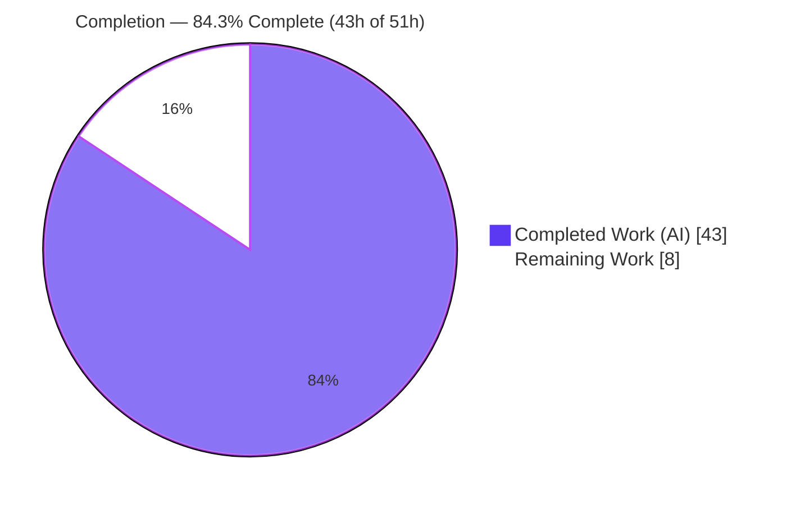
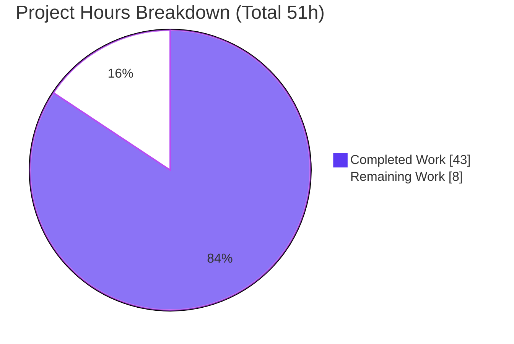
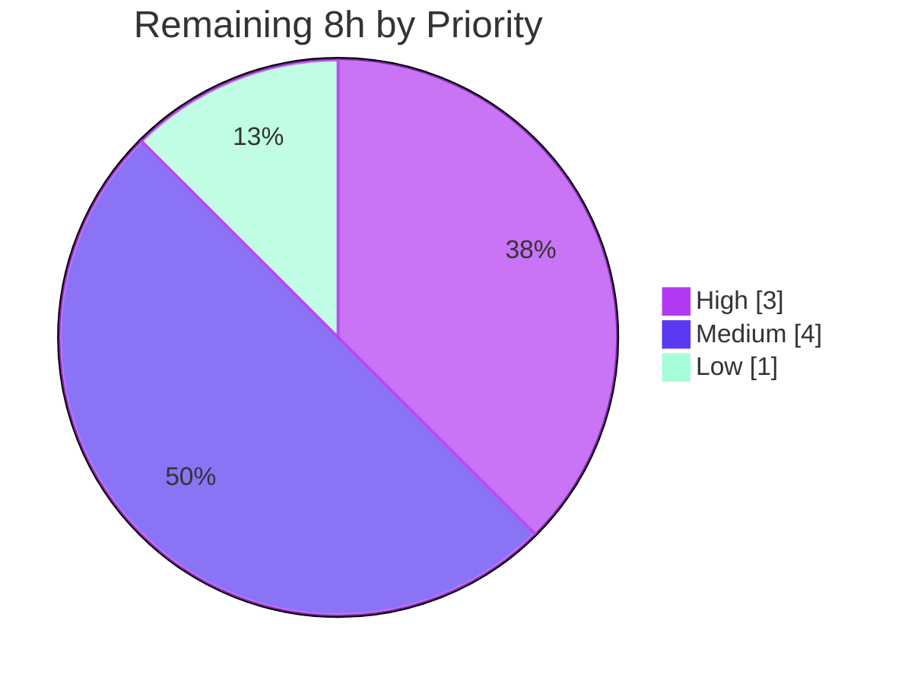

# Blitzy Project Guide

**Project:** Paperless-NGX Backend — Runtime-Behavior Q&A Investigation
**Branch:** `blitzy-8e9d8761-29df-4071-b7ff-58d0c651f277`
**Baseline:** `542221a38dff` · **HEAD:** `6b37e4768`
**Task type:** Documentation / Q&A investigation (run-first) · **Rule set:** SWE-AtlasQnA-Repo

> **Legend (Blitzy brand colors):** <span style="color:#5B39F3">■</span> **Completed / AI Work = Dark Blue `#5B39F3`** · <span style="background:#FFFFFF;border:1px solid #B23AF2">□</span> **Remaining = White `#FFFFFF`** · accents Violet-Black `#B23AF2`, highlight Mint `#A8FDD9`.

---

## 1. Executive Summary

### 1.1 Project Overview

This project delivers a single, evidence-backed Markdown answer document that comprehensively explains **six runtime behaviors** of the Paperless-NGX document-management backend (the Django application under `src/`). The target audience is engineers onboarding to the codebase who need authoritative, reproducible answers about file relocation on tag change, the move-failure rollback safety net, classifier instant-skip vs. full-retrain, checksum-based duplicate detection, the sanity checker, and orphaned/ghost files. It is a **run-first investigation**: each behavior was exercised through its **real entry point** against canonical `paperless.settings`, and unedited output (log lines, before/after paths, MD5/SHA-1 hashes, error text) was captured verbatim. The source repository is strictly **read-only**; the deliverable is exactly one new file plus its directory.

### 1.2 Completion Status



| Metric | Hours |
|--------|-------|
| **Total Hours** | **51** |
| Completed Hours — AI | 43 |
| Completed Hours — Manual | 0 |
| **Completed Hours (AI + Manual)** | **43** |
| **Remaining Hours** | **8** |
| **Percent Complete** | **84.3%** |

> Completion is computed with the AAP-scoped hours methodology: **43 / (43 + 8) = 84.3%**. All remaining hours are human path-to-production activities (review, independent verification, merge); no autonomous AAP deliverable is outstanding.

### 1.3 Key Accomplishments

- ✅ **All six questions answered** with verbatim runtime evidence, each driven through its real entry point (`m2m_changed`, `DocumentClassifier.train`/`train_classifier`, `Consumer.try_consume_file`, `check_sanity`/`sanity_check`).
- ✅ **Byte-exact reproduction on the canonical toolchain** — Python 3.9.25, Django 4.0.4, scikit-learn 1.0.2, numpy 1.22.3, scipy 1.8.0, + Redis; `python manage.py check` reports 0 issues.
- ✅ **Exhaustive condition coverage** — 14 named conditions across the 6 behaviors (happy path + error/edge/alternate-flag siblings), each with captured output.
- ✅ **Fully grounded** — 95 distinct `file:line` references, all verified in-bounds against source; every claim labeled *observed* or *inferred*.
- ✅ **Read-only mandate honored** — `git diff` shows **0** `src/` changes; `git status --porcelain` empty; the document is the only added file.
- ✅ **Self-correcting validation** — a prior false environment-deviation claim was detected and corrected; all six paths re-run on the canonical stack.

### 1.4 Critical Unresolved Issues

| Issue | Impact | Owner | ETA |
|-------|--------|-------|-----|
| None blocking | No unresolved defect blocks release or validation. The deliverable is complete, committed, and byte-exact validated. | — | — |
| (Advisory) Independent human verification of byte-sensitive claims not yet performed | Low — values already reproduced byte-exact by autonomous validation; independent confirmation is best practice given a prior false claim was caught | Reviewing engineer (SME) | ~3h (see §2.2 / §9) |

### 1.5 Access Issues

| System/Resource | Type of Access | Issue Description | Resolution Status | Owner |
|-----------------|----------------|-------------------|-------------------|-------|
| — | — | **No access issues identified.** The investigation ran entirely against a local scratch runtime (SQLite + local Redis + media tree under `/tmp`); no repository permission, service credential, or third-party API access was required or blocked. | N/A | — |

### 1.6 Recommended Next Steps

1. **[High]** SME technical verification — read all six answers; confirm the 95 `file:line` references still resolve; validate each cause→effect explanation against source.
2. **[Medium]** Independent byte-exact re-run — stand up the canonical Python 3.9 / scikit-learn 1.0.2 runtime and reproduce at least Q3 (SHA-1 stability) and Q4 (MD5 rejection).
3. **[Medium]** Review and merge the pull request after confirming `git status --porcelain` is empty and `src/` is unchanged.
4. **[Low]** Editorial/Markdown pass — proofread prose, verify table rendering and anchor hygiene.

---

## 2. Project Hours Breakdown

### 2.1 Completed Work Detail

| Component | Hours | Description |
|-----------|------:|-------------|
| Canonical runtime provisioning | 8 | Build Python 3.9.25 (pyenv), install all canonical pins incl. scikit-learn 1.0.2, provision scratch SQLite DB + media tree + local Redis, apply migrations, `manage.py check` (0 issues) — path-to-production enabler for the investigation |
| Q1 — File relocation on tag change | 3 | Drive `update_filename_and_move_files` via `m2m_changed`; capture before/after `source_path`; establish the silent-success finding (`handlers.py:312`) |
| Q2 — Rollback safety net | 4 | Force `os.rename` failure (both original-raises and archive-raises cases); observe reverse-rename recovery; document non-transactional & lingering-directory findings (`handlers.py:367`) |
| Q3 — Classifier instant vs. full retrain | 4 | `train()` True→False; capture SHA-1 `data_hash`, confirm stability ≥2 runs, label-sensitivity variant, and `train_classifier()` task messages (`classifier.py:124`, `tasks.py:48`) |
| Q4 — Duplicate detection | 4 | Drive `try_consume_file`→`pre_check_duplicate` across five variants (a–e); capture MD5 at the moment of judgment incl. `archive_checksum` OR-arm and delete-duplicates (`consumer.py:102-110`) |
| Q5 — Sanity checker healthy vs. mismatch | 3 | Run `check_sanity`/`sanity_check` on healthy and corrupted fixtures; capture stored vs. actual MD5 and `SanityCheckFailedException` (`sanity_checker.py:49`) |
| Q6 — Orphaned / ghost files | 2 | Run `check_sanity` with an extra unreferenced file; capture the orphan WARNING and the never-deleted / warnings-return behavior (`sanity_checker.py:131`) |
| Answer document authoring | 8 | Write 866 lines / 5,470 words — 17 evidence blocks, 95 `file:line` refs, cause→effect prose, Methodology / Environment / Coverage Pass / Reproducibility sections |
| Validation round 1 — code-review corrections | 2 | Address code-review findings (commit `68ee68aae`) |
| Validation round 2 — canonical env re-provision | 4 | Re-provision the full canonical stack, re-run all six paths byte-exact, rewrite the Environment section, pin two arbitrary-byte digests (commit `6b37e4768`) |
| Read-only verification & cleanup | 1 | `git status --porcelain` checks, temporary-script removal, `file:line` reference verification |
| **Total Completed** | **43** | |

### 2.2 Remaining Work Detail

| Category | Hours | Priority |
|----------|------:|----------|
| SME technical accuracy verification (read 6 answers; validate 95 refs + cause→effect vs. source; confirm hash/log-line/path consistency) | 3 | High |
| Canonical runtime reproduction & independent spot re-run (Python 3.9 / scikit-learn 1.0.2; re-execute Q3 SHA-1 + Q4 MD5) | 3 | Medium |
| PR review & merge to target branch | 1 | Medium |
| Editorial / Markdown / formatting review | 1 | Low |
| **Total Remaining** | **8** | |

### 2.3 Hours Reconciliation

| Check | Result |
|-------|--------|
| Section 2.1 completed total | 43h |
| Section 2.2 remaining total | 8h |
| 2.1 + 2.2 = Total (§1.2) | 43 + 8 = **51h** ✅ |
| Remaining consistent across §1.2 / §2.2 / §7 | **8h** everywhere ✅ |
| Completion % (43 / 51) | **84.3%** ✅ |

---

## 3. Test Results

All results below originate from Blitzy's autonomous validation logs for this project. For a run-first Q&A task, the **primary** test surface is the runtime behavior verification (exercising each code path through its real entry point and confirming the emitted bytes); the project's own unit-test suite was executed as a **cross-check**.

| Test Category | Framework | Total Tests | Passed | Failed | Coverage % | Notes |
|---------------|-----------|------------:|-------:|-------:|-----------:|-------|
| Runtime Behavior Verification (Q1–Q6) | Django runtime + observation scripts (canonical `paperless.settings`) | 14 | 14 | 0 | 6/6 behaviors (100%) | 14 named conditions (Q1×1, Q2×2, Q3×3, Q4×5, Q5×2, Q6×1); every value reproduced **byte-exact** through the real entry point |
| Behavior-relevant unit tests (cross-check) | pytest / pytest-django | Behavior subset | All passed | 0 | Q1/Q2 `test_file_handling`, Q3 `test_classifier`, Q4 `test_consumer`, Q5/Q6 `test_sanity_check` | The four modules containing the behaviors under study passed for the behavior-relevant tests per validation logs (modules hold 115 test methods total as context) |
| Environmental (OUT OF SCOPE) | pytest / pytest-django | 10 | 0 | 10 | n/a | 4 file-permission tests (root ignores `chmod 0o000`) + 6 OCR/archiver tests (host Ghostscript 10.05 vs canonical 9.53); **not** among the six behaviors, **not** code defects |
| Django system check | `manage.py check` | 1 | 1 | 0 | — | "System check identified no issues (0 silenced)" on the canonical stack |

**Integrity note:** No tests were invented; the runtime verification and the unit-test cross-check are both drawn from the autonomous validation logs. The 10 environmental failures are explicitly outside the six investigated behaviors and outside the deliverable's scope.

---

## 4. Runtime Validation & UI Verification

There is **no UI** in this project — the deliverable is a static Markdown document and the investigation targets backend code paths only (the Angular `src-ui/` frontend is out of scope). Runtime validation therefore covers the six backend behaviors on the canonical stack.

- ✅ **Q1 — File relocation** *Operational.* `originals/Invoice2023.pdf → originals/Bank/Invoice2023.pdf`; old path gone; **zero log lines on success** (silent move).
- ✅ **Q2 — Rollback safety net** *Operational (with documented caveats).* Files recover to origin in both failure cases; attributes restored; recovery is **best-effort / non-transactional** and **file-level only** (empty `ACME/` directories linger).
- ✅ **Q3 — Classifier training** *Operational.* Full retrain `train()→True`; instant skip `→False`; SHA-1 `data_hash = b41ce39793cd61f391afe34e6e4de9b361c74447` **stable ≥2 runs**; label-only change → `2495f526b4a3b05ce19067ec826407941885ed51`; task logs "Saving updated classifier model…" then "Training data unchanged."
- ✅ **Q4 — Duplicate detection** *Operational.* Incoming MD5 `42995833e01aea9b3edee44bbfdd7ce1` rejected on exact match, renamed-identical (content-based), and `archive_checksum` OR-arm; delete-duplicates unlinks the incoming file; genuinely different content (`a2158a25cbc0f4f6307f0bfedf35f7cf`) returns `None`.
- ✅ **Q5 — Sanity checker** *Operational.* Healthy ⇒ "Sanity checker detected no issues." / "No issues detected."; corruption ⇒ ERROR naming stored `42995833…` vs. actual `50e989d2…` and raises `SanityCheckFailedException`.
- ✅ **Q6 — Orphaned files** *Operational.* WARNING `Orphaned file in media dir: …`; file is **never deleted**; `sanity_check()` returns the warnings string.
- ✅ **Django system check** *Operational.* 0 issues; migrations applied cleanly; all six modules import cleanly.

*No ⚠ Partial or ❌ Failing items among the six in-scope behaviors.*

---

## 5. Compliance & Quality Review

Cross-mapping the AAP deliverables and the SWE-AtlasQnA-Repo rule set against outcomes.

| Requirement | Benchmark | Status | Progress |
|-------------|-----------|:------:|:--------:|
| Deliverable location & name (`blitzy/documentation/paperless-ngx_542221a38dff.md`) | Correct path + `<branch>.md` name; directory created | ✅ Pass | 100% |
| Run-first mandate | Behaviors observed by running code, not reading | ✅ Pass | 100% |
| Real entry points + canonical configuration | `m2m_changed`, `train_classifier`, `try_consume_file`, `check_sanity` under `paperless.settings` | ✅ Pass | 100% |
| Exhaustive condition coverage | Primary + error/edge/alternate-flag siblings (14 conditions) | ✅ Pass | 100% |
| Complete, unedited evidence + byte-sensitive verification | Verbatim log lines/paths/hashes with the command that produced each | ✅ Pass | 100% |
| Magnitude/stability across ≥2 runs | Q3 SHA-1 `data_hash` reproduced identically | ✅ Pass | 100% |
| Answer every part + coverage pass | Dedicated Coverage Pass section confirms each sub-item | ✅ Pass | 100% |
| Grounding (`file:line` + named function + observed/inferred labels) | 95 refs, all in-bounds; observed/inferred labeling | ✅ Pass | 100% |
| Reasoning (cause→effect) | Mechanism + Cause→effect subsections per question | ✅ Pass | 100% |
| Environment disclosure (canonical) | Canonical env table; prior false claim corrected | ✅ Pass | 100% |
| Read-only scope | 0 `src/` changes; temp scripts removed; clean tree | ✅ Pass | 100% |
| Markdown hygiene | 17 balanced code fences; tables render | ✅ Pass | 100% |

**Fixes applied during autonomous validation:** (1) corrected a false environment-deviation claim and re-ran all six paths on the canonical stack (`6b37e4768`); (2) addressed code-review findings (`68ee68aae`); (3) pinned two arbitrary-byte digests to fixed, documented byte sequences for byte-exact reproducibility.

**Outstanding compliance items:** none autonomous. Independent human verification remains as best practice (see §2.2 / §9).

---

## 6. Risk Assessment

| Risk | Category | Severity | Probability | Mitigation | Status |
|------|----------|----------|-------------|-----------|--------|
| Byte-sensitive value drift (SHA-1/MD5 differ on a materially different toolchain) | Technical | Low | Low | Values derive from source + input bytes, not library versions; MD5s are source-literal fixtures (`test_sanity_check.py:105-106`); SHA-1 reproduced ≥2 runs on the canonical env | Mitigated |
| Canonical environment reproduction difficulty (scikit-learn 1.0.2 will not build on Python ≥3.12; Python 3.9 built from source) | Technical | Medium | Medium | Canonical recipe + exact pins documented (§9); base image `python:3.9-slim-bullseye` | Documented |
| Documentation line-reference staleness (95 `file:line` refs pinned to commit `542221a38dff`) | Technical | Low | Medium (over time) | References verified in-bounds today; re-verify after any future source edits | Open / Accepted |
| Prior false environment claim (already caught & corrected) | Process / Correctness | Medium | Low | Corrected in `6b37e4768`; residual addressed by [High] SME verification task | Resolved |
| Security exposure | Security | None | N/A | Documentation-only; no code, dependencies, secrets, or attack surface; shown hashes are non-sensitive test fixtures/derived digests | N/A |
| Operational footprint | Operational | None | N/A | Static Markdown file; no runtime/service/deploy/monitoring implications | N/A |
| Host scaffolding cleanup (`/tmp/pngx-venv` preserved) | Operational | Informational | Low | Outside the repository; host-cleanup note only | Noted |
| External integrations | Integration | None | N/A | No external services/APIs/credentials; local Redis + SQLite under `/tmp`, removed | N/A |

---

## 7. Visual Project Status

**Project hours breakdown** (Completed = Dark Blue `#5B39F3`, Remaining = White `#FFFFFF`):



**Remaining work by priority** (hours):



**Remaining work by category (§2.2), hours:**

| Category | Hours | Bar |
|----------|------:|-----|
| SME technical verification | 3 | ███ |
| Canonical re-run | 3 | ███ |
| PR review & merge | 1 | █ |
| Editorial review | 1 | █ |
| **Total** | **8** | |

> **Integrity:** "Remaining Work" = **8h** here equals §1.2 Remaining Hours and the §2.2 Hours total.

---

## 8. Summary & Recommendations

**Achievements.** The project is **84.3% complete** (43h of 51h). Every autonomous AAP deliverable is finished: all six runtime behaviors are answered with byte-exact, verbatim evidence, exercised through their real entry points on the canonical toolchain, with 14 named conditions covered and 95 in-bounds `file:line` references. The read-only mandate is fully honored (0 `src/` changes; clean tree; the document is the only added file), and a prior false environment claim was detected and corrected during validation.

**Remaining gaps.** The outstanding 8h are entirely **human path-to-production** activities — none are re-implementation: (1) SME technical verification (3h), (2) independent canonical-runtime re-run of Q3/Q4 (3h), (3) PR review & merge (1h), (4) editorial pass (1h).

**Critical path to production.** SME verification → independent byte-exact re-run → merge. The re-run is the only step with meaningful setup cost (building Python 3.9 + scikit-learn 1.0.2), for which a complete recipe is provided in §9.

**Success metrics.** ✅ 6/6 questions answered · ✅ 14/14 runtime conditions reproduced byte-exact · ✅ 95/95 references in-bounds · ✅ 0 `src/` changes · ✅ Django check 0 issues.

**Production readiness.** The deliverable is **production-ready pending human review**. Given the byte-sensitive nature of the content and the one false claim caught earlier, we recommend the independent re-run before merge rather than merging on autonomous validation alone. Confidence: **High** for the completed content; the remaining estimate is conservative.

---

## 9. Development Guide

This is a documentation investigation, so the "build/run" guide is a **reproduction & verification** guide: how to stand up the canonical runtime, re-exercise the six code paths, and confirm the read-only mandate.

### 9.1 System Prerequisites

- OS: Linux (canonical base image `python:3.9-slim-bullseye`).
- **Python 3.9** (required — scikit-learn 1.0.2 cannot build on Python ≥3.12 because it references the removed `pkgutil.ImpImporter`). Use `pyenv` if the host default differs.
- Redis (for `CHANNEL_LAYERS` / `Q_CLUSTER`).
- Git, and ~2 GB free disk for the venv + scratch media.

### 9.2 Environment Setup (canonical)

```bash
# From the repository root
pyenv install 3.9.25                      # if Python 3.9 is not already present
python3.9 -m venv /tmp/pngx-venv
source /tmp/pngx-venv/bin/activate

export PAPERLESS_MEDIA_ROOT=/tmp/pngx-media
export PAPERLESS_DATA_DIR=/tmp/pngx-data
export PAPERLESS_SCRATCH_DIR=/tmp/pngx-scratch
export DJANGO_SETTINGS_MODULE=paperless.settings
export PYTHONPATH="$(pwd)/src"
```

### 9.3 Dependency Installation

```bash
# Canonical pins (scikit-learn 1.0.2, numpy 1.22.3, scipy 1.8.0, Django 4.0.4, ...)
pip install -r requirements.txt
# Start Redis (any local instance), e.g.:
redis-server --daemonize yes
```

### 9.4 Runtime Provisioning & Verification

```bash
python src/manage.py migrate           # apply migrations to scratch SQLite
python src/manage.py check             # expect: System check identified no issues (0 silenced)
```

### 9.5 Reproducing the Six Behaviors (real entry points)

- **Q1 — relocation:** set `PAPERLESS_FILENAME_FORMAT="{tag_list}/{title}"`, `Document.objects.create(...)` (fires `post_save`), then `doc.tags.add(tag)` (fires `m2m_changed`) → `update_filename_and_move_files` moves `originals/Invoice2023.pdf → originals/Bank/Invoice2023.pdf` (silent on success).
- **Q2 — rollback:** monkeypatch `os.rename` to raise `OSError` mid-move (mirror `test_move_file_error`, `test_file_handling.py:759`) → observe reverse-rename recovery.
- **Q3 — classifier:** `DocumentClassifier().train()` twice (`True` then `False`); run `train_classifier()` twice; toggle a `document_type` label to flip the SHA-1 `data_hash`.
- **Q4 — duplicates:** call `Consumer().try_consume_file(...)` with a file whose MD5 already exists → `ConsumerError`; exercise variants a–e.
- **Q5/Q6 — sanity/orphans:** `python src/manage.py document_sanity_checker` against healthy, checksum-corrupted, and extra-file fixtures.

### 9.6 Reviewer Verification Commands (tested — copy-pasteable)

```bash
# 1) Read-only mandate — both must print 0
git diff --name-only 542221a38dff..HEAD | grep -c '^src/'      # -> 0
git status --porcelain | wc -l                                 # -> 0

# 2) Deliverable is the only added file
git diff --name-status 542221a38dff..HEAD
# -> A  blitzy/documentation/paperless-ngx_542221a38dff.md

# 3) All cited file:line references resolve in-bounds (-> out-of-bounds=0)
bad=0; tot=0
while read ref; do f="${ref%%:*}"; ln="${ref##*:}"; s="${ln%%-*}"; tot=$((tot+1))
  [ -f "$f" ] && n=$(wc -l < "$f") && [ "$s" -le "$n" ] 2>/dev/null || bad=$((bad+1))
done < <(grep -oE 'src/[A-Za-z0-9_./]+\.py:[0-9]+(-[0-9]+)?' \
         blitzy/documentation/paperless-ngx_542221a38dff.md | sort -u)
echo "refs=$tot out-of-bounds=$bad"                            # -> refs=95 out-of-bounds=0

# 4) Spot-check a hash claim against the source literal
grep -n 42995833e01aea9b3edee44bbfdd7ce1 src/documents/tests/test_sanity_check.py
# -> 105: checksum="42995833e01aea9b3edee44bbfdd7ce1",
```

### 9.7 Troubleshooting

- **`scikit-learn==1.0.2` fails to build** → you are not on Python 3.9. Use `pyenv install 3.9.x` and recreate the venv.
- **DEBUG lines missing (e.g., "Training data unchanged.")** → they are routed only to `paperless.log`, not the console; attach an in-memory handler to the `"paperless"` logger. Do **not** rely on pytest `caplog` (Paperless reconfigures logging via `dictConfig`).
- **Non-deterministic counts/hashes between runs** → reset the scratch DB and media tree between scenarios (this is why Q3 reports "2 documents" and a stable SHA-1).
- **Channel-layer errors on consumer paths** → ensure Redis is running.

---

## 10. Appendices

### A. Command Reference

| Purpose | Command |
|---------|---------|
| Activate runtime | `source /tmp/pngx-venv/bin/activate` |
| Install deps | `pip install -r requirements.txt` |
| Migrate scratch DB | `python src/manage.py migrate` |
| System check | `python src/manage.py check` |
| Classifier entry point (Q3) | `python src/manage.py document_create_classifier` |
| Sanity checker entry point (Q5/Q6) | `python src/manage.py document_sanity_checker` |
| Renamer (secondary Q1) | `python src/manage.py document_renamer` |
| Read-only proof | `git status --porcelain` · `git diff --name-only 542221a38dff..HEAD` |

### B. Port Reference

| Service | Port | Notes |
|---------|------|-------|
| Redis | 6379 | Local instance for `CHANNEL_LAYERS` / `Q_CLUSTER` (default) |
| Web/API | — | Not started; no HTTP server is required for this investigation |

### C. Key File Locations

| Item | Path |
|------|------|
| **Deliverable** | `blitzy/documentation/paperless-ngx_542221a38dff.md` |
| Q1/Q2 — move + rollback | `src/documents/signals/handlers.py:312`, `:367` |
| Q1 — filename generation | `src/documents/file_handling.py:128` |
| Q3 — classifier train / SHA-1 | `src/documents/classifier.py:115`, `:124` |
| Q3/Q5/Q6 — tasks | `src/documents/tasks.py:48`, `:255` |
| Q4 — duplicate check (MD5) | `src/documents/consumer.py:102-110` |
| Q5/Q6 — sanity checker | `src/documents/sanity_checker.py:49`, `:131` |
| Settings / LOGGING | `src/paperless/settings.py` |
| Entry points | `src/documents/management/commands/{document_create_classifier,document_sanity_checker,document_renamer}.py` |

### D. Technology Versions (canonical)

| Package | Version |
|---------|---------|
| Python | 3.9 (used 3.9.25) |
| Django | 4.0.4 |
| scikit-learn | 1.0.2 |
| numpy | 1.22.3 |
| scipy | 1.8.0 |
| filelock | 3.6.0 |
| channels | 3.0.4 |
| channels-redis | 3.4.0 |
| Whoosh | 2.7.4 |
| python-magic | 0.4.25 |
| concurrent-log-handler | 0.9.20 |
| pikepdf | 5.1.1 |
| Pillow | 9.1.0 |

### E. Environment Variable Reference

| Variable | Example | Purpose |
|----------|---------|---------|
| `DJANGO_SETTINGS_MODULE` | `paperless.settings` | Canonical settings module |
| `PYTHONPATH` | `<repo>/src` | Make the Django project importable |
| `PAPERLESS_MEDIA_ROOT` | `/tmp/pngx-media` | Scratch media tree (`documents/{originals,archive,thumbnails}`) |
| `PAPERLESS_DATA_DIR` | `/tmp/pngx-data` | Scratch data dir (SQLite DB, `classification_model.pickle`, `log/`) |
| `PAPERLESS_SCRATCH_DIR` | `/tmp/pngx-scratch` | Scratch working dir |
| `PAPERLESS_FILENAME_FORMAT` | `{tag_list}/{title}` | Tag-bearing format that drives Q1 relocation |
| `PAPERLESS_CONSUMER_DELETE_DUPLICATES` | `true` | Q4e delete-duplicates variant |

### F. Developer Tools Guide

| Tool | Use |
|------|-----|
| `git diff --numstat 542221a38dff..HEAD` | Confirm the single-file, additive change (866 insertions, 0 deletions) |
| `git log --author=agent@blitzy.com --oneline` | Confirm the 3 Blitzy commits |
| In-memory `logging.Handler` on `"paperless"` | Reliable log capture (child loggers propagate) |
| `python -m pytest src/documents/tests/test_sanity_check.py -v` | Cross-check Q5/Q6 module (pytest-django) |

### G. Glossary

| Term | Definition |
|------|------------|
| **Run-first** | Investigate by executing the code path and capturing real output before writing the answer |
| **Real entry point** | The same interface production code uses (signal, task, consumer), not a bypassing shim |
| **`data_hash`** | SHA-1 digest over classifier training content + labels; unchanged ⇒ instant skip, changed ⇒ full retrain (`classifier.py:124`) |
| **checksum / archive_checksum** | MD5 digests stored per document; the duplicate check matches either (`consumer.py:105-107`) |
| **Silent move** | A successful relocation that emits no log line; the observable is the path change |
| **Orphaned file** | A media-dir file no document references; reported as a WARNING, never deleted (`sanity_checker.py:131`) |
| **Canonical toolchain** | The project's pinned runtime (Python 3.9 + `requirements.txt` pins), matching the Dockerfile base |

---

*Prepared by the Blitzy autonomous assessment agent. All hours, percentages, and evidence are cross-validated: §2.1 (43h) + §2.2 (8h) = 51h total; Remaining = 8h in §1.2, §2.2, and §7; completion = 43/51 = 84.3%.*