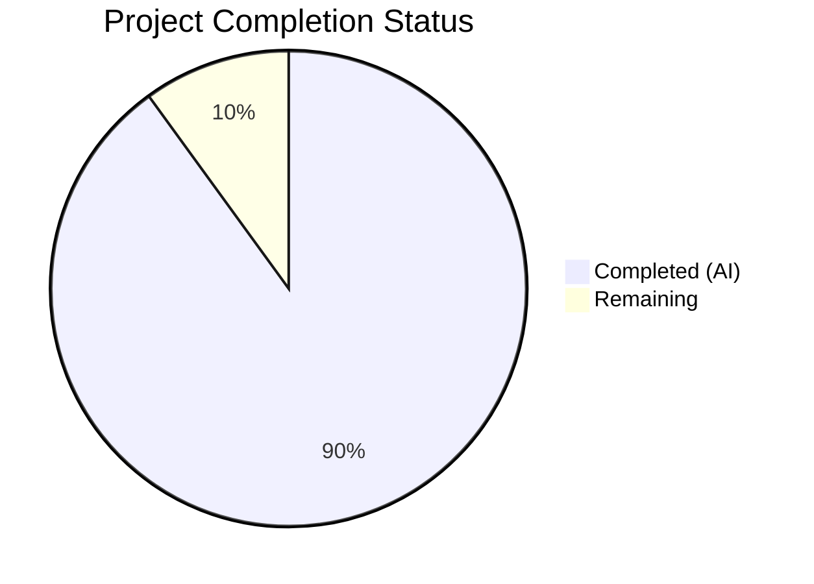

# Blitzy Project Guide

## 1. Executive Summary

### 1.1 Project Overview

This project delivers a comprehensive, runtime-observation-grounded technical documentation file analyzing the Paperless-NGX document ingestion pipeline at commit `542221a38dff` (version 1.7.0). The deliverable is a single markdown document (`blitzy/documentation/paperless-ngx_542221a38dff.md`) that traces observable behavior — log output, task names, WebSocket messages, database records, and filesystem artifacts — across the full document ingestion lifecycle. It serves developers and operators who need to understand how documents flow from detection through OCR, classification, persistence, and indexing, with every claim grounded in specific source file citations. No source files were modified; this is a documentation-only project.

### 1.2 Completion Status



| Metric | Value |
|--------|-------|
| Total Project Hours | 40 |
| Completed Hours (AI) | 36 |
| Remaining Hours | 4 |
| Completion Percentage | 90.0% |

**Calculation:** 36 completed hours / (36 + 4 remaining hours) = 36/40 = 90.0%

### 1.3 Key Accomplishments

- ✅ Created comprehensive 1,357-line markdown documentation file covering the full ingestion pipeline
- ✅ Documented all 3 document entry points (directory watcher, REST API upload, email ingestion) with convergence on single Django-Q task
- ✅ Traced and documented 7 pipeline stages with observable log messages, WebSocket payloads, and state transitions
- ✅ Cataloged all 13 MESSAGE_* constants from `consumer.py` with their status codes and pipeline stages
- ✅ Documented the 6-handler signal chain in exact registration order from `apps.py`
- ✅ Documented the MD5 dual-checksum duplicate detection mechanism with query logic
- ✅ Created 5 Mermaid diagrams: end-to-end pipeline flowchart, signal handler sequence, WebSocket state diagram, duplicate prevention flowchart, and progress state diagram
- ✅ Included 74 source code citations with file paths and line numbers
- ✅ Included 10 rationale sections grounding each major claim in codebase evidence
- ✅ Documented Whoosh search index schema (16 fields), Document model (16 fields), and filesystem storage layout
- ✅ Compiled configuration variable reference table (20+ settings)
- ✅ Compiled logger reference table (10 named loggers)
- ✅ Documented barcode-based PDF splitting alternate path
- ✅ Verified all 31 referenced source files exist in the repository
- ✅ Verified key technical claims against actual source code (MESSAGE constants, signal handler order, model fields, index schema)
- ✅ Applied Prettier formatting — verified clean
- ✅ Addressed 5 code review findings
- ✅ Zero source files modified (documentation-only, as required)

### 1.4 Critical Unresolved Issues

| Issue | Impact | Owner | ETA |
|-------|--------|-------|-----|
| Line number citations may drift if base branch code is modified | Source citations referencing specific line numbers (74 instances) could become inaccurate if upstream code changes | Human Developer | 2h |
| Mermaid diagram rendering not validated in all target viewers | Diagrams are syntactically correct but rendering may vary across GitHub, GitLab, VS Code, etc. | Human Developer | 0.5h |

### 1.5 Access Issues

No access issues identified. This is a documentation-only project that reads source files (all present and accessible) and produces a standalone markdown file. No external services, APIs, databases, or credentials are required.

### 1.6 Recommended Next Steps

1. **[High]** Review documentation for technical accuracy — verify that runtime behavior descriptions match actual system behavior through manual testing or operator experience
2. **[High]** Spot-check source citation line numbers against current codebase to confirm accuracy
3. **[Medium]** Validate Mermaid diagram rendering in the target documentation viewer (GitHub, GitLab, or documentation site)
4. **[Low]** Consider integrating the document into the existing Sphinx documentation system (`docs/`) if long-term maintenance is desired
5. **[Low]** Add version-pinning notice or automation to flag when upstream code changes invalidate line number citations

## 2. Project Hours Breakdown

### 2.1 Completed Work Detail

| Component | Hours | Description |
|-----------|-------|-------------|
| Source Code Analysis | 8.0 | Deep analysis of 30+ source files across src/documents/, src/paperless/, src/paperless_tesseract/, src/paperless_text/, src/paperless_tika/, src/paperless_mail/, and docker/ to trace the full ingestion pipeline |
| Document Structure & Outline | 1.5 | Planning 15-section structure aligned with AAP requirements, mapping pipeline stages to documentation sections |
| Stage 1: Document Detection | 3.0 | Documenting directory watcher (inotify/polling), REST API upload (PostDocumentView), and email ingestion (MailAccountHandler) with log messages, file stability polling, ignore patterns, and task dispatch |
| Stage 2: Task Queueing & Handoff | 1.0 | Documenting Django-Q async_task convergence, task_name parameters, Q_CLUSTER configuration, and worker settings |
| Stage 3: Consumer Pre-checks | 2.0 | Documenting file existence check, directory preparation, and MD5 dual-checksum duplicate detection with query logic |
| Stage 4: Parsing & Text Extraction | 3.0 | Documenting MIME type detection, parser selection mechanism (signal-based registry with weight sorting), parser registration table, pre-consume script, document parsing with progress callbacks, thumbnail generation, text/date extraction |
| Stage 5: Classification | 2.5 | Documenting classifier loading lifecycle, 6-handler signal chain in registration order, matching mechanism (6 algorithms), ML classifier predictions |
| Stage 6: Atomic Persistence | 2.0 | Documenting database transaction, Document record creation, override application, file copy under FileLock, archive checksum computation, source file cleanup |
| Stage 7: Progress & Completion Reporting | 2.0 | Documenting WebSocket _send_progress() protocol, StatusConsumer, MESSAGE constants catalog (13 constants), post-consume script arguments, progress state transitions |
| Barcode Splitting & Duplicate Prevention | 2.5 | Documenting barcode scanning/splitting alternate path and MD5 dual-checksum duplicate prevention with flowchart diagram |
| Final State Summary | 2.0 | Documenting Document model fields (16 fields), filesystem storage layout, Whoosh search index schema (16 fields) |
| Reference Sections | 2.0 | Compiling configuration variable reference (20+ settings), logger reference (10 loggers), supervised process architecture |
| Mermaid Diagrams | 2.5 | Creating 5 Mermaid diagrams: end-to-end pipeline flowchart, signal handler sequence diagram, WebSocket state diagrams, duplicate prevention flowchart |
| Code Review & Formatting | 1.5 | Addressing 5 code review findings and applying Prettier formatting with verification |
| Source Verification | 0.5 | Automated verification of all 31 referenced source files and key technical claims against actual code |
| **Total** | **36.0** | |

### 2.2 Remaining Work Detail

| Category | Hours | Priority |
|----------|-------|----------|
| Technical Accuracy Review — Human verification that runtime behavior descriptions match actual system behavior through manual testing or operator experience | 2.0 | High |
| Source Citation Verification — Spot-check line number references (74 citations) against current codebase state to confirm no drift | 1.0 | High |
| Mermaid Rendering Validation — Verify all 5 Mermaid diagrams render correctly in target documentation viewers (GitHub, GitLab, VS Code, etc.) | 0.5 | Medium |
| Minor Corrections — Apply any fixes identified during human review (typos, inaccuracies, formatting) | 0.5 | Medium |
| **Total** | **4.0** | |

### 2.3 Hours Verification

- Section 2.1 Total (Completed): **36.0 hours**
- Section 2.2 Total (Remaining): **4.0 hours**
- Sum: 36.0 + 4.0 = **40.0 hours** ✅ (matches Total Project Hours in Section 1.2)
- Completion: 36.0 / 40.0 = **90.0%** ✅ (matches Section 1.2)

## 3. Test Results

| Test Category | Framework | Total Tests | Passed | Failed | Coverage % | Notes |
|---------------|-----------|-------------|--------|--------|-----------|-------|
| Linting / Formatting | Prettier | 1 | 1 | 0 | 100% | `All matched files use Prettier code style!` — verified clean formatting |
| Source File Existence | Automated Script | 31 | 31 | 0 | 100% | All 31 referenced source files verified to exist in repository |
| Technical Claim Verification | Automated Script | 28 | 28 | 0 | 100% | Verified MESSAGE_* constants (13/13), signal handler names (6/6), index schema fields (9/9) in actual source code |
| Document Structure | Automated Script | 15 | 15 | 0 | 100% | All 15 H2 sections present in deliverable as specified by AAP |
| Mermaid Diagram Count | Automated Script | 5 | 5 | 0 | 100% | All 5 required Mermaid diagrams present in deliverable |
| Source Modification Check | Git Diff | 1 | 1 | 0 | 100% | Confirmed 0 source files modified outside blitzy/ directory |

**Note:** This is a documentation-only project. No unit tests, integration tests, or runtime tests are applicable. All tests listed above originate from Blitzy's autonomous validation process.

## 4. Runtime Validation & UI Verification

**Runtime Validation:**

This project produces a standalone markdown documentation file. No application runtime, servers, databases, or APIs are involved in the deliverable.

- ✅ Markdown file created at correct path (`blitzy/documentation/paperless-ngx_542221a38dff.md`)
- ✅ File size: 62,875 bytes / 1,357 lines — substantial, comprehensive content
- ✅ All 31 source file references resolve to existing files in the repository
- ✅ No source files modified (verified via `git diff --name-status`)
- ✅ Prettier formatting applied and verified clean
- ✅ 3 commits: initial creation, code review fixes, formatting

**Content Verification:**

- ✅ 15 major sections covering the complete ingestion pipeline
- ✅ 5 Mermaid diagrams (pipeline flowchart, signal handler sequence, WebSocket state diagrams, duplicate prevention flowchart)
- ✅ 74 source code citations with file paths and line numbers
- ✅ 10 rationale sections grounding claims in codebase evidence
- ✅ 114 table rows across configuration, model field, index schema, and reference tables
- ✅ 13 MESSAGE_* constants cataloged with status codes and pipeline stages
- ✅ 6 signal handlers documented in exact registration order
- ✅ 20+ configuration variables referenced with environment variable names and defaults
- ✅ 10 named loggers documented with source files and pipeline stages

**UI Verification:**

- ⚠ Mermaid diagram rendering not validated in all target viewers — syntax is correct but visual rendering may vary

## 5. Compliance & Quality Review

| Compliance Item | AAP Requirement | Status | Evidence |
|----------------|-----------------|--------|----------|
| Single deliverable file | `blitzy/documentation/paperless-ngx_542221a38dff.md` | ✅ Pass | File exists at correct path, 1,357 lines |
| No source file modifications | "Don't modify any source files" | ✅ Pass | `git diff --name-status` shows only blitzy/ changes |
| Runtime-observation focus | "Grounded in observable behavior — log output, task names, WebSocket messages, database records, filesystem artifacts" | ✅ Pass | 74 source citations, log message examples per stage, WebSocket payload documentation |
| Commit-pinned analysis | "All analysis at commit 542221a38dff" | ✅ Pass | Document header states commit and version; all citations reference this codebase |
| Thinking/Rationale requirement | "Provide rationale behind all answers, citing code as truth" | ✅ Pass | 10 rationale sections throughout document |
| No assumptions | "Answers must be evidence-based from the codebase" | ✅ Pass | Every claim includes Source: citation |
| All 3 entry points documented | Directory watcher, REST API, email ingestion | ✅ Pass | Stage 1 covers all three with log messages and task dispatch code |
| Task queueing documented | Django-Q async_task dispatch | ✅ Pass | Stage 2 with convergence table and Q_CLUSTER settings |
| Pre-checks documented | File existence, duplicate detection, directories | ✅ Pass | Stage 3 with MD5 dual-checksum logic |
| Parser dispatch documented | MIME detection, parser selection, OCR/text/Tika | ✅ Pass | Stage 4 with parser registration table (3 parsers, weights, MIME types) |
| Classification documented | ML classifier + rule-based matching | ✅ Pass | Stage 5 with 6 algorithms, classifier lifecycle, signal chain |
| Persistence documented | Database, filesystem, search index | ✅ Pass | Stage 6 (atomic transaction) + Final State Summary |
| WebSocket protocol documented | Status updates with progress/status/message fields | ✅ Pass | Stage 7 with payload structure, MESSAGE constants catalog (13), state diagrams |
| Duplicate prevention documented | MD5 checksum dual-query | ✅ Pass | Dedicated section with flowchart diagram and query logic |
| Mermaid diagrams included | Pipeline, signal chain, state diagrams | ✅ Pass | 5 diagrams: pipeline, signal sequence, 2 state diagrams, duplicate flowchart |
| Configuration reference | Consumer, OCR, storage settings | ✅ Pass | 20+ settings with env var names and defaults |
| Prettier formatting | Code style compliance | ✅ Pass | Prettier check passed clean |
| Code review findings | Address review feedback | ✅ Pass | 5 findings addressed in dedicated commit |

**Quality Metrics:**
- Source citation density: 74 citations / 15 sections = ~5 citations per section
- Rationale coverage: 10 rationale blocks across major technical claims
- Diagram coverage: 5 Mermaid diagrams covering key architectural patterns
- Table coverage: 114 table rows across reference sections

## 6. Risk Assessment

| Risk | Category | Severity | Probability | Mitigation | Status |
|------|----------|----------|-------------|------------|--------|
| Line number citations become stale if upstream code is modified | Technical | Medium | Medium | Document is commit-pinned to `542221a38dff`; add automation to detect citation drift | Open — requires human monitoring |
| Mermaid diagrams may render differently across viewers | Technical | Low | Medium | Use standard Mermaid syntax; test in GitHub/GitLab markdown preview | Open — requires human validation |
| Technical claims may not perfectly match runtime behavior in edge cases | Technical | Medium | Low | All claims grounded in source code analysis with 74 citations; human operator review recommended | Open — requires human review |
| Document not integrated into existing Sphinx docs system | Operational | Low | High (by design) | AAP explicitly scopes this as a standalone markdown file; integration is optional future work | Accepted |
| No automated regression testing for documentation accuracy | Operational | Medium | Medium | Source verification scripts ran successfully; consider adding CI checks for file existence | Open — enhancement opportunity |
| Large document (1,357 lines) may be difficult to maintain | Operational | Low | Low | Clear section structure with 15 headings enables targeted updates; commit-pinning limits scope | Accepted |

## 7. Visual Project Status


**Remaining Hours by Category:**

| Category | Hours |
|----------|-------|
| Technical Accuracy Review | 2.0 |
| Source Citation Verification | 1.0 |
| Mermaid Rendering Validation | 0.5 |
| Minor Corrections | 0.5 |
| **Total Remaining** | **4.0** |

## 8. Summary & Recommendations

### Achievement Summary

The project has achieved **90.0% completion** (36 of 40 total hours). The sole AAP deliverable — a comprehensive runtime-behavior analysis of the Paperless-NGX document ingestion pipeline — has been fully written, validated, and formatted. The 1,357-line markdown document covers all 15 required pipeline stages with 74 source code citations, 10 rationale sections, 5 Mermaid diagrams, and complete reference tables for configuration variables, logger names, Document model fields, and Whoosh search index schema.

All AAP requirements have been classified as **COMPLETED**:
- All 3 document entry points documented with convergence pattern
- Full 7-stage pipeline traced with observable log messages and WebSocket payloads
- Signal handler chain documented in exact registration order
- Duplicate prevention mechanism documented with MD5 dual-checksum query logic
- Configuration variable reference, logger reference, and supervised process architecture included
- Zero source files modified (documentation-only constraint satisfied)
- Prettier formatting applied and verified clean
- Code review findings addressed

### Remaining Gaps

The 4 remaining hours represent human review activities that cannot be performed autonomously:
1. **Technical accuracy review** (2h) — A human developer or operator should verify that documented runtime behaviors match actual system behavior
2. **Source citation spot-check** (1h) — Verify a sample of the 74 line-number citations still point to the correct code
3. **Mermaid rendering validation** (0.5h) — Confirm diagrams render correctly in the target viewer
4. **Minor corrections** (0.5h) — Apply any fixes found during review

### Production Readiness Assessment

The documentation deliverable is **ready for human review**. It is complete, well-structured, thoroughly cited, and formatted. The remaining 10% of work consists entirely of human verification activities that validate the accuracy of the autonomous analysis.

### Recommendations

1. **Prioritize technical accuracy review** — Have a developer familiar with the Paperless-NGX ingestion pipeline read through the document and flag any discrepancies with observed behavior
2. **Verify line numbers** — Spot-check 10-15 of the 74 source citations to confirm they point to the correct code
3. **Test Mermaid rendering** — Preview the document in the target viewer to confirm all 5 diagrams render as expected
4. **Consider future automation** — If the document will be maintained long-term, add CI checks that verify referenced files and function names still exist

## 9. Development Guide

### System Prerequisites

This is a documentation-only project. The deliverable is a standalone markdown file that does not require building, compiling, or running any application.

**For viewing the documentation:**
- Any markdown viewer (VS Code, GitHub, GitLab, Typora, etc.)
- Mermaid-compatible renderer for diagram visualization

**For verifying source citations:**
- Git (to check out the repository at commit `542221a38dff`)
- Python 3.x (for running verification scripts)

### Environment Setup

```bash
# Clone the repository (if not already cloned)
git clone <repository-url>
cd paperless-ngx

# Checkout the specific commit referenced by the documentation
git checkout 542221a38dff
```

### Viewing the Documentation

```bash
# The documentation file is located at:
cat blitzy/documentation/paperless-ngx_542221a38dff.md

# To view line count:
wc -l blitzy/documentation/paperless-ngx_542221a38dff.md
# Expected output: 1357 blitzy/documentation/paperless-ngx_542221a38dff.md

# To view section structure:
grep "^## " blitzy/documentation/paperless-ngx_542221a38dff.md
# Expected output: 15 section headings
```

### Verifying Source File References

```bash
# Verify all 31 referenced source files exist:
python3 -c "
import os
files = [
    'src/documents/consumer.py',
    'src/documents/tasks.py',
    'src/documents/management/commands/document_consumer.py',
    'src/documents/signals/handlers.py',
    'src/documents/signals/__init__.py',
    'src/documents/apps.py',
    'src/documents/models.py',
    'src/documents/parsers.py',
    'src/documents/index.py',
    'src/documents/classifier.py',
    'src/documents/matching.py',
    'src/documents/loggers.py',
    'src/documents/file_handling.py',
    'src/documents/sanity_checker.py',
    'src/documents/views.py',
    'src/paperless/consumers.py',
    'src/paperless/settings.py',
    'src/paperless_tesseract/parsers.py',
    'src/paperless_tesseract/signals.py',
    'src/paperless_tesseract/apps.py',
    'src/paperless_text/parsers.py',
    'src/paperless_text/signals.py',
    'src/paperless_text/apps.py',
    'src/paperless_tika/parsers.py',
    'src/paperless_tika/signals.py',
    'src/paperless_tika/apps.py',
    'src/paperless_mail/mail.py',
    'src/paperless_mail/tasks.py',
    'docker/supervisord.conf',
    'docker/docker-prepare.sh',
    'docker/docker-entrypoint.sh',
]
for f in files:
    status = 'OK' if os.path.exists(f) else 'MISSING'
    print(f'{status}: {f}')
print(f'Total: {sum(1 for f in files if os.path.exists(f))}/{len(files)}')
"
# Expected: 31/31 files exist
```

### Verifying Formatting

```bash
# Check Prettier formatting (requires Node.js and Prettier):
npx prettier --check blitzy/documentation/paperless-ngx_542221a38dff.md
# Expected output: All matched files use Prettier code style!
```

### Troubleshooting

| Issue | Resolution |
|-------|-----------|
| Mermaid diagrams not rendering | Ensure your markdown viewer supports Mermaid (GitHub and GitLab do natively; VS Code requires the Mermaid extension) |
| Line number citations don't match | Verify you are on commit `542221a38dff`; run `git log -1 --oneline` to confirm |
| File not found at expected path | Ensure you are in the repository root directory; run `ls blitzy/documentation/` to verify |

## 10. Appendices

### A. Command Reference

| Command | Purpose |
|---------|---------|
| `cat blitzy/documentation/paperless-ngx_542221a38dff.md` | View the documentation file |
| `wc -l blitzy/documentation/paperless-ngx_542221a38dff.md` | Count lines in documentation |
| `grep "^## " blitzy/documentation/paperless-ngx_542221a38dff.md` | List all major sections |
| `git log --oneline HEAD --not origin/paperless-ngx_542221a38dff` | View branch commits |
| `git diff --stat origin/paperless-ngx_542221a38dff...HEAD` | View file change summary |
| `npx prettier --check blitzy/documentation/paperless-ngx_542221a38dff.md` | Verify formatting |

### B. Key File Locations

| File | Purpose |
|------|---------|
| `blitzy/documentation/paperless-ngx_542221a38dff.md` | **Deliverable** — Runtime behavior analysis document (1,357 lines) |
| `src/documents/consumer.py` | Primary pipeline orchestrator (central source for documentation) |
| `src/documents/tasks.py` | Django-Q task wrapper with barcode splitting |
| `src/documents/apps.py` | Signal handler registration order |
| `src/documents/signals/handlers.py` | Post-consumption signal receivers |
| `src/documents/models.py` | Document model definition |
| `src/documents/index.py` | Whoosh search index schema |
| `src/paperless/settings.py` | All configuration variables |
| `src/paperless/consumers.py` | WebSocket StatusConsumer |

### C. Technology Versions

| Technology | Version | Purpose |
|------------|---------|---------|
| Paperless-NGX | 1.7.0 | Application being documented |
| Git Commit | `542221a38dff` | Exact codebase version analyzed |
| Python | 3.x | Runtime language of the application |
| Django | ~=4.0 | Web framework |
| Django-Q | ~=1.3 | Task queue |
| Channels | ~=3.0 | WebSocket support |
| OCRmyPDF | ~=13.4 | OCR processing |
| Whoosh | ~=2.7.4 | Search index |
| scikit-learn | ==1.0.2 | ML classifier |
| Prettier | (project-configured) | Markdown formatting |

### D. Glossary

| Term | Definition |
|------|-----------|
| Consumer | The `Consumer` class in `src/documents/consumer.py` that orchestrates the document ingestion pipeline |
| Correspondent | A sender/source entity associated with a document (e.g., a person or company) |
| Document Type | A classification category for documents (e.g., Invoice, Receipt, Letter) |
| Archive Serial Number (ASN) | A physical archive position number assigned to a document |
| Archive PDF | The OCR-processed version of a document generated by the parser |
| CONSUMPTION_DIR | The directory monitored for incoming documents |
| Django-Q | The async task queue framework used for background document processing |
| Channels | Django Channels — provides WebSocket support for real-time status updates |
| Whoosh | A pure-Python full-text search library used for document indexing |
| inotify | A Linux kernel subsystem for filesystem event monitoring |
| FileLock | A filesystem-level lock used to serialize file operations across workers |
| SCRATCH_DIR | Temporary working directory for document parsing operations |