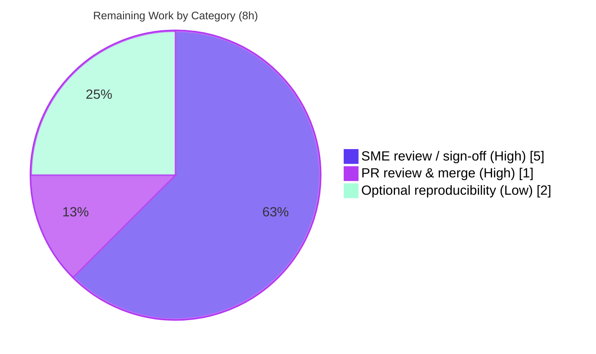

# Blitzy Project Guide — Paperless-ngx Ingestion Data-Flow (Runtime-Grounded Documentation)

## 1. Executive Summary

### 1.1 Project Overview

This project delivers a single, runtime-grounded technical document that explains how data moves through Paperless-ngx during normal document ingestion, at repository commit `542221a38dff`. It is a read-only investigation: no application code is changed. The deliverable answers six named question threads — detection & hand-off (O1), the transition into parsing/classification/indexing (O2), per-stage progress/completion (O3), final data destination & state recording (O4), duplicate tracking (O5), and duplicate avoidance (O6) — with every factual claim backed by captured runtime evidence (logs, django-q task records, WebSocket frames, database rows, on-disk files, and the Whoosh index). The audience is engineers and reviewers who need an authoritative, reproducible explanation of the ingestion pipeline.

### 1.2 Completion Status


| Metric | Value |
|--------|-------|
| **Total Hours** | 98 |
| **Completed Hours (AI + Manual)** | 90 (90 AI + 0 Manual) |
| **Remaining Hours** | 8 |
| **Percent Complete** | **91.8%** |

> Completion is computed with the AAP-scoped methodology: `Completed ÷ (Completed + Remaining) = 90 ÷ 98 = 91.8%`. All 18 AAP-specified deliverables/methodology requirements are complete; the remaining 8 hours are human-gated path-to-production activities (SME sign-off and merge) that an autonomous agent cannot close on its own.

### 1.3 Key Accomplishments

- ✅ Authored the mandated deliverable `blitzy/documentation/paperless-ngx_542221a38dff.md` (1,916 lines / 138,980 bytes) answering all six question threads O1–O6.
- ✅ Stood up and drove the full canonical stack — `redis-server`, migrations, the required `consumer` user, the `qcluster` django-q worker, the `document_consumer` inotify watcher, and a `daphne` ASGI server for `ws/status/`.
- ✅ Observed the pipeline exclusively through the canonical watched-directory entry point (no mocks, monkeypatches, debug hooks, or direct `Consumer` calls).
- ✅ Captured the complete progress state machine on `ws/status/`: `STARTING/new_file(0)` → `WORKING/parsing_document(20)` → `generating_thumbnail(70)` → `parse_date(90)` → `save_document(95)` → `SUCCESS/finished(100)`.
- ✅ Exercised every implied condition: happy path (text/PDF), duplicate re-ingestion (delete OFF and ON), unsupported extension, unsupported MIME (ELF-in-`.txt`), and the mutating RGBA-image sibling (in-place rewrite → double-enqueue → post-parser checksum).
- ✅ Recorded before/intermediate/after state and confirmed two-run stability for every condition.
- ✅ Labeled every statement observed vs inferred (107 observed / 32 inferred) and passed a self-contained coverage checklist.
- ✅ Honored the read-only constraint absolutely: `git diff 542221a38dff..HEAD` = exactly one added file; zero source/frontend/dependency/Docker changes.
- ✅ Final independent validation reproduced every documented observation byte-for-byte with **zero corrections required**; reference test suite ran 481 passed / 2 skipped / 0 failed.

### 1.4 Critical Unresolved Issues

| Issue | Impact | Owner | ETA |
|-------|--------|-------|-----|
| _None._ No blocking issues were identified. The deliverable is complete, well-formed, and validated with zero corrections; source is byte-identical to the base commit. | No release blockers | — | — |

> The only outstanding work items are non-blocking, human-gated review/merge activities enumerated in Sections 1.6 and 2.2.

### 1.5 Access Issues

| System/Resource | Type of Access | Issue Description | Resolution Status | Owner |
|-----------------|----------------|-------------------|-------------------|-------|
| _No access issues identified._ | — | The canonical Python 3.9 runtime, Redis broker, Tesseract/Ghostscript/Poppler, and the repository were all available to the autonomous run; the investigation completed end-to-end. | N/A | — |

### 1.6 Recommended Next Steps

1. **[High]** Have a Paperless-ngx subject-matter expert read the deliverable end-to-end and validate the O1–O6 answers and edge findings against domain knowledge (HT-1, 3h).
2. **[High]** Spot-check a sample of `file:line` citations and the coverage checklist (§8) against the source at commit `542221a38dff` (HT-2, 1h).
3. **[High]** Confirm the deliverable satisfies the original question intent — all six threads named and addressed — and approve the content (HT-3, 1h).
4. **[High]** Review the pull request and merge the branch into the target branch (HT-4, 1h).
5. **[Low]** _Optional:_ reproduce one happy-path and one duplicate run in the canonical Python 3.9 Docker image to independently confirm behavioral values (HT-5, 2h).

## 2. Project Hours Breakdown

### 2.1 Completed Work Detail

| Component | Hours | Description |
|-----------|-------|-------------|
| C1 · Canonical runtime environment orchestration | 8 | Bring-up of `redis-server`, migrations, `consumer`/`admin` users, `qcluster` worker, `document_consumer` inotify watcher, and `daphne` ASGI — each PID-captured with readiness polling (no fixed sleeps). |
| C2 · Observation harness development | 11 | Authenticated `ws/status/` listener, ORM state snapshotter (non-mutating before-state), fail-closed condition drivers, and allowlist-based cleanup (~470 lines of embedded scripts). |
| C3 · Happy-path investigation & capture (O1–O4) | 14 | Detection → hand-off → parse → classify → index → persist → notify; full WebSocket state machine; `documents_document` row, on-disk files, admin `LogEntry`, Whoosh index. |
| C4 · Duplicate tracking & avoidance (O5–O6) | 6 | MD5 byte-identity provenance proof; `CONSUMER_DELETE_DUPLICATES` ON/OFF branches; pre-parse vs post-parse rejection distinction. |
| C5 · Edge-case investigation | 9 | RGBA in-place rewrite → double-enqueue → post-parser checksum → late duplicate rejection; RGB no-alpha control; unsupported extension; ELF-in-`.txt` MIME; logging INFO/DEBUG split. |
| C6 · Before/intermediate/after + two-run stability | 6 | 8-condition before/after capture; each condition driven ≥2 runs; determinism analysis separating stable behavioral values from per-run identifiers. |
| C7 · Authoring the runtime-grounded answer document | 16 | 1,916-line narrative with mermaid flow, TL;DR, per-thread evidence, observed/inferred labels, coverage checklist, and full unedited appendices. |
| C8 · Review & QA iteration cycles | 10 | Resolution of 19 code-review findings + 8 Final-Acceptance QA findings + F1/F3/F2 + the O3 unauthenticated negative control, across four refinement commits. |
| C9 · Cleanup + read-only compliance + citations | 2 | Exact-PID teardown, allowlist-only temp removal, base-commit-anchored read-only proof, and citation resolution. |
| C10 · Final independent validation | 8 | Full canonical-stack re-run, byte-for-byte verification of every observation, 481-pass reference suite, 5 production-readiness gates, zero corrections. |
| **Total** | **90** | **All autonomous (AI) hours; 0 manual hours to date.** |

### 2.2 Remaining Work Detail

| Category | Hours | Priority |
|----------|-------|----------|
| Human SME technical-accuracy review / sign-off of the documentation content (HT-1 + HT-2 + HT-3) | 5 | High |
| Pull-request review and merge of the branch into the target branch (HT-4) | 1 | High |
| Optional independent reproducibility spot-check in the canonical Python 3.9 Docker image (HT-5) | 2 | Low |
| **Total** | **8** | — |

> **Cross-section check:** Section 2.1 (90) + Section 2.2 (8) = **98** = Total Hours in Section 1.2. Section 2.2 total (8) = Remaining Hours in Section 1.2 = "Remaining" in the Section 7 pie chart.

## 3. Test Results

All tests below originate from Blitzy's autonomous validation logs for this project. Because this is a **read-only documentation task**, no new application tests were authored (doing so would violate the read-only scope); the existing Paperless-ngx suite was executed as a **regression reference** to prove the source tree remained byte-identical to the base commit and fully functional.

| Test Category | Framework | Total Tests | Passed | Failed | Coverage % | Notes |
|---------------|-----------|-------------|--------|--------|------------|-------|
| Unit + Integration (regression reference) | pytest + pytest-django | 483 | 481 | 0 | N/A¹ | 2 skipped; executed in the canonical Python 3.9 container as non-root `testuser`. Confirms source unchanged and functional. |
| Runtime pipeline validation (O1–O6 + edges)² | Canonical stack (redis + qcluster + document_consumer + daphne) | 9 conditions × ≥2 runs | All observed as documented | 0 | N/A | Behavioral values (checksums, WS state machine, "It is a duplicate.") reproduced byte-for-byte; see Section 4. |

> ¹ Coverage percentage was not reported in the validation logs and is intentionally not fabricated here. ² Runtime pipeline validation is an observation exercise (not formal unit tests); it is listed for completeness and detailed in Section 4.

## 4. Runtime Validation & UI Verification

Runtime health and pipeline behavior were validated end-to-end through the canonical entry point. UI verification is limited by design: this project ships **no UI change**; the Angular client is only the recipient of `ws/status/` messages and was not modified.

**Stack health**
- ✅ **Operational** — `redis-server` broker + channel layer (`redis: PONG`).
- ✅ **Operational** — `qcluster` django-q worker (`Q Cluster … starting`).
- ✅ **Operational** — `document_consumer` inotify watcher (`Using inotify to watch directory for changes: /paperless/consume`).
- ✅ **Operational** — `daphne` ASGI server serving `ws/status/` (`/admin/login/` → HTTP 200; `Listening on TCP address 127.0.0.1:8000`).

**Ingestion pipeline (per question thread)**
- ✅ **O1 Detection & hand-off** — `Adding <path> to the task queue.` immediately followed by `async_task("documents.tasks.consume_file", …)`; worker picks up and logs `Consuming <file>`.
- ✅ **O2 Parse/classify/index** — ordered `Detected mime type` → `Parser:` → `Parsing…`; `document_consumption_finished` fan-out to matching, admin `LogEntry`, and Whoosh index add.
- ✅ **O3 Progress/completion** — authenticated `ws/status/` client captured `STARTING(0)` → `WORKING(20/70/90/95)` → `SUCCESS(100)` under a single `task_id` per text/PDF/no-alpha drop.
- ✅ **O4 Final destination & state** — `documents_document` row (MD5 `checksum`), `originals/` (+ `archive/`, `thumbnails/`) files, admin `LogEntry` (user `consumer`, id=1), Whoosh index entry, task result `Success. New document id N created`.
- ✅ **O5 Duplicate tracking** — MD5 compared to `Document.checksum`/`archive_checksum` before parsing; `checksum` is `unique=True`; stored checksum equalled input bytes for text/PDF/no-alpha.
- ✅ **O6 Duplicate avoidance** — `[ERROR] … Not consuming <file>: It is a duplicate.` + `FAILED/document_already_exists`; counts unchanged; source unlinked when `CONSUMER_DELETE_DUPLICATES=True`.

**Edge conditions**
- ✅ **Operational** — RGB no-alpha control: 1 enqueue, stored checksum == input bytes (`3d3fa69e…`), clean `SUCCESS`.
- ⚠ **Partial (documented exception)** — Supported RGBA image rewrites in place → **two** enqueues / **two** `task_id`s, **post-parser** checksum (`aa4e9abd…`); a byte-identical re-drop is caught late (`document_already_exists` + DB `UNIQUE constraint failed`). Net effect is still no new document; the mechanism is fully documented in §5.R.
- ✅ **Operational** — Unsupported extension (`.xyz`): `Unknown file extension`, no enqueue, counts unchanged.
- ✅ **Operational** — Unsupported MIME (ELF-in-`.txt` → `application/x-pie-executable`): `FAILED/unsupported_type`, counts unchanged.

## 5. Compliance & Quality Review

Deliverable and methodology requirements from the Agent Action Plan (AAP §0.7 Rules, §0.8 Special Instructions) cross-mapped to observed compliance.

| Requirement | Benchmark | Status | Evidence / Notes |
|-------------|-----------|--------|------------------|
| Deliverable at mandated path | `blitzy/documentation/paperless-ngx_542221a38dff.md` exists | ✅ Pass | 1,916 lines / 138,980 bytes; created (`A`) vs base. |
| Answers all six threads O1–O6 | Each named item addressed | ✅ Pass | Dedicated §5 subsections; coverage checklist §8 all ✅. |
| Run-first methodology | Evidence from live runs, not code alone | ✅ Pass | Full unedited `paperless.log` (§A.1) + `ws/status/` transcript (§A.2). |
| Canonical entry-point discipline | No mocks/monkeypatch/debug hooks/direct `Consumer` | ✅ Pass | Files dropped into `CONSUMPTION_DIR`; watcher/worker processed them. |
| Every-condition coverage | Primary + secondary/error/edge; before/after | ✅ Pass | 8-condition capture (§6) + RGBA edge (§5.R) + unsupported (§5.E). |
| Two-run stability | ≥2 runs; stable values confirmed | ✅ Pass | §7 table; behavioral checksums identical across runs. |
| Observed vs inferred labeling | Each claim labeled | ✅ Pass | 107 observed / 32 inferred; convention in §1.3. |
| Actual, unedited output | No paraphrase/truncation before signal | ✅ Pass | Complete captures in §A.1/§A.2. |
| Grounding | Each claim → code ref or observed output | ✅ Pass | `file:line` citations throughout; all 14 cited files resolve. |
| Read-only scope | Only the answer document added | ✅ Pass | `git diff 542221a38dff..HEAD` = one added file; scoped `src`/`src-ui`/manifest diff empty (§A.7). |
| Cleanup of temporary artifacts | Ephemeral scripts/samples removed | ✅ Pass | Exact-PID shutdown + allowlist removal (§A.4); host/container artifacts deleted. |
| Default/canonical configuration | Python 3.9 image; default SQLite/inotify | ✅ Pass | Versions captured live (§A.5); `Dockerfile:18` = `python:3.9-slim-bullseye`. |

**Fixes applied during autonomous validation:** 19 code-review findings, 8 Final-Acceptance QA findings, and F1/F3/F2 (plus the O3 unauthenticated negative control) were resolved across four refinement commits; the final independent validation required **zero** further corrections.

**Outstanding compliance items:** None within autonomous scope. Human SME sign-off (Section 1.6) is the only remaining gate.

## 6. Risk Assessment

| Risk | Category | Severity | Probability | Mitigation | Status |
|------|----------|----------|-------------|------------|--------|
| Documentation technical accuracy ultimately requires human SME confirmation | Technical | Low | Low | Byte-for-byte verified across multiple independent Blitzy passes; closed by HT-1/HT-2/HT-3 | Open (mitigated) |
| Per-run identifiers (`task_id`, `document_id`, `archive_checksum`, django-q Task PK) could be misread as instability | Technical | Low | Low | §7 explicitly separates stable behavioral values from per-run identifiers | Mitigated |
| Investigation-harness one-time credential handling | Security | Low | Low | Credential written to a mode-600 file, value never echoed, artifacts cleaned; nothing committed (§1.5/§A.4/§A.7) | Closed |
| Environment reproducibility tied to the canonical Python 3.9 image; OCR `archive_checksum` bytes vary by parser/OCR version | Operational | Low | Medium | §A.5 pins the exact Docker invocation and versions; §7 documents that behavioral values are stable while archive bytes vary | Mitigated |
| Merge integration of the branch into the target branch | Integration | Low | Low | Clean working tree, single-file diff, base-commit-anchored proof | Open (HT-4) |

> There is **no production, deployment, or runtime surface** in this deliverable (read-only documentation), so no security/operational/integration production risks apply. Source-code risk is nil: zero source changes and 481 passing reference tests.

## 7. Visual Project Status


**Remaining hours by category (Section 2.2):**



> **Integrity:** the pie "Remaining Work" value (8) equals Section 1.2 Remaining Hours (8) and the Section 2.2 Hours-column sum (5 + 1 + 2 = 8). "Completed Work" (90) equals Section 1.2 Completed Hours and the Section 2.1 total.

## 8. Summary & Recommendations

**Achievements.** The project delivers a comprehensive, runtime-grounded answer to how data moves through Paperless-ngx ingestion at commit `542221a38dff`. All six question threads (O1–O6) are answered with captured logs, django-q task records, WebSocket frames, database rows, on-disk files, and Whoosh index evidence, plus fully documented edge behavior (the mutating RGBA sibling, unsupported types, and the logging split). The read-only constraint was honored absolutely.

**Remaining gaps.** No technical gaps remain within the autonomous scope. The residual **8 hours** are human-gated: subject-matter-expert review and sign-off (6h) and an optional independent reproducibility spot-check (2h).

**Critical path to production.** SME accuracy review (HT-1/HT-2/HT-3) → PR review & merge (HT-4). The optional reproducibility check (HT-5) can run in parallel and is largely de-risked because multiple independent Blitzy passes already reproduced every value.

**Success metrics.** Deliverable present at the mandated path; all six threads answered and coverage-checked; two-run stability confirmed; 481/483 reference tests passing (2 skipped, 0 failed); zero source changes; zero corrections at final validation.

**Production readiness.** The project is **91.8% complete** (90 of 98 hours). The deliverable is production-ready pending human sign-off; there are no blocking issues and the overall risk profile is very low.

| Metric | Value |
|--------|-------|
| Completion | 91.8% |
| Completed / Total hours | 90 / 98 |
| Remaining hours | 8 (all human-gated) |
| Blocking issues | 0 |
| Source files changed | 0 |
| Reference tests | 481 passed / 2 skipped / 0 failed |

## 9. Development Guide

This guide covers how to (A) locate, read, and verify the deliverable, and (B) reproduce the runtime investigation in the canonical environment. Commands are copy-pasteable; verification commands were tested against the working tree.

### 9.1 System Prerequisites

- **Docker** (to run the canonical Python 3.9 image that bundles the runtime, Redis, Tesseract, Ghostscript, and Poppler).
- **Git** (to inspect history and verify the read-only compliance proof).
- Canonical runtime (inside the image): **Python 3.9.23**, Django 4.0.4, django-q 1.3.9, channels 3.0.4, channels-redis 3.4.0, whoosh 2.7.4. Base image: `python:3.9-slim-bullseye` (`Dockerfile:18`).

### 9.2 Environment Setup

```bash
# Launch the canonical baseline container (idle), with Paperless directories/broker configured
docker run -d --name pngx-obs --entrypoint sleep \
  -e PAPERLESS_DATA_DIR=/paperless/data \
  -e PAPERLESS_MEDIA_ROOT=/paperless/media \
  -e PAPERLESS_CONSUMPTION_DIR=/paperless/consume \
  -e PAPERLESS_REDIS=redis://localhost:6379 \
  paperless-ngx-baseline:542221a38dff infinity

# Open a shell as the non-root testuser
docker exec -it pngx-obs su testuser -s /bin/bash
```

### 9.3 Dependency Installation

No dependencies are added by this task. Runtime dependencies ship in the canonical image. The observation harness uses two small Python packages already present in the image:

```bash
python -c "import websockets, requests; print('harness deps OK')"   # websockets 10.3, requests 2.27.1
```

### 9.4 Investigation / Application Startup (ordered)

```bash
# 1) One-time prep: migrations (creates the required `consumer` user), users, one-time admin cred, sample inputs
bash prepare.sh pl.env

# 2) Bring up the background stack (each PID-captured + readiness-polled, no fixed sleeps)
bash bringup.sh          # redis (PONG) -> qcluster -> document_consumer (inotify) -> tail -F observer

# 3) Start the ASGI server that serves the ws/status/ WebSocket
bash start_asgi.sh       # daphne; /admin/login/ -> HTTP 200; Listening on 127.0.0.1:8000

# 4) Drive the conditions through the canonical watched-directory entry point
bash drive_default.sh    # text/PDF happy path, duplicates (delete OFF/ON), unsupported ext/MIME
bash drive_rgba.sh       # RGBA (mutating) + RGB no-alpha control

# 5) Safe teardown: exact-PID shutdown + allowlist-only temp removal (no wildcards)
bash cleanup.sh
```

### 9.5 Verification Steps (tested)

```bash
# From the repository root on branch blitzy-82f385ec-6e30-44aa-a31e-642e09782a4c

# (1) Deliverable present and sized
ls -l blitzy/documentation/paperless-ngx_542221a38dff.md
wc -l blitzy/documentation/paperless-ngx_542221a38dff.md          # -> 1916

# (2) Read-only compliance proof (anchored to the immutable base commit)
git diff 542221a38dff..HEAD --name-status                          # -> A  blitzy/documentation/paperless-ngx_542221a38dff.md
git diff 542221a38dff..HEAD --stat -- src src-ui Pipfile Pipfile.lock requirements.txt Dockerfile docker
#   (empty output == zero source/frontend/manifest/Docker changes)

# (3) Document integrity
DOC=blitzy/documentation/paperless-ngx_542221a38dff.md
grep -cE '^```' "$DOC"                                             # -> 138 (even == balanced fences)
for o in O1 O2 O3 O4 O5 O6; do echo -n "$o "; grep -cE "^### $o " "$DOC"; done   # each -> 1
echo "observed=$(grep -oiE '\bobserved\b' "$DOC" | wc -l) inferred=$(grep -oiE '\binferred\b' "$DOC" | wc -l)"  # -> 107 / 32

# (4) Citation spot-check against source
sed -n '85p' src/documents/management/commands/document_consumer.py   # -> logger.info(f"Adding {filepath} to the task queue.")
sed -n '135p' src/documents/models.py                                 # -> checksum = models.CharField(

# (5) Confirm the base commit is reachable/immutable
git cat-file -t 542221a38dff                                          # -> commit
```

### 9.6 Example Usage — How to Read the Deliverable

The document is the product. Recommended reading order:
1. **§2 TL;DR** — one-line answers to O1–O6 (with the RGBA scope caveats).
2. **§3 End-to-end flow** — the observed causal order (mermaid diagram).
3. **§5 O1–O6** — the direct answers, each with live evidence and `file:line` citations.
4. **§9 Appendix A.1/A.2** — the complete, unedited `paperless.log` and `ws/status/` transcript to trace any claim to raw output.

### 9.7 Troubleshooting

- **`User.DoesNotExist` during finalization** → the `consumer` user is missing; it is created by the data migration, so run migrations before ingesting (`set_log_entry`, `handlers.py:416`).
- **Nothing gets consumed** → confirm `redis-server` is up **before** `qcluster`/`document_consumer`; the worker and watcher both depend on the broker.
- **File ignored on drop** → the inotify watcher debounces and waits for a quiet/unmodified file; ensure the file is fully written before it lands in `CONSUMPTION_DIR`.
- **Checksums/`task_id`s differ between runs** → expected: `task_id`, `document_id`, django-q Task PK, and PDF/OCR `archive_checksum` vary per run by design (§7); the behavioral values (stored `checksum` for text/PDF/no-alpha, WS state sequence) are stable.
- **One PNG produced two tasks** → expected for RGBA images: the parser rewrites the file in place to remove the alpha layer, which re-triggers the watcher (§5.R).

## 10. Appendices

### A. Command Reference

| Command | Purpose |
|---------|---------|
| `redis-server` | Start the broker + channel layer |
| `python src/manage.py migrate` | Apply migrations (creates the `consumer` user) |
| `python src/manage.py qcluster` | Start the django-q worker |
| `python src/manage.py document_consumer` | Start the inotify directory watcher |
| `daphne paperless.asgi:application` | Serve the `ws/status/` WebSocket |
| `tail -F <DATA_DIR>/log/paperless.log` | Follow the primary evidence log |
| `git diff 542221a38dff..HEAD --name-status` | Read-only compliance proof |

### B. Port Reference

| Port | Service | Notes |
|------|---------|-------|
| 6379 | Redis | Broker + Channels layer (`redis://localhost:6379`) |
| 8000 | daphne ASGI | Serves HTTP + `ws/status/` WebSocket (`127.0.0.1:8000`) |

### C. Key File Locations

| Path | Role |
|------|------|
| `blitzy/documentation/paperless-ngx_542221a38dff.md` | **The deliverable** (answer document) |
| `src/documents/management/commands/document_consumer.py` | Directory watcher; detection + hand-off (O1) |
| `src/documents/tasks.py` | django-q `consume_file` task |
| `src/documents/consumer.py` | Pipeline orchestrator; progress stream; duplicate pre-check |
| `src/documents/signals/handlers.py` | Classification, admin `LogEntry`, index add |
| `src/documents/index.py` | Whoosh schema + writer |
| `src/documents/models.py` | `Document` model; `checksum unique=True` |
| `src/paperless/consumers.py` / `src/paperless/urls.py` | `StatusConsumer` + `ws/status/` route |
| `src/paperless/settings.py` | Logging, `Q_CLUSTER`, channel layer, directories, dedup flags |

### D. Technology Versions

| Component | Version |
|-----------|---------|
| Python | 3.9.23 (`python:3.9-slim-bullseye`) |
| Django | 4.0.4 |
| django-q | 1.3.9 |
| channels | 3.0.4 |
| channels-redis | 3.4.0 |
| whoosh | 2.7.4 |
| websockets (harness) | 10.3 |
| requests (harness) | 2.27.1 |

### E. Environment Variable Reference

| Variable | Example | Purpose |
|----------|---------|---------|
| `PAPERLESS_DATA_DIR` | `/paperless/data` | DB, logs, Whoosh index, classifier model |
| `PAPERLESS_MEDIA_ROOT` | `/paperless/media` | `documents/originals\|archive\|thumbnails` |
| `PAPERLESS_CONSUMPTION_DIR` | `/paperless/consume` | Watched ingestion directory |
| `PAPERLESS_REDIS` | `redis://localhost:6379` | Broker + channel layer |
| `PAPERLESS_CONSUMER_POLLING` | `0` (default) | `0` = inotify watcher; non-zero = polling |
| `PAPERLESS_CONSUMER_DELETE_DUPLICATES` | `false` (default) | Whether a detected duplicate source file is unlinked |

### F. Developer Tools Guide

- **Git diff (read-only proof):** `git diff 542221a38dff..HEAD --name-status` anchors to the immutable base commit, so the proof stays valid across any finalization commits.
- **Log grouping:** each ingestion's log lines share a `group` (per-file `LoggingMixin`), making a single run easy to isolate in `paperless.log`.
- **WebSocket inspection:** an authenticated client on `ws/status/` receives the JSON progress payloads verbatim; the harness listener records them to a transcript.

### G. Glossary

| Term | Meaning |
|------|---------|
| **O1–O6** | The six named question threads: detection & hand-off, parse/classify/index transition, per-stage progress, final destination & state, duplicate tracking, duplicate avoidance. |
| **Canonical entry point** | A file placed into `CONSUMPTION_DIR` and picked up by the running `document_consumer` watcher (no mocks/direct calls). |
| **Observed vs inferred** | Observed = captured at runtime; inferred = derived from code reading (explicitly labeled). |
| **Post-parser checksum** | For a mutating parser (RGBA de-alpha), the stored `Document.checksum` reflects the file bytes **after** parsing, not the input bytes. |
| **`status_updates`** | The Channels group the pipeline broadcasts progress payloads to; clients subscribe via `ws/status/`. |