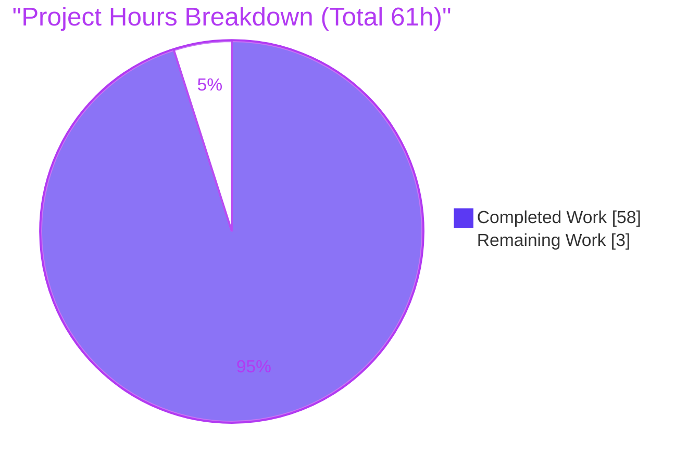
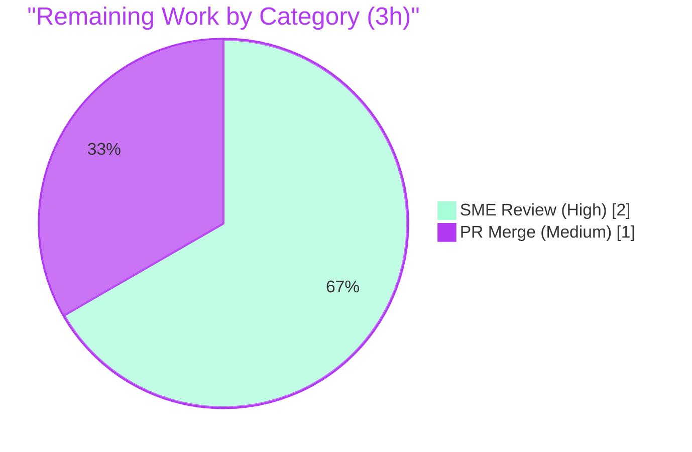

# Blitzy Project Guide — Paperless-ngx Runtime Investigation

> **Color legend (Blitzy brand):** Completed / AI Work = Dark&nbsp;Blue `#5B39F3` · Remaining / Not Completed = White `#FFFFFF` · Headings / Accents = Violet-Black `#B23AF2` · Highlight = Mint `#A8FDD9`.

---

## 1. Executive Summary

### 1.1 Project Overview

This project is a **read-only, run-first runtime investigation** of the paperless-ngx document-processing pipeline at source commit `542221a38dff`. Its objective is to produce one evidence-based Markdown answer document explaining, from observed runtime behavior, how a document is ingested (which services participate and the ordered log sequence), when the machine-learning classifier retrains (and the log lines that distinguish "training happened" from "idle"), and where processed data lands (media directory layout, default filename pattern, and which database tables gain rows). The target users are engineers who must understand the software's genuine behavior **before making any changes**. Business impact: a durable, citation-backed knowledge artifact that de-risks future work on the ingestion, classification, and storage subsystems.

### 1.2 Completion Status


| Metric | Value |
| --- | --- |
| **Total Hours** | 61 |
| **Completed Hours (AI + Manual)** | 58 (AI 58 + Manual 0) |
| **Remaining Hours** | 3 |
| **Percent Complete** | **95.1%** |

> Completion is computed with the AAP-scoped hours methodology: `Completed ÷ (Completed + Remaining) = 58 ÷ 61 = 95.1%`. Every AAP deliverable is complete; the residual 3 hours are path-to-production **human sign-off** (SME review + merge), which caps completion just below 100% by design.

### 1.3 Key Accomplishments

- ✅ Brought up the full canonical stack (gunicorn ASGI web server, `document_consumer` watcher, `qcluster` django-q worker/scheduler, Redis 6.0 broker, default SQLite) from the provided Docker image and proved it live before any document was submitted.
- ✅ **Q1** answered: a real PDF submitted through `POST /api/documents/post_document/` was traced end-to-end, with the complete, unedited, service-attributed log sequence captured (enqueue → `qcluster` → 16-line DEBUG consumer stream → six post-consumption handlers → file move), plus the duplicate-rejection path.
- ✅ **Q2** answered: demonstrated that upload ≠ train; established that training is a **scheduled hourly**, doubly-conditional task (needs a `MATCH_AUTO` entity **and** a SHA-1 data-hash change); captured **all four** outcomes live — TRAINED (INFO), IDLE (DEBUG, stable across repeated runs), GUARD (no log), ERROR (WARNING).
- ✅ **Q3** answered: documented the three fixed media subdirectories, the default zero-padded 7-digit filename pattern, and the exactly three database tables that gain rows per ingestion — proven with a read-only (`mode=ro`) before/after snapshot.
- ✅ ~130 `file:line` citations verified against source at the exact commit; a coverage table maps every sub-question (Q1a–f, Q2a–g, Q3a–d) to its evidence and honestly labels the evidence type.
- ✅ Read-only boundary preserved perfectly: the only repository change is the single deliverable; all temporary scripts/test PDFs were cleaned up and both runtime bring-ups disposed.
- ✅ Deliverable passes the repository's `prettier@2.6.2` markdown linter with zero violations; documents-app regression suite = 406 passed / 2 skipped / 0 failed.

### 1.4 Critical Unresolved Issues

| Issue | Impact | Owner | ETA |
| --- | --- | --- | --- |
| _None_ — no blocking issues. The single deliverable is complete, committed, internally consistent, citation-accurate, and linter-clean. | None | — | — |

> The only outstanding activity is standard human review/merge (Section 1.6, Section 2.2). It is a normal path-to-production gate, not a defect or blocker.

### 1.5 Access Issues

| System / Resource | Type of Access | Issue Description | Resolution Status | Owner |
| --- | --- | --- | --- | --- |
| _None_ | — | No access issues identified. The full stack (Docker image, Redis, database, filesystem) was brought up and exercised end-to-end without permission or credential blockers. | N/A | — |

> Note (not an access issue): the base image lacked two native libraries required at runtime — `libzbar0` and `poppler-utils` — plus the ImageMagick PDF policy. These were installed/applied during bring-up and are fully documented in the deliverable's §1 and in Section 9 below.

### 1.6 Recommended Next Steps

1. **[High]** Perform an SME technical read-through of the deliverable, validating each of the three answers against the built-in §7 coverage table (Q1 pipeline/log sequence, Q2 retraining conditions + distinguishing log lines, Q3 disk layout/DB tables).
2. **[High]** Spot-verify a sample of `file:line` citations against source at commit `542221a38dff` and re-confirm the read-only integrity (`git diff 542221a38dff --name-status` → single file).
3. **[Medium]** Approve and merge the documentation pull request.
4. **[Low]** _(Informational, out of AAP scope)_ If the knowledge is later needed for a **newer** paperless-ngx release, plan a separate investigation — the classifier changed materially post-commit (HMAC-signed model, `StoragePath` classifier, NLTK stemming); those are explicitly out of scope here and must not be conflated with this commit's `FORMAT_VERSION = 7` behavior.

---

## 2. Project Hours Breakdown

### 2.1 Completed Work Detail

| Component | Hours | Description |
| --- | --- | --- |
| Environment bring-up & canonical stack orchestration | 6 | Ran the provided Docker image + `redis:6.0`; applied documented native fixes (`libzbar0`, `poppler-utils`, ImageMagick policy); migrated schema; created a test superuser; launched the three services mirroring `docker/supervisord.conf` as UID 1000. |
| Q1 — ingestion pipeline investigation & log-sequence capture | 8 | Submitted a real PDF via the REST entry point; captured the complete, unedited, byte-offset-delimited log sequence across gunicorn/qcluster/paperless logs; attributed each line to its emitting service/logger; traced the six post-consumption handlers and the duplicate-rejection path. |
| Q2 — classifier retraining investigation | 10 | Proved upload ≠ train; established the hourly schedule and the `MATCH_AUTO` + SHA-1 double condition; exercised all four outcomes (TRAINED / IDLE / GUARD / ERROR) non-destructively; confirmed IDLE stability across repeated runs; analyzed the inbox-exclusion edge case. |
| Q3 — on-disk layout & database-table investigation | 5 | Inspected the three media subdirectories; confirmed the default 7-digit filename pattern with `PAPERLESS_FILENAME_FORMAT` unset; performed a 26-table before/after read-only (`mode=ro`) DB snapshot to enumerate the exactly-three tables that gain rows. |
| Corroborating web research | 2 | Cross-checked official docs (hourly retrain, inbox exclusion, dedup suffix) and community log evidence to validate — not replace — the runtime observations; recorded the version boundary. |
| Deliverable authoring | 10 | Wrote the 1,689-line structured answer document pairing every behavioral claim with its command + complete captured output and every code-level claim with a `file:line` citation. |
| `file:line` citation verification (~130) | 4 | Verified each cited line against source at commit `542221a38dff`. |
| Coverage confirmation pass | 2 | Built the §7 coverage matrix mapping Q1a–f / Q2a–g / Q3a–d to evidence and honestly labeling evidence types (captured / bounded / source-derived / non-canonical / inferred). |
| Review-finding remediation | 8 | Resolved 23 review findings plus transcript-fidelity (P4-DOC-01), citation, and internal-consistency fixes across five follow-up commits. |
| Cleanup, read-only proof & linter compliance | 3 | Removed all temporary artifacts; disposed both runtime bring-ups; proved `git diff` shows only the single deliverable; applied and verified `prettier@2.6.2`. |
| **Total Completed** | **58** | Matches Completed Hours in Section 1.2. |

### 2.2 Remaining Work Detail

| Category | Hours | Priority |
| --- | --- | --- |
| Human SME technical review & accuracy validation of the deliverable (includes a `file:line` citation spot-check and read-only integrity re-confirmation) | 2 | High |
| PR approval & merge of the documentation artifact | 1 | Medium |
| **Total Remaining** | **3** | Matches Remaining Hours in Section 1.2 and the "Remaining Work" value in Section 7. |

### 2.3 Hours Reconciliation & Methodology

- **Formula:** `Completion % = Completed ÷ (Completed + Remaining) = 58 ÷ 61 = 95.1%`.
- **Integrity Rule 2:** Section 2.1 total (58) + Section 2.2 total (3) = **61** = Total Project Hours in Section 1.2. ✅
- **Integrity Rule 1:** Remaining hours = **3** in Section 1.2, Section 2.2, and the Section 7 pie chart. ✅
- **Scope:** hours cover only AAP-specified investigation/deliverable work and documentation path-to-production. No out-of-scope items are included (no code, deployment, CI, or feature work exists in this AAP).
- **Confidence:** High. The scope is a single, well-defined documentation deliverable; all requirements are observed as complete with captured evidence.

---

## 3. Test Results

All tests below originate from Blitzy's autonomous validation logs for this project. Because the sole in-scope change is one Markdown file, no application code was modified; the suite below was executed by the Final Validator as a **regression sanity check** on the documents app (the in-scope subsystem the deliverable describes) to confirm a healthy runtime and zero regression.

| Test Category | Framework | Total Tests | Passed | Failed | Coverage % | Notes |
| --- | --- | --- | --- | --- | --- | --- |
| Backend unit/integration (documents app) | pytest | 408 | 406 | 0 | N/A | Command: `pytest documents/tests -p no:cov -o addopts="" -q` (as UID 1000); 333.60s; **2 skipped** (by-design conditional skips), 0 errors; 88 benign deprecation/whitenoise warnings. Coverage plugin intentionally disabled (`-p no:cov`), so coverage was not measured this run. |
| Documentation linter (deliverable) | prettier@2.6.2 | 1 | 1 | 0 | N/A | `npx prettier@2.6.2 --check blitzy/documentation/paperless-ngx_542221a38dff.md` → "All matched files use Prettier code style!" (exit 0). |
| **Totals** | — | **409** | **407** | **0** | — | 2 skipped (documents suite). No failures, no errors. |

> **Interpretation:** the Markdown-only change cannot affect Python unit tests; a fully green documents-app run confirms the runtime environment used to gather evidence is healthy and that nothing regressed. Test authoring/changes were explicitly out of scope per the AAP — no test files were created or modified.

---

## 4. Runtime Validation & UI Verification

**Runtime health (full canonical stack, brought up from the provided Docker image):**

- ✅ **Operational** — gunicorn ASGI web server (`paperless.asgi:application`) bound on `:8000`, HTTP 200.
- ✅ **Operational** — `document_consumer` directory watcher running.
- ✅ **Operational** — `qcluster` django-q worker/scheduler running (executes `consume_file` and the hourly `train_classifier`).
- ✅ **Operational** — Redis 6.0 broker (`PING` → `PONG`, client reachable).
- ✅ **Operational** — default SQLite database at `DATA_DIR/db.sqlite3` (migrations applied).

**API integration outcomes:**

- ✅ **Operational** — DRF token issuance via `POST /api/token/`.
- ✅ **Operational** — real ingestion via `POST /api/documents/post_document/` → django-q `async_task` → `qcluster` `Consumer.try_consume_file()` → six `document_consumption_finished` handlers → files moved/renamed.
- ✅ **Operational** — duplicate re-upload correctly rejected ("Not consuming …: It is a duplicate.", django-q task `Failed`).
- ✅ **Operational** — classifier training via the canonical `document_create_classifier` trigger; all four branches reached.

**Q1 / Q2 / Q3 evidence capture:**

- ✅ **Operational** — Q1 ordered log sequence captured complete and unedited.
- ✅ **Operational** — Q2 all four training outcomes captured; IDLE stable across repeated runs.
- ✅ **Operational** — Q3 media tree + filename pattern + exactly-three DB tables captured.

**UI verification:** ⚠ **Not applicable.** This is a backend, documentation-only investigation. The Angular frontend (`src-ui/`) was **not** modified and no UI work was in scope; therefore no UI screenshots or visual verification apply. (The REST API and background services — the actual observation surface — are validated above.)

---

## 5. Compliance & Quality Review

AAP deliverables and governing rules cross-mapped to their quality/compliance benchmarks. Fixes applied during autonomous validation are noted.

| AAP / Rule Benchmark | Requirement | Status | Progress / Evidence |
| --- | --- | --- | --- |
| Deliverable location & name | Exactly `blitzy/documentation/paperless-ngx_542221a38dff.md` | ✅ Pass | File present, 1,689 lines; committed at HEAD `226e67d21`. |
| Answer completeness | Every part of all three questions + every named item answered | ✅ Pass | §7 coverage matrix maps Q1a–f, Q2a–g, Q3a–d to evidence. |
| Run-first methodology | Behavior observed at runtime, not inferred from reading | ✅ Pass | Full stack run; commands + complete captured output shown throughout. |
| Canonical entry point (no bypass) | Real ingestion via REST / consume-dir, not ORM/mocks | ✅ Pass | `POST /api/documents/post_document/` → django-q → qcluster path exercised; non-canonical preconditions explicitly labeled. |
| Frequency/stability (Q2) | ≥2 runs; both trained & idle branches | ✅ Pass | All four outcomes captured; IDLE stable across repeated runs (identical model MD5). |
| Exercise every condition | Primary + secondary paths | ✅ Pass | TRAINED / IDLE / GUARD / ERROR all captured; duplicate-rejection captured. |
| Output fidelity | Complete, unedited output beside each claim | ✅ Pass | Byte-offset-delimited log deltas; `mode=ro` DB snapshots. Fixed during validation: P4-DOC-01 transcript fidelity (commit `4d09609f4`). |
| `file:line` citations | Every code-level claim cited & accurate | ✅ Pass | ~130 citations verified; views.py citations corrected (commit `226e67d21`); spot-check by this assessment all accurate. |
| Version boundary | Scoped to `FORMAT_VERSION = 7`; no newer-release behavior | ✅ Pass | Stated in header, §4.8, §6.3. |
| Read-only source repository | No existing file modified; no code added beyond the doc | ✅ Pass | `git diff 542221a38dff --name-status` = `A` single deliverable. |
| Cleanup | All temporary scripts/test docs removed | ✅ Pass | §8 evidences removal; working tree clean; runtimes disposed. |
| Markdown quality gate | Repo linter clean | ✅ Pass | `prettier@2.6.2 --check` → 0 violations. |
| Regression safety | In-scope subsystem healthy | ✅ Pass | documents-app pytest 406 passed / 0 failed. |

**Outstanding compliance items:** none. All benchmarks pass.

---

## 6. Risk Assessment

| Risk | Category | Severity | Probability | Mitigation | Status |
| --- | --- | --- | --- | --- | --- |
| Runtime reproducibility depends on 3 native fixes (`libzbar0`, `poppler-utils`, ImageMagick policy) absent from the base image | Technical | Low | Medium | Exact fix commands documented in deliverable §1 and Section 9 | Mitigated |
| Non-canonical preconditions used to reach conditional branches (ORM-created `MATCH_AUTO` correspondent; temporary state for GUARD/ERROR) | Technical | Low | Low | Explicitly labeled "non-canonical" in §4.3 and §7; state changes reversed non-destructively | Accepted |
| Volatile values in captures (timestamps, temp paths, task IDs, ports) differ on re-run | Technical | Low | High | Behavior (not exact values) is the claim; values presented faithfully | Accepted |
| Throwaway `PAPERLESS_SECRET_KEY` generated for the run | Security | Low | Low | Test-only, discarded with the container; disclosed in §1 | Mitigated |
| No change to production security posture | Security | None | — | Zero code/config/dependency change → no new attack surface | N/A |
| Version staleness — answer strictly scoped to commit `542221a38dff`; newer releases differ (HMAC / `StoragePath` / NLTK) | Operational | Medium | Medium | Version boundary stated prominently (header, §4.8, §6.3) | Mitigated |
| No deployment/operations footprint (deliverable is a document) | Operational | None | — | Nothing to operate, monitor, or back up | N/A |
| Deliverable value depends on human SME confirmation before reliance | Integration | Low | Low | Verified citations + coverage table make review efficient (Section 2.2 / Human Tasks) | Open (pending review) |
| No external integrations added (no APIs/keys/webhooks) | Integration | None | — | Nothing to integrate | N/A |
| A sub-question could be missed | Scope | Low | Low | §7 coverage pass maps every sub-ask to evidence | Mitigated |

**Overall risk posture: LOW.** No high or critical risks. The dominant residual is version-scoped staleness (Operational, Medium), already prominently disclosed in the deliverable itself.

---

## 7. Visual Project Status

**Project hours breakdown** (Completed = Dark Blue `#5B39F3`, Remaining = White `#FFFFFF`):



**Remaining hours by category** (from Section 2.2):



> **Integrity check:** the pie "Remaining Work" value (**3**) equals the Section 1.2 Remaining Hours (**3**) and the sum of the Section 2.2 Hours column (**2 + 1 = 3**). ✅

---

## 8. Summary & Recommendations

**Achievements.** The project delivered a rigorous, evidence-based runtime investigation of paperless-ngx at commit `542221a38dff`, packaged as a single 1,689-line Markdown answer document. All three questions are answered from observed behavior: the ingestion pipeline and its ordered, service-attributed log sequence (Q1); the classifier's scheduled, doubly-conditional retraining with all four outcomes captured live (Q2); and the default on-disk layout plus the exactly-three database tables that gain rows per ingestion (Q3). Every behavioral claim is paired with its command and complete captured output; every code-level claim carries a verified `file:line` citation (~130 total).

**Remaining gaps.** None in the AAP-scoped work — all deliverables are complete. The only remaining effort is standard path-to-production **human sign-off**: an SME technical accuracy review and PR approval/merge (3 hours total).

**Critical path to production.** (1) SME review against the §7 coverage table → (2) citation & read-only spot-check → (3) approve & merge. There is no build, deployment, integration, or CI work because the deliverable is a documentation artifact and the source repository is unchanged.

**Success metrics.** Read-only integrity preserved (single-file diff); linter-clean (`prettier` 0 violations); regression-safe (documents-app 406 passed / 0 failed); citation-accurate (spot-checks all pass); coverage-complete (every sub-question mapped).

**Production readiness assessment.** The document is **ready for human review and merge**. At **95.1% AAP-scoped completion**, the autonomous work is effectively finished; the residual 3 hours are the human-review/merge gate that intentionally keeps completion below 100%.

| Dimension | Assessment |
| --- | --- |
| AAP-scoped completion | 95.1% (58 of 61 hours) |
| Deliverable status | Complete, committed (HEAD `226e67d21`), linter-clean |
| Read-only compliance | Fully preserved (single-file addition) |
| Overall risk | Low |
| Blocker count | 0 |
| Recommended action | SME review → merge |

---

## 9. Development Guide

This guide has two tracks: **(A)** review the deliverable (fast; host tooling only), and **(B)** reproduce the full runtime investigation (Docker). All commands are copy-pasteable and non-interactive.

### 9.1 System Prerequisites

**Track A — Review the deliverable**

- `git` (repository access to branch `blitzy-22f1e249-c2d6-4710-b5ff-edc0b973e2d8`).
- Any Markdown viewer (the file renders on GitHub/GitLab; Mermaid diagrams require a Mermaid-capable renderer).
- Node.js + `npx` (only to run the linter) — verified with Node v22.x / npm 11.x.

**Track B — Reproduce the investigation**

- Docker Engine (verified with 28.x); ability to pull the provided image.
- The canonical runtime is **Python 3.9** *inside* the image (`Dockerfile:18` → `python:3.9-slim-bullseye`); do not use a host Python.
- Redis 6.0 (run as a sibling container).

### 9.2 Environment Setup

**Track A**

```bash
# From the repository root on the project branch:
git rev-parse --abbrev-ref HEAD          # expect: blitzy-22f1e249-c2d6-4710-b5ff-edc0b973e2d8
ls -l blitzy/documentation/paperless-ngx_542221a38dff.md
```

**Track B — canonical stack bring-up** (from the deliverable's §1; verified at runtime)

```bash
IMAGE="ghcr.io/scaleapi/swe-atlas:swe_atlas_QnA_paperless-ngx_paperless-ngx_e233ae8334038a4b615ea2e4ce663e30_qna_1.01"
TEST_SECRET="$(python3 -c 'import secrets; print(secrets.token_hex(24))')"   # throwaway, test-only

docker network create pngx-net
docker run -d --name pngx-redis --network pngx-net redis:6.0                  # broker: redis:6.0
docker run -d --name pngx --network pngx-net \
    -e PAPERLESS_REDIS=redis://pngx-redis:6379 \
    -e PAPERLESS_TIME_ZONE=UTC \
    -e PAPERLESS_SECRET_KEY="$TEST_SECRET" \
    -p 127.0.0.1:8000:8000 \
    --entrypoint /bin/bash "$IMAGE" -c "sleep infinity"
```

### 9.3 Dependency Installation

All backend Python dependencies are **pre-installed** in the image (Django ~=4.0, django-q ~=1.3, DRF ~=3.13, scikit-learn ==1.0.2, whoosh ~=2.7.4, ocrmypdf ~=13.4, channels ~=3.0). Two native libraries and one policy file must be added at runtime:

```bash
# Native runtime deps missing from the base image, plus the PDF policy fix:
docker exec pngx bash -lc 'export DEBIAN_FRONTEND=noninteractive; apt-get update -qq && \
    apt-get install -y --no-install-recommends libzbar0 poppler-utils'
docker exec pngx bash -lc 'cp /app/docker/imagemagick-policy.xml /etc/ImageMagick-6/policy.xml'
```

> `libzbar0` is mandatory: `src/documents/tasks.py:25` imports `from pyzbar import pyzbar` at module load, so without the native `zbar` library **every** django-q task fails to import.

### 9.4 Application Startup

```bash
# Runtime dirs owned by the non-root service user (UID/GID 1000), matching supervisord's user=paperless:
docker exec pngx bash -lc 'mkdir -p /app/data /app/media /app/consume /app/logs /tmp/paperless && \
    chown -R 1000:1000 /app/data /app/media /app/consume /app/logs /tmp/paperless'

# Schema + a throwaway test superuser:
docker exec -u 1000:1000 -w /app/src pngx bash -lc 'python3 manage.py migrate --no-input'
docker exec -u 1000:1000 -e DJANGO_SUPERUSER_PASSWORD=admin -w /app/src pngx bash -lc \
    'python3 manage.py createsuperuser --no-input --username admin --email admin@example.com'

# Start the three services (mirrors docker/supervisord.conf) — each detached:
docker exec -u 1000:1000 -w /app/src pngx bash -lc \
  'setsid bash -c "gunicorn -c /app/gunicorn.conf.py paperless.asgi:application >> /app/logs/gunicorn.log 2>&1" </dev/null & \
   setsid bash -c "python3 manage.py document_consumer >> /app/logs/consumer.log 2>&1" </dev/null & \
   setsid bash -c "python3 manage.py qcluster >> /app/logs/qcluster.log 2>&1" </dev/null &'
```

### 9.5 Verification Steps

```bash
# 1) Web server responds:
docker exec pngx bash -lc 'curl -s -o /dev/null -w "%{http_code}\n" http://127.0.0.1:8000/'   # expect 200

# 2) Broker reachable:
docker exec pngx-redis redis-cli PING                                                         # expect PONG

# 3) Services present:
docker exec pngx bash -lc 'ps -eo pid,args | grep -E "gunicorn|document_consumer|qcluster" | grep -v grep'

# 4) Deliverable review-side checks (host, repo root):
test -f blitzy/documentation/paperless-ngx_542221a38dff.md && echo PRESENT
git diff 542221a38dff --name-status         # expect exactly: A  blitzy/documentation/paperless-ngx_542221a38dff.md
npx --yes prettier@2.6.2 --check blitzy/documentation/paperless-ngx_542221a38dff.md   # expect: All matched files use Prettier code style!
```

### 9.6 Example Usage — reproduce each answer

```bash
# Q1 — real ingestion via the REST entry point:
TOKEN=$(docker exec pngx bash -lc "curl -s -X POST http://127.0.0.1:8000/api/token/ \
    -d 'username=admin&password=admin' | python3 -c 'import sys,json;print(json.load(sys.stdin)[\"token\"])'")
docker exec pngx bash -lc "curl -s -X POST http://127.0.0.1:8000/api/documents/post_document/ \
    -H 'Authorization: Token $TOKEN' -F 'document=@/tmp/test.pdf'"
docker exec pngx bash -lc 'tail -n 40 /app/data/log/paperless.log'   # observe the ordered DEBUG sequence

# Q2 — canonical training trigger (after configuring a MATCH_AUTO entity, per §4.3):
docker exec -u 1000:1000 -w /app/src pngx python3 manage.py document_create_classifier
#   TRAINED -> "[INFO] [paperless.tasks] Saving updated classifier model to ..."
#   IDLE    -> "[DEBUG] [paperless.tasks] Training data unchanged."

# Q3 — on-disk layout and filename pattern:
docker exec pngx bash -lc 'find /app/media/documents -maxdepth 2 -type d; ls -l /app/media/documents/originals'

# Verify any file:line citation directly against source (reviewer command):
sed -n '63p' src/documents/classifier.py     # -> FORMAT_VERSION = 7
sed -n '584p' src/paperless/settings.py       # -> PAPERLESS_FILENAME_FORMAT = os.getenv("PAPERLESS_FILENAME_FORMAT")
```

### 9.7 Troubleshooting

- **Every django-q task fails to import** → `libzbar0` not installed (see §9.3). Install it, then restart `qcluster`.
- **OCR / thumbnail generation fails** → `poppler-utils` missing or the ImageMagick PDF policy not applied (see §9.3).
- **Permission errors on `/app/data` or `/app/media`** → ensure the dirs are owned by UID/GID 1000 before starting services (see §9.4).
- **`gunicorn.conf.py` not found** → in this image the source is baked at `/app`, so use `/app/gunicorn.conf.py` (canonical `docker/supervisord.conf:11` references `/usr/src/paperless/gunicorn.conf.py`).
- **"idle" training line not visible** → it is DEBUG-level; the `paperless` logger is at DEBUG by default and writes the full stream to `/app/data/log/paperless.log`, while the console/`qcluster.log` shows INFO+ (with `DEBUG=False`).
- **Cleanup** → because the app container uses no bind mounts/named volumes, `docker rm -f pngx pngx-redis && docker network rm pngx-net` disposes all runtime state.

---

## 10. Appendices

### Appendix A — Command Reference

| Purpose | Command |
| --- | --- |
| Confirm branch | `git rev-parse --abbrev-ref HEAD` |
| Read-only integrity | `git diff 542221a38dff --name-status` |
| Commits since baseline | `git log --oneline 542221a38dff..HEAD` |
| Lint the deliverable | `npx --yes prettier@2.6.2 --check blitzy/documentation/paperless-ngx_542221a38dff.md` |
| Regression suite | `cd src && python3 -m pytest documents/tests -p no:cov -o addopts="" -q` |
| Get DRF token | `curl -s -X POST .../api/token/ -d 'username=admin&password=admin'` |
| Ingest a PDF | `curl -s -X POST .../api/documents/post_document/ -H 'Authorization: Token <T>' -F 'document=@file.pdf'` |
| Trigger training | `python3 manage.py document_create_classifier` |
| Verify a citation | `sed -n '<N>p' <src/file>` |

### Appendix B — Port Reference

| Port | Service | Notes |
| --- | --- | --- |
| 8000 | gunicorn ASGI web server | Published to `127.0.0.1:8000` on the host; binds `0.0.0.0:8000` inside the container. |
| 6379 | Redis 6.0 broker | Internal to the `pngx-net` Docker network (`redis://pngx-redis:6379`). |

### Appendix C — Key File Locations

| Path | Role |
| --- | --- |
| `blitzy/documentation/paperless-ngx_542221a38dff.md` | **The deliverable** (only repository change). |
| `src/documents/consumer.py` | `Consumer.try_consume_file()` — ingestion orchestration (Q1). |
| `src/documents/tasks.py` | `consume_file()` and `train_classifier()` — task entry + training conditions/log lines (Q1/Q2). |
| `src/documents/classifier.py` | `DocumentClassifier.train()`, `FORMAT_VERSION = 7`, SHA-1 hash gate (Q2). |
| `src/documents/signals/handlers.py` | Six `document_consumption_finished` handlers (Q1). |
| `src/documents/apps.py` | Handler wiring (`:22–27`). |
| `src/documents/file_handling.py` | `generate_filename()` default 7-digit pattern (Q3). |
| `src/documents/views.py` | `PostDocumentView.post()` + `async_task` (REST entry point). |
| `src/paperless/settings.py` | Media dirs, `PAPERLESS_FILENAME_FORMAT`, SQLite, `Q_CLUSTER`, logging. |
| `docker/supervisord.conf` | The three service programs. |
| `docker/compose/docker-compose.sqlite.yml` | Redis 6.0 broker + SQLite default DB. |

### Appendix D — Technology Versions

| Component | Version | Source |
| --- | --- | --- |
| Python (runtime) | 3.9 (image reports 3.9.23) | `Dockerfile:18` |
| Django | ~=4.0 | `Pipfile` |
| django-q (task queue/scheduler) | ~=1.3 | `Pipfile` |
| Django REST Framework | ~=3.13 | `Pipfile` |
| scikit-learn | ==1.0.2 | `Pipfile` |
| whoosh | ~=2.7.4 | `Pipfile` |
| ocrmypdf | ~=13.4 | `Pipfile` |
| channels | ~=3.0 | `Pipfile` |
| Redis | 6.0 | `docker/compose/docker-compose.sqlite.yml` |
| Classifier format | `FORMAT_VERSION = 7` (plain pickle) | `src/documents/classifier.py:63` |
| Linter | prettier v2.6.2 | `.pre-commit-config.yaml` |

### Appendix E — Environment Variable Reference

| Variable | Value used | Effect |
| --- | --- | --- |
| `PAPERLESS_REDIS` | `redis://pngx-redis:6379` | Broker/channel-layer connection. |
| `PAPERLESS_TIME_ZONE` | `UTC` | Timestamp timezone. |
| `PAPERLESS_SECRET_KEY` | throwaway (test-only) | Django secret; discarded with the container. |
| `PAPERLESS_FILENAME_FORMAT` | **unset (default)** | Yields the canonical zero-padded 7-digit filename (`0000001.pdf`). |
| `PAPERLESS_DBHOST` | **unset (default)** | Keeps the default SQLite database. |
| `PAPERLESS_DEBUG` | **unset (default)** | `settings.DEBUG = False` → console handler at INFO+. |

### Appendix F — Developer Tools Guide

- **git** — history, read-only integrity proof, and authorship verification (`git log --author="agent@blitzy.com"`).
- **Docker + docker compose** — full canonical stack orchestration (image + `redis:6.0`).
- **pytest** — documents-app regression sanity (`-p no:cov` disables coverage for a fast, deterministic run).
- **prettier v2.6.2** — the repository's configured Markdown/JS/TS formatter and the deliverable's quality gate.
- **curl** — REST token issuance and document upload during evidence capture.
- **Django management commands** — `migrate`, `createsuperuser`, `document_consumer`, `qcluster`, `document_create_classifier`.

### Appendix G — Glossary

| Term | Meaning |
| --- | --- |
| **AAP** | Agent Action Plan — the primary directive defining project scope. |
| **django-q / qcluster** | The asynchronous task queue and scheduler (not Celery) that runs `consume_file` and the hourly `train_classifier`. |
| **`MATCH_AUTO`** | Matching algorithm value (6) on a Tag/DocumentType/Correspondent; at least one is required before training runs. |
| **SHA-1 hash gate** | Training-data fingerprint; when unchanged, `train()` returns `False` and logs "Training data unchanged." |
| **Consumer** | `Consumer.try_consume_file()` — the class that orchestrates a single document's ingestion. |
| **`document_consumption_finished`** | The Django signal whose six handlers finalize a consumed document. |
| **Canonical / non-canonical** | Canonical = the real user-facing path (REST/consume-dir); non-canonical = an ORM/manual precondition, always labeled as such. |
| **`FORMAT_VERSION = 7`** | The classifier model format at this commit (plain pickle; no HMAC/`StoragePath`/NLTK). |
| **Read-only integrity** | The guarantee that only the single deliverable file was added; no existing source changed. |

---

*Prepared per the Blitzy Project Guide Template. Cross-section integrity verified: Section 1.2 Remaining (3h) = Section 2.2 total (3h) = Section 7 pie "Remaining Work" (3); Section 2.1 (58h) + Section 2.2 (3h) = Total (61h); completion 58 ÷ 61 = 95.1%. All test results originate from Blitzy's autonomous validation logs.*
