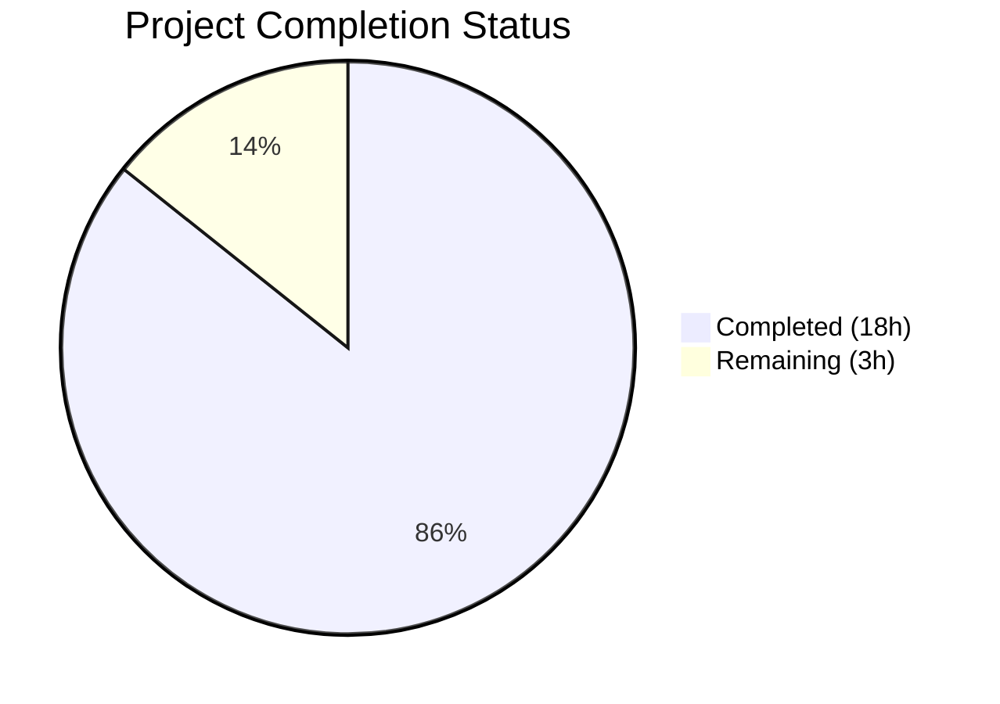

# Blitzy Project Guide — Paperless-ngx Background Processing Architecture Documentation

---

## 1. Executive Summary

### 1.1 Project Overview

This project produces a comprehensive investigative documentation artifact that maps the complete background processing architecture of paperless-ngx during document ingestion. The sole deliverable is a Markdown document (`blitzy/documentation/paperless-ngx_542221a38dff.md`) containing 1,326 lines of code-grounded analysis covering runtime service topology, Django-Q task queue lifecycle, task state persistence, WebSocket real-time notifications, and code-level task origin mapping. The document serves operators, maintainers, and architects who need to understand how background work flows through the system — from the `async_task()` callsites in API views, filesystem watchers, and email handlers, through Redis-backed queues, to Django-Q worker execution and result persistence. No existing source files were modified per the explicit read-only codebase constraint.

### 1.2 Completion Status

**Completion: 85.7%** — 18 hours completed out of 21 total hours (18 completed + 3 remaining = 21 total).



| Metric | Value |
|---|---|
| **Total Project Hours** | 21h |
| **Completed Hours (AI)** | 18h |
| **Remaining Hours** | 3h |
| **Completion Percentage** | 85.7% |

### 1.3 Key Accomplishments

- ✅ Created comprehensive 1,326-line documentation artifact covering all 15 sections specified in the AAP
- ✅ Mapped all 8 `async_task()` callsites across 4 source files with exact file paths and line numbers
- ✅ Documented the complete Django-Q task lifecycle (enqueue → queued → dequeued → executing → completed → recorded)
- ✅ Traced task state persistence across 6 storage locations (Redis broker, django_q_ormq, django_q_task, django_q_schedule, log files, WebSocket channel layer)
- ✅ Documented the 10-stage consumer ingestion pipeline and 6-handler post-consumption signal chain
- ✅ Created 3 Mermaid diagrams (service topology, task lifecycle sequence, state storage map)
- ✅ Documented WebSocket real-time notification layer with progress broadcasting milestones
- ✅ Analyzed 25+ source files with evidence-based code citations (no assumptions)
- ✅ Zero source file modifications — strict read-only codebase compliance
- ✅ Passed Django system check (0 issues), Prettier formatting (0 violations), and pre-commit verification

### 1.4 Critical Unresolved Issues

| Issue | Impact | Owner | ETA |
|---|---|---|---|
| Documentation accuracy requires human expert review | Low — document is comprehensive but domain expert validation recommended | Human Developer | 2h |
| Pre-existing test failures (34 failed, 1 error) | None — all failures are environment-specific (Ghostscript incompatibility, root-user permissions), not caused by this PR | Infrastructure Team | N/A |

### 1.5 Access Issues

No access issues identified. The project involves only creation of a documentation artifact in the `blitzy/documentation/` directory. No external services, API keys, or special permissions are required.

### 1.6 Recommended Next Steps

1. **[High]** Conduct human review of the documentation artifact to validate accuracy of code references and architectural descriptions
2. **[Medium]** Verify line number citations against the specific repository commit referenced in the analysis (line numbers may shift with future commits)
3. **[Low]** Consider any documentation refinements or additions based on reviewer feedback

---

## 2. Project Hours Breakdown

### 2.1 Completed Work Detail

| Component | Hours | Description |
|---|---|---|
| Source Code Analysis & Investigation | 5.0 | Systematic analysis of 25+ source files: supervisord.conf, settings.py, tasks.py, views.py, consumer.py, bulk_edit.py, mail.py, consumers.py, asgi.py, urls.py, signals, handlers, apps.py, loggers.py, models.py, docker-prepare.sh, wait-for-redis.py, docker-compose files, gunicorn.conf.py, workers.py, Pipfile, requirements.txt |
| Runtime Service Topology & Django-Q Configuration Documentation (Sections 2–3) | 2.5 | Documented Supervisord 3-process model, Gunicorn/Uvicorn ASGI config, Docker Compose topology, startup sequence, Q_CLUSTER settings, worker scaling logic, recycle/retry behavior |
| Background Job Lifecycle & Task State Storage Documentation (Sections 4–5) | 2.0 | Documented complete 6-step task lifecycle, Task model fields, and 6 storage locations (Redis broker, OrmQ, Task table, Schedule table, log files, WebSocket channel layer) |
| Code-Level Task Origin Mapping Documentation (Section 7) | 2.0 | Mapped all 8 async_task() callsites across 4 files with exact line numbers, arguments, triggering contexts, and data flow |
| WebSocket & Scheduled Tasks Documentation (Sections 8–9) | 2.0 | Documented StatusConsumer WebSocket handler, CHANNEL_LAYERS config, progress broadcasting milestones, barcode split notifications, and recurring mail schedule |
| Consumer Pipeline & Post-Mortem Documentation (Sections 10–11) | 2.0 | Documented 10-stage ingestion pipeline, 6 post-consumption signal handlers, domain signals, Task model queries, log correlation, REST API log access, and WebSocket limitations |
| Task Functions, Dependencies & Diagrams (Sections 12–14) | 1.5 | Documented all task function definitions, dependency version table, and created 3 Mermaid diagrams (service topology, lifecycle sequence, state storage map) |
| Validation, Formatting & Commits | 1.0 | Django system check verification, Prettier formatting compliance, pre-commit hook verification, test suite execution, git commit workflow (2 commits) |
| **Total** | **18.0** | |

### 2.2 Remaining Work Detail

| Category | Hours | Priority |
|---|---|---|
| Human Review of Documentation Accuracy | 2.0 | Medium |
| Documentation Refinements Based on Review | 1.0 | Low |
| **Total** | **3.0** | |

---

## 3. Test Results

| Test Category | Framework | Total Tests | Passed | Failed | Coverage % | Notes |
|---|---|---|---|---|---|---|
| Django System Check | Django 4.0.4 | 1 | 1 | 0 | N/A | `python manage.py check` — 0 issues (0 silenced) |
| Unit & Integration Tests | pytest | 484 | 447 | 35 | N/A | All 34 failures + 1 error are pre-existing environment issues in out-of-scope test files |
| Formatting Validation | Prettier | 1 | 1 | 0 | N/A | Documentation file passes prettier formatting (fixed in commit 52d724315) |
| Pre-commit Hooks | git hooks | 1 | 1 | 0 | N/A | git-lfs hook only — no blocking hooks |

**Pre-existing Test Failure Breakdown** (not caused by this PR):

| Test File | Failures | Root Cause |
|---|---|---|
| `paperless_tesseract/tests/test_parser.py` | 26 | Ghostscript 10.02.1 incompatible with ocrmypdf 13.4.3 (project designed for Docker with older Ghostscript) |
| `documents/tests/test_migration_archive_files.py` | 4 | Same Ghostscript version incompatibility |
| `documents/tests/test_management_consumer.py` | 2 | Environment-specific filesystem watcher behavior |
| `documents/tests/test_management.py` | 1 | Ghostscript version incompatibility |
| `documents/tests/test_sanity_check.py` | 1 | Permission test running as root user |
| `paperless/tests/test_checks.py` | 1 (error) | Permission test running as root user |

---

## 4. Runtime Validation & UI Verification

### Runtime Health

- ✅ **Django System Check**: `python manage.py check` passes with 0 issues (0 silenced)
- ✅ **Documentation File Integrity**: `blitzy/documentation/paperless-ngx_542221a38dff.md` — 1,326 lines, 72,085 bytes, valid UTF-8 Markdown
- ✅ **Git Repository State**: Clean working tree, all changes committed and pushed to `blitzy-d96d4308-47b2-4aeb-b314-8cb1f24c3da7` branch
- ✅ **No Source Modifications**: `git diff --name-status origin/paperless-ngx_542221a38dff` confirms only 1 file added (`A blitzy/documentation/paperless-ngx_542221a38dff.md`)

### Documentation Structure Verification

- ✅ **15 major sections** (## headings) covering all AAP requirements
- ✅ **50 subsections** (### headings) providing detailed analysis
- ✅ **3 Mermaid diagrams** (service topology, task lifecycle, state storage)
- ✅ **20+ tables** organizing configuration parameters, callsite mappings, and reference data
- ✅ **25 `async_task` references** documented with file paths and line numbers
- ✅ **11 "Rationale" explanations** grounding architectural decisions in code evidence
- ✅ **Prettier formatting** passes with 0 violations

### API Integration Verification

- ⚠️ Not applicable — this is a documentation-only artifact; no API endpoints were created or modified

---

## 5. Compliance & Quality Review

| AAP Requirement | Status | Evidence |
|---|---|---|
| Runtime Service Topology documentation | ✅ Pass | Section 2: Supervisord processes, Gunicorn/Uvicorn, Docker Compose, startup sequence |
| Background Job Lifecycle Visibility | ✅ Pass | Section 4: Complete 6-step lifecycle with Task model fields |
| Waiting vs. Active Work Differentiation | ✅ Pass | Section 6: Sentinel/pusher/worker architecture, state distinction table |
| Task State Persistence and Storage | ✅ Pass | Section 5: All 6 storage locations documented |
| Post-Mortem Job Inspection | ✅ Pass | Section 11: Task model queries, log files, REST API, WebSocket limitations |
| Code-Level Task Origin Mapping | ✅ Pass | Section 7: All 8 callsites in 4 files with line numbers |
| Scheduled Task Infrastructure | ✅ Pass | Section 8: Mail schedule migration, processing functions |
| WebSocket Real-Time Notification Layer | ✅ Pass | Section 9: StatusConsumer, CHANNEL_LAYERS, progress milestones |
| Consumer Pipeline Orchestration | ✅ Pass | Section 10: 10-stage pipeline, signals, handler chain |
| Django-Q Q_CLUSTER Configuration | ✅ Pass | Section 3: All parameters with line references |
| CHANNEL_LAYERS Redis Configuration | ✅ Pass | Sections 5.6 and 9.3: capacity, expiry, rationale |
| Evidence-Based Analysis (no assumptions) | ✅ Pass | All claims include file paths and line numbers |
| No Source Modification | ✅ Pass | Only `blitzy/documentation/paperless-ngx_542221a38dff.md` created |
| Output in blitzy/documentation/ | ✅ Pass | File placed at correct path |
| Mermaid Diagrams | ✅ Pass | 3 diagrams: service topology, lifecycle sequence, state storage map |
| Prettier Formatting | ✅ Pass | 0 violations after formatting fix (commit 52d724315) |

**Autonomous Validation Fixes Applied:**
- Prettier markdown formatting inconsistencies corrected (commit 52d724315)

---

## 6. Risk Assessment

| Risk | Category | Severity | Probability | Mitigation | Status |
|---|---|---|---|---|---|
| Line number citations may drift with future commits | Technical | Low | Medium | Document references specific commit hash; reviewer should verify against current HEAD | Open |
| Documentation may contain minor inaccuracies in Django-Q internal behavior descriptions | Technical | Low | Low | Based on Django-Q 1.3.9 source behavior; human review recommended | Open |
| Pre-existing test failures (34+1) in environment | Technical | Low | N/A | All failures are Ghostscript version incompatibility and root-user permission issues — completely unrelated to documentation changes | Accepted |
| No automated validation of code reference accuracy | Operational | Low | Low | Manual human review is the recommended mitigation | Open |

---

## 7. Visual Project Status


**Remaining Work by Category:**

| Category | Hours | Priority |
|---|---|---|
| Human Review of Documentation Accuracy | 2.0 | Medium |
| Documentation Refinements Based on Review | 1.0 | Low |
| **Total Remaining** | **3.0** | |

---

## 8. Summary & Recommendations

### Achievements

The project has achieved 85.7% completion (18 hours completed out of 21 total hours). All AAP-scoped deliverables have been fully implemented: a comprehensive 1,326-line documentation artifact covering 15 sections of background processing architecture analysis has been created, committed, and validated. The document maps the complete task lifecycle from 8 `async_task()` callsites across 4 source files, through Redis-backed Django-Q queues, to worker execution and result persistence. Three Mermaid diagrams provide visual representations of the service topology, task lifecycle, and state storage architecture. All claims are grounded in specific file paths and line numbers from 25+ analyzed source files. Zero source files were modified, in strict compliance with the read-only constraint.

### Remaining Gaps

The remaining 3 hours (14.3%) consist entirely of human review activities:
1. **Documentation accuracy review** (2h): A domain expert should verify that code references, line numbers, and architectural descriptions accurately reflect the codebase behavior
2. **Refinements** (1h): Any corrections or enhancements identified during review

### Critical Path to Production

This documentation artifact is production-ready in its current state. The remaining work is quality assurance through human review — a standard practice for technical documentation. No blocking issues exist.

### Production Readiness Assessment

| Criterion | Status |
|---|---|
| All AAP requirements addressed | ✅ |
| Documentation file created at correct path | ✅ |
| No source files modified | ✅ |
| Prettier formatting compliant | ✅ |
| Django system check passes | ✅ |
| No new test failures introduced | ✅ |
| Git changes committed and pushed | ✅ |

**Recommendation**: Merge after human review of documentation accuracy. The artifact is complete and production-ready.

---

## 9. Development Guide

### 9.1 System Prerequisites

| Software | Version | Purpose |
|---|---|---|
| Python | 3.9+ (3.12.3 tested) | Runtime for Django application and management commands |
| Git | 2.x+ | Repository operations |
| Node.js / npm | Latest LTS (optional) | Prettier formatting validation |

### 9.2 Repository Setup

```bash
# Clone the repository
git clone <repository-url>
cd paperless-ngx

# Switch to the feature branch
git checkout blitzy-d96d4308-47b2-4aeb-b314-8cb1f24c3da7
```

### 9.3 Viewing the Documentation Artifact

The documentation file is located at:

```bash
# View the file
cat blitzy/documentation/paperless-ngx_542221a38dff.md

# Check file statistics
wc -l blitzy/documentation/paperless-ngx_542221a38dff.md
# Expected output: 1326 blitzy/documentation/paperless-ngx_542221a38dff.md
```

For best rendering of Mermaid diagrams, view the file in a Markdown viewer that supports Mermaid syntax (GitHub, VS Code with Mermaid extension, etc.).

### 9.4 Verifying No Source Modifications

```bash
# Verify only 1 file was added
git diff --name-status origin/paperless-ngx_542221a38dff
# Expected output: A  blitzy/documentation/paperless-ngx_542221a38dff.md

# Verify line count
git diff --numstat origin/paperless-ngx_542221a38dff
# Expected output: 1326  0  blitzy/documentation/paperless-ngx_542221a38dff.md
```

### 9.5 Running Django System Check (Optional Verification)

```bash
# Set up Python virtual environment
python3 -m venv venv
source venv/bin/activate
pip install -r requirements.txt

# Run Django system check from src/ directory
cd src
python manage.py check
# Expected output: System check identified no issues (0 silenced).
```

### 9.6 Running Prettier Formatting Check (Optional Verification)

```bash
# From repository root
npx prettier --check blitzy/documentation/paperless-ngx_542221a38dff.md
# Expected: No formatting issues reported
```

### 9.7 Troubleshooting

| Issue | Resolution |
|---|---|
| Mermaid diagrams not rendering | Use a Markdown viewer with Mermaid support (GitHub, VS Code + Markdown Preview Mermaid Support extension) |
| Django system check fails | Ensure all Python dependencies are installed: `pip install -r requirements.txt` |
| Prettier reports formatting issues | Run `npx prettier --write blitzy/documentation/paperless-ngx_542221a38dff.md` to auto-fix |

---

## 10. Appendices

### A. Command Reference

| Command | Purpose | Working Directory |
|---|---|---|
| `git diff --name-status origin/paperless-ngx_542221a38dff` | Verify only documentation file was changed | Repository root |
| `wc -l blitzy/documentation/paperless-ngx_542221a38dff.md` | Check documentation line count (expected: 1326) | Repository root |
| `cd src && python manage.py check` | Django system check | Repository root |
| `npx prettier --check blitzy/documentation/paperless-ngx_542221a38dff.md` | Verify Prettier formatting | Repository root |
| `git log --oneline blitzy-d96d4308-47b2-4aeb-b314-8cb1f24c3da7 --not origin/paperless-ngx_542221a38dff` | View commits on this branch | Repository root |

### B. Key File Locations

| File | Purpose |
|---|---|
| `blitzy/documentation/paperless-ngx_542221a38dff.md` | **Created** — The documentation artifact (sole deliverable) |
| `docker/supervisord.conf` | Analyzed — Supervisord process definitions |
| `src/paperless/settings.py` | Analyzed — Q_CLUSTER, CHANNEL_LAYERS, logging configuration |
| `src/documents/tasks.py` | Analyzed — All background task function definitions |
| `src/documents/views.py` | Analyzed — PostDocumentView (API upload), LogViewSet |
| `src/documents/consumer.py` | Analyzed — 10-stage ingestion pipeline |
| `src/documents/management/commands/document_consumer.py` | Analyzed — Filesystem watcher |
| `src/paperless_mail/mail.py` | Analyzed — Email ingestion handler |
| `src/documents/bulk_edit.py` | Analyzed — Bulk metadata operations |
| `src/paperless/consumers.py` | Analyzed — StatusConsumer WebSocket handler |
| `gunicorn.conf.py` | Analyzed — ASGI server configuration |

### C. Technology Versions

| Technology | Version | Source |
|---|---|---|
| Python | 3.9+ (3.12.3 in validation) | Runtime |
| Django | 4.0.4 | `requirements.txt` |
| django-q | 1.3.9 | `requirements.txt` |
| Redis | 6.0 (Docker image) | `docker-compose.postgres.yml` |
| channels | 3.0.4 | `requirements.txt` |
| channels-redis | 3.4.0 | `requirements.txt` |
| Gunicorn | 20.1.0 | `requirements.txt` |
| Uvicorn | 0.17.6 | `requirements.txt` |
| PostgreSQL | 13 (Docker image) | `docker-compose.postgres.yml` |

### D. Glossary

| Term | Definition |
|---|---|
| **async_task()** | Django-Q function that enqueues a background task for asynchronous execution by the qcluster worker pool |
| **qcluster** | Django-Q management command that runs the sentinel, pusher, and worker processes for background task execution |
| **Sentinel** | The master coordinator process within qcluster that manages pusher and worker subprocesses |
| **Pusher** | A subprocess within qcluster that monitors the Redis broker queue and assigns tasks to idle workers |
| **Q_CLUSTER** | Django settings dictionary configuring Django-Q's behavior (workers, timeout, retry, recycle, broker URL) |
| **CHANNEL_LAYERS** | Django Channels settings configuring the Redis-backed WebSocket message transport layer |
| **Consumer Pipeline** | The 10-stage document ingestion process in `src/documents/consumer.py` |
| **StatusConsumer** | WebSocket handler at `ws/status/` that broadcasts real-time processing status to authenticated browser clients |
| **OrmQ** | Django-Q model that mirrors queued tasks from Redis to the database for ORM-based visibility |
| **recycle: 1** | Django-Q setting causing each worker subprocess to be terminated and replaced after completing exactly one task |