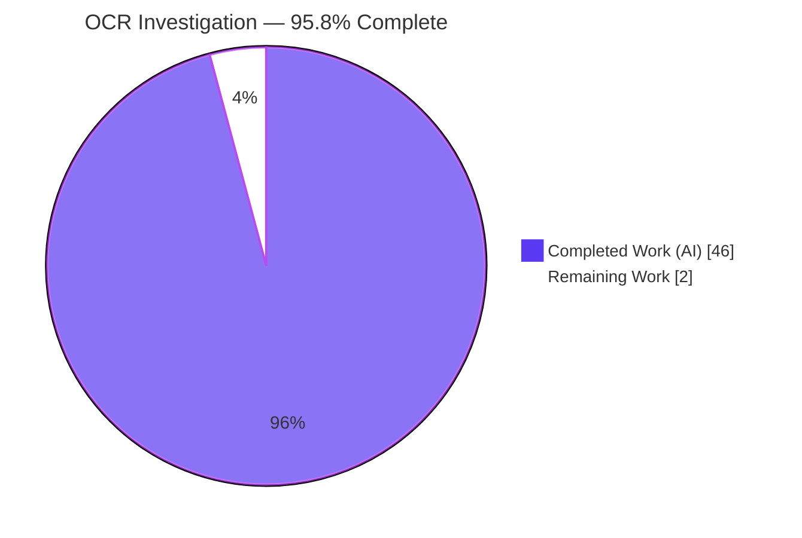
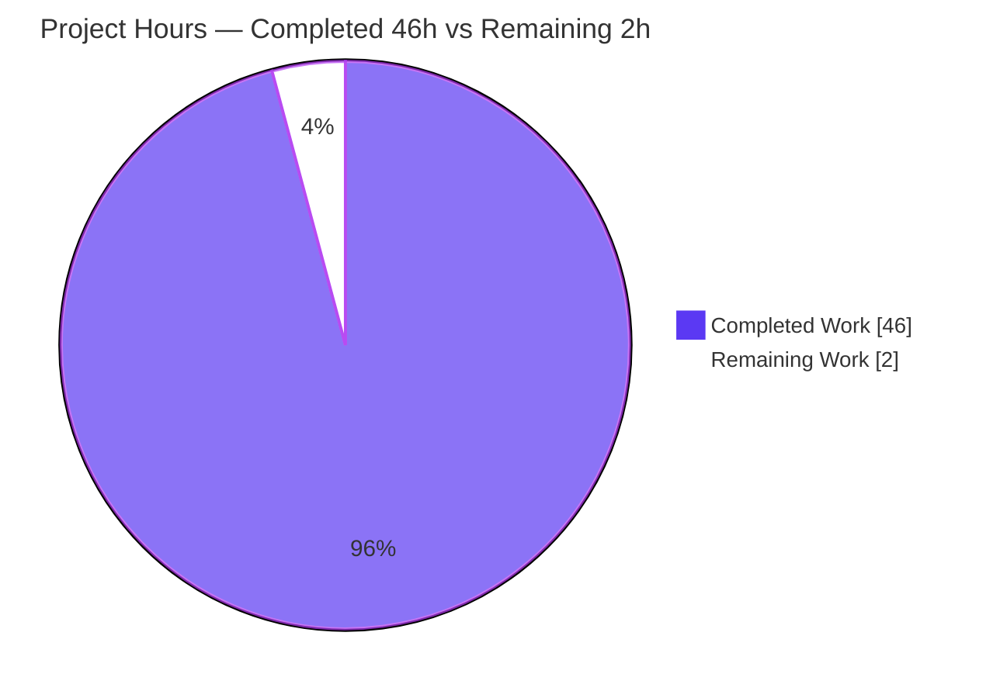
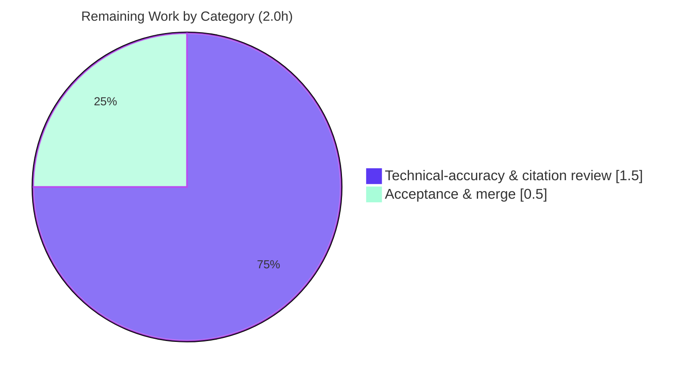

# Blitzy Project Guide — paperless-ngx OCR Runtime Investigation

## 1. Executive Summary

### 1.1 Project Overview

This project is a **read-only, run-first runtime investigation** of how Optical Character Recognition (OCR) behaves in the **paperless-ngx** document-management system (pinned at commit `542221a38dff`). The objective was to empirically answer a developer's four-part question — how to *observe* OCR starting on a text-free image, whether images that already contain visible text skip OCR, how the final REST API responses compare, and what happens when OCR yields weak/empty results — by actually building and running the asynchronous ingestion pipeline (Django + Redis + django-q worker + tesseract/ocrmypdf) and capturing real evidence. The sole deliverable is one authoritative Markdown document recording the observed findings with `file:line` citations. Target users: paperless-ngx developers and operators.

### 1.2 Completion Status

The project is **95.8% complete**. All nine AAP-scoped autonomous work items are delivered, validated, and committed; the only remaining work is human review and acceptance of the documentation deliverable.



| Metric | Value |
| --- | --- |
| **Total Hours** | 48.0 |
| **Completed Hours (AI + Manual)** | 46.0 |
| &nbsp;&nbsp;&nbsp;— AI (autonomous Blitzy agents) | 46.0 |
| &nbsp;&nbsp;&nbsp;— Manual (human) | 0.0 |
| **Remaining Hours** | 2.0 |
| **Percent Complete** | **95.8%** |

> Completion is computed per the AAP-scoped hours methodology: `46.0 / (46.0 + 2.0) × 100 = 95.8%`.

### 1.3 Key Accomplishments

- ✅ Provisioned the canonical runtime (Python 3.9.23 + tesseract 4.1.1 + ocrmypdf 13.4.3 + Ghostscript 9.53.3) and brought up the full asynchronous stack (Django 4.0.4 + Redis + django-q worker), with all pinned dependencies matching `requirements.txt` exactly.
- ✅ Answered **P1** (OCR start & processing state) from real evidence: captured the complete WebSocket `status_updates` progress stream (`STARTING/new_file@0%` → `WORKING/parsing_document@20%` → `generating_thumbnail@70%` → `parse_date@90%` → `save_document@95%` → `SUCCESS/finished@100%`) and the definitive `Calling OCRmyPDF with args:` worker log.
- ✅ Answered **P2** (image with visible text): demonstrated by observation that images **always** traverse the OCR pipeline (no skip) and that the only distinguishing artifact is the ocrmypdf sidecar marker `[OCR skipped on page(s) …]`.
- ✅ Answered **P3** (API comparison): programmatic field-by-field diff of `GET /api/documents/{id}/` showing both cases funnel recognized text into the single `content` field with no provenance field.
- ✅ Answered **P4** (weak/incomplete OCR): observed empty `content` on a fully-consumed `SUCCESS@100%` document with no status column, contrasted against a hard `ParseError`/`FAILED@100%`/no-row failure.
- ✅ Exercised supporting edge cases (digital-PDF `skip`/`skip_noarchive` contrast; concurrent-duplicate, corrupt-PDF, temp-file, and django-q logging behaviors) and corroborated the mechanism with commit-pinned web research.
- ✅ Delivered the sole artifact — `blitzy/documentation/paperless-ngx_542221a38dff.md` (1,615 lines, 97 `file:line` citations) — with strict observed-vs-inferred discipline and an exhaustive coverage checklist.
- ✅ Upheld the **read-only mandate**: exactly one added file, **zero** source/test/config/dependency changes; sample fixtures byte-identical to the git blobs; working tree clean.
- ✅ Passed all Blitzy autonomous validation gates: **444 tests passed, 2 skipped, 0 failed**; static check clean; runtime re-validation of all four sub-questions matched the documented findings.

### 1.4 Critical Unresolved Issues

There are **no critical unresolved issues** that block release of this documentation deliverable. All AAP-scoped work is complete, validated, and committed.

| Issue | Impact | Owner | ETA |
| --- | --- | --- | --- |
| _None_ — the deliverable is complete, validated (5/5 gates), and committed; the working tree is pristine. | None | — | — |

> Note: The deliverable's §12 documents four **pre-existing** source-repository observations (see Section 6). These are **not** defects introduced by this work and are correctly left **unremediated** per the read-only mandate; they are therefore not release-blocking for this documentation task.

### 1.5 Access Issues

**No access issues identified.** The investigation ran entirely within the provided canonical Docker image with local Redis and django-q; no external repository permissions, service credentials, or third-party API access were required or blocked.

| System/Resource | Type of Access | Issue Description | Resolution Status | Owner |
| --- | --- | --- | --- | --- |
| _None_ | — | No access issues encountered during autonomous provisioning, execution, or validation. | N/A | — |

### 1.6 Recommended Next Steps

1. **[Medium]** Perform a technical-accuracy and citation review of `blitzy/documentation/paperless-ngx_542221a38dff.md` — verify the observed P1–P4 claims and spot-check a sample of the 97 `file:line` citations against commit `542221a38`. *(≈1.5h)*
2. **[Medium]** Accept the deliverable and merge the documentation PR to the target branch (working tree is already clean; single added file). *(≈0.5h)*
3. **[Low]** *(Optional, out-of-scope for this read-only task)* Triage the four pre-existing source observations documented in §12 (concurrent-duplicate `UNIQUE` leak, temp-file leak, django-q log `TypeError`, dependency advisories) for a **separate, non-read-only** remediation project.

---

## 2. Project Hours Breakdown

### 2.1 Completed Work Detail

| Component | Hours | Description |
| --- | --- | --- |
| Runtime environment provisioning & async stack bring-up | 6.0 | Provisioned Python 3.9 + tesseract-ocr + pinned ocrmypdf stack; brought up Docker network + Redis + Django app + django-q `qcluster` + `runserver`; verified toolchain and dependency pins against `requirements.txt`. |
| P1 — OCR-start & processing-state investigation | 6.0 | Drove the canonical async upload path for `no-text-alpha.png`; built a Channels-layer subscriber to capture the full `status_updates` stream; captured worker logs and before/during/after DB polls; confirmed stability across two runs. |
| P2 — image-with-text skip-vs-run investigation | 3.0 | Consumed `simple.png`; observed the identical OCR pipeline (no skip); established the ocrmypdf sidecar marker as the only post-hoc distinguishing artifact. |
| P3 — API-response comparison investigation | 2.5 | Called `GET /api/documents/{id}/` for both documents; produced a programmatic field-by-field diff; confirmed single `content` field and no provenance/OCR-status field. |
| P4 — weak/incomplete-OCR final-state investigation | 4.0 | Observed empty-`content` `SUCCESS@100%` consume; model introspection confirming no status column; failure contrast (corrupt PDF → `ParseError`/`FAILED`/no row; duplicate → `FAILED`). |
| Supporting edge cases & digital-PDF skip contrast | 6.0 | Exercised §8 digital-PDF `skip`/`skip_noarchive` contrast and root-caused the four §12 edge cases (concurrent-duplicate `UNIQUE` leak, temp-file leak, django-q log `TypeError`, dependency advisories). |
| External web-search corroboration | 2.0 | Corroborated ocrmypdf sidecar semantics, paperless OCR-mode semantics, and the OCR-start log signal; pinned links to the exact commit/version. |
| Answer-document authoring | 9.0 | Authored the 1,615-line deliverable with 97 `file:line` citations, strict observed-vs-inferred labeling, full unedited captured output, and an exhaustive coverage checklist. |
| Repository integrity & temp-artifact cleanup | 2.5 | Enforced the read-only mandate; produced the integrity proof (§11); performed non-destructive Docker teardown; published observation scripts (§13) with secure temp handling. |
| Revision cycles | 5.0 | Three commits: initial draft, then addressing 13 code-review findings, then addressing QA acceptance findings. |
| **Total** | **46.0** | |

### 2.2 Remaining Work Detail

| Category | Hours | Priority |
| --- | --- | --- |
| Technical-accuracy & citation review of the deliverable | 1.5 | Medium |
| Final acceptance & merge of the documentation PR | 0.5 | Medium |
| **Total** | **2.0** | |

> **Out-of-scope follow-ups (0.0h in this project):** Remediation of the four pre-existing source observations in §12 is explicitly excluded by the read-only AAP and would constitute a separate, non-read-only project. These items carry **no hours** in this project's totals and are listed only for awareness in Section 6.

### 2.3 Basis of Estimate

Hours reflect the actual autonomous effort for a run-first documentation investigation: infrastructure provisioning, live pipeline observation with evidence capture, edge-case root-causing, technical writing, and multi-round revision. Confidence is **High** for all line items — the scope is bounded and explicitly enumerated by the AAP, and every completed item is backed by independently verified evidence. The 2.0h remaining is standard documentation review/acceptance and cannot be automated.

---

## 3. Test Results

All tests below originate from **Blitzy's autonomous validation logs** (Final Validator, Gate 3). The suites were executed to confirm that the source behavior the deliverable documents matches reality and that the read-only investigation left the repository behaving identically. The task itself is read-only documentation, so **no new tests were authored**; these are the project's existing suites for the components under study.

| Test Category | Framework | Total Tests | Passed | Failed | Coverage % | Notes |
| --- | --- | --- | --- | --- | --- | --- |
| OCR parser (unit + integration) — `paperless_tesseract` | pytest + Django `TestCase` | 38 | 38 | 0 | Not measured¹ | Validates the `RasterisedDocumentParser` behavior the deliverable cites (skip-vs-run, sidecar reading, empty-text handling). |
| Documents app (unit + integration) — `documents` | pytest + Django `TestCase` | 408 | 406 | 0 | Not measured¹ | 2 skipped (environment-conditional). Covers the consumer, API serializer, and model behavior underpinning P1–P4. |
| **Combined** | pytest + Django `TestCase` | **446** | **444** | **0** | Not measured¹ | **2 skipped, 0 failed.** Executed as `testuser` with writable scratch dirs, `-o addopts="" -p no:cacheprovider`. |

¹ Coverage percentage was not measured during autonomous validation — this is a read-only documentation task, not a code-authoring task, so line-coverage of source under test was not a deliverable. The suites were run to a **100% pass rate** (excluding 2 environment-conditional skips) to confirm documented behavior.

**Runtime re-validation (Gate 4):** Beyond the unit/integration suites, the Final Validator independently re-drove the real `POST /api/documents/post_document/` → django-q worker → `Consumer` path for all four sub-questions and confirmed an exact match to the documented progress sequences, log lines, API responses, and persisted metadata, with stable ordering across two runs. See Section 4.

---

## 4. Runtime Validation & UI Verification

**UI verification: Not applicable.** This is a backend/documentation investigation; the AAP explicitly excludes any front-end work. No UI was created or changed. The "runtime validation" below concerns the asynchronous OCR ingestion pipeline that the deliverable documents.

**Environment & services health:**
- ✅ **Operational** — Web server: Django 4.0.4, "System check identified no issues (0 silenced)".
- ✅ **Operational** — django-q worker: "Q Cluster … running" (12 processes).
- ✅ **Operational** — API reachability: `POST /api/token/` → 40-char token; `GET /api/` → HTTP 200.
- ✅ **Operational** — Toolchain: tesseract 4.1.1, ocrmypdf 13.4.3, Ghostscript 9.53.3, Python 3.9.23.

**Four sub-questions — runtime outcomes (all independently re-validated):**
- ✅ **Operational — P1 (text-free image `no-text-alpha.png`):** async `OK` in ~0.025s; full progress stream `STARTING/new_file@0` → `WORKING/parsing_document@20` (OCR start) → `generating_thumbnail@70` → `parse_date@90` → `save_document@95` → `SUCCESS/finished@100`; worker log `Calling OCRmyPDF with args:{…'skip_text':True…}`; `document_id` null until terminal; before = 0 rows / after = row with `content=''`. Exact match to deliverable §4.
- ✅ **Operational — P2 (`simple.png`):** identical pipeline entered (no skip); same 7-event signature; `Calling OCRmyPDF` fires; `content='This is a test document.'`; `has_archive_version=True`. Matches §5.
- ✅ **Operational — P3 (API comparison):** both documents share the single `content` field ( `''` vs `'This is a test document.'` ); both `archived_file_name` populated; 12 identical keys; zero provenance/OCR-status fields. Matches §6.
- ✅ **Operational — P4 (weak/empty OCR):** `content=''` yet document fully consumed (`SUCCESS@100`, "consumption finished"); `has_archive_version=True`; model introspection shows no status/processed column. Contrast confirmed: corrupt PDF → `ParseError` → `FAILED@100%`/no row; sequential duplicate → `FAILED`/`document_already_exists@100`. Matches §7.
- ✅ **Operational — §8 skip contrast:** `simple-digital.pdf`/`skip` → sidecar `[OCR skipped on page(s) 1]`; `multi-page-digital.pdf`/`skip_noarchive` → no archive; `simple.png`/`skip_noarchive` → archive + no marker. Matches §8.
- ✅ **Operational — Stability:** Run B progress ordering identical to Run A.

---

## 5. Compliance & Quality Review

The AAP defined a **Main Rule** (deliverable + read-only scope) and four sub-rules (run-first; exhaustive evidence coverage; observed-output discipline; complete/precise/grounded answering). The matrix below cross-maps each AAP deliverable/rule to its validation status.

| AAP Deliverable / Rule | Requirement | Status | Progress | Evidence |
| --- | --- | --- | --- | --- |
| Main Rule — Deliverable path | Single new Markdown at `blitzy/documentation/paperless-ngx_542221a38dff.md` | ✅ Pass | 100% | File present, 1,615 lines, committed (HEAD `44e03419c`). |
| Main Rule — Read-only source | No existing file modified/created/deleted (except deliverable) | ✅ Pass | 100% | `git diff 542221a38 HEAD` = 1 added file, +1615/-0; `git status` clean; fixtures byte-identical to git blobs. |
| Main Rule — Cleanup | Temporary observation scripts removed; tree pristine | ✅ Pass | 100% | Non-destructive Docker teardown; scripts published in §13; working tree clean. |
| Rule 1 — Run-first, canonical entry point | Build & run the real async path; ≥2-run stability | ✅ Pass | 100% | Real `POST … post_document/` → django-q → `Consumer` driven; 2-run stability confirmed (§4.7). |
| Rule 2 — Exhaustive condition/evidence coverage | All conditions + edge paths; before/during/after; complete unedited output | ✅ Pass | 100% | P1–P4 + §8 skip contrast + §12 edge cases; full unedited payloads/logs/JSON captured. |
| Rule 3 — Observed-output discipline | Observed vs inferred clearly labeled; output beside each claim | ✅ Pass | 100% | Consistent `_observed_` / `_inferred from code_` labeling throughout (§9 discipline note). |
| Rule 4 — Complete, precise, grounded | Every sub-part & named item answered with exact values + `file:line` | ✅ Pass | 100% | Exhaustive §9 coverage checklist maps each named item to an evidence anchor + `file:line` (97 citations). |
| Web-search corroboration (§0.2.2) | External confirmation of OCR mechanism | ✅ Pass | 100% | §10 corroboration with commit/version-pinned sources. |
| Environment provisioning (§0.4.3) | Python 3.9 + tesseract + pinned ocrmypdf stack | ✅ Pass | 100% | Toolchain and pins verified live (§2.2–§2.3); Gate 1 pass. |

**Fixes applied during autonomous validation:** None to the deliverable itself — the Final Validator reported it was already correct and required no edits. Two transient test-run failures were diagnosed as purely **environmental** (a tracked fixture rewritten in place by the parser when fed directly; and permission tests failing only when run as root) and were resolved via **test-invocation conditions only** (writable throwaway samples dir + running as `testuser`) — **no source was modified**.

**Outstanding compliance items:** None. The read-only mandate is fully upheld and every AAP rule passes.

---

## 6. Risk Assessment

Overall risk posture is **Low**. Because this is a read-only documentation task with **zero source changes**, no technical, security, operational, or integration risk was introduced into the product. Residual in-scope risks are minor and mitigated by the deliverable's own design. Items marked *(pre-existing, out-of-scope)* are source-repository observations the deliverable correctly **documents rather than fixes** per the read-only mandate.

| Risk | Category | Severity | Probability | Mitigation | Status |
| --- | --- | --- | --- | --- | --- |
| `file:line` citations could drift if source evolves past commit `542221a38` | Technical | Low | Low | Citations are explicitly commit-pinned; the document states the pin. | ✅ Mitigated |
| Runtime observations (doc IDs, timestamps, scratch-dir names) vary run-to-run | Technical | Low | Low | §4.7 explicitly labels stable-vs-variable values; only environmental deltas differ. | ✅ Mitigated |
| No new attack surface (no source changed); observation scripts use secure temp handling | Security | Informational | N/A | `tempfile.mkdtemp`, argument arrays, mode-0600 credential files (§13). | ✅ N/A (nothing introduced) |
| Runtime reproduction requires the canonical image (Py3.9 + tesseract + pinned stack) | Operational | Low | Medium | §2 documents exact image digests, versions, and setup commands. | ✅ Mitigated |
| Async observation depends on Redis + django-q + Channels wiring | Integration | Low | Low | §2.5 health checks confirm qcluster + web + API before observation. | ✅ Mitigated |
| §12.1 Concurrent-duplicate raw SQLite `UNIQUE constraint` string leaked over WebSocket | Integration | Major *(pre-existing, out-of-scope)* | Low | Documented with reproduction & severity; remediation excluded by read-only mandate. | 📄 Documented (out-of-scope) |
| §12.2 Failed consumes leave the upload temp file in `SCRATCH_DIR` | Operational | Minor *(pre-existing, out-of-scope)* | Medium | Documented; remediation excluded by read-only mandate. | 📄 Documented (out-of-scope) |
| §12.3 django-q 1.3.9 broken error-log call (`TypeError`) on Redis outage, then self-recovers | Operational | Minor *(pre-existing, out-of-scope)* | Low | Documented with root cause; worker not crashed; remediation out-of-scope. | 📄 Documented (out-of-scope) |
| §12.4 Pre-existing dependency advisories in the pinned stack | Security | Informational *(pre-existing, out-of-scope)* | N/A | Neither introduced nor remediated by this work; documented for awareness. | 📄 Documented (out-of-scope) |

---

## 7. Visual Project Status

**Project hours breakdown** (Completed = Dark Blue `#5B39F3`, Remaining = White `#FFFFFF`):



**Remaining work by category** (hours, from Section 2.2 — totals 2.0h):



> **Integrity check:** "Remaining Work" = **2.0h**, identical to the Section 1.2 metrics table and the Section 2.2 total. "Completed Work" = **46.0h**, identical to Section 2.1. Total = **48.0h**.

---

## 8. Summary & Recommendations

**Achievements.** The project is **95.8% complete** (`46.0 / 48.0` AAP-scoped hours). Every one of the nine AAP-scoped autonomous work items is delivered and validated: the canonical runtime and full async stack were provisioned; all four sub-questions (P1–P4) were answered from real, captured runtime evidence through the canonical entry point; supporting edge cases and the digital-PDF skip contrast were exercised; the mechanism was corroborated with commit-pinned web research; and the single 1,615-line deliverable was authored with 97 `file:line` citations and strict observed-vs-inferred discipline. Blitzy's autonomous validation passed all gates — **444 tests passed, 2 skipped, 0 failed**, a clean static check, and an exact runtime re-match of all four sub-questions.

**Remaining gaps.** The only remaining work is **2.0h of human review** — a technical-accuracy/citation review (1.5h) and final acceptance & merge (0.5h). There is no remaining engineering work within the AAP scope. This residual exists because documentation acceptance is inherently a human sign-off step; per Blitzy methodology, autonomous completion is capped below 100% pending that review.

**Critical path to production.** Review the deliverable → accept → merge. That is the entire path; there is no build, deploy, integration, or configuration work, because the deliverable is a self-contained Markdown document and the source tree is unchanged.

**Production-readiness assessment.** **Ready for review.** The read-only mandate is fully upheld (independently verified: one added file, zero source changes, byte-identical fixtures, clean working tree). The deliverable comprehensively and accurately answers all four sub-questions with reproducible evidence.

**Success metrics.**

| Metric | Target | Actual | Status |
| --- | --- | --- | --- |
| Sub-questions answered from runtime evidence | 4 / 4 | 4 / 4 | ✅ |
| Read-only mandate (source files changed) | 0 | 0 | ✅ |
| Autonomous validation gates passed | 5 / 5 | 5 / 5 | ✅ |
| Tests failed | 0 | 0 | ✅ |
| Deliverable at exact required path | Yes | Yes | ✅ |

**Recommendation.** Proceed with the 2.0h human review and merge. Separately, consider scheduling a **non-read-only** follow-up project to triage the four pre-existing source observations catalogued in §12 (they are out of scope here by design).

---

## 9. Development Guide

This deliverable is a Markdown document, so the guide has two parts: **(A)** viewing and verifying the delivered artifact (runnable on any host with git), and **(B)** reproducing the runtime investigation (requires the canonical OCR toolchain, which is **not** present on a plain host — it lives in the canonical Docker image / a Python 3.9 environment).

### 9.1 System Prerequisites

- **Part A (view/verify):** `git` ≥ 2.x. (Verified here: git 2.51.0.) No other tooling required.
- **Part B (reproduce):** Docker 28.x **or** a Python **3.9** environment; the system `tesseract-ocr` binary (with `eng` language data); Redis; and the exact pinned Python dependencies from `requirements.txt`. A plain host will **not** have `tesseract`/`ocrmypdf` — use the canonical image or a dedicated Python 3.9 venv.

### 9.2 Part A — View & Verify the Deliverable (host-runnable; tested)

```bash
# From the repository root:
# 1) Confirm the deliverable exists and its size
test -f blitzy/documentation/paperless-ngx_542221a38dff.md \
  && wc -l blitzy/documentation/paperless-ngx_542221a38dff.md
# expected: 1615 blitzy/documentation/paperless-ngx_542221a38dff.md

# 2) See the document's section map
grep -nE '^## [0-9]' blitzy/documentation/paperless-ngx_542221a38dff.md
# expected: 13 top-level sections (Answer Summary … Appendix)

# 3) Read-only integrity proof (this is the constraint that matters)
git diff --name-status 542221a38dff06361e07976452f9aea24d210542 HEAD -- .
# expected: A  blitzy/documentation/paperless-ngx_542221a38dff.md
git status --porcelain
# expected: (empty output = working tree clean)

# 4) Confirm no source/test/config file changed
git diff --name-only 542221a38dff06361e07976452f9aea24d210542 HEAD -- src/ | wc -l
# expected: 0
```

### 9.3 Part B — Reproduce the Runtime Investigation (container / Python 3.9)

```bash
# 1) Verify the toolchain BEFORE observing (inside the canonical image)
python3 --version                                    # expected: Python 3.9.23
tesseract --version | head -1                        # expected: tesseract 4.1.1
python3 -c "import ocrmypdf; print(ocrmypdf.__version__)"   # expected: 13.4.3
gs --version                                         # expected: 9.53.3

# 2) Confirm pinned dependencies match requirements.txt
python3 - <<'PY'
import importlib.metadata as m
for p in ["django","djangorestframework","django-q","channels","channels-redis",
          "redis","pdfminer.six","pikepdf","pillow","img2pdf","ocrmypdf"]:
    print(f"{p:22s} {m.version(p)}")
PY

# 3) Bring up the async stack (run from /app to keep the host repo pristine)
docker network create paperless-net
# start redis (redis:7-alpine) and the app container attached to paperless-net,
# with PAPERLESS_REDIS set and writable /tmp/pl/{media,consume,data,scratch,log} dirs
docker exec paperless-app bash -lc 'cd /app/src && python3 manage.py migrate'
docker exec paperless-app bash -lc 'cd /app/src && python3 manage.py createsuperuser --noinput || true'
docker exec -d paperless-app bash -lc 'cd /app/src && python3 manage.py runserver 0.0.0.0:8000 --noreload'
docker exec -d paperless-app bash -lc 'cd /app/src && python3 manage.py qcluster'

# 4) Health checks
docker exec paperless-app bash -lc 'curl -s -o /dev/null -w "%{http_code}\n" http://localhost:8000/api/'   # expected: 200
tail -1 /tmp/rt_qcluster.log    # expected: "Q Cluster ... running"
```

### 9.4 Verification & Example Usage (exercise P1–P4)

```bash
# Mint a token (credentials via a mode-0600 curl config file, never in argv)
curl -s -X POST http://localhost:8000/api/token/ -K /path/to/creds.cfg   # -> 40-char token

# Upload a text-free image (P1) — endpoint returns "OK" immediately (async)
curl -s -H "Authorization: Token <TOKEN>" \
  -F document=@src/paperless_tesseract/tests/samples/no-text-alpha.png \
  http://localhost:8000/api/documents/post_document/

# Watch the two real OCR signals while the worker runs:
#   (a) the WebSocket progress stream on the Channels group "status_updates"
#   (b) the worker log line, from logger paperless.parsing.tesseract
grep -F 'Calling OCRmyPDF with args:' /tmp/pl/log/paperless.log

# After processing, compare final API responses (P3)
curl -s -H "Authorization: Token <TOKEN>" http://localhost:8000/api/documents/2/ | python3 -m json.tool
curl -s -H "Authorization: Token <TOKEN>" http://localhost:8000/api/documents/3/ | python3 -m json.tool
```

```bash
# Run the OCR-relevant test suites (as testuser, writable scratch dirs)
cd /app/src && python3 -m pytest paperless_tesseract documents \
  -o addopts="" -p no:cacheprovider -q
# expected: 444 passed, 2 skipped
```

### 9.5 Troubleshooting

- **`tesseract: command not found` / `import ocrmypdf` fails** — you are on a plain host, not the canonical runtime. Use the provided Docker image or a Python 3.9 venv with `tesseract-ocr` installed.
- **`*_no_access` permission tests fail** — you are running as `root`. Run the suite as a non-root user (`testuser`).
- **`test_image_simple_alpha` raises `PermissionError`** — the parser rewrites the fed sample in place; point the test at a **writable throwaway copy** of the samples dir, never the tracked fixture.
- **Empty progress stream / no `status_updates` events** — verify Redis is up and the `qcluster` worker is healthy; the HTTP upload returns before OCR, so all signals come from the worker.
- **Worker never logs `Calling OCRmyPDF with args:`** — confirm `qcluster` is running and DEBUG logging is enabled for logger `paperless.parsing.tesseract`.

---

## 10. Appendices

### Appendix A — Command Reference

| Purpose | Command |
| --- | --- |
| Verify deliverable presence & size | `wc -l blitzy/documentation/paperless-ngx_542221a38dff.md` |
| Read-only integrity proof | `git diff --name-status 542221a38dff06361e07976452f9aea24d210542 HEAD -- .` |
| Working-tree cleanliness | `git status --porcelain` |
| Toolchain check | `tesseract --version` · `python3 -c "import ocrmypdf; print(ocrmypdf.__version__)"` |
| Bring up worker | `python3 manage.py qcluster` |
| Bring up web server | `python3 manage.py runserver 0.0.0.0:8000 --noreload` |
| Upload a document (async) | `curl -F document=@<file> .../api/documents/post_document/` |
| Fetch a document | `curl .../api/documents/{id}/` |
| Run OCR test suites | `python3 -m pytest paperless_tesseract documents -o addopts="" -p no:cacheprovider -q` |
| Watch OCR-start log | `grep -F 'Calling OCRmyPDF with args:' /tmp/pl/log/paperless.log` |

### Appendix B — Port Reference

| Service | Port | Notes |
| --- | --- | --- |
| Django web / REST API | 8000 | `runserver 0.0.0.0:8000`; `GET /api/` → 200 |
| Redis (broker + channel layer) | 6379 | Backs django-q and the Channels `status_updates` group |
| WebSocket status stream | 8000 | `ws/status/` (auth-gated `StatusConsumer`) |

### Appendix C — Key File Locations

| Path | Role |
| --- | --- |
| `blitzy/documentation/paperless-ngx_542221a38dff.md` | **The sole deliverable** (1,615 lines) |
| `src/documents/views.py` | Upload API `POST /api/documents/post_document/` (async dispatch) |
| `src/documents/tasks.py` | django-q task entry point `consume_file` |
| `src/documents/consumer.py` | Consumer: progress events (`status_updates`), persistence |
| `src/paperless_tesseract/parsers.py` | OCR parser: skip-vs-run, ocrmypdf call, sidecar/empty-text handling |
| `src/documents/models.py` | `Document` model (persisted metadata; no OCR-status column) |
| `src/documents/serialisers.py` | `DocumentSerializer` (`content`, `archived_file_name`) |
| `src/paperless/settings.py` | OCR defaults + django-q cluster config |
| `src/paperless_tesseract/tests/samples/` | Canonical fixtures (`no-text-alpha.png`, `simple.png`, digital/mixed PDFs) |

### Appendix D — Technology Versions

| Component | Version |
| --- | --- |
| Python | 3.9.23 |
| tesseract-ocr | 4.1.1 |
| ocrmypdf | 13.4.3 |
| Ghostscript | 9.53.3 |
| Django | 4.0.4 |
| djangorestframework | 3.13.1 |
| django-q | 1.3.9 |
| channels / channels-redis | 3.0.4 / 3.4.0 |
| redis (py) | 3.5.3 |
| pdfminer.six | 20220319 |
| pikepdf | 5.1.1 |
| pillow | 9.1.0 |
| img2pdf | 0.4.4 |

### Appendix E — Environment Variable Reference

| Variable | Purpose |
| --- | --- |
| `PAPERLESS_REDIS` | Redis URL for the django-q broker and the Channels layer |
| `PAPERLESS_OCR_MODE` | OCR mode (default `skip`); `skip_noarchive` can early-exit for text-layer PDFs (never for images) |
| `PAPERLESS_OCR_LANGUAGE` | OCR language data (default `eng`) |
| `DJANGO_SETTINGS_MODULE` | `paperless.settings` (used by the observation subscriber and management commands) |

### Appendix F — Developer Tools Guide

| Tool | Use in this project |
| --- | --- |
| `git` | Prove read-only integrity (`diff --name-status`, `status --porcelain`) |
| Channels layer subscriber (`sub.py`, §13) | Capture the live `status_updates` progress stream (privileged internal probe) |
| `curl` | Drive the async upload endpoint and fetch final API responses |
| `pytest` | Execute the OCR parser and documents test suites |
| Django ORM shell | Before/during/after `Document.objects.count()` polls and field introspection |

### Appendix G — Glossary

| Term | Meaning |
| --- | --- |
| **AAP** | Agent Action Plan — the primary directive defining scope and rules |
| **OCR** | Optical Character Recognition — extracting text from raster images |
| **Sidecar marker** | ocrmypdf's `[OCR skipped on page(s) …]` string; the only artifact distinguishing OCR-produced text from a pre-existing text layer |
| **`status_updates`** | Django Channels group carrying WebSocket progress events (`STARTING`→`WORKING`→`SUCCESS`/`FAILED`) |
| **django-q / qcluster** | Background task cluster that executes `consume_file` in a worker |
| **`skip` / `skip_noarchive`** | OCR modes; `skip` always creates an archive, `skip_noarchive` can avoid it for text-layer PDFs (never images) |
| **Read-only mandate** | The hard constraint that no source file may change; only the deliverable is written |

---

*Generated by the Blitzy autonomous assessment agent. Completion: 95.8% (46.0 of 48.0 AAP-scoped hours). Remaining: 2.0h of human review & acceptance.*