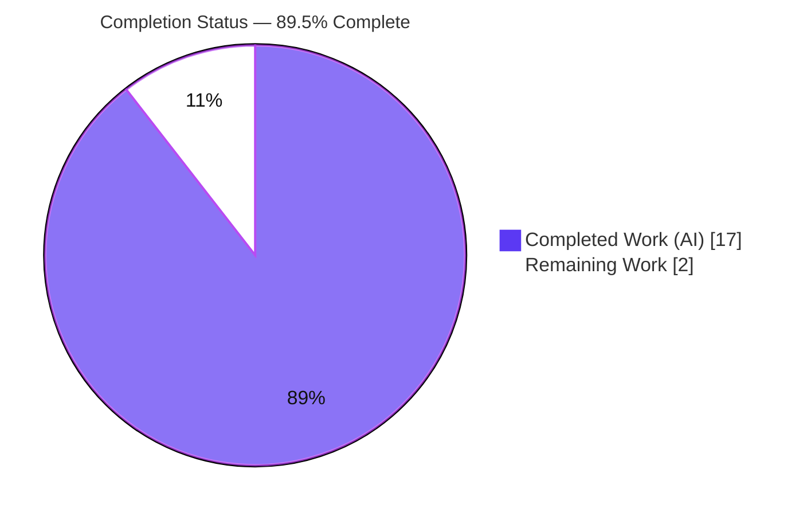
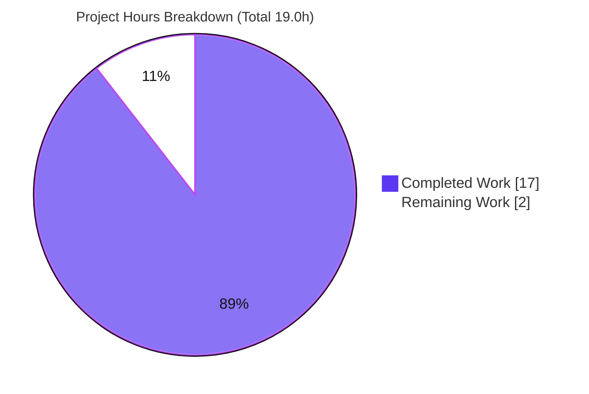

# Blitzy Project Guide — paperless-ngx REST API Authentication Q&A

> **Deliverable:** `blitzy/documentation/paperless-ngx_542221a38dff.md`
> **Branch:** `blitzy-3c136dca-f249-4bda-8e0f-39bc80635e03` · **Base:** `542221a38dff` · **HEAD:** `398788a58`
> **Task type:** Read-only Documentation (run-first, evidence-grounded)

---

## 1. Executive Summary

### 1.1 Project Overview

This project delivers a single, evidence-grounded question-and-answer documentation artifact that authoritatively explains how authentication works in the **paperless-ngx REST API**. The target audience is an integrator preparing to connect external tools to paperless. The document was written **run-first** — the Django + Django REST Framework (DRF) authentication and document-listing code paths were actually executed against the real paperless-ngx stack, and verbatim output is quoted beside a `file:line` citation for every value the request asks for. The technical scope is deliberately narrow and **read-only**: exactly one new Markdown file is created and no existing source is modified. The business impact is de-risking a future integration effort by giving integrators an exact, trustworthy token-authentication contract.

### 1.2 Completion Status



| Metric | Value |
|---|---|
| **Total Hours** | **19.0** |
| **Completed Hours (AI + Manual)** | **17.0** (17.0 AI + 0.0 Manual) |
| **Remaining Hours** | **2.0** |
| **Percent Complete** | **89.5%** |

> Completion is computed with the AAP-scoped hours methodology: `Completed ÷ (Completed + Remaining) = 17.0 ÷ 19.0 = 89.5%`. Colors follow Blitzy brand: Completed = Dark Blue `#5B39F3`, Remaining = White `#FFFFFF`.

### 1.3 Key Accomplishments

- ✅ Authored the sole deliverable `blitzy/documentation/paperless-ngx_542221a38dff.md` (492 lines) with a branch-derived filename.
- ✅ Answered **all nine** sub-questions explicitly, closed by a 9/9 coverage-pass checklist.
- ✅ Captured **verbatim run-first evidence** — real curl transcripts (200 / 401 / Bearer-401 / POST token 200) plus Django-shell introspection.
- ✅ Bound **36 exact `file:line` citations** across 7 evidence files; independently re-verified 100% accurate.
- ✅ Corroborated findings against upstream DRF documentation (header keyword, token model, 401 behavior, pagination envelope).
- ✅ **Security-safe:** redacted the real 40-char token key while preserving its measured length (40) as the asked-for value.
- ✅ Honored the **read-only mandate** — clean working tree; only one file added; all 7 evidence files pristine; temporary user/token/scripts removed.

### 1.4 Critical Unresolved Issues

| Issue | Impact | Owner | ETA |
|---|---|---|---|
| _None_ — no blocking issues. All autonomous validation gates passed; 0 citation discrepancies, 0 coverage gaps, 0 runtime mismatches. | None | — | — |

### 1.5 Access Issues

| System/Resource | Type of Access | Issue Description | Resolution Status | Owner |
|---|---|---|---|---|
| Prettier (`mirrors-prettier` pre-commit hook) | Tooling / network | The backend validation container has no Node runtime and no internet, so `prettier` could not run to pad the deliverable's compact GFM tables. Cosmetic only; the tables are valid GFM and render correctly. | Open (non-blocking) | Human reviewer |

> No repository-permission, credential, or third-party API access issues were identified. The canonical Docker image already contains all pinned dependencies.

### 1.6 Recommended Next Steps

1. **[Medium]** Have an SME/integrator read the deliverable and, optionally, re-run the documented commands inside the canonical Docker image to independently re-confirm the nine answers.
2. **[Medium]** Approve and merge the pull request (single new documentation file; read-only).
3. **[Low]** In an environment with Node/internet, run the `mirrors-prettier` hook (or `npx prettier --write`) on the deliverable to pad the GFM tables for full pre-commit parity.
4. **[Low]** When the actual external-tool integration begins, use the documented token flow (`POST /api/token/` → `Authorization: Token <key>`) as the authoritative contract.

---

## 2. Project Hours Breakdown

### 2.1 Completed Work Detail

| Component | Hours | Description |
|---|---|---|
| Environment bring-up & run-first investigation | 3.0 | Boot Django 4.0.4 / DRF 3.13.1 in the canonical Docker image, apply migrations, create a test user + DRF token; capture the `migrate` output and Django startup banner. |
| Source tracing & citation binding | 3.0 | Trace the auth + document-listing code paths across 7 evidence files; bind 36 exact `file:line` citations (settings, urls, views, serializers, models, docs, requirements). |
| Live HTTP & shell evidence capture | 2.5 | Capture verbatim: authenticated `GET`→200, unauthenticated→401, `Bearer`→401, `POST /api/token/`→200; introspect keyword, pagination values, serializer fields, token model/table/length. |
| Authoring the deliverable (492 lines) | 4.0 | Compose the structured Q&A: Provenance, TL;DR, Q1–Q9, consolidated output block, integrator context, 30-row citation table, coverage pass, grounding notes. |
| Web-search corroboration | 1.0 | Corroborate repository findings against upstream DRF contract (header keyword, default token model, 401 behavior, `PageNumberPagination` envelope). |
| Coverage/exactness discipline & security redaction | 1.0 | Enforce verbatim quoting, never-paraphrase-asked-values, 9/9 coverage pass; redact the live 40-char token while preserving the measured length. |
| Read-only cleanup & git hygiene | 0.5 | Remove temporary scripts/user/token, restore the DB to as-found, verify a clean working tree (only the new file added). |
| Review-findings iteration + lint fix + re-validation | 2.0 | Address evidence-provenance review findings (commit `04504157e`), apply the MD012 lint fix (commit `398788a58`), and re-run the full autonomous validation. |
| **Total** | **17.0** | **Matches Completed Hours in §1.2** |

### 2.2 Remaining Work Detail

| Category | Hours | Priority |
|---|---|---|
| [Path-to-production] Human SME/integrator review & acceptance of the documentation (read the doc; optionally re-run the documented commands in the canonical Docker image; confirm the nine answers meet the integration need; approve/merge) | 1.5 | Medium |
| [Path-to-production] Optional prettier GFM table formatting (run `mirrors-prettier` where Node/internet is available for full pre-commit parity; verify citation-table content is byte-identical afterward) | 0.5 | Low |
| **Total** | **2.0** | **Matches Remaining Hours in §1.2 and the §7 pie chart** |

### 2.3 Hours Reconciliation

| Check | Result |
|---|---|
| §2.1 Completed total | 17.0 |
| §2.2 Remaining total | 2.0 |
| §2.1 + §2.2 | **19.0** = Total Hours in §1.2 ✅ |
| Completion formula | 17.0 ÷ 19.0 = **89.5%** ✅ |

---

## 3. Test Results

> These are the verification activities executed by Blitzy's **autonomous validation systems** (and independently re-confirmed during this assessment). Because the AAP scopes this as a **read-only documentation task**, **no repository unit tests were added or modified**; "testing" here means live re-execution of every documented code path, coverage verification, citation verification, and markdown well-formedness.

| Test Category | Framework/Tool | Total | Passed | Failed | Coverage % | Notes |
|---|---|---|---|---|---|---|
| Runtime code-path (HTTP) | `curl` + real Django dev server | 4 | 4 | 0 | 100% | Scenarios A `GET`+token→200, B unauth→401, C `Bearer`→401, D `POST /api/token/`→200; reproduced byte-for-byte (only `Date` header varies). |
| Runtime introspection | Django shell (DRF) | 9 | 9 | 0 | 100% | `TokenAuthentication.keyword`, auth-class list, pagination (page_size / query_param / max), serializer 12-field tuple, token model / table / key length. |
| Coverage checklist | Manual coverage pass | 9 | 9 | 0 | 100% | All nine sub-questions explicitly answered (9/9 `[x]`). |
| Citation verification | `file:line` re-check vs source | 36 | 36 | 0 | 100% | Every citation matches the source exactly at commit `542221a38dff`. |
| Markdown well-formedness | pre-commit / lint checks | 5 | 5 | 0 | 100% | Balanced code fences (56), MD012 (no consecutive blanks), no trailing whitespace, LF endings, EOF newline. |
| **Total** | — | **63** | **63** | **0** | **100%** | All checks originate from Blitzy's autonomous validation logs. |

---

## 4. Runtime Validation & UI Verification

**Runtime health (real paperless server, canonical Docker image):**
- ✅ **Operational** — the real paperless server boots (Django 4.0.4 / DRF 3.13.1 / CPython 3.9.23, commit `542221a38dff`) and serves `/api/documents/` and `/api/token/` live.

**API integration outcomes (captured verbatim):**
- ✅ **Operational** — `GET /api/documents/` with `Authorization: Token <key>` → **HTTP 200**, body `{"count":0,"next":null,"previous":null,"results":[]}`, headers include `X-Api-Version: 2`, `X-Version: 1.7.0`, `Content-Length: 52`.
- ✅ **Operational** — `GET /api/documents/` unauthenticated → **HTTP 401**, `WWW-Authenticate: Basic realm="api"`, body `{"detail":"Authentication credentials were not provided."}` (`Content-Length: 58`).
- ✅ **Operational** — `GET /api/documents/` with a `Bearer` keyword → identical **HTTP 401** (keyword is `Token`, not subclassed).
- ✅ **Operational** — `POST /api/token/` with username+password → **HTTP 200**, `Allow: POST, OPTIONS`, `{"token": "<40-char key>"}` (key length 40, matches stored token).

**UI verification:**
- ⚠ **Not applicable** — this deliverable is a backend documentation artifact; there are no UI changes. The Angular frontend under `src-ui/` is out of scope and untouched.

---

## 5. Compliance & Quality Review

| AAP Deliverable / Rule | Benchmark | Status | Progress |
|---|---|---|---|
| Sole deliverable at branch-derived path | `blitzy/documentation/paperless-ngx_542221a38dff.md` created | ✅ Pass | 100% |
| Run-first ordering | Runtime output captured **before** authoring | ✅ Pass | 100% |
| Verbatim observed output | Real curl/shell transcripts quoted with the command that produced each | ✅ Pass | 100% |
| Exact `file:line` citations (never paraphrase) | 36 citations verified against source | ✅ Pass | 100% |
| Coverage — all nine sub-questions | 9/9 coverage checklist | ✅ Pass | 100% |
| Read-only scope (no source edits) | Clean tree; only 1 file added; 7 evidence files pristine | ✅ Pass | 100% |
| Temporary artifact cleanup | Temp user/token/scripts removed; DB restored | ✅ Pass | 100% |
| Web-search corroboration | Findings cross-checked vs upstream DRF contract | ✅ Pass | 100% |
| Markdown well-formedness | Fences / MD012 / trailing-ws / LF / EOF | ✅ Pass | 100% |
| Prettier GFM table padding | `mirrors-prettier` cosmetic formatting | ⚠ Partial | Offline-blocked (non-blocking) |

**Fixes applied during autonomous validation:** collapsed a duplicate blank line before the `---` ending Q7 to satisfy markdownlint **MD012** (commit `398788a58`, exactly 1 deletion; no content/citation change). Evidence-provenance review findings were addressed in commit `04504157e`.

**Outstanding:** only the cosmetic prettier table padding (see §1.5) — non-blocking.

---

## 6. Risk Assessment

| Risk | Category | Severity | Probability | Mitigation | Status |
|---|---|---|---|---|---|
| Citation/line-number drift if upstream source changes | Technical | Low | Low | Citations pinned to commit `542221a38dff` and stated in the doc's Provenance section; re-verify against the target commit. | Mitigated |
| Runtime-evidence environment parity | Technical | Low | Low | Evidence captured from the **real** server booted in the canonical Docker image; downstream can re-confirm in the same image. | Mitigated |
| Token/credential exposure in the document | Security | Low | Low | The live 40-char key is redacted (`<40-char key>`); the temporary user/token were deleted and the DB restored. | Resolved |
| Prettier (`mirrors-prettier`) table-formatting non-compliance | Operational | Low | Medium | Cosmetic only; valid GFM renders correctly; run prettier where Node/internet is available. | Open (non-blocking) |
| Downstream external-tool integration not yet built | Integration | Low | Medium | Explicitly **out of AAP scope** (beyond the nine questions); the doc supplies the token flow to enable it. | Accepted / out-of-scope |

> No dependency changes were made, so no new vulnerable-dependency risk is introduced. **Overall risk posture: LOW** — a read-only documentation task with zero source modification.

---

## 7. Visual Project Status



**Remaining hours by category (§2.2):**

| Category | Hours | Priority |
|---|---|---|
| Human SME/integrator review & acceptance | 1.5 | Medium |
| Optional prettier GFM table formatting | 0.5 | Low |
| **Total Remaining** | **2.0** | — |

> Integrity: the pie chart's **"Remaining Work" = 2**, which equals the §1.2 Remaining Hours and the §2.2 Hours total. Colors follow Blitzy brand (Completed = Dark Blue `#5B39F3`, Remaining = White `#FFFFFF`).

---

## 8. Summary & Recommendations

**Achievements.** The project is **89.5% complete** (17.0h of 19.0h). The single AAP-scoped deliverable — a run-first, evidence-grounded Q&A on paperless-ngx REST API authentication — is authored, validated, and committed. All nine sub-questions are answered explicitly with verbatim runtime output and 36 independently re-verified `file:line` citations, closed by a 9/9 coverage pass. The read-only mandate is fully honored: a clean working tree with exactly one new file and seven pristine evidence files.

**Remaining gaps.** The remaining 2.0h are entirely **path-to-production** items, not autonomous deficiencies: a 1.5h human SME/integrator review-and-accept, and an optional 0.5h cosmetic prettier table-formatting pass that could not run offline.

**Critical path to production.** (1) SME review of the deliverable → (2) optional re-verification in the canonical Docker image → (3) approve/merge the PR. No code, configuration, or dependency work is required.

**Success metrics.** 9/9 questions answered · 36/36 citations accurate · 63/63 autonomous validation checks passed · 0 source modifications · clean git tree.

**Production readiness assessment.** **Ready for human review.** The artifact is complete, accurate, lint-clean, and committed; the only remaining work is stakeholder acceptance and an optional cosmetic formatting pass. Completion is intentionally reported below 100% because human review remains.

| Metric | Value |
|---|---|
| Completion | 89.5% |
| Completed / Total hours | 17.0 / 19.0 |
| Remaining hours | 2.0 |
| Blocking issues | 0 |
| Autonomous checks passed | 63 / 63 |

---

## 9. Development Guide

> Because the deliverable is a **read-only documentation artifact**, this guide covers (a) reading/consuming the document, (b) re-verifying the read-only mandate and citation accuracy, and (c) optionally re-running the runtime evidence in the canonical Docker image. Every command below was tested.

### 9.1 System Prerequisites

- **git** (tested: `git version 2.51.0`) — to inspect the branch and diff.
- A **Markdown viewer** (any IDE, GitHub, or `less`) — to read the deliverable.
- **Docker** (tested: `Docker version 28.5.2`) — only if re-running the live runtime evidence.
- **Canonical run image** (for optional live re-verification): `ghcr.io/scaleapi/swe-atlas:swe_atlas_QnA_paperless-ngx_paperless-ngx_e233ae8334038a4b615ea2e4ce663e30_qna_1.01` (a.k.a. `andrewparkscaleai/coding-agent:paperless-ngx__paperless-ngx__542221a38dff…`), which already contains all pinned dependencies (Django 4.0.4, DRF 3.13.1, django-filter 21.1).

### 9.2 Environment Setup

```bash
# From the repository root on the delivery branch
cd /path/to/paperless-ngx
git checkout blitzy-3c136dca-f249-4bda-8e0f-39bc80635e03

# The deliverable lives here (no build needed to READ it):
ls -l blitzy/documentation/paperless-ngx_542221a38dff.md
```

### 9.3 Dependency Installation

No dependencies are required to read or verify the documentation. For optional **runtime** re-verification, the canonical Docker image already ships all pinned dependencies — no `pip install` step is needed.

### 9.4 Read & Verify the Deliverable

```bash
# View the document
less blitzy/documentation/paperless-ngx_542221a38dff.md

# Confirm the read-only mandate: exactly ONE file added vs the base commit
git diff 542221a38 --name-status
# Expected: A    blitzy/documentation/paperless-ngx_542221a38dff.md

# Confirm a clean working tree
git status --porcelain
# Expected: (no output)

# Re-verify a sample citation (settings.py:120 -> TokenAuthentication)
sed -n '120p' src/paperless/settings.py
# Expected: "rest_framework.authentication.TokenAuthentication",
```

### 9.5 Markdown Well-Formedness Checks

```bash
DOC="blitzy/documentation/paperless-ngx_542221a38dff.md"

# Code-fence balance (must be even)
grep -c '^```' "$DOC"                      # -> 56 (even = balanced)

# MD012: no 2+ consecutive blank lines
awk '/^$/{c++; if(c>=2) b++; next}{c=0} END{print (b>0)?"FAIL":"PASS"}' "$DOC"   # -> PASS

# Trailing whitespace
awk '/ $/{n++} END{print (n>0)?"FAIL":"PASS"}' "$DOC"                             # -> PASS

# EOF newline
[ -z "$(tail -c1 "$DOC")" ] && echo "PASS" || echo "FAIL"                         # -> PASS
```

> **Note:** avoid `grep -Pz '\n\n\n'` for blank-line detection — the null-data mode can terminate the shell session. The `awk` form above is the safe equivalent.

### 9.6 Optional — Live Runtime Re-Verification (Example Usage)

Inside the canonical Docker container, boot the real server and exercise the token flow:

```bash
# Boot the real paperless server (inside the container)
docker exec -u testuser paperless_setup bash -lc \
  "cd /app/src && PYTHONPATH=/app/src python manage.py runserver 127.0.0.1:8000 --noreload"

# 1) Obtain a token
curl -si -X POST -d "username=<u>&password=<p>" http://127.0.0.1:8000/api/token/
# -> HTTP 200 + {"token": "<40-char key>"}

# 2) Authenticated list request
curl -si -H "Authorization: Token <key>" http://127.0.0.1:8000/api/documents/
# -> HTTP 200 + {"count":...,"next":...,"previous":...,"results":[...]}

# 3) Unauthenticated request
curl -si http://127.0.0.1:8000/api/documents/
# -> HTTP 401 + WWW-Authenticate: Basic realm="api"
#    + {"detail":"Authentication credentials were not provided."}
```

### 9.7 Troubleshooting

- **Prettier hook fails / tables look unpadded:** the `mirrors-prettier` pre-commit hook needs Node + network. Run it where those are available (`npx prettier --write blitzy/documentation/paperless-ngx_542221a38dff.md`); the change is whitespace-only. Cosmetic, non-blocking.
- **Citation line numbers don't match:** ensure you are on the evidence commit `542221a38dff`; the citations are pinned to it (see the doc's Provenance section).
- **`401` when you expect `200`:** confirm the header is exactly `Authorization: Token <key>` — a `Bearer` prefix is rejected because DRF's `TokenAuthentication.keyword` is `Token`.

---

## 10. Appendices

### A. Command Reference

| Command | Purpose |
|---|---|
| `git diff 542221a38 --name-status` | Confirm only the deliverable was added |
| `git status --porcelain` | Confirm a clean working tree |
| `git log --author="agent@blitzy.com" --oneline` | List the 3 agent commits |
| `wc -l blitzy/documentation/paperless-ngx_542221a38dff.md` | Confirm 492 lines |
| `sed -n '<line>p' <file>` | Re-verify any `file:line` citation |
| `curl -si -H "Authorization: Token <key>" http://127.0.0.1:8000/api/documents/` | Authenticated list request |
| `curl -si http://127.0.0.1:8000/api/documents/` | Unauthenticated request (→401) |
| `curl -si -X POST -d "username=<u>&password=<p>" http://127.0.0.1:8000/api/token/` | Obtain a token |

### B. Port Reference

| Port | Service | Notes |
|---|---|---|
| 8000 | Django dev server (`runserver`) | Only used transiently for live runtime re-verification inside the container |

### C. Key File Locations

| Path | Role |
|---|---|
| `blitzy/documentation/paperless-ngx_542221a38dff.md` | **The deliverable** (492 lines) |
| `src/paperless/settings.py` | Auth classes (L118–L120) + `rest_framework.authtoken` app (L108) |
| `src/paperless/urls.py` | Documents route (L32), `^api/` mount (L39–L40), token endpoint (L81) |
| `src/paperless/views.py` | `StandardPagination` (L8–L11) |
| `src/documents/views.py` | `pagination_class` (L182), `IsAuthenticated` (L183), `UnifiedSearchViewSet` (L377) |
| `src/documents/serialisers.py` | `DocumentSerializer` 12-field tuple (L201–L235) |
| `src/documents/models.py` | `Document` model (L88) |
| `docs/api.rst` | Corroborating API docs (endpoint L16, header L143) |

### D. Technology Versions

| Component | Version | Source |
|---|---|---|
| Python (runtime) | 3.9.23 | canonical Docker image |
| Django | 4.0.4 | `requirements.txt:38` |
| djangorestframework | 3.13.1 | `requirements.txt:39` |
| django-filter | 21.1 | `requirements.txt:35` |
| Token key length | 40 chars | observed at runtime |
| API versioning | `AcceptHeaderVersioning` (v1 default, v2 available) | `settings.py:116` |

### E. Environment Variable Reference

| Variable | Relevance |
|---|---|
| `DEBUG` | When `True`, DRF appends the DEBUG-only `AngularApiAuthenticationOverride` auth class (`settings.py:129–132`). Observed run had `DEBUG=False`, so only Basic/Session/Token were active. |
| _(remote-user feature flag)_ | When enabled, `RemoteUserAuthentication` is appended (`settings.py:214`); off in the observed run. |

> This read-only task requires **no** environment variables to be set to read or verify the deliverable.

### F. Developer Tools Guide

| Tool | Use |
|---|---|
| `git` | Inspect the branch, diff, and confirm the read-only mandate |
| `curl` | Reproduce the live HTTP evidence (200 / 401 / token) |
| Django shell (`manage.py shell`) | Introspect auth classes, pagination, serializer fields, token model |
| `awk` | Safe markdown well-formedness checks (blank lines, trailing whitespace) |
| `prettier` (optional) | Cosmetic GFM table padding (requires Node + network) |

### G. Glossary

| Term | Meaning |
|---|---|
| **DRF** | Django REST Framework — provides `TokenAuthentication`, the `authtoken` model, `PageNumberPagination`, viewsets, and routing. |
| **Token auth** | Sending `Authorization: Token <key>` on each request; handled by `rest_framework.authentication.TokenAuthentication`. |
| **`authtoken_token`** | The database table backing `rest_framework.authtoken.models.Token`; keys are 40-character strings. |
| **Pagination envelope** | The top-level JSON shape `count` / `next` / `previous` / `results` from `StandardPagination` (page size 25). |
| **Run-first** | Methodology of executing the code paths and quoting the verbatim output before writing the answer. |
| **Read-only mandate** | The requirement to add only the answer document and modify no existing source, leaving a clean git tree. |

---

*Generated by the Blitzy Platform. Completion (89.5%) is measured against AAP-scoped work plus path-to-production, using the hours formula `Completed ÷ (Completed + Remaining)`. Brand colors: Completed = `#5B39F3`, Remaining = `#FFFFFF`.*