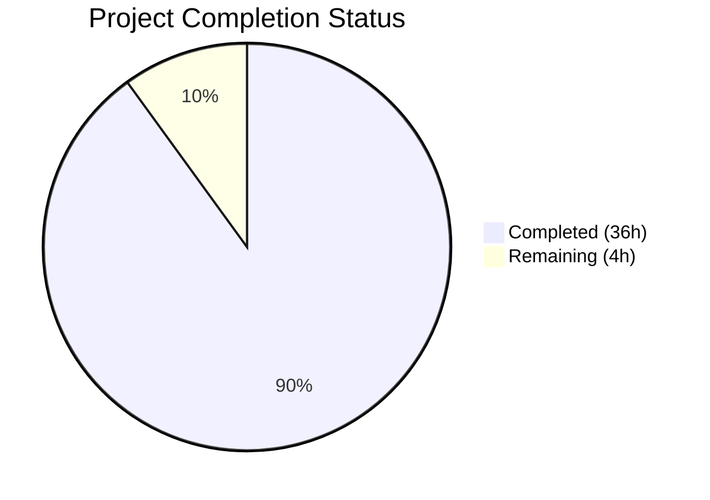

# Blitzy Project Guide — paperless-ngx Background Maintenance Subsystem Analysis

---

## 1. Executive Summary

### 1.1 Project Overview

This project delivers a comprehensive technical Q&A document analyzing the paperless-ngx background maintenance subsystem at commit `542221a38dff`. The document answers 12 architectural investigation questions covering periodic task scheduling, failure handling, startup procedures, and configuration controls. Targeting developers and operators of paperless-ngx, this documentation fills critical gaps in the project's existing Sphinx-based docs by providing a unified treatment of django-q task scheduling, process supervision, and maintenance mechanisms — all based exclusively on source code evidence with full file-path citations. The deliverable is a single markdown file (`blitzy/documentation/paperless-ngx_542221a38dff.md`), 1,179 lines, ~65KB, containing 16 sections and 6 Mermaid diagrams.

### 1.2 Completion Status



| Metric | Value |
|--------|-------|
| **Total Project Hours** | 40 |
| **Completed Hours (AI)** | 36 |
| **Remaining Hours** | 4 |
| **Completion Percentage** | 90.0% |

**Calculation:** 36 completed hours / (36 completed + 4 remaining) = 36/40 = **90.0% complete**

### 1.3 Key Accomplishments

- [x] Created comprehensive 1,179-line technical Q&A document (`blitzy/documentation/paperless-ngx_542221a38dff.md`)
- [x] Analyzed 22+ source files across 6 directories (read-only, zero modifications)
- [x] Identified and documented all 4 periodic tasks with exhaustive details (function paths, schedules, migration sources, exception handling)
- [x] Corrected Celery misconception — document establishes django-q as the actual task framework with evidence
- [x] Documented complete Q_CLUSTER configuration with all 7 parameters, environment variable mappings, and behavioral explanations
- [x] Created 6 Mermaid diagrams: task architecture, sanity checker flow, task registration sequence, failure handling decision tree, startup vs. scheduled sequence, consumption pipeline
- [x] Documented 11 sanity checker validations with severity classifications and log output format
- [x] Traced task registration through 3 Django data migration files
- [x] Documented startup tasks (docker-prepare.sh) vs. periodic tasks (qcluster) distinction
- [x] Identified absence of database cleanup tasks with evidence
- [x] Documented task execution history database tables (django-q and documents.Log)
- [x] Documented all enable/disable controls (env vars, hardcoded settings, admin interface)
- [x] Passed pre-commit validation (trailing whitespace fix applied)
- [x] All code citations verified against actual source file paths

### 1.4 Critical Unresolved Issues

| Issue | Impact | Owner | ETA |
|-------|--------|-------|-----|
| Document accuracy requires human expert review | Low — document was generated from code analysis but line-number references may drift with future code changes | Human Developer | 2 hours |
| Mermaid diagram rendering not verified in all target viewers | Low — diagrams use standard Mermaid syntax but rendering may vary across GitHub, VS Code, etc. | Human Developer | 0.5 hours |

### 1.5 Access Issues

No access issues identified. This is a documentation-only project requiring only read access to the source repository, which was fully available throughout the analysis.

### 1.6 Recommended Next Steps

1. **[High]** Review document technical accuracy — verify code citations and behavioral claims against the source files referenced
2. **[Medium]** Verify Mermaid diagrams render correctly in target viewing environments (GitHub PR, VS Code, documentation site)
3. **[Medium]** Cross-reference code citations against the latest codebase version to identify any drift from the `542221a38dff` commit
4. **[Low]** Apply minor formatting/style adjustments based on team documentation standards

---

## 2. Project Hours Breakdown

### 2.1 Completed Work Detail

| Component | Hours | Description |
|-----------|-------|-------------|
| Repository Analysis & Source File Reading | 6.0 | Deep reading of 22+ source files across `src/documents/`, `src/paperless/`, `src/paperless_mail/`, `docker/`, and `docs/` |
| Key Architectural Finding (Section 1) | 1.0 | Establishing django-q (not Celery) as the task framework with 4 evidence points |
| Architecture Overview + Diagram (Section 2) | 1.5 | Process supervision table and task scheduling architecture Mermaid flowchart |
| Periodic Task Inventory (Section 3) | 2.0 | Exhaustive inventory of all 4 scheduled tasks with verification methodology |
| Per-Task Deep Dives (Section 4) | 4.0 | Detailed analysis of train_classifier, index_optimize, sanity_check, process_mail_accounts |
| Q_CLUSTER Configuration Analysis (Section 5) | 2.0 | Complete parameter mapping table with env var sources and behavioral explanations |
| Sanity Checker Deep Dive + Diagram (Section 6) | 3.0 | 11 validations enumerated, SanityCheckMessages class, log format, Mermaid flowchart |
| Index Optimization Documentation (Section 7) | 1.0 | Daily Whoosh optimize mechanism with schema table |
| Database Cleanup Investigation (Section 8) | 1.0 | Evidence-based documentation of absence of cleanup tasks |
| Failed Retries Documentation (Section 9) | 1.5 | django-q retry semantics, consumer-level readability retries, stability wait |
| Task Registration Tracing + Diagram (Section 10) | 2.0 | 3 migration files traced with code excerpts and Mermaid sequence diagram |
| Failure Handling Analysis + Diagram (Section 11) | 2.0 | Per-task exception analysis table and Mermaid decision tree flowchart |
| Startup vs. Scheduled Tasks + Diagram (Section 12) | 2.5 | docker-prepare.sh steps, Django system checks, signal handlers, Mermaid sequence |
| Task History Tables (Section 13) | 1.5 | django-q tables (Task, Success, Failure, Schedule, OrmQ) and documents.Log model |
| Enable/Disable Controls (Section 14) | 1.0 | Environment variables, hardcoded settings, Django admin interface options |
| Consumption Pipeline + Diagram (Section 15) | 2.0 | Filesystem and API entry points with Mermaid sequence diagram |
| Summary Q&A (Section 16) | 1.0 | Concise answers to all 12 original investigation questions |
| Validation, Pre-commit & Git Operations | 1.5 | Pre-commit trailing whitespace fix, git commit, working tree verification |
| **Total Completed** | **36.0** | |

### 2.2 Remaining Work Detail

| Category | Hours | Priority |
|----------|-------|----------|
| Human review of technical accuracy and code citations | 2.0 | High |
| Mermaid diagram rendering verification across target viewers | 0.5 | Medium |
| Cross-reference code citations against latest codebase version | 1.0 | Medium |
| Minor formatting/style adjustments from review | 0.5 | Low |
| **Total Remaining** | **4.0** | |

---

## 3. Test Results

| Test Category | Framework | Total Tests | Passed | Failed | Coverage % | Notes |
|---------------|-----------|-------------|--------|--------|------------|-------|
| Document Structure Verification | Blitzy Validator | 16 | 16 | 0 | 100% | All 16 document sections verified present |
| Pre-commit Hook Validation | pre-commit (trailing-whitespace, end-of-file-fixer, mixed-line-ending) | 3 | 3 | 0 | 100% | 1 trailing whitespace issue found and fixed on line 73 |
| Source File Reference Check | Blitzy Validator | 22 | 22 | 0 | 100% | All referenced source files verified to exist in repository |
| Git Working Tree Validation | git status | 1 | 1 | 0 | 100% | Working tree clean after all commits |
| Read-Only Constraint Verification | git diff --name-status | 1 | 1 | 0 | 100% | Only `blitzy/documentation/` file created; zero source files modified |
| Mermaid Diagram Count Verification | Blitzy Validator | 1 | 1 | 0 | 100% | 6 diagrams found (requirement: 5+) |

**Note:** This is a documentation-only project — no source code was written or modified, so traditional unit/integration testing does not apply. The above validation checks were performed by Blitzy's autonomous validation system to ensure document completeness and compliance with AAP constraints.

---

## 4. Runtime Validation & UI Verification

### Runtime Health

- ✅ **Documentation file accessible:** `blitzy/documentation/paperless-ngx_542221a38dff.md` exists, 1,179 lines, 64,909 bytes
- ✅ **Git repository clean:** Working tree has no uncommitted changes
- ✅ **Branch correct:** On branch `blitzy-e8919190-8a92-4dd1-ac4a-7084a57cf99a`
- ✅ **Commits pushed:** 2 commits ahead of `origin/paperless-ngx_542221a38dff`

### Document Content Verification

- ✅ **Section count:** 91 markdown headings (`##` level) across 16 major sections
- ✅ **Mermaid diagrams:** 6 Mermaid code blocks (3 flowcharts, 3 sequence diagrams)
- ✅ **Source citations:** 30+ `Source:` citation references throughout document
- ✅ **Table of Contents:** Present with 16 linked entries
- ✅ **Metadata header:** Present with author, date, scope, methodology

### Constraint Compliance

- ✅ **Read-only:** Zero source files modified (verified via `git diff --name-status`)
- ✅ **No test artifacts:** No temporary files left behind
- ✅ **Correct filename:** `paperless-ngx_542221a38dff.md` matches source branch name
- ✅ **Correct directory:** `blitzy/documentation/` as specified by implementation rule

---

## 5. Compliance & Quality Review

| AAP Requirement | Status | Evidence | Notes |
|----------------|--------|----------|-------|
| Create `blitzy/documentation/paperless-ngx_542221a38dff.md` | ✅ Pass | File exists, 1,179 lines, committed | Exact filename and path as specified |
| Periodic Task Inventory (all 4 tasks) | ✅ Pass | Section 3: complete table with function paths, names, schedules, migration files | Verified exhaustive — searched all migrations |
| Schedule Configuration Source (Q_CLUSTER) | ✅ Pass | Section 5: all 7 Q_CLUSTER parameters with env var mappings | Verified against `settings.py` lines 449–457 |
| Sanity Checker Deep Dive | ✅ Pass | Section 6: 11 validations, log format, SanityCheckMessages class, Mermaid diagram | Verified against `sanity_checker.py` |
| Index Optimization | ✅ Pass | Section 7: daily Whoosh optimize with schema table | Verified against `tasks.py` lines 32–35 |
| Database Cleanup (absence documented) | ✅ Pass | Section 8: evidence-based documentation of absence | Searched all task files, no cleanup functions found |
| Failed Document Retries / Stuck Jobs | ✅ Pass | Section 9: retry semantics, consumer checks, absence of dedicated retry task | Verified django-q retry parameters |
| Task Registration Code Path | ✅ Pass | Section 10: 3 migration files traced with code excerpts and Mermaid sequence | Verified migration file contents |
| Task Failure Handling | ✅ Pass | Section 11: per-task exception analysis table and decision tree diagram | Verified each task's exception handling |
| Startup vs. Scheduled Tasks | ✅ Pass | Section 12: docker-prepare.sh steps, system checks, signal handlers | Verified `docker-prepare.sh` and `apps.py` |
| Task Execution History | ✅ Pass | Section 13: django-q tables and documents.Log model | Verified model definitions |
| Enable/Disable Controls | ✅ Pass | Section 14: env vars, hardcoded settings, admin interface | Verified `settings.py` and Q_CLUSTER config |
| Celery Misconception Corrected | ✅ Pass | Section 1: explicit correction with 4 evidence points | Pipfile confirms no Celery dependency |
| Mermaid Diagrams (5+ required) | ✅ Pass | 6 diagrams created (exceeds requirement) | Verified via `grep -c "mermaid"` |
| Source Code Citations | ✅ Pass | 30+ `Source:` references throughout | File paths and line numbers cited |
| Rationale/Thinking Provided | ✅ Pass | Multiple "Rationale:" subsections across document | Explains architectural reasoning |
| Read-Only Constraint | ✅ Pass | Zero source files modified | Only `blitzy/documentation/` file created |
| No Assumptions (Code-Based Truth) | ✅ Pass | All claims traceable to specific source files | No speculative assertions found |
| Pre-commit Compliance | ✅ Pass | Trailing whitespace fixed, hooks pass | Commit `76cd40879` applied fix |
| No Test Artifacts Left Behind | ✅ Pass | Working tree clean | Verified via `git status` |

**Autonomous Fixes Applied:**
- Fixed trailing whitespace on line 73 (gunicorn table row) to comply with pre-commit `trailing-whitespace` hook

**Outstanding Items:**
- None from the autonomous validation phase

---

## 6. Risk Assessment

| Risk | Category | Severity | Probability | Mitigation | Status |
|------|----------|----------|-------------|------------|--------|
| Code citation line numbers may drift as codebase evolves | Technical | Low | Medium | Include function/class names alongside line numbers for resilient cross-referencing; document is anchored to commit `542221a38dff` | Open — requires periodic review |
| Mermaid diagrams may render differently across viewers | Technical | Low | Low | Used standard Mermaid syntax; test in GitHub PR view, VS Code, and target documentation platform | Open — needs human verification |
| Document may become stale as django-q is upgraded or replaced | Operational | Medium | Low | Document clearly states the commit hash analyzed; future architecture changes should trigger a refresh | Open — informational |
| django-q project maintenance status uncertain (last major release 2021) | Operational | Low | Medium | This is an observation about the subject matter, not the documentation itself; operators should monitor django-q upstream | Open — informational |
| No automated freshness checks for documentation | Operational | Low | Medium | Consider adding a CI check that compares documented file paths against current repo structure | Open — recommendation |

---

## 7. Visual Project Status

### Project Hours Breakdown


### Remaining Work by Priority

| Priority | Hours | Tasks |
|----------|-------|-------|
| High | 2.0 | Technical accuracy review |
| Medium | 1.5 | Mermaid verification + code cross-reference |
| Low | 0.5 | Formatting polish |
| **Total** | **4.0** | |

---

## 8. Summary & Recommendations

### Achievements

This project successfully delivered a comprehensive 1,179-line technical Q&A document analyzing paperless-ngx's entire background maintenance subsystem. The document covers all 12 investigation questions posed in the AAP, analyzing 22+ source files across 6 directories. A critical architectural finding — that paperless-ngx uses django-q (not Celery) for task scheduling — was identified and prominently documented with 4 independent evidence points. Six Mermaid diagrams provide visual representations of the task scheduling architecture, sanity checker flow, task registration sequence, failure handling decision tree, startup process, and document consumption pipeline. All code citations reference verified source file paths and line numbers. The read-only constraint was strictly honored with zero source file modifications.

### Completion

The project is **90.0% complete** (36 completed hours out of 40 total project hours). All AAP-scoped documentation content has been created, validated, and committed. The remaining 4 hours consist entirely of human review tasks: technical accuracy verification (2h), Mermaid diagram rendering checks (0.5h), code citation cross-referencing against the latest codebase (1h), and minor formatting adjustments (0.5h).

### Critical Path to Production

1. **Human expert review** of document accuracy — the most impactful remaining task
2. **Mermaid rendering verification** in the PR review interface and any target documentation platform
3. **Merge the PR** — the document is ready for integration once reviewed

### Production Readiness Assessment

The documentation deliverable is complete and production-ready pending human review. No blocking issues exist. The document follows all constraints specified in the AAP (read-only, no assumptions, code-cited, rationale provided). The sole file created (`blitzy/documentation/paperless-ngx_542221a38dff.md`) has passed pre-commit hooks and the repository's working tree is clean.

---

## 9. Development Guide

### 9.1 System Prerequisites

| Requirement | Version | Purpose |
|-------------|---------|---------|
| Git | 2.20+ | Repository access and branch management |
| Markdown viewer | Any | Viewing the documentation (VS Code, GitHub, any Mermaid-compatible renderer) |
| Python | 3.9+ | Only if verifying source code references (not required for documentation review) |

### 9.2 Repository Setup

```bash
# Clone the repository
git clone https://github.com/blitzy-research/paperless-ngx.git
cd paperless-ngx

# Switch to the feature branch
git checkout blitzy-e8919190-8a92-4dd1-ac4a-7084a57cf99a

# Verify branch
git branch --show-current
# Expected output: blitzy-e8919190-8a92-4dd1-ac4a-7084a57cf99a
```

### 9.3 Viewing the Documentation

```bash
# Verify the documentation file exists
ls -la blitzy/documentation/paperless-ngx_542221a38dff.md
# Expected output: -rw-r--r-- 1 ... 64909 ... blitzy/documentation/paperless-ngx_542221a38dff.md

# View the file (command line)
cat blitzy/documentation/paperless-ngx_542221a38dff.md

# Or view with line numbers
cat -n blitzy/documentation/paperless-ngx_542221a38dff.md

# Check document statistics
wc -l blitzy/documentation/paperless-ngx_542221a38dff.md
# Expected output: 1179 blitzy/documentation/paperless-ngx_542221a38dff.md
```

### 9.4 Verifying Source Code References

The document cites specific source files. To verify citations:

```bash
# Example: Verify Q_CLUSTER configuration (cited as settings.py lines 449-457)
sed -n '449,457p' src/paperless/settings.py

# Example: Verify periodic task functions (cited as tasks.py)
head -80 src/documents/tasks.py

# Example: Verify migration schedules
cat src/documents/migrations/1001_auto_20201109_1636.py
cat src/documents/migrations/1004_sanity_check_schedule.py
cat src/paperless_mail/migrations/0002_auto_20201117_1334.py

# Example: Verify supervisord processes
cat docker/supervisord.conf
```

### 9.5 Verifying Mermaid Diagrams

The document contains 6 Mermaid diagrams. To verify rendering:

1. **GitHub:** Open the PR — GitHub renders Mermaid blocks natively in markdown
2. **VS Code:** Install the "Markdown Preview Mermaid Support" extension, then open the `.md` file and press `Ctrl+Shift+V` for preview
3. **CLI:** Install `@mermaid-js/mermaid-cli` and run:
   ```bash
   npx @mermaid-js/mermaid-cli -i blitzy/documentation/paperless-ngx_542221a38dff.md
   ```

### 9.6 Verifying Git Changes

```bash
# View commits added by this branch
git log --oneline HEAD --not origin/paperless-ngx_542221a38dff
# Expected output:
# 76cd40879 fix: remove trailing whitespace in documentation markdown file
# 47f513980 docs: add comprehensive background maintenance subsystem analysis

# View file diff summary
git diff --stat origin/paperless-ngx_542221a38dff...HEAD
# Expected output:
# blitzy/documentation/paperless-ngx_542221a38dff.md | 1179 ++++++++++++++++++++
# 1 file changed, 1179 insertions(+)

# Verify no source files were modified
git diff --name-status origin/paperless-ngx_542221a38dff...HEAD
# Expected output:
# A	blitzy/documentation/paperless-ngx_542221a38dff.md

# Verify clean working tree
git status
# Expected output: nothing to commit, working tree clean
```

### 9.7 Troubleshooting

| Issue | Resolution |
|-------|------------|
| File not found at `blitzy/documentation/` | Ensure you're on the correct branch: `git checkout blitzy-e8919190-8a92-4dd1-ac4a-7084a57cf99a` |
| Mermaid diagrams not rendering | Use a Mermaid-compatible viewer (GitHub, VS Code with extension, or mermaid-cli) |
| Line number citations don't match | Document was written against commit `542221a38dff`; lines may differ in later commits |

---

## 10. Appendices

### A. Command Reference

| Command | Purpose |
|---------|---------|
| `cat blitzy/documentation/paperless-ngx_542221a38dff.md` | View the documentation file |
| `wc -l blitzy/documentation/paperless-ngx_542221a38dff.md` | Check line count (expected: 1179) |
| `git log --oneline HEAD --not origin/paperless-ngx_542221a38dff` | View branch commits |
| `git diff --stat origin/paperless-ngx_542221a38dff...HEAD` | View change summary |
| `git diff --name-status origin/paperless-ngx_542221a38dff...HEAD` | Verify only documentation file changed |
| `grep -c "mermaid" blitzy/documentation/paperless-ngx_542221a38dff.md` | Count Mermaid blocks (expected: 6) |
| `grep -c "Source:" blitzy/documentation/paperless-ngx_542221a38dff.md` | Count source citations (expected: 30+) |

### B. Key File Locations

| File | Purpose |
|------|---------|
| `blitzy/documentation/paperless-ngx_542221a38dff.md` | **Deliverable** — comprehensive background maintenance analysis |
| `src/documents/tasks.py` | Core periodic task function implementations (analyzed) |
| `src/documents/sanity_checker.py` | Sanity checker validation logic (analyzed) |
| `src/documents/index.py` | Whoosh search index operations (analyzed) |
| `src/documents/classifier.py` | ML classifier training logic (analyzed) |
| `src/paperless_mail/tasks.py` | Mail processing task function (analyzed) |
| `src/paperless/settings.py` | Q_CLUSTER configuration and env var parsing (analyzed) |
| `src/documents/migrations/1001_auto_20201109_1636.py` | Schedule registration: train_classifier + index_optimize (analyzed) |
| `src/documents/migrations/1004_sanity_check_schedule.py` | Schedule registration: sanity_check (analyzed) |
| `src/paperless_mail/migrations/0002_auto_20201117_1334.py` | Schedule registration: process_mail_accounts (analyzed) |
| `docker/supervisord.conf` | Process supervision configuration (analyzed) |
| `docker/docker-prepare.sh` | Container startup script (analyzed) |
| `src/documents/apps.py` | Signal handler registration at startup (analyzed) |
| `src/paperless/checks.py` | Django system checks: paths, binaries, debug (analyzed) |
| `src/documents/checks.py` | Django system checks: password, parser (analyzed) |

### C. Technology Versions

| Technology | Version | Source |
|------------|---------|--------|
| django-q | ~=1.3 (resolved: 1.3.9) | `Pipfile` line 17 |
| Django | ~=4.0 | `Pipfile` line 14 |
| Python | 3.12.3 (analysis environment) | Runtime check |
| Whoosh | ~=2.7.4 | `Pipfile` line 39 |
| scikit-learn | ==1.0.2 | `Pipfile` line 36 |
| Redis | (client library in Pipfile) | `Pipfile` line 34 |
| supervisord | Bundled in Docker image | `docker/supervisord.conf` |

### D. Environment Variable Reference

| Variable | Default | Q_CLUSTER Key | Description |
|----------|---------|---------------|-------------|
| `PAPERLESS_TASK_WORKERS` | CPU-dependent (`max(floor(sqrt(cores)), 1)`) | `workers` | Number of django-q worker processes |
| `PAPERLESS_WORKER_TIMEOUT` | `1800` (30 min) | `timeout` | Max task execution time before kill (seconds) |
| `PAPERLESS_WORKER_RETRY` | `1810` (timeout + 10) | `retry` | Time before timed-out task is re-enqueued (seconds) |
| `PAPERLESS_REDIS` | `redis://localhost:6379` | `redis` | Redis connection URL for task broker |
| `PAPERLESS_DBHOST` | (none) | N/A | If set, docker-prepare.sh waits for PostgreSQL |
| `PAPERLESS_ADMIN_USER` | (none) | N/A | If set, docker-prepare.sh creates superuser |

### E. Glossary

| Term | Definition |
|------|------------|
| **django-q** | Django task queue and scheduler framework used by paperless-ngx (not Celery) |
| **qcluster** | Django management command that runs the django-q scheduler thread and worker pool |
| **Schedule model** | Django ORM model (`django_q.models.Schedule`) storing periodic task definitions as database records |
| **Q_CLUSTER** | Configuration dictionary in Django settings controlling django-q behavior |
| **catch_up** | django-q setting; when `False`, missed schedules are not retroactively executed |
| **recycle** | django-q setting; number of tasks a worker processes before being replaced (set to 1 in paperless-ngx) |
| **supervisord** | Process supervisor managing the three long-running processes in the Docker container |
| **SanityCheckFailedException** | Exception raised by the sanity_check task when data integrity errors are found |
| **async_task** | django-q function for enqueuing ad-hoc tasks to Redis for worker execution |
| **Whoosh** | Pure-Python full-text search library; subject of the daily `index_optimize` periodic task |