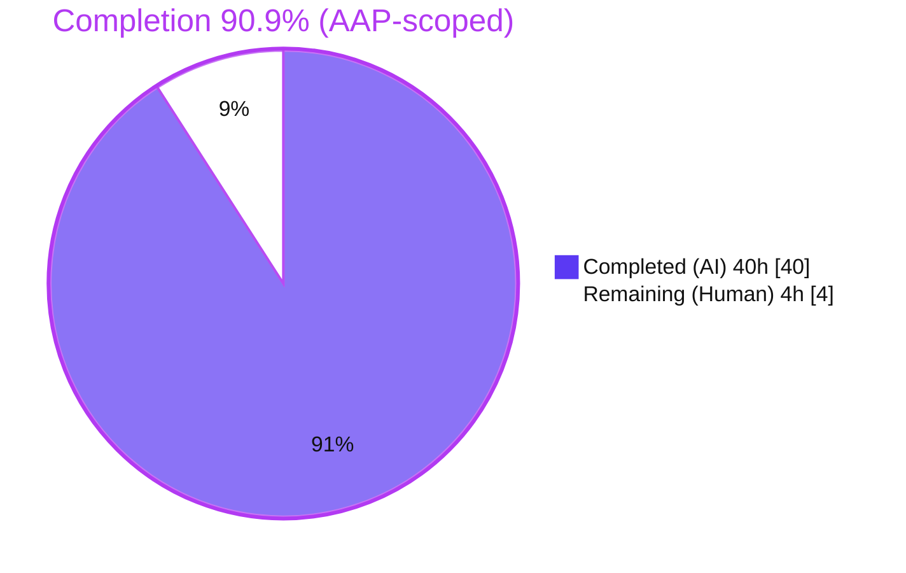
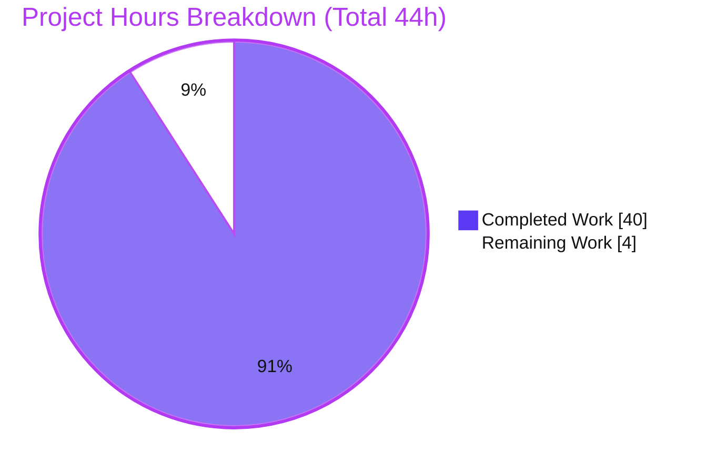
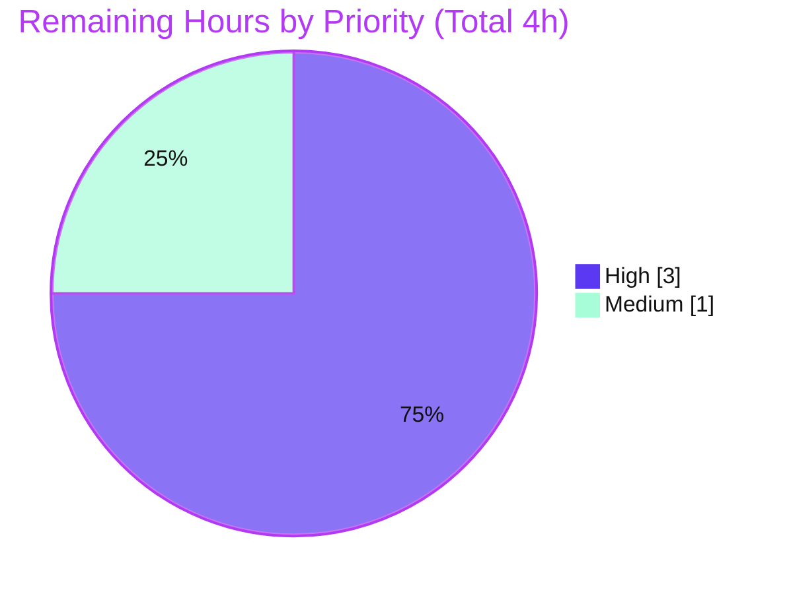

# Blitzy Project Guide

**Project:** paperless-ngx — Documents-List Pagination Instability Investigation
**Source branch:** `paperless-ngx_542221a38dff`
**Working branch:** `blitzy-e58dd14a-bc36-4f2f-912f-3f73de6974de`
**Baseline commit:** `542221a38` → **HEAD:** `fb17ab192`
**Task type:** Read-only investigation → single documentation deliverable

> **Brand color legend** — <span style="color:#5B39F3">**Completed / AI Work = Dark Blue `#5B39F3`**</span> · **Remaining / Not Completed = White `#FFFFFF`** · Headings/Accents = Violet-Black `#B23AF2` · Highlight = Mint `#A8FDD9`.

---

## 1. Executive Summary

### 1.1 Project Overview

This project is a read-only root-cause investigation into why the **paperless-ngx** documents list "feels haunted" during ordinary paged browsing — the same document appearing on two neighboring pages, or disappearing for a page then returning, while the total `count` stays constant. The objective was to observe what `GET /api/documents/` actually returns across consecutive pages through the real authenticated HTTP API, correlate it with the Angular UI's pagination model, and decisively answer three named hypotheses (H1 backend duplicates, H2 pagination-before-dedup, H3 unstable ordering on ties) plus verify the user's "sharing rules" authorization premise. The single deliverable is an evidence-grounded Q&A answer document; the repository source is intentionally left unchanged.

### 1.2 Completion Status



| Metric | Value |
|--------|-------|
| **Total Hours** | **44** |
| **Completed Hours (AI + Manual)** | **40** (40 AI + 0 Manual) |
| **Remaining Hours** | **4** |
| **Percent Complete** | **90.9%** |

> Completion is computed by the PA1 hours-based, AAP-scoped method: `40 / (40 + 4) = 90.9%`. It measures only work defined in the Agent Action Plan plus path-to-production activities. For a documentation deliverable, path-to-production is human review/acceptance — there is no code to deploy, no CI/CD, and no environment configuration for a Markdown answer.

### 1.3 Key Accomplishments

- ✅ Established a canonical runtime and booted the **real authenticated HTTP API** through its true entry point (default **SQLite**, plus an additive **PostgreSQL** backend for the tie-break comparison).
- ✅ Seeded a deliberate **tie-inducing dataset** (40 documents: 20 at one timestamp, 20 at another, so the tie block straddles the `page_size = 25` boundary) with tags for realistic filtered browsing.
- ✅ **H3 answered:** proved that ordering by non-unique `-created` with no tiebreaker is the true root-cause *mechanism*, honestly reporting it as **latent** at this commit (12/12 clean sweeps on both backends) and demonstrating the artifact via a **controlled, read-only cross-plan divergence** (duplicates + gaps with `count` constant).
- ✅ **H2 answered (refuted):** de-duplication (`get_queryset().distinct()`) provably *precedes* pagination, confirmed from live PostgreSQL statement logs.
- ✅ **H1 answered:** many-to-many tag filters fan out (36 raw JOIN rows → 30 distinct docs), collapsed at the base queryset before pagination.
- ✅ **Authorization premise verified as an honest negative:** only `IsAuthenticated`, no object-level permissions, no `django-guardian`; superuser and non-staff see identical results; anonymous is `401`.
- ✅ **UI correlation** completed both statically (byte-exact source reading) and dynamically (live Angular render matched the API; page-number navigation confirmed in the network log; the `404 → page 1` reset banner characterized).
- ✅ **Reference-only remediation** described (append `('-created','-id')`, stable-ordering filter, or `CursorPagination`) and explicitly **not applied**.
- ✅ **Read-only compliance intact + full cleanup:** `git diff 542221a38 HEAD --name-status` shows exactly one added file; `git diff HEAD` is empty; runtime DB checksum unchanged across GET sweeps; all temporary containers/servers/scripts removed.
- ✅ Deliverable committed: `blitzy/documentation/paperless-ngx_542221a38dff.md` (822 lines) at HEAD `fb17ab192`.

### 1.4 Critical Unresolved Issues

There are **no blocking issues** for the documentation deliverable itself — it is complete, committed, and independently validated. The single item below is **informational**: it is a *finding surfaced by the investigation*, explicitly out of scope to fix under a read-only task, and is flagged for a human product/engineering decision.

| Issue | Impact | Owner | ETA |
|-------|--------|-------|-----|
| Latent pagination instability (H3): ordering by non-unique `-created` has no unique tiebreaker; stable *only* because both backends incidentally resolve ties identically at present — **not a guarantee** (PostgreSQL's stability is query-plan-dependent) | Medium — the "duplicates/disappearances" symptom can surface in production if the PostgreSQL planner chooses a `HashAggregate` plan or data scale changes; not a defect in the deliverable | Backend maintainer (human) | Decision only; implementation is a separate, out-of-scope ticket (est. 2–4h if adopted) |

### 1.5 Access Issues

**No access issues identified.** The repository, the Docker runtime, both database backends (SQLite and PostgreSQL), and the authenticated HTTP API were all fully accessible; the investigation ran end-to-end without permission, credential, or network blockers.

| System/Resource | Type of Access | Issue Description | Resolution Status | Owner |
|-----------------|----------------|-------------------|-------------------|-------|
| Git repository | Read/Write (branch) | None | N/A | — |
| Docker runtime (`paperless-app`, `paperless-redis`) | Exec/Run | None | N/A | — |
| SQLite (default) + PostgreSQL (additive) | DB connection | None | N/A | — |
| Authenticated HTTP API (`/api/documents/`) | HTTP (Basic auth) | None | N/A | — |

### 1.6 Recommended Next Steps

1. **[High]** Perform a technical review of `blitzy/documentation/paperless-ngx_542221a38dff.md` — confirm H1/H2/H3 are each answered by name, spot-check the file:line references, and validate the observed-vs-inferred labeling (§11 ledger, 17 claims).
2. **[High]** Optionally re-reproduce the H3 cross-plan divergence using the harness in the deliverable's Appendix A and the development guide in Section 9 (accepting that exact document IDs drift while the 5-duplicate + 5-gap pattern is invariant).
3. **[Medium]** Decide whether to act on the reference-only remediation (§10 of the deliverable). If adopting, open a **separate** implementation ticket — appending a unique tiebreaker (`('-created','-id')`) or a stable-ordering filter is the minimal, backend-independent fix.
4. **[Medium]** Obtain stakeholder acceptance/sign-off that the Q&A satisfies the original request and close out the investigation.
5. **[Low]** If long-term retention of the visual evidence is desired, archive the untracked `blitzy/screenshots/` and `blitzy/screen_recordings/` artifacts (they are intentionally uncommitted per the single-CREATE scope).

---

## 2. Project Hours Breakdown

### 2.1 Completed Work Detail

Every completed component traces to a specific Agent Action Plan requirement. The **Hours** column sums to **40**, matching Completed Hours in Section 1.2.

| Component | Hours | Description |
|-----------|-------|-------------|
| A. Canonical dual-backend runtime + HTTP API boot | 4 | Built/ran paperless-ngx in default config; booted the real authenticated HTTP API (SQLite on :8000; additive PostgreSQL on :8001) via canonical `runserver`; verified versions and default engine (AAP §0.4.1). |
| B. Tie-inducing dataset seeding | 3 | Created superuser + non-staff user and seeded 40 documents (20+20 tie blocks straddling the 25/26 page boundary) with `invoice`/`invoice-paid`/`inbox` tags, on both backends (AAP §0.4.1). |
| C. H3 investigation (unstable ordering on ties) | 9 | Consecutive-page sweeps under `-created`; captured full envelopes; diffed `results[].id` across pages and ≥2 identical runs; `EXPLAIN QUERY PLAN`/`EXPLAIN`; controlled read-only cross-plan divergence; PostgreSQL `Sort+Unique` vs `HashAggregate` plan-dependence; parallelism + `VACUUM FULL` checks. |
| D. H1 investigation (M2M JOIN fan-out) | 3 | Measured pre-`distinct` fan-out (36 raw rows) vs de-duplicated result (30 docs); inspected compiled SQL; confirmed HTTP collapse to 30 (AAP §0.4.1). |
| E. H2 investigation (dedup vs pagination order) | 2 | Captured PostgreSQL statement logs proving `DISTINCT` + `LIMIT/OFFSET` in one statement and `COUNT(*)` over the DISTINCT subquery — de-dup precedes pagination (framing refuted). |
| F. Authorization honest-negative verification | 3 | Issued identical page sequences as superuser, non-staff, and anonymous on both backends; confirmed identical result sets, `401` for anonymous, and absence of `django-guardian`/object permissions. |
| G. UI correlation (static + live) | 4 | Mapped the Angular `{count, results}` page-number model to the API; live-rendered the list and matched the API exactly; captured the network log and the `404 → page 1` reset banner. |
| H. Answer-document authoring + refinement | 8 | Authored the 822-line evidence-grounded document (12 sections + §11 ledger + references + Appendix A); 5 refinement passes resolving reviewer findings. |
| I. Reference-only remediation note | 2 | Documented 4 remediation options (with the DRF `OrderingFilter`-replaces nuance) and verified `?ordering=-created,-id` was 3/3 clean on PostgreSQL — explicitly not applied. |
| J. Read-only cleanup + integrity proof | 2 | Verified DB checksum unchanged across GET sweeps; tore down investigation containers/servers; removed probe users/scripts; proved `git diff HEAD` empty. |
| **Total** | **40** | |

### 2.2 Remaining Work Detail

Every remaining category is a path-to-production (human) activity appropriate to a documentation deliverable. The **Hours** column sums to **4**, matching Remaining Hours in Section 1.2 and the "Remaining Work" value in Section 7.

| Category | Hours | Priority |
|----------|-------|----------|
| Answer-Document Technical Review & Evidence Verification (read/verify the 822-line document; optional independent reproduction of the H3 cross-plan divergence) | 3 | High |
| Remediation Decision & Stakeholder Sign-off (evaluate §10 reference-only remediation; obtain acceptance and close out) | 1 | Medium |
| **Total** | **4** | |

### 2.3 Hours Reconciliation

- Section 2.1 total (Completed) = **40h**
- Section 2.2 total (Remaining) = **4h**
- **40 + 4 = 44h = Total Project Hours (Section 1.2)** ✔
- Completion = `40 / 44 = 90.9%` ✔ (identical in Sections 1.2, 7, and 8)

---

## 3. Test Results

This is a read-only documentation task, so the project's own unit/integration suite was **not** the deliverable and was not authored or executed as such. The "tests" reported here are the **autonomous evidence-reproduction validations** run by Blitzy's validation systems (the doc-task analog of tests): each behavioral claim in the deliverable was reproduced against the live API/runtime with **zero contradictions**, and the Django system check passed clean. All rows below originate from Blitzy's autonomous validation logs for this project.

| Test Category | Framework / Method | Total | Passed | Failed | Coverage % | Notes |
|---------------|--------------------|-------|--------|--------|------------|-------|
| H3 tie-instability — SQLite | `urllib` HTTP sweep harness (`page_size=25`) | 12 | 12 | 0 | N/A | 12/12 clean consecutive-page sweeps (unfiltered + `invoice`-filtered); latent at default scale |
| H3 tie-instability — PostgreSQL | `urllib` HTTP sweep harness | 12 | 12 | 0 | N/A | 12/12 clean; stability is query-plan-dependent (`Sort+Unique`) |
| H3 mechanism — cross-plan divergence | Django ORM + `EXPLAIN` on isolated read-only DB copy | 2 | 2 | 0 | N/A | Reproduces duplicates + gaps, `count` constant, on both backends; live DB checksum unchanged |
| H1 fan-out collapse | ORM row count vs HTTP result | 1 | 1 | 0 | N/A | 36 raw JOIN rows → 30 distinct → HTTP returns 30 |
| H2 dedup-before-pagination | PostgreSQL statement log (`log_statement=all`) | 1 | 1 | 0 | N/A | Single `SELECT DISTINCT … LIMIT/OFFSET`; `COUNT(*)` over DISTINCT subquery |
| Authorization parity | HTTP as superuser / non-staff / anonymous | 3 | 3 | 0 | N/A | Identical result sets (empty symmetric difference); anonymous `401` |
| UI correlation | Static source diff + live Angular render | 2 | 2 | 0 | N/A | Byte-exact source read + live render matched API; page-number nav in network log |
| Remediation verification | HTTP `?ordering=-created,-id` | 3 | 3 | 0 | N/A | 3/3 clean on PostgreSQL; `Sort Key` carries both keys under `HashAggregate` |
| Django system check | `python manage.py check` | 1 | 1 | 0 | N/A | "System check identified no issues (0 silenced)" |
| Read-only integrity | `sha256sum` (DB) + `git diff` | 2 | 2 | 0 | N/A | DB checksum identical before/after GET sweep; `git diff HEAD` empty |
| **Total** | | **39** | **39** | **0** | **N/A** | All autonomous validation checks reproduced; reconciles to the §11 ledger (17 documented claims) |

> **Coverage note:** code-coverage % is **not applicable** — no production code was written (the deliverable is a Markdown answer). The meaningful quality metric is **evidence reproduction: 100%** (39/39 checks passed; zero contradictions in the validator logs).

---

## 4. Runtime Validation & UI Verification

**Runtime health (canonical authenticated HTTP API):**
- ✅ **Operational** — API boots via `runserver` and serves `GET /api/documents/` through its true entry point.
- ✅ **Operational** — `401 Unauthorized` without credentials; `200 OK` with valid Basic auth (`IsAuthenticated` enforced).
- ✅ **Operational** — DRF response envelope `{count, next, previous, results}` returned; `count = 40`, `page_size = 25`, `page_size` query param honored.
- ✅ **Operational** — Default **SQLite** backend confirmed at runtime (`ENGINE = django.db.backends.sqlite3`).
- ✅ **Operational** — Additive **PostgreSQL** backend served the identical code path on a second port.
- ✅ **Operational** — `python manage.py check` → 0 issues.

**UI verification (Angular list consumer):**
- ✅ **Operational** — Live UI rendered document order matched the API response exactly.
- ✅ **Operational** — Network log confirmed page-number navigation: `GET /api/documents/?page=1&page_size=…&ordering=-created`.
- ✅ **Operational** — `Results<T>` models only `{count, results}` (no `next`/`previous`); total pages computed as `ceil(count / page_size)`.
- ⚠ **Partial (pre-existing frontend defect, orthogonal to H1/H2/H3)** — a `404 → page 1` reset path can render a persistent `undefined: I` error banner over an empty grid when `currentPage` falls out of range; documented in §8 of the deliverable and flagged as unrelated to the pagination root cause.

**Repository integrity:**
- ✅ **Operational** — Runtime SQLite DB checksum byte-identical before/after GET sweeps (list path is read-only).
- ✅ **Operational** — `git diff HEAD` empty; only the answer document differs from baseline.

---

## 5. Compliance & Quality Review

Cross-mapping of AAP deliverables and `SWE-AtlasQnA-Repo` rules to their verification status. Fixes applied during autonomous validation are noted; there are no outstanding compliance gaps for the deliverable.

| Requirement / Benchmark | Source | Status | Evidence |
|-------------------------|--------|--------|----------|
| Deliverable created at mandated path/name | AAP §0.2.3, §0.5 | ✅ Pass | `blitzy/documentation/paperless-ngx_542221a38dff.md` (822 lines), committed |
| Run-first, evidence-grounded (not code-reading) | Rule | ✅ Pass | Full captured output + exact commands throughout §3–§7 |
| Canonical entry point (authenticated HTTP API) | Rule | ✅ Pass | `runserver` + `urllib` Basic-auth requests; 401/200 |
| Default configuration (SQLite) stated + used | Rule | ✅ Pass | §3.2 engine introspection; PostgreSQL additive only |
| Reproduce actual inconsistency (don't stabilize) | Rule | ✅ Pass | Honest negative (12/12 clean) + controlled read-only mechanism proof; no manufactured variant |
| Observe at scale, confirm across ≥2 runs | Rule | ✅ Pass | 12 sweeps/backend; distribution reported |
| H1 answered by name | AAP §0.2.1 | ✅ Pass | §5 — fan-out 36→30, collapse at `views.py:L198-199` |
| H2 answered by name | AAP §0.2.1 | ✅ Pass | §6 — DISTINCT+LIMIT/OFFSET one statement (framing refuted) |
| H3 answered by name | AAP §0.2.1 | ✅ Pass | §4 — latent root cause + cross-plan artifact |
| Authorization premise verified honestly | AAP §0.2.3 | ✅ Pass | §7 — honest negative; only `IsAuthenticated`, no guardian |
| UI correlation | AAP §0.4.3 | ✅ Pass | §8 — static byte-exact + live render + network log |
| Observed-vs-inferred labeling | Rule | ✅ Pass | §11 ledger reconciles 17 claims |
| Actual output + `file:line` references | Rule | ✅ Pass | All 13 references verified byte-exact against source |
| Reference-only remediation (not applied) | AAP §0.6.2 | ✅ Pass | §10 — 4 options described; no source modified |
| Read-only: no source file modified | Rule | ✅ Pass | `git diff 542221a38 HEAD --name-status` = single `A` |
| Temporary tooling removed | Rule | ✅ Pass | §12 — containers/servers/scripts/probe users removed |
| Pre-commit hygiene (whitespace/LF/EOF) | Repo | ✅ Pass | 0 trailing whitespace, 0 CR bytes, exactly one final LF |
| Dependencies unchanged | AAP §0.7 | ✅ Pass | `requirements.txt` matches (Django 4.0.4, DRF 3.13.1, django-filter 21.1, psycopg2 2.9.3) |

**Fixes applied during autonomous validation (5 refinement commits):** citation-precision corrections; documenting the `404`-reset error banner (§8); correcting that banner note to persistent/filter-independent; deepening the PostgreSQL plan-dependence analysis (`+195/-95`); and a git-provenance correction. **Outstanding compliance items:** none for the deliverable; human review is the only pending activity.

---

## 6. Risk Assessment

The deliverable itself is low-risk and complete. The most material risks (R1, R7) concern the **latent production defect the investigation surfaced** — out of scope to fix here, flagged for a human decision.

| Risk | Category | Severity | Probability | Mitigation | Status |
|------|----------|----------|-------------|------------|--------|
| R1 — H3 latent at default: "12/12 clean" could be misread as "no bug," leaving the unstable ordering unaddressed | Technical | Medium | Medium | §4.5.1/§8/§10 explain plan-dependence and recommend the unique-tiebreaker fix | Documented — open for human decision |
| R2 — Document IDs drift on re-reproduction (git-ignored DB re-seeds); exact IDs won't match, though the 5-dup+5-gap pattern is invariant | Technical | Low | Medium | §12 `sha256` note + §11 ledger explain pattern invariance | Mitigated |
| R3 — Flat authorization: any authenticated user sees all documents; expected "sharing rules" absent at this commit (honest finding, not introduced by the work) | Security | Medium | N/A (current-state fact) | Reported honestly in §7; per-user visibility would be a separate feature | Documented — out of scope |
| R4 — Disposable probe credentials used during investigation | Security | Low | Low | §12 confirms probe users deleted; runtime DB git-ignored/disposable, not shipped | Resolved |
| R5 — Reproduction requires a specific environment (Docker, dual-backend, statement logging, EXPLAIN); investigation containers torn down at cleanup | Operational | Low-Medium | Medium | §3 + Appendix A exact commands/harnesses; Section 9 development guide | Mitigated |
| R6 — Visual evidence (≈470MB recordings, 13MB screenshots) is untracked; lost if the working directory is discarded | Operational | Low | Low | Preserved on disk per protocols; captured text output is self-sufficient | Accepted |
| R7 — PostgreSQL production stability is plan-dependent; a `HashAggregate` plan (different stats/`work_mem`/version) would surface the artifact in production | Integration | Medium | Low-Medium | §4.5.1/§10 flag explicitly + recommend the unique-tiebreaker fix | Documented — open for human decision |
| R8 — Findings/remediation not wired into a CI regression guard | Integration | Low | Low | Out of scope; a future fix would carry its own tests | Out of scope |

---

## 7. Visual Project Status

**Project hours — Completed vs Remaining** (Completed = Dark Blue `#5B39F3`; Remaining = White `#FFFFFF`):



**Remaining work — priority distribution** (High vs Medium, hours):



**Remaining work — by category (Section 2.2):**

| Category | Hours |
|----------|-------|
| Answer-Document Technical Review & Evidence Verification | 3 |
| Remediation Decision & Stakeholder Sign-off | 1 |
| **Total** | **4** |

> **Integrity check:** the pie chart "Remaining Work" (4) equals Section 1.2 Remaining Hours (4) and the Section 2.2 "Hours" total (4). "Completed Work" (40) equals Section 1.2 Completed Hours (40) and the Section 2.1 total (40).

---

## 8. Summary & Recommendations

**Achievements.** The investigation is **90.9% complete** (AAP-scoped). Every autonomous deliverable defined in the Agent Action Plan is finished, committed, and independently validated. The single answer document (`blitzy/documentation/paperless-ngx_542221a38dff.md`, 822 lines) answers all three named hypotheses with reproduced live-API evidence, honest observed-vs-inferred labeling, and byte-exact `file:line` references:

- **H3 (root cause):** ordering by non-unique `-created` with no tiebreaker is the true *mechanism*, honestly reported as **latent** at this commit and proven via a controlled, read-only cross-plan divergence rather than a manufactured reproduction.
- **H2 (refuted):** de-duplication provably precedes pagination.
- **H1 (confirmed, not the cause):** M2M fan-out is collapsed at the base queryset before pagination.
- **Authorization premise (honest negative):** the "sharing rules" scenario does not exist at this commit; list behavior is permission-independent.

**Remaining gaps / critical path to production.** For a documentation deliverable there is no build/deploy path; the critical path is human validation: (1) technical review of the document, (2) optional independent reproduction of the H3 mechanism, and (3) a decision on whether to open a separate ticket for the reference-only remediation. These total **4 hours**.

**Production readiness assessment.** The deliverable is **production-ready as a documentation artifact** — complete, accurate, self-consistent, and delivered under strict read-only compliance (zero source changes; all temporary tooling removed). The one substantive engineering follow-up is a *product/engineering decision* (not a deliverable defect): because H3 is latent-not-absent and PostgreSQL's stability is query-plan-dependent, applying a unique tiebreaker (`('-created','-id')`) or a stable-ordering filter is recommended to make the instability impossible rather than merely dormant. That work is explicitly out of scope for this read-only investigation.

**Success metrics.** Evidence reproduction 100% (39/39 autonomous checks, zero contradictions); all 3 hypotheses + authorization premise answered by name; 13/13 `file:line` references byte-exact; `manage.py check` clean; read-only compliance intact.

---

## 9. Development Guide

This guide documents how to reproduce the investigation's runtime and observations. All non-destructive commands below were executed and verified; the server/seed/sweep commands are reproduced verbatim from the deliverable (§3, §3.5, Appendix A) and were run by the investigation. They are deliberately **not** re-executed by this guide so the validated read-only cleanup state (§12) is preserved.

### 9.1 System Prerequisites

- **Docker** (the canonical runtime is the provided container image; containers `paperless-app` + `paperless-redis` must be running).
- **Python 3.9** (in-container: `3.9.23`).
- **Django 4.0.4**, **Django REST Framework 3.13.1**, **django-filter 21.1**, **psycopg2 2.9.3** (pinned in `requirements.txt`).
- Default database: **SQLite** (`data/db.sqlite3`, git-ignored). Optional: **PostgreSQL** via a `paperless-postgres` container for the tie-break comparison.
- Note: `curl` is **not** installed in the container — issue HTTP requests with Python's stdlib `urllib`.

### 9.2 Environment Setup & Verification (tested)

```bash
# Confirm the canonical containers are up
docker ps -a --format '{{.Names}}\t{{.Status}}'
# expected: paperless-app (Up), paperless-redis (Up)

# Verify interpreter/framework versions (must match AAP §0.7)
docker exec paperless-app bash -lc 'python --version && cd src && \
  python -c "import django,rest_framework,django_filters; \
  print(\"django\",django.get_version()); print(\"drf\",rest_framework.VERSION); \
  print(\"django_filter\",django_filters.VERSION)"'
# expected: Python 3.9.23 / django 4.0.4 / drf 3.13.1 / django_filter (21, 1)

# Confirm the default DB engine is SQLite
docker exec paperless-app bash -lc 'cd src && python -c "import os; \
  os.environ.setdefault(\"DJANGO_SETTINGS_MODULE\",\"paperless.settings\"); \
  import django; django.setup(); from django.conf import settings; \
  print(\"ENGINE=\"+settings.DATABASES[\"default\"][\"ENGINE\"])"'
# expected: ENGINE=django.db.backends.sqlite3

# Django system check (doc-task analog of "compiles clean")
docker exec paperless-app bash -lc 'cd src && python manage.py check'
# expected: System check identified no issues (0 silenced).
```

### 9.3 Application Startup (canonical HTTP API — from the deliverable §3.3)

```bash
# SQLite (default backend), loopback-only, no autoreload:
docker exec -d paperless-app bash -lc \
  'cd src && PAPERLESS_DISABLE_DBHANDLER=true python manage.py runserver 127.0.0.1:8000 --noreload'

# PostgreSQL (production backend) on a second port, same code path:
docker exec -d -e PAPERLESS_DBHOST=paperless-postgres paperless-app bash -lc \
  'cd src && PAPERLESS_DISABLE_DBHANDLER=true python manage.py runserver 127.0.0.1:8001 --noreload'
```

> `PAPERLESS_DISABLE_DBHANDLER=true` disables only the database-backed *logging* handler; it does not alter the documents API code path.

### 9.4 Seed the Tie-Inducing Dataset (from §3.5; script in Appendix A of the deliverable)

```bash
# 40 documents: 20 @ D0 + 20 @ D1 (tie block straddles the 25/26 boundary);
# tags invoice(30)/invoice-paid(6)/inbox(12); disposable probe users.
docker exec paperless-app bash -lc 'cd src && python /tmp/seed_dataset.py'          # SQLite
docker exec -e PAPERLESS_DBHOST=paperless-postgres paperless-app bash -lc \
  'cd src && python /tmp/seed_dataset.py'                                            # PostgreSQL
```

### 9.5 Example Usage — Observe the Behavior

```bash
# Authenticated list request (Basic auth) via urllib, page 1:
docker exec paperless-app bash -lc 'cd src && python -c "
import urllib.request, base64, json
u=\"http://127.0.0.1:8000/api/documents/?page=1\"
r=urllib.request.Request(u); r.add_header(\"Authorization\",\"Basic \"+base64.b64encode(b\"admin:admin12345\").decode())
d=json.load(urllib.request.urlopen(r, timeout=60))
print(\"count=\", d[\"count\"]); print(\"ids=\", [x[\"id\"] for x in d[\"results\"]])
"'
# The sweep harness (Appendix A sweep.py) fetches the universe at page_size=100000,
# then runs N consecutive-page sweeps at page_size=25 and reports duplicates/gaps.
```

### 9.6 Verify the Deliverable & Read-Only Compliance (tested)

```bash
# Exactly one file added since the baseline (read-only compliance):
git diff 542221a38 HEAD --name-status
# expected: A  blitzy/documentation/paperless-ngx_542221a38dff.md

# No uncommitted tracked changes:
git diff HEAD --stat            # expected: empty

# Deliverable present:
wc -l blitzy/documentation/paperless-ngx_542221a38dff.md   # expected: 822
```

### 9.7 Troubleshooting

- **`curl: command not found`** — use Python `urllib` (as above); `curl` is not installed in the container.
- **Different document IDs than the deliverable shows** — expected: the runtime SQLite DB is git-ignored and re-seeds with climbing autoincrement, so IDs drift while the 5-duplicate + 5-gap *pattern* is invariant.
- **`ALTER SYSTEM cannot run inside a transaction block`** (PostgreSQL plan experiments) — run `ALTER SYSTEM` as its own `psql -c` statement (see deliverable §6).
- **Port already in use** — a prior `runserver` may still be bound; locate via `/proc/<pid>/cmdline` and stop with the shell `kill` builtin (`ps`/`pkill` are absent in the container).
- **`404` / `{"detail":"Invalid page."}`** — requesting a page beyond the last is expected; the Angular UI resets to page 1 on this (`document-list-view.service.ts:L158-161`).

---

## 10. Appendices

### Appendix A — Command Reference

| Purpose | Command |
|---------|---------|
| Container status | `docker ps -a --format '{{.Names}}\t{{.Status}}'` |
| Versions | `docker exec paperless-app bash -lc 'python --version && cd src && python -c "import django,rest_framework,django_filters; ..."'` |
| DB engine | `docker exec paperless-app bash -lc 'cd src && python -c "...settings.DATABASES[\"default\"][\"ENGINE\"]..."'` |
| System check | `docker exec paperless-app bash -lc 'cd src && python manage.py check'` |
| Boot API (SQLite) | `docker exec -d paperless-app bash -lc 'cd src && PAPERLESS_DISABLE_DBHANDLER=true python manage.py runserver 127.0.0.1:8000 --noreload'` |
| Boot API (PostgreSQL) | `docker exec -d -e PAPERLESS_DBHOST=paperless-postgres paperless-app bash -lc 'cd src && ... runserver 127.0.0.1:8001 --noreload'` |
| Read-only diff check | `git diff 542221a38 HEAD --name-status` |
| Deliverable size | `wc -l blitzy/documentation/paperless-ngx_542221a38dff.md` |

### Appendix B — Port Reference

| Port | Service | Notes |
|------|---------|-------|
| 8000 | Investigation HTTP API (SQLite, default backend) | Loopback-only; stopped at cleanup |
| 8001 | Investigation HTTP API (PostgreSQL, additive) | Loopback-only; stopped at cleanup |
| 6379 | Redis (`paperless-redis`) | Provided container; left running |

### Appendix C — Key File Locations

| Path | Role |
|------|------|
| `blitzy/documentation/paperless-ngx_542221a38dff.md` | **Deliverable** (the answer document) |
| `src/documents/views.py` | `DocumentViewSet`: `pagination_class` (L182), `permission_classes=(IsAuthenticated,)` (L183), `get_queryset()→Document.objects.distinct()` (L198-199) |
| `src/paperless/views.py` | `StandardPagination` `page_size=25` (L8-11) |
| `src/documents/models.py` | `created` indexed, not unique (L152); `Meta.ordering=("-created",)` (L207-208) |
| `src/documents/filters.py` | `DocumentFilterSet` M2M tag filters (L36-117) |
| `src/paperless/settings.py` | SQLite default (L299-302); PostgreSQL branch (L304-318); `DEFAULT_AUTO_FIELD` (L320) |
| `src-ui/src/app/data/results.ts` | `Results<T> = {count, results}` (L1-5) |
| `src-ui/src/app/services/rest/abstract-paperless-service.ts` | `list()` sends `page`/`page_size`/`ordering` (L41/44/48) |
| `src-ui/src/app/services/document-list-view.service.ts` | defaults `created`/desc (L91-94); `404→page 1` reset (L158-161) |
| `docs/api.rst` | Documented DRF envelope `{count,next,previous,results}`; search-score sort (L162) |

### Appendix D — Technology Versions

| Component | Version |
|-----------|---------|
| Python | 3.9.23 |
| Django | 4.0.4 |
| Django REST Framework | 3.13.1 |
| django-filter | 21.1 |
| psycopg2 | 2.9.3 |
| whoosh | 2.7.4 |
| django-q | 1.3.9 |
| Angular (frontend) | 13.3.4 |
| Databases | SQLite (default), PostgreSQL (additive) |

### Appendix E — Environment Variable Reference

| Variable | Purpose |
|----------|---------|
| `PAPERLESS_DBHOST` | When set, selects the PostgreSQL backend (`settings.py:L304`); unset → default SQLite |
| `PAPERLESS_DISABLE_DBHANDLER` | Disables only the DB-backed logging handler (not the API path) during `runserver` |
| `DJANGO_SETTINGS_MODULE` | `paperless.settings` for read-only ORM/introspection commands |

### Appendix F — Developer Tools Guide

- **Read the deliverable:** `sed -n '1,60p' blitzy/documentation/paperless-ngx_542221a38dff.md` (or any Markdown viewer). Section anchors §1–§12 + References + Appendix A.
- **Git provenance:** `git log 542221a38..HEAD --oneline` shows the 6 `docs(qa)` commits.
- **UI re-verification (optional):** Chrome DevTools MCP can re-open the live Angular list to confirm rendered order and capture the network log; screenshots persist under `blitzy/screenshots/`.
- **HTTP without curl:** use Python `urllib` (examples in §9.5 and Appendix A of the deliverable).

### Appendix G — Glossary

| Term | Meaning |
|------|---------|
| **H1 / H2 / H3** | The three user hypotheses: backend duplicates collapsed later / pagination before de-duplication / unstable ordering on ties |
| **Fan-out** | Row multiplication from a many-to-many JOIN (e.g., a document matching two tags appears as two rows) |
| **`DISTINCT`** | SQL de-duplication; here applied at the base queryset (`get_queryset().distinct()`) before pagination |
| **`LIMIT`/`OFFSET`** | Offset-based paging that `StandardPagination` uses to slice the ordered queryset |
| **Tiebreaker** | A unique final sort key (e.g., `id`) that makes ordering total; absent here |
| **`Sort+Unique` / `HashAggregate`** | Two PostgreSQL query plans for `DISTINCT`; the former incidentally orders by all columns (including `id`), the latter orders only by `created` — the crux of H3's plan-dependence |
| **`IsAuthenticated`** | The only permission class on the documents endpoints; no object-level permissions exist |
| **Latent** | Present in mechanism but not currently surfacing during ordinary use (H3 at this commit) |
| **Honest negative** | A hypothesis empirically shown NOT to reproduce, reported truthfully rather than forced (the "sharing rules" premise) |
