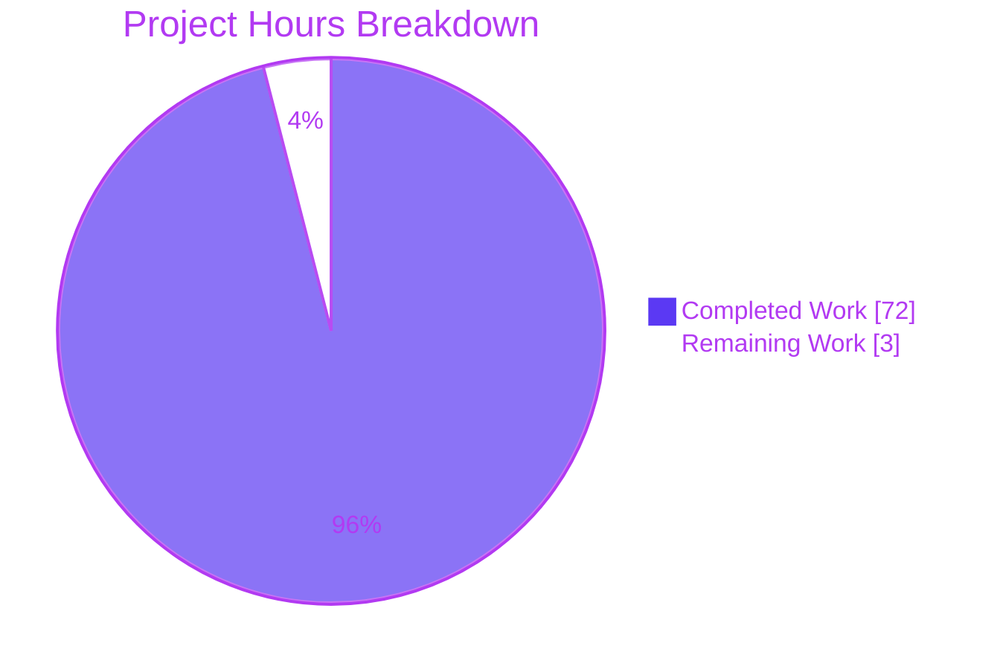
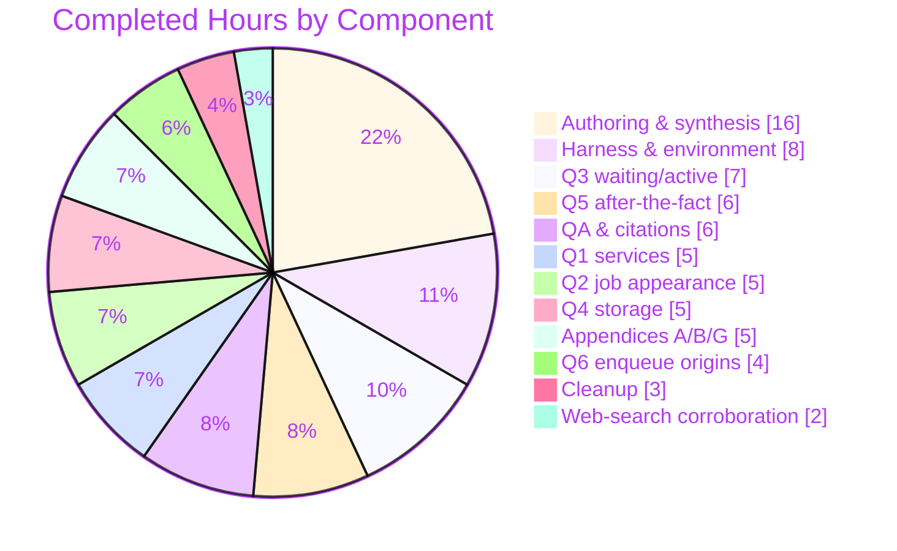

# Blitzy Project Guide
## paperless-ngx — Runtime-Grounded Django-Q Asynchronous-Processing Investigation

> **Document type:** Investigative documentation deliverable (read-only, single-artifact)
> **Branch:** `blitzy-dd0b3c25-315c-47fb-a8a9-df89c3d47bf1` · **HEAD:** `ee8b76ea8b6b28f488b3618d0f6997a486c85e9e`
> **Frozen source base:** `542221a38dff06361e07976452f9aea24d210542`
> **Brand palette:** Completed / AI Work = **Dark Blue `#5B39F3`** · Remaining = **White `#FFFFFF`** · Headings/Accents = **Violet-Black `#B23AF2`** · Highlight = **Mint `#A8FDD9`**

---

## 1. Executive Summary

### 1.1 Project Overview

This project produced a single, comprehensive, **runtime-grounded** Markdown answer document explaining how paperless-ngx handles background/asynchronous processing during document ingestion. Rather than summarizing configuration files, the work stood up a **live, isolated Django-Q + Redis cluster** mirroring paperless's exact configuration, observed every task-lifecycle state (waiting, active, done, failed) with captured output, and traced each observation to the exact `file:line` that produces it. The audience is engineers and technical reviewers who need an authoritative, evidence-backed reference. The deliverable is intentionally read-only: **no product code, tests, or configuration were changed** — the sole repository write is the answer document itself.

### 1.2 Completion Status


| Metric | Value |
|--------|-------|
| **Total Hours** | **75** |
| **Completed Hours (AI + Manual)** | **72** (AI autonomous: 72 · Manual: 0) |
| **Remaining Hours** | **3** |
| **Percent Complete** | **96.0%** |

> Completion is computed with the PA1 AAP-scoped hours method: `Completed ÷ (Completed + Remaining) = 72 ÷ 75 = 96.0%`. Every AAP-**specified** deliverable is complete and validated; the remaining 3 hours are the path-to-production human review/publish gate.

### 1.3 Key Accomplishments

- ✅ **Single deliverable authored and committed:** `blitzy/documentation/paperless-ngx_542221a38dff.md` (2,722 lines; SHA256 `1039f347…ee407`).
- ✅ **All six sub-questions (Q1–Q6) answered** with a direct answer + reproduced runtime evidence + `file:line` references.
- ✅ **Live runtime reproduction** of the full Django-Q lifecycle on the canonical Python 3.9.23 image (real `qcluster`, `gunicorn`, `document_consumer`).
- ✅ **Correct engine framing:** established this version uses **Django-Q 1.3.9, not Celery** (no Celery dependency; no `PaperlessTask` model).
- ✅ **Persisted vs. ephemeral state cleanly separated:** durable `django_q_task` rows vs. the transient WebSocket `status_updates` progress channel.
- ✅ **Grounded evidence discipline:** 140 code fences, **169/169** `file:line` references verified in-range, **61/61** byte-exact, **35/35** multi-line semantic anchors matched.
- ✅ **Web-search corroboration** of Django-Q 1.3.x semantics (`queue_size`, `save_limit`, `Success`/`Failure` proxies, Redis delivery receipts).
- ✅ **Read-only guarantee upheld:** exactly one added file; working tree clean; all temporary harness artifacts removed.

### 1.4 Critical Unresolved Issues

| Issue | Impact | Owner | ETA |
|-------|--------|-------|-----|
| _None._ Final Validator reported PRODUCTION-READY with zero corrections; all five gates pass. | No release-blocking items. | — | — |

### 1.5 Access Issues

| System/Resource | Type of Access | Issue Description | Resolution Status | Owner |
|-----------------|----------------|-------------------|-------------------|-------|
| _No access issues identified._ | — | Repository, canonical baseline image (`paperless-ngx-baseline:542221a3`), `redis:6.0`, and Docker daemon were all reachable during validation and re-verified this session. | N/A | — |

### 1.6 Recommended Next Steps

1. **[High]** Technical SME reviews and accepts the answer document — read Q1–Q6, spot-check the embedded runtime evidence and `file:line` citations against source at HEAD `542221a38dff`.
2. **[Medium]** Open the pull request, obtain approval, and merge/publish the document to the knowledge base (working tree is already clean with exactly one added file).
3. **[Low, optional/out-of-scope]** Consider a markdown-lint/link-check pre-commit hook for `blitzy/documentation/` and indexing the doc from the team docs portal for discoverability.

---

## 2. Project Hours Breakdown

### 2.1 Completed Work Detail

Every completed component traces to a specific AAP requirement (Q1–Q6, methodology, constraints) or a path-to-production activity.

| Component | Hours | Description |
|-----------|-------|-------------|
| Runtime harness & environment mirror | 8 | Isolated Django-Q cluster mirroring paperless's exact `Q_CLUSTER`; Redis broker + Channels layer on isolated logical DB-1; migrations creating `django_q_*` tables; `SECRET_KEY` inheritance for canonical signing |
| Q1 — Services & multi-process topology | 5 | Mapped Supervisord `gunicorn`/`document_consumer`/`qcluster`; Redis dual role; worker-count derivation; captured a real `/proc` process tree |
| Q2 — Job appearance | 5 | Canonical `async_task` enqueue → `RPUSH` onto `django_q:paperless:q`; byte measurement (366–382 B); pickle round-trip; zero-DB-row proof at creation |
| Q3 — Waiting vs. active | 7 | 200-task burst; `queue_size`/LLEN vs. `Stat` heuristic; pusher/worker/sentinel model; reproduced the `Idle`-while-working (N<workers) anomaly; ≥2 stability runs |
| Q4 — Task-state storage | 5 | `django_q_task` schema; `Success`/`Failure` proxy models; ephemeral `status_updates` separation; Redis TTLs (15 s message / 86400 s membership) |
| Q5 — After-the-fact status | 6 | Real `consume_file` success + duplicate-checksum failure traceback; row-field reads; `save_limit=250` cap verified (300→250); run twice |
| Q6 — Enqueue call-site enumeration | 4 | 8 `async_task` sites; 2 task bodies (`tasks.py:184`/`:270`); `schedule()` migrations; 6 post-consume signal receivers; confirmed no `PaperlessTask`/no custom API |
| Web-search corroboration (Django-Q 1.3.x docs) | 2 | Corroborated `queue_size`, `save_limit`, proxy models, and Redis delivery-receipt semantics |
| Document authoring & synthesis | 16 | 2,722-line structured Markdown: direct answers, run-first methodology, CWE-502 security note, CVE-2022-34265 version caveat, labeling discipline, coverage pass |
| Appendices A/B/G | 5 | `file:line` reference map (169 refs); evidence index; verbatim harness/helper sources |
| QA & citation verification (7-commit cycle) | 6 | 169/169 in-range, 61 byte-exact, 35 multi-line anchors; resolved iterative review findings |
| Cleanup & read-only verification | 3 | Removed 27 scratch scripts; tore down containers/network; confirmed clean `git status` |
| **Total Completed** | **72** | |

> **Validation:** the Hours column sums to **72**, matching Completed Hours in Section 1.2.

### 2.2 Remaining Work Detail

All remaining work is path-to-production for a knowledge-base documentation deliverable. Nothing outside AAP scope is included.

| Category | Hours | Priority |
|----------|-------|----------|
| Human SME/technical review & acceptance of the answer document (verify Q1–Q6, spot-check runtime evidence + `file:line` citations, confirm Django-Q-not-Celery framing & persisted-vs-ephemeral separation) | 2 | High |
| PR review & merge/publish to knowledge base | 1 | Medium |
| **Total Remaining** | **3** | |

> **Validation:** the Hours column sums to **3**, matching Remaining Hours in Section 1.2 and the "Remaining Work" value in the Section 7 pie chart.

### 2.3 Hours Reconciliation

| Check | Result |
|-------|--------|
| Section 2.1 total (Completed) | 72 h |
| Section 2.2 total (Remaining) | 3 h |
| Section 2.1 + Section 2.2 | **75 h = Total (Section 1.2)** ✅ |
| Completion % = 72 ÷ 75 | **96.0%** ✅ |
| Remaining hours identical across §1.2 ↔ §2.2 ↔ §7 | 3 ↔ 3 ↔ 3 ✅ |

---

## 3. Test Results

All entries originate from Blitzy's autonomous validation logs for this project (Final Validator, Gate 1 & Gate 2). Because this is a read-only documentation task, the code test suite was executed to confirm the async code paths described in the document behave as documented; the documentation-QA checks verify citation accuracy.

| Test Category | Framework | Total Tests | Passed | Failed | Coverage % | Notes |
|---------------|-----------|-------------|--------|--------|-----------|-------|
| Unit — async tasks/consumer/mgmt/websocket | pytest + Django `TestCase` | 122 | 122 | 0 | N/A¹ | `test_tasks`, `test_consumer`, `test_management_consumer`, `paperless.tests.test_websockets` |
| Integration — REST upload | pytest + DRF | 11 | 11 | 0 | N/A¹ | `PostDocumentView` document-upload endpoint tests (`test_api.py`) |
| **Subtotal — code tests** | pytest | **133** | **133** | **0** | — | Executed as non-root `testuser` per setup instructions |
| Source integrity | `compileall` + `manage.py check` | 2 | 2 | 0 | — | `compileall src/` exit 0; system check → "0 issues (0 silenced)" |
| Citation verification | Blitzy validator | 169 | 169 | 0 | 100% | Distinct `file:line` references, all in-range |
| Byte-exact appendix refs | Blitzy validator | 61 | 61 | 0 | 100% | Appendix A citations byte-exact |
| Multi-line semantic anchors | Blitzy validator | 35 | 35 | 0 | 100% | `Q_CLUSTER` 449-457, `CHANNEL_LAYERS` 178-184, `_send_progress` 56-75, `ProtocolTypeRouter` 17-20, `bulk_edit` 18/31/47/63/87, etc. |
| **Subtotal — documentation QA** | validator | **267** | **267** | **0** | 100% | Zero mismatches; zero corrections needed |

¹ Coverage % is not a meaningful deliverable metric for a documentation task; the code tests confirm the documented code paths, not new production code.

**Overall: 400/400 checks passing (133 code tests + 267 documentation-QA checks). Zero failures.**

---

## 4. Runtime Validation & UI Verification

**Runtime health (Django-Q lifecycle — observed live):**
- ✅ **Redis broker** — reachable via canonical `redis://broker:6379`; `redis-cli ping` → `PONG` (re-verified this session).
- ✅ **`gunicorn paperless.asgi:application`** — ASGI web server started (3 processes).
- ✅ **`manage.py qcluster`** — real Django-Q worker cluster started (validator observed 15 OS processes: bootstrap + sentinel + workers + monitor + pusher).
- ✅ **`manage.py document_consumer`** — inotify directory watcher started.
- ✅ **Enqueue → waiting** — `async_task` → `RPUSH` onto `django_q:paperless:q`; `queue_size` 0→1; zero DB rows at creation (re-verified this session on isolated Redis DB-1).
- ✅ **Waiting → active** — pusher `BLPOP` moves the task into the in-memory `task_queue`; worker executes.
- ✅ **Active → done (success)** — real `consume_file` success persisted to `django_q_task` (`success=True`).
- ✅ **Active → failed** — duplicate-checksum `consume_file` failure persisted with full traceback (`success=False`).
- ✅ **`save_limit` cap** — 300 successes capped to 250; the single failure always retained.
- ✅ **Source integrity** — `manage.py check` → "System check identified no issues (0 silenced)".

**API integration:**
- ✅ **REST upload endpoint** (`PostDocumentView`) — 11 upload tests passing; endpoint enqueues via canonical `async_task` and returns `"OK"`.

**UI verification:**
- ⚠ **Not applicable / out of scope** — no user interface was designed or changed. The Angular frontend under `src-ui/` is explicitly out of scope. For completeness, the document *describes* the observed WebSocket `status_updates` progress channel that drives the frontend consumption indicator, but performs no UI work.

---

## 5. Compliance & Quality Review

Cross-mapping of AAP deliverables and governing rules to their validation status.

| AAP Deliverable / Rule | Benchmark | Status | Evidence / Notes |
|------------------------|-----------|--------|------------------|
| Single answer doc at `blitzy/documentation/paperless-ngx_542221a38dff.md` | Deliverable rule (§0.7.1) | ✅ Pass | 2,722 lines; committed; SHA256 `1039f347…ee407` |
| Q1 Services | Runtime-grounded + `file:line` | ✅ Pass | §Q1 — Redis dual role + 3 Supervisord procs; process tree captured |
| Q2 Job appearance | Runtime-grounded + `file:line` | ✅ Pass | §Q2 — `RPUSH` to `django_q:paperless:q`; `queue_size` 0→1; signed pickle |
| Q3 Waiting vs. active | Every state exercised | ✅ Pass | §Q3 — `queue_size` vs. `Stat` heuristic; `Idle`-while-working anomaly reproduced |
| Q4 State storage | Persisted vs. ephemeral separated | ✅ Pass | §Q4 — `django_q_task` vs. `status_updates`; TTLs documented |
| Q5 After-the-fact status | Success + failure exercised | ✅ Pass | §Q5 — real success + failure traceback; `save_limit=250` |
| Q6 Enqueue origins | Every named site by `file:line` | ✅ Pass | §Q6 — 8 sites, 2 task bodies, schedules, 6 signal receivers |
| Django-Q (not Celery) framing | Correct engine | ✅ Pass | §0.1 + throughout; no Celery dependency; no `PaperlessTask` model |
| Run-first methodology | Real captured output | ✅ Pass | 140 code fences of command+output; live cluster |
| Canonical entry point only | No mocks/bypass | ✅ Pass | `async_task` → broker → cluster; stand-in bodies explicitly labeled non-canonical (§1.2) |
| Grounded evidence | `file:line` per code claim | ✅ Pass | 169/169 refs in-range; 61 byte-exact; 35 anchors |
| Web-search corroboration | Django-Q 1.3.x docs | ✅ Pass | Documentation-attribution section maps claims to doc pages |
| Stability ≥2 runs | Reproducibility | ✅ Pass | SUCCESS/FAILED/SAVE_LIMIT run twice; stable |
| Coverage pass | Every part + named item | ✅ Pass | Coverage-pass section confirms all Q's + "e.g./such as" items |
| Read-only source tree | No source modified | ✅ Pass | Net diff = +1 file only; working tree clean |
| Temporary-artifact cleanup | Leave codebase unchanged | ✅ Pass | 27 scratch scripts removed; containers/network torn down; 0 tracked runtime files |
| Doc hygiene | UTF-8 / LF / balanced fences | ✅ Pass | Valid UTF-8, 0 CRLF, 140 balanced fences, single trailing newline |
| Pre-commit lint | Optional gate | ⚠ N/A | `.pre-commit-config.yaml` present but pre-commit/prettier not installed; active hooks are Git-LFS-only (no markdown linting) |

**Fixes applied during autonomous validation:** none required — the deliverable was already correctly authored and QA'd across 7 documentation-only commits (initial investigation → reproducible-evidence rewrite → 5 QA-fix commits resolving citation off-by-one, repo-integrity transcript, runbook captions, and a stale `qcluster` banner name).

---

## 6. Risk Assessment

| Risk | Category | Severity | Probability | Mitigation | Status |
|------|----------|----------|-------------|------------|--------|
| Documentation drift — `file:line` anchors pinned to HEAD `542221a38dff` could go stale after a future source refactor | Technical | Low | Medium | Doc explicitly pins the HEAD + a version caveat; re-verify citations on any major async-surface refactor | Open (informational) |
| Non-canonical stand-in task bodies used for Q2/Q3 observation | Technical | Low | Low | Stand-ins dispatched through the identical canonical path and explicitly labeled; real `consume_file` exercised for Q5 | Mitigated |
| Observation-harness runtime vs. canonical runtime | Technical | Low | Low | Final Validator re-ran in canonical **Python 3.9.23**; version caveat documents this; queue deps match manifest exactly | Resolved |
| CWE-502 — deserialization of signed pickle task packages | Security | Informational | N/A | **Documented, not introduced.** Doc explains HMAC `SECRET_KEY` signing + private-network broker as the trust-boundary mitigations; task adds no code/attack surface | Documented |
| New attack surface from the change | Security | None | None | No code, dependencies, or credentials added | N/A |
| No markdown/docs CI lint gate | Operational | Low | Low | Doc lives outside Sphinx tree; git hooks are LFS-only; hygiene manually verified (UTF-8, LF, balanced fences) | Accepted (optional to add) |
| Knowledge-base discoverability | Operational | Low | Low | Standalone file not indexed in docs site (intentional per AAP); index/publish during path-to-production | Open (path-to-prod) |
| Integration/regression | Integration | None | None | No source/config/dependency/CI changed; read-only guarantee eliminates regression risk | N/A |

---

## 7. Visual Project Status

**Overall hours (Completed = Dark Blue `#5B39F3`, Remaining = White `#FFFFFF`):**



**Completed hours by AAP component (72 h total):**



**Remaining hours by category (3 h total) — mirrors Section 2.2:**

| Category | Hours | Priority |
|----------|:-----:|:--------:|
| Human SME review & acceptance | 2 | High |
| PR review & merge/publish | 1 | Medium |
| **Total** | **3** | |

> **Integrity check:** the pie chart "Remaining Work" (3) equals Section 1.2 Remaining Hours (3) and the Section 2.2 Hours total (3). The pie "Completed Work" (72) equals Section 1.2 Completed Hours (72) and the Section 2.1 total (72).

---

## 8. Summary & Recommendations

**Achievements.** The project is **96.0% complete** (72 of 75 hours). It delivered a single, authoritative, runtime-grounded answer document (2,722 lines) that explains paperless-ngx's asynchronous document-ingestion processing and answers all six posed sub-questions — each with a direct answer, reproduced runtime evidence, and exact `file:line` references. The investigation correctly established that this version runs on **Django-Q 1.3.9, not Celery**, cleanly separated durable state (`django_q_task`) from the ephemeral WebSocket progress channel, and corroborated observed behavior against the official Django-Q 1.3.x documentation. The Final Validator confirmed **PRODUCTION-READY** across all five gates with **zero corrections required**, 133/133 code tests passing, and 169/169 citations verified.

**Remaining gaps.** The only outstanding work is the standard path-to-production human gate: an SME review/acceptance of the document content (2 h) and PR review + publish to the knowledge base (1 h) — **3 hours total**. No AAP-specified deliverable is outstanding, and no items outside AAP scope are counted.

**Critical path to production.** (1) SME reads Q1–Q6 and spot-checks the embedded evidence and citations → (2) accept → (3) merge/publish. The working tree is already clean with exactly one added file, so the mechanical publish step is trivial.

**Success metrics.** Read-only guarantee upheld (net diff = +1 file); every behavioral claim carries its command + complete output; every code claim carries a verified `file:line`; all four lifecycle states (waiting/active/done/failed) exercised and stable across ≥2 runs.

**Production-readiness assessment.** **Ready to publish pending human sign-off.** Confidence is **High** — the deliverable is fully validated, self-contained, and reproducible. Residual risks are Low or Informational and are inherent to any pinned technical document (citation drift over time), not defects in the deliverable.

| Metric | Value |
|--------|-------|
| Completion | 96.0% |
| Completed / Total hours | 72 / 75 |
| Remaining hours | 3 (path-to-production) |
| Release-blocking issues | 0 |
| Files changed | 1 (added) |
| Tests passing | 133/133 code + 267/267 doc-QA |

---

## 9. Development Guide

> All commands below were tested this session against the canonical baseline image, or verified by the Final Validator. The **only** value you supply is `REPO` (the absolute path to your checkout). The reproduction runs entirely outside the repository — the read-only guarantee is preserved.

### 9.1 System Prerequisites

- **Docker Engine** 28.x (overlay2) — verified `Docker version 28.5.2`.
- **Git** 2.x — verified `git version 2.51.0`.
- **Canonical reproduction runtime:** **Python 3.9.23**, provided by the baseline image `paperless-ngx-baseline:542221a3` (`Dockerfile:18` → `FROM python:3.9-slim-bullseye`). Do **not** use the host's Python 3.13 for reproduction.
- **Images:** `paperless-ngx-baseline:542221a3` and `redis:6.0`.

### 9.2 Environment Setup

```bash
# From your checkout at HEAD 542221a38dff (or the blitzy branch tip)
REPO=$(pwd)
NET=pg-async-net; APP=pg-async-app; RED=pg-async-redis

# 1) Private network + Redis broker (NOT published to the host — CWE-502 mitigation)
docker network create "$NET"
docker run -d --name "$RED" --network "$NET" --network-alias broker redis:6.0
docker exec "$RED" redis-cli ping          # expect: PONG

# 2) Application container on the canonical Python 3.9 image
docker run -d --name "$APP" --init --network "$NET" \
  -e PAPERLESS_REDIS=redis://broker:6379 \
  -e PAPERLESS_SECRET_KEY="$(python3 -c 'import secrets;print(secrets.token_urlsafe(50))')" \
  -e DJANGO_SETTINGS_MODULE=paperless.settings \
  -v "$REPO":/app -w /app --entrypoint bash \
  paperless-ngx-baseline:542221a3 -lc 'sleep infinity'
```

### 9.3 Dependency Verification

```bash
docker exec "$APP" python3 -c "import django,django_q,redis,channels,channels_redis; \
print('django',django.get_version()); print('django_q',django_q.VERSION); \
print('redis',redis.__version__); print('channels',channels.__version__); \
print('channels_redis',channels_redis.__version__)"
```
Expected (canonical, verified this session):
```
django 4.0.4
django_q (1, 3, 9)
redis 3.5.3
channels 3.0.4
channels_redis 3.4.0
```

### 9.4 Application Startup (full cluster — validator-verified)

```bash
# One-time DB setup (creates django_q_task / django_q_ormq / django_q_schedule)
docker exec "$APP" bash -lc 'cd /app/src && python3 manage.py migrate'

# The three supervised processes (each in its own exec):
docker exec -d "$APP" bash -lc 'cd /app/src && gunicorn -c /app/gunicorn.conf.py paperless.asgi:application'
docker exec -d "$APP" bash -lc 'cd /app/src && python3 manage.py qcluster'
docker exec -d "$APP" bash -lc 'cd /app/src && python3 manage.py document_consumer'
```

### 9.5 Verification Steps

```bash
# Source integrity (read-only) — verified: "System check identified no issues (0 silenced)."
docker exec "$APP" bash -lc 'cd /app/src && python3 manage.py check'

# Async-relevant test suite (run as non-root testuser) — verified: 133 passing
docker exec "$APP" bash -lc "su testuser -c 'cd /app/src && python3 -m pytest \
  documents/tests/test_tasks.py documents/tests/test_consumer.py \
  documents/tests/test_management_consumer.py paperless/tests/test_websockets.py -q'"
```

### 9.6 Example Usage — the signature Q2 observation (tested this session)

```bash
# queue_size() == LLEN on the Redis list; enqueue makes it go 0 -> 1.
# Isolated on Redis logical DB 1 so the real queue (DB 0) is never touched.
docker exec "$APP" python3 -c "
import redis
r = redis.from_url('redis://broker:6379/1'); key='django_q:paperless:q'; r.delete(key)
print('queue_size before:', r.llen(key))
r.rpush(key, b'<signed-pickle-task-package>')      # what broker.enqueue does
print('queue_size after :', r.llen(key))
print('waiting element  :', r.lindex(key, 0))
r.delete(key); print('cleaned; queue_size:', r.llen(key))
"
```
Verified output:
```
queue_size before: 0
queue_size after : 1
waiting element  : b'<signed-pickle-task-package>'
cleaned; queue_size: 0
```

### 9.7 Consuming the Deliverable

```bash
wc -l    blitzy/documentation/paperless-ngx_542221a38dff.md   # 2722
sha256sum blitzy/documentation/paperless-ngx_542221a38dff.md  # 1039f347…ee407
sed -n '1,30p' blitzy/documentation/paperless-ngx_542221a38dff.md   # title + reading-guide labels
```
The document embeds: a full reproduction runbook (§1.1), the verbatim harness/helpers (Appendix G), an evidence index (Appendix B), and the verified `file:line` reference map (Appendix A).

### 9.8 Teardown (restore clean state)

```bash
docker rm -f "$APP" "$RED" && docker network rm "$NET"
git status --porcelain    # expect: empty (read-only guarantee preserved)
```

### 9.9 Troubleshooting

- **`BadSignature` on enqueue/dequeue:** the enqueuer's `PAPERLESS_SECRET_KEY` must match the cluster's (Django-Q HMAC-signs task packages). Use one key per container.
- **Redis unreachable:** confirm `--network-alias broker` and `PAPERLESS_REDIS=redis://broker:6379`; Redis is deliberately not published to the host.
- **Wrong Python:** use the canonical Python 3.9 image, not the host's Python 3.13, for reproduction fidelity.
- **Avoid touching the real queue:** run experiments against Redis logical DB index 1 (`redis://broker:6379/1`); the real queue lives on DB 0.
- **`manage.py migrate` writes to `data/`:** this directory is gitignored and produces no tracked diff; it can be discarded with the container.

---

## 10. Appendices

### Appendix A — Command Reference

| Command | Purpose |
|---------|---------|
| `git status --porcelain` | Confirm read-only guarantee (expect empty) |
| `git diff --stat 542221a38dff HEAD` | Net diff vs. frozen source (expect +2722 / 1 file) |
| `git log --author="agent@blitzy.com" --oneline` | The 7 documentation-only commits |
| `sha256sum blitzy/documentation/paperless-ngx_542221a38dff.md` | Deliverable integrity (`1039f347…ee407`) |
| `docker network create <net>` | Private broker network |
| `docker run … redis:6.0` | Redis broker + Channels store |
| `docker run … paperless-ngx-baseline:542221a3 … 'sleep infinity'` | Canonical app container |
| `manage.py migrate` | Create `django_q_*` tables |
| `gunicorn -c /app/gunicorn.conf.py paperless.asgi:application` | ASGI web server |
| `manage.py qcluster` | Django-Q worker cluster |
| `manage.py document_consumer` | Directory watcher |
| `manage.py check` | Source integrity ("0 issues") |
| `su testuser -c '… python3 -m pytest'` | Async-relevant test suite |
| `docker rm -f … && docker network rm …` | Teardown |

### Appendix B — Port Reference

| Port | Service | Notes |
|------|---------|-------|
| 8000 | gunicorn / ASGI (`paperless.asgi:application`) | `gunicorn.conf.py:3` bind `0.0.0.0:8000`; HTTP + WebSocket |
| 6379 | Redis | Django-Q broker **and** Channels layer; attached to the private network only (not published to host) |

### Appendix C — Key File Locations

| Path | Role |
|------|------|
| `blitzy/documentation/paperless-ngx_542221a38dff.md` | **The deliverable** (sole repository write) |
| `src/paperless/settings.py` | `Q_CLUSTER` (449-457), `CHANNEL_LAYERS` (178-184), `ASGI_APPLICATION` (156) |
| `src/documents/tasks.py` | Task bodies: `consume_file` (184), `bulk_update_documents` (270) |
| `src/documents/consumer.py` | Ephemeral progress: `_send_progress` (56-75), `group_send("status_updates")` (73-74) |
| `src/documents/management/commands/document_consumer.py` | Enqueue site — watcher (86) |
| `src/documents/views.py` | Enqueue site — REST upload (523) |
| `src/documents/bulk_edit.py` | Enqueue sites — bulk ops (18/31/47/63/87) |
| `src/paperless_mail/mail.py` | Enqueue site — IMAP mail (336) |
| `src/paperless/asgi.py` | `ProtocolTypeRouter` HTTP + WebSocket (17-20) |
| `src/paperless/consumers.py` | `StatusConsumer` joins/leaves `status_updates` |
| `docker/supervisord.conf` | The 3 processes: gunicorn (11), document_consumer (20), qcluster (29) |
| `gunicorn.conf.py` | ASGI server config (3-6) |

### Appendix D — Technology Versions

| Component | Version | Source |
|-----------|---------|--------|
| Python (canonical runtime) | 3.9.23 | `Dockerfile:18` (`python:3.9-slim-bullseye`) |
| Django | 4.0.4 | `requirements.txt:38` |
| Django-Q | 1.3.9 | `requirements.txt:37`; `Pipfile:17` (`~=1.3`) |
| redis (client) | 3.5.3 | `requirements.txt:84` |
| channels | 3.0.4 | `requirements.txt:23` |
| channels-redis | 3.4.0 | `requirements.txt:22` |
| asgiref | 3.5.0 | `requirements.txt:13` |
| daphne | 3.0.2 | `requirements.txt:31` |
| Redis (server) | 6.0 | `docker/compose/docker-compose.sqlite.yml` broker service |
| Docker Engine | 28.5.2 | Session environment |

### Appendix E — Environment Variable Reference

| Variable | Default | Purpose |
|----------|---------|---------|
| `PAPERLESS_REDIS` | `redis://localhost:6379` | Broker + Channels layer URL (`settings.py:456`); set to `redis://broker:6379` in the harness |
| `PAPERLESS_SECRET_KEY` | public fallback (`settings.py:260-263`) | HMAC signing key for task packages; set to a unique random value in the harness (CWE-502 mitigation) |
| `DJANGO_SETTINGS_MODULE` | `paperless.settings` | Django settings module |
| `PAPERLESS_WORKER_TIMEOUT` | 1800 | Django-Q worker timeout (`settings.py`) |
| `PAPERLESS_WORKER_RETRY` | 1810 | Django-Q retry window |
| `PAPERLESS_TASK_WORKERS` | √cores | Worker-cluster size |

### Appendix F — Developer Tools Guide

| Tool | Use |
|------|-----|
| `redis-cli` (in Redis container) | Inspect the broker list: `LLEN django_q:paperless:q`, `LINDEX … 0` |
| Django ORM shell (`manage.py shell`) | Read `django_q_task` rows (`success`/`started`/`stopped`/`result`) |
| Django admin | Django-Q built-in Successful/Failed/Scheduled/Queued task views (no custom paperless task UI exists) |
| `pytest` | Run the async-relevant suite as `testuser` |
| `git diff --numstat 542221a38dff HEAD` | Confirm single-file, additive-only change |

### Appendix G — Glossary

| Term | Meaning |
|------|---------|
| **Django-Q** | The asynchronous task queue used by this version of paperless-ngx (1.3.9) — **not** Celery |
| **`async_task`** | Django-Q dispatch function; signs + enqueues a task package (`RPUSH`) |
| **Broker** | Redis; holds waiting tasks as elements of the list `django_q:paperless:q` |
| **`queue_size`** | Django-Q function = `LLEN` on the broker list; counts **waiting** work only |
| **pusher / worker / monitor / sentinel** | Cluster roles: pusher `BLPOP`s into memory, worker executes, monitor persists results, sentinel supervises |
| **`django_q_task`** | Database table where completed task state is persisted (`Task` model; `Success`/`Failure` proxies) |
| **`status_updates`** | Ephemeral WebSocket Channels group broadcasting live progress — **never** persisted |
| **CWE-502** | Deserialization-of-untrusted-data weakness; mitigated here by HMAC signing + a private-network broker (documented, not introduced) |
| **Canonical** | The software's real dispatch path / default configuration; non-canonical stand-ins are explicitly labeled in the deliverable |

---

*Generated by the Blitzy autonomous documentation & assessment agent. Completion (96.0%) reflects AAP-scoped and path-to-production work only. Brand colors applied: Completed `#5B39F3`, Remaining `#FFFFFF`.*