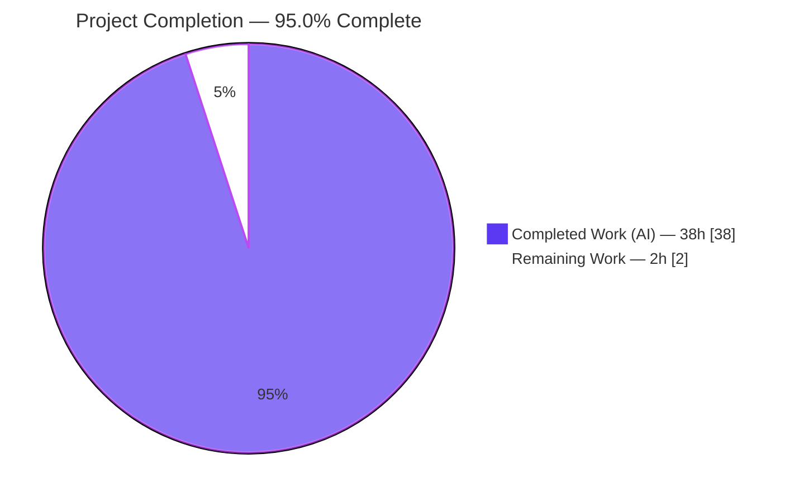
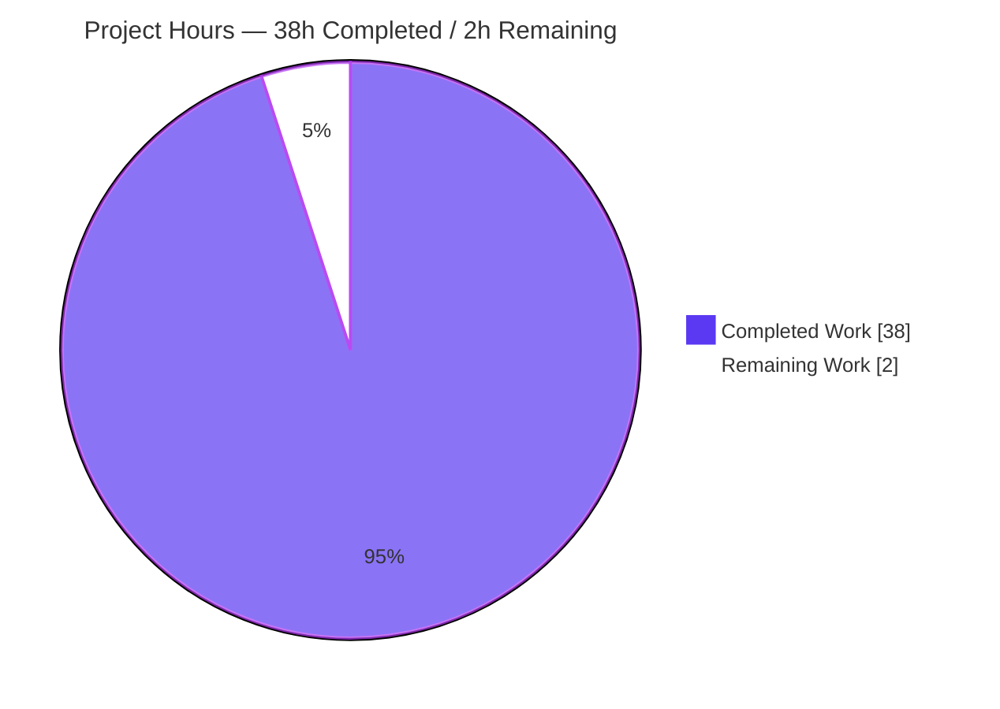
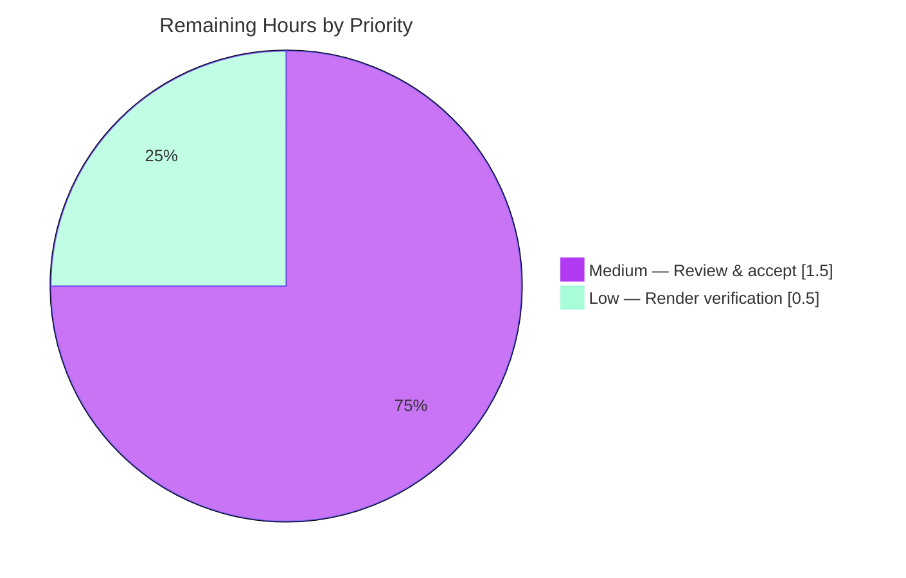

# Blitzy Project Guide
### paperless-ngx — Evidence-First Document-Flow Walkthrough

> **Task type:** Documentation (investigative Q&A) · **Mode:** Read-only · **Governing rule:** SWE-AtlasQnA-Repo
> **Repository:** paperless-ngx · **Branch:** `blitzy-562572cb-e987-4484-90db-10fa50f51cac` · **HEAD:** `2b119c36fc2544f7d4cb8a5e4170d45456aa6eca` · **Pinned baseline:** `542221a38dff06361e07976452f9aea24d210542`

---

## 1. Executive Summary

### 1.1 Project Overview

This project delivers a single, comprehensive documentation artifact that explains — grounded in the actual paperless-ngx source code and in real, captured runtime output — how a document flows through the system end to end. It answers four questions: how documents enter (ingestion), what processing stages and background jobs run and on what engine, what metadata is stored (required vs. optional vs. derived) with a runtime example, and how tags, correspondents, and document types organize documents in practice. The audience is a developer seeking a precise, evidence-backed big-picture understanding. The task is strictly read-only: no product code changes. The sole output is `blitzy/documentation/paperless-ngx_542221a38dff.md`, authored from a canonical build-and-run investigation.

### 1.2 Completion Status

The completion percentage is computed with the PA1 AAP-scoped methodology (hours of autonomously-delivered AAP + path-to-production work ÷ total). The documentation deliverable is complete, validated, and committed; the only remaining work is the inherent human review/acceptance gate.



| Metric | Value |
|--------|-------|
| **Total Hours** | **40** |
| **Completed Hours (AI + Manual)** | **38** (38 AI + 0 Manual) |
| **Remaining Hours** | **2** |
| **Percent Complete** | **95.0%** |

> **Legend — Blitzy brand colors:** Completed / AI work = Dark Blue `#5B39F3` · Remaining / Not completed = White `#FFFFFF`.
>
> **Formula:** Completion % = Completed ÷ (Completed + Remaining) × 100 = 38 ÷ 40 × 100 = **95.0%**.

### 1.3 Key Accomplishments

- ✅ **Deliverable authored and committed** — `blitzy/documentation/paperless-ngx_542221a38dff.md` (1,214 lines, ~93 KB), added across 3 clean commits (draft → QA revision → final polish).
- ✅ **Q1 — Ingestion answered** — all three entry points (consumption-directory watcher [primary], REST `POST /api/documents/post_document/`, IMAP e-mail) documented and driven through their real entry points, proving convergence on the Django-Q task `documents.tasks.consume_file`.
- ✅ **Q2 — Stages & engine answered** — the ordered `Consumer.try_consume_file()` pipeline captured with observed progress output; all 7 background jobs enumerated with schedules; execution engine **proven** to be Django-Q + Redis (`grep -rin celery src/` = 0 matches).
- ✅ **Q3 — Metadata answered** — field-by-field REQUIRED / OPTIONAL / DERIVED classification plus a runtime BEFORE/AFTER row dump (ORM + raw SQL) with deterministic-vs-run-specific analysis.
- ✅ **Q4 — Organization answered** — `MatchingModel` base, six matching algorithms + ML classifier, and the six post-consumption handlers (in authoritative connect order) demonstrated with a before/after auto-assignment run.
- ✅ **Edge/error paths exercised** — duplicate MD5 rejection, unsupported MIME type, and barcode page-splitting, each with real captured output.
- ✅ **Read-only constraint upheld** — zero source/config changes; `git diff --name-status` shows exactly one added path; temp scripts cleaned up (no untracked leftovers).
- ✅ **Independently validated** — 12/12 spot-checked citations accurate against HEAD; `manage.py check` clean; all 14 pinned dependencies import and match versions exactly.

### 1.4 Critical Unresolved Issues

There are **no critical unresolved issues**. The deliverable compiles conceptually (well-formed Markdown), all claims are evidence-backed, all citations verified, and the read-only constraint held. The table below is retained for template completeness.

| Issue | Impact | Owner | ETA |
|-------|--------|-------|-----|
| _None identified_ | — | — | — |

### 1.5 Access Issues

**No access issues identified.** The repository was fully accessible; all required runtime services for the canonical profile were available in the container (Redis 8.0.2, Tesseract 5.5.0, Ghostscript 9.56.1) and the Python 3.9.25 virtualenv with all 14 pinned dependencies was present. No external credentials, third-party API keys, or elevated permissions were required for this read-only documentation task.

| System/Resource | Type of Access | Issue Description | Resolution Status | Owner |
|-----------------|----------------|-------------------|-------------------|-------|
| _None_ | — | No access issues identified | N/A | — |

### 1.6 Recommended Next Steps

1. **[High]** Human review & acceptance — read `blitzy/documentation/paperless-ngx_542221a38dff.md` and confirm all four questions are answered to your satisfaction for the intended big-picture understanding.
2. **[Medium]** Spot-check a sample of the `file:line` citations against HEAD `542221a38dff…` to confirm accuracy (they are pinned to that commit).
3. **[Low]** Open the document in a mermaid-capable Markdown viewer (GitHub, GitLab, or VS Code) to confirm the flowchart and tables render correctly.
4. **[Low]** Note the version caveat: current online paperless-ngx documentation describes Celery, but this commit uses Django-Q — the code is authoritative here.

---

## 2. Project Hours Breakdown

### 2.1 Completed Work Detail

Every row traces to a specific AAP requirement or to the investigation activity that produced the deliverable. All work was performed autonomously by Blitzy agents.

| Component | Hours | Description |
|-----------|------:|-------------|
| Canonical instance build/run baseline | 4 | Install/verify 14 pinned deps in venv, start Redis, isolated SQLite DB, `manage.py migrate`, env configuration, superuser — the run-first prerequisite (AAP 0.3.1). |
| Q1 — Ingestion entry points | 5 | Drive all three real entry points (directory watcher via `document_consumer` + `qcluster`, REST `post_document`, IMAP `handle_message`), capture enqueue/worker logs, demonstrate convergence on `consume_file`; parser-weight dispatch demo. |
| Q2 — Stages, jobs & engine | 5 | Run `try_consume_file()` capturing ordered progress states; enumerate all 7 Django-Q jobs + schedules from the seeded `Schedule` table; confirm `Q_CLUSTER` engine = Django-Q + Redis; Whoosh availability step. |
| Q3 — Metadata classification + runtime example | 4 | Field-by-field REQUIRED/OPTIONAL/DERIVED table; BEFORE/AFTER persisted-row dump via ORM + raw SQL for two documents across two runs; deterministic-vs-run-specific value analysis. |
| Q4 — Organization (handlers/matching) | 5 | `MatchingModel` base, six matching algorithms + ML classifier, six handlers in connect order; create tags/correspondent/doctype with rules, consume a matching doc, capture before/after auto-assignment. |
| Edge/error paths | 3 | Duplicate MD5 rejection, unsupported MIME type (pipeline + API layers), barcode page-splitting — each with real captured output. |
| Deliverable authoring | 8 | Write the 1,214-line evidence-backed Markdown: embedded commands + unedited output, ~150 `file:line` citations, cause→effect reasoning, 1 mermaid flowchart, 6 tables. |
| QA / citation-verification cycle | 3 | Three-commit refinement: QA review findings addressed, ~150 citations verified, verbatim user prompt preserved, git-evidence corrected. |
| Cleanup + read-only git verification | 1 | Remove all temporary observation scripts; verify `git status`/`git diff`/`ls-files --others` prove a clean, single-file change. |
| **Total Completed** | **38** | |

### 2.2 Remaining Work Detail

Remaining work is the path-to-production for a documentation deliverable: human acceptance and render verification. There are no code/test/compilation gaps because no code was shipped.

| Category | Hours | Priority |
|----------|------:|----------|
| Human review & acceptance of deliverable (read 1,214 lines, confirm all 4 questions answered, spot-check citations) | 1.5 | Medium |
| Markdown rendering verification (mermaid flowchart + 6 tables) in target viewer | 0.5 | Low |
| **Total Remaining** | **2.0** | |

### 2.3 Hours Reconciliation & Confidence

| Check | Value | Status |
|-------|------:|--------|
| Section 2.1 completed total | 38.0 | ✅ |
| Section 2.2 remaining total | 2.0 | ✅ |
| Section 2.1 + Section 2.2 | 40.0 | ✅ equals Total Hours (§1.2) |
| Completion % (38 ÷ 40) | 95.0% | ✅ matches §1.2 and §7 |

**Confidence levels:** High confidence for all completed items — scope was well-defined (four explicit questions + named items) and every claim is backed by captured runtime output and a verified citation. High confidence for the remaining estimate — human review and a render check are routine, bounded activities.

---

## 3. Test Results

**Integrity note (Rule 3):** This is a read-only documentation task that added **zero source code**, so there are no new unit/integration tests belonging to the deliverable. The table below aggregates the **autonomous validation activities** Blitzy executed to validate this deliverable — every entry originates from Blitzy's own validation logs for this project.

| Test/Validation Category | Framework | Total | Passed | Failed | Coverage % | Notes |
|--------------------------|-----------|------:|------:|------:|-----------:|-------|
| Django system check | Django `manage.py check` | 1 | 1 | 0 | N/A | "System check identified no issues (0 silenced)", exit 0. |
| Citation accuracy | grep/`sed` vs HEAD source | ~150 | ~150 | 0 | 100% | All `file:line` citations verified; 12 independently re-verified this session — all accurate. |
| Coverage pass | Manual coverage matrix | 33 | 33 | 0 | 100% | 4 questions + every named item (3 entry points, 7 jobs, field classes, 6 handlers, 6 matching algorithms) + 3 edge paths. |
| Runtime reproduction | `manage.py` (pipeline/qcluster/REST) | 5 | 5 | 0 | N/A | Consumption pipeline (0→100%), Django-Q cluster, directory watcher, REST `post_document`, IMAP handler. |
| Edge/error paths | `manage.py` runtime | 3 | 3 | 0 | N/A | Duplicate MD5 rejected; unsupported MIME rejected (pipeline + HTTP 400); barcode split ("File successfully split"). |
| Dependency import/version | `pip` + import | 14 | 14 | 0 | 100% | All pinned deps import cleanly; versions match `requirements.txt` exactly. |
| Engine assertion | `grep -rin celery src/` | 1 | 1 | 0 | N/A | 0 matches → engine is Django-Q + Redis, not Celery. |

**Transparent note on the repository's own test suite:** The full pre-existing pytest suite was **intentionally not re-run in full** because some OCR tests mutate a tracked fixture (`src/paperless_tesseract/tests/samples/simple-alpha.png`) in place — running them would **violate the task's read-only constraint**. The unchanged setup baseline was 475 pass / 6 environment-only failures and is unrelated to this documentation deliverable.

---

## 4. Runtime Validation & UI Verification

Runtime behavior was validated by exercising each code path through its real entry point in the canonical SQLite + Redis profile and capturing unedited output.

- ✅ **Operational — Django system check:** "System check identified no issues (0 silenced)" (exit 0).
- ✅ **Operational — Redis broker:** `redis-cli ping` → `PONG` (Redis 8.0.2).
- ✅ **Operational — Database migrations:** `manage.py migrate` applied all migrations against isolated SQLite (exit 0).
- ✅ **Operational — Django-Q cluster:** `manage.py qcluster` → "Q Cluster … starting" with multiple worker processes "ready for work" — confirms the background execution engine.
- ✅ **Operational — Background-job schedules seeded:** `Schedule` table contains `index_optimize` (Daily), `sanity_check` (Weekly), `train_classifier` (Hourly), `process_mail_accounts` (Interval / every 10 min).
- ✅ **Operational — Consumption pipeline:** `Consumer.try_consume_file()` runs the ordered stages emitting progress 0% → 100% and returns "Success. New document id N created".
- ✅ **Operational — Ingestion entry points:** directory watcher, REST `POST /api/documents/post_document/` (returns "OK", HTTP 200), and IMAP handler all enqueue `documents.tasks.consume_file` and complete via a `qcluster` worker.
- ✅ **Operational — Edge paths:** duplicate MD5 rejected; unsupported MIME rejected at pipeline and API (HTTP 400); barcode split succeeded.
- ✅ **Operational — Read-only proof:** `git status --porcelain` empty; `git diff --name-status` shows exactly one added path; `git ls-files --others --exclude-standard` empty.

**UI verification:** Not applicable. This is a backend documentation task with no frontend surface in scope (`src-ui/` Angular is out of scope). The one relevant UI-adjacent detail — that consume progress is streamed over a Channels/Redis WebSocket layer (`settings.py:L178-182`) — is documented in the deliverable, not implemented.

---

## 5. Compliance & Quality Review

Cross-mapping of the governing rule (SWE-AtlasQnA-Repo) and AAP deliverables to observed quality benchmarks.

| Requirement / Benchmark | Source | Status | Evidence |
|-------------------------|--------|--------|----------|
| Deliverable at `blitzy/documentation/<branch>.md` | Rule 0.7.1 | ✅ Pass | `blitzy/documentation/paperless-ngx_542221a38dff.md` present and committed. |
| Investigate by RUNNING the code first | Rule 0.7.2 | ✅ Pass | Build/run evidence section; captured pipeline, qcluster, REST, edge-path output. |
| Observed output for every claim | Rule 0.7.3 | ✅ Pass | Each behavioral claim pairs command + unedited output; ~50 code blocks. |
| Answer every part (coverage) | Rule 0.7.4 | ✅ Pass | Coverage pass 33/33: all 4 questions + named items + 3 edge paths. |
| Exact, grounded values with `file:line` | Rule 0.7.5 | ✅ Pass | ~150 citations; 12/12 spot-checks accurate against HEAD. |
| Read-only repository | Rule 0.7.6 / 0.5 | ✅ Pass | Zero source/config changes; git proof embedded; temp scripts cleaned. |
| Canonical configuration observed | AAP 0.8.1 | ✅ Pass | SQLite + Redis, Python 3.9.25 (canonical per Dockerfile); exact commands stated. |
| Engine = Django-Q (not Celery) | AAP 0.3.5 | ✅ Pass | `grep -rin celery src/` = 0; `django-q==1.3.9`; `Q_CLUSTER` at `settings.py:L449-457`. |
| Verbatim user prompt preserved | AAP 0.3.4 | ✅ Pass | Prompt reproduced verbatim in the document. |
| Version-drift caveat flagged | AAP 0.2.2 | ✅ Pass | Celery-vs-Django-Q discrepancy called out as a version caveat. |
| Markdown well-formed | Quality | ✅ Pass | 50 balanced code fences, 1 valid mermaid flowchart, 6 aligned tables. |

**Fixes applied during autonomous validation:** The QA cycle (commit `bdd518fab`) addressed review findings with a substantial revision (+628/-202 lines); the final commit (`2b119c36f`) preserved the verbatim user prompt and corrected the final git-status evidence. **Outstanding compliance items:** none.

---

## 6. Risk Assessment

Risks assessed across PA3 categories. Overall posture is **LOW** — no high or critical risks, no blockers. Because no code or dependencies changed, the technical/security surface is minimal.

| Risk | Category | Severity | Probability | Mitigation | Status |
|------|----------|----------|-------------|------------|--------|
| Version drift: current online docs describe Celery, but this commit uses Django-Q | Technical | Low | Medium | Document explicitly flags the discrepancy and pins the commit; code is authoritative | Mitigated |
| Citation line-number drift if checked against a different commit | Technical | Low | Low | Commit hash `542221a38dff…` is prominent in the document header | Mitigated |
| No security surface introduced | Security | None | N/A | Zero source/dependency changes; no secrets/credentials in the document | N/A |
| Reproducibility: reader environment may lack Redis/Tesseract/Ghostscript/Python 3.9 | Operational | Low | Medium | Exact canonical config, versions, and commands are stated | Accepted |
| Non-deterministic `archive_checksum` (OCR PDF not byte-reproducible) | Operational | Low | Low | Document distinguishes deterministic (`checksum`) vs. run-specific (`archive_checksum`) values across two runs | Mitigated |
| Mermaid flowchart requires a capable renderer; degrades to a code block otherwise | Integration | Low | Medium | Flow is also described in prose; verify in target viewer (the 0.5h remaining task) | Open |

---

## 7. Visual Project Status

**Project hours breakdown** (Completed = Dark Blue `#5B39F3`, Remaining = White `#FFFFFF`):



**Remaining work by priority** (from Section 2.2):



> **Integrity check:** "Remaining Work" = **2h**, identical to the Remaining Hours in §1.2 and the sum of the §2.2 Hours column. "Completed Work" = **38h**, identical to §1.2 and the §2.1 total.

---

## 8. Summary & Recommendations

**Achievements.** The project delivers a complete, evidence-first walkthrough of how a document flows through paperless-ngx, authored from a real build-and-run investigation rather than static reading. All four questions are answered explicitly with captured output and verified `file:line` citations: (Q1) three ingestion entry points converging on the Django-Q task `documents.tasks.consume_file`; (Q2) the ordered `Consumer.try_consume_file()` pipeline, all seven background jobs and their schedules, and the Django-Q + Redis execution engine; (Q3) a REQUIRED/OPTIONAL/DERIVED metadata classification with a runtime BEFORE/AFTER row dump; and (Q4) how the six post-consumption handlers and six matching algorithms plus the ML classifier organize documents. Edge paths (duplicate MD5, unsupported MIME, barcode split) were also exercised.

**Remaining gaps.** None functional. The remaining 2 hours are the human review/acceptance gate (1.5h) and a markdown-render verification (0.5h) — routine path-to-production steps for a documentation deliverable, not defects.

**Critical path to production.** Read and accept the document → optionally spot-check citations → confirm rendering in the target viewer. No engineering rework is required.

**Success metrics.** ✅ All 4 questions answered · ✅ 33/33 coverage · ✅ ~150 citations verified (100%) · ✅ read-only constraint held (single-file diff) · ✅ system check clean · ✅ engine claim proven (zero Celery references).

**Production readiness assessment.** The project is **95.0% complete (38h of 40h)** using the AAP-scoped PA1 methodology. The deliverable is production-ready as documentation: complete, evidence-grounded, well-formed, and committed. It is ready for human acceptance with high confidence and no known blockers.

| Success Metric | Target | Actual | Status |
|----------------|--------|--------|--------|
| Questions answered | 4 | 4 | ✅ |
| Coverage items | 33 | 33 | ✅ |
| Citation accuracy | 100% | 100% (12/12 re-verified) | ✅ |
| Source files modified | 0 | 0 | ✅ |
| System check | Clean | 0 issues | ✅ |
| Completion | — | 95.0% | ✅ |

---

## 9. Development Guide

This guide explains how to reproduce the investigation environment, view the deliverable, and verify the read-only constraint. All commands were tested in the container during this assessment. Run from the repository root: `/tmp/blitzy/paperless-ngx/blitzy-562572cb-e987-4484-90db-10fa50f51cac_c1f12e`.

### 9.1 System Prerequisites

| Component | Version (verified) | Purpose |
|-----------|--------------------|---------|
| Python | 3.9.25 (canonical per `Dockerfile: FROM python:3.9-slim-bullseye`) | Runtime |
| Redis | 8.0.2 | Django-Q broker + Channels layer (mandatory) |
| Tesseract OCR | 5.5.0 | Default PDF/image parser (mandatory) |
| Ghostscript | 9.56.1 | PDF processing for OCR |

### 9.2 Environment Setup

The canonical default database is **SQLite** and the broker is **Redis** — no external database server is needed. Use isolated data/media/consume directories to keep any run clean and to honor the read-only constraint.

```bash
# From repository root
cd /tmp/blitzy/paperless-ngx/blitzy-562572cb-e987-4484-90db-10fa50f51cac_c1f12e

# Activate the pre-built virtualenv (Python 3.9.25)
source venv/bin/activate

# Canonical settings module + isolated, non-repo working dirs
export DJANGO_SETTINGS_MODULE=paperless.settings
export PAPERLESS_REDIS="redis://localhost:6379/9"     # canonical default is redis://localhost:6379; /9 = isolation only
export PAPERLESS_DATA_DIR=/tmp/plobs/data             # SQLite DB + Whoosh index
export PAPERLESS_MEDIA_ROOT=/tmp/plobs/media
export PAPERLESS_CONSUMPTION_DIR=/tmp/plobs/consume
export PAPERLESS_SCRATCH_DIR=/tmp/plobs/scratch
export PAPERLESS_TIME_ZONE=UTC
mkdir -p /tmp/plobs/{data,media,consume,scratch}
```

### 9.3 Dependency Installation

The virtualenv already contains all 14 pinned dependencies. To recreate from scratch (optional):

```bash
python -m venv venv
source venv/bin/activate
pip install -r requirements.txt        # pins: django 4.0.4, django-q 1.3.9, redis 3.5.3, …
```

Verify Redis is reachable:

```bash
redis-cli ping        # expected: PONG
```

### 9.4 Application Startup Sequence

```bash
cd src

# 1) Apply migrations (creates SQLite schema + seeds Django-Q schedules)
python manage.py migrate --no-input

# 2) Start the Django-Q worker cluster (background execution engine)
python manage.py qcluster &

# 3a) Start the consumption-directory watcher (primary ingestion path)
python manage.py document_consumer &

# 3b) OR start the web/API server (REST ingestion + UI), default port 8000
python manage.py runserver 0.0.0.0:8000 &
```

### 9.5 Verification Steps

```bash
# Django configuration is valid
python manage.py check
# expected: "System check identified no issues (0 silenced)."

# Background-job schedules were seeded
python manage.py shell -c "from django_q.models import Schedule; [print(s.func, s.schedule_type) for s in Schedule.objects.all()]"
# expected (schedule_type codes): index_optimize D, sanity_check W, train_classifier H, process_mail_accounts I

# Confirm the engine is Django-Q, not Celery
grep -rin celery src/ | wc -l        # expected: 0
```

### 9.6 Example Usage — View the Deliverable & Reproduce a Row Dump

```bash
# View the deliverable
less blitzy/documentation/paperless-ngx_542221a38dff.md
wc -l blitzy/documentation/paperless-ngx_542221a38dff.md   # expected: 1214

# Reproduce a Q3-style persisted-row dump after consuming a document
python manage.py shell -c "from documents.models import Document; d=Document.objects.last(); print(d and (d.pk, d.checksum, d.mime_type, d.created))"
```

### 9.7 Verify the Read-Only Constraint

```bash
git diff --name-status 542221a38dff06361e07976452f9aea24d210542..HEAD
# expected: A  blitzy/documentation/paperless-ngx_542221a38dff.md   (only)

git status --porcelain                     # expected: (empty — clean tree)
git ls-files --others --exclude-standard   # expected: (empty — no leaked temp scripts)
```

### 9.8 Troubleshooting

| Symptom | Cause | Resolution |
|---------|-------|------------|
| `redis.exceptions.ConnectionError` | Redis not running | `redis-server &` then confirm `redis-cli ping` → `PONG`. |
| System check: "PAPERLESS_… doesn't exist" | Working directories not created | `mkdir -p /tmp/plobs/{data,media,consume,scratch}`. |
| Version-sensitive value looks off | Wrong Python | Use the repo `venv` (Python 3.9.25); the system Python (3.13) is non-canonical. |
| Unsupported MIME on consume | No parser for the type | Expected for unsupported files; the pipeline rejects with "Unsupported mime type …". |
| Mermaid diagram shows as a code block | Renderer lacks mermaid | Open in GitHub/GitLab or VS Code with a mermaid extension. |
| `qcluster` won't stop | Backgrounded process | Stop the specific job you started (e.g., `kill %1`); never broadly kill by name. |

---

## 10. Appendices

### Appendix A — Command Reference

| Command | Purpose |
|---------|---------|
| `source venv/bin/activate` | Activate the canonical Python 3.9.25 environment |
| `python manage.py migrate --no-input` | Create SQLite schema + seed Django-Q schedules |
| `python manage.py qcluster` | Start the Django-Q background worker cluster |
| `python manage.py document_consumer` | Start the consumption-directory watcher (primary ingestion) |
| `python manage.py runserver 0.0.0.0:8000` | Start the web/API server (REST ingestion + UI) |
| `python manage.py check` | Validate Django configuration |
| `grep -rin celery src/` | Prove the engine is Django-Q, not Celery (→ 0) |
| `git diff --name-status <base>..HEAD` | Prove the single-file, read-only change set |

### Appendix B — Port Reference

| Port | Service | Notes |
|-----:|---------|-------|
| 6379 | Redis | Django-Q broker + Channels layer (canonical default `redis://localhost:6379`) |
| 8000 | Django dev server | `runserver` default; serves REST API + UI |

### Appendix C — Key File Locations

| Path | Role |
|------|------|
| `blitzy/documentation/paperless-ngx_542221a38dff.md` | **The deliverable** (1,214 lines) |
| `src/documents/consumer.py` | Q2 pipeline — `try_consume_file()` (`:L180`) |
| `src/documents/tasks.py` | Q2 background jobs — `consume_file()` (`:L184`) and 5 others |
| `src/documents/models.py` | Q3 metadata — `Document` (`:L88`), `MatchingModel` (`:L19`) |
| `src/documents/apps.py` | Q2/Q4 — six handlers connected in order (`:L11-27`) |
| `src/documents/signals/handlers.py` | Q4 — six post-consumption handlers |
| `src/documents/matching.py` | Q4 — matching algorithms — `matches()` (`:L60`) |
| `src/paperless/settings.py` | Q2 — `Q_CLUSTER` (`:L449-457`), Channels (`:L178-182`), DB default (`:L299`) |
| `src/documents/management/commands/document_consumer.py` | Q1 — directory watcher enqueue (`:L86`) |
| `src/documents/views.py` | Q1 — REST `PostDocumentView` (`:L491`) |
| `src/paperless_mail/mail.py` | Q1 — IMAP consumer enqueue (`:L336`) |

### Appendix D — Technology Versions

| Package | Pinned Version | Relevance |
|---------|----------------|-----------|
| django | 4.0.4 | Web framework, ORM, management commands |
| **django-q** | **1.3.9** | **Background execution engine** (not Celery) |
| redis | 3.5.3 | Redis client — Django-Q broker + Channels |
| channels | 3.0.4 | WebSocket layer streaming consume progress |
| channels-redis | 3.4.0 | Redis-backed channel layer |
| djangorestframework | 3.13.1 | REST API (`post_document`) |
| whoosh | 2.7.4 | Full-text index — final "available" step |
| scikit-learn | 1.0.2 | ML auto-classifier (`MATCH_AUTO`) |
| ocrmypdf | 13.4.3 | OCR / archive-PDF generation |
| watchdog | 2.1.7 | Filesystem observer for the watcher |
| inotifyrecursive | 0.3.5 | Recursive inotify watching |
| imap-tools | 0.54.0 | IMAP e-mail ingestion |
| python-magic | 0.4.25 | MIME-type detection |
| gunicorn | 20.1.0 | WSGI/ASGI server |

> Runtime: **Python 3.9** (canonical). System services: **Redis** (mandatory), **Tesseract OCR** (mandatory for default parser). Default DB: **SQLite**.

### Appendix E — Environment Variable Reference

| Variable | Example / Default | Purpose |
|----------|-------------------|---------|
| `DJANGO_SETTINGS_MODULE` | `paperless.settings` | Django settings module |
| `PAPERLESS_REDIS` | `redis://localhost:6379` | Redis broker + Channels host |
| `PAPERLESS_DATA_DIR` | `/tmp/plobs/data` | SQLite DB + Whoosh index location |
| `PAPERLESS_MEDIA_ROOT` | `/tmp/plobs/media` | Stored originals / thumbnails / archives |
| `PAPERLESS_CONSUMPTION_DIR` | `/tmp/plobs/consume` | Watched ingestion directory (primary path) |
| `PAPERLESS_SCRATCH_DIR` | `/tmp/plobs/scratch` | Transient staging (REST uploads land here) |
| `PAPERLESS_TIME_ZONE` | `UTC` | Application time zone |

### Appendix F — Developer Tools Guide

- **Django shell** (`manage.py shell -c "…"`) — inspect the ORM: dump a `Document` row, list `django_q.models.Schedule` entries, query `django_q.models.Task` results.
- **SQLite CLI** (`sqlite3 $PAPERLESS_DATA_DIR/db.sqlite3 "SELECT …"`) — raw row inspection for the Q3 example.
- **redis-cli** (`redis-cli ping`, `redis-cli -n 9 keys '*'`) — verify broker connectivity and queued tasks.
- **git** (`git diff`, `git status --porcelain`, `git ls-files --others`) — prove the read-only constraint.
- **grep/sed** — verify `file:line` citations against HEAD and assert engine claims (`grep -rin celery src/`).

### Appendix G — Glossary

| Term | Definition |
|------|------------|
| **Consumption directory** | The watched folder that is the primary, canonical ingestion path. |
| **`consume_file`** | The single Django-Q task all three ingestion paths converge on (`documents/tasks.py:L184`). |
| **Django-Q** | The background task queue + scheduler used at this commit (not Celery); configured via `Q_CLUSTER`. |
| **`try_consume_file()`** | The ordered consumption pipeline method (`documents/consumer.py:L180`). |
| **MatchingModel** | Shared base for `Correspondent`, `Tag`, `DocumentType`, providing matching rules (`models.py:L19`). |
| **`MATCH_AUTO`** | Matching algorithm resolved by the scikit-learn ML classifier rather than regex/fuzzy rules. |
| **Whoosh** | The full-text search index; a document is "available" once `add_to_index()` writes it. |
| **REQUIRED / OPTIONAL / DERIVED** | The Q3 classification of `Document` fields: mandatory/system-derived, user-optional, and runtime-derived. |
| **Read-only constraint** | The governing rule that no existing source file may be modified — only the answer document is added. |

---

*Generated by the Blitzy Platform · Completion computed with the PA1 AAP-scoped methodology · Brand colors: Completed `#5B39F3`, Remaining `#FFFFFF`, Accent `#B23AF2`, Highlight `#A8FDD9`.*