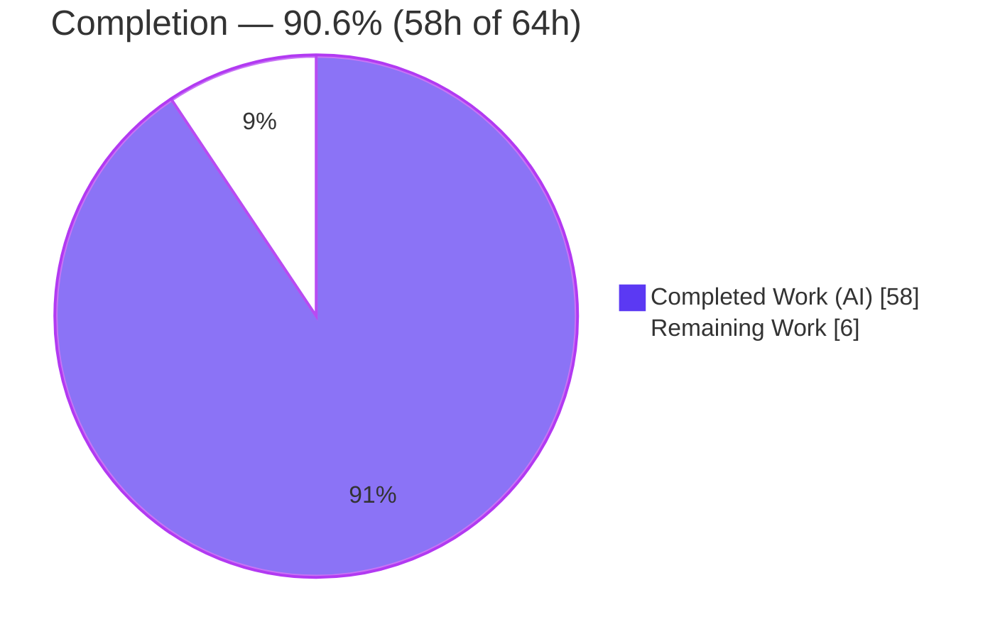
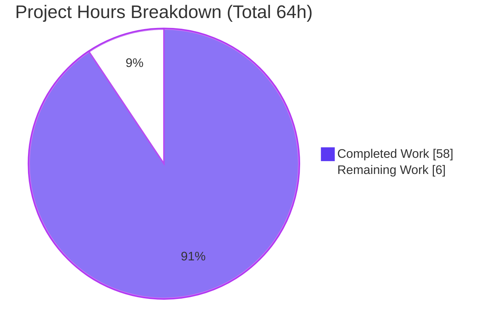
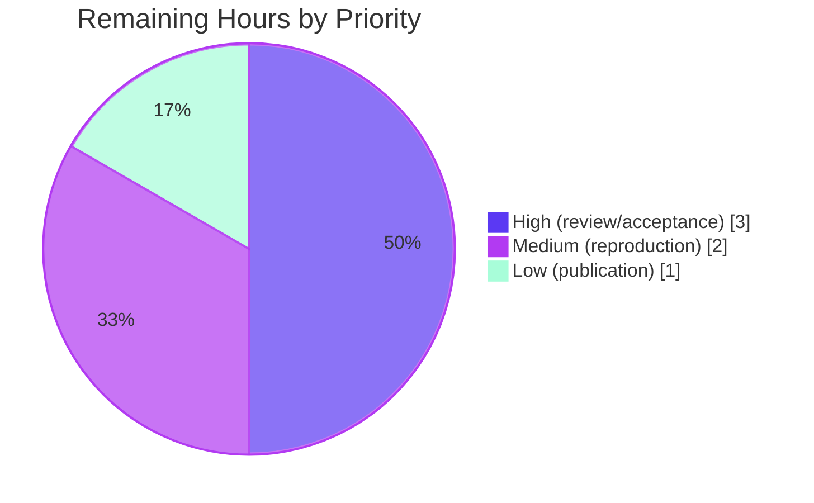

# Blitzy Project Guide — paperless-ngx ML + OCR Pipeline Runtime Investigation

> **Deliverable branch:** `blitzy-be1effe9-f4e7-4a8e-a3a8-33c507232b12`
> **Source commit under investigation (immutable):** `542221a38dff06361e07976452f9aea24d210542`
> **HEAD:** `925082048fbe205306a26d0aac690698e97eab2a`
> **Brand color legend:** Completed / AI Work = Dark Blue `#5B39F3` · Remaining / Not Completed = White `#FFFFFF` · Headings / Accents = Violet-Black `#B23AF2` · Highlight = Mint `#A8FDD9`

---

## 1. Executive Summary

### 1.1 Project Overview

This is a **read-only investigation and documentation** project against the paperless-ngx codebase. It produces a single, evidence-backed answer document that explains — from **directly observed runtime behavior** — how the machine-learning + OCR document-processing pipeline behaves during automated test execution, in order to diagnose reported **non-deterministic document-classification test failures**. Four questions are answered independently (classifier reuse vs. retrain; automatic correspondent matching; the no-extractable-text OCR edge case; and barcode-based splitting). The target consumers are engineers debugging flaky backend tests. The source tree is treated as immutable; the only artifact created is `blitzy/documentation/paperless-ngx_542221a38dff.md`.

### 1.2 Completion Status



| Metric | Value |
|--------|-------|
| **Total Hours** | **64** |
| **Completed Hours (AI + Manual)** | **58** (58 AI + 0 Manual) |
| **Remaining Hours** | **6** |
| **Completion** | **90.6%** |

> Completion is computed with the AAP-scoped hours methodology: `58 / (58 + 6) = 90.6%`. All remaining hours are path-to-production **human** activities (technical review/acceptance); there is no outstanding autonomous engineering work.

### 1.3 Key Accomplishments

- ✅ **Single-file deliverable produced at the mandated path** — `blitzy/documentation/paperless-ngx_542221a38dff.md` (2,039 lines, 98 unique `file:line` citations).
- ✅ **Q1 answered** — classifier **reuses** the persisted model on an unchanged SHA-1 data digest (`train()` → `False`) and **retrains** on change (`train()` → `True`); cross-test `MODEL_FILE` leakage characterized.
- ✅ **Q2 answered** — **3 documents created / 2 trained** (one inbox-tagged doc excluded); training runs **after** inserts; acceptance is purely **class id != -1** with **no probabilistic threshold**.
- ✅ **Q3 answered** — OCRmyPDF (`ocrmypdf.ocr`) primary `skip_text` → `NoTextFoundException` → **force-OCR fallback**, driving Tesseract/unpaper/Ghostscript; stored MIME = **`image/png`** via libmagic.
- ✅ **Q4 answered** — output **segments = separators + 1** (records can be fewer, incl. 0); trigger value **`PATCHT`** symbology-agnostic (Code 39 / Code 128 / QR); decision at `tasks.py:L108-L109`; training-eligible rows grow **0 → 1 → 3**.
- ✅ **Determinism investigated honestly** — the reported flakiness did **not** reproduce (stable `77 passed, 1 skipped` across 5 parallel + 3 serial identical runs); the shared-`MODEL_FILE` leakage **mechanism** is demonstrated and the root-cause leap is labeled **(inferred)**.
- ✅ **Read-only invariant proven** — source tree byte-for-byte unchanged; all 6 temporary probe scripts removed; committed on the correct branch.
- ✅ **Independently validated** — every runtime claim reproduced by the Final Validator with **zero discrepancies**.

### 1.4 Critical Unresolved Issues

| Issue | Impact | Owner | ETA |
|-------|--------|-------|-----|
| _None blocking._ All AAP-specified deliverables are complete, validated with zero discrepancies, and committed. | No release/validation blocker exists. | — | — |
| **Advisory (not blocking):** the reported non-deterministic classification failures did not reproduce in the exercised modules; the xdist + shared-`MODEL_FILE` root cause is **(inferred)**. | A human relying on the hypothesis to remediate flakiness should first reproduce the actual failing scenario in the **full** suite. | Backend/QA reviewer | Within HT-1 review (3h) |

### 1.5 Access Issues

**No access issues identified.** The agent had full read access to the paperless-ngx source at commit `542221a38dff` and write access to the destination `blitzy/documentation/` directory. The read-only source invariant was maintained throughout.

| System/Resource | Type of Access | Issue Description | Resolution Status | Owner |
|-----------------|----------------|-------------------|-------------------|-------|
| paperless-ngx source (`/app`, commit `542221a38dff`) | Read | None | ✅ No issue | — |
| Destination repo `blitzy/documentation/` | Write | None | ✅ No issue | — |
| Canonical container (`paperless-canon`, `ghcr.io/scaleapi/swe-atlas`) | Execute | None during investigation | ✅ No issue | — |

### 1.6 Recommended Next Steps

1. **[High]** Perform SME/domain-expert technical review and acceptance of the four answers (Q1–Q4), with special scrutiny of the Q1 cross-test effect and the pytest-xdist determinism hypothesis. _(HT-1, 3h)_
2. **[Medium]** Run an independent reproduction spot-check of a representative subset of the embedded probes/tests in the canonical container. _(HT-2, 2h)_
3. **[Low]** Publish and hand off the accepted document to the flaky-test debugging effort; optionally open a follow-up ticket to reproduce the actual failing scenario in the full suite. _(HT-3, 1h)_

---

## 2. Project Hours Breakdown

### 2.1 Completed Work Detail

| Component | Hours | Description |
|-----------|------:|-------------|
| Canonical environment setup & verification | 5 | Bring up container `paperless-canon`; verify Python 3.9.23, all pinned Python deps importable, and all OCR/PDF system binaries; establish canonical `python3 -m pytest` invocation, non-root `testuser` + `HOME=0700` GnuPG nuance, and probe discipline. |
| Q1 — Classifier reuse vs. retrain investigation & answer | 7 | Analyze `DocumentClassifier.train()` SHA-1 short-circuit and `train_classifier()` wrapper; probe `train()` across ≥2 identical runs; observe `MODEL_FILE` mtime, boolean return, and "Training data unchanged." log; characterize cross-test `MODEL_FILE` leakage vs. `DirectoriesMixin`. |
| Q2 — Automatic correspondent matching investigation & answer | 6 | Count training docs (3 created / 2 trained via inbox exclusion); confirm training runs after inserts; establish acceptance rule (`class id != -1`) and prove the **absence** of a probabilistic threshold (ruling out the `>=90` rule-based fuzzy matcher). |
| Q3 — No-extractable-text OCR subprocess + MIME investigation & answer | 7 | Trace the OCRmyPDF `skip_text` → `NoTextFoundException` → `force_ocr` fallback chain; capture spawned subprocesses; determine stored `Document.mime_type` = `image/png` via libmagic; handle the in-place fixture-mutation read-only hazard with scratch copies + checksums. |
| Q4 — Barcode-splitting investigation & answer | 9 | Enumerate every condition (single/multi-separator, readable/unreadable, custom values, Code 39/128/QR, first-page `[0]` boundary); establish segments = separators+1, record counts, trigger value `PATCHT`, decision site, and the downstream training-data change. |
| pytest-xdist determinism reproduction & hypothesis | 5 | Execute 5 parallel + 3 serial identical runs of the 3 classification modules; demonstrate the shared-`MODEL_FILE` leakage mechanism; report non-reproduction honestly and label the root-cause leap (inferred). |
| Answer-document authoring | 12 | Author the 2,039-line document: direct-answer leads, per-sub-part coverage, 98 `file:line` citations, embedded probe sources, verbatim command output, methodology section, and read-only invariant appendix. |
| Read-only invariant verification & temp-script cleanup | 2 | Delete 6 probe scripts + runtime artifacts; verify `git status`; checksum all source modules; prove the no-text fixture is byte-identical to HEAD. |
| Validation & review-remediation cycles | 5 | Iterate across 4 commits (add → code-review remediation → QA findings → finalize); independently reproduce every runtime claim. |
| **Total Completed** | **58** | |

### 2.2 Remaining Work Detail

| Category | Hours | Priority |
|----------|------:|----------|
| SME/domain-expert technical review & acceptance of the four answers (Q1–Q4) | 3 | High |
| Independent reproduction spot-check in the canonical container | 2 | Medium |
| Publication & handoff to the test-flakiness debugging workflow | 1 | Low |
| **Total Remaining** | **6** | |

### 2.3 Hours Reconciliation

| Check | Calculation | Result |
|-------|-------------|--------|
| Section 2.1 completed total | sum of 9 rows | **58h** |
| Section 2.2 remaining total | sum of 3 rows | **6h** |
| Total project hours (Rule 2) | 58 + 6 | **64h** |
| Completion percentage | 58 / 64 × 100 | **90.6%** |
| Remaining-hours consistency (Rule 1) | §1.2 = §2.2 = §7 | **6h everywhere** |

---

## 3. Test Results

All tests below originate from **Blitzy's autonomous validation logs** for this project, executed through the canonical entry point inside the container (`python3 -m pytest`, equivalent to the CI `pipenv run pytest`). Framework: **pytest 8.4.2** with **pytest-django 4.11.1** and **pytest-xdist 3.8.0**, on **Python 3.9.23** / **Django 4.0.4**.

| Test Category | Framework | Total Tests | Passed | Failed | Coverage % | Notes |
|---------------|-----------|:-----------:|:------:|:------:|:----------:|-------|
| Q1 — Classifier reuse/retrain | pytest + pytest-django | 4 | 4 | 0 | N/A¹ | `test_train_classifier`, `testDatasetHashing`, `testSaveClassifier`, `test_load_and_classify`. |
| Q2 — Automatic correspondent matching | pytest + pytest-django | 4 | 4 | 0 | N/A¹ | `test_correspondent_applied`, `test_correspondent_not_applied`, `test_one_correspondent_predict`, `test_one_correspondent_predict_manydocs`. |
| Q3 — No-text / empty-text OCR parser | pytest + pytest-django | 3 | 3 | 0 | N/A¹ | `test_encrypted`, `test_with_form_error_notext`, `test_skip_noarchive_notext`. |
| Q4 — Barcode splitting family | pytest + pytest-django | 25 | 25 | 0 | N/A¹ | Full `test_tasks.py` barcode/separation/split family (`test_barcode_reader` … `test_separate_pages_no_list`). |
| Determinism-surface integrated run | pytest + pytest-xdist (`-n auto`, 128 workers) | 78² | 77 | 0 | N/A¹ | `test_classifier.py` + `test_tasks.py` + `test_matchables.py` together; **77 passed, 1 skipped**, stable across **5 parallel + 3 serial** identical runs. |

**Aggregate:** 36 targeted canonical tests across Q1–Q4 (all passing), plus a repeated 78-item integrated classification run (77 passed / 1 skipped, **0 failed**, stable across 8 executions).

> ¹ **Coverage %:** Targeted runs deliberately disabled coverage (`-o addopts=""`) for fast, single-process isolation, so a coverage figure was not measured; no coverage number is fabricated. The investigation's objective was behavioral observation, not coverage measurement.
> ² The `78` is the number of collected **test items**; `128` is the number of xdist **workers** (host `nproc`). The single **skipped** item is a pre-existing environment-conditional skip, not a failure.

---

## 4. Runtime Validation & UI Verification

**Runtime health — all four pipeline code paths executed via real canonical entry points (no mocks/stubs/synthetic stand-ins except where explicitly labeled):**

- ✅ **Operational** — Classifier training path (`DocumentClassifier.train()` + `train_classifier()`): reuse/retrain branches both exercised; reuse leaves `MODEL_FILE` mtime unchanged and logs "Training data unchanged."
- ✅ **Operational** — Correspondent prediction path (`predict_correspondent`): acceptance (`class id != -1`) and rejection (`-1` → `None`) both observed.
- ✅ **Operational** — OCR no-text path (`RasterisedDocumentParser.parse()` → `ocrmypdf.ocr` primary + force-OCR fallback): full chain executed; stored MIME `image/png` observed end-to-end via `Consumer.try_consume_file`.
- ✅ **Operational** — Barcode split path (`scan_file_for_separating_barcodes` → `separate_pages` → `consume_file` → `Consumer.try_consume_file` → `train()`): all conditions executed against committed fixtures.
- ⚠ **Partial (by design)** — Determinism reproduction: the reported flakiness did **not** reproduce (stable `77 passed, 1 skipped` across 8 identical runs). The enabling machinery (128-worker xdist + filesystem-backed model) is observed; the root-cause leap is labeled **(inferred)**.
- ⚠ **Environment note (expected)** — During full consumption, ImageMagick `convert` fails on the container's PDF security policy and Ghostscript (`gs`) serves as the observed fallback for thumbnailing.

**UI verification:** ❌ **Not applicable** — this is a backend investigation with no frontend/UI in scope. The Angular frontend and REST API layer are explicitly out of scope per the AAP; no UI artifacts were produced or required.

**API integration outcomes:** Not applicable — no API endpoints were created, modified, or integrated. The consumer signal dispatch (`document_consumption_finished`) was exercised only as an internal code path during Q2/Q3 observation, using an in-memory channel layer.

---

## 5. Compliance & Quality Review

AAP deliverables and the five explicit Rules cross-mapped to Blitzy quality/compliance benchmarks.

| Benchmark / AAP Item | Status | Progress | Notes |
|----------------------|:------:|:--------:|-------|
| **MainRule** — single file at mandated path; read-only source | ✅ Pass | 100% | Only `blitzy/documentation/paperless-ngx_542221a38dff.md` added (+2,039/−0); `git diff … -- src/` empty. |
| **Rule 1** — run-first; ≥2 runs; reproduce (not stabilize) non-determinism; canonical entry points | ✅ Pass | 100% | All answers from observed output; identical inputs repeated; real `python3 -m pytest` paths; non-canonical values labeled. |
| **Rule 2** — exhaustive condition & evidence coverage | ✅ Pass | 100% | Reuse vs. retrain; class id present vs. `-1`; single vs. multi-separator; readable vs. unreadable barcode; verbatim output beside each command. |
| **Rule 3** — observed-output discipline; label inferred | ✅ Pass | 100% | Each claim shown next to its output; the determinism root-cause explicitly labeled **(inferred)**. |
| **Rule 4** — complete, precise, grounded; every named item; `file:line` refs | ✅ Pass | 100% | Every Q and sub-part answered by name/letter; 98 unique `file:line` citations verified against source. |
| **Q1 deliverable** — reuse/retrain + cross-test effect | ✅ Pass | 100% | Direct answer + cause→effect + ≥2 runs + cross-test leakage analysis. |
| **Q2 deliverable** — count / timing / threshold | ✅ Pass | 100% | 3 created / 2 trained; training after inserts; threshold **absence** stated explicitly (not invented). |
| **Q3 deliverable** — OCR subprocess / MIME | ✅ Pass | 100% | Fallback chain + subprocess capture; stored MIME `image/png`. |
| **Q4 deliverable** — records / triggers / decision / training-data | ✅ Pass | 100% | segments=separators+1; `PATCHT` symbology-agnostic; decision `tasks.py:L108-L109`; rows 0→1→3. |
| **Document quality** — no placeholders; well-formed markdown | ✅ Pass | 100% | 0 TODO/FIXME; 96 balanced code fences; trailing newline; no CRLF/NUL; 0 trailing-whitespace lines. |
| **Read-only invariant** — temp scripts removed; tree pristine | ✅ Pass | 100% | 6 probe scripts deleted; source checksums MATCH HEAD; no-text fixture byte-identical. |

**Fixes applied during autonomous validation:** three remediation commits (code-review findings → QA findings → finalization), including a `+211/−3` Q4-boundary enhancement (first-page-only `[0]` zero-page/zero-record case), all independently confirmed accurate.

**Outstanding compliance items:** None. No gratuitous edits were made to the observed-output evidence (which the rules require to remain verbatim).

---

## 6. Risk Assessment

| Risk | Category | Severity | Probability | Mitigation | Status |
|------|----------|:--------:|:-----------:|------------|--------|
| R1 — Reported non-determinism did not reproduce; root cause is (inferred) | Technical | Medium | Medium | Root cause explicitly labeled (inferred); shared-`MODEL_FILE` leakage mechanism demonstrated; human should reproduce the actual failing scenario in the full suite. | Open (documented) |
| R2 — Environment-specific observations (128 xdist workers = host `nproc`; ImageMagick PDF-policy → `gs` fallback) | Technical | Low | Low | Exact versions + container provenance pinned in the deliverable. | Mitigated |
| R3 — `file:line` citation drift if source evolves | Technical | Low | Low | All 98 citations pinned to immutable commit `542221a38dff`. | Mitigated |
| R4 — Canonical container required to reproduce evidence | Operational | Medium | Medium | Full probe sources + pinned versions/binaries embedded so an equivalent environment can be reconstructed. | Mitigated |
| R5 — General sandbox is non-canonical (no Django/scikit-learn/OCR binaries) | Operational | Low | Low | Documented; reproduction directed to the canonical container. | Mitigated |
| Security | Security | None | — | Read-only investigation; one markdown file; no code/credentials/network/data handling; no dependency changes. | ✅ N/A |
| Integration | Integration | None | — | No code integrated; no APIs/services/CI changes; standalone markdown deliverable. | ✅ N/A |

---

## 7. Visual Project Status

**Project hours — completed vs. remaining** (Completed = Dark Blue `#5B39F3`, Remaining = White `#FFFFFF`):



**Remaining work — priority distribution** (6h total):



**Remaining hours per category (Section 2.2):**

| Category | Hours | Bar |
|----------|------:|-----|
| SME technical review & acceptance | 3 | ███████████████ |
| Reproduction spot-check | 2 | ██████████ |
| Publication & handoff | 1 | █████ |
| **Total** | **6** | |

> **Integrity:** the "Remaining Work" value (6h) equals the Section 1.2 Remaining Hours and the Section 2.2 "Hours" sum; the "Completed Work" value (58h) equals the Section 2.1 total. `58 + 6 = 64` = Total Project Hours.

---

## 8. Summary & Recommendations

**Achievements.** The project delivers a complete, evidence-backed answer to all four investigation questions, grounded in directly observed runtime behavior captured through canonical entry points in the pinned container. Every question leads with a direct answer, names every sub-part, cites `file:line`, and places verbatim command output beside each claim. The deliverable was independently validated with **zero discrepancies**, and the read-only invariant (source tree byte-for-byte unchanged) is provably satisfied.

**Remaining gaps.** No autonomous engineering work remains. The residual **6 hours** are path-to-production **human** activities: SME technical review/acceptance of the conclusions, an optional reproduction spot-check, and publication/handoff.

**Critical path to production.** (1) SME review & acceptance → (2) optional reproduction spot-check → (3) publish & hand off to the flaky-test debugging effort. The single advisory item is that the reported non-determinism did not reproduce in the exercised modules; a reviewer should reproduce the actual failing scenario in the full suite before acting on the (inferred) root-cause hypothesis.

**Production-readiness assessment.** For a documentation deliverable, "production" = accepted and published. The technical content is complete and validated; the guide is **90.6% complete**, with the remaining ~9% being the inherent human review/acceptance gate. Recommended disposition: **accept after SME review**.

| Success Metric | Target | Actual | Met? |
|----------------|--------|--------|------|
| All four questions answered with observed evidence | 4/4 | 4/4 | ✅ |
| Every named sub-part addressed by name | 100% | 100% | ✅ |
| Read-only source invariant | Byte-for-byte unchanged | Unchanged (`src/` diff empty) | ✅ |
| Supporting tests green | 100% pass | 36 targeted + 78-item run, 0 failed | ✅ |
| Deliverable at mandated path | 1 file | `blitzy/documentation/paperless-ngx_542221a38dff.md` | ✅ |

---

## 9. Development Guide

This is a documentation deliverable. **Tier A** commands (reviewing/verifying the document and source) run in any standard environment. **Tier B** commands (reproducing the runtime evidence) require the **canonical container**, because the general sandbox lacks the pinned Python packages and OCR/PDF binaries.

### 9.1 System Prerequisites

- **To read & verify the deliverable (Tier A):** any OS with `git` and a UTF-8 text/markdown viewer. Optional: Python 3 for the well-formedness checks below.
- **To reproduce the runtime evidence (Tier B):** Docker, plus the canonical image (`paperless-canon`, from `ghcr.io/scaleapi/swe-atlas`) which ships **Python 3.9.23** and all pinned dependencies + OCR/PDF binaries (Tesseract, Ghostscript, unpaper, poppler, ImageMagick, qpdf, libzbar0).

### 9.2 Environment Setup

**Tier A — host (no virtualenv needed to read the document):**

```bash
# From the destination repository root
cd /path/to/paperless-ngx        # branch: blitzy-be1effe9-f4e7-4a8e-a3a8-33c507232b12
git rev-parse HEAD               # expect: 925082048fbe205306a26d0aac690698e97eab2a
ls -la blitzy/documentation/paperless-ngx_542221a38dff.md   # ~162 KB, 2039 lines
```

**Tier B — canonical container (required for reproduction):**

```bash
# Runtime evidence must be captured in the canonical container.
# Run as the non-root `testuser` with a private 0700 HOME (avoids GnuPG "unsafe permissions" warnings
# and prevents the 4 permission-sensitive tests from failing under root).
docker exec --user testuser -e HOME=/tmp/th paperless-canon bash -lc 'mkdir -p /tmp/th && chmod 0700 /tmp/th'
```

### 9.3 Dependency Installation

- **Tier A:** none — the deliverable is a static markdown file.
- **Tier B:** none at runtime — the canonical container installs all pinned dependencies **system-wide** (there is no `pipenv`/virtualenv layer), so `python3 -m pytest` runs the identical session as the CI `pipenv run pytest`.

### 9.4 Verifying the Deliverable & Source (Tier A — tested)

```bash
# 1) Confirm the source tree is byte-for-byte unchanged (only the deliverable was added)
git diff --stat 542221a38dff06361e07976452f9aea24d210542 HEAD
git diff --name-status 542221a38dff06361e07976452f9aea24d210542 HEAD -- src/   # expect: (empty)

# 2) Confirm a clean working tree
git status --porcelain            # expect: (empty)

# 3) View the document's table of contents
grep -nE '^#{1,2} ' blitzy/documentation/paperless-ngx_542221a38dff.md

# 4) Markdown well-formedness (balanced fences, newline, no CRLF/NUL, no trailing whitespace)
python3 - blitzy/documentation/paperless-ngx_542221a38dff.md <<'PY'
import sys
t = open(sys.argv[1], encoding='utf-8').read()
print("code fences balanced:", t.count('```') % 2 == 0)
print("trailing newline:", t.endswith("\n"))
print("has CRLF:", "\r" in t, "| has NUL:", "\x00" in t)
print("lines:", len(t.splitlines()))
PY
```

_Expected output (verified):_ source `src/` diff **empty**; working tree **clean**; fences **balanced**; trailing newline **True**; CRLF/NUL **False**; **2039** lines.

### 9.5 Reproducing the Runtime Evidence (Tier B — canonical container)

```bash
# Canonical invocation template (targeted, single-process, no coverage/cache for isolation):
docker exec --user testuser -e HOME=/tmp/th paperless-canon bash -lc \
  'cd /app/src && DJANGO_SETTINGS_MODULE=paperless.settings python3 -m pytest <TARGET> -o addopts="" -p no:cacheprovider'

# Q1 — classifier reuse/retrain:
#   documents/tests/test_tasks.py::TestTasks::test_train_classifier
# Q2 — correspondent matching (4 tests):
#   documents/tests/test_matchables.py::TestDocumentConsumptionFinishedSignal::test_correspondent_applied
#   documents/tests/test_matchables.py::TestDocumentConsumptionFinishedSignal::test_correspondent_not_applied
#   documents/tests/test_classifier.py::TestClassifier::test_one_correspondent_predict
#   documents/tests/test_classifier.py::TestClassifier::test_one_correspondent_predict_manydocs
# Q3 — no-text/empty-text parser (3 tests):
#   paperless_tesseract/tests/test_parser.py::TestParser::test_encrypted
#   paperless_tesseract/tests/test_parser.py::TestParser::test_with_form_error_notext
#   paperless_tesseract/tests/test_parser.py::TestParser::test_skip_noarchive_notext
# Q4 — barcode family (25 tests):
#   documents/tests/test_tasks.py   (run the whole module; the 25 barcode/separation/split tests all pass)

# Determinism-surface integrated run (default xdist parallelism); expect "77 passed, 1 skipped":
docker exec --user testuser -e HOME=/tmp/th paperless-canon bash -lc \
  'cd /app/src && DJANGO_SETTINGS_MODULE=paperless.settings python3 -m pytest \
   documents/tests/test_classifier.py documents/tests/test_tasks.py documents/tests/test_matchables.py \
   --no-cov -p no:cacheprovider -o addopts="" -n auto'
```

### 9.6 Example Usage

To reproduce Q1 end-to-end and observe the reuse/retrain signal:

```bash
docker exec --user testuser -e HOME=/tmp/th paperless-canon bash -lc \
  'cd /app/src && DJANGO_SETTINGS_MODULE=paperless.settings python3 -m pytest \
   documents/tests/test_tasks.py::TestTasks::test_train_classifier -o addopts="" -p no:cacheprovider'
# Expected: 1 passed. The test asserts model mtime is unchanged after a redundant train (reuse)
# and changed after a content edit (retrain).
```

### 9.7 Troubleshooting

| Symptom | Cause | Resolution |
|---------|-------|------------|
| `gpg: WARNING: unsafe permissions on homedir` | `GNUPG_HOME = os.getenv("HOME", "/tmp")` (`settings.py:L544`) points at a group/world-readable dir | Use a private `HOME` at mode `0700` (e.g., `HOME=/tmp/th`, `chmod 0700`). |
| 4 permission-sensitive tests fail | Running as `root` | Run as the non-root `testuser` (`--user testuser`). |
| `ModuleNotFoundError: django / sklearn / ocrmypdf …` | General sandbox is non-canonical | Reproduce inside the canonical container only. |
| ImageMagick `convert` errors on a PDF during consumption | Container's ImageMagick PDF security policy | Expected; Ghostscript (`gs`) serves as the observed thumbnail fallback. |
| Determinism failure not reproduced | It did not reproduce in the exercised modules | Reproduce the actual failing scenario in the **full** suite; the documented root cause is **(inferred)**. |

---

## 10. Appendices

### A. Command Reference

| Purpose | Command |
|---------|---------|
| Confirm HEAD | `git rev-parse HEAD` → `925082048fbe205306a26d0aac690698e97eab2a` |
| Confirm source unchanged | `git diff --name-status 542221a38dff06361e07976452f9aea24d210542 HEAD -- src/` (empty) |
| Full diff stat | `git diff --stat 542221a38dff06361e07976452f9aea24d210542 HEAD` |
| Agent commits | `git log --author="agent@blitzy.com" --oneline` (4 commits) |
| View TOC | `grep -nE '^#{1,2} ' blitzy/documentation/paperless-ngx_542221a38dff.md` |
| Canonical test (container) | `docker exec --user testuser -e HOME=/tmp/th paperless-canon bash -lc 'cd /app/src && DJANGO_SETTINGS_MODULE=paperless.settings python3 -m pytest <TARGET> -o addopts="" -p no:cacheprovider'` |

### B. Port Reference

**No network ports are required.** The investigation runs an offline pytest suite against an in-memory/SQLite test database with an in-memory channel layer; no Redis, PostgreSQL, or HTTP server is started. Reviewers do not need to open or forward any ports.

### C. Key File Locations

| Item | Path |
|------|------|
| **Deliverable (only created file)** | `blitzy/documentation/paperless-ngx_542221a38dff.md` |
| Classifier (Q1/Q2) | `src/documents/classifier.py` |
| Task orchestration (Q1/Q4) | `src/documents/tasks.py` |
| Matching engine (Q2) | `src/documents/matching.py` |
| Signal handlers (Q2) | `src/documents/signals/handlers.py` |
| Consumer / MIME (Q3) | `src/documents/consumer.py` |
| Tesseract parser (Q3) | `src/paperless_tesseract/parsers.py` |
| Base parser / thumbnails (Q3) | `src/documents/parsers.py` |
| Settings (Q4) | `src/paperless/settings.py` |
| Test isolation mixin | `src/documents/tests/utils.py` |
| Barcode fixtures | `src/documents/tests/samples/barcodes/` |
| No-text fixture (Q3) | `src/paperless_tesseract/tests/samples/no-text-alpha.png` |
| Pinned model (Q1) | `src/documents/tests/data/model.pickle` |

### D. Technology Versions

| Component | Version |
|-----------|---------|
| Python | 3.9.23 (CI matrix 3.8/3.9/3.10) |
| Django | 4.0.4 |
| scikit-learn | 1.0.2 |
| ocrmypdf | 13.4.3 |
| python-magic | 0.4.25 |
| pdf2image | 1.16.0 |
| pikepdf | 5.1.1 |
| pyzbar | 0.1.9 |
| pytest / pytest-django / pytest-xdist | 8.4.2 / 4.11.1 / 3.8.0 |
| Tesseract | 4.1.1 |
| Ghostscript | 9.53.3 |
| unpaper | 6.1 |
| poppler (`pdftoppm`) | 20.09.0 |
| ImageMagick (`convert`) | 6.9.11-60 Q16 |
| qpdf | 10.1.0 |
| libzbar0 | 0.23.90 |

### E. Environment Variable Reference

| Variable | Value / Purpose |
|----------|-----------------|
| `DJANGO_SETTINGS_MODULE` | `paperless.settings` — required for every run. |
| `HOME` | A private `0700` dir (e.g., `/tmp/th`) — backs `GNUPG_HOME` (`settings.py:L544`); avoids GnuPG "unsafe permissions" warnings. |
| `PAPERLESS_DISABLE_DBHANDLER` | `true` — set by `setup.cfg` pytest env during tests. |
| `PAPERLESS_CONSUMER_BARCODE_STRING` | Backs `CONSUMER_BARCODE_STRING` (default `"PATCHT"`, `settings.py:L506`) — the Q4 split trigger value. |
| `PAPERLESS_CONSUMER_ENABLE_BARCODES` | Backs `CONSUMER_ENABLE_BARCODES` (default `False`, `settings.py:L502`) — gates barcode splitting. |
| `PAPERLESS_OCR_MODE` | Backs `OCR_MODE` (default `"skip"`, `settings.py:L522`) — Q3 OCR behavior. |

### F. Developer Tools Guide

| Tool / Flag | Use |
|-------------|-----|
| `-o addopts=""` | Disables `--cov` and `--numprocesses auto` for a fast, single-process, isolated observation run. |
| `-p no:cacheprovider` | Prevents pytest from writing a `.pytest_cache` artifact. |
| `-n auto` / `-n0` | pytest-xdist: `auto` = parallel across host CPUs (determinism surface); `0` = serial (labeled non-default, used only to characterize the effect). |
| `--no-cov` | Avoids coverage HTML artifacts while keeping default parallelism during determinism runs. |
| `-v` | Verbose per-test output (shows the xdist worker count and collected item count). |
| `git diff --numstat <base> HEAD` | Confirms code-volume change (here: `2039 0 blitzy/documentation/paperless-ngx_542221a38dff.md`). |

### G. Glossary

| Term | Meaning |
|------|---------|
| **`MODEL_FILE`** | Filesystem path of the persisted classifier pickle; a filesystem artifact, so it can leak across tests not isolated by `DirectoriesMixin`. |
| **`data_hash`** | SHA-1 digest of preprocessed training content + label ids; `train()` short-circuits to reuse when it is unchanged (`classifier.py:L163-L164`). |
| **reuse vs. retrain** | `train()` returns `False` (reuse, model untouched) on an unchanged `data_hash`, else `True` (retrain, pickle re-persisted). |
| **`predict_correspondent`** | Correspondent prediction; accepts a class id when `!= -1`, else returns `None` — no probabilistic threshold (`classifier.py:L251-L260`). |
| **`MATCH_FUZZY` (90)** | A **rule-based** fuzzy **string**-matching threshold (`matching.py`), unrelated to ML confidence; the only `>=90` in the package. |
| **`DirectoriesMixin`** | Test mixin that gives each test private temp dirs and a per-test `MODEL_FILE` override (`tests/utils.py:L36-L45`). |
| **`PATCHT`** | Default `CONSUMER_BARCODE_STRING` value; a decoded barcode equal to it marks a separator page. |
| **separator page** | A page whose decoded barcode equals the trigger value; it is dropped, and the file splits around it (segments = separators + 1). |
| **pytest-xdist** | Parallel test runner; `--numprocesses auto` spawns one worker per host CPU (128 here) — the hypothesized determinism surface. |
| **(inferred)** | A statement derived from code reading/reasoning rather than a directly observed runtime signal; labeled as such per Rule 3. |

---

_End of Blitzy Project Guide. All cross-section integrity rules validated: Remaining hours = 6h in §1.2, §2.2, and §7; §2.1 (58h) + §2.2 (6h) = 64h Total; all test results originate from Blitzy's autonomous validation logs; Completed = `#5B39F3`, Remaining = `#FFFFFF`._