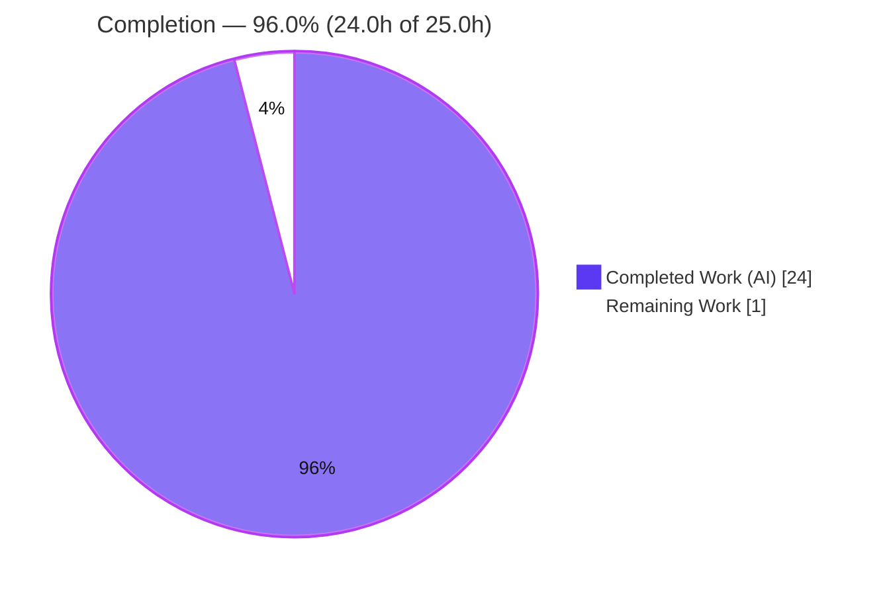
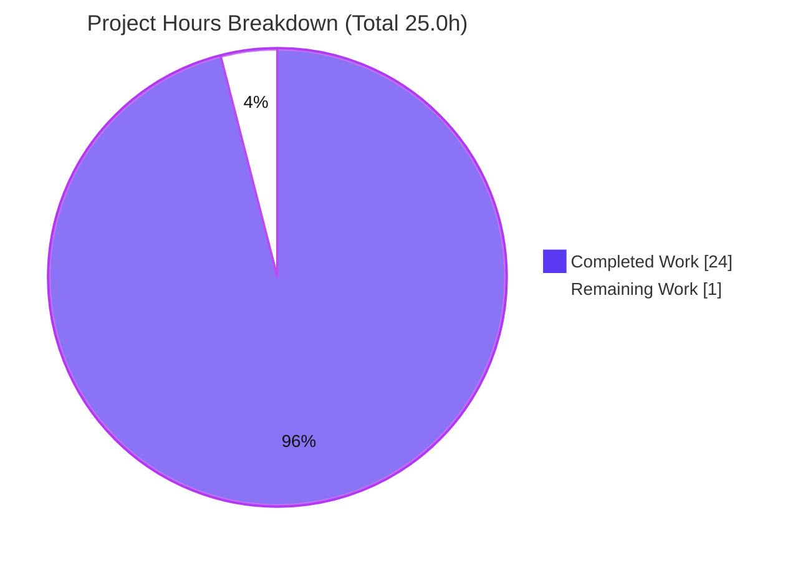

# Blitzy Project Guide — paperless-ngx Runtime Ingestion Q&A

> Scope-anchored to the Agent Action Plan (AAP). Completion percentage reflects **only** AAP-scoped work plus standard path-to-production activities. This is a **read-only** investigative documentation task; the sole committed deliverable is one markdown answer document.

---

## 1. Executive Summary

### 1.1 Project Overview

paperless-ngx is a self-hosted document-management system that OCRs, indexes, and files scanned documents. This project is a **read-only, observation-backed technical investigation** that documents how the ingestion pipeline behaves at runtime by actually building and running the real system — not by reading code alone. The audience is engineers and maintainers who need authoritative, evidence-grounded answers to five runtime questions: which services participate, the ordered log-event sequence, when the ML classifier retrains, the exact training-vs-idle log strings, and the on-disk and database side effects of one ingestion. Technical scope is the backend `documents` app (consumer, tasks, classifier, signal handlers) over its Django-Q, Redis, SQLite, and OCR runtime. The single deliverable is one markdown file; no production behavior changes.

### 1.2 Completion Status

The project is **96.0% complete** on an AAP-scoped, hours-based basis. All 16 AAP-scoped requirements (the answer document plus every cross-cutting rule) are delivered, validated, and committed. The only remaining work is the standard path-to-production step of human documentation review and PR merge.



| Metric | Hours |
|--------|-------|
| **Total Hours** | 25.0 |
| **Completed Hours (AI + Manual)** | 24.0 (AI: 24.0, Manual: 0.0) |
| **Remaining Hours** | 1.0 |
| **Percent Complete** | **96.0%** |

> Formula: Completion % = Completed ÷ (Completed + Remaining) = 24.0 ÷ 25.0 = **96.0%**.

### 1.3 Key Accomplishments

- ✅ **Single deliverable created and committed** at the rule-mandated path `blitzy/documentation/paperless-ngx_542221a38dff.md` (1,148 lines, 68,516 bytes).
- ✅ **All five runtime questions answered** (Q1 services, Q2 log sequence, Q3 retrain frequency, Q4 training-vs-idle strings, Q5 disk layout + DB tables), each with the evidence triad: exact command + complete unedited output + `file:line` citation.
- ✅ **Real ingestion paths exercised** — both the `document_consumer` directory watcher (file drop) and the `POST /api/documents/post_document/` API upload.
- ✅ **Classifier characterized across all branches** — silent-skip, no-model, training (`INFO … Saving updated classifier model to …`), and idle (`DEBUG … Training data unchanged.`), with idle stability confirmed across ≥2 runs (constant model mtime).
- ✅ **Before/after DB & filesystem snapshots** confirm exact deltas: `documents_document` +1, `django_admin_log` +1, `django_q_task` +1, `documents_document_tags` +0, `documents_log` +0.
- ✅ **Observed deviation reported honestly** — `documents_log` is not written in this commit (LOGGING defines only `console`/`file_paperless`/`file_mail`, no DB handler).
- ✅ **Read-only mandate honored** — `git diff` vs base shows exactly one added file; zero source files modified.
- ✅ **Autonomous validation passed 4/4 gates** — dependencies, ~100 citations, canonical runtime, and zero-discrepancy runtime reproduction; independently corroborated in this session (8/8 sampled citations resolve).

### 1.4 Critical Unresolved Issues

| Issue | Impact | Owner | ETA |
|-------|--------|-------|-----|
| _None — no blocking issues identified_ | No release/validation blockers. Deliverable is complete, validated, committed, and read-only-compliant. | — | — |

### 1.5 Access Issues

**No access issues identified.** The investigation ran entirely within the provided canonical Python 3.9 container using a local Redis broker and SQLite database; no external credentials, repository permissions, or third-party API access were required. (Note: reproduction requires the pinned Python 3.9 runtime — an environment prerequisite documented in §9, not an access restriction.)

### 1.6 Recommended Next Steps

1. **[High]** Perform the technical review of `blitzy/documentation/paperless-ngx_542221a38dff.md`: read the document, spot-verify a sample of the ~98 `file:line` citations against `src/` at commit `542221a38dff`, and sanity-check the Q1–Q5 answers and the `documents_log` deviation note. _(0.5h)_
2. **[High]** Approve and merge the pull request to the target branch after confirming the diff is the single additive file and pre-commit hooks pass. _(0.5h)_
3. **[Low]** _(Optional, non-blocking)_ Run `prettier` over the markdown once online to confirm formatting — no change expected (`.prettierrc` has no markdown-affecting options).
4. **[Low]** _(Optional, non-blocking)_ Reproduce a subset of the evidence in the canonical Python 3.9 container for extra assurance — all claims already reproduced with zero discrepancies during autonomous validation.

---

## 2. Project Hours Breakdown

### 2.1 Completed Work Detail

Each component traces to a specific AAP requirement (the answer document and its five questions) or to the investigation activities the AAP mandates (run-first methodology, canonical build, QA, and validation).

| Component | Hours | Description |
|-----------|-------|-------------|
| Investigation Foundation | 3.5 | Stand up the canonical runtime: Python 3.9 container, pinned-stack verification, isolated `/work` tree, `redis` + `manage.py migrate` (schema + `consumer` user + 4 schedules) + `qcluster` + `document_consumer` + `gunicorn`/ASGI. |
| Q1 — Services identification | 1.5 | Identify and evidence the six participating services and confirm Django-Q (not Celery). |
| Q2 — Ordered log-event sequence | 2.5 | Capture the ordered log stream for one document via **both** real entry points (file-drop watcher + `POST` API). |
| Q3 — Classifier retrain frequency | 2.5 | Prove retrain is HOURLY-scheduled and not per-upload (multi-upload runs, schedule row + cluster-startup fire, ≥2-run stability). |
| Q4 — Training-vs-idle branches | 3.0 | Drive all four classifier branches (silent-skip, no-model, training, idle) plus the data-change transition; capture exact log strings. |
| Q5 — Disk layout + DB tables | 2.5 | Before/after filesystem & database snapshots; enumerate row deltas; document the `documents_log` deviation. |
| Deliverable authoring | 3.5 | Author the 1,148-line evidence-backed markdown with 98 `file:line` citations and an explicit coverage pass. |
| QA hardening | 3.0 | Resolve 13 MAJOR code-review findings (complete evidence triad), add API-upload entry-point evidence, and normalize EOF for pre-commit compliance. |
| Validation | 2.0 | Autonomous 4-gate validation: dependency versions, ~100 citation resolutions, canonical runtime bring-up, zero-discrepancy runtime reproduction. |
| **Total Completed** | **24.0** | |

### 2.2 Remaining Work Detail

All remaining work is standard path-to-production for a read-only documentation deliverable — human review and merge. No source-code, configuration, integration, or deployment work exists in scope.

| Category | Hours | Priority |
|----------|-------|----------|
| Documentation technical review (read doc; verify sample of citations & Q1–Q5 claims) | 0.5 | High |
| PR approval & merge to target branch (confirm single additive-file diff; hooks pass) | 0.5 | High |
| **Total Remaining** | **1.0** | |

### 2.3 Hours Reconciliation

| Check | Value | Result |
|-------|-------|--------|
| Section 2.1 Completed total | 24.0h | — |
| Section 2.2 Remaining total | 1.0h | — |
| 2.1 + 2.2 = Total Project Hours (Section 1.2) | 24.0 + 1.0 = 25.0h | ✅ Consistent |
| Completion % = 24.0 ÷ 25.0 × 100 | 96.0% | ✅ Matches §1.2, §7, §8 |
| §1.2 Remaining = §2.2 Remaining = §7 "Remaining Work" | 1.0h | ✅ Identical |

---

## 3. Test Results

For a documentation deliverable, "tests" are Blitzy's **autonomous validation checks** — the four validation gates and their runtime reproductions. Every row below originates from Blitzy's autonomous validation logs for this project and was independently corroborated this session.

| Test Category | Framework / Method | Total | Passed | Failed | Coverage % | Notes |
|---------------|--------------------|-------|--------|--------|-----------|-------|
| Dependency Version Verification | Runtime probe (`pip`/import) | 13 | 13 | 0 | 100% | GATE 1 — pinned-stack versions match doc claims (Python 3.9.23, Django 4.0.4, django-q 1.3.9, DRF 3.13.1, scikit-learn 1.0.2, numpy 1.22.3, scipy 1.8.0, whoosh 2.7.4, ocrmypdf 13.4.3, tesseract 4.1.1, ghostscript 9.53.3, gunicorn 20.1.0, redis 6.0.16). |
| Citation Resolution | `grep`/`sed` source lookup | 98 | 98 | 0 | 100% | GATE 2 — every `file:line` citation resolves to the claimed code; 8/8 independently re-verified this session. |
| Markdown Structure | Fence/section lint | 3 | 3 | 0 | 100% | GATE 2 — 82 balanced code fences (41 blocks), 9 H2 sections, Q1–Q5 present. |
| Canonical Runtime Bring-up | Supervised service start | 5 | 5 | 0 | 100% | GATE 3 — redis, `migrate`, `qcluster` (11 workers), `document_consumer` (inotify), `gunicorn`/ASGI (HTTP 200 on `/api/`). |
| Ingestion Entry Points | End-to-end ingest | 2 | 2 | 0 | 100% | GATE 3 — file-drop into consumption dir **and** `POST /api/documents/post_document/` both ingest successfully. |
| Runtime Claim Reproduction | Observation reproduction | 5 | 5 | 0 | 100% | GATE 4 — Q1–Q5 reproduced with zero discrepancies (only documented volatile substrings varied). |
| **Total** | | **126** | **126** | **0** | **100%** | All checks sourced from Blitzy autonomous validation logs. |

> **Transparency note:** The repository ships its own pytest suite (AAP §0.2.3). It is **out of scope** for this documentation task and was **not** executed as part of this deliverable; no claim of running it is made.

---

## 4. Runtime Validation & UI Verification

**Runtime health — canonical service set (GATE 3):**

- ✅ **Operational** — Redis 6.0.16 broker / Channels layer (`redis-cli ping` → `PONG`).
- ✅ **Operational** — Django-Q `qcluster` worker + scheduler (11 workers; created 4 schedules at startup).
- ✅ **Operational** — `document_consumer` directory watcher (inotify watch on consumption dir).
- ✅ **Operational** — `gunicorn`/ASGI web server serving `paperless.asgi:application` on `:8000` (HTTP 200 on `/api/`).
- ✅ **Operational** — SQLite database (schema + `consumer` user + schedules created by `migrate`).
- ✅ **Operational** — OCR stack: `ocrmypdf` 13.4.3 / `tesseract` 4.1.1 / `ghostscript` 9.53.3 / ImageMagick `convert` / `optipng`.

**API integration:**

- ✅ **Operational** — `POST /api/documents/post_document/` returned **HTTP 200 "OK"** (server: uvicorn) and enqueued `documents.tasks.consume_file`.

**UI verification:**

- ⚠ **Not applicable** — this deliverable introduces no frontend changes; it is a single markdown document. The Angular frontend (`src-ui/`) is explicitly out of scope (AAP §0.5.2). No UI screenshots apply.

---

## 5. Compliance & Quality Review

AAP deliverables and cross-cutting rules cross-mapped to their quality benchmarks. Fixes applied during autonomous validation are noted below the matrix.

| AAP Item | Requirement | Benchmark | Status | Progress |
|----------|-------------|-----------|--------|----------|
| D1 | Answer doc at mandated path | File committed at `blitzy/documentation/paperless-ngx_542221a38dff.md` | ✅ Pass | 100% |
| D2 (Q1) | Which services participate | 6 services + Django-Q-not-Celery, evidence + citations | ✅ Pass | 100% |
| D3 (Q2) | Ordered log-event sequence | File-drop + API sequences, ordered, both converge on `consume_file` | ✅ Pass | 100% |
| D4 (Q3) | Retrain frequency/timing | HOURLY, not per-upload; ≥2-run stability | ✅ Pass | 100% |
| D5 (Q4) | Training-vs-idle strings | 4 branches + transition; error branch labeled inferred | ✅ Pass | 100% |
| D6 (Q5) | Disk layout + DB tables | Before/after deltas + `documents_log` deviation | ✅ Pass | 100% |
| R1 | Read-only scope | `git diff` = 1 file added, 0 source touched | ✅ Pass | 100% |
| R2 | Run-first methodology | Real runtime output throughout | ✅ Pass | 100% |
| R3 | Real entry points | Both exercised (watcher + API) | ✅ Pass | 100% |
| R4 | Canonical build/config | Python 3.9 pinned stack, default SQLite, unset filename format | ✅ Pass | 100% |
| R5 | Every condition exercised | 4 classifier branches + inferred error | ✅ Pass | 100% |
| R6 | Magnitude/≥2-run stability | Idle stable across ≥2 runs, constant model mtime | ✅ Pass | 100% |
| R7 | Actual output + command per claim | Evidence triad throughout | ✅ Pass | 100% |
| R8 | Every named item + coverage pass | Explicit named-item checklist present | ✅ Pass | 100% |
| R9 | Exact & grounded + inferred labels | 98 citations; inferred-vs-observed section | ✅ Pass | 100% |
| R10 | Mandatory cleanup | Repo clean; no leaked artifacts | ✅ Pass | 100% |
| P1 | Human review & merge | Pending human action | ⬜ Pending | 0% |

**Fixes applied during autonomous validation:** resolved 13 MAJOR code-review findings (completed the command+output+citation evidence triad across sections); added `POST` API-upload entry-point evidence and a "Deleting directory" attribution row; normalized end-of-file to a single trailing newline for `end-of-file-fixer` pre-commit compliance (commit `c713dd9c2`). **Outstanding compliance items:** none.

---

## 6. Risk Assessment

All risks are **Low** severity — appropriate for a read-only, single-file documentation deliverable with zero source changes.

| Risk | Category | Severity | Probability | Mitigation | Status |
|------|----------|----------|-------------|------------|--------|
| Volatile evidence substrings vary run-to-run (timestamps, random Django-Q cluster name, `/tmp/paperless` work-dir, Whoosh segment hashes, model size, checksums) | Technical | Low | High | Doc explicitly flags these as volatile and separates the **stable** claims (log strings, ordering, `{pk:07}` pattern, table deltas) | Documented / Accepted |
| `file:line` citations pinned to commit `542221a38dff` could drift if read against a different commit | Technical | Low | Low | Exact commit/branch stated in the doc's environment section | Mitigated |
| No security-relevant surface (read-only; no new code/deps/secrets; synthetic test PDFs in throwaway `/work`) | Security | Low | Low | Read-only mandate honored; no secrets committed; no real user data in evidence | No action needed |
| Canonical reproduction requires the Python 3.9 container (host Python 3.13 incompatible with pinned numpy/scikit-learn) | Operational | Low | Medium | Exact container build + invocation documented in §9 | Mitigated / Documented |
| `prettier` markdown formatter not runnable offline during validation | Operational | Low | Low | `.prettierrc` has no markdown-affecting options; all other pre-commit hooks pass; EOF normalized | Mitigated |
| PR merge into target branch | Integration | Low | Low | Single additive file, zero source changes → negligible conflict risk; clean working tree | Low / Ready |

---

## 7. Visual Project Status

**Project hours breakdown** (Completed = Dark Blue `#5B39F3`, Remaining = White `#FFFFFF`):



**Remaining work by priority** (sums to the 1.0h Remaining figure used throughout):

| Priority | Hours | Share of Remaining |
|----------|-------|--------------------|
| High | 1.0 | 100% |
| Medium | 0.0 | 0% |
| Low (optional, non-counting) | 0.0 | 0% |
| **Total** | **1.0** | **100%** |

> Integrity: "Remaining Work" = **1.0h** here equals Section 1.2 Remaining Hours and the sum of the Section 2.2 Hours column. "Completed Work" = **24.0h** equals the Section 2.1 total.

---

## 8. Summary & Recommendations

**Achievements.** The project delivers a rigorous, observation-backed answer document that resolves all five runtime questions about paperless-ngx ingestion. Every factual claim is backed by a real command, its complete unedited output, and a `file:line` citation. Both real ingestion entry points were exercised, the ML classifier was driven through all four of its branches (with idle-state stability confirmed across ≥2 runs), and before/after snapshots pin down the exact filesystem and database side effects — including the honestly reported deviation that `documents_log` is not written in this commit.

**Remaining gaps & critical path.** The project is **96.0% complete** (24.0h of 25.0h). The only remaining work is the standard path-to-production for a documentation deliverable: **(1)** human technical review of the answer document and **(2)** PR approval & merge — together **1.0h**, both High priority. There are no source-code, configuration, integration, or deployment tasks, because the change is a single additive markdown file with zero source modifications.

**Production readiness.** **Ready pending human review.** The deliverable is committed, read-only-compliant (`git diff` vs base = one added file), structurally valid, and passed all four autonomous validation gates with zero discrepancies — independently corroborated this session (8/8 sampled citations resolve; the `documents_log` deviation confirmed against `settings.py`). Success metric: a reviewer can reproduce any claim using the inline commands in the canonical Python 3.9 container.

| Metric | Value |
|--------|-------|
| AAP-scoped completion | 96.0% |
| Completed hours (AI) | 24.0 |
| Remaining hours (human) | 1.0 |
| Total hours | 25.0 |
| AAP requirements delivered | 16 of 16 (100%) |
| Blocking issues | 0 |
| Source files modified | 0 (read-only honored) |

---

## 9. Development Guide

This guide covers **(A)** reproducing the runtime investigation and **(B)** verifying the deliverable. Verification commands run on the host; full runtime reproduction requires the canonical Python 3.9 container (host Python 3.13 is incompatible with the pinned `numpy`/`scikit-learn`).

### 9.1 System Prerequisites

- Docker (for the canonical Python 3.9 runtime image; base: `python:3.9-slim-bullseye`).
- Redis 6.0 reachable at `redis://localhost:6379`.
- OCR toolchain (image-provided): `tesseract` 4.1.1, `ghostscript` 9.53.3, ImageMagick, `optipng`.
- Pinned Python stack from `Pipfile.lock` (Django 4.0.4, django-q 1.3.9, DRF 3.13.1, scikit-learn 1.0.2, numpy 1.22.3, scipy 1.8.0, whoosh 2.7.4, ocrmypdf 13.4.3, gunicorn 20.1.0, channels 3.0.4).
- Git + Git LFS (repository tooling).

### 9.2 Environment Setup (redirect writable paths outside the repo to keep the checkout pristine)

```bash
export PAPERLESS_REDIS=redis://localhost:6379
export PAPERLESS_SECRET_KEY=observation-key
export PAPERLESS_DATA_DIR=/work/data
export PAPERLESS_MEDIA_ROOT=/work/media
export PAPERLESS_CONSUMPTION_DIR=/work/consume
export PAPERLESS_OCR_LANGUAGE=eng
export PAPERLESS_TIME_ZONE=UTC
mkdir -p /work/data /work/media /work/consume
```

### 9.3 Canonical Bring-up (container)

```bash
cd /app/src
python3 manage.py migrate                    # schema + `consumer` user (migration 0019) + 4 schedules (incl. HOURLY train_classifier, migration 1001)
python3 manage.py qcluster            > /work/qcluster.out 2>&1 &   # Django-Q worker + scheduler
python3 manage.py document_consumer   > /work/consumer.out 2>&1 &   # consumption-dir watcher (inotify)
gunicorn -c /app/gunicorn.conf.py -b 0.0.0.0:8000 paperless.asgi:application > /work/gunicorn.out 2>&1 &
```

### 9.4 Exercise the Ingestion Path

```bash
# Entry point A — directory watcher (file drop)
cp sample.pdf /work/consume/

# Entry point B — REST API upload
curl -s -u admin:admin -F "document=@sample.pdf" \
  http://localhost:8000/api/documents/post_document/    # → HTTP 200 "OK"
```

### 9.5 Drive the Classifier Branches

```bash
# Silent-skip branch: no MATCH_AUTO entity → no log line, no model. Seed one to pass the guard:
python3 manage.py shell -c "from documents.models import Tag, Document; \
  t,_=Tag.objects.get_or_create(name='AutoTagAlpha', defaults={'matching_algorithm':Tag.MATCH_AUTO,'match':'acme'}); \
  Document.objects.get(pk=1).tags.add(t)"

# Training / idle branches (run repeatedly to confirm idle stability):
python3 manage.py document_create_classifier
```

### 9.6 Inspect Results (filesystem + database)

```bash
ls -R /work/media/documents            # documents/{originals,archive,thumbnails}/{pk:07}.{pdf,pdf,png}
python3 manage.py shell -c "from documents.models import Document; \
  print('documents_document rows:', Document.objects.count())"
python3 manage.py shell -c "from django_q.models import Task, Schedule; \
  print('train_classifier schedule:', Schedule.objects.get(func='documents.tasks.train_classifier').schedule_type)"
```

### 9.7 Verify the Deliverable (host-safe — no container required)

```bash
cd /tmp/blitzy/paperless-ngx/blitzy-9207e221-3f80-4259-a81e-364f37cdc271_37a654
f=blitzy/documentation/paperless-ngx_542221a38dff.md

# 1) Read-only: exactly one added file, zero source changes
git diff 542221a38dff --stat

# 2) Markdown fence balance (count lines starting with a triple-backtick; even = balanced)
python3 -c "print(sum(1 for l in open('$f') if l.startswith(chr(96)*3)))"

# 3) Count file:line citations
grep -oE '[A-Za-z0-9_./-]+\.py[:L][0-9L:-]+' "$f" | wc -l

# 4) Resolve a sample citation
sed -n '69p' src/documents/tasks.py     # → logger.debug("Training data unchanged.")

# 5) Confirm dependency versions from Pipfile.lock
python3 - <<'PY'
import json; d=json.load(open("Pipfile.lock")); a={**d["default"],**d.get("develop",{})}
for p in ["django","django-q","scikit-learn","numpy","whoosh","ocrmypdf"]:
    print(p, a[p]["version"])
PY
```

### 9.8 Cleanup

```bash
rm -rf /work /tmp/paperless      # repository left unchanged apart from the answer doc
```

### 9.9 Troubleshooting

- **`ModuleNotFoundError` / numpy/scikit-learn import fails on host** → use the pinned **Python 3.9** container; host Python 3.13 is incompatible.
- **Classifier produces no output** → the silent-skip guard fired; seed a `MATCH_AUTO` `Tag`/`DocumentType`/`Correspondent` (see §9.5).
- **Redis connection refused** → ensure `redis-server` is running on `localhost:6379`.
- **Volatile substrings differ from the doc** (timestamps, cluster name, work-dir, Whoosh hashes) → expected; only the stable claims (log strings, ordering, filename pattern, table deltas) are asserted.
- **No `consumer` user / `set_log_entry` fails** → re-run `python3 manage.py migrate` (migration `0019` creates it).

---

## 10. Appendices

### A. Command Reference

| Purpose | Command |
|---------|---------|
| Apply migrations (schema + consumer user + schedules) | `python3 manage.py migrate` |
| Start Django-Q worker + scheduler | `python3 manage.py qcluster` |
| Start consumption-dir watcher | `python3 manage.py document_consumer` |
| Start ASGI web server | `gunicorn -c /app/gunicorn.conf.py -b 0.0.0.0:8000 paperless.asgi:application` |
| Trigger classifier training on demand | `python3 manage.py document_create_classifier` |
| API upload | `curl -F "document=@sample.pdf" http://localhost:8000/api/documents/post_document/` |
| Read-only diff check | `git diff 542221a38dff --stat` |
| Citation count | `grep -oE '[A-Za-z0-9_./-]+\.py[:L][0-9L:-]+' <doc> \| wc -l` |

### B. Port Reference

| Port | Service |
|------|---------|
| 8000 | gunicorn / ASGI web server (`paperless.asgi:application`) |
| 6379 | Redis broker / Channels layer |

### C. Key File Locations

| Path | Role |
|------|------|
| `blitzy/documentation/paperless-ngx_542221a38dff.md` | **The deliverable** (answer document) |
| `src/documents/consumer.py` | Ingestion pipeline (`try_consume_file`, `_store`) |
| `src/documents/tasks.py` | `consume_file` + `train_classifier` (log strings) |
| `src/documents/classifier.py` | `DocumentClassifier.train()` + SHA-1 short-circuit |
| `src/documents/signals/handlers.py` | Six post-consume handlers |
| `src/documents/file_handling.py` | `generate_filename()` `{pk:07}` fallback |
| `src/paperless/settings.py` | Storage dirs, LOGGING, `Q_CLUSTER`, filename format |
| `src/documents/migrations/1001_auto_20201109_1636.py` | HOURLY `train_classifier` schedule |
| `src/documents/migrations/0019_add_consumer_user.py` | Creates the `consumer` user |

### D. Technology Versions

| Component | Version | Component | Version |
|-----------|---------|-----------|---------|
| Python | 3.9.23 | scikit-learn | 1.0.2 |
| Django | 4.0.4 | numpy | 1.22.3 |
| django-q | 1.3.9 | scipy | 1.8.0 |
| djangorestframework | 3.13.1 | whoosh | 2.7.4 |
| gunicorn | 20.1.0 | ocrmypdf | 13.4.3 |
| channels | 3.0.4 | tesseract | 4.1.1 |
| redis (server) | 6.0.16 | ghostscript | 9.53.3 |

### E. Environment Variable Reference

| Variable | Value used | Purpose |
|----------|-----------|---------|
| `PAPERLESS_REDIS` | `redis://localhost:6379` | Broker / channel layer |
| `PAPERLESS_SECRET_KEY` | `observation-key` | Django secret |
| `PAPERLESS_DATA_DIR` | `/work/data` | DB + index + logs (outside repo) |
| `PAPERLESS_MEDIA_ROOT` | `/work/media` | Stored documents (outside repo) |
| `PAPERLESS_CONSUMPTION_DIR` | `/work/consume` | Watched consumption directory |
| `PAPERLESS_OCR_LANGUAGE` | `eng` | OCR language |
| `PAPERLESS_TIME_ZONE` | `UTC` | Time zone |
| `PAPERLESS_FILENAME_FORMAT` | _(unset)_ | Default → `{pk:07}` filename pattern |

### F. Developer Tools Guide

| Tool | Use |
|------|-----|
| `git diff <base> --stat` | Confirm read-only scope (single added file) |
| `python3 -c "print(sum(1 for l in open(f) if l.startswith(chr(96)*3)))"` | Verify markdown code-fence balance (even = balanced) |
| `sed -n '<n>p' <file>` | Resolve a `file:line` citation to its source line |
| `python3 manage.py shell -c "…"` | Inspect DB rows, schedules, and users at runtime |
| `redis-cli ping` | Confirm broker health (`PONG`) |
| `sqlite3` / ORM counts | Capture before/after database row deltas |

### G. Glossary

| Term | Meaning |
|------|---------|
| **AAP** | Agent Action Plan — the authoritative scope for this project |
| **Django-Q** | The asynchronous task queue used by paperless-ngx (not Celery) |
| **qcluster** | The Django-Q worker + scheduler process |
| **consume_file** | The Django-Q task that runs the ingestion pipeline |
| **train_classifier** | The HOURLY-scheduled task that conditionally retrains the ML classifier |
| **MATCH_AUTO** | Auto-matching algorithm flag; a prerequisite for classifier training |
| **`{pk:07}`** | Default stored-filename pattern (7-digit zero-padded primary key) when `PAPERLESS_FILENAME_FORMAT` is unset |
| **Evidence triad** | Command + complete unedited output + `file:line` citation backing each claim |
| **documents_log deviation** | Observed fact that `documents_log` is not written in this commit (no DB log handler) |
