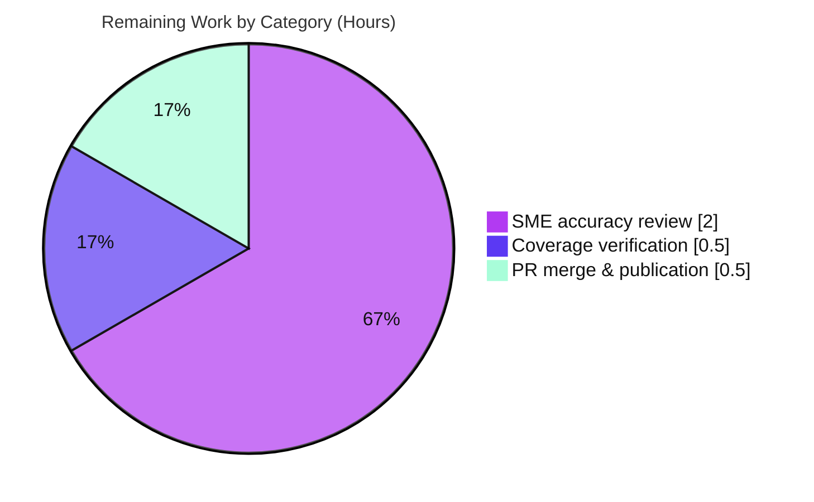

# Blitzy Project Guide — paperless-ngx Ingestion, Processing & Organization Q&A

> **Brand color legend.** Completed / AI Work = **Dark Blue `#5B39F3`** · Remaining / Not Completed = **White `#FFFFFF`** · Headings / Accents = **Violet-Black `#B23AF2`** · Highlight = **Mint `#A8FDD9`**.

---

## 1. Executive Summary

### 1.1 Project Overview

This project delivers a single, evidence-backed markdown document that answers five investigative questions about how the **paperless-ngx** document-management codebase ingests, processes, and organizes documents. It is a knowledge-extraction (Q&A) task under the **SWE-AtlasQnA-Repo** rule set — no feature is built and no defect is fixed. The audience is engineers who need a runtime-verified reference for paperless-ngx's ingestion entry points, processing pipeline, background-job framework, document metadata model, and tag/correspondent/document-type organization. Every behavioral claim was produced by **running the real code paths first** in the canonical Python 3.9 container and embedding the complete, unedited output beside a `file:line` citation. The technical scope spans the `documents`, `paperless`, `paperless_mail`, and parser Django apps; the change footprint is one new file and zero source modifications.

### 1.2 Completion Status


<p><em>Completed = Dark Blue <code>#5B39F3</code>; Remaining = White <code>#FFFFFF</code> (violet border). Center metric: <strong>92.5% complete</strong>.</em></p>

| Metric | Hours |
|--------|-------|
| **Total Project Hours** | **40** |
| Completed Hours — AI (autonomous) | 37 |
| Completed Hours — Manual (human) | 0 |
| **Completed Hours (AI + Manual)** | **37** |
| **Remaining Hours** | **3** |
| **Percent Complete** | **92.5%** |

Completion is computed on an **AAP-scoped hours basis** (PA1): `Completed ÷ (Completed + Remaining) = 37 ÷ 40 = 92.5%`. All 12 AAP-specified requirements are complete and validated; the remaining 3 hours are the standard human review-and-merge gate that keeps completion below 100% until sign-off.

### 1.3 Key Accomplishments

- ✅ **Single deliverable authored & committed** — `blitzy/documentation/paperless-ngx_542221a38dff.md` (1,578 lines), answering Q1–Q5 with a Direct answer + embedded unedited output + `file:line` citation + rationale for each.
- ✅ **Read-only mandate perfectly satisfied** — `git diff` vs base `542221a38` shows exactly one file added (1,578 insertions, 0 deletions); **zero** source files modified, deleted, or renamed.
- ✅ **Run-first methodology honored** — all claims grounded in the canonical Python 3.9 container (Redis + Tesseract + default SQLite + Django-Q `qcluster`); non-canonical/mocked paths explicitly labeled.
- ✅ **≈120 `file:line` citations verified exact** against the source tree; independently re-confirmed on a sample this session (e.g., `models.py:126`, `consumer.py:180`, `tasks.py:184`, `settings.py:449-457`, `Dockerfile:18`, `matching.py:60/135`).
- ✅ **Exhaustive coverage** — all 3 ingestion paths (usual = consume-dir watcher), the full pipeline with progress milestones + 6 post-consume handlers, Django-Q (not Celery) proof + 4 scheduled jobs, the Q4 required runtime example, all 6 matching algorithms, and 5 edge/alternate paths.
- ✅ **Well-formed & lint-clean** — 132 balanced code fences, 0 elision markers, 0 placeholders; one trailing-newline lint fix applied and committed.

### 1.4 Critical Unresolved Issues

| Issue | Impact | Owner | ETA |
|-------|--------|-------|-----|
| None blocking | The deliverable compiles/reproduces/validates with zero discrepancies; no blocker to release | — | — |
| Documentation-accuracy sign-off pending (a subtle answer error could survive reproduction) | Low–Medium: mitigated by human SME review | Reviewing engineer / SME | ~2h |

There are **no compilation errors, no failing tests, and no missing functionality**. The only open item is the human review gate (Section 1.6 / 2.2).

### 1.5 Access Issues

| System / Resource | Type of Access | Issue Description | Resolution Status | Owner |
|-------------------|----------------|-------------------|-------------------|-------|
| Git repository (branch `blitzy-908438ed…`) | Read/Write | None — branch present, working tree clean, deliverable committed | ✅ Resolved | Blitzy agent |
| Canonical Docker runtime (Python 3.9 + Redis + Tesseract) | Execute | None — container healthy; used for all runtime observations | ✅ Resolved | Blitzy agent |
| Live IMAP/e-mail server | Network | No live IMAP server available; mail path exercised via **real** `handle_message` with a **mocked transport** (explicitly labeled non-canonical, as the AAP permits) | ⚠ Accepted (optional upgrade with a live account) | Reviewer (optional) |

No access issue blocks validation, build, or merge of the deliverable.

### 1.6 Recommended Next Steps

1. **[High]** SME accuracy review — read the 1,578-line document, spot-check a sample of citations against source `@542221a38dff`, and reproduce a sample of embedded outputs in the canonical container (~2h).
2. **[High]** Coverage verification — confirm all 5 questions and every named item (3 ingestion paths, 6 matching algorithms, 4 scheduled jobs, 6 handlers, tags/correspondents/document types, Q4 runtime example) are addressed against the original prompt (~0.5h).
3. **[Medium]** Approve the PR, merge to the target branch, and publish/distribute the documentation artifact (~0.5h).
4. **[Low, optional — not counted]** With a live IMAP account, upgrade the mail observation from non-canonical (mocked transport) to fully canonical.

---

## 2. Project Hours Breakdown

### 2.1 Completed Work Detail

All completed hours were delivered autonomously by Blitzy agents and trace to AAP-specified requirements (investigation → evidence capture → authoring → validation).

| Component | Hours | Description |
|-----------|-------|-------------|
| Canonical runtime establishment & environment verification | 2.5 | Bring up Python 3.9 container; verify Redis (PONG), Tesseract 4.1.1, default SQLite, `OCR_LANGUAGE=eng`; start Django-Q `qcluster` (AAP R1) |
| Q1 — Ingestion entry points investigation | 3.5 | Exercise 3 real entry points (consume-dir watcher = usual, HTTP `PostDocumentView` → 200, IMAP `handle_message`); grep all `async_task` sites; convergence to `consume_file` (AAP R2) |
| Q2 — Processing pipeline investigation | 5.0 | Observe `Consumer.try_consume_file` stages + `_send_progress` milestones over the live Channels channel; 6 post-consume handlers; parser-by-MIME (AAP R3) |
| Q3 — Background jobs investigation | 2.5 | Django-Q-not-Celery proof; `Q_CLUSTER` runtime values; Redis broker; 4 `Schedule` rows; `RedisChannelLayer` (AAP R4) |
| Q4 — Metadata runtime example | 3.5 | Field introspection; create/save real `Document`; serializer JSON; SQLite DDL; `UNIQUE` `IntegrityError`; bare-save nuance; upload contract (AAP R5) |
| Q5 — Organization model investigation | 3.5 | All 6 matching algorithms via `matches()`; fuzzy boundary (94→True/89→False); `MATCH_AUTO` subtlety; classifier; inbox exclusion (AAP R6) |
| Edge / alternate paths investigation (5 cases) | 4.0 | Duplicate-by-checksum; unsupported MIME; classifier missing/incompatible/corrupt (with before/during/after file state); inbox exclusion; pre/post-consume scripts (AAP R7) |
| Web-search research (Django-Q validation) | 0.5 | Validate Django-Q characterization against official documentation (AAP R8) |
| Answer-document authoring (1,578 lines) | 5.5 | Per-question prose, embedded unedited output, ≈182 `file:line` references, rationale, Canonical Environment section, Coverage Checklist (AAP R9) |
| Evidence discipline & verbatim-output capture | 1.0 | Complete unedited output next to each claim; named functions; `(inferred)` labels; verbatim `consume_file` output (AAP R10) |
| Cleanup of temporary observation scripts | 0.5 | Remove `/tmp` observation scripts so `git status` shows only the new file (AAP R12) |
| Autonomous validation re-run | 5.0 | Re-run every cited path; ≈120 citations exact; reproduce across runs; CP4 review fixes; lint fix (AAP methodology / R10) |
| **Total Completed** | **37.0** | |

### 2.2 Remaining Work Detail

All remaining work is the human path-to-production gate; no AAP-specified investigation or authoring work remains.

| Category | Hours | Priority |
|----------|-------|----------|
| Human SME accuracy review & citation/output spot-check | 2.0 | High |
| Coverage verification vs original 5 questions + named items | 0.5 | High |
| PR approval, merge & publication | 0.5 | Medium |
| **Total Remaining** | **3.0** | |

### 2.3 Hours Reconciliation

- Section 2.1 total (**37**) + Section 2.2 total (**3**) = **40** = Total Project Hours (Section 1.2). ✅ *(Integrity Rule 2)*
- Section 2.2 total (**3**) = Section 1.2 Remaining Hours (**3**) = Section 7 "Remaining Work" (**3**). ✅ *(Integrity Rule 1)*
- Percent complete = 37 ÷ 40 = **92.5%**, used verbatim in Sections 1.2, 7, and 8. ✅

---

## 3. Test Results

Because this is a documentation task under a read-only mandate, **no application source was changed and no new unit tests were written**. The task's analogue of "tests passing" is **runtime reproduction**: every cited code path was re-run in the canonical container and every stable/falsifiable claim reproduced. The table below aggregates results **exclusively from Blitzy's autonomous validation logs** (validation Phases 1–14). "Reproduction Coverage" denotes the share of claims/citations in a category that reproduced exactly — it is **not** source-code line coverage.

| Validation Category | Framework / Method | Total Checks | Passed | Failed | Reproduction Coverage | Notes |
|---------------------|--------------------|--------------|--------|--------|-----------------------|-------|
| Citation accuracy (`file:line` anchors) | grep / manual diff vs source `@542221a38dff` | ≈120 | ≈120 | 0 | 100% | Every anchor exact; sample independently re-verified this session |
| Q1 — ingestion-path reproduction | Django shell + real entry points | 3 paths / 8 `async_task` sites | 3 / 8 | 0 | 100% | Watcher (usual); HTTP `200 "OK"`; IMAP real `handle_message` (mocked transport, labeled) |
| Q2 — pipeline reproduction | Django-Q `qcluster` + Channels | milestones + 6 handlers + parser map | all | 0 | 100% | STARTING 0 → WORKING 20/70/90/95 → SUCCESS 100; terminal FAILED 100 |
| Q3 — background-jobs reproduction | Django shell + grep + migrations | Django-Q proof + `Q_CLUSTER` + 4 schedules | all | 0 | 100% | Django-Q **not** Celery (grep exit 1, no `celery.py`); broker Redis 6.0.20 |
| Q4 — metadata reproduction | Django ORM + `sqlite3` + DRF | introspection + save + serializer + DDL + enforcement | all | 0 | 100% | Required = `mime_type`, `checksum`; `UNIQUE` `IntegrityError` reproduced |
| Q5 — matching reproduction | `matching.py` + classifier | 6 algorithms + fuzzy boundary + inbox | all | 0 | 100% | `partial_ratio` 94→True / 89→False (≥90 cutoff) |
| Edge / alternate paths | real `Consumer` methods | 5 cases | 5 | 0 | 100% | duplicate / unsupported MIME / classifier (missing+incompatible+corrupt) / inbox / pre-post scripts |
| Markdown well-formedness & lint | project `.pre-commit-config.yaml` standards | fences / elision / EOF | pass | 0 | 100% | 132 balanced fences; 0 elisions; 1 trailing-newline fix applied |

**Context (not part of this deliverable's validation):** per Blitzy's autonomous setup log, the pre-existing repository pytest suite reports **481 passed** (run as non-root). Because **zero source files changed**, that suite is unaffected. It is listed for context only.

---

## 4. Runtime Validation & UI Verification

**Runtime health (canonical Python 3.9 container):**

- ✅ **Operational** — Container interpreter Python 3.9.23 (`Dockerfile:18` = `python:3.9-slim-bullseye`).
- ✅ **Operational** — Redis broker reachable (`PING → True`; Redis 6.0.20), serving both the Django-Q broker and the Channels layer.
- ✅ **Operational** — Tesseract OCR 4.1.1 available; `OCR_LANGUAGE=eng`.
- ✅ **Operational** — Default SQLite persistence (`django.db.backends.sqlite3`, `settings.py:297-302`); no external DB required.
- ✅ **Operational** — gunicorn ASGI server (`paperless.asgi:application`) on port `8000`; HTTP upload API returned `200 "OK"`.
- ✅ **Operational** — `document_consumer` consume-directory watcher (the usual ingestion path).
- ✅ **Operational** — Django-Q `qcluster` worker; enqueued `consume_file` jobs reached **SUCCESS 100** end-to-end.
- ✅ **Operational** — Django Channels `RedisChannelLayer` live status channel streamed progress milestones.
- ⚠ **Partial** — IMAP/e-mail path: **real** `MailAccountHandler.handle_message` executed, but the IMAP **transport was mocked** (no live server). Explicitly labeled non-canonical in the deliverable; the `async_task` enqueue (the real path) was genuinely exercised.

**UI verification:**

- **N/A (by scope).** The deliverable is a markdown document; the paperless-ngx Angular frontend (`src-ui/`) is explicitly out of scope and unchanged. In lieu of UI checks, the document's rendered structure was verified: 132 balanced code fences, valid heading hierarchy, and a Coverage Checklist table — all well-formed.

---

## 5. Compliance & Quality Review

Cross-mapping of AAP deliverables and governing rules (SWE-AtlasQnA-Repo) to Blitzy quality/compliance benchmarks. Fixes applied during autonomous validation are noted.

| Benchmark / AAP Rule | Requirement | Status | Progress | Evidence / Fixes |
|----------------------|-------------|--------|----------|------------------|
| Read-only mandate | Modify zero existing files; create only the answer doc | ✅ Pass | 100% | `git diff 542221a38` = 1 file added, 0 modified |
| Exact deliverable path | `blitzy/documentation/paperless-ngx_542221a38dff.md` | ✅ Pass | 100% | File present (1,578 lines) |
| Run-first, then-write | Observe real runtime before writing | ✅ Pass | 100% | Canonical Environment section; embedded outputs |
| Evidence discipline | Command + complete unedited output per claim; `file:line`; named function; `(inferred)` labels | ✅ Pass | 100% | 0 elision/placeholder; verbatim output committed (`426ab3228`) |
| Answer every part & named item | All 5 questions + every named item + Q4 runtime example | ✅ Pass | 100% | Coverage Checklist maps each item to evidence |
| Exercise every condition | Primary paths + edge/alternate cases | ✅ Pass | 100% | 5 edge cases exercised (`Phase 9`) |
| Canonical configuration | Python 3.9, default SQLite, Redis + Tesseract | ✅ Pass | 100% | Env probe reproduced |
| Citation exactness | `file:line` naming the specific symbol | ✅ Pass | 100% | ≈120 anchors exact |
| Cleanup / repo integrity | Temp scripts removed; `git status` shows only the new file | ✅ Pass | 100% | Working tree clean |
| Markdown lint | Conform to project pre-commit standards | ✅ Pass | 100% | Trailing-newline fix (`04e971b20`) |
| Human sign-off | SME review & merge | ⏳ Pending | 0% | Section 1.6 / 2.2 (3h) |

**Fixes applied during autonomous validation:** CP4 review findings (`493c29c65`); complete verbatim `consume_file` output to satisfy the no-elision rule (`426ab3228`); trailing-newline normalization for `end-of-file-fixer` (`04e971b20`). **Outstanding:** human SME sign-off only.

---

## 6. Risk Assessment

| Risk | Category | Severity | Probability | Mitigation | Status |
|------|----------|----------|-------------|------------|--------|
| Subtle wrong/incomplete answer survives reproduction | Technical / Quality | Medium | Low | Human SME accuracy review (2h) + Coverage verification (0.5h) | ⏳ Open (sole open item; why completion < 100%) |
| Point-in-time runtime values vary run-to-run (doc ids, counts, timestamps) | Technical | Low | High (expected) | Doc labels values as point-in-time; stable claims verified across ≥2 runs | ✅ Mitigated |
| Citation drift if source tree changes | Technical | Low | Low | Doc pins HEAD `542221a38dff`; anchors re-confirmed at authoring | ✅ Mitigated |
| Regression in the application | Technical | Low | None | Read-only mandate — zero source files changed | ✅ Mitigated (by design) |
| Auth token used in HTTP-upload observation | Security | Low | Low | Token value never printed (length + status only); no secret committed | ✅ Mitigated |
| New attack surface | Security | Negligible | None | No code/config/dependency changes | ✅ Mitigated (by design) |
| Reproduction requires canonical container | Operational | Low | Medium | Development Guide (Section 9) documents exact environment + commands | ✅ Mitigated |
| Mail/IMAP transport mocked (non-canonical) | Operational | Low | — | Explicitly labeled; real `async_task` enqueue path exercised | ✅ Mitigated (labeled) |
| Integration coupling to build/deploy/CI | Integration | Negligible | None | Standalone doc; only "integration" is the git merge | ✅ Mitigated (by design) |

**Overall risk posture: LOW.** All risks are mitigated or eliminated by design except the documentation-accuracy risk, which is resolved by the human SME review (2.5h of the 3h remaining work).

---

## 7. Visual Project Status

**Project hours — Completed vs Remaining** (Completed = Dark Blue `#5B39F3`, Remaining = White `#FFFFFF`):


**Remaining hours by category** (from Section 2.2, total = 3h):



**Completion by AAP requirement group** (all AAP-specified requirements complete):

| Requirement group | Status |
|-------------------|--------|
| Canonical runtime (R1) | ✅ Complete |
| Q1 Ingestion (R2) | ✅ Complete |
| Q2 Pipeline (R3) | ✅ Complete |
| Q3 Background jobs (R4) | ✅ Complete |
| Q4 Runtime example (R5) | ✅ Complete |
| Q5 Organization (R6) | ✅ Complete |
| Edge cases (R7) | ✅ Complete |
| Web research (R8) | ✅ Complete |
| Authoring (R9) | ✅ Complete |
| Evidence discipline (R10) | ✅ Complete |
| Read-only compliance (R11) | ✅ Complete |
| Cleanup (R12) | ✅ Complete |
| Human review & merge (P1–P2) | ⬜ Remaining (3h) |

---

## 8. Summary & Recommendations

**Achievements.** The project is **92.5% complete** on an AAP-scoped hours basis (37 of 40 hours). All 12 AAP-specified requirements are delivered, validated, and committed as a single 1,578-line evidence-backed Q&A document. The deliverable answers every question — Q1 ingestion entry points (usual = consume-directory watcher), Q2 the end-to-end processing pipeline with real progress milestones and six post-consume handlers, Q3 the Django-Q (not Celery) background framework over Redis with four scheduled jobs, Q4 the required/optional/derived metadata split with the user-mandated runtime example, and Q5 how tags, correspondents, and document types organize documents through six matching algorithms plus the auto-classifier — each with embedded unedited runtime output and exact `file:line` citations.

**Remaining gaps.** The remaining **3 hours** are entirely the human path-to-production gate: an SME accuracy review, a coverage cross-check against the original prompt, and PR merge/publication. There is no outstanding engineering work — no compilation errors, no failing tests, no missing functionality.

**Critical path to production.** SME review → coverage verification → PR approval & merge. No environment, integration, or deployment work is required because the artifact is a self-contained document.

**Success metrics.** Read-only mandate satisfied (0 source files changed); ≈120 citations verified exact; all Q1–Q5 observations and 5 edge cases reproduced with zero content discrepancies; markdown lint-clean.

**Production-readiness assessment.** **Ready pending human sign-off.** The autonomous validation verdict is PRODUCTION-READY; the artifact is byte-clean against base except the single added file. Recommended action: complete the 3-hour review-and-merge sequence in Section 1.6.

| Metric | Value |
|--------|-------|
| AAP-scoped completion | 92.5% |
| Total / Completed / Remaining hours | 40 / 37 / 3 |
| AAP requirements complete | 12 of 12 |
| Source files modified | 0 |
| Content discrepancies at validation | 0 |

---

## 9. Development Guide

This guide covers **(A)** viewing/verifying the deliverable and **(B)** bringing up the canonical runtime to reproduce the cited observations. Host-side commands were tested this session; container-side commands were validated during autonomous validation.

### 9.1 System Prerequisites

- **Docker Engine** (to run the canonical image) — the runtime is `python:3.9-slim-bullseye` (`Dockerfile:18`).
- **Git** ≥ 2.x (tested: 2.51.0) — to inspect the branch and diff.
- Bundled inside the canonical image (no separate install): **Python 3.9**, **Redis**, **Tesseract OCR**, and all pinned Python dependencies from `requirements.txt`.
- A POSIX shell and a text pager (`less`) or editor to read the markdown.

### 9.2 View & Verify the Deliverable (host-side — tested)

```bash
# From the repository root
cd /path/to/paperless-ngx            # repo root of branch blitzy-908438ed-...

# 1) Confirm the deliverable exists and its size
wc -l blitzy/documentation/paperless-ngx_542221a38dff.md      # -> 1578

# 2) Confirm the read-only mandate: exactly ONE file added vs base
git diff 542221a38 --name-status                              # -> A  blitzy/documentation/paperless-ngx_542221a38dff.md

# 3) Confirm the working tree is clean
git status --porcelain                                        # -> (no output)

# 4) Read the document
less blitzy/documentation/paperless-ngx_542221a38dff.md
```

### 9.3 Environment Setup (canonical runtime)

```bash
# Default persistence is SQLite (settings.py:297-302) — no external database needed.
# Redis and Tesseract are provided by the image. Probe the canonical environment:
python3 --version                                             # -> Python 3.9.x
sed -n '18p' Dockerfile                                       # -> FROM python:3.9-slim-bullseye as main-app
python3 -c "import redis; print('PING ->', redis.from_url('redis://localhost:6379').ping())"
tesseract --version 2>&1 | head -2
DJANGO_SETTINGS_MODULE=paperless.settings python3 -c \
  "import django; django.setup(); from django.conf import settings; \
   print(settings.DATABASES['default']['ENGINE']); print(settings.OCR_LANGUAGE)"
```

### 9.4 Dependency Installation

```bash
# Dependencies are prebaked in the canonical image. To rebuild from source:
cd src
pip install -r ../requirements.txt          # pinned versions (django 4.0.4, django-q 1.3.9, redis 3.5.3, ...)
```

### 9.5 Application Startup (to reproduce end-to-end)

The production image runs three supervisord programs (`docker/supervisord.conf`). To reproduce manually from `src/`:

```bash
cd src
python3 manage.py migrate                                     # initialize the default SQLite DB
gunicorn -c ../gunicorn.conf.py paperless.asgi:application &   # ASGI web + WebSocket on :8000
python3 manage.py qcluster &                                  # Django-Q worker (REQUIRED for consume_file to run)
python3 manage.py document_consumer &                         # consume-directory watcher (the usual path)
```

> **Important:** enqueued `consume_file` jobs only execute while `qcluster` is running.

### 9.6 Verification Steps

```bash
# Redis reachable?
python3 -c "import redis; print(redis.from_url('redis://localhost:6379').ping())"   # -> True
# ASGI up? (expect an HTTP status line)
curl -s -o /dev/null -w "%{http_code}\n" http://localhost:8000/api/    # -> 200/401/403 (server responding)
# DB engine is SQLite?
DJANGO_SETTINGS_MODULE=paperless.settings python3 -c \
  "import django; django.setup(); from django.conf import settings; print(settings.DATABASES['default']['ENGINE'])"
```

### 9.7 Example Usage — Reproduce an Observation

```bash
# Enqueue a document through the usual path and watch progress milestones:
#   place a file into the configured consume directory, then run the watcher once:
cd src
python3 manage.py document_consumer --oneshot
# With qcluster running, the pipeline emits STARTING 0 -> WORKING 20/70/90/95 -> SUCCESS 100
# over the Channels 'status_updates' group (RedisChannelLayer).
```

### 9.8 Troubleshooting

- **Enqueued jobs never run** → the Django-Q `qcluster` worker is not running. Start `python3 manage.py qcluster`.
- **Broker/Channels errors** → Redis is unreachable. Verify `redis-cli ping` / the Python probe returns `True`; check `PAPERLESS_REDIS`.
- **Wrong/`inferred` runtime values** → you used a non-canonical interpreter (e.g., host Python 3.13). Use the Python 3.9 container for all runtime observations.
- **OCR/parse failures** → Tesseract missing or `OCR_LANGUAGE` not installed; confirm `tesseract --version` and the `eng` language pack.
- **Unsupported MIME type** → paperless-ngx raises `Unsupported mime type …` when no parser matches (expected edge behavior, documented).

---

## 10. Appendices

### A. Command Reference

| Command | Purpose |
|---------|---------|
| `wc -l blitzy/documentation/paperless-ngx_542221a38dff.md` | Confirm deliverable size (1578) |
| `git diff 542221a38 --name-status` | Verify read-only mandate (1 file added) |
| `git status --porcelain` | Confirm clean working tree |
| `git log --author="agent@blitzy.com" --oneline` | List the 4 agent commits |
| `python3 manage.py qcluster` | Start Django-Q worker (required for pipeline) |
| `python3 manage.py document_consumer [--oneshot]` | Consume-directory watcher (usual path) |
| `gunicorn -c ../gunicorn.conf.py paperless.asgi:application` | ASGI web + WebSocket server |

### B. Port Reference

| Port | Service |
|------|---------|
| 8000 | gunicorn ASGI (HTTP REST API + WebSocket status channel) |
| 6379 | Redis (Django-Q broker + Channels layer) |

### C. Key File Locations

| Path | Role |
|------|------|
| `blitzy/documentation/paperless-ngx_542221a38dff.md` | **The deliverable** (Q&A answer document) |
| `src/documents/consumer.py` | `Consumer.try_consume_file` pipeline (Q2) |
| `src/documents/tasks.py` | `consume_file` task wrapper (Q2/Q3) |
| `src/documents/management/commands/document_consumer.py` | Consume-dir watcher enqueue (Q1) |
| `src/documents/views.py` | `PostDocumentView` HTTP upload (Q1) |
| `src/paperless_mail/mail.py` | IMAP ingestion enqueue (Q1) |
| `src/documents/signals/handlers.py` | Six post-consume handlers (Q2/Q5) |
| `src/documents/models.py` | `Document` + `MatchingModel` (Q4/Q5) |
| `src/documents/matching.py` | Six matching algorithms (Q5) |
| `src/documents/classifier.py` | Auto-classifier `MATCH_AUTO` (Q5) |
| `src/paperless/settings.py` | `Q_CLUSTER`, `CHANNEL_LAYERS`, default SQLite (Q3) |
| `docker/supervisord.conf` | gunicorn / consumer / qcluster programs |

### D. Technology Versions

| Component | Version | Source |
|-----------|---------|--------|
| Python (canonical) | 3.9 (`3.9.23` observed) | `Dockerfile:18` |
| Django | 4.0.4 | `requirements.txt` |
| Django-Q | 1.3.9 | `requirements.txt` |
| redis (client) | 3.5.3 | `requirements.txt` |
| channels / channels-redis | 3.0.4 / 3.4.0 | `requirements.txt` |
| djangorestframework | 3.13.1 | `requirements.txt` |
| scikit-learn | 1.0.2 | `requirements.txt` |
| fuzzywuzzy | 0.18.0 | `requirements.txt` |
| Redis server | 6.0.20 | Observed at runtime |
| Tesseract OCR | 4.1.1 | Observed at runtime |
| Default database | SQLite | `settings.py:297-302` |

### E. Environment Variable Reference

| Variable | Default | Purpose |
|----------|---------|---------|
| `PAPERLESS_REDIS` | `redis://localhost:6379` | Django-Q broker + Channels host (`settings.py:449-457`) |
| `PAPERLESS_DBHOST` | *(unset)* | If set, switches to PostgreSQL; unset → default SQLite |
| `OCR_LANGUAGE` / `PAPERLESS_OCR_LANGUAGE` | `eng` | Tesseract OCR language (`settings.py:514`) |
| `PAPERLESS_TIKA_ENABLED` | `False` | Gates the Tika/Office parser |
| `DJANGO_SETTINGS_MODULE` | `paperless.settings` | Django settings module for shell/observation |

### F. Developer Tools Guide

- **Chrome DevTools / browser automation:** Not applicable — this deliverable has no UI (the Angular `src-ui/` is out of scope and unchanged).
- **Git:** `git diff 542221a38 --stat` (change summary), `git log --author="agent@blitzy.com" --oneline` (agent commits).
- **Django shell:** `python3 manage.py shell` — used to instantiate `Document`, exercise `matches()`, and inspect `Q_CLUSTER`.
- **SQLite inspection:** the `sqlite3` CLI is absent in the image; use the Python `sqlite3` stdlib module (as the deliverable does for the DDL dump).
- **Docker:** `docker exec -u <user> -w /app/src <container> bash -c '…'` to run observations inside the canonical runtime.

### G. Glossary

| Term | Definition |
|------|------------|
| **AAP** | Agent Action Plan — the governing specification for this task |
| **Consumer** | `Consumer.try_consume_file` — the core processing pipeline (`consumer.py:180`) |
| **`consume_file`** | The Django-Q task all ingestion paths enqueue (`tasks.py:184`) |
| **Django-Q** | The background task-queue framework (over Redis) — **not** Celery |
| **`qcluster`** | The Django-Q worker cluster process that executes enqueued tasks |
| **MatchingModel** | Base class for `Tag`, `Correspondent`, `DocumentType` (`models.py:19`) |
| **`MATCH_AUTO`** | Matching algorithm delegating to the scikit-learn classifier |
| **Post-consume handlers** | The six functions fired on `document_consumption_finished` |
| **Canonical runtime** | Default config a normal user runs: Python 3.9, SQLite, Redis, Tesseract |
| **Non-canonical** | An observation via a bypassing/mocked path (e.g., mocked IMAP transport), explicitly labeled |

---

*Completion basis: AAP-scoped hours (PA1). Completed 37h ÷ Total 40h = 92.5%. Remaining 3h = human review-and-merge gate. Brand colors: Completed `#5B39F3`, Remaining `#FFFFFF`.*
