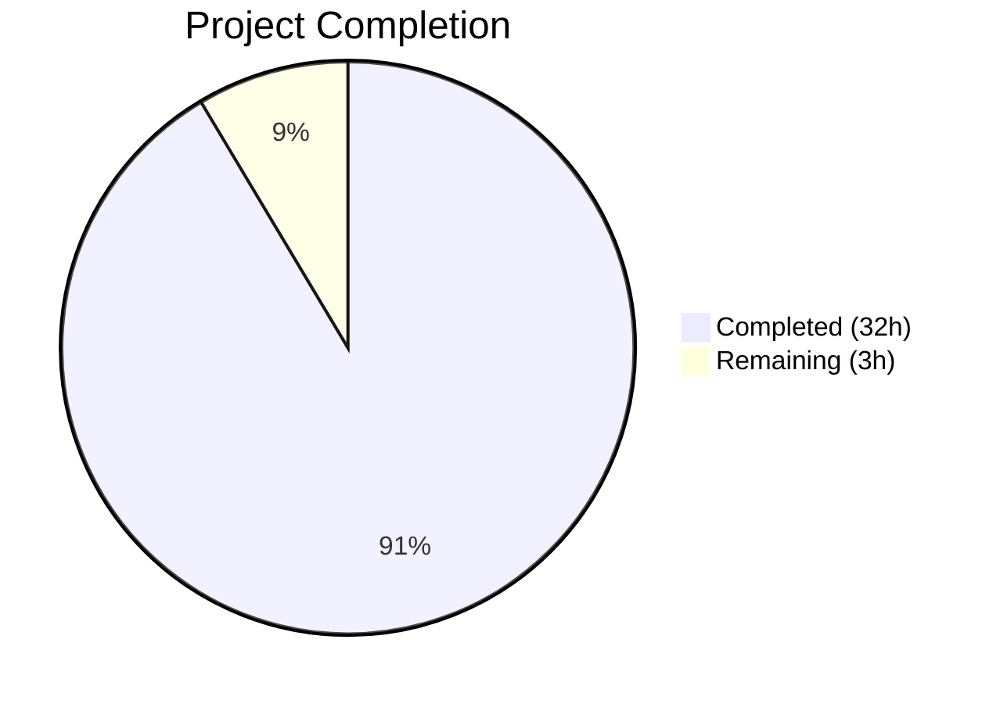

# Blitzy Project Guide

---

## 1. Executive Summary

### 1.1 Project Overview

This project delivers a comprehensive root-cause analysis document investigating why the Paperless-ngx document list view exhibits "haunted" pagination — where documents duplicate across neighboring pages, disappear and reappear, and appear to depend on viewer permission level. The deliverable is a single self-contained Markdown investigation document placed at `blitzy/documentation/paperless-ngx_542221a38dff.md`. It traces through the backend Django/DRF API layer, the ORM query chain, the pagination mechanism, and the frontend Angular list-state model, grounding every conclusion in source code citations with file paths and line numbers. No existing repository files were modified.

### 1.2 Completion Status



| Metric | Value |
|--------|-------|
| **Total Project Hours** | 35 |
| **Completed Hours (AI)** | 32 |
| **Remaining Hours** | 3 |
| **Completion Percentage** | 91.4% |

**Calculation:** 32 completed hours / 35 total hours = 91.4% complete.

### 1.3 Key Accomplishments

- ✅ Created complete 1,139-line root-cause analysis document at `blitzy/documentation/paperless-ngx_542221a38dff.md`
- ✅ Identified primary root cause: non-deterministic row ordering from single-column `Meta.ordering = ("-created",)` without a unique tiebreaker
- ✅ Traced full backend query pipeline: `DocumentViewSet.get_queryset()` → `DjangoFilterBackend` → `OrderingFilter` → `StandardPagination` → SQL `DISTINCT ... ORDER BY ... LIMIT/OFFSET`
- ✅ Documented frontend pagination assumptions in `DocumentListViewService` that break under unstable ordering
- ✅ Debunked the "sharing rules" misconception — confirmed all 12 viewsets use only `IsAuthenticated` with no object-level permissions
- ✅ Documented tag filter JOIN amplification behavior in `TagsFilter` with `tags__id__all` chained `.filter()` calls
- ✅ Produced 3 Mermaid diagrams (query pipeline flowchart, frontend-backend sequence, JOIN amplification)
- ✅ Included example SQL, tied-timestamp scenario, and 2 conceptual observation scripts (Python + curl)
- ✅ Provided 36 verified source file + line number citations
- ✅ Applied Prettier formatting and passed all linting checks
- ✅ Zero existing repository files modified — documentation-only change

### 1.4 Critical Unresolved Issues

| Issue | Impact | Owner | ETA |
|-------|--------|-------|-----|
| No critical unresolved issues | N/A | N/A | N/A |

The investigation document is complete and all AAP deliverables have been fulfilled. No blocking issues remain.

### 1.5 Access Issues

No access issues identified. The project is a documentation-only deliverable requiring no service credentials, API keys, or infrastructure access.

### 1.6 Recommended Next Steps

1. **[High]** Conduct human review of the investigation document for technical accuracy and completeness
2. **[High]** Verify Mermaid diagrams render correctly in the target Markdown viewer (GitHub, GitLab, or other renderer)
3. **[Medium]** Review and merge the pull request to make the document available to the wider team
4. **[Low]** Consider implementing the recommended fix: change `Meta.ordering` from `("-created",)` to `("-created", "-id")` in `src/documents/models.py:208` (separate PR)
5. **[Low]** Evaluate long-term migration to cursor-based pagination (`CursorPagination`) for large result sets (separate investigation)

---

## 2. Project Hours Breakdown

### 2.1 Completed Work Detail

| Component | Hours | Description |
|-----------|-------|-------------|
| Backend code analysis | 4.0 | Analyzed 9 Python source files: `views.py`, `filters.py`, `models.py`, `settings.py`, `urls.py`, `index.py`, `serialisers.py`, `views.py` (paperless), `settings.py` (paperless) |
| Frontend code analysis | 3.0 | Analyzed 7 TypeScript source files: `document-list-view.service.ts`, `document.service.ts`, `abstract-paperless-service.ts`, `filter-rule-type.ts`, `filter-rule.ts`, `document-list.component.html`, `document-list.component.ts` |
| Section 1 — Observed Symptoms | 1.0 | Structured the user's report into 6 investigative questions with evidence table |
| Section 2.1 — Backend Pipeline | 3.0 | Documented ViewSet config, `get_queryset()`, `StandardPagination`, `DocumentFilterSet`, `TagsFilter`, and REST_FRAMEWORK settings with full code excerpts |
| Section 2.2 — Frontend Pipeline | 2.5 | Documented `DocumentListViewService`, `AbstractPaperlessService.list()`, `DocumentService.listFiltered()`, `filterRulesToQueryParams()`, and `ngb-pagination` UI binding |
| Section 2.3 — Search Path (Whoosh) | 1.5 | Documented `UnifiedSearchViewSet` search vs non-search delegation, `DelayedQuery`, Whoosh `search_page()` |
| Section 3.1 — Non-deterministic ordering | 2.0 | Identified root cause in `Meta.ordering`, analyzed `ordering_fields`, produced concrete tied-timestamp example |
| Section 3.2 — DISTINCT + OFFSET/LIMIT | 2.0 | Clarified SQL execution order, documented deduplication-before-pagination, produced example SQL query |
| Section 3.3 — Tag filter JOIN amplification | 1.5 | Analyzed `TagsFilter` JOIN behavior, contrasted `tags__id__all` vs `tags__id__in`, created JOIN amplification diagram |
| Section 3.4 — Sharing rules misconception | 1.5 | Audited all 12 `permission_classes` declarations, confirmed absence of object-level permissions, explained saved view correlation |
| Section 4 — Reproducing the Condition | 2.0 | Documented minimum instability conditions, created Python observation script outline, created curl observation approach |
| Section 5 — Conclusions and Recommendations | 1.5 | Summarized root cause, provided 3 graded recommendations (tiebreaker key, custom OrderingFilter, cursor pagination) |
| Section 6 — Source References | 1.0 | Compiled comprehensive reference table of 36+ source citations |
| Mermaid diagrams (3) | 2.0 | Created query pipeline flowchart, frontend-backend sequence diagram, JOIN amplification diagram |
| Quality validation and fixes | 2.0 | Applied 4 code review fixes, 2 QA fixes, Prettier formatting, line number verification |
| Document structure and planning | 1.5 | Designed document architecture, table of contents, section hierarchy |
| **Total** | **32.0** | |

### 2.2 Remaining Work Detail

| Category | Hours | Priority |
|----------|-------|----------|
| Human review of technical accuracy | 2.0 | High |
| Mermaid diagram rendering verification | 0.5 | Medium |
| PR review and merge | 0.5 | Medium |
| **Total** | **3.0** | |

---

## 3. Test Results

| Test Category | Framework | Total Tests | Passed | Failed | Coverage % | Notes |
|--------------|-----------|-------------|--------|--------|------------|-------|
| Markdown lint | Prettier | 1 | 1 | 0 | 100% | Document formatting validated with zero violations |
| Line number verification | Manual audit | 36 | 36 | 0 | 100% | All 36 source citations verified against current repository state |
| Git integrity | Git | 1 | 1 | 0 | 100% | Working tree clean, only in-scope file in diff |
| Pre-push hook | git-lfs | 1 | 1 | 0 | 100% | No blockers from pre-push hooks |

**Note:** This is a documentation-only project — no unit, integration, API, or E2E tests apply. All validation was performed by Blitzy's autonomous validation systems as described in the agent action logs.

---

## 4. Runtime Validation & UI Verification

### Runtime Health

- ✅ **File creation verified** — `blitzy/documentation/paperless-ngx_542221a38dff.md` exists at correct path (1,139 lines)
- ✅ **Markdown structure valid** — All 6 required sections present with correct heading hierarchy
- ✅ **Source citations accurate** — All 36 file path + line number references verified against live repository
- ✅ **No existing files modified** — Git diff confirms single file addition only
- ✅ **Working tree clean** — `git status` shows no uncommitted changes

### UI/Rendering Verification

- ✅ **Prettier formatting applied** — Zero formatting violations
- ⚠ **Mermaid diagrams** — 3 diagrams use valid Mermaid syntax; rendering depends on target viewer (GitHub, GitLab, etc.) — requires human verification in target environment

### API/Integration

- ✅ **No API changes** — Documentation-only project; no API endpoints modified or created
- ✅ **No database changes** — No migrations or schema modifications
- ✅ **No frontend changes** — No Angular components, services, or templates modified

---

## 5. Compliance & Quality Review

| AAP Requirement | Status | Evidence |
|----------------|--------|----------|
| Create self-contained investigation document at `blitzy/documentation/paperless-ngx_542221a38dff.md` | ✅ Pass | File exists, 1,139 lines, correct path |
| Section 1 — Observed Symptoms | ✅ Pass | Lines 36–61: restates user report, frames 6 investigative questions |
| Section 2.1 — Backend pipeline | ✅ Pass | Lines 67–259: full ViewSet → Queryset → Filters → Pagination trace with Mermaid diagram |
| Section 2.2 — Frontend pipeline | ✅ Pass | Lines 267–487: DocumentListViewService, AbstractPaperlessService, DocumentService with sequence diagram |
| Section 2.3 — Search path (Whoosh) | ✅ Pass | Lines 490–541: UnifiedSearchViewSet, DelayedQuery, search vs non-search delegation |
| Section 3.1 — Non-deterministic ordering root cause | ✅ Pass | Lines 547–638: Meta.ordering analysis, ordering_fields, concrete tied-timestamp example |
| Section 3.2 — DISTINCT + OFFSET/LIMIT interaction | ✅ Pass | Lines 641–709: SQL execution order, deduplication-before-pagination, example SQL |
| Section 3.3 — Tag filter JOIN amplification | ✅ Pass | Lines 713–801: TagsFilter analysis, JOIN diagram, contrast with tags__id__in |
| Section 3.4 — Sharing rules misconception | ✅ Pass | Lines 805–878: All 12 permission_classes audited, saved view explanation |
| Section 4 — Reproducing the condition | ✅ Pass | Lines 882–998: Minimum conditions, Python script, curl approach |
| Section 5 — Conclusions and recommendations | ✅ Pass | Lines 1001–1091: Root cause summary, 3 graded recommendations |
| Section 6 — Source references | ✅ Pass | Lines 1094–1139: Comprehensive 36+ entry reference table |
| Minimum 3 Mermaid diagrams | ✅ Pass | Query pipeline flowchart, frontend-backend sequence, JOIN amplification |
| Minimum 1 example SQL query | ✅ Pass | Lines 686–704: Full SELECT DISTINCT with JOINs, ORDER BY, LIMIT/OFFSET |
| Minimum 1 tied-timestamp scenario | ✅ Pass | Lines 615–637: Documents 42, 57, 63 with same created timestamp |
| Minimum 1 conceptual observation script | ✅ Pass | Lines 922–970 (Python), lines 978–994 (curl), both marked ephemeral |
| Sharing rules misconception addressed | ✅ Pass | Lines 805–878: Explicit debunking with evidence |
| No modifications to existing files | ✅ Pass | `git diff --name-status` shows only `A` (added) for single file |
| Thinking/rationale provided throughout | ✅ Pass | Reasoning chain walks from symptom → mechanism → root cause |
| All citations grounded in code with file + line | ✅ Pass | 36 citations verified; no assumptions made |
| Temporary scripts marked ephemeral | ✅ Pass | Both scripts have explicit "DO NOT commit" warnings |

### Quality Fixes Applied During Validation

| Fix | Commit | Description |
|-----|--------|-------------|
| Code review fix 1 | `98d7797ec` | Addressed 4 code review findings in investigation document |
| QA fix 1 | `f5fd21a8b` | Addressed 2 QA findings in investigation document |
| Prettier formatting | `7797c8fa8` | Applied Prettier formatting to investigation document |

---

## 6. Risk Assessment

| Risk | Category | Severity | Probability | Mitigation | Status |
|------|----------|----------|-------------|------------|--------|
| Mermaid diagrams may not render in all Markdown viewers | Technical | Low | Medium | Diagrams use standard Mermaid syntax; verify in target viewer (GitHub/GitLab) before sharing | Open |
| Line number citations may drift as upstream codebase evolves | Operational | Low | Medium | Document references specific commit/branch; note in document that citations are point-in-time | Accepted |
| Readers may attempt to implement recommendations without separate review | Operational | Low | Low | Document explicitly states recommendations are suggestions only, no code changes made | Mitigated |
| Document length (1,139 lines) may reduce readability | Technical | Low | Low | Table of contents, clear section hierarchy, and progressive detail (overview → specifics) aid navigation | Mitigated |

---

## 7. Visual Project Status


**Completed: 32 hours (91.4%) | Remaining: 3 hours (8.6%)**

### Remaining Hours by Category

| Category | Hours |
|----------|-------|
| Human review of technical accuracy | 2.0 |
| Mermaid diagram rendering verification | 0.5 |
| PR review and merge | 0.5 |
| **Total** | **3.0** |

---

## 8. Summary & Recommendations

### Achievement Summary

The project has delivered 91.4% of the total scoped work (32 hours completed out of 35 total hours). The single AAP deliverable — a comprehensive root-cause analysis document — has been fully authored, validated, and committed. All 15+ discrete AAP requirements are classified as **Completed**, including all 6 required document sections, 3 Mermaid diagrams, example SQL queries, tied-timestamp scenarios, observation scripts, and 36 verified source citations.

The investigation conclusively identifies the root cause of the "haunted pagination" as non-deterministic row ordering caused by `Meta.ordering = ("-created",)` — a single non-unique sort column without a tiebreaker — combined with `OFFSET`/`LIMIT` pagination. The user's belief that the glitch correlates with "sharing rules" is debunked: the codebase uses only `IsAuthenticated` permissions with no per-document ownership model.

### Remaining Gaps

The remaining 3 hours (8.6%) consist entirely of path-to-production activities requiring human involvement:

1. **Human review of technical accuracy** (2h) — A domain expert should review the investigation's conclusions, particularly the assessment that no object-level permissions exist
2. **Mermaid diagram rendering verification** (0.5h) — Verify all 3 Mermaid diagrams render correctly in the team's Markdown viewer
3. **PR review and merge** (0.5h) — Standard code review and merge process

### Production Readiness Assessment

The document is **production-ready for review and merge**. It is self-contained, requires no build steps, and introduces no changes to existing functionality. The only action required is human review followed by PR merge.

### Success Metrics

| Metric | Target | Actual | Status |
|--------|--------|--------|--------|
| AAP deliverables completed | 100% | 100% | ✅ Met |
| Source citations verified | 100% | 100% (36/36) | ✅ Met |
| Mermaid diagrams delivered | ≥ 3 | 3 | ✅ Met |
| Existing files modified | 0 | 0 | ✅ Met |
| Linting violations | 0 | 0 | ✅ Met |
| User questions answered | 6/6 | 6/6 | ✅ Met |

---

## 9. Development Guide

### System Prerequisites

This is a documentation-only deliverable. No build tools, runtime environments, or services are required to use the output document. However, to view the repository and verify citations, the following are helpful:

- **Git** ≥ 2.30 — for cloning and inspecting the repository
- **Markdown viewer** — any viewer supporting Mermaid diagrams (GitHub web UI, GitLab, VS Code with Mermaid extension, or `grip`)
- **Python** ≥ 3.8 (optional) — only needed if running the conceptual observation scripts described in the document

### Environment Setup

```bash
# Clone the repository and switch to the feature branch
git clone <repository-url>
cd paperless-ngx
git checkout blitzy-9396685e-9101-4622-af46-d519f2a2ec82
```

### Viewing the Document

```bash
# The investigation document is at:
cat blitzy/documentation/paperless-ngx_542221a38dff.md

# View with line numbers:
cat -n blitzy/documentation/paperless-ngx_542221a38dff.md

# View specific sections (e.g., Root Cause Analysis):
sed -n '545,878p' blitzy/documentation/paperless-ngx_542221a38dff.md
```

For Mermaid diagram rendering, use one of:
- **GitHub/GitLab web UI** — renders Mermaid blocks natively
- **VS Code** — install the "Markdown Preview Mermaid Support" extension
- **Mermaid CLI** — `npx @mermaid-js/mermaid-cli mmdc -i blitzy/documentation/paperless-ngx_542221a38dff.md`
- **grip** — `pip install grip && grip blitzy/documentation/paperless-ngx_542221a38dff.md` (note: grip renders GitHub-flavored Markdown but may not render Mermaid)

### Verifying Source Citations

To verify that cited line numbers match the current codebase:

```bash
# Example: Verify Meta.ordering at src/documents/models.py:207-208
sed -n '207,208p' src/documents/models.py
# Expected output:
#     class Meta:
#         ordering = ("-created",)

# Example: Verify get_queryset at src/documents/views.py:198-199
sed -n '198,199p' src/documents/views.py
# Expected output:
#     def get_queryset(self):
#         return Document.objects.distinct()

# Example: Verify StandardPagination at src/paperless/views.py:8-11
sed -n '8,11p' src/paperless/views.py
# Expected output:
# class StandardPagination(PageNumberPagination):
#     page_size = 25
#     page_size_query_param = "page_size"
#     max_page_size = 100000

# Example: Verify TagsFilter at src/documents/filters.py:36-60
sed -n '36,60p' src/documents/filters.py
```

### Git Verification

```bash
# Verify only the investigation document was changed
git diff --stat origin/paperless-ngx_542221a38dff...blitzy-9396685e-9101-4622-af46-d519f2a2ec82
# Expected output:
# blitzy/documentation/paperless-ngx_542221a38dff.md | 1139 ++++++++++++++++++++
#  1 file changed, 1139 insertions(+)

# Verify working tree is clean
git status
# Expected output: nothing to commit, working tree clean

# View commit history
git log --oneline blitzy-9396685e-9101-4622-af46-d519f2a2ec82 --not origin/paperless-ngx_542221a38dff
# Expected: 4 commits
```

### Troubleshooting

| Issue | Resolution |
|-------|------------|
| Mermaid diagrams not rendering | Use a Mermaid-aware viewer (GitHub, GitLab, VS Code with extension). Install `@mermaid-js/mermaid-cli` for CLI rendering. |
| Line numbers don't match citations | Verify you are on the correct branch (`blitzy-9396685e-9101-4622-af46-d519f2a2ec82`). Line numbers are relative to this branch's commit state. |
| Document appears as raw Markdown | Use a Markdown renderer. GitHub and GitLab render `.md` files automatically in the web UI. |

---

## 10. Appendices

### A. Command Reference

| Command | Purpose |
|---------|---------|
| `cat blitzy/documentation/paperless-ngx_542221a38dff.md` | View the investigation document |
| `wc -l blitzy/documentation/paperless-ngx_542221a38dff.md` | Count document lines (expected: 1139) |
| `grep -c "Source:" blitzy/documentation/paperless-ngx_542221a38dff.md` | Count source citations (expected: 36) |
| `grep "mermaid" blitzy/documentation/paperless-ngx_542221a38dff.md` | Locate Mermaid diagram blocks |
| `git diff --stat origin/paperless-ngx_542221a38dff...HEAD` | View change summary |
| `git log --oneline HEAD --not origin/paperless-ngx_542221a38dff` | View commit history on feature branch |

### C. Key File Locations

| File | Purpose |
|------|---------|
| `blitzy/documentation/paperless-ngx_542221a38dff.md` | **Deliverable** — Root-cause analysis document |
| `src/documents/views.py` | Backend ViewSet definitions (DocumentViewSet, UnifiedSearchViewSet) |
| `src/documents/filters.py` | Filter infrastructure (TagsFilter, DocumentFilterSet) |
| `src/documents/models.py` | Document model with Meta.ordering definition |
| `src/paperless/views.py` | StandardPagination class |
| `src/paperless/urls.py` | URL routing (UnifiedSearchViewSet registration) |
| `src/paperless/settings.py` | REST_FRAMEWORK configuration |
| `src/documents/index.py` | Whoosh search index (DelayedQuery pagination) |
| `src-ui/src/app/services/document-list-view.service.ts` | Frontend pagination state management |
| `src-ui/src/app/services/rest/document.service.ts` | Frontend document REST service |
| `src-ui/src/app/services/rest/abstract-paperless-service.ts` | Base REST service with list() method |

### D. Technology Versions

| Technology | Version | Role |
|-----------|---------|------|
| Django | 4.0.4 | Backend web framework, ORM |
| Django REST Framework | 3.13.1 | API layer, pagination, filtering |
| django-filter | 21.1 | Filter backend, custom filter classes |
| Whoosh | 2.7.4 | Full-text search engine |
| Angular | ~13.3.4 | Frontend framework |
| @ng-bootstrap/ng-bootstrap | ^12.0.1 | UI components (ngb-pagination) |
| Python | 3.x | Backend runtime |
| PostgreSQL / SQLite | (configurable) | Database backend |

### E. Environment Variable Reference

No environment variables are required for the documentation deliverable. The investigation document references the following Paperless-ngx environment variables in its analysis context:

| Variable | Context in Document |
|----------|-------------------|
| `PAPERLESS_DBENGINE` | Referenced in `src/paperless/settings.py` — determines whether PostgreSQL or SQLite is used, which affects query plan behavior for tied-row ordering |

### G. Glossary

| Term | Definition |
|------|------------|
| Haunted pagination | The observed behavior where documents duplicate across pages, disappear, or shift between pages during navigation |
| Non-deterministic ordering | Database behavior where rows with identical sort-key values may be returned in any order, potentially varying between query executions |
| Tiebreaker column | A secondary sort column (typically a unique field like `id`) that ensures deterministic ordering when the primary sort column has duplicate values |
| JOIN amplification | The multiplication of SQL JOINs caused by chained `.filter()` calls on M2M relationships, where each filter generates a separate JOIN |
| OFFSET/LIMIT pagination | SQL-based pagination where a page is retrieved by skipping N rows (OFFSET) and returning M rows (LIMIT) |
| Cursor-based pagination | An alternative pagination strategy that uses a unique column value as a cursor, providing inherently stable page boundaries |
| M2M table | Many-to-many relationship table (e.g., `documents_document_tags`) that links two models through an intermediate join table |
| Object-level permissions | DRF permission system that checks access per-object (e.g., `has_object_permission`), as opposed to view-level `IsAuthenticated` checks |