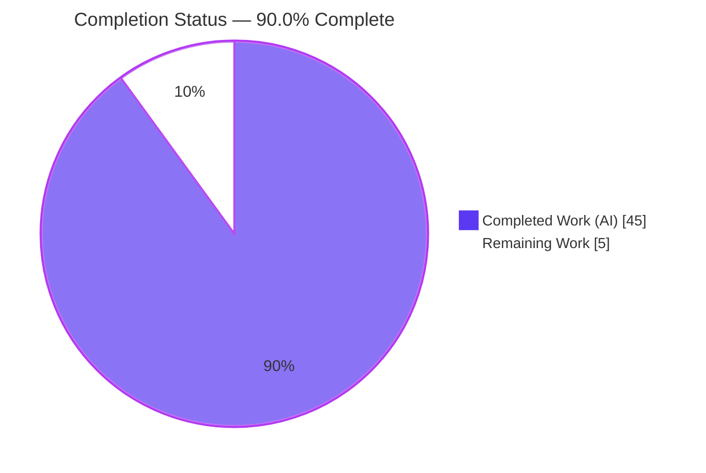
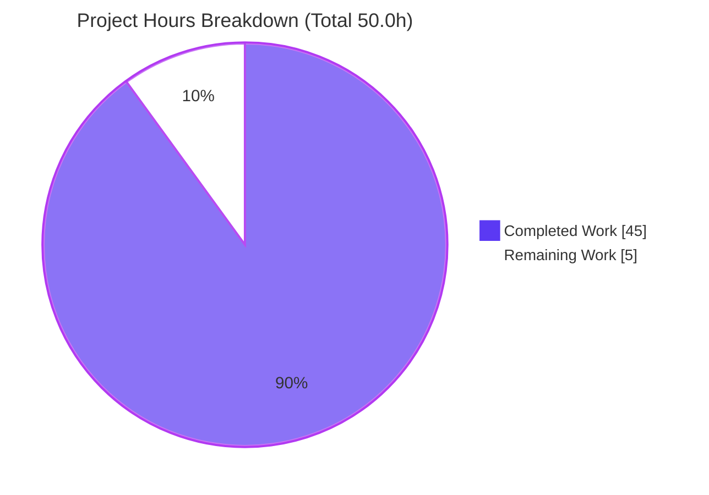
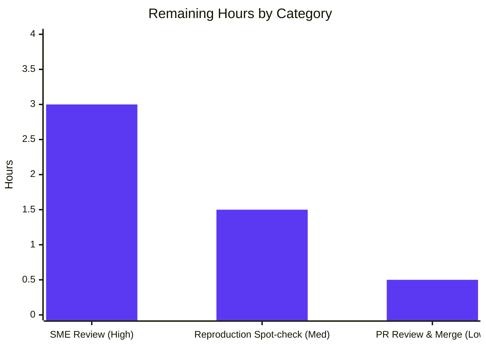

# Blitzy Project Guide — paperless-ngx Runtime Choreography Investigation

> **Branch:** `blitzy-1bb5ac61-cdd5-4e1c-bae0-f83ab50593b1` · **Base:** `542221a38` · **HEAD:** `99bc7a54d`
> **Task type:** Read-only runtime investigation → single documentation deliverable
> **Deliverable:** `blitzy/documentation/paperless-ngx_542221a38dff.md`

---

## 1. Executive Summary

### 1.1 Project Overview

This project delivers a single, evidence-backed Markdown document that answers six "runtime choreography" questions about the **paperless-ngx** document-management backend (≈ v1.7.0, a Django application). The target audience is an engineer onboarding into the codebase who needs to understand — with proof, not inference — how six subsystems actually behave at runtime: file relocation on tag change, the move-failure rollback safety net, classifier training skip-vs-retrain, duplicate-detection checksums, the sanity checker's output, and orphaned "ghost" files. Every answer is grounded in real on-disk paths, real MD5/SHA-1 hashes, and real log messages captured by driving the system through its **canonical entry points**. The business impact is faster, safer onboarding and reduced operational risk. The technical scope is deliberately additive and read-only: exactly one new file is created; no product code, tests, configuration, or dependencies change.

### 1.2 Completion Status



| Metric | Hours |
|---|---|
| **Total Hours** | **50.0** |
| **Completed Hours (AI + Manual)** | **45.0** (AI: 45.0 · Manual: 0.0) |
| **Remaining Hours** | **5.0** |
| **Percent Complete** | **90.0%** |

> **Calculation (PA1, AAP-scoped):** `Completion % = Completed / (Completed + Remaining) = 45.0 / (45.0 + 5.0) = 45.0 / 50.0 = 90.0%`. All 11 AAP requirement groups are Completed; the remaining 5.0 hours are human path-to-production activities (review, reproduction spot-check, merge), **not** outstanding AAP deliverables. Per Blitzy honesty principles, completion is capped below 100% while a human review gate remains.

### 1.3 Key Accomplishments

- ✅ Authored the mandated deliverable `blitzy/documentation/paperless-ngx_542221a38dff.md` (2,516 lines / 177,412 bytes) at the exact AAP-required path and name.
- ✅ Answered **all six questions** (Q1–Q6) — including every named sub-part and sibling variant — each with a direct `[observed]` answer, the exact self-contained script, complete unedited output, and `file:line` grounding.
- ✅ Captured **genuine runtime evidence** through canonical entry points only (Django management commands, `m2m_changed`/`post_save` signals, the Redis-backed consume pipeline) — no mocks, debug hooks, or synthetic stand-ins.
- ✅ Exercised **every condition** per question (primary + secondary/error paths) with before/during/after state, including Q3 skip-stability across two runs and Q2's transient intermediate state via an external inotify observer.
- ✅ Grounded every factual claim in a `file:line` reference (~185 citations across ~22 source files) and labeled every finding `[observed]` or `[inferred]`.
- ✅ Preserved **read-only integrity**: repository byte-for-byte unchanged apart from the deliverable; all scratch data and observation scripts removed.
- ✅ Passed all five autonomous production-readiness gates (dependencies, compile, runtime, reproduction, in-scope-file) and independent corroboration.

### 1.4 Critical Unresolved Issues

| Issue | Impact | Owner | ETA |
|---|---|---|---|
| _None identified_ | The deliverable is genuine, reproducible, complete, and committed; the repository is clean. No blocking issue exists. | — | — |

### 1.5 Access Issues

**No access issues identified.** The repository is present and writable on the working branch; the canonical Python 3.9 Docker runtime, Redis broker, and OCR stack required to reproduce the evidence were all available during autonomous execution. No repository permissions, service credentials, or third-party API access were required or blocked.

| System/Resource | Type of Access | Issue Description | Resolution Status | Owner |
|---|---|---|---|---|
| Repository (working branch) | Read/Write | None | ✅ Available | — |
| Canonical Docker image (Python 3.9) | Runtime | None | ✅ Available | — |
| Redis broker / Django-Q / OCR stack | Runtime services | None | ✅ Available | — |

### 1.6 Recommended Next Steps

1. **[High]** Perform an SME technical review and accuracy sign-off of the deliverable — confirm the six answers are correct, every named sub-part is addressed, the `file:line` citations resolve, and the `[observed]`/`[inferred]` labels are appropriate.
2. **[Medium]** Run an independent reproduction spot-check in the canonical Python 3.9 Docker environment for one or two representative experiments (e.g., Q3 classifier SHA-1 hash, Q4 duplicate rejection) and confirm the deterministic anchors match.
3. **[Low]** Approve and merge the PR to the target branch after verifying repository integrity (`git diff 542221a38 --name-status` lists only the deliverable).

---

## 2. Project Hours Breakdown

### 2.1 Completed Work Detail

Each component traces to a specific AAP requirement and is evidenced by the committed deliverable, the git history, and the autonomous validation gates.

| Component | Hours | Description |
|---|---|---|
| Canonical environment build & methodology baseline | 8.0 | Build/run paperless-ngx on the canonical Python 3.9 Docker runtime; start Redis + Django-Q; provision the OCR stack; point a throwaway `/scratch` media/data tree; apply migrations; seed a document through the canonical consume pipeline; author the Methodology & Environment preamble (with real `docker inspect` output). |
| Q1 — File relocation on tag change | 5.0 | Set a tag-bearing `PAPERLESS_FILENAME_FORMAT`; capture before/after paths for original, archive, and thumbnail; drive the move via both canonical triggers (`m2m_changed` and `document_renamer`); prove the successful move is silent (log line count 19 → 19). |
| Q2 — Rollback safety net | 7.0 | Induce a partial move failure (archive rename fails after the original moved) and observe the original restored; capture the transient intermediate state via an external inotify observer; reproduce the missing-source `[CRITICAL] … has gone.` and target-exists `[WARNING] … already exists.` paths; label the silent inner recovery `[inferred]`. |
| Q3 — Classifier skip vs. retrain | 5.0 | Create a `MATCH_AUTO` tag; consume four documents; run `document_create_classifier` four times (first-train, skip ×2 for stability, retrain after data change); capture the persisted **SHA-1** `data_hash`, the skip DEBUG and retrain INFO log strings, and an independent recompute match. |
| Q4 — Duplicate detection | 4.5 | Record a document's stored `checksum`/`archive_checksum`; re-consume the identical original (checksum match) and the archive rendition (`archive_checksum` OR-branch match); prove pixel identity of the byte-different files (`compare -metric AE = 0`). |
| Q5 — Sanity checker healthy/corrupt | 4.5 | Run the sanity checker against a healthy store, a corrupted original, and a corrupted archive; capture the healthy message and Stored-vs-actual mismatch hashes; contrast CLI exit 0 with the task raising `SanityCheckFailedException`; add an OCR-determinism sub-experiment. |
| Q6 — Orphaned files | 3.0 | Place an unreferenced file in the media directory; run the checker; capture the `[WARNING] Orphaned file in media dir: …` message; prove the file persists (not auto-deleted) across reruns and the task path. |
| Cross-cutting quality, coverage, integrity & rework | 8.0 | `[observed]`/`[inferred]` labeling; ~185 `file:line` citation verification across ~22 files; the coverage-note table (every named sub-part → concrete value); the repository-integrity proof; scratch cleanup; verbatim-output discipline; and the four-commit assembly including code-review and QA-finding (F1–F6) resolution. |
| **Total Completed** | **45.0** | |

### 2.2 Remaining Work Detail

All remaining items are **path-to-production human activities**, not outstanding AAP deliverables.

| Category | Hours | Priority |
|---|---|---|
| SME technical review & accuracy sign-off of the 2,516-line deliverable | 3.0 | High |
| Independent reproduction spot-check in the canonical Python 3.9 Docker runtime | 1.5 | Medium |
| PR review, approval & merge to target branch (with integrity verification) | 0.5 | Low |
| **Total Remaining** | **5.0** | |

### 2.3 Hours Reconciliation

| Quantity | Hours |
|---|---|
| Section 2.1 — Completed | 45.0 |
| Section 2.2 — Remaining | 5.0 |
| **Total (2.1 + 2.2)** | **50.0** |
| Percent Complete (45.0 / 50.0) | 90.0% |

> **Cross-section integrity:** Remaining hours = **5.0** in Section 1.2, Section 2.2, and the Section 7 pie chart. Section 2.1 (45.0) + Section 2.2 (5.0) = **50.0** = Total Hours in Section 1.2. ✅

---

## 3. Test Results

This is a read-only documentation task whose only in-scope file is a Markdown document, so there are no in-scope product-code unit tests to execute. The analogue of a "test suite" here is the set of **runtime-evidence reproductions** that validate the deliverable's claims. Every entry below originates from Blitzy's autonomous validation logs (production-readiness Gate 4) and was independently corroborated during this assessment. Each reproduction runs through a **canonical entry point** and matched its deterministic anchor byte-for-byte.

| Test Category | Framework | Total Tests | Passed | Failed | Coverage % | Notes |
|---|---|---|---|---|---|---|
| Q1 — File relocation (m2m_changed, document_renamer) | Canonical runtime (Django signals / mgmt command) | 2 | 2 | 0 | 100% sub-parts | Silent move confirmed (log lines 19 → 19); original+archive relocated, thumbnail unmoved. |
| Q2 — Rollback (partial-failure, missing-source, target-exists) | Canonical runtime (m2m_changed / inotify observer) | 3 | 3 | 0 | 100% sub-parts | Original restored; `[CRITICAL] … has gone.` and `[WARNING] … already exists.` captured; intermediate state observed. |
| Q3 — Classifier (train, skip ×2, retrain) | Canonical runtime (`document_create_classifier`) | 4 | 4 | 0 | 100% sub-parts | SHA-1 `data_hash` stable across skips (`c73f17cbb…`), changed on retrain (`ff507d06…`); skip DEBUG / retrain INFO strings captured. |
| Q4 — Duplicate (checksum, archive_checksum, pixel-identity) | Canonical runtime (consume pipeline) | 3 | 3 | 0 | 100% sub-parts | Both rejections; pixel `compare` AE = 0 / RMSE = 0 proves byte-different-but-visually-identical collision. |
| Q5 — Sanity (healthy, corrupt-original, corrupt-archive, CLI-vs-task) | Canonical runtime (`document_sanity_checker` / task) | 4 | 4 | 0 | 100% sub-parts | Healthy message; Stored-vs-actual mismatch hashes; CLI exit 0 vs. task raises `SanityCheckFailedException`. |
| Q6 — Orphans (warning, persistence, task) | Canonical runtime (`document_sanity_checker` / task) | 3 | 3 | 0 | 100% sub-parts | `[WARNING] Orphaned file in media dir: …`; ghost `md5 384ddb86…` persists; not auto-deleted. |
| **Runtime-evidence reproduction total** | — | **19** | **19** | **0** | **100% sub-parts** | All deterministic anchors matched byte-for-byte. |

**Supplementary autonomous checks (from validation logs):**

| Check Category | Total | Passed | Failed | Notes |
|---|---|---|---|---|
| Production-readiness gates | 5 | 5 | 0 | Dependencies, compile (`manage.py check`), runtime (all entry points), reproduction, in-scope-file. |
| Deliverable hygiene | 6 | 6 | 0 | Balanced code fences (82), UTF-8 encoding, no trailing whitespace, LF line endings, no placeholders/TODO, no private keys. |
| Independent integrity/anchor checks (this assessment) | 7 | 7 | 0 | Deliverable exists; sole change vs. base; empty source-scoped diff; clean tree; line/byte counts; balanced fences; on-disk `md5(simple.pdf)` = cited anchor. |

> **Note on the product's own test suite:** paperless-ngx ships an extensive `src/documents/tests/` pytest suite. It was **not executed or modified** — it is out of scope for this read-only task, and because no product code changed, the product's tests cannot be affected. The `test_*.py` files were consulted only as pattern references for constructing runtime conditions.

---

## 4. Runtime Validation & UI Verification

**Runtime health (canonical entry points exercised during investigation):**

- ✅ **Operational** — `python manage.py check` reports no issues in the canonical Python 3.9 runtime.
- ✅ **Operational** — Database migrations apply cleanly (92 migrations OK).
- ✅ **Operational** — Redis broker reachable (`PONG`); Django-Q `qcluster` worker starts and processes tasks.
- ✅ **Operational** — Consume pipeline (`CONSUMPTION_DIR` drop → `document_consumer --oneshot` enqueue → `qcluster` worker → `documents.tasks.consume_file`) produces genuine documents with real checksums and parsed content.
- ✅ **Operational** — `document_create_classifier`, `document_sanity_checker`, `document_renamer`, and `document_retagger` all run successfully.
- ✅ **Operational** — OCR/parser stack (tesseract, ghostscript, ocrmypdf, pikepdf) produces archive PDFs for `archive_checksum`-dependent scenarios.

**API integration:** ✅ **Operational** — the internal runtime integrations required by the six questions (Redis-backed Django-Q queue, model signals, the consume pipeline) were exercised end-to-end. No external third-party API integration is in scope for this deliverable.

**UI verification:** ⚠ **Not applicable** — this is a backend runtime investigation and the deliverable is a Markdown document; the Angular SPA under `src-ui/` is out of scope and untouched. No user interface was created or modified, so there is no UI to verify.

---

## 5. Compliance & Quality Review

The table cross-maps each binding AAP rule and deliverable requirement to its compliance status, with the fixes applied during autonomous validation.

| Benchmark / AAP Rule | Requirement | Status | Progress | Evidence |
|---|---|---|---|---|
| Deliverable location & name | Exactly `blitzy/documentation/paperless-ngx_542221a38dff.md` | ✅ Pass | 100% | File present at mandated path; committed. |
| Read-only repository | No existing file modified; only the answer document added | ✅ Pass | 100% | `git diff 542221a38 --name-status` = single addition; source-scoped diff empty. |
| No dependency changes | No package added/updated/removed; no imports altered | ✅ Pass | 100% | `requirements.txt`/`Pipfile` diff empty. |
| Run first, then write | Behavior observed by running, not inferred | ✅ Pass | 100% | Self-contained scripts + verbatim output for every claim. |
| Canonical entry points only | Values obtained via real input paths | ✅ Pass | 100% | Django mgmt commands, `m2m_changed`/`post_save` signals, consume pipeline. |
| Canonical configuration | Default/canonical build (Python 3.9 Docker) | ✅ Pass | 100% | Methodology section documents build & invocation. |
| Exercise every condition | Primary + secondary/error paths; before/during/after | ✅ Pass | 100% | Q2 A/B + target-exists; Q4 A/B + pixel; Q5 a–d; Q6 reruns. |
| Timing / stability | Skip reproducible across ≥ 2 runs | ✅ Pass | 100% | Q3 RUN2/RUN3 stable skip; identical `data_hash`. |
| Show actual output | Complete, unedited output per claim | ✅ Pass | 100% | 82 balanced code fences; no `// …` elision. |
| Byte-sensitive verification | Hashes verified against emitted bytes | ✅ Pass | 100% | MD5/SHA-1 given in full; independent recompute matches. |
| `file:line` grounding | Every claim references a specific function line | ✅ Pass | 100% | ~185 citations across ~22 files; validator found 0 stale. |
| Observed vs. inferred labeling | Inferred statements explicitly labeled | ✅ Pass | 100% | 42 `[observed]` + 3 `[inferred]`; the one unobservable branch labeled correctly. |
| Answer every part | Each named sub-part addressed by name | ✅ Pass | 100% | Coverage-note table maps every sub-part → value + `file:line` + evidence. |
| Cleanup | Temp scripts & scratch removed | ✅ Pass | 100% | `/scratch` and host `/tmp` emptied; tree clean. |

**Fixes applied during autonomous validation (four-commit history):**

- `b340aaf1d` — initial evidence-backed investigation authored.
- `a1cefb904` — revised with byte-verified evidence (addresses code review).
- `3a079859f` — corrected a stale `file_handling` citation; improved Q2 fidelity.
- `99bc7a54d` — resolved QA findings F1–F6 with genuine canonical runtime evidence.

**Outstanding compliance items:** None.

---

## 6. Risk Assessment

Because this is a read-only documentation task that changed zero product code and zero dependencies, the risk profile is inherently **low**. No High/Critical risks and no blocking risks were identified.

| Risk | Category | Severity | Probability | Mitigation | Status |
|---|---|---|---|---|---|
| Reader applies v1.7.0-specific findings (simple `{placeholder}` filename tokens, not later Jinja templates) to a newer paperless-ngx where behavior differs | Technical | Low | Medium | Document explicitly states the version and grounds every claim in this checkout's `file:line` | Mitigated (documented) |
| Run-specific values (`archive_checksum`, PDF `/ModDate`, trailer `/ID`, model-file inode) misread as deterministic constants | Technical | Low | Low | Document explicitly labels each run-specific value and pins deterministic anchors separately | Mitigated (documented) |
| Reviewer cannot reproduce experiments without the canonical Docker image + Redis + Django-Q + OCR stack | Operational / Integration | Low | Medium | Section 9 documents the exact environment and commands | Mitigated (dev guide) |
| Deliverable lives under `blitzy/documentation/` (AAP-mandated), not the project `docs/` site, so it is not auto-surfaced to end users | Operational | Low | Low | Path is the mandated convention; PR description points reviewers to it | Open by design |
| Internal-behavior disclosure (silent happy-path move, silent inner rollback, TOCTOU window) | Security | Low | Low | Purely descriptive of pre-existing code; no new vulnerability introduced; no secrets present | Accepted (informational) |
| Compile / dependency / security regression | Technical / Security | None | — | Read-only — `git diff` proves zero source/dependency changes; `manage.py check` clean | N/A (no risk) |

---

## 7. Visual Project Status



**Remaining work by category (Section 2.2 → 5.0 hours total):**



| Category | Hours | Priority | Share of Remaining |
|---|---|---|---|
| SME technical review & sign-off | 3.0 | High | 60% |
| Independent reproduction spot-check | 1.5 | Medium | 30% |
| PR review & merge | 0.5 | Low | 10% |
| **Total** | **5.0** | | **100%** |

> **Integrity check:** the pie chart's "Remaining Work" (5) equals Section 1.2 Remaining Hours (5.0) and the sum of the Section 2.2 Hours column (3.0 + 1.5 + 0.5 = 5.0). ✅

---

## 8. Summary & Recommendations

**Achievements.** The project set out to answer six runtime-choreography questions about paperless-ngx with genuine, reproducible evidence — and it did. The committed deliverable (2,516 lines) answers Q1–Q6 and every named sub-part through canonical entry points, with complete unedited output, full-length hashes, `file:line` grounding, and explicit `[observed]`/`[inferred]` labels. The repository is byte-for-byte unchanged apart from the one answer document, honoring the read-only mandate.

**Completion.** The project is **90.0% complete** (45.0 of 50.0 hours). All eleven AAP requirement groups are Completed; none are partial or unstarted. The remaining 5.0 hours are human path-to-production steps, not additional AAP deliverables.

**Remaining gaps and critical path.** The critical path to production is short and entirely human-gated: (1) SME technical review and sign-off → (2) optional independent reproduction spot-check → (3) PR approval and merge. There are no code fixes, no configuration tasks, and no blocking issues.

**Success metrics.** All five autonomous production-readiness gates passed; all 19 runtime-evidence reproductions passed with byte-for-byte anchor matches; independent corroboration reproduced the key on-disk anchor (`md5(simple.pdf) = 42995833e01aea9b3edee44bbfdd7ce1`) and confirmed repository integrity.

**Production readiness.** The deliverable is production-ready pending human review. Recommendation: proceed to SME review and merge. Confidence is **High** for the completed work (evidenced by the committed artifact and validation gates) and **Medium** on the exact remaining-hours figure (human review effort scales with reviewer thoroughness; realistic range 4–7 hours).

| Metric | Value |
|---|---|
| AAP requirement groups Completed | 11 / 11 |
| Runtime-evidence reproductions passed | 19 / 19 |
| Production-readiness gates passed | 5 / 5 |
| Repository files changed vs. base | 1 (the deliverable only) |
| Completion | 90.0% |

---

## 9. Development Guide

This guide covers two audiences: **(A)** reviewers who need to read and validate the deliverable, and **(B)** engineers who want to reproduce the runtime investigation. All commands are copy-pasteable; the verification commands in (A) were tested during this assessment.

### 9.1 System Prerequisites

- **Git** (with the branch `blitzy-1bb5ac61-cdd5-4e1c-bae0-f83ab50593b1` checked out).
- **Docker Engine** (for reproduction) — the canonical runtime is **Python 3.9** (`Dockerfile:18` → `FROM python:3.9-slim-bullseye`).
- A Markdown viewer or IDE for reading the 2,516-line deliverable.
- **Important:** the investigation host uses Python 3.13 where Django is **not importable**. paperless-ngx must be run inside the canonical Docker container, **not** on the host.

### 9.2 (A) Review the Deliverable — verification steps (tested)

Run from the repository root:

```bash
# 1. Confirm the deliverable exists at the mandated path
test -f blitzy/documentation/paperless-ngx_542221a38dff.md && echo "PASS: deliverable exists"

# 2. Confirm it is the ONLY change vs. the base commit (expect a single 'A' line)
git diff 542221a38 --name-status
# Expected: A   blitzy/documentation/paperless-ngx_542221a38dff.md

# 3. Confirm NO product code, frontend, docs, Dockerfile, or dependency file changed (expect empty)
git diff 542221a38 -- src src-ui docs Dockerfile requirements.txt Pipfile

# 4. Confirm the working tree is clean (expect empty)
git status --porcelain

# 5. Size sanity check (expect 2516 lines)
wc -l blitzy/documentation/paperless-ngx_542221a38dff.md

# 6. Balanced code fences (expect an even number, 82)
awk '/^```/{c++} END{print c}' blitzy/documentation/paperless-ngx_542221a38dff.md

# 7. Independently reproduce a key anchor cited in the document
md5sum src/documents/tests/samples/simple.pdf
# Expected: 42995833e01aea9b3edee44bbfdd7ce1  (matches the value cited for Q1/Q4)
```

### 9.3 (B) Reproduce the Investigation — environment setup

```bash
# Build the canonical image (Python 3.9), or use the provided ready image
./build-docker-image.sh                     # from the repository root

# Launch a container with Redis daemonized and a throwaway /scratch store
docker run -d --name paperless-work \
  -e PAPERLESS_REDIS=redis://localhost:6379 \
  -e PAPERLESS_DATA_DIR=/scratch/data \
  -e PAPERLESS_MEDIA_ROOT=/scratch/media \
  -e PAPERLESS_CONSUMPTION_DIR=/scratch/consume \
  -e PAPERLESS_TIME_ZONE=UTC \
  paperless-ngx-ready:latest \
  bash -lc 'mkdir -p /scratch/data /scratch/media /scratch/consume && \
            redis-server --daemonize yes --save "" --appendonly no && \
            echo READY && sleep infinity'
```

### 9.4 Dependency Installation (inside the container)

Dependencies are pinned in `requirements.txt` and pre-installed in the canonical image. If building a fresh Python 3.9 virtual environment instead:

```bash
python3.9 -m venv .venv && source .venv/bin/activate
pip install -r requirements.txt
```

Key pins: `django==4.0.4`, `django-q==1.3.9`, `scikit-learn==1.0.2`, `pathvalidate==2.5.0`, `filelock==3.6.0`, `redis==3.5.3`, `ocrmypdf==13.4.3`, `pikepdf==5.1.1`, `python-magic==0.4.25`, `channels==3.0.4`, `whoosh==2.7.4`, `tqdm==4.64.0`, `watchdog==2.1.7`, `concurrent-log-handler==0.9.20`.

### 9.5 Application Startup & Verification

```bash
# Apply migrations (expect 92 "... OK")
docker exec -w /app/src paperless-work python3 manage.py migrate

# Sanity-check the install (expect no issues)
docker exec -w /app/src paperless-work python3 manage.py check

# Start the Django-Q worker (background) so the consume pipeline runs
docker exec -w /app/src paperless-work bash -lc 'python3 manage.py qcluster > /scratch/qcluster.log 2>&1 &'

# Seed a document through the canonical consume pipeline
docker exec paperless-work bash -lc 'cp /app/src/documents/tests/samples/simple.pdf /scratch/consume/'
docker exec -w /app/src paperless-work python3 manage.py document_consumer --oneshot
```

### 9.6 Example Usage — exercising the canonical entry points

```bash
# Q3 — classifier: first-train then skip; read the DEBUG skip line from the log
docker exec -w /app/src paperless-work python3 manage.py document_create_classifier
docker exec paperless-work grep -E "Training data unchanged|Saving updated classifier" /scratch/data/log/paperless.log

# Q5/Q6 — sanity checker (healthy store)
docker exec -w /app/src paperless-work python3 manage.py document_sanity_checker
# Expected (healthy): "[INFO] [paperless.sanity_checker] Sanity checker detected no issues."

# Q1 — bulk rename drives the move engine via post_save
docker exec -w /app/src paperless-work python3 manage.py document_renamer
```

### 9.7 Troubleshooting

- **`ModuleNotFoundError: No module named 'django'` on the host** — expected; the host is Python 3.13 without Django. Run inside the canonical Python 3.9 container.
- **The Q3 skip message `Training data unchanged.` does not appear on the console** — it is a `DEBUG` line. Read it from `data/log/paperless.log`, or run with `PAPERLESS_DEBUG=true` to surface it on the console.
- **`archive_checksum` differs between runs** — expected and documented: OCRmyPDF stamps a run-specific `/ModDate` and trailer `/ID`. Use the deterministic anchors (e.g., `md5(simple.pdf)`) for byte-for-byte comparison.
- **Consume produced no document** — ensure the `qcluster` worker is running and Redis responds to `PING` with `PONG` before dropping files into `CONSUMPTION_DIR`.
- **`fatal: detected dubious ownership in repository`** — set `git config --global --add safe.directory /app` inside the container.

---

## 10. Appendices

### Appendix A — Command Reference

| Command | Purpose |
|---|---|
| `git diff 542221a38 --name-status` | Confirm the deliverable is the sole change vs. base |
| `git status --porcelain` | Confirm a clean working tree |
| `awk '/^```/{c++} END{print c}' <file>` | Count code-fence delimiters (expect even) |
| `md5sum src/documents/tests/samples/simple.pdf` | Reproduce the Q1/Q4 deterministic anchor |
| `python3 manage.py migrate` | Apply database migrations |
| `python3 manage.py check` | Django system check |
| `python3 manage.py qcluster` | Start the Django-Q worker |
| `python3 manage.py document_consumer --oneshot` | Consume files from `CONSUMPTION_DIR` once |
| `python3 manage.py document_create_classifier` | Trigger classifier train/skip (Q3) |
| `python3 manage.py document_sanity_checker` | Run the sanity checker (Q5/Q6) |
| `python3 manage.py document_renamer` | Bulk-rename (drives Q1 move via `post_save`) |
| `python3 manage.py document_retagger` | Bulk tag reassignment (Q1) |

### Appendix B — Port Reference

| Service | Port | Notes |
|---|---|---|
| Redis broker | 6379 | `PAPERLESS_REDIS=redis://localhost:6379`; must respond `PONG` before consuming |

### Appendix C — Key File Locations

| Path | Role |
|---|---|
| `blitzy/documentation/paperless-ngx_542221a38dff.md` | **The deliverable** (only new file) |
| `src/manage.py` | Django entry point |
| `src/documents/signals/handlers.py` | Q1 move engine + Q2 rollback (`update_filename_and_move_files`, `validate_move`) |
| `src/documents/file_handling.py` | Filename/token generation (`{tag_list}`), collision avoidance |
| `src/documents/classifier.py` | Q3 SHA-1 change detection, train/skip branches |
| `src/documents/tasks.py` | Q3 skip/retrain log strings; sanity-check failure path |
| `src/documents/consumer.py` | Q4 duplicate pre-check (`pre_check_duplicate`) |
| `src/documents/models.py` | `Document.checksum` / `archive_checksum` fields |
| `src/documents/sanity_checker.py` | Q5/Q6 checks, messages, orphan detection |
| `src/documents/management/commands/` | Canonical entry points (`document_*`) |
| `src/paperless/settings.py` | Storage paths, filename-format flag, logging config |
| `data/log/paperless.log` | Where DEBUG-level evidence (e.g., Q3 skip) is written |

### Appendix D — Technology Versions

| Component | Version | Source |
|---|---|---|
| Python (canonical runtime) | 3.9 | `Dockerfile:18` |
| Django | 4.0.4 | `requirements.txt` |
| Django-Q | 1.3.9 | `requirements.txt` |
| scikit-learn | 1.0.2 | `requirements.txt` |
| Redis (client) | 3.5.3 | `requirements.txt` |
| ocrmypdf | 13.4.3 | `requirements.txt` |
| pikepdf | 5.1.1 | `requirements.txt` |
| pathvalidate | 2.5.0 | `requirements.txt` |
| filelock | 3.6.0 | `requirements.txt` |
| paperless-ngx | ≈ 1.7.0 | Repository checkout |

### Appendix E — Environment Variable Reference

| Variable | Purpose | Investigation value |
|---|---|---|
| `PAPERLESS_REDIS` | Broker/channels backend | `redis://localhost:6379` |
| `PAPERLESS_DATA_DIR` | Data/model/log directory | `/scratch/data` (throwaway) |
| `PAPERLESS_MEDIA_ROOT` | Media (originals/archive/thumbnails) | `/scratch/media` (throwaway) |
| `PAPERLESS_CONSUMPTION_DIR` | Consume-directory watcher | `/scratch/consume` (throwaway) |
| `PAPERLESS_FILENAME_FORMAT` | Filename/directory template | `{tag_list}/{title}` (Q1/Q2) |
| `PAPERLESS_DEBUG` | Surface DEBUG logs on console | `true` (to see Q3 skip line) |
| `PAPERLESS_TIME_ZONE` | Timezone | `UTC` |

### Appendix F — Developer Tools Guide

| Tool | Use in this project |
|---|---|
| `git diff` / `git status` | Verify read-only integrity (deliverable is the sole change) |
| `md5sum` / `sha1sum` | Reproduce and verify byte-sensitive anchors (MD5 checksums, SHA-1 `data_hash`) |
| `inotifywait` (inotify) | External observer for Q2's transient intermediate move state (no product code patched) |
| ImageMagick `compare` / `pdftoppm` | Q4 pixel-identity proof (AE = 0) between original and archive rendition |
| `awk` / `grep` / `wc` | Deliverable hygiene checks (fences, sizes, log-line assertions) |

### Appendix G — Glossary

| Term | Meaning |
|---|---|
| **AAP** | Agent Action Plan — the primary directive defining project scope |
| **Canonical entry point** | The software's real input path (management command, model signal, consume pipeline) — never a mock or debug hook |
| **`m2m_changed` / `post_save`** | Django model signals that fire the file-move engine on a tag change or save |
| **`data_hash`** | The persisted SHA-1 digest the classifier compares to decide skip vs. retrain |
| **`checksum` / `archive_checksum`** | MD5 of the original / archive file, used for duplicate detection |
| **Orphaned (ghost) file** | An unreferenced file in the media directory reported (but not deleted) by the sanity checker |
| **TOCTOU** | Time-of-check-to-time-of-use race; relevant to Q2's target-exists variant |
| **`[observed]` / `[inferred]`** | Labels distinguishing runtime-captured evidence from code-derived reasoning |
| **Path-to-production** | Standard human activities (review, spot-check, merge) required to ship the deliverable |