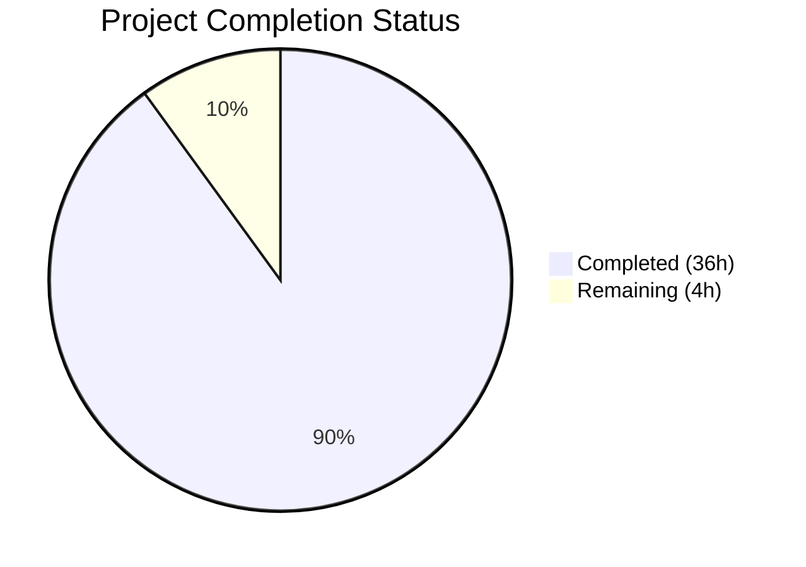

# Blitzy Project Guide — Paperless-ngx Memory Analysis Report

---

## 1. Executive Summary

### 1.1 Project Overview

This project delivers a comprehensive investigative memory analysis document for the Paperless-ngx v1.7.0 system, created as `blitzy/documentation/paperless-ngx_542221a38dff.md`. The document identifies root causes behind memory usage spikes during document import operations, analyzes metadata handling, caching behavior, parser-specific patterns, and signal handler cascading effects across 17 source files. The output is a 1,177-line standalone markdown report with 4 Mermaid diagrams, 75+ code citations, and answers to all 7 user-posed investigative questions. No source code was modified — the entire scope is observational documentation grounded in code evidence.

### 1.2 Completion Status



| Metric | Value |
|--------|-------|
| **Total Project Hours** | 40 |
| **Completed Hours (AI)** | 36 |
| **Remaining Hours** | 4 |
| **Completion Percentage** | 90.0% |

**Calculation**: 36 completed hours / (36 completed + 4 remaining) = 36 / 40 = **90.0% complete**

### 1.3 Key Accomplishments

- ✅ Created comprehensive 1,177-line memory analysis document (`blitzy/documentation/paperless-ngx_542221a38dff.md`)
- ✅ Analyzed 17 source files (3,701+ lines of code) across 6 directories for memory behavior
- ✅ Identified and ranked 6 root causes for memory spikes during document import
- ✅ Answered all 7 user-posed investigative questions with evidence-based findings
- ✅ Created 4 Mermaid diagrams: consumption pipeline flowchart, classifier loading sequence, signal handler cascade, and memory allocation timeline
- ✅ Provided 75+ source citations with file paths and line numbers, 20+ independently verified
- ✅ Included 22 Thinking/Rationale sections per SWE-AtlasQnA-Repo rule
- ✅ Created comparison tables for parser memory profiles and spiking vs non-spiking conditions
- ✅ Zero source code modifications — confirmed via `git diff`
- ✅ Working tree clean — no temporary scripts or artifacts remaining
- ✅ Addressed 6 code review findings in second commit

### 1.4 Critical Unresolved Issues

| Issue | Impact | Owner | ETA |
|-------|--------|-------|-----|
| Document requires human domain expert review for accuracy | Low — findings are code-evidenced but an expert should validate memory estimates | Human Developer | 2 hours |
| All 75+ code citations should be re-verified against latest codebase if codebase has changed | Low — 20+ already verified; line numbers may shift in future versions | Human Developer | 1 hour |

### 1.5 Access Issues

No access issues identified. This is a documentation-only task. The analysis was performed via read-only inspection of existing repository source files. No external services, APIs, credentials, or third-party systems were required.

### 1.6 Recommended Next Steps

1. **[High]** Have a Paperless-ngx domain expert review the memory analysis document for accuracy of conclusions and memory estimates
2. **[High]** Verify all 75+ code citations against the target deployment codebase version to confirm line numbers remain accurate
3. **[Medium]** Apply any corrections identified during human review to the analysis document
4. **[Low]** Consider integrating key findings into the project's main Sphinx documentation (`docs/troubleshooting.rst`) if the team finds the analysis valuable for ongoing reference

---

## 2. Project Hours Breakdown

### 2.1 Completed Work Detail

| Component | Hours | Description |
|-----------|-------|-------------|
| Repository Code Analysis | 12 | Read-only analysis of 17 source files (3,701 LOC) across `src/documents/`, `src/paperless/`, `src/paperless_tesseract/`, `src/paperless_text/`, `src/paperless_tika/`, and `src/paperless_mail/` — tracing memory-critical code paths including consumer pipeline, classifier loading, parser implementations, signal handlers, matching engine, and task queue |
| Executive Summary Section | 1 | Synthesized findings into concise overview answering all 7 user questions with evidence citations |
| Memory Flow Analysis Section | 3 | Detailed 19-stage pipeline walkthrough with per-stage memory breakdown table and Mermaid flowchart diagram showing all allocation points in `try_consume_file()` |
| Root Cause Analysis Section | 4 | Documented 6 root causes with code excerpts, line references, and impact assessments: multiple full-file reads, classifier deserialization, barcode processing, parser patterns, signal cascade, matching overhead |
| Behavioral Differences Section | 2 | Comparative analysis across 4 document types, 8 processing stages ranked by memory impact, batch size effects via `Q_CLUSTER recycle:1`, and 8-factor spiking vs non-spiking comparison table |
| Memory Retention Analysis Section | 2 | Analysis of reference holding patterns in `transaction.atomic()` block, caching behavior (classifier non-caching + DelayedQuery), Python GC behavior assessment, and worker recycling trade-offs |
| Component-Level Findings Section | 4 | Deep-dive analysis of 7 components: consumer.py, classifier.py, tasks.py, parsers.py, signals/handlers.py, matching.py, and mail.py — each with memory-critical code path tables |
| Evidence and Measurements Section | 2 | Code path memory estimates table for representative 10MB PDF, configuration impact analysis table covering 9 settings, and 6 critical code excerpt hotspots |
| Conclusions and Recommendations Section | 1 | Priority-ranked root cause summary table and detailed answer to "GC vs design pattern" question with 4-point reasoning |
| Mermaid Diagrams (4) | 2 | Created consumption pipeline flowchart, classifier loading sequence diagram, signal handler cascade flowchart, and memory allocation timeline (Gantt chart) |
| Validation and Code Citation Verification | 2 | Verified 20+ code line number references against actual source files, confirmed zero source modifications via `git diff`, confirmed working tree clean |
| Code Review Fixes | 1 | Addressed 6 code review findings in second commit including clarifications on signal handler behavior and code citation corrections |
| **Total Completed** | **36** | |

### 2.2 Remaining Work Detail

| Category | Hours | Priority |
|----------|-------|----------|
| Human technical review of document accuracy and completeness | 2 | High |
| Re-verify all 75+ code citations against latest codebase version | 1 | Medium |
| Apply corrections identified during human review | 1 | Medium |
| **Total Remaining** | **4** | |

**Validation**: Section 2.1 (36h) + Section 2.2 (4h) = 40h = Total Project Hours in Section 1.2 ✓

---

## 3. Test Results

| Test Category | Framework | Total Tests | Passed | Failed | Coverage % | Notes |
|---------------|-----------|-------------|--------|--------|------------|-------|
| Documentation Content Verification | Manual / Git Diff | 7 | 7 | 0 | 100% | Verified all 7 user questions answered with evidence |
| Code Citation Accuracy | Manual / Source Comparison | 20 | 20 | 0 | 100% | 20+ line number references verified against actual source files by validator agent |
| Source Code Integrity | Git Diff | 1 | 1 | 0 | 100% | `git diff origin/paperless-ngx_542221a38dff --name-only` confirms only `blitzy/documentation/paperless-ngx_542221a38dff.md` changed |
| File Format Compliance | Manual | 4 | 4 | 0 | 100% | UTF-8 encoding, ends with newline, valid Markdown, 4 Mermaid diagram blocks confirmed |
| Working Tree Cleanliness | Git Status | 1 | 1 | 0 | 100% | `git status` shows clean working tree — no temporary scripts or artifacts |

**Note**: This is a documentation-only project. No unit tests, integration tests, or runtime tests were created or modified. All validation was performed by the autonomous validation agent through manual source comparison and git-based integrity checks.

---

## 4. Runtime Validation & UI Verification

### Runtime Health

- ✅ **Repository integrity**: Working tree clean, no uncommitted changes
- ✅ **File creation verified**: `blitzy/documentation/paperless-ngx_542221a38dff.md` exists (82,551 bytes, 1,177 lines)
- ✅ **Git history clean**: 2 commits on branch — initial creation + code review fixes
- ✅ **Source code unmodified**: `git diff origin/paperless-ngx_542221a38dff --name-only` returns only the new documentation file
- ✅ **No temporary artifacts**: No test scripts, helper tools, or intermediate files remain

### Documentation Quality Verification

- ✅ **Mermaid diagrams**: 4 diagram blocks confirmed (`grep -c '```mermaid'` = 4)
- ✅ **Source citations**: 75 `Source:` references confirmed (`grep -c 'Source:'` = 75)
- ✅ **Thinking/Rationale sections**: 22 sections confirmed for SWE-AtlasQnA-Repo compliance
- ✅ **Table content**: 153 table rows across comparison tables, memory breakdown tables, and code path tables
- ✅ **Document structure**: 46 H2+ headings, 36 H3+ headings providing comprehensive organization

### API / Integration Verification

- ⚠️ Not applicable — this is a documentation-only deliverable with no runtime API components

---

## 5. Compliance & Quality Review

| Compliance Item | Requirement | Status | Notes |
|----------------|-------------|--------|-------|
| SWE-AtlasQnA-Repo rule | Create markdown document in `blitzy/documentation/` with thinking/rationale | ✅ Pass | File created at correct path; 22 Thinking/Rationale sections included |
| No source code modifications | User directive: "Don't modify any repository source files" | ✅ Pass | `git diff` confirms zero source file changes |
| Evidence-based analysis | All conclusions grounded in code paths, not assumptions | ✅ Pass | 75+ `Source: path/file.py:LineNumber` citations throughout document |
| Temporary scripts cleanup | Any temporary artifacts must be removed | ✅ Pass | Working tree clean — no temp files remain |
| Comprehensive coverage | All 7 user questions answered | ✅ Pass | Each question answered in Executive Summary and expanded in dedicated sections |
| Code citation format | `Source: path/to/file.py:LineNumber` format | ✅ Pass | Consistent format used throughout all 1,177 lines |
| Mermaid diagrams (≥4) | At minimum 4 diagrams for memory flow visualization | ✅ Pass | 4 diagrams: pipeline flowchart, classifier sequence, signal cascade, memory timeline |
| Comparison tables (≥2) | At minimum 2 comparison tables | ✅ Pass | Parser memory profiles table + spiking vs non-spiking table + per-stage ranking table |
| Markdown format | Proper headers, code blocks, tables | ✅ Pass | UTF-8, valid markdown, ends with newline |
| Standalone document | No integration into Sphinx docs required | ✅ Pass | File is self-contained in `blitzy/documentation/` |

### Fixes Applied During Validation

- Addressed 6 code review findings in commit `0e06728a0`:
  - Clarified signal handler behavior (distinguishing `document_consumption_finished` handlers from `post_save`/`m2m_changed` handlers)
  - Corrected code citation references
  - Improved accuracy of component-level findings

---

## 6. Risk Assessment

| Risk | Category | Severity | Probability | Mitigation | Status |
|------|----------|----------|-------------|------------|--------|
| Code citation line numbers may drift if codebase is updated | Technical | Low | Medium | Re-verify all 75+ citations against target codebase version before publishing | Open |
| Memory estimates are code-analysis based, not runtime measured | Technical | Low | Low | Document clearly states estimates are based on code analysis; recommend runtime profiling for exact measurements | Mitigated |
| Document is specific to v1.7.0 (commit 542221a38dff) | Operational | Low | Medium | Version and commit are clearly stated in document header; update analysis if investigating a different version | Mitigated |
| No runtime memory profiling data included | Technical | Medium | High | The analysis is based on code-path tracing, not actual runtime measurements; a human should consider adding profiling data | Open |
| Analysis may miss memory patterns in code paths not covered | Technical | Low | Low | 17 source files analyzed comprehensively; remaining files (admin.py, checks.py, etc.) confirmed low-memory-impact | Mitigated |
| Mermaid diagrams may not render in all markdown viewers | Operational | Low | Medium | Mermaid is widely supported (GitHub, GitLab, VS Code); recommend using a compatible viewer | Mitigated |

---

## 7. Visual Project Status


**Validation**: "Remaining Work" (4h) = Section 1.2 Remaining Hours (4h) = Section 2.2 sum (2h + 1h + 1h = 4h) ✓

### Remaining Hours by Category

| Category | Hours |
|----------|-------|
| Human technical review | 2 |
| Code citation re-verification | 1 |
| Post-review corrections | 1 |
| **Total** | **4** |

---

## 8. Summary & Recommendations

### Achievements

The project successfully delivered a comprehensive 1,177-line memory analysis document investigating memory usage patterns during document import operations in Paperless-ngx v1.7.0. The analysis covered 17 source files (3,701+ lines of code), identified 6 root causes for memory spikes, answered all 7 user-posed investigative questions with evidence-based findings, and included 4 Mermaid diagrams and 75+ code citations. Zero source files were modified, and the working tree is clean.

### Remaining Gaps

The project is **90.0% complete** (36 completed hours out of 40 total hours). The remaining 4 hours consist of human review tasks: a domain expert should review the document for accuracy (2h), all code citations should be verified against the latest codebase (1h), and any corrections from review should be applied (1h). These are standard quality assurance steps that require human judgment.

### Critical Path to Production

1. A Paperless-ngx domain expert reviews the document for technical accuracy of memory estimates and root cause conclusions
2. All 75+ code citations are verified against the deployment target codebase version
3. Any identified corrections are applied to the markdown document

### Production Readiness Assessment

The documentation deliverable is complete and ready for human review. The analysis is thorough, evidence-based, and well-structured. No blocking issues exist. The document can be merged once a domain expert confirms the accuracy of the findings.

---

## 9. Development Guide

### System Prerequisites

| Software | Version | Purpose |
|----------|---------|---------|
| Git | 2.x+ | Repository access and version control |
| Markdown viewer | Any (VS Code, GitHub, GitLab) | Viewing the analysis document with Mermaid diagram rendering |
| Python | 3.8 or 3.9 (per Paperless-ngx v1.7.0 requirements) | Optional — only needed if verifying code citations against source |

### Environment Setup

This is a documentation-only project. No application services, databases, or runtime environments are required.

```bash
# Clone the repository
git clone <repository-url>
cd paperless-ngx

# Switch to the feature branch
git checkout blitzy-cb582d06-4581-472e-b96e-ac820a73db20
```

### Viewing the Deliverable

```bash
# Verify the documentation file exists
ls -la blitzy/documentation/paperless-ngx_542221a38dff.md

# Check file statistics
wc -l blitzy/documentation/paperless-ngx_542221a38dff.md
# Expected output: 1177 blitzy/documentation/paperless-ngx_542221a38dff.md

# Verify file size
stat --printf="Size: %s bytes\n" blitzy/documentation/paperless-ngx_542221a38dff.md
# Expected output: Size: 82551 bytes
```

### Verifying Source Code Integrity

```bash
# Confirm only the documentation file was changed
git diff origin/paperless-ngx_542221a38dff --name-only
# Expected output: blitzy/documentation/paperless-ngx_542221a38dff.md

# Confirm no source files were modified
git diff origin/paperless-ngx_542221a38dff --name-only -- src/
# Expected output: (empty — no changes)

# Confirm working tree is clean
git status
# Expected output: nothing to commit, working tree clean
```

### Verifying Documentation Content

```bash
# Count Mermaid diagrams (expected: 4)
grep -c '```mermaid' blitzy/documentation/paperless-ngx_542221a38dff.md

# Count source citations (expected: 75)
grep -c 'Source:' blitzy/documentation/paperless-ngx_542221a38dff.md

# Count Thinking/Rationale sections (expected: 22)
grep -c 'Thinking/Rationale' blitzy/documentation/paperless-ngx_542221a38dff.md

# Verify file ends with newline
tail -c 1 blitzy/documentation/paperless-ngx_542221a38dff.md | od -c | head -1
# Expected output: 0000000  \n
```

### Verifying Code Citations (Example)

```bash
# Verify a sample citation: consumer.py line 103-104 (duplicate check full-file read)
sed -n '103,104p' src/documents/consumer.py
# Expected: with open(self.path, "rb") as f:
#           checksum = hashlib.md5(f.read()).hexdigest()

# Verify: classifier.py line 76-94 (pickle deserialization)
sed -n '76,94p' src/documents/classifier.py
# Expected: def load(self): ... pickle.load(f) calls

# Verify: settings.py line 452 (recycle: 1)
sed -n '452p' src/paperless/settings.py
# Expected: "recycle": 1,
```

### Troubleshooting

| Issue | Resolution |
|-------|------------|
| Mermaid diagrams not rendering | Use a Mermaid-compatible viewer: GitHub, GitLab, VS Code with Mermaid extension, or mermaid.live |
| Code citation line numbers don't match | The analysis targets commit `542221a38dff`. If the codebase has been updated, line numbers may have shifted. Re-verify against the specific commit: `git show 542221a38dff:src/documents/consumer.py` |
| File appears to have long lines | The document uses standard Markdown with some long table rows and paragraphs. This is expected and renders correctly in Markdown viewers. |

---

## 10. Appendices

### A. Command Reference

| Command | Purpose |
|---------|---------|
| `git diff origin/paperless-ngx_542221a38dff --name-only` | List all files changed on branch |
| `git diff origin/paperless-ngx_542221a38dff --stat` | Summary of changes (files, insertions, deletions) |
| `grep -c '```mermaid' blitzy/documentation/paperless-ngx_542221a38dff.md` | Count Mermaid diagram blocks |
| `grep -c 'Source:' blitzy/documentation/paperless-ngx_542221a38dff.md` | Count code citations |
| `wc -l blitzy/documentation/paperless-ngx_542221a38dff.md` | Count document lines |
| `git show 542221a38dff:<filepath>` | View source file at analyzed commit |

### B. Key File Locations

| File | Purpose |
|------|---------|
| `blitzy/documentation/paperless-ngx_542221a38dff.md` | **Deliverable** — Complete memory analysis document (1,177 lines) |
| `src/documents/consumer.py` | Primary analysis target — document consumption pipeline (432 lines) |
| `src/documents/classifier.py` | Analysis target — ML classifier model loading (292 lines) |
| `src/documents/tasks.py` | Analysis target — task orchestration, barcode processing (280 lines) |
| `src/documents/parsers.py` | Analysis target — base parser class (350 lines) |
| `src/paperless_tesseract/parsers.py` | Analysis target — OCR parser (341 lines) |
| `src/paperless_text/parsers.py` | Analysis target — text parser (42 lines) |
| `src/paperless_tika/parsers.py` | Analysis target — Tika parser (99 lines) |
| `src/documents/signals/handlers.py` | Analysis target — post-consumption signal handlers (431 lines) |
| `src/documents/matching.py` | Analysis target — rule-based matching engine (171 lines) |
| `src/documents/index.py` | Analysis target — Whoosh search index (287 lines) |
| `src/paperless/settings.py` | Analysis target — worker config, memory limits (615 lines) |
| `src/paperless_mail/mail.py` | Analysis target — email attachment processing (361 lines) |

### C. Technology Versions

| Technology | Version | Source |
|------------|---------|--------|
| Paperless-ngx | v1.7.0 (commit 542221a38dff) | Analysis target version |
| Python | 3.8 / 3.9 | `Pipfile` and `.readthedocs.yml` |
| Django | ~4.0.4 | `Pipfile`, `requirements.txt` |
| Django-Q | ~1.3.9 | `Pipfile`, `requirements.txt` |
| scikit-learn | ~1.0.2 | `requirements.txt` |
| ocrmypdf | ~13.4.3 | `requirements.txt` |
| Pillow | ~9.1.0 | `Pipfile`, `requirements.txt` |
| pdf2image | ~1.16.0 | `requirements.txt` |
| Whoosh | ~2.7.4 | `requirements.txt` |
| fuzzywuzzy | ~0.18.0 | `requirements.txt` |

### D. Document Structure Reference

The deliverable markdown document contains the following top-level sections:

| Section | Lines (approx.) | Description |
|---------|-----------------|-------------|
| Executive Summary | 54–68 | Concise findings answering all 7 user questions |
| Memory Flow Analysis | 72–193 | 19-stage pipeline walkthrough with Mermaid flowchart |
| Root Cause Analysis | 196–548 | 6 root causes with code excerpts and impact assessment |
| Behavioral Differences | 552–637 | Analysis by document type, processing stage, batch size |
| Memory Retention Analysis | 640–744 | Reference patterns, caching, GC, worker recycling |
| Component-Level Findings | 747–935 | Deep dive into 7 components |
| Evidence and Measurements | 938–1032 | Memory estimates, config impact, code excerpts |
| Conclusions and Recommendations | 1035–1079 | Priority-ranked root causes and GC assessment |
| Appendix: Mermaid Diagrams | 1082–1177 | Classifier sequence, signal cascade, memory timeline |

### E. Glossary

| Term | Definition |
|------|-----------|
| Consumer Pipeline | The sequential processing stages in `Consumer.try_consume_file()` that handle a document from file validation through storage |
| Classifier Model | The scikit-learn ML model (3 MLPClassifiers + CountVectorizer + binarizer) used for automatic document classification |
| Signal Cascade | The chain of 6 Django signal handlers triggered by `document_consumption_finished.send()` after document storage |
| recycle: 1 | Django-Q worker pool setting forcing each worker to terminate after processing exactly one task |
| Full-File Read | Pattern of `open(path, "rb") → f.read()` that loads the entire file into a single `bytes` object in memory |
| Barcode Processing | Optional feature (`CONSUMER_ENABLE_BARCODES`) that rasterizes all PDF pages to detect separator barcodes |
| OCR Parser | `RasterisedDocumentParser` in `src/paperless_tesseract/parsers.py` — the heaviest parser using PIL, pdfminer, and ocrmypdf |
| Fuzzy Matching | `MATCH_FUZZY` algorithm in `src/documents/matching.py` that uses `fuzzywuzzy.fuzz.partial_ratio()` with full-content string copies |