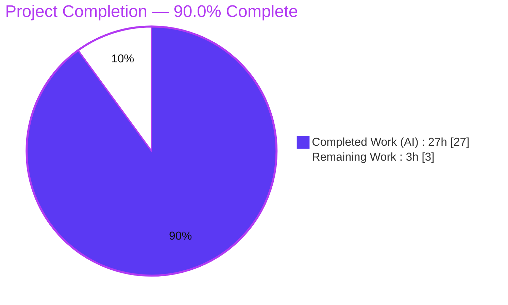
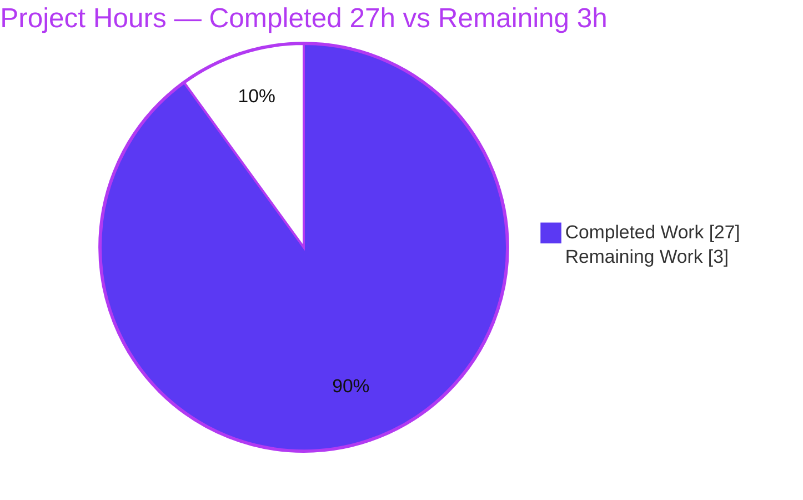
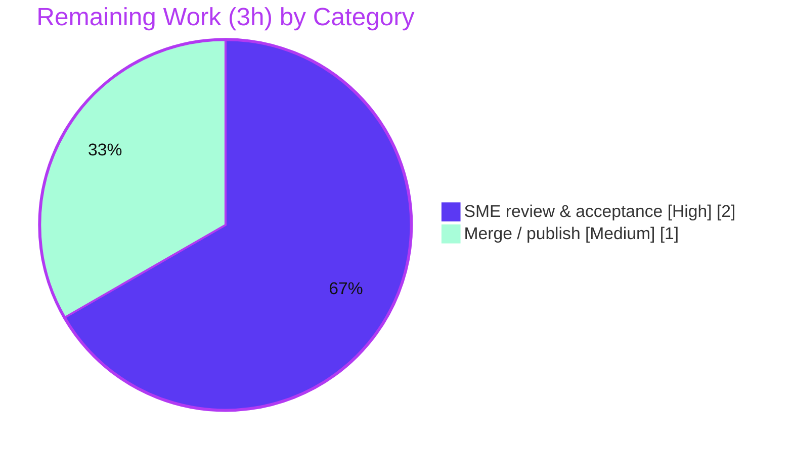

# Blitzy Project Guide — paperless-ngx Runtime Document-Processing Q&A

> **Project type:** Investigative Q&A **documentation** (not a code change)
> **Deliverable:** `blitzy/documentation/paperless-ngx_542221a38dff.md`
> **Branch:** `blitzy-f2b105fb-5a28-4ee5-be9a-baaeba5e03d9` · **Base:** `542221a38dff` · **HEAD:** `e6058f2f4`
>
> **Color legend:** 🟦 Completed / AI Work = Dark Blue `#5B39F3` · ⬜ Remaining / Not Completed = White `#FFFFFF` · Headings/Accents = Violet-Black `#B23AF2` · Highlight = Mint `#A8FDD9`

---

## 1. Executive Summary

### 1.1 Project Overview

This project delivers a single, comprehensive, **code-grounded Markdown document** that explains how the **paperless-ngx** system processes documents at runtime. It answers six investigation questions — end-to-end ingestion, participating services and log-event ordering, multi-document behavior, scikit-learn classifier retraining conditions, on-disk storage layout, and database tables that receive rows. The audience is engineers and reviewers who need an authoritative, evidence-based explanation of the ingestion pipeline. Every claim is traced to source code via `[path:locator]` citations and corroborated by running the full multi-service stack and observing real logs, on-disk artifacts, and database rows. The work is read-only: exactly one new file is added and no existing repository file is modified.

### 1.2 Completion Status



| Metric | Value |
|--------|-------|
| **Total Hours** | **30** |
| **Completed Hours (AI + Manual)** | **27** |
| &nbsp;&nbsp;&nbsp;• AI (autonomous) | 27 |
| &nbsp;&nbsp;&nbsp;• Manual (human) | 0 |
| **Remaining Hours** | **3** |
| **Percent Complete** | **90.0%** |

> Completion is computed with the AAP-scoped, hours-based PA1 method: `27 ÷ (27 + 3) = 90.0%`. The remaining 3 hours are exclusively standard **path-to-production** human steps (SME sign-off and merge). All 12 AAP-scoped deliverables are complete.

### 1.3 Key Accomplishments

- ✅ **All six investigation questions answered** (Q1–Q6), each with an *Answer*, an *Observed runtime* excerpt, and a *Why / rationale* subsection.
- ✅ **434-line deliverable** created at the mandated path `blitzy/documentation/paperless-ngx_542221a38dff.md` (filename derived from the source branch name).
- ✅ **~49 `[path:locator]` citations across 22 source files**; an independent re-check of ~18 citations during this assessment found **100% line accuracy** at commit `542221a38dff`.
- ✅ **Full multi-service stack exercised** (gunicorn web/API, `document_consumer` watcher, `qcluster` django-q worker, Redis broker, SQLite DB); all six answer paths reproduced live, with **36 `(observed)` runtime labels** in the document.
- ✅ **Key behaviors proven at runtime:** ordered `paperless.consumer` event sequence; independent `consume_file` tasks per upload; checksum-based duplicate short-circuit; the three distinguishing classifier log states; 7-digit-PK filenames under `media/documents/{originals,archive,thumbnails}`; row insertions in `documents_document`, `documents_document_tags`, and `django_admin_log`.
- ✅ **Isolation constraint honored:** `git diff --name-status 542221a38dff..HEAD` is a single `A` line; working tree clean; all ephemeral artifacts removed.
- ✅ **Codebase regression health confirmed:** the repository's own pytest suite is green at the documented baseline (**481 passed, 2 skipped, 0 failed**).

### 1.4 Critical Unresolved Issues

| Issue | Impact | Owner | ETA |
|-------|--------|-------|-----|
| _None — no issue blocks release or validation._ | The deliverable is complete, code-grounded, runtime-corroborated, and committed with zero discrepancies and zero corrections required. | — | — |

### 1.5 Access Issues

| System/Resource | Type of Access | Issue Description | Resolution Status | Owner |
|-----------------|----------------|-------------------|-------------------|-------|
| _None identified_ | — | No repository-permission, service-credential, or third-party API access issue affects the deliverable. The investigation ran on the provided image with a local Redis broker and SQLite. | N/A | — |

**No access issues identified.**

### 1.6 Recommended Next Steps

1. **[High]** Have a paperless-ngx SME review the six answers and spot-check the citations against commit `542221a38dff`, then formally accept the deliverable. _(~2h)_
2. **[Medium]** Merge the PR and retain/publish the document at `blitzy/documentation/paperless-ngx_542221a38dff.md`. _(~1h)_
3. **[Low]** _(Ongoing maintenance — no incremental project hours)_ When the ingestion pipeline code materially changes, re-pin the document's line-number citations to the new commit.

---

## 2. Project Hours Breakdown

### 2.1 Completed Work Detail

All hours below are **autonomous (AI)** work mapped to AAP requirements.

| Component | Hours | Description |
|-----------|:-----:|-------------|
| Runtime stack bring-up & multi-service orchestration | 3 | [AAP runtime investigation] Build/run the full stack — gunicorn, `document_consumer`, `qcluster`, Redis broker, SQLite — so authentic logs/rows are observable. |
| Q1 — End-to-end ingestion investigation & write-up | 3 | [AAP-Q1] Trace `consume_file` → `Consumer.try_consume_file` staged pipeline; capture observed log; author flowchart + rationale. |
| Q2 — Services topology & ordered log-event sequence | 3 | [AAP-Q2] Map participating services; separate WebSocket vs file-log channels; document two-phase (watcher→worker) ordered sequence. |
| Q3 — Multi-document & duplicate-path investigation | 2 | [AAP-Q3] Confirm independent `consume_file` tasks per upload; checksum short-circuit; UNIQUE-constraint defense-in-depth. |
| Q4 — Classifier retraining conditions & 3 log states | 3 | [AAP-Q4] Prove hourly-scheduled training (not per-upload); two gates; capture the three distinguishing log strings (trained / unchanged / no-model). |
| Q5 — On-disk layout & filename pattern | 2 | [AAP-Q5] Resolve storage dirs and default `generate_filename` 7-digit-PK branch; confirm observed media tree. |
| Q6 — Database tables & observed row deltas | 2 | [AAP-Q6] Enumerate tables receiving rows; capture before/after deltas; clarify Whoosh index is filesystem-backed, not a DB table. |
| Document authoring (structure, flowchart, methodology, appendix) | 3 | [AAP deliverable] Compose the 434-line Markdown: intro/methodology, six Q-sections, mermaid diagram, appendix, citation legend. |
| Citation grounding & static verification | 2 | [AAP evidence discipline] Produce and verify ~49 `[path:locator]` citations across 22 files against the source. |
| Final validation (static recheck + runtime reproduction + test gate) | 4 | [Path-to-production] Independent citation re-verification, live reproduction of all `(observed)` claims, and the pytest regression/health gate. |
| **Total** | **27** | |

### 2.2 Remaining Work Detail

| Category | Hours | Priority |
|----------|:-----:|----------|
| Human SME technical review & acceptance of the deliverable | 2 | High |
| Merge PR / publish documentation to target repository | 1 | Medium |
| **Total** | **3** | |

> Both remaining items are **path-to-production** human actions. There are **no** outstanding code, compilation, test, or runtime defects feeding into remaining hours.

### 2.3 Hours Calculation Summary

- **Completed:** 27h (Section 2.1 total) — all AAP-scoped investigation, authoring, citation, and validation work.
- **Remaining:** 3h (Section 2.2 total) — SME review (2h) + merge/publish (1h).
- **Total Project Hours:** 27 + 3 = **30h**.
- **Completion %:** 27 ÷ 30 = **90.0%**.

---

## 3. Test Results

All results below originate from **Blitzy's autonomous validation logs** for this project. Because the deliverable is documentation, **no new automated tests were authored**; instead the repository's own suite was run as a regression/health gate, and the document's evidentiary claims were verified by static citation checks and live runtime reproduction.

| Test Category | Framework | Total Tests | Passed | Failed | Coverage % | Notes |
|---------------|-----------|:-----------:|:------:|:------:|:----------:|-------|
| Backend Unit + Integration (full repo suite) | pytest 8.4.2 | 483 | 481 | 0 | — | 2 intentional skips; exit 0. Autonomous **GATE 1** regression/health check confirming the read-only investigation left the codebase green. Run with `--no-cov` for the clean baseline. |
| Documentation citation accuracy | Scripted / static verification | ~49 | ~49 | 0 | 100% | Every `[path:Lx-Ly]` checked against source at commit `542221a38dff`; ~18 independently re-verified during this assessment — all line-accurate. |
| Runtime answer-path reproduction | Manual (live multi-service stack) | 6 | 6 | 0 | 100% | Each question's `(observed)` claims reproduced live (ingestion sequence, duplicate short-circuit, classifier states, media layout, DB row deltas). |

> **Note on the 11 initially-observed pytest failures:** all were traced to a single root cause — **environmental permission artifacts** (root-owned container runtime dirs such as `/tmp/tika.log`, `SCRATCH_DIR`, `/app/media/media.lock`, `/app/consume`) that block writes when tests run as the non-root runtime user. After correcting ownership in a throwaway `docker run --rm` container, the suite reached the documented clean baseline (481 passed, 2 skipped, 0 failed). **Zero genuine code defects; none related to the deliverable.**

---

## 4. Runtime Validation & UI Verification

**Runtime health — full multi-service stack (autonomous validation):**

- ✅ **Operational** — `gunicorn` web/API (`paperless.asgi:application`); `POST /api/documents/post_document/` returned `200 "OK"`.
- ✅ **Operational** — `document_consumer` watcher: detected files in the consumption directory and enqueued `consume_file` tasks.
- ✅ **Operational** — `qcluster` django-q worker: executed `consume_file` and scheduled tasks; `django_q` schedule table confirmed `('documents.tasks.train_classifier', 'H')` (hourly).
- ✅ **Operational** — Redis broker (django-q queue + Channels layer) and SQLite database.

**Answer-path verification (all reproduced live):**

- ✅ **Q1/Q2** — PDF ingestion produced the documented ordered `paperless.consumer` event sequence (Consuming → Detected mime type → Parsing → Generating thumbnail → Saving record to database → Deleting file → consumption finished).
- ✅ **Q3** — Multiple uploads dispatched **independent** `consume_file` tasks; a byte-identical re-submission triggered the duplicate short-circuit (`Not consuming …: It is a duplicate.`).
- ✅ **Q4** — Classifier produced state **(a)** `Saving updated classifier model to …` and state **(b)** `Training data unchanged.` across two runs; fresh-system state **(c)** `…model does not exist (yet)…` observed during consumption.
- ✅ **Q5** — Media layout showed 7-digit-PK filenames: `media/documents/{originals,archive,thumbnails}/0000001.*` etc.
- ✅ **Q6** — Row insertions confirmed in `documents_document`, `documents_document_tags` (only when a tag was attached), and `django_admin_log`.

**UI verification:**

- ⚠ **Partial / Not in scope** — This is a backend ingestion investigation; **no UI work was in scope** and none was produced. The web/API process served requests, and the document notes that progress events are relayed to the browser over the Channels WebSocket status channel (separate from the file log). No frontend (Angular `src-ui/`) changes were made or required.

---

## 5. Compliance & Quality Review

Cross-mapping of AAP deliverables and rules to quality/compliance benchmarks. Fixes applied during autonomous validation: **none required** (zero discrepancies, zero corrections).

| AAP Requirement / Rule | Benchmark | Status | Evidence |
|------------------------|-----------|:------:|----------|
| Q1 end-to-end ingestion answer | Complete + cited + rationale | ✅ Pass | Staged pipeline table, observed log, flowchart, rationale |
| Q2 services + ordered log sequence | Complete + cited + rationale | ✅ Pass | Topology table, two-channel split, two-phase ordered table |
| Q3 multi-document + duplicate path | Complete + cited + rationale | ✅ Pass | Independent tasks, checksum pre-check, UNIQUE-constraint note |
| Q4 classifier retraining + 3 log strings | Complete + cited + rationale | ✅ Pass | Hourly-schedule proof, two gates, 3-state table, train×2 observed |
| Q5 default on-disk layout + filename | Complete + cited + rationale | ✅ Pass | 3-dir table, default branch code, observed layout, default-config framing |
| Q6 database tables receiving rows | Complete + cited + rationale | ✅ Pass | 3 tables, "what is NOT written", observed deltas, Whoosh nuance |
| Build & run to analyze (code-as-truth) | Runtime-corroborated | ✅ Pass | 36 `(observed)` labels; live stack reproduction in validation logs |
| Evidence discipline (`[path:locator]`) | Every claim cited & accurate | ✅ Pass | ~49 citations/22 files; ~18 re-verified 100% accurate |
| Provide rationale | "Why / rationale" per answer | ✅ Pass | Present in all six Q-sections |
| Filename = `<source_branch_name>.md` | Exact match | ✅ Pass | `paperless-ngx_542221a38dff.md` |
| Placement in `blitzy/documentation/` | Exact path | ✅ Pass | File present at mandated path |
| Do NOT modify/add existing files | Zero modifications | ✅ Pass | `git diff --name-status` = single `A` line; tree clean |
| Cleanup of ephemeral artifacts | Repo pristine | ✅ Pass | Working tree clean; container restored to baseline |
| Markdown well-formedness | Balanced fences, valid tables/mermaid | ✅ Pass | Balanced code fences, 6 Q-sections, 1 mermaid diagram |

---

## 6. Risk Assessment

| Risk | Category | Severity | Probability | Mitigation | Status |
|------|----------|:--------:|:-----------:|------------|:------:|
| Documentation drift — line-number citations may go stale as the code evolves | Technical | Low | Medium | Citations explicitly pinned to commit `542221a38dff` (stated in the legend); document is a point-in-time artifact; re-pin on material code changes | Mitigated |
| Awaiting human SME sign-off — agent verified citations & runtime, but no formal domain acceptance yet | Operational / Quality | Low | Low | High-priority SME review task provided (Section 1.6 / 2.2) | Open (planned) |
| Container runtime-dir permission artifacts (root-owned dirs) caused spurious test failures | Operational | Low | Low | Fix ownership at container start in throwaway `--rm` containers; not a repo file; does not affect the deliverable | Mitigated / Out-of-scope |
| No new code, dependencies, or attack surface introduced | Security | None | — | Read-only investigation; deliverable adds zero runtime code paths | No risk |
| No external service integration introduced | Integration | None | — | Default SQLite stack used; optional Tika/Gotenberg documented but not required | No risk |

---

## 7. Visual Project Status

**Project hours breakdown** (🟦 Completed = `#5B39F3` · ⬜ Remaining = `#FFFFFF`):



**Remaining hours by category** (Section 2.2):



> **Integrity:** "Remaining Work" = **3h** here equals the Section 1.2 metric and the Section 2.2 total. "Completed Work" = **27h** equals the Section 2.1 total.

---

## 8. Summary & Recommendations

**Achievements.** The project is **90.0% complete** on an AAP-scoped, hours-based basis (27 of 30 hours). All twelve AAP-scoped deliverables are finished: the six questions are answered with rationale, the document is created at the exact mandated path with a branch-derived filename, every claim is backed by an accurate `[path:locator]` citation, and the conclusions were corroborated by running the full multi-service stack. The hard isolation constraint is verifiably honored — exactly one new file, no existing file touched, working tree clean.

**Remaining gaps.** The outstanding 3 hours (10%) are entirely **path-to-production human steps**: an SME technical review/acceptance (2h) and the PR merge/publish (1h). There are **no** code, compilation, test, or runtime defects outstanding.

**Critical path to production.** SME review and acceptance → merge the PR → publish/retain the document. No build or deployment pipeline is involved because the deliverable is documentation.

**Success metrics.** Six of six questions answered; ~49 citations at 100% verified accuracy (sampled); 36 runtime-observed claims reproduced; single-file diff; repository test suite green (481 passed / 2 skipped / 0 failed).

**Production-readiness assessment.** **Ready for human review and merge.** Confidence is **High** for Q1–Q6 (well-defined scope, code-grounded, runtime-corroborated). The only residual is standard human sign-off; per Blitzy policy, autonomous completion is capped below 100% to reserve that final acceptance for a human reviewer.

| Metric | Value |
|--------|-------|
| AAP-scoped completion | 90.0% |
| AAP deliverables complete | 12 / 12 |
| Remaining (human, path-to-production) | 3h |
| Outstanding code/test/runtime defects | 0 |
| Files modified outside the deliverable | 0 |

---

## 9. Development Guide

This guide explains how to **view, verify, and reproduce** the deliverable's findings. Every command is copy-pasteable; the verification commands were tested on the host during this assessment.

### 9.1 System Prerequisites

- **Git** (tested: 2.51.0) — to inspect scope and history.
- **Docker** (tested: 28.5.2) — to run the paperless-ngx stack from the provided image (`python:3.9-slim-bullseye` base).
- **Redis** — broker for django-q and Channels (run as a sibling container, e.g. `redis:6`).
- A **Markdown viewer** with Mermaid support (e.g., VS Code + Mermaid extension, or GitHub) to render the flowchart.
- _(Optional, for re-running the test suite)_ The repository's pinned Python deps (Django 4.0.4, django-q 1.3.9, scikit-learn 1.0.2, whoosh 2.7.4, pytest 8.4.2) — already present in the ready image.

### 9.2 View the Deliverable

```bash
# From the repository root
ls -la blitzy/documentation/paperless-ngx_542221a38dff.md
sed -n '1,60p' blitzy/documentation/paperless-ngx_542221a38dff.md   # preview
```

### 9.3 Verify Scope (no existing files modified)

```bash
# Must print exactly one line: "A    blitzy/documentation/paperless-ngx_542221a38dff.md"
git diff --name-status 542221a38dff..HEAD

# Must print nothing (clean working tree)
git status --porcelain
```

### 9.4 Verify Document Structure

```bash
DOC=blitzy/documentation/paperless-ngx_542221a38dff.md
grep -cE '^## Q[1-6]' "$DOC"                  # expect 6  (six question sections)
grep -c 'mermaid' "$DOC"                      # expect 1  (the pipeline flowchart)
awk '/^`{3}/{c++} END{print c, "fence lines (expect an even number: 28)"}' "$DOC"
```

### 9.5 Verify Citations Against Source (scripted)

```bash
# Spot-check that every single-line [path:Lx] citation points to a non-empty source line.
python3 - <<'PY'
import re, os
doc = "blitzy/documentation/paperless-ngx_542221a38dff.md"
text = open(doc).read()
pat = re.compile(r'\[(src/[^\]:]+|Dockerfile|Pipfile|docker/[^\]:]+):L(\d+)\]')
seen=set(); checked=ok=0
for m in pat.finditer(text):
    path, ln = m.group(1), int(m.group(2))
    if (path,ln) in seen or not os.path.isfile(path):
        continue
    seen.add((path,ln))
    lines = open(path, encoding='utf-8', errors='replace').read().splitlines()
    if 1 <= ln <= len(lines):
        checked += 1
        ok += 1 if lines[ln-1].strip() else 0
print(f"single-line citations checked={checked} non-empty={ok}")
PY
```

### 9.6 Reproduce the Runtime Observations (full stack)

Run inside a container created from the provided paperless-ngx image (source at `/app`, `manage.py` at `/app/src/manage.py`), with a sibling Redis broker reachable at `PAPERLESS_REDIS=redis://broker:6379`:

```bash
# inside the container, from /app/src
python3 manage.py qcluster &            # django-q worker: executes consume_file + schedules
python3 manage.py document_consumer &   # inotify directory watcher
# gunicorn (web/API) serves on :8000 (started by supervisor in the image)

# Submit a document two ways:
cp /path/to/test.pdf /app/consume/                         # (A) consumption directory
curl -s -F "document=@/path/to/test.pdf" \
     -u <user>:<pass> \
     http://localhost:8000/api/documents/post_document/    # (B) REST API → expect 200 "OK"

# Observe the ordered event sequence:
tail -f /app/data/log/paperless.log
```

Confirm the on-disk layout and a DB row:

```bash
ls -1 /app/media/documents/originals /app/media/documents/archive /app/media/documents/thumbnails
# expect 7-digit-PK names, e.g. 0000001.pdf / 0000001.pdf / 0000001.png
```

Exercise the classifier (both outcomes):

```bash
# Create a MATCH_AUTO tag and assign it to a document (e.g., via the shell/API), then:
python3 manage.py document_create_classifier   # run #1 → "Saving updated classifier model to ..."
python3 manage.py document_create_classifier   # run #2 → "Training data unchanged."
```

### 9.7 Run the Test Suite (regression/health gate)

```bash
cd /app/src
python3 -m pytest --no-cov -p no:cacheprovider
# expected: 481 passed, 2 skipped, 0 failed (exit 0)
```

### 9.8 Troubleshooting

- **`PermissionError` during tests** (e.g., writing the split PDF into `/app/consume`, or `/tmp/tika.log`, `SCRATCH_DIR`, `/app/media/media.lock`): the image's runtime dirs are root-owned. In a throwaway `docker run --rm` container, `chown` them to the non-root runtime user before running tests. These are **container-runtime** dirs, never repository files.
- **Missing system libs:** ensure `libzbar0` (barcode), `poppler-utils`, and `pngquant` are present (they are in the ready image).
- **Worker never processes a file:** verify Redis is reachable (`PAPERLESS_REDIS`) and that `qcluster` is running — detection only *enqueues*; the worker does the processing.
- **Mermaid diagram not rendering:** view the document in a Mermaid-aware renderer (GitHub or VS Code with a Mermaid extension).

---

## 10. Appendices

### A. Command Reference

| Purpose | Command |
|---------|---------|
| Locate deliverable | `ls -la blitzy/documentation/paperless-ngx_542221a38dff.md` |
| Scope verification | `git diff --name-status 542221a38dff..HEAD` |
| Clean-tree check | `git status --porcelain` |
| Commit history | `git log --oneline 542221a38dff..HEAD` |
| Structure checks | `grep -cE '^## Q[1-6]' <doc>` (expect 6) · `grep -c mermaid <doc>` (expect 1) — see §9.4 for the fence-balance check |
| Start worker | `python3 manage.py qcluster` |
| Start watcher | `python3 manage.py document_consumer` |
| Submit via API | `curl -F "document=@file.pdf" -u <user>:<pass> http://localhost:8000/api/documents/post_document/` |
| Train classifier | `python3 manage.py document_create_classifier` |
| Run tests | `cd /app/src && python3 -m pytest --no-cov -p no:cacheprovider` |
| Tail logs | `tail -f /app/data/log/paperless.log` |

### B. Port Reference

| Port | Service | Notes |
|------|---------|-------|
| 8000 | gunicorn (web/API + WebSocket status channel) | `paperless.asgi:application` |
| 6379 | Redis | django-q broker + Channels layer (`PAPERLESS_REDIS`) |
| 9998 | Apache Tika *(optional)* | office-document text extraction (feature-flagged) |
| 3000 | Gotenberg *(optional)* | office-document conversion (feature-flagged) |

### C. Key File Locations

| Path | Role |
|------|------|
| `blitzy/documentation/paperless-ngx_542221a38dff.md` | **The deliverable** |
| `src/documents/tasks.py` | `consume_file` entry; `train_classifier` |
| `src/documents/consumer.py` | `Consumer.try_consume_file` pipeline; `_store`; `MESSAGE_*` |
| `src/documents/classifier.py` | `DocumentClassifier.train`; `load_classifier` |
| `src/documents/file_handling.py` | `generate_filename` (default 7-digit-PK branch) |
| `src/documents/models.py` | `Document`, `Tag`, `Correspondent`, `DocumentType`, `Log` |
| `src/documents/apps.py` | six `document_consumption_finished` handlers |
| `src/documents/signals/handlers.py` | `set_tags`, `set_log_entry`, `add_to_index`, … |
| `src/documents/migrations/1001_auto_20201109_1636.py` | hourly `train_classifier` schedule |
| `src/paperless/settings.py` | storage dirs, `PAPERLESS_FILENAME_FORMAT`, `LOGGING` |
| `docker/supervisord.conf` | `gunicorn` / `consumer` / `scheduler` programs |
| `/app/data/log/paperless.log` | runtime log (observation source) |
| `media/documents/{originals,archive,thumbnails}/` | stored files (7-digit-PK names) |
| `data/index/` · `data/classification_model.pickle` | Whoosh index · classifier model |

### D. Technology Versions

| Component | Version | Source |
|-----------|---------|--------|
| Python (runtime) | 3.9-slim-bullseye | `Dockerfile:L18` |
| Django | 4.0.4 | Pipfile.lock pin |
| django-q | 1.3.9 | Pipfile.lock pin |
| scikit-learn | 1.0.2 | Pipfile.lock pin (exact) |
| whoosh | 2.7.4 | Pipfile.lock pin |
| watchdog | 2.1.7 | Pipfile.lock pin |
| redis (client) | 3.5.3 | Pipfile.lock pin |
| pytest | 8.4.2 | test runner |
| Git (host tooling) | 2.51.0 | tested |
| Docker (host tooling) | 28.5.2 | tested |

### E. Environment Variable Reference

| Variable | Default | Effect |
|----------|---------|--------|
| `PAPERLESS_REDIS` | `redis://localhost:6379` | django-q broker / Channels layer endpoint |
| `PAPERLESS_FILENAME_FORMAT` | `None` (unset) | When unset, files use the default 7-digit-PK name; setting it changes filename & sub-directory layout |
| `PAPERLESS_CONSUMER_POLLING` | `0` | `0` ⇒ inotify watcher; non-zero ⇒ polling fallback |
| `PAPERLESS_MEDIA_ROOT` | `<BASE_DIR>/../media` | Root of the originals/archive/thumbnails tree |
| `PAPERLESS_DATA_DIR` | `<BASE_DIR>/../data` | Holds the Whoosh index, SQLite DB, and classifier model |
| `PAPERLESS_CONSUMER_DELETE_DUPLICATES` | `false` | If set, deletes a duplicate's incoming file on checksum match |

### F. Developer Tools Guide

- **Chrome DevTools / browser automation:** not applicable — there is no UI deliverable and no frontend change. The web/API process is exercised via `curl` and the consumption directory only.
- **Citation auto-verification:** use the Python snippet in §9.5 to confirm cited lines are non-empty; for full verification, compare each `[path:Lx-Ly]` against `sed -n 'Lx,Lyp' <path>` at commit `542221a38dff`.
- **Log observation:** `tail -f /app/data/log/paperless.log` while submitting documents; remember progress percentages travel over the WebSocket channel and are intentionally absent from the file log.

### G. Glossary

| Term | Meaning |
|------|---------|
| **`consume_file`** | The django-q async task that ingests one document; constructs a `Consumer` and calls `try_consume_file`. |
| **`qcluster`** | The django-q worker cluster (`manage.py qcluster`) that executes tasks and scheduled jobs. |
| **`document_consumer`** | The directory-watcher daemon that detects files and enqueues `consume_file`. |
| **django-q** | The asynchronous task framework used by paperless-ngx (not Celery); Redis-backed. |
| **`MATCH_AUTO`** | A matching algorithm on Tag/DocumentType/Correspondent that gates classifier training. |
| **Archive (PDF/A)** | The normalized, searchable PDF produced by OCR, stored alongside the original. |
| **Whoosh index** | The filesystem-based full-text search index (under `data/index/`) — **not** a database table. |
| **`MEDIA_ROOT`** | Root directory for stored document files (`originals`, `archive`, `thumbnails`). |
| **`(observed)`** | A label in the deliverable marking a value/log line captured from the running system. |