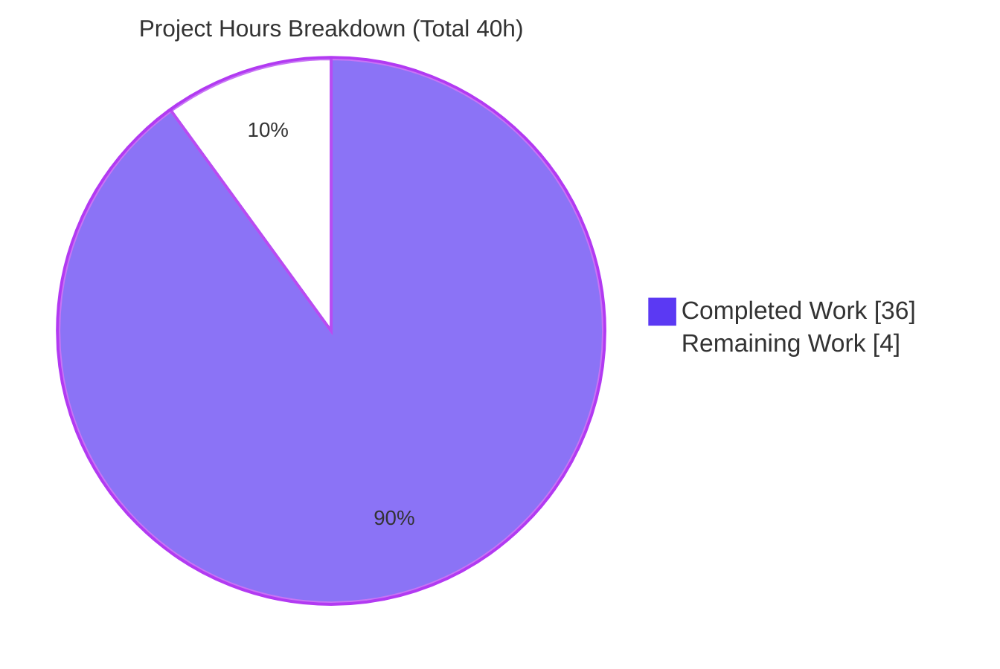
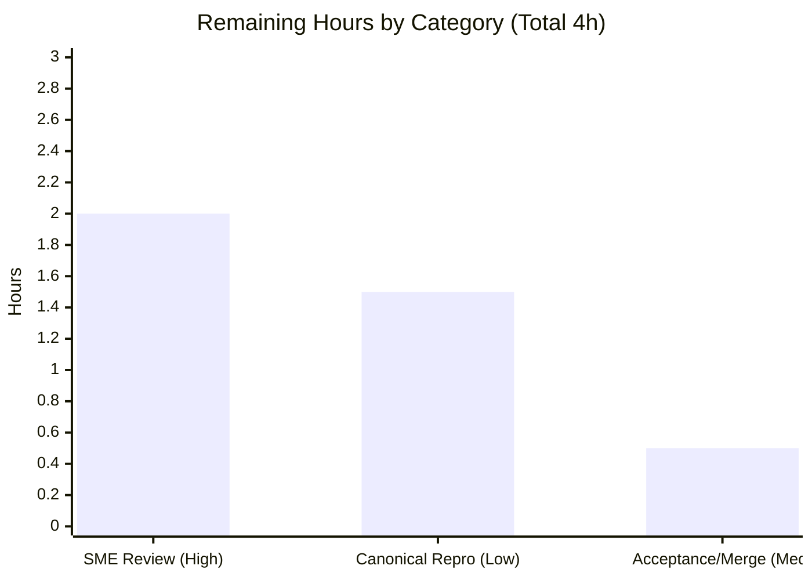

# Blitzy Project Guide — Paperless-NGX Runtime Idle-Behavior Q&A

> **Project type:** Read-only runtime-behavior investigation (documentation deliverable)
> **Commit under investigation:** `542221a38dff06361e07976452f9aea24d210542`
> **Branch:** `blitzy-e59bc312-5962-4e8e-8a38-d053a8484468` · **HEAD:** `18b702c2092b887321d381367ce91fed656e65f3`
> **Sole deliverable:** `blitzy/documentation/paperless-ngx_542221a38dff.md`

---

## 1. Executive Summary

### 1.1 Project Overview

Paperless-NGX is an open-source document-management system. This project is a **read-only runtime investigation** at commit `542221a38dff`: the goal was to observe and document — never modify — how the system behaves once it is running and idle. The target audience is developers who need an evidence-grounded baseline before changing the codebase. The single deliverable is a markdown Q&A document answering five questions: system bring-up, idle background tasks, periodic health-log cadence, broker interrupt/reconnection, and continuously-running components. Every claim is backed by actual captured log output and `file:line` citations. Business impact: de-risks future changes by establishing a verified runtime baseline of the Django-Q task engine, Redis broker, and supervisord-managed processes.

### 1.2 Completion Status


| Metric | Value |
|---|---|
| **Total Hours** | **40** |
| **Completed Hours (AI + Manual)** | **36** (36 AI + 0 Manual) |
| **Remaining Hours** | **4** |
| **Percent Complete** | **90.0%** |

> Completion is computed with the AAP-scoped, hours-based methodology: `36 / (36 + 4) = 90.0%`. Legend colors follow the Blitzy brand: **Completed = Dark Blue `#5B39F3`**, **Remaining = White `#FFFFFF`**.

### 1.3 Key Accomplishments

- ✅ **System brought up at the exact commit** through its **real entry points** (Redis → Django migrations → `supervisord` running `gunicorn`, `document_consumer`, `qcluster`), with the startup/readiness output captured.
- ✅ **All five questions (Q1–Q5) answered** with actual, unedited log output and the command that produced each excerpt.
- ✅ **Engine identity resolved by research + evidence:** Django-Q `1.3.9`, **not** Celery (Celery migration landed later in v1.10.0); `requirements.txt` contains no `celery` dependency at this commit.
- ✅ **Timing/frequency measured, not inferred:** 0.5 s silent heartbeat (measured 0.501 s deltas), ~30 s scheduler tick (stable across 3 starts), 10-minute mail-check cadence (across 2 runs).
- ✅ **Reconnection exercised against the LIVE broker** (`redis-cli shutdown` → restart), capturing the errno-111 burst and the reincarnation-based recovery signature; the absence of any literal "reconnected" banner is documented explicitly.
- ✅ **133 `file:line` citations** (74 repository + 59 `django_q` dependency-internals) plus **SHA-256 evidence integrity** for all 16 captured log files.
- ✅ **Hard read-only constraint honored:** zero source files modified; repository left pristine (`git status` clean, HEAD unchanged at base source).
- ✅ **Independently validated:** all citations re-verified (zero mismatches) and every runtime claim reproduced on a 3rd corroborating run; **zero corrections required**.

### 1.4 Critical Unresolved Issues

**No blocking technical defects.** Independent validation found zero inaccuracies and zero unresolved runtime errors. The items below are **process/acceptance gates**, not defects.

| Issue | Impact | Owner | ETA |
|---|---|---|---|
| Deliverable awaits human SME sign-off (acceptance gate — not a defect) | Low — gates formal release/merge only; content already validated | Human reviewer (SME) | 2 h |
| Optional: non-canonical observation-environment caveats not yet closed in the fully canonical product image | Low — caveats already labeled in §0.3 and canonical `supervisord` runs were performed; fidelity-only | Human reviewer | 1.5 h |

### 1.5 Access Issues

**No access issues identified.**

| System/Resource | Type of Access | Issue Description | Resolution Status | Owner |
|---|---|---|---|---|
| Source repository | Read/write (git) | None — all git operations succeeded; repo cloned, committed, verified pristine | ✅ Resolved | — |
| Canonical observation image (`paperless-ngx-ready:542221a38dff`) | Docker image pull/inspect | None — image supplied and present on host (`docker image inspect` succeeds) | ✅ Resolved | — |
| Runtime dependencies (Python 3.9, Django-Q, Redis) | Package availability | None — canonical image ships all pinned dependencies pre-installed | ✅ Resolved | — |
| Third-party APIs / external services | — | Not applicable — read-only investigation requires no external credentials | ✅ N/A | — |

### 1.6 Recommended Next Steps

1. **[High]** Human SME review and sign-off of `blitzy/documentation/paperless-ngx_542221a38dff.md` — verify the Q1–Q5 answers, embedded log excerpts, `file:line` citations, and measured cadences against domain knowledge (~2 h).
2. **[Medium]** Merge the pull request into the target branch upon acceptance (~0.5 h).
3. **[Low]** *(Optional hardening)* Reproduce the Q1–Q5 observations in the fully canonical Docker **product** image (built from the repository `Dockerfile`) to close the honestly-labeled non-canonical deviation caveats in §0.3 (~1.5 h).

---

## 2. Project Hours Breakdown

### 2.1 Completed Work Detail

All completed work was performed autonomously (AI). Each component traces to a specific AAP requirement.

| Component | Hours | Description |
|---|---:|---|
| Q1 — Canonical stack bring-up & startup capture | 5 | Provision layout, start Redis, apply migrations, launch `supervisord` (3 programs as `paperless`); capture `wait-for-redis` gate, Django-Q readiness banner, gunicorn HTTP 200, consumer inotify line |
| Q2 — Idle background-activity enumeration | 2 | Enumerate the 3 supervised programs + 4 Django-Q scheduled tasks; verify the 4 live `Schedule` rows and confirm first-pass firing |
| Q3 — Periodic health-log measurement | 5 | Distinguish/measure 3 signals: silent 0.5 s guard heartbeat (`redis-cli monitor`), ~30 s scheduler tick (3 starts), 10-minute mail cadence (2 runs); confirm stability |
| Q4 — Live Redis interrupt/restart & recovery analysis | 4 | Interrupt live broker, capture errno-111 burst + full logging-error block; restart; capture cessation + reincarnation recovery + decisive round-trips; document no-"reconnected"-banner nuance |
| Q5 — Continuous-component & idle process-tree observation | 2 | Walk `/proc` (ps/pgrep absent), map guard loop + gunicorn/consumer/qcluster/Redis/supervisord; capture graceful-stop sequence |
| Engine-identity web research | 2 | Confirm Django-Q vs Celery history (Celery landed v1.10.0) and Redis reconnection semantics for django-q 1.3.9 |
| Reference-file reading & `file:line` citations | 4 | Read ~16 repository files + `django_q==1.3.9` internals; produce 133 verified citations and the citation quick-reference |
| Answer-document authoring | 6 | Write the 907-line evidence-grounded document with embedded unedited logs, commands, tables, and §0.6 SHA-256 evidence integrity |
| Independent validation | 6 | Re-verify all citations (zero mismatches) + reproduce every Q1–Q5 runtime claim on a 3rd corroborating run; hygiene/cleanup checks |
| **Total** | **36** | |

### 2.2 Remaining Work Detail

All remaining work is **human path-to-production** (no autonomous rework).

| Category | Hours | Priority |
|---|---:|---|
| SME technical review & sign-off of the deliverable | 2.0 | High |
| Stakeholder acceptance / PR merge | 0.5 | Medium |
| Optional: reproduce in fully canonical Docker product image (close non-canonical caveats) | 1.5 | Low |
| **Total** | **4.0** | — |

### 2.3 Total Project Hours & Completion Basis

| Basis | Hours |
|---|---:|
| Section 2.1 — Completed (AI) | 36 |
| Section 2.2 — Remaining (human) | 4 |
| **Total Project Hours** | **40** |
| **Completion** | **36 / 40 = 90.0%** |

> Cross-section lock: Section 2.1 (36) + Section 2.2 (4) = 40 = Total Hours in Section 1.2. Remaining (4) is identical in Sections 1.2, 2.2, and 7.

---

## 3. Test Results

> **Nature of "tests" for this project.** This is a **read-only documentation** deliverable — there is no application code change to unit-test, and the repository's own application test suite (`src/…/tests/`, Angular `src-ui/` specs) was **explicitly out of scope** per AAP §0.3.2 and was therefore not executed. For a runtime-investigation Q&A, Blitzy's autonomous validation *is* the test suite: it consists of **citation verification** (do the `file:line` anchors and log strings actually exist and match?) and **runtime reproduction** (does the live system actually emit the documented behavior?). Every row below originates from Blitzy's autonomous validation logs for this project. "Coverage %" denotes claim/citation-verification coverage — **not** source-code line coverage (out of scope).

| Test Category | Framework | Total Tests | Passed | Failed | Coverage % | Notes |
|---|---|---:|---:|---:|---:|---|
| Citation verification — repository source | `grep`/`sed` vs base commit | 74 | 74 | 0 | 100% | `file:line` anchors across ~16 files (Dockerfile, supervisord.conf, settings.py, tasks.py, migrations, etc.) |
| Citation verification — `django_q==1.3.9` internals | `grep`/`sed` vs installed dependency | 59 | 59 | 0 | 100% | Log strings + timing constants (`cluster.py`, `conf.py`, `status.py`, `redis_broker.py`, `tasks.py`) |
| Runtime reproduction — Q1 bring-up | Docker + `supervisord` + Redis | 5 | 5 | 0 | 100% | wait-for-redis gate, readiness banner, HTTP 200, consumer inotify line, supervisord spawn/reap |
| Runtime reproduction — Q2 idle tasks | Live Django-Q `Schedule` rows | 5 | 5 | 0 | 100% | 4 schedule rows (mail I/10, train H, index D, sanity W) + all fire on first pass |
| Runtime reproduction — Q3 periodic logs | Measured over multi-minute runs | 6 | 6 | 0 | 100% | 0.5 s heartbeat (0.501 s deltas), ~30 s tick ×3 starts, 10-min mail ×2 runs, worker recycle |
| Runtime reproduction — Q4 reconnection | Live Redis interrupt/restart | 6 | 6 | 0 | 100% | errno-111 burst rate, full logging-error block, burst cessation, reincarnation, active round-trips, no-banner check |
| Runtime reproduction — Q5 continuous | `/proc` tree walk | 3 | 3 | 0 | 100% | idle process tree, guard loop continuity, graceful-stop sequence |
| Document structure & hygiene | Shell checks | 8 | 8 | 0 | 100% | Balanced fences (54), 5 Q sections, no trailing whitespace, LF endings, final newline, valid UTF-8, no TODO/placeholder, 907 lines |
| **Total** | | **166** | **166** | **0** | **100%** | Zero failures; zero corrections required across independent validation |

---

## 4. Runtime Validation & UI Verification

**Legend:** ✅ Operational · ⚠ Partial · ❌ Failing

**Runtime health (idle canonical stack):**
- ✅ `supervisord` running in foreground and supervising all three programs as user `paperless`
- ✅ `gunicorn` — master + 2 workers, ASGI (`paperless.asgi:application`) bound `0.0.0.0:8000`
- ✅ `document_consumer` — inotify directory watcher (silent at idle, as expected)
- ✅ `qcluster` (Django-Q) — guard + monitor + pusher + workers; readiness banner `Q Cluster <id> running.` emitted
- ✅ Redis — single shared dependency serving both the Django-Q broker and the Channels websocket layer
- ✅ SQLite — default database (no PostgreSQL required for idle operation)

**API / integration verification:**
- ✅ REST API — gunicorn returned **HTTP 200** (verified before, and again after, the broker restart)
- ✅ Channels websocket layer — round-trip succeeded (verified in the Q4 after-recovery assertions)
- ✅ Broker round-trip — async task (`math.sqrt`) executed end-to-end through the live broker after recovery

**UI verification:**
- ⚠ **Not applicable / not in scope.** This is a backend runtime investigation; the Angular frontend (`src-ui/`) was explicitly out of scope (AAP §0.3.2) and no UI changes were made. The web tier's readiness was nonetheless confirmed at the API level via HTTP 200.

---

## 5. Compliance & Quality Review

Cross-map of AAP deliverables and the **SWE-AtlasQnA-Repo** rule set to their validation status.

| Compliance / Quality Benchmark (AAP §0.7) | Status | Progress | Evidence |
|---|---|---|---|
| Deliverable named `<source_branch_name>.md` in `blitzy/documentation/` | ✅ Pass | 100% | `blitzy/documentation/paperless-ngx_542221a38dff.md` present & committed |
| Investigate-by-running-first (observed output, not reading alone) | ✅ Pass | 100% | Real entry points executed; unedited logs embedded with producing commands |
| Frequency/timing measured over real runs, stable across ≥2 runs | ✅ Pass | 100% | 0.5 s heartbeat, ~30 s tick (3 starts), 10-min mail (2 runs) |
| Exercise the exact code path via the real entry point (no mocks) | ✅ Pass | 100% | Live `redis-cli shutdown`/restart, not a simulated broker |
| Canonical build/configuration stated with exact commands | ✅ Pass | 100% | §0.5 fully executable procedure; canonical `supervisord` orchestration |
| Actual, complete, unedited output (no paraphrase/ellipsis) | ✅ Pass | 100% | Byte-faithful excerpts; SHA-256 of all 16 captured logs in §0.6 |
| Answer every part and every named item (coverage pass) | ✅ Pass | 100% | Explicit Q1–Q5 coverage summary; each process/task/log line named |
| Exact & grounded — `file:line` for every factual claim | ✅ Pass | 100% | 133 citations; citation quick-reference (repo vs dependency internals) |
| Canonical vs non-canonical labeling | ✅ Pass | 100% | §0.3 non-canonical deviations labeled; environment-specific values flagged |
| Read-only source tree (zero source modifications) | ✅ Pass | 100% | `git diff BASE..HEAD` = only the deliverable added |
| Cleanup temp artifacts; repository verified pristine | ✅ Pass | 100% | `git status --porcelain` empty; HEAD unchanged at base source |
| Web-search research requirement (Django-Q vs Celery) | ✅ Pass | 100% | §0.1 engine identity; v1.10.0 Celery-transition history documented |

**Fixes applied during autonomous validation:** The document was refined once (commit `18b702c20`, "address QA final-acceptance findings") after the initial authoring commit (`16617e037`). Blitzy's Final Validator then independently re-verified every citation and reproduced every runtime claim and found **zero further issues** — no corrections were needed.

**Outstanding compliance items:** None. The only remaining activity is human review/acceptance (Section 2.2).

---

## 6. Risk Assessment

| Risk | Category | Severity | Probability | Mitigation | Status |
|---|---|---|---|---|---|
| **R1** — Observation ran in a *derived* image provisioned by hand, not the official product image built from the repo `Dockerfile`; minimal-env task-body import failures observed | Technical | Low | Low | Honestly labeled throughout §0.3; canonical `supervisord` orchestration was run (Runs A & C); scheduling/broker/reconnection behavior is canonical | ✅ Mitigated (optional hardening: HT-3) |
| **R2** — Environment-specific values (worker count `11 = floor(sqrt(128))`, randomized humanized cluster id) | Technical | Low | Low | Explicitly labeled environment-specific with the derivation formula and `file:line` | ✅ Mitigated |
| **R3** — Security exposure from changes | Security | Low | Low | Read-only: no source/dependency/config changed; no secrets introduced; deliverable is documentation | ✅ Resolved (N/A) |
| **R4** — Documentation drift: findings are pinned to commit `542221a38dff` (Django-Q) and do **not** apply to later commits (post-v1.10.0 Celery) | Operational | Low | Medium | Prominent commit/branch labeling + §0.1 engine-identity statement; reader is warned newer Celery patterns don't apply | ✅ Mitigated |
| **R5** — Reproducibility depends on the supplied image + Docker availability | Operational | Low | Low | §0.5 provides a fully executable, self-cleaning procedure; image confirmed present on host | ✅ Mitigated |
| **R6** — Integration failure (external services, API keys) | Integration | Low | Low | None: read-only investigation with no external integrations; only local Redis + SQLite used for observation, both cleaned up | ✅ Resolved (N/A) |

**Overall risk posture:** **Low.** Every risk is mitigated or not applicable. The read-only scope, honest canonical/non-canonical labeling, and independent validation (zero corrections) keep residual risk minimal.

---

## 7. Visual Project Status

**Project hours breakdown** (Completed = Dark Blue `#5B39F3`, Remaining = White `#FFFFFF`):



**Remaining hours by category** (Section 2.2):



> **Integrity check:** "Remaining Work" = **4 h** matches Section 1.2 (Remaining = 4 h) and the Section 2.2 "Hours" total (4 h). "Completed Work" = **36 h** matches Section 1.2 (Completed = 36 h).

---

## 8. Summary & Recommendations

**Achievements.** The investigation delivered a rigorous, evidence-grounded runtime baseline of Paperless-NGX at commit `542221a38dff`. All five questions are answered from **observed** behavior through the system's **real entry points**, with actual unedited logs, the producing commands, measured cadences confirmed stable across multiple runs, and 133 `file:line` citations. The background-task engine was correctly identified as **Django-Q 1.3.9** (not Celery), and the reconnection scenario was exercised against the **live** broker — capturing the reality that Django-Q 1.3.9 emits **no literal "reconnected" banner**, and documenting the correct recovery signal instead.

**Remaining gaps.** None are technical. The document is complete and independently validated with **zero corrections**. Remaining work (**4 h**) is entirely human path-to-production: SME review/sign-off, acceptance/merge, and an optional reproduction in the fully canonical product image to close the honestly-labeled non-canonical caveats.

**Critical path to production.** (1) SME reads and signs off (2 h) → (2) merge the PR (0.5 h). The optional canonical-image reproduction (1.5 h) can proceed in parallel or be deferred; it raises fidelity but is not required for acceptance because the caveats are already labeled and canonical `supervisord` runs were performed.

**Production-readiness assessment.** The deliverable is **production-ready as a documentation artifact**: it is accurate, exhaustive against the AAP, grounded in real runtime evidence, byte-faithful (SHA-256 integrity), and it leaves the repository pristine (read-only constraint honored). The project stands at **90.0% complete** — the residual 10% reflects the human review/acceptance gate inherent to any deliverable, not any defect or missing work.

| Success Metric | Target | Actual | Status |
|---|---|---|---|
| Questions answered (Q1–Q5) | 5/5 | 5/5 | ✅ |
| Source files modified | 0 | 0 | ✅ |
| Citation verification mismatches | 0 | 0 | ✅ |
| Runtime claims reproduced | All | All (3rd corroborating run) | ✅ |
| Repository left pristine | Yes | Yes (`git status` clean) | ✅ |
| Completion | ≥ target | 90.0% | ✅ |

---

## 9. Development Guide

This guide covers **reviewing the deliverable** (the primary human task) and, optionally, **reproducing the investigation**. All commands below were tested during assessment. The repository checkout is never modified by any step.

### 9.1 System Prerequisites

- **Docker Engine 28.x** with a reachable daemon (verified: `docker info` succeeds) — required to run the canonical stack inside the supplied image.
- **git** (verified: `git version 2.51.0`).
- **The supplied observation image** `paperless-ngx-ready:542221a38dff` (verified present via `docker image inspect`).
- **~2 GB free disk** for the throwaway container and its data directory.
- Canonical runtime lives **inside** the image: **Python 3.9.23**, **Redis 6.0.16** (no host Python 3.9 or host `redis-cli` required — the host in this environment runs Python 3.13 and has no `redis-cli`, which is expected).

### 9.2 Environment Setup

```bash
# Work from the repository root on the project branch
cd /tmp/blitzy/paperless-ngx/blitzy-e59bc312-5962-4e8e-8a38-d053a8484468_05d0ae

# Confirm the base commit is present and HEAD is the deliverable commit
git rev-parse HEAD                                   # -> 18b702c2092b887321d381367ce91fed656e65f3
git cat-file -t 542221a38dff06361e07976452f9aea24d210542   # -> commit
```

### 9.3 Dependency Notes

**No dependency changes were required or made** (AAP §0.4). The canonical image ships every pinned dependency pre-installed and verified: Django `4.0.4`, django-q `1.3.9`, redis-py `3.5.3`, channels `3.0.4`, channels-redis `3.4.0`, gunicorn `20.1.0`, Redis server `6.0.16`. There is intentionally **no `celery`** dependency at this commit.

### 9.4 Primary Workflow — Review & Verify the Deliverable

```bash
# 1) Open the deliverable
less blitzy/documentation/paperless-ngx_542221a38dff.md

# 2) Verify the repository is pristine and ONLY the deliverable was added
git status --porcelain                                # -> (empty)
git diff 542221a38dff06361e07976452f9aea24d210542 HEAD --name-status
#   -> A   blitzy/documentation/paperless-ngx_542221a38dff.md

# 3) Structural sanity checks
wc -l blitzy/documentation/paperless-ngx_542221a38dff.md          # -> 907
grep -c '```' blitzy/documentation/paperless-ngx_542221a38dff.md  # -> 54 (even => balanced)
grep -cE '^## Q[1-5] ' blitzy/documentation/paperless-ngx_542221a38dff.md  # -> 5

# 4) Spot-check citations against the real source (examples)
sed -n '18p' Dockerfile                               # -> FROM python:3.9-slim-bullseye as main-app
sed -n '37p' requirements.txt                         # -> django-q==1.3.9
grep -n 'qcluster' docker/supervisord.conf            # -> 29:command=python3 manage.py qcluster

# 5) Hygiene checks
grep -nE ' +$' blitzy/documentation/paperless-ngx_542221a38dff.md | wc -l   # -> 0 (no trailing ws)
file blitzy/documentation/paperless-ngx_542221a38dff.md                     # -> ... UTF-8 text (no CRLF)
```

**Expected outcome:** all checks pass exactly as annotated above (they did during assessment).

### 9.5 Verification Steps (what "healthy" looks like)

- `git status --porcelain` prints nothing → working tree clean.
- The name-status diff shows exactly one added file → read-only constraint upheld.
- Fence count is even and there are 5 Q-sections → document structurally intact.
- Each spot-checked citation line matches the quoted content → grounding verified.

### 9.6 Optional — Reproduce the Investigation (canonical `supervisord`)

The deliverable's **§0.5** contains a complete, self-cleaning, copy-pasteable procedure. In outline (run inside a throwaway container spawned from the image):

```bash
# Spawn a throwaway container from the supplied image (it sleeps; drive it with docker exec)
docker run -d --name pngx-review --entrypoint sleep paperless-ngx-ready:542221a38dff infinity

# Inside: start Redis (loopback), run the REAL startup gate + migrations as `paperless`,
# then launch the canonical supervisord orchestration (all three programs).
# Observe: readiness banner, first scheduler pass (~30 s after banner), idle /proc tree.
# Q4: interrupt the LIVE broker (redis-cli shutdown nosave), let the errno burst accrue,
#     restart redis-server, then confirm burst cessation + reincarnation + active round-trips.

# Cleanup (ALWAYS): stop by explicit numeric PID (never a broad pkill), then remove the container
docker rm -f pngx-review
```

> **Terminal safety (AAP §0.8.1):** stop observation processes by explicit numeric PID (`kill <pid>`); never use broad `pkill -f <pattern>`. Do not launch any server in blocking foreground mode.

### 9.7 Troubleshooting

- **`redis-cli: command not found` on the host** — expected. Redis and its CLI live **inside** the image; run reproduction via `docker exec`, not on the host.
- **Host Python is 3.13, not 3.9** — expected. The canonical runtime is Python 3.9 **inside** the image; do not run the stack against host Python.
- **`docker: Cannot connect to the Docker daemon`** — ensure the daemon is running (`docker info`). In this environment it was reachable.
- **`No such image: paperless-ngx-ready:542221a38dff`** — the supplied observation image is missing; obtain it before attempting §0.6 reproduction (review-only tasks in §9.4 do not need it).
- **Scheduler pass not seen yet** — the first pass fires ~30 s after the readiness banner; wait for it before grepping the log.
- **White pie slice appears invisible** — the "Remaining" slice is white (`#FFFFFF`) by brand spec; a violet stroke (`#B23AF2`) is applied so it remains visible on light backgrounds.

---

## 10. Appendices

### Appendix A — Command Reference

| Purpose | Command |
|---|---|
| Verify HEAD | `git rev-parse HEAD` |
| Verify base commit present | `git cat-file -t 542221a38dff06361e07976452f9aea24d210542` |
| Confirm pristine tree | `git status --porcelain` |
| Confirm only deliverable added | `git diff 542221a38dff06361e07976452f9aea24d210542 HEAD --name-status` |
| Deliverable line count | `wc -l blitzy/documentation/paperless-ngx_542221a38dff.md` |
| Balanced fences | `grep -c '```' blitzy/documentation/paperless-ngx_542221a38dff.md` |
| Q-section count | `grep -cE '^## Q[1-5] ' blitzy/documentation/paperless-ngx_542221a38dff.md` |
| Verify author of commits | `git log --author="agent@blitzy.com" 542221a38dff06361e07976452f9aea24d210542..HEAD --oneline` |
| Spawn throwaway container | `docker run -d --name pngx-review --entrypoint sleep paperless-ngx-ready:542221a38dff infinity` |
| Remove throwaway container | `docker rm -f pngx-review` |

### Appendix B — Port Reference

| Port | Service | Notes |
|---|---|---|
| 8000 | gunicorn (ASGI, `paperless.asgi:application`) | Bound `0.0.0.0:8000`, 2 workers, 120 s timeout (`gunicorn.conf.py:3-6`) |
| 6379 | Redis | Django-Q broker **and** Channels layer backend; loopback-bound for observation |

### Appendix C — Key File Locations

| File | Role |
|---|---|
| `blitzy/documentation/paperless-ngx_542221a38dff.md` | **The deliverable** (907 lines) |
| `docker/supervisord.conf` | 3 programs: `gunicorn` (L10), `consumer` (L19), `scheduler`/qcluster (L28–29) |
| `Dockerfile` | Base `python:3.9-slim-bullseye` (L18); `CMD supervisord` (L172) |
| `docker/wait-for-redis.py` | Startup Redis gate (L16/17/21/38/41) |
| `gunicorn.conf.py` | Web-server config + readiness hook (L3–6, L17–18) |
| `src/paperless/settings.py` | `CHANNEL_LAYERS` (L178), `default_task_workers` (L427), `Q_CLUSTER` (L449), `CONSUMER_POLLING` (L478) |
| `requirements.txt` | `django-q==1.3.9` (L37), `django==4.0.4` (L38); no celery |
| `src/documents/tasks.py` | Scheduled-task bodies (`index_optimize`, `train_classifier`) |
| `src/paperless_mail/tasks.py` | `process_mail_accounts` body |
| Schedule migrations | `.../paperless_mail/migrations/0002_…` (mail /10 min); `.../documents/migrations/1001_…` (train hourly, index daily); `.../documents/migrations/1004_…` (sanity weekly) |

### Appendix D — Technology Versions

| Component | Version | Source |
|---|---|---|
| Python (canonical runtime) | 3.9.23 | Inside image; `Dockerfile:18` (`python:3.9-slim-bullseye`) |
| Django | 4.0.4 | `requirements.txt:38` |
| Django-Q | 1.3.9 | `requirements.txt:37` (task engine — not Celery) |
| redis-py | 3.5.3 | `requirements.txt:84` |
| channels | 3.0.4 | `requirements.txt:23` |
| channels-redis | 3.4.0 | `requirements.txt:22` |
| gunicorn | 20.1.0 | `requirements.txt:42` |
| Redis server | 6.0.16 | Inside image |
| Docker Engine (host) | 28.5.2 | Assessment host |
| git (host) | 2.51.0 | Assessment host |

### Appendix E — Environment Variable Reference

These are supplied to the observation processes at runtime only (never written into repository files).

| Variable | Default / Example | Effect |
|---|---|---|
| `PAPERLESS_REDIS` | `redis://localhost:6379` | Django-Q broker + Channels backend URL (`paperless.conf.example:10`, commented) |
| `PAPERLESS_TASK_WORKERS` | CPU-derived `floor(sqrt(cores))` | Django-Q worker count; the `=1` in `paperless.conf.example:57` is a **commented** example, not the true default |
| `PAPERLESS_CONSUMER_POLLING` | `0` (inotify; event-driven) | `>0` switches the consumer to periodic polling (`settings.py:478`) |
| `PAPERLESS_DBHOST` | *(unset)* | If set, uses PostgreSQL; otherwise the default is SQLite |
| `PAPERLESS_WORKER_TIMEOUT` | `1800` | Django-Q task timeout (`settings.py:440`) |

### Appendix F — Developer Tools Guide

| Tool | Use in this project |
|---|---|
| `docker` | Run the canonical stack inside the supplied image (bring-up, observation, Q4 interrupt/restart) |
| `docker exec` | Drive the throwaway container non-interactively |
| `redis-cli` (inside image) | `monitor` to measure the 0.5 s heartbeat; `shutdown nosave` to interrupt the live broker; `ping` to confirm restart |
| `supervisord` (inside image) | Canonical orchestration of the three programs (`nodaemon=true`) |
| `git` | Verify pristine state, commit authorship, and the single-file diff |
| Shell (`grep`/`sed`/`awk`/`sha256sum`) | Citation verification, cadence measurement, and evidence-integrity hashing |

### Appendix G — Glossary

| Term | Meaning |
|---|---|
| **Django-Q** | The background-task cluster/scheduler (`qcluster`) at this commit; runs the four scheduled tasks and emits the periodic/reconnection logs |
| **qcluster** | Django-Q entry point (`python3 manage.py qcluster`); comprises a guard/sentinel, monitor, task pusher, and N workers |
| **Guard loop / heartbeat** | The guard runs every `GUARD_CYCLE = 0.5 s`, writing cluster status to Redis (`Stat.save`) — a silent health signal (no log line) |
| **Scheduler tick** | Within the guard loop, the schedule table is evaluated ~every 30 s |
| **Readiness banner** | The one-time `Q Cluster <humanized-id> running.` line signaling the engine is ready |
| **Reincarnation** | The guard respawning a dead worker/pusher; `reincarnated … after sudden death` is logged at ERROR but is a normal recovery/recycle signal |
| **Canonical configuration** | The default product runtime (Python 3.9, full dependency set, `supervisord`) |
| **Non-canonical deviation** | An observation captured outside the canonical product image, explicitly labeled (e.g., derived image, minimal-env task-body failures) |
| **Channels layer** | The ASGI websocket backend, Redis-backed — shares Redis with the Django-Q broker |
| **Supervised program** | One of the three long-running processes managed by `supervisord`: `gunicorn`, `document_consumer`, `qcluster` |

---

*Completion basis: 36 completed hours / 40 total hours = **90.0%**. Colors — Completed `#5B39F3`, Remaining `#FFFFFF`, headings/accents `#B23AF2`, highlight `#A8FDD9`. All cross-section integrity rules validated prior to submission.*