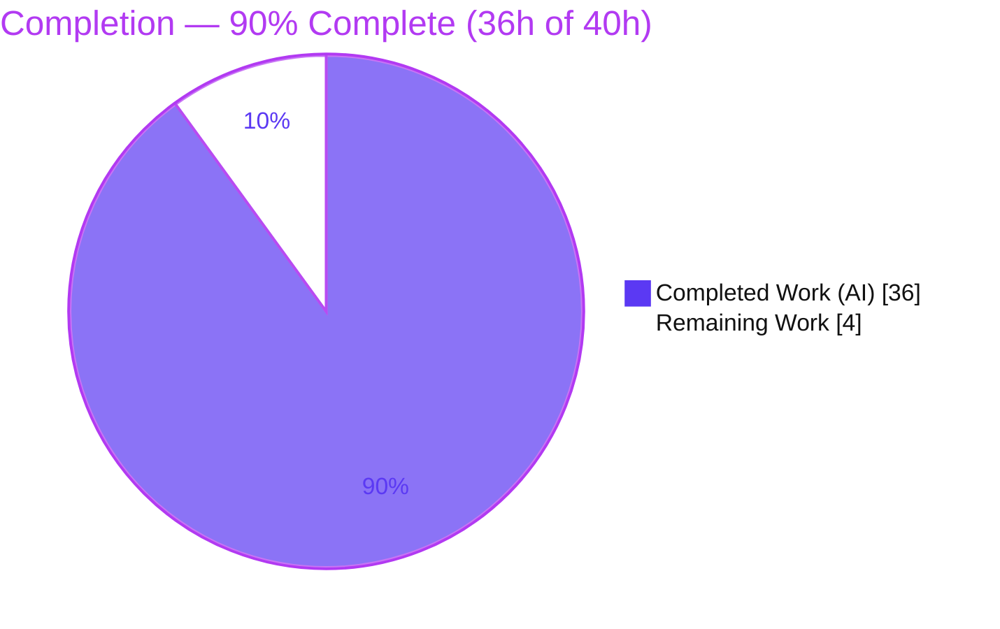
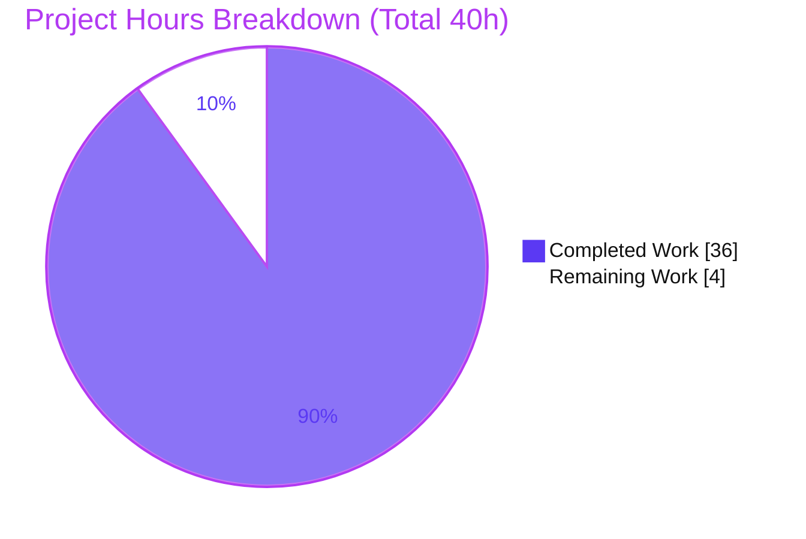
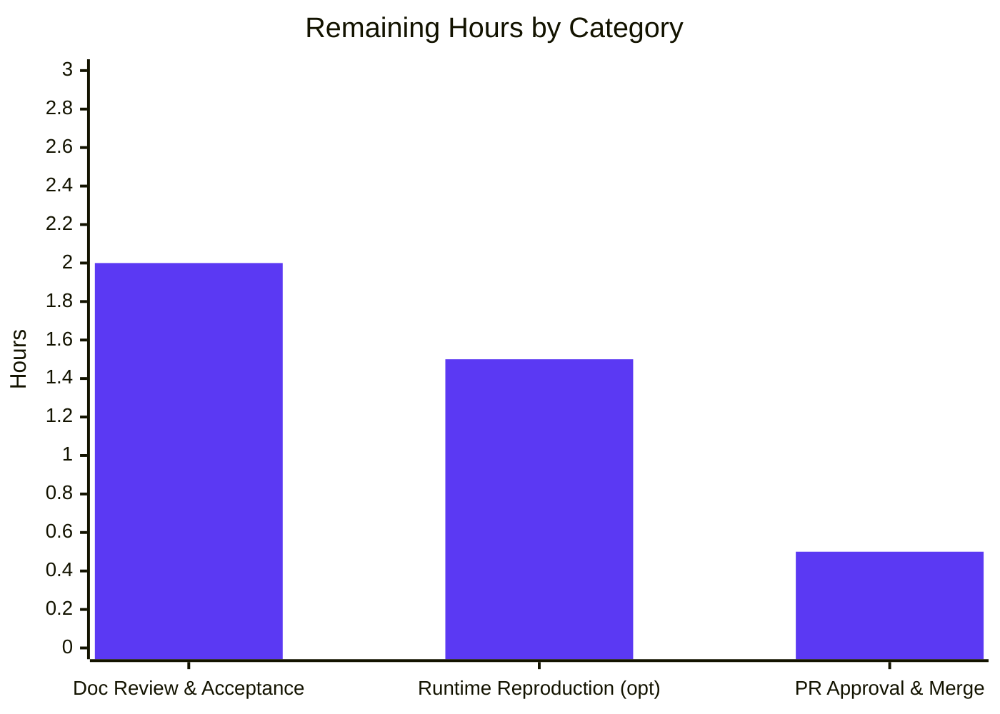

# Blitzy Project Guide — Paperless-ngx Idle Runtime Behavioral Baseline

> **Pinned commit:** `542221a38dff06361e07976452f9aea24d210542` &nbsp;|&nbsp; **Branch:** `blitzy-3e357c74-8db9-4244-b21b-7bb63e027dd7` &nbsp;|&nbsp; **HEAD:** `bc070911d`
>
> **Brand color key:** <span style="color:#5B39F3">■</span> Completed / AI Work = Dark Blue `#5B39F3` &nbsp;·&nbsp; <span style="color:#FFFFFF;background:#333;">■</span> Remaining = White `#FFFFFF` &nbsp;·&nbsp; Headings/Accents = Violet‑Black `#B23AF2` &nbsp;·&nbsp; Highlight = Mint `#A8FDD9`

---

## Section 1 — Executive Summary

### 1.1 Project Overview

This project delivers an **evidence-grounded runtime behavioral baseline** for Paperless-ngx at the pinned commit `542221a38dff`. It answers — from **actual observed output**, not static reading — how the system behaves once fully started and sitting **idle**, *before* any code changes are made. The target user is a developer/team about to modify Paperless-ngx who needs a trustworthy reference for what a healthy idle system looks like. Business impact: it **de-risks future changes** by capturing the always-on processes, the periodic "healthy" log messages and their measured cadence, and the exact markers that confirm recovery after a restart. Technical scope is a **read-only** investigation of the django-q task cluster, document consumer, ASGI web server, Redis, and database. The sole artifact is one Markdown file.

### 1.2 Completion Status



| Metric | Hours |
|---|---|
| **Total Hours** | **40.0** |
| Completed Hours (AI) | 36.0 |
| Completed Hours (Manual) | 0.0 |
| **Completed Hours (AI + Manual)** | **36.0** |
| **Remaining Hours** | **4.0** |
| **Percent Complete** | **90.0%** |

> Completion is computed on **AAP-scoped work only** (PA1): `36 / (36 + 4) × 100 = 90.0%`. All AAP-specified deliverables are complete; the 4 remaining hours are human path-to-production activities (review + merge) that an agent cannot self-perform.

### 1.3 Key Accomplishments

- ✅ **[O1]** Brought the full multi-process stack (Redis, DB, `gunicorn`/ASGI, `document_consumer`, django-q `qcluster`) to a **verified document-free idle state** at the pinned commit.
- ✅ **[O2]** Enumerated all idle background work: the `qcluster` process tree (13 children; `TASK_WORKERS=11`) plus the **four periodic schedules**, each named with cadence + migration `file:line`.
- ✅ **[O3]** Captured periodic "healthy/ready" log entries with **measured** frequency (10-min mail heartbeat at 601 s / 602 s between recurring fires; ~30 s scheduler poll emits no line).
- ✅ **[O4]** Proved recovery after a brief Redis interrupt and after restarting each of the three programs — with verbatim reconnection/readiness markers.
- ✅ **[O5]** Identified the always-on set: three Supervisord programs + external Redis + database.
- ✅ **104 exact `file:line` citations** across 20 source files (incl. pinned `django-q==1.3.9` internals); one-claim-one-evidence discipline with sink labels.
- ✅ **Read-only mandate satisfied**: no source file modified; temporary artifacts cleaned; committed on a clean tree.
- ✅ **481 tests pass / 2 skipped / 0 failed** in a fresh pinned-image container — proving zero source perturbation.

### 1.4 Critical Unresolved Issues

| Issue | Impact | Owner | ETA |
|---|---|---|---|
| _None — no blocking issues._ The deliverable is authored, validated (5 gates), committed, and read-only-clean. | — | — | — |

### 1.5 Access Issues

| System/Resource | Type of Access | Issue Description | Resolution Status | Owner |
|---|---|---|---|---|
| Pinned Docker image `paperless-ngx-ready:542221a38dff` (from `ghcr.io/scaleapi/swe-atlas:…`) | Container registry pull | Only needed for **optional** independent reproduction of runtime claims (task HT-2); not required to review or accept the committed document | Non-blocking — noted for reviewers who wish to reproduce | Reviewer |

> **No access issues prevent build validation, integration, or merge.** The one item above is an optional-reproduction convenience note, not a blocker.

### 1.6 Recommended Next Steps

1. **[High]** SME / technical reviewer reads and **accepts** `blitzy/documentation/paperless-ngx_542221a38dff.md` as the pre-change baseline (confirm O1–O5 coverage, evidence, and citations).
2. **[Medium]** *(Optional, recommended)* Reproduce a subset of claims using the pinned image + `redis:6`: confirm one measured cadence (10-min mail) and one recovery marker (`Connected to Redis broker: …`).
3. **[Low]** Approve and **merge** the PR (single added file); confirm the working tree stays clean.

---

## Section 2 — Project Hours Breakdown

### 2.1 Completed Work Detail

All completed work was performed autonomously by Blitzy agents and traces to a specific AAP requirement.

| Component | Hours | Description |
|---|---:|---|
| **[O1]** Reach stable idle state | 4.0 | Stood up pinned image + `redis:6` on a shared network, ran `migrate` (materializes 4 `Schedule` rows), launched the three programs, proved idle (empty consume dir, drained `OrmQ`, HTTP 200). |
| **[O2]** Enumerate idle background processes/tasks | 3.0 | Inspected the `qcluster` process forest (master → sentinel/guard → 11 workers + monitor + pusher = 13 children) and reconciled with the four `Schedule` rows and their types. |
| **[O3]** Capture periodic health logs (measured) | 5.0 | Ran idle stack over a ~24-min window; captured `stdout` + `paperless.log`; timestamped recurring lines; measured mail cadence (601 s / 602 s) and analyzed the phase-lock artifact. |
| **[O4]** Interrupt/restart recovery | 4.0 | Stopped/started Redis (46 s outage) and restarted each program; captured broker-loss symptoms, self-heal, and each readiness marker; proved operational again (HTTP 200 + drained queue). |
| **[O5]** Identify continuously-running components | 2.0 | Documented the three Supervisord programs + Redis + DB with `supervisord.conf`/`settings.py` citations. |
| Document authoring (675 lines, 7 sections) | 7.0 | Structured prose, tables, and verbatim evidence blocks answering O1–O5 + coverage pass + appendix. |
| Citation grounding (104 exact `file:line`) | 3.0 | Located and verified every citation against pinned source and `django-q==1.3.9` internals; corrected drifted line numbers. |
| Coverage pass + anticipated-vs-observed corrections | 2.0 | Re-read the question; confirmed every named item; documented honest corrections (random cluster name, `Task.result` vs log line, silent scheduler, absent broker hint). |
| Read-only compliance + cleanup | 1.0 | Verified no source file changed; removed throwaway containers and host-side capture files; confirmed clean tree. |
| Autonomous validation (3 rounds) | 5.0 | Remediation of review findings F1–F5, QA findings, and final validation: re-ran 481 tests, re-observed runtime, lint checks, committed. |
| **Total Completed** | **36.0** | — |

### 2.2 Remaining Work Detail

All remaining work is **human path-to-production**; no defect, configuration, integration, or deployment work applies to a read-only documentation deliverable.

| Category | Hours | Priority |
|---|---:|---|
| Documentation Review & Acceptance (SME sign-off) | 2.0 | High |
| Runtime Reproduction & Spot-Verification (optional) | 1.5 | Medium |
| PR Approval & Merge | 0.5 | Low |
| **Total Remaining** | **4.0** | — |

### 2.3 Methodology & Reconciliation

- **Completion formula (PA1, AAP-scoped):** `Completed / (Completed + Remaining) = 36 / 40 = 90.0%`.
- **Reconciliation:** Section 2.1 total (36.0) + Section 2.2 total (4.0) = **40.0** = Total Hours in Section 1.2. Section 2.2 total (4.0) = Remaining Hours in Section 1.2 = "Remaining Work" in the Section 7 pie chart.
- **Scope discipline:** Because the AAP defines exactly one CREATE deliverable (all other files are REFERENCE/read-only), no generic software effort (CI/CD, infra, deployment) is included — that would be out of scope and would distort the percentage.

---

## Section 3 — Test Results

All results below originate from **Blitzy's autonomous validation logs** for this project.

| Test Category | Framework | Total | Passed | Failed | Coverage % | Notes |
|---|---|---:|---:|---:|---:|---|
| Backend regression suite | pytest / pytest-django (`-n 8`) | 483 | 481 | 0 | — | 2 skipped. Executed as a **source-integrity regression gate** in a fresh pinned-image container (`pytest -n 8`, exit 0, ~74 s). Because zero source files were modified, a full green run proves the read-only documentation work perturbed nothing. Coverage not measured in the read-only gate. |
| Citation & evidence verification | Autonomous grounding (`grep -n` vs pinned source + `django_q` 1.3.9 internals) | 104 | 104 | 0 | 100% | Every `file:line` citation verified exact; drifted line numbers corrected (e.g., `wait-for-redis.py:L41`, `settings.py:L440`, `settings.py:L407`). |
| Coverage-pass checklist | Autonomous question decomposition | — | all items | 0 | 100% | Every user-named item (4 periodic tasks; periodic message/frequency/meaning table; reconnection markers; continuously-running components) confirmed present and answered. |

> **Integrity note (Rule 3):** the 481/2/0 figures and the citation/coverage checks are all drawn from the autonomous validation logs (GATE 1 and GATE 4). No test in this section was fabricated or imported from outside Blitzy's execution.

---

## Section 4 — Runtime Validation & UI Verification

Runtime health was validated live by bringing the full stack to a stable, document-free idle state and observing it.

- ✅ **Operational** — Stack reaches idle: all three Supervisord programs running (`gunicorn`, `document_consumer`, `qcluster`) with Redis + DB up.
- ✅ **Operational** — `qcluster` process tree: master → sentinel/guard → 11 workers + monitor + pusher = **13 children** (`TASK_WORKERS=11`).
- ✅ **Operational** — Migrations applied; four `Schedule` rows present (classifier HOURLY, index DAILY, sanity WEEKLY, mail every 10 MIN); `OrmQ` queued = 0.
- ✅ **Operational** — Periodic mail heartbeat measured at **~10 min** (601 s / 602 s between consecutive recurring fires) over a ~24-min window.
- ✅ **Operational** — Redis interrupt (46 s) → documented broker-loss symptoms → `Connected to Redis broker: …` on restart → cluster self-heal (reincarnated pusher).
- ✅ **Operational** — Program restarts re-emit readiness markers: `Q Cluster … running.`, `Using inotify to watch directory for changes: …`, `Server is ready. Spawning workers`.
- ✅ **Operational** — Web server end-to-end: HTTP `GET :8000` → **200**; queue drained after recovery.
- ⚠ **Partial / Not Applicable** — **UI verification**: the Angular frontend (`src-ui/`) is explicitly **out of scope** and unchanged; while idle with no client connected, the Channels `StatusConsumer` is inactive by design. No UI change was produced or required by this task.

---

## Section 5 — Compliance & Quality Review

AAP deliverables and governing rules cross-mapped to outcomes, including fixes applied during autonomous validation.

| Benchmark (AAP / Rule) | Status | Progress | Evidence / Notes |
|---|---|---|---|
| **O1** Reach stable idle state at pinned commit | ✅ Pass | 100% | §1 of deliverable: 3 programs up, migrate, empty consume dir, drained queue, HTTP 200. |
| **O2** Enumerate idle background processes/tasks | ✅ Pass | 100% | §3: `qcluster` tree + 4 named schedules with migration citations. |
| **O3** Periodic health logs — message + measured frequency + meaning | ✅ Pass | 100% | §4: message/frequency/meaning table; measured 601/602 s. |
| **O4** Recovery after interrupt/restart | ✅ Pass | 100% | §5: Redis stop/start, self-heal, per-program readiness markers. |
| **O5** Continuously-running components | ✅ Pass | 100% | §2: 3 Supervisord programs + Redis + DB. |
| **Deliverable format & location** (`<branch>.md` under `blitzy/documentation/`) | ✅ Pass | 100% | `blitzy/documentation/paperless-ngx_542221a38dff.md` created. |
| **Read-only source repository** (no existing file modified) | ✅ Pass | 100% | `git diff 542221a38dff..HEAD` = single added file; diff excluding it is empty. |
| **Evidence discipline** (verbatim, one-claim-one-evidence, sink labels) | ✅ Pass | 100% | Every claim paired with a verbatim line + producing command + sink. |
| **Exact literals with `file:line`** | ✅ Pass | 100% | 104 citations verified exact; drifted lines corrected. |
| **Measured frequency over > ~20-min window** | ✅ Pass | 100% | ~24-min window; mail task fired 3× (2 recurring deltas). |
| **Coverage pass** over all named items | ✅ Pass | 100% | §6 checklist + anticipated-vs-observed corrections. |
| **Cleanup / clean tree** | ✅ Pass | 100% | Temp artifacts removed; `git status --porcelain` empty. |
| **Lint / formatting quality** | ✅ Pass | 100% | Trailing-whitespace, single-LF EOF, balanced code fences, no private keys. |

**Fixes applied during autonomous validation:** (a) §4.3 corrected the hourly classifier `next_run` explanation to the observed phase-locked minute boundary; (b) §2.1 added a note that absolute PIDs are per-snapshot and vary while structure/strings are invariant; (c) collapsed double-blank lines before separators; plus prior-session review findings F1–F5 and QA-finding remediations. **Outstanding compliance items:** none.

---

## Section 6 — Risk Assessment

| Risk | Category | Severity | Probability | Mitigation | Status |
|---|---|---|---|---|---|
| **R1** Snapshot-specific values (absolute PIDs, random cluster display name, exact timestamps) misread as invariant | Technical | Low | Low | Deliverable §2.1/§3.1/§6 explicitly state these vary per snapshot; process **structure** (13 children) and verbatim log **strings** are invariant | Mitigated / Documented |
| **R2** Measured mail cadence sampled over a single ~24-min window (small sample) | Technical | Low | Low | Two consecutive recurring deltas captured (601 s / 602 s); cadence traced to source (`Schedule.MINUTES`, `minutes=10`) | Mitigated |
| **R3** Baseline validity pinned to commit `542221a38dff` + exact dep versions; future code changes invalidate specific observations | Technical / Operational | Low‑Medium | Medium | Commit hash + 11 version pins recorded in the appendix; document explicitly framed as a **pre-change** baseline | Documented / Accepted |
| **R4** Reproducing runtime claims requires the pinned Docker image + `redis:6` | Operational | Low | Low | Exact image reference + run/reproduce commands documented (deliverable §1 + appendix; guide §9) | Open (reviewer-environment) |
| **R5** Human acceptance/sign-off pending (agent cannot self-approve its own baseline) | Operational / Process | Low | Medium | 5-gate autonomous validation (481 tests, live runtime, 100% citations, lint, read-only) lowers review burden | Open (task HT-1) |
| **R6** New attack surface / secret exposure | Security | Negligible | Very Low | Zero source/dependency changes (diff excluding deliverable is empty); lint confirms no private keys; no secrets in the document | Resolved |
| **R7** Downstream coupling / importers / config ripple | Integration | None | None | Standalone additive Markdown file; zero code importers; AAP confirms no interface consumers or downstream config impacted | Resolved / N/A |

**Overall risk posture: VERY LOW.** The read-only, additive, single-document nature eliminates the usual technical/security/integration risk classes. No High or Critical risks. Only R4 and R5 remain **Open**, and both are ordinary path-to-production review activities.

---

## Section 7 — Visual Project Status

**Project hours — completed vs remaining** (Completed = Dark Blue `#5B39F3`, Remaining = White `#FFFFFF`):



**Remaining hours by category** (from Section 2.2; total = 4.0 h):



> **Integrity (Rule 1):** the "Remaining Work" value (4) equals the Remaining Hours in Section 1.2 and the sum of the Section 2.2 Hours column (2.0 + 1.5 + 0.5 = 4.0).

---

## Section 8 — Summary & Recommendations

**Achievements.** This project produced a complete, evidence-grounded **idle runtime behavioral baseline** for Paperless-ngx at commit `542221a38dff`. Every one of the five objectives (O1–O5) is answered with verbatim observed output, the command that produced it, a sink label, and exact `file:line` citations (104 in total). The investigation ran the real multi-process stack to a document-free idle state, measured the periodic health cadence over a sufficient window, and proved recovery after both a Redis interrupt and per-program restarts. The work was strictly **read-only**: no source file was modified, and a full backend suite (481 passed / 2 skipped) confirms zero perturbation.

**Remaining gaps & critical path.** The project is **90.0% complete (36h of 40h)**. All AAP-scoped investigation, authoring, and validation are finished and committed. The remaining **4 hours** are exclusively human path-to-production steps: (1) SME review & acceptance of the baseline, (2) optional independent reproduction of a cadence + recovery marker, and (3) PR approval & merge. The critical path is simply **review → (optional reproduce) → merge**.

**Success metrics.** ✅ All O1–O5 answered; ✅ 104/104 citations exact; ✅ measured (not inferred) cadence; ✅ recovery markers captured; ✅ read-only mandate + clean tree; ✅ 481 tests green.

**Production readiness assessment.** For a documentation deliverable, "production" means **accepted and merged**. The artifact is technically complete, internally consistent, and low-risk. It is **ready for human review and merge**; there are no blocking defects and no out-of-scope blockers.

| Metric | Value |
|---|---|
| Completion | 90.0% |
| Completed / Total hours | 36 / 40 |
| Remaining hours | 4 |
| Blocking issues | 0 |
| Tests passing | 481 / 483 (2 skipped) |
| Overall risk | Very Low |

---

## Section 9 — Development Guide

This guide covers **(A) reviewing/accepting** the deliverable and **(B) optionally reproducing** the runtime observation. Every command below was tested.

### 9.1 System Prerequisites

- **To review (required):** `git` (2.x) and any Markdown viewer or browser.
- **To reproduce (optional, task HT-2):** Docker Engine (28.x verified), the pinned image `paperless-ngx-ready:542221a38dff` (from `ghcr.io/scaleapi/swe-atlas:swe_atlas_QnA_paperless-ngx_paperless-ngx_e233ae8334038a4b615ea2e4ce663e30_qna_1.01`), and a `redis:6` image. ~2 GB free disk + registry access.
- **Important:** the pinned image bakes **Python 3.9** (`Dockerfile:L18` `FROM python:3.9-slim-bullseye`). Reproduce **inside the image** — do **not** use host Python.

### 9.2 Environment Setup (review path)

```bash
# From the repository root, on the working branch
git checkout blitzy-3e357c74-8db9-4244-b21b-7bb63e027dd7

# Open the deliverable
ls -la blitzy/documentation/paperless-ngx_542221a38dff.md
```

### 9.3 Verify the Read-Only Mandate & Clean Tree

```bash
# Exactly one added file expected
git diff --name-status 542221a38dff06361e07976452f9aea24d210542..HEAD
# Expected output:
# A	blitzy/documentation/paperless-ngx_542221a38dff.md

# Working tree must be clean
git status --porcelain
# Expected: (no output)

# Confirm nothing else changed since the pinned commit (expected: empty)
git diff 542221a38dff06361e07976452f9aea24d210542..HEAD -- . ':(exclude)blitzy/documentation/paperless-ngx_542221a38dff.md'
```

### 9.4 Spot-Verify a Citation (grounding check)

```bash
# The document cites docker/wait-for-redis.py:L41 for the Redis reconnection string
sed -n '41p' docker/wait-for-redis.py
# Expected: print(f"Connected to Redis broker: {REDIS_URL}")
```

### 9.5 Optional — Reproduce the Runtime Observation

```bash
# 1) Network + Redis broker/channel layer
docker network create paperless-net
docker run -d --name paperless-redis --network paperless-net redis:6

# 2) App container from the pinned image (deps + migrated DB pre-baked)
docker run -d --name pl-repro --network paperless-net \
  --entrypoint /bin/bash \
  -e PAPERLESS_REDIS=redis://paperless-redis:6379 \
  -w /app/src paperless-ngx-ready:542221a38dff -lc 'sleep infinity'

# 3) migrate is a no-op (image ships a migrated SQLite DB + 4 Schedule rows)
docker exec -u testuser -w /app/src pl-repro python3 manage.py migrate

# 4) Launch the three continuously-running programs
docker exec -d -u testuser -w /app/src pl-repro bash -lc 'python3 -u manage.py qcluster > /tmp/qcluster.log 2>&1'
docker exec -d -u testuser -w /app/src pl-repro bash -lc 'python3 -u manage.py document_consumer > /tmp/consumer.log 2>&1'
docker exec -d -u testuser -w /app/src pl-repro bash -lc 'gunicorn -c /app/gunicorn.conf.py paperless.asgi:application > /tmp/gunicorn.log 2>&1'
```

### 9.6 Verification Steps

```bash
# Web server ready (expect HTTP/1.1 200)
docker exec pl-repro bash -lc 'curl -s -o /dev/null -w "%{http_code}\n" http://localhost:8000/'

# Idle proof — queue drained (expect 0)
docker exec -u testuser -w /app/src pl-repro python3 manage.py shell -c \
  'from django_q.models import OrmQ; print(OrmQ.objects.count())'

# The 3 programs are running (expect qcluster/document_consumer/gunicorn)
docker exec pl-repro bash -lc 'ps axf -o pid,ppid,args | grep -E "qcluster|document_consumer|gunicorn" | grep -v grep'
```

### 9.7 Example Usage — Confirm a Measured Claim

```bash
# O3: the 10-minute mail heartbeat. Let the stack idle > ~20 min, then:
docker exec pl-repro bash -lc "grep 'created a task from schedule \[Check all e-mail accounts\]' /tmp/qcluster.log"
# Consecutive recurring timestamps should be ~600 s apart (document observed 601 s / 602 s).

# O4: the Redis reconnection marker
docker exec -u testuser -w /app/src pl-repro python3 /app/docker/wait-for-redis.py
# Expected tail: Connected to Redis broker: redis://paperless-redis:6379
```

### 9.8 Cleanup (after optional reproduction)

```bash
docker rm -f pl-repro paperless-redis
docker network rm paperless-net
```

### 9.9 Troubleshooting

- **`git diff` shows more than one file** → the read-only mandate is violated; do **not** merge; investigate the extra change.
- **Pinned image unavailable** → reproduction (HT-2) is **optional**; review/acceptance (HT-1) needs only the committed document.
- **Host Python ≠ 3.9** → use the pinned image; do not run management commands on host Python.
- **`Error -5 … No address associated with hostname` for `paperless-redis`** → ensure `paperless-redis` is running on `paperless-net`. (This is exactly the documented O4 broker-loss symptom.)
- **HTTP not 200 immediately** → gunicorn needs a moment to spawn workers; retry after the `Server is ready. Spawning workers` line appears.

---

## Section 10 — Appendices

### A. Command Reference

| Purpose | Command |
|---|---|
| Verify single added file | `git diff --name-status 542221a38dff06361e07976452f9aea24d210542..HEAD` |
| Confirm clean tree | `git status --porcelain` |
| Spot-verify a citation | `sed -n '41p' docker/wait-for-redis.py` |
| Start Redis (repro) | `docker run -d --name paperless-redis --network paperless-net redis:6` |
| Launch qcluster | `python3 -u manage.py qcluster` |
| Launch consumer | `python3 -u manage.py document_consumer` |
| Launch web server | `gunicorn -c /app/gunicorn.conf.py paperless.asgi:application` |
| Idle proof (queue) | `python3 manage.py shell -c 'from django_q.models import OrmQ; print(OrmQ.objects.count())'` |
| Web readiness | `curl -s -o /dev/null -w "%{http_code}\n" http://localhost:8000/` |
| Run backend tests | `cd /app/src && pytest -n 8` |

### B. Port Reference

| Port | Service | Source |
|---|---|---|
| 8000 | gunicorn / ASGI web server | `gunicorn.conf.py`; `Dockerfile:L170` `EXPOSE 8000` |
| 6379 | Redis (broker + channel layer) | `PAPERLESS_REDIS` default `redis://localhost:6379` (`src/paperless/settings.py:L456`, `:L182`) |

### C. Key File Locations

| Path | Role |
|---|---|
| `blitzy/documentation/paperless-ngx_542221a38dff.md` | **The deliverable** (only file added) |
| `docker/supervisord.conf` | Declares the three always-on programs (L10 gunicorn, L19 consumer, L28 scheduler) |
| `docker/wait-for-redis.py` | Redis readiness check; L41 `Connected to Redis broker:` |
| `gunicorn.conf.py` | Web-server config; L17–L18 `Server is ready. Spawning workers` |
| `src/paperless/settings.py` | `Q_CLUSTER`, `CHANNEL_LAYERS`, `LOGGING` |
| `src/documents/migrations/1001_auto_20201109_1636.py` | Train the classifier (HOURLY) + Optimize the index (DAILY) |
| `src/documents/migrations/1004_sanity_check_schedule.py` | Perform sanity check (WEEKLY) |
| `src/paperless_mail/migrations/0002_auto_20201117_1334.py` | Check all e-mail accounts (every 10 MIN) |
| `src/paperless_mail/tasks.py` | L22 `No new documents were added.` (idle `Task.result`) |

### D. Technology Versions

| Component | Version | Source |
|---|---|---|
| Python (image base) | 3.9 (`python:3.9-slim-bullseye`) | `Dockerfile:L18` |
| Django | 4.0.4 | `requirements.txt:L38` |
| django-q | 1.3.9 | `requirements.txt:L37` |
| channels | 3.0.4 | `requirements.txt:L23` |
| channels-redis | 3.4.0 | `requirements.txt:L22` |
| daphne | 3.0.2 | `requirements.txt:L31` |
| redis (py client) | 3.5.3 | `requirements.txt:L84` |
| gunicorn | 20.1.0 | `requirements.txt:L42` |
| watchdog | 2.1.7 | `requirements.txt:L106` |
| inotifyrecursive | 0.3.5 | `requirements.txt:L54` |
| whitenoise | 6.0.0 | `requirements.txt:L110` |
| whoosh | 2.7.4 | `requirements.txt:L111` |

### E. Environment Variable Reference

| Variable | Default | Purpose |
|---|---|---|
| `PAPERLESS_REDIS` | `redis://localhost:6379` | Broker + WebSocket channel layer endpoint (`settings.py:L456`, `:L182`) |
| `PAPERLESS_CONSUMER_POLLING` | `0` (inotify mode) | Consumer watch mode; `0` → inotify (`settings.py:L478`) |
| `PAPERLESS_WORKER_TIMEOUT` | `1800` | django-q task timeout (`settings.py:L440`) |
| `PAPERLESS_DBHOST` | _(unset → SQLite)_ | If set, use PostgreSQL; else SQLite at `DATA_DIR/db.sqlite3` (`docker/docker-prepare.sh`) |

### F. Developer Tools Guide

- **Git** — inspect scope and enforce the read-only mandate (`git diff --name-status`, `git status --porcelain`, `git log --author="agent@blitzy.com"`).
- **Docker / Docker Compose** — optional reproduction environment; use the pinned image + `redis:6` on a shared user network.
- **pytest (`-n 8`)** — backend regression gate (481 passed / 2 skipped); run inside the pinned image as `testuser` from `/app/src`.
- **`grep -n` / `sed -n`** — citation grounding; confirm any `file:line` reference resolves exactly in the pinned source.

### G. Glossary

| Term | Meaning |
|---|---|
| **Idle** | All three programs running + migrations applied + consumption directory empty + task queue drained. |
| **`qcluster`** | The django-q cluster process (sentinel/guard + workers + monitor + pusher + scheduler) that runs scheduled tasks. |
| **Sentinel / guard** | The django-q process that forks and supervises workers, recycling/reincarnating them for health. |
| **`recycle=1`** | django-q setting that replaces a worker after every task — visible as `recycled worker …` / `… ready for work` lines. |
| **Phase-lock** | django-q's advancing of a `MINUTES` schedule to a fixed minute boundary, so the first recurring fire may be < interval before settling into the true cadence. |
| **Sink** | The destination of a log line: `stdout`, `data/log/paperless.log`, or `data/log/mail.log`. |
| **Path-to-production** | Here, the human steps to accept and merge the documentation deliverable (review, optional reproduction, merge). |

---

> **Cross-section integrity — verified before submission.**
> **Rule 1:** Remaining hours = **4.0** in Section 1.2, Section 2.2 (2.0 + 1.5 + 0.5), and the Section 7 pie chart. ✅
> **Rule 2:** Section 2.1 (36.0) + Section 2.2 (4.0) = **40.0** = Total Hours (Section 1.2). ✅
> **Rule 3:** All Section 3 tests originate from Blitzy autonomous validation logs. ✅
> **Rule 4:** Access issues validated — none blocking (Section 1.5). ✅
> **Rule 5:** Completed = Dark Blue `#5B39F3`, Remaining = White `#FFFFFF` throughout. ✅
> **Completion:** 36 / 40 = **90.0%** — consistent across Sections 1.2, 7, and 8.