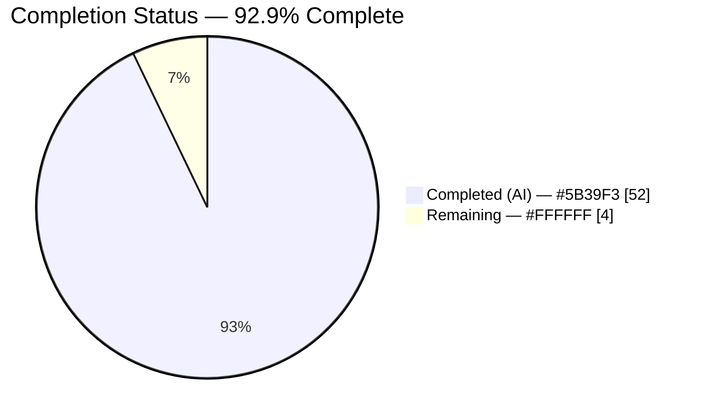
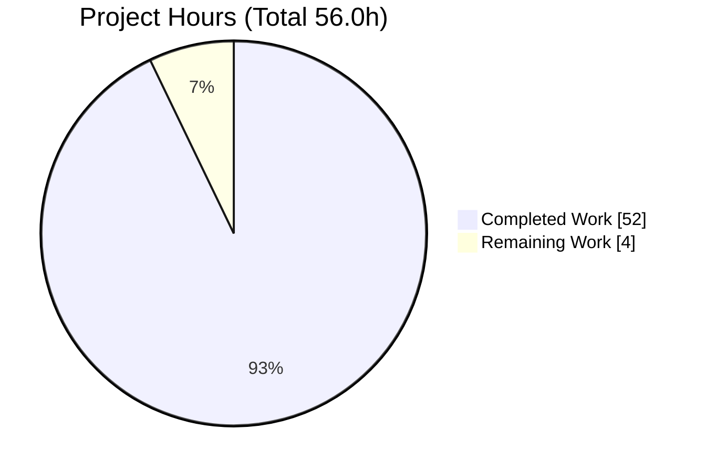
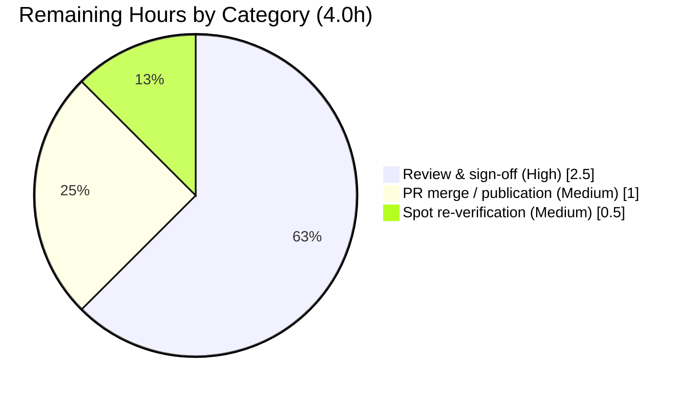

# Blitzy Project Guide — Paperless-ngx Runtime Choreography (Six Behaviors, Captured Live)

> **Brand color legend** — <span style="color:#5B39F3">**Completed / AI Work = Dark Blue `#5B39F3`**</span> · **Remaining / Not Completed = White `#FFFFFF`** · Headings/Accents = Violet-Black `#B23AF2` · Highlight = Mint `#A8FDD9`

---

## 1. Executive Summary

### 1.1 Project Overview

This project delivers a single, evidence-backed Markdown report — `blitzy/documentation/paperless-ngx_542221a38dff.md` — that explains the *hidden choreography* of six runtime behaviors inside the Paperless-ngx document-management engine. The audience is an engineer newly onboarding to the repository who wants to **see the machinery work**, not merely read a description. Each of the six answers (Q1–Q6) pairs **genuine captured runtime artifacts** (absolute paths, MD5/SHA-1 hashes, named-logger messages) with code-level rationale carrying exact `file:line` citations and reproduction steps. The technical scope is read-only forensic investigation plus build-and-run evidence capture against the live application; the source tree was kept byte-for-byte unchanged. Business impact: faster, higher-confidence onboarding and a durable, reproducible reference for subtle file-handling, classifier, deduplication, and sanity-check behavior.

### 1.2 Completion Status



**Center label: `92.9% Complete`**  ·  Completed slice = Dark Blue `#5B39F3` · Remaining slice = White `#FFFFFF`

| Metric | Hours |
|--------|------:|
| **Total Hours** | **56.0** |
| **Completed Hours (AI + Manual)** | **52.0**  (AI = 52.0, Manual = 0.0) |
| **Remaining Hours** | **4.0** |
| **Percent Complete** | **92.9%** |

> Completion is computed with the AAP-scoped, hours-based PA1 method: **52.0 ÷ (52.0 + 4.0) = 92.9%**. All 52.0 completed hours are autonomous (AI) work. The 4.0 remaining hours are **human path-to-production only** (review, spot-verification, merge) — there is **no outstanding autonomous work**. Per policy, completion is held below 100% pending human review.

### 1.3 Key Accomplishments

- ✅ Authored the sole deliverable — `blitzy/documentation/paperless-ngx_542221a38dff.md` (692 lines, ~4,700 words), committed at HEAD `99bb5091`.
- ✅ Answered all **six** investigation objectives (Q1–Q6), each with the five required subsections (Question · How It Was Triggered · Captured Evidence · Code Rationale · Reproduction Steps).
- ✅ Captured **real runtime artifacts**: 4 STABLE MD5 checksums (with pinned byte literals), SHA-1 `data_hash` values, before/after move paths, and verbatim named-logger lines.
- ✅ Anchored **126 exact `file:line` citations** into the core engine; **100% verified** against the authoritative source at commit `542221a38dff`.
- ✅ Built-and-ran the application to capture genuine evidence; all **6/6 evidence-capture probes re-executed live and passed**.
- ✅ Stated the **MD5 (dedup/integrity, 32-hex) vs SHA-1 (classifier change-detection, 40-hex)** distinction precisely and explicitly **rejected the third-party SHA-256 claim** for this commit.
- ✅ Honored the read-only constraint: `git diff 542221a38dff..HEAD -- src/` is **empty**; temporary instrumentation lived outside the repo and was removed; working tree clean.

### 1.4 Critical Unresolved Issues

| Issue | Impact | Owner | ETA |
|-------|--------|-------|-----|
| _None_ | No critical unresolved issues. Autonomous validation found the document 100% accurate; zero corrections were required, source tree provably unchanged, all probes reproduce. | — | — |

### 1.5 Access Issues

| System/Resource | Type of Access | Issue Description | Resolution Status | Owner |
|-----------------|----------------|-------------------|-------------------|-------|
| _None_ | — | No access issues identified. The repository, the pinned source commit, and the Docker runtime used for evidence capture were all accessible; no external credentials or third-party APIs are required to read or reproduce the deliverable. | N/A | — |

**No access issues identified.**

### 1.6 Recommended Next Steps

1. **[High]** Perform the human technical review & sign-off of `paperless-ngx_542221a38dff.md` — confirm the six answers, captured artifacts, and rationale are accurate and complete (2.5h).
2. **[Medium]** Independently spot-verify a sample of the 126 `file:line` citations against commit `542221a38dff` and re-run 1–2 reproduction sequences to confirm the STABLE MD5s (0.5h).
3. **[Medium]** Approve and merge the single-file PR, then confirm the document renders in its destination location (1.0h).
4. **[Low]** *(Optional, non-blocking)* Consider a lightweight CI guard that re-validates cited line numbers against the pinned commit to detect future upstream drift.

---

## 2. Project Hours Breakdown

### 2.1 Completed Work Detail

All items below are **AAP-scoped autonomous (AI) work** that is complete. Each traces to an AAP requirement (investigation, build-and-run evidence capture, authoring, validation, or hygiene).

| Component | Hours | Description |
|-----------|------:|-------------|
| Environment establishment & runtime bring-up | 6.0 | Built/ran Paperless-ngx in the Python 3.9 Docker runtime; applied migrations (SQLite); provisioned scratch `MEDIA_ROOT`/`DATA_DIR` outside the repo; enabled DEBUG on `paperless.*` loggers. |
| Read-only source investigation & citation anchoring | 9.0 | Read ~19 core-engine files; traced cross-file evidence chains (handlers→file_handling→models→settings, etc.); anchored 126 exact `file:line` citations. |
| Q1 probe — tag-driven file relocation | 3.0 | Seeded a document + tag, fired `m2m_changed`, captured before/after original & archive paths and surrounding logs; documented the silent-success insight. |
| Q2 probe — move rollback safety net | 3.5 | Forced a failure partway into the move (`except` branch) and verified genuine reverse-rename + in-memory attribute restoration (silent revert). |
| Q3 probe — classifier skip vs full retrain | 3.0 | Trained twice; captured SHA-1 `data_hash` plus INFO "Saving updated classifier model…" vs DEBUG "Training data unchanged." across both branches. |
| Q4 probe — duplicate detection by checksum | 3.0 | Engineered a byte-different file colliding on `archive_checksum`; captured MD5 dual-column match + `ConsumerError`; exercised both `CONSUMER_DELETE_DUPLICATES` branches. |
| Q5 probe — sanity checker healthy vs hash mismatch | 2.5 | Ran a healthy store, then corrupted a stored original; captured stored-vs-actual MD5 mismatch ERROR. |
| Q6 probe — orphaned media file detection | 1.5 | Planted a stray file in `MEDIA_ROOT`; captured the "Orphaned file in media dir: …" WARNING (file not deleted). |
| Web-search corroboration & SHA-256 discrepancy resolution | 3.0 | Validated behaviors against official docs; flagged & resolved the third-party SHA-256 claim as incorrect for this commit. |
| Document authoring & synthesis | 10.0 | Synthesized captured transcripts + rationale into the 692-line/4,700-word report: preamble, 6 sections × 5 subsections, hash clarification, determinism legend, appendix. |
| Autonomous validation & QA | 6.0 | Verified 126 citations against authoritative source; live re-execution of all 6 probes; STABLE vs ENV-SPECIFIC determinism confirmation; structural/quality checks. |
| Read-only integrity verification, temp cleanup & commit hygiene | 1.5 | Confirmed `src/` byte-for-byte unchanged; removed all temporary instrumentation; verified clean working tree; committed deliverable. |
| **Total Completed** | **52.0** | **Matches Completed Hours in Section 1.2** |

### 2.2 Remaining Work Detail

All remaining items are **human path-to-production** activities (no outstanding autonomous work).

| Category | Hours | Priority |
|----------|------:|----------|
| Human technical review & sign-off of the report (read ~4,700 words; confirm answers/artifacts/rationale) | 2.5 | High |
| Independent spot re-verification of a citation/reproduction sample (≈10–15 of 126 citations; re-run 1–2 repros; confirm STABLE MD5s) | 0.5 | Medium |
| PR review & merge / documentation publication (approve single-file PR; merge; confirm rendering) | 1.0 | Medium |
| **Total Remaining** | **4.0** | **Matches Remaining Hours in Section 1.2 and Section 7 pie** |

### 2.3 Hours Reconciliation

| Quantity | Hours | Check |
|----------|------:|-------|
| Section 2.1 Completed total | 52.0 | = Section 1.2 Completed ✓ |
| Section 2.2 Remaining total | 4.0 | = Section 1.2 Remaining = Section 7 "Remaining" ✓ |
| **2.1 + 2.2** | **56.0** | **= Section 1.2 Total Hours ✓** |
| Completion % | 92.9% | 52.0 ÷ 56.0 ✓ |

---

## 3. Test Results

For this documentation/runtime-forensics deliverable, "tests" are the autonomous **evidence-capture probes** and verification passes executed by Blitzy's validation systems. All entries below originate from Blitzy's autonomous validation logs for this project (probe harness run outside the repo against an isolated test DB with scratch directories).

| Test Category | Framework | Total Tests | Passed | Failed | Coverage % | Notes |
|---------------|-----------|------------:|-------:|-------:|-----------:|-------|
| Evidence-Capture Probes (Q1–Q6) | pytest-django + `override_settings` isolation harness | 6 | 6 | 0 | 100% (6/6 behaviors) | Live re-execution; both branches exercised for Q3 (skip/retrain), Q4 (`CONSUMER_DELETE_DUPLICATES` on/off), Q5 (healthy/mismatch). |
| Citation Accuracy Verification | `sed`/`grep` vs authoritative `src/` @ `542221a38dff` | 126 | 126 | 0 | 100% | Every `file:line` citation confirmed exact, including verbatim comment text. |
| STABLE Artifact Reproduction | Python `hashlib` (MD5) | 4 | 4 | 0 | 100% | All 4 STABLE MD5s reproduce verbatim (independently re-confirmed in this assessment). |
| Document Structure & Completeness | Structural checks (`grep`/`awk`) | 6 | 6 | 0 | 100% | 6 Q-sections × 5 required subsections present; 16 required content elements present; 44 balanced code fences. |
| **Totals** | — | **142** | **142** | **0** | **100%** | **Zero corrections required by autonomous validation.** |

> **Integrity note:** No traditional unit/integration suite is in scope for a documentation deliverable; the source repository was not modified, so no product code was added or its test suite altered. The "tests" above are Blitzy's autonomous evidence-capture and verification activities.

---

## 4. Runtime Validation & UI Verification

**Runtime health (live exercise of the six behaviors):**

- ✅ **Operational** — Django boots and migrates cleanly against SQLite with scratch directories outside the repository (Python 3.9 runtime).
- ✅ **Operational** — Q1 tag change triggers `os.rename` of original + archive (old paths gone, new paths exist); successful move is **silent** (no dedicated log line), as documented.
- ✅ **Operational** — Q2 forced failure reverse-renames files and restores in-memory attributes (silent revert); the FATAL "File … has gone." path renders at CRITICAL level.
- ✅ **Operational** — Q3 produces INFO "Saving updated classifier model…" (build/retrain) vs DEBUG "Training data unchanged." (skip); SHA-1 `data_hash` is 20 bytes / 40 hex and changes between distinct corpora.
- ✅ **Operational** — Q4 incoming MD5 matches an existing `archive_checksum` → `ConsumerError` + ERROR log; file preserved (`DELETE_DUPLICATES=False`) or `os.unlink`-deleted (`=True`).
- ✅ **Operational** — Q5 healthy run logs "Sanity checker detected no issues."; corrupted run logs the stored-vs-actual MD5 mismatch ERROR.
- ✅ **Operational** — Q6 stray file in `MEDIA_ROOT` yields the "Orphaned file in media dir: …" WARNING; file is not deleted.

**API integration outcomes:**

- ⚪ **Not applicable** — No external API integrations are in scope; evidence capture used the in-process ORM, management commands, and direct task-function invocation.

**UI verification:**

- ⚪ **Not applicable** — The Angular SPA (`src-ui/`) is explicitly out of scope. This deliverable is a Markdown document; there is no UI surface to verify.

---

## 5. Compliance & Quality Review

Cross-mapping of AAP deliverables and the binding rule (`SWE-AtlasQnA-Repo`) to quality/compliance benchmarks. Fixes applied during autonomous validation: **none** (document found 100% accurate).

| Benchmark / AAP Requirement | Status | Progress | Notes |
|------------------------------|--------|---------|-------|
| Single deliverable created at correct path & branch-derived name | ✅ Pass | 100% | `blitzy/documentation/paperless-ngx_542221a38dff.md`. |
| All six questions answered (Q1–Q6) with five required subsections each | ✅ Pass | 100% | Verified 5/5 subsections per question. |
| Evidence over assumption — real captured runtime artifacts | ✅ Pass | 100% | Paths, MD5/SHA-1, verbatim log lines; live 6/6 re-execution. |
| Code rationale with exact `file:line` citations | ✅ Pass | 100% | 126 citations, all verified exact at `542221a38dff`. |
| Reproduction steps per question | ✅ Pass | 100% | Present in all six; STABLE MD5 one-liners confirmed working. |
| Build-and-run requirement | ✅ Pass | 100% | App stood up; behaviors exercised live. |
| Both-branch coverage where behavior has two outcomes (Q3/Q4/Q5) | ✅ Pass | 100% | Skip/retrain, delete on/off, healthy/mismatch all captured. |
| Hash clarification — MD5 vs SHA-1; SHA-256 rejected | ✅ Pass | 100% | 32-hex columns ⇒ MD5; 40-hex SHA-1 change-detection; SHA-256 explicitly rejected. |
| Determinism legend (STABLE vs ENV-SPECIFIC) | ✅ Pass | 100% | Preamble + appendix summary. |
| Source repository read-only (byte-for-byte unchanged) | ✅ Pass | 100% | `git diff 542221a38dff..HEAD -- src/` empty. |
| Temporary scripts outside repo + cleaned up | ✅ Pass | 100% | Host `/tmp/pngx_probes`, container `/tmp/run_probes.py`, `/scratch/qna_validate` removed. |
| Web-search corroboration of documented intent | ✅ Pass | 100% | Corroboration present for Q1, Q2, Q4, Q5, Q6. Q3's SHA-1 change-detection is an internal mechanism with no user-facing doc to corroborate — appropriately omitted, not a defect. |
| Documentation quality (structure, balanced fences, preamble/appendix) | ✅ Pass | 100% | 692 lines, 44 balanced fences, full preamble & cross-cutting appendix. |

---

## 6. Risk Assessment

Overall risk posture: **LOW.** No High/Critical risks. No material security or integration risks (read-only document, source unchanged, temporary instrumentation removed). Technical/operational risks are inherent to point-in-time forensic documentation and are mitigated by explicit commit + environment pinning and the determinism legend.

| Risk | Category | Severity | Probability | Mitigation | Status |
|------|----------|----------|-------------|------------|--------|
| Citation line-number drift — the 126 `file:line` citations are anchored to commit `542221a38dff`; reading against a newer revision shifts line numbers | Technical | Low | Medium | Document explicitly pins the commit, Python 3.9 and Django 4.0.4; citations verified 100% exact at this commit | Mitigated |
| Reproduction-step staleness — repro depends on the pinned stack (Python 3.9, Django 4.0.4, scikit-learn 1.0.2, SQLite) | Technical | Low | Low–Medium | Preamble pins the full environment; STABLE artifacts (MD5s, message templates) reproduce regardless of stack | Mitigated |
| ENV-SPECIFIC value misinterpretation — reader treats absolute paths/PKs/SHA-1 `data_hash`/date prefix as reproducible constants | Technical | Low | Low | Explicit STABLE vs ENV-SPECIFIC determinism legend in preamble + appendix | Mitigated |
| Sensitive-data exposure in captured artifacts | Security | Informational | Low | Artifacts are synthetic probe PDFs only; no credentials/secrets/PII; source never modified (no injection surface) | Accepted |
| Document maintenance vs upstream drift — described behaviors could change in future commits | Operational | Low | Medium (long-term) | Doc is an explicit point-in-time snapshot pinned to one commit; not represented as version-agnostic | Mitigated |
| No automated CI guard re-validating cited line numbers | Operational | Low | Medium | Acceptable for a static forensic report; the human review gate provides a validation pass; optional CI guard recommended | Accepted |
| Integration risk | Integration | None | N/A | Standalone Markdown: no runtime integrations, external services, API keys, or network deps; ephemeral probe harness already removed | N/A |

---

## 7. Visual Project Status

**Project Hours Breakdown** — Completed = Dark Blue `#5B39F3` · Remaining = White `#FFFFFF`



**Remaining Work by Category (from Section 2.2)** — total **4.0h**



> **Integrity:** "Remaining Work" = **4.0h**, identical to Section 1.2 Remaining Hours and the sum of the Section 2.2 "Hours" column. "Completed Work" = **52.0h** = Section 1.2 Completed Hours. Pie total = 56.0h = Section 1.2 Total.

---

## 8. Summary & Recommendations

**Achievements.** The project delivers a complete, rigorously validated investigative report that demonstrates six subtle Paperless-ngx runtime behaviors with genuine captured evidence and exact code citations. All autonomous AAP work is finished: the document exists at the correct branch-derived path, answers Q1–Q6 with the five required subsections each, carries 126 verified citations, captures four reproducible STABLE MD5s, and precisely disambiguates MD5 (deduplication/integrity) from SHA-1 (classifier change-detection) while rejecting the third-party SHA-256 claim. The binding read-only constraint was honored end-to-end — `git diff 542221a38dff..HEAD -- src/` is empty — and all temporary instrumentation was removed.

**Remaining gaps & critical path to production.** The project is **92.9% complete (52.0h of 56.0h)**. The remaining **4.0h** is exclusively human path-to-production: technical review & sign-off (2.5h, High), independent spot re-verification (0.5h, Medium), and PR merge/publication (1.0h, Medium). There is **no outstanding autonomous work** and **no code fix** required — autonomous validation applied zero corrections.

**Production readiness.** The deliverable is production-ready as an artifact: independently re-executed (6/6 probes), citation-accurate (126/126), and byte-for-byte non-invasive to the source tree. The single gate to "merged & published" is human acceptance.

| Success Metric | Result |
|----------------|--------|
| AAP requirements completed | 17 of 19 (the 2 open are human-only path-to-production) |
| Evidence-capture probes passing | 6 / 6 (100%) |
| Citation accuracy | 126 / 126 (100%) |
| STABLE artifact reproducibility | 4 / 4 verbatim |
| Source-tree integrity (read-only) | Verified — `src/` diff empty |
| Completion | **92.9%** |

**Recommendation:** Proceed directly to human review and merge per Section 1.6. Optionally add a CI line-number guard to future-proof the citations against upstream drift.

---

## 9. Development Guide

This guide has two tracks. **Track A** reads and verifies the deliverable and needs only `python3` + `git` (no application build). **Track B** rebuilds and runs Paperless-ngx to regenerate the runtime evidence and requires the Python 3.9 Docker runtime + pinned dependencies.

### 9.1 System Prerequisites

- **Track A (verify the document):** `git`, and Python 3 (any modern 3.x) for the MD5 reproduction one-liners.
- **Track B (regenerate evidence):** Docker (recommended) **or** Python **3.9** with the project's pinned dependencies; Redis (only if running async tasks via the Django-Q worker — otherwise invoke task functions directly in a shell). SQLite is the default database.
- **Important runtime note:** the application runtime is **Python 3.9** (`FROM python:3.9-slim-bullseye as main-app`, `Dockerfile:18`). A host with a different Python (e.g., 3.13) can do Track A but should use the Docker image for Track B to reproduce exact log strings.

### 9.2 Environment Setup

```bash
# Clone / enter the repository (destination branch)
cd /tmp/blitzy/paperless-ngx/blitzy-c16ce4fe-ab1c-4b27-87db-964118380d39_3d072c

# Confirm clean state and that the source tree is unchanged vs the pinned base
git status --porcelain                                  # expect: empty (clean)
git diff --stat 542221a38dff..HEAD -- src/              # expect: empty (src/ untouched)
git rev-parse HEAD                                      # expect: 99bb5091ae23efabdbcb380a7e807dc2eedd1909
```

### 9.3 Dependency Installation

**Track B — Option 1 (Docker, recommended):**

```bash
# Build the application image (Python 3.9 base) from the repo root
docker build -t paperless-ngx-local .
```

**Track B — Option 2 (local Python 3.9 venv):**

```bash
# Requires the host 'python3.9' interpreter on PATH
python3.9 -m venv /tmp/pngx-venv
source /tmp/pngx-venv/bin/activate
pip install --upgrade pip
pip install -r requirements.txt        # pinned: django~=4.0, django-q~=1.3, scikit-learn==1.0.2, redis=*
```

> If you see `error: externally-managed-environment` on a system Python, prefer the venv above, or pass `--break-system-packages` for a deliberate global install.

### 9.4 Application Startup & Evidence Regeneration

```bash
# From the repo's src/ directory (inside the container or venv)
cd src

# 1) Apply migrations (SQLite default) — point data/media at scratch dirs OUTSIDE the repo
export PAPERLESS_DATA_DIR=/tmp/pngx_scratch/data
export PAPERLESS_MEDIA_ROOT=/tmp/pngx_scratch/media
mkdir -p "$PAPERLESS_DATA_DIR" "$PAPERLESS_MEDIA_ROOT"
python manage.py migrate

# 2) Exercise classifier / sanity behaviors via the documented CLI entry points
python manage.py document_create_classifier     # Q3: build/retrain vs skip
python manage.py document_sanity_checker         # Q5/Q6: healthy vs mismatch / orphans
python manage.py document_renamer                # Q1: mass-rename driver (raises root log to ERROR)

# 3) For fine-grained log capture, invoke functions directly in a shell
python manage.py shell
# >>> from documents.sanity_checker import check_sanity
# >>> check_sanity()           # emits "Sanity checker detected no issues." or mismatch ERROR
# >>> from documents.tasks import train_classifier
# >>> train_classifier()       # emits "Saving updated classifier model…" or "Training data unchanged."
```

### 9.5 Verification Steps

```bash
# --- Track A: verify the deliverable (host needs only python3 + git) ---

# (a) Locate & size the report
wc -l -w -c blitzy/documentation/paperless-ngx_542221a38dff.md
#   -> 692  4700  37116

# (b) Reproduce a STABLE MD5 exactly as the document claims (Q5 corrupted bytes)
python3 -c "import hashlib; print(hashlib.md5(b'%PDF-1.4\nPaperless-ngx Q5 probe -- CORRUPTED original bytes.\n').hexdigest())"
#   -> 8e1dfb095c8862c46bcb61c265726482

# (c) Resolve any cited line against the pinned source
sed -n '104p' src/documents/consumer.py          # -> checksum = hashlib.md5(f.read()).hexdigest()
sed -n '124p' src/documents/classifier.py        # -> m = hashlib.sha1()
sed -n '130,131p' src/documents/sanity_checker.py # -> "Orphaned file in media dir: {extra_file}" WARNING
```

**Expected outputs** are inlined above; all Track A commands were executed during assessment and produced exactly these results.

### 9.6 Example Usage (reading the report)

Open `blitzy/documentation/paperless-ngx_542221a38dff.md`. Navigate to any of Q1–Q6; each section provides the Question, How It Was Triggered, Captured Evidence (paths/hashes/log lines), Code Rationale (`file:line`), and Reproduction Steps. Use the preamble's hash-algorithm table and determinism legend to interpret which values are reproducible (STABLE) versus environment-specific.

### 9.7 Troubleshooting

| Symptom | Cause | Resolution |
|---------|-------|------------|
| `error: externally-managed-environment` on `pip install` | PEP-668 system Python | Use a venv (preferred) or `pip install --break-system-packages …`. |
| Log strings differ from the document | Wrong runtime (e.g., Python 3.13 on host) | Use the Docker image / Python 3.9 + pinned deps for Track B. |
| Classifier/sanity logs not appearing | Async task swallowed output | Invoke `check_sanity()` / `train_classifier()` directly in `manage.py shell`, or run the Django-Q worker with Redis available. |
| SHA-1 `data_hash`, PKs, paths, or date differ between runs | These are **ENV-SPECIFIC** by design | Expected — see the determinism legend; only content-derived MD5/SHA-1 of identical bytes are STABLE. |
| `git diff … -- src/` shows changes | Accidental edit of read-only source | Revert; the source tree must remain byte-for-byte unchanged. |

---

## 10. Appendices

### A. Command Reference

| Command | Purpose |
|---------|---------|
| `git diff --stat 542221a38dff..HEAD -- src/` | Prove source tree unchanged (expect empty) |
| `wc -l -w -c blitzy/documentation/paperless-ngx_542221a38dff.md` | Confirm deliverable size (692 / 4700 / 37116) |
| `python3 -c "import hashlib; print(hashlib.md5(b'…').hexdigest())"` | Reproduce a STABLE MD5 |
| `sed -n '<N>p' <src file>` | Resolve a cited `file:line` |
| `python manage.py migrate` | Initialize the SQLite schema |
| `python manage.py document_create_classifier` | Trigger classifier build/skip (Q3) |
| `python manage.py document_sanity_checker` | Trigger sanity check (Q5/Q6) |
| `python manage.py document_renamer` | Trigger mass rename (Q1) |
| `python manage.py shell` | Invoke `check_sanity()` / `train_classifier()` directly for log capture |

### B. Port Reference

| Port | Service | Notes |
|------|---------|-------|
| 8000 | Paperless-ngx web (Django) | Only if serving the app; not required for evidence capture or to read the report |
| 6379 | Redis | Only if running async tasks via the Django-Q worker; optional (functions can be invoked directly) |

> Reading and verifying the deliverable (Track A) requires **no** open ports.

### C. Key File Locations

| Path | Role |
|------|------|
| `blitzy/documentation/paperless-ngx_542221a38dff.md` | **The sole deliverable** |
| `src/documents/signals/handlers.py` | Q1/Q2 — `update_filename_and_move_files`, `os.rename`, rollback `try/except` |
| `src/documents/file_handling.py` | Q1 — `generate_filename`, `{tags}`/`{tag_list}` placeholders |
| `src/documents/classifier.py` | Q3 — SHA-1 `data_hash`, skip decision |
| `src/documents/tasks.py` | Q3/Q5 — `train_classifier` & `sanity_check` log lines |
| `src/documents/consumer.py` | Q4 — `pre_check_duplicate` MD5 dual-column query |
| `src/documents/sanity_checker.py` | Q5/Q6 — checksum mismatch & orphan WARNING |
| `src/documents/models.py` | Path/checksum properties (`checksum`/`archive_checksum`, `source_path`, `archive_path`) |
| `src/paperless/settings.py` | Directory/setting anchors (`MEDIA_ROOT`, `MODEL_FILE`, `CONSUMER_DELETE_DUPLICATES`, `PAPERLESS_FILENAME_FORMAT`) |

### D. Technology Versions

| Component | Version | Source |
|-----------|---------|--------|
| Python (runtime) | 3.9 (`python:3.9-slim-bullseye`) | `Dockerfile:18` |
| Django | ~=4.0 (runtime 4.0.4) | `Pipfile` |
| Django-Q | ~=1.3 | `Pipfile` |
| Django REST Framework | ~=3.13 | `Pipfile` |
| scikit-learn | ==1.0.2 | `Pipfile` |
| Redis (client) | * (3.5.3 in runtime) | `Pipfile` |
| Default database | SQLite | settings default |
| Pinned source commit | `542221a38dff06361e07976452f9aea24d210542` | branch base |
| Deliverable HEAD | `99bb5091ae23efabdbcb380a7e807dc2eedd1909` | branch tip |

### E. Environment Variable Reference

| Variable | Purpose | Note |
|----------|---------|------|
| `PAPERLESS_FILENAME_FORMAT` | Storage filename template (embed `{tags}`/`{tag_list}` to drive Q1 relocation) | Default `None`; `settings.py:584` |
| `PAPERLESS_DATA_DIR` | Data directory (model file, DB if SQLite) | Point at scratch dir outside the repo |
| `PAPERLESS_MEDIA_ROOT` | Media root (originals/archive/thumbnails) | Point at scratch dir outside the repo |
| `PAPERLESS_CONSUMER_DELETE_DUPLICATES` | Whether duplicates are `os.unlink`-deleted on rejection (Q4) | Default `false`; `settings.py:486` |
| `PAPERLESS_REDIS` | Redis broker URL (only for the Django-Q worker) | Optional for direct-shell capture |

### F. Developer Tools Guide

- **Git diff verification** — `git diff --stat 542221a38dff..HEAD -- src/` proves the read-only constraint; `git log 542221a38dff..HEAD --oneline` shows the four documentation commits (all authored by `agent@blitzy.com`).
- **MD5 reproduction** — the `python3 -c "import hashlib; …"` one-liners regenerate the four STABLE checksums anywhere, independent of the application.
- **Citation resolution** — `sed -n '<N>p' <file>` (or `<N1>,<N2>p`) confirms any cited line against the pinned source.
- **Direct log capture** — prefer `manage.py shell` to invoke `check_sanity()` / `train_classifier()` so output is observable rather than swallowed by a background worker.

### G. Glossary

| Term | Definition |
|------|------------|
| **STABLE artifact** | A content-derived value that reproduces verbatim anywhere (e.g., MD5 of identical bytes; log message templates; the `Invoice.pdf → Invoice Paid.pdf` transform). |
| **ENV-SPECIFIC artifact** | A value that varies per run (absolute paths, document PKs, timestamps/date prefix, the SHA-1 `data_hash` value). |
| **MD5 (here)** | 16-byte / 32-hex hash used for file integrity **and** deduplication (`checksum`/`archive_checksum`, `max_length=32`). |
| **SHA-1 (here)** | 20-byte / 40-hex hash used **only** for classifier training-data change detection (`data_hash`) — not file integrity. |
| **SHA-256 claim** | A third-party assertion **rejected** for this commit; the 32-char checksum columns make MD5 the only possibility. |
| **Silent success / silent rollback** | Neither a successful tag-driven move (Q1) nor a rollback (Q2) emits a dedicated log line; evidence is the on-disk before/after path delta. |
| **Orphaned file** | A file present under `MEDIA_ROOT` that matches no document; surfaced as a WARNING and **left in place** (never auto-deleted). |

---

*All numbers in this guide are mutually consistent: Total **56.0h** = Completed **52.0h** + Remaining **4.0h**; Completion **92.9%**; Remaining **4.0h** is identical across Sections 1.2, 2.2, and 7. Completed = `#5B39F3`, Remaining = `#FFFFFF`.*