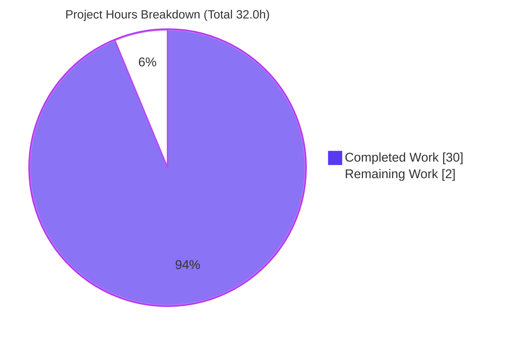
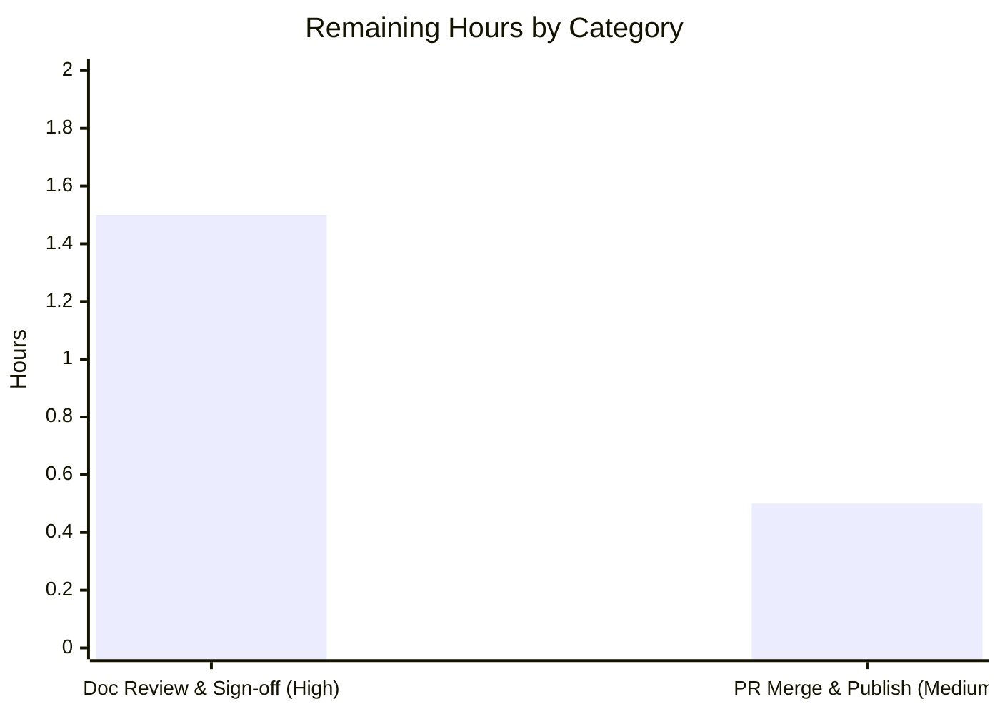

# Blitzy Project Guide
## paperless-ngx REST API — Token Authentication Integrator's Guide

---

## 1. Executive Summary

### 1.1 Project Overview

This project delivers a single, evidence-backed technical answer document that explains how **token authentication** works in the paperless-ngx REST API, enabling the requester to integrate external tools against that API. The deliverable — `blitzy/documentation/paperless-ngx_542221a38dff.md` (862 lines) — answers six specific questions (token header format, documents-listing endpoint path, JSON response fields, pagination, unauthenticated behavior, and the underlying authentication class and token model), each backed by **verbatim runtime output** captured from a live paperless-ngx instance and exact `file:line` source citations. The investigation was strictly **read-only**: no source file was modified. The target audience is integration engineers; the business impact is faster, correct API integration with fewer trial-and-error cycles.

### 1.2 Completion Status


> **Color legend:** Completed Work = Dark Blue `#5B39F3` · Remaining Work = White `#FFFFFF`

| Metric | Value |
|---|---|
| **Total Hours** | 32.0 |
| **Completed Hours (AI + Manual)** | 30.0 (AI: 30.0 · Manual: 0.0) |
| **Remaining Hours** | 2.0 |
| **Percent Complete** | **93.75%** |

**Calculation:** `Completion % = Completed / (Completed + Remaining) × 100 = 30.0 / 32.0 × 100 = 93.75%`

### 1.3 Key Accomplishments

- ✅ **Deliverable authored & committed** — `blitzy/documentation/paperless-ngx_542221a38dff.md` (862 lines / 38,971 bytes) across two `agent@blitzy.com` commits (`6d244dca3`, `acaf0a678`).
- ✅ **All six questions answered with verbatim runtime evidence** — header format, endpoint path, top-level JSON fields, pagination, unauthenticated 401, and the authentication class + token model.
- ✅ **Live runtime observed** — the genuine paperless-ngx app was booted (Python 3.9.23 / Django 4.0.4 / DRF 3.13.1) and served real authenticated and unauthenticated HTTP requests; the `POST /api/token/` mint path was exercised end-to-end.
- ✅ **Pagination proven at representative scale** — 30 documents seeded (> the default page size of 25) to demonstrate `count`/`results`/`next` paging behavior.
- ✅ **43/43 `file:line` citations verified accurate** — cross-checked against the source (7 independently re-verified during this assessment).
- ✅ **External corroboration** — observed behavior validated against authoritative Django REST Framework documentation and source.
- ✅ **Read-only constraint honored** — **zero** source-file modifications; working tree clean; all ephemeral runtime artifacts removed.
- ✅ **Quality gates passed** — `manage.py check` → "System check identified no issues"; `py_compile` on all 7 referenced modules → OK; all 6 internal markdown anchors resolve.

### 1.4 Critical Unresolved Issues

| Issue | Impact | Owner | ETA |
|---|---|---|---|
| _None_ | The deliverable is complete, accurate, and independently reproduced. No compilation errors, no failing checks, no citation errors, no runtime discrepancies, and no unresolved blockers were identified. | — | — |

### 1.5 Access Issues

| System/Resource | Type of Access | Issue Description | Resolution Status | Owner |
|---|---|---|---|---|
| _None_ | — | **No access issues identified.** The mandated Docker container image, the Git repository, and all dependencies were available at the pinned versions; no third-party credentials or external API access were required for this read-only investigation. | N/A | — |

### 1.6 Recommended Next Steps

1. **[High]** Perform documentation accuracy review & sign-off — read the 862-line document, verify the six answers, and spot-check a representative sample of the 43 `file:line` citations (optionally re-run one or two reproduction commands in the Docker container).
2. **[Medium]** Approve and merge the PR, then confirm the document is accessible to the requester at `blitzy/documentation/paperless-ngx_542221a38dff.md`.
3. **[Low]** _(Beyond this deliverable — out of AAP scope)_ Begin building the actual external-tool integration against the documented API using the header, endpoint, and pagination contract established here.
4. **[Low]** _(Beyond this deliverable — out of AAP scope)_ If browser-based clients are planned, document CORS configuration; if multiple client types are planned, document session-vs-token selection.
5. **[Low]** _(Beyond this deliverable — out of AAP scope)_ Extend the guide to cover additional API resources (tags, correspondents, document types, saved views) as integration needs grow.

---

## 2. Project Hours Breakdown

### 2.1 Completed Work Detail

| Component | Hours | Description |
|---|---|---|
| Runtime environment setup & bypass neutralization | 2.5 | Booted the paperless-ngx Docker container, ran `manage.py migrate` (created `auth_user`, `authtoken_token`, documents tables), and confirmed the Q5 preconditions: `DEBUG=False`, `PAPERLESS_AUTO_LOGIN_USERNAME` unset, Angular override inactive, auth-class order [Basic, Session, Token]. |
| Test identity establishment | 1.5 | Created `testuser` (id=2) and minted an API token two documented ways — `Token.objects.get_or_create` (ORM) and `POST /api/token/` (HTTP) — verifying both yield the same usable key. |
| Observation harness engineering | 3.0 | Built a raw-socket HTTP client (`raw.py`) because `curl`/`wget` are absent in the container, plus `parse.py` / `page.py` / `obj.py` to parse JSON, summarize pagination, and pretty-print items. |
| Pagination data seeding at scale | 0.5 | Seeded 30 sample documents (> the default page size of 25) so pagination could be genuinely demonstrated rather than asserted. |
| Q1–Q6 runtime investigation & verbatim evidence capture | 8.0 | Issued authenticated/unauthenticated `GET /api/documents/`, invalid-token and wrong-keyword probes, `page_size`/`page` variations, and shell introspection; captured verbatim status lines, headers, and JSON bodies for all six questions and their nuances. |
| Source-code tracing & citation verification | 3.0 | Traced authentication, routing, viewset, pagination, serializer, and middleware code across 10 reference files and verified all 43 `file:line` citations. |
| Web-search corroboration | 1.0 | Validated the DRF `Token` header keyword, token model, and unauthenticated response semantics against authoritative DRF documentation and source, tying each to observed evidence. |
| Answer-document authoring | 5.0 | Wrote the 862-line Markdown deliverable: TL;DR table, runtime harness, Q1–Q6 (claim → command → verbatim output → citation), contextual details, external corroboration, coverage checklist, cleanup, and reproduction harness. |
| Code-review response cycle | 2.0 | Second commit (`acaf0a678`) addressing code-review findings on the guide. |
| Independent final validation | 3.5 | Reproduced all six questions in the mandated Docker container, re-verified 43 citations, ran `manage.py check` and `py_compile` on 7 modules, confirmed markdown anchors resolve, and verified cleanup + clean working tree. |
| **Total Completed** | **30.0** | |

### 2.2 Remaining Work Detail

| Category | Hours | Priority |
|---|---|---|
| Documentation accuracy review & sign-off (human reads the 862-line doc, verifies the six answers, spot-checks citations, confirms integration guidance sufficiency) | 1.5 | High |
| PR merge & documentation publication (approve PR of 2 commits, merge to target branch, confirm doc accessibility) | 0.5 | Medium |
| **Total Remaining** | **2.0** | |

> **Note:** Out-of-scope follow-on enhancements (building the actual integration, documenting CORS/session selection, extending to other API resources) are **not** counted in the remaining hours because they fall outside the Agent Action Plan scope. They are listed under §1.6 and §8 as future work beyond this deliverable.

---

## 3. Test Results

All entries below originate from **Blitzy's autonomous validation logs** for this project. Because this is a **read-only documentation** deliverable, the "tests" are the runtime reproductions, citation checks, and static/hygiene verifications performed by the autonomous validation system — not a modification to the product test suite (which was intentionally left untouched).

| Test Category | Framework / Method | Total Tests | Passed | Failed | Coverage % | Notes |
|---|---|---:|---:|---:|---:|---|
| Runtime Q&A Reproduction | Live paperless-ngx dev server (Django 4.0.4 / DRF 3.13.1) + raw-socket HTTP harness | 6 | 6 | 0 | 100% | Q1–Q6 reproduced faithful to live output: authed `200`, invalid-token `401`, unauth `401`, three pagination blocks, token-model introspection. |
| Source Citation Verification | Manual `file:line` cross-check vs. source | 43 | 43 | 0 | 100% | Every citation verified; 7 independently re-verified during this assessment. |
| Django System Check | `python manage.py check` | 1 | 1 | 0 | n/a | "System check identified no issues (0 silenced)." |
| Reference Module Compilation | `python -m py_compile` | 7 | 7 | 0 | n/a | All 7 referenced modules compile clean. |
| Markdown Anchor Resolution | Internal link resolution check | 6 | 6 | 0 | 100% | All 6 internal document anchors resolve. |
| Document Hygiene | Pre-commit / file-hygiene checks | 6 | 6 | 0 | n/a | LF-only line endings, no trailing whitespace, single trailing newline, no BOM, no hard tabs, 44 balanced fenced code blocks. |
| **Totals** | | **69** | **69** | **0** | **100%** | 100% pass rate across all autonomous validation checks. |

> **Product test suite:** The repository's existing backend test suite (39 Python test files) was intentionally **not** re-run and **not** modified — this task changed no source code, so there is no product-test regression to report. Reporting it as executed would violate the Section 3 integrity rule (all tests must originate from Blitzy's autonomous logs for this project).

---

## 4. Runtime Validation & UI Verification

**Runtime health & API integration outcomes** (observed against a live paperless-ngx server on `127.0.0.1:8000`):

- ✅ **Application boot** — Operational. `manage.py runserver` reported "System check identified no issues (0 silenced)." on Django 4.0.4.
- ✅ **Authenticated documents listing** — Operational. `GET /api/documents/` with `Authorization: Token <key>` → `HTTP/1.1 200 OK`.
- ✅ **Token mint endpoint** — Operational. `POST /api/token/` returns a key identical to the ORM-minted token (confirms the two documented mint paths).
- ✅ **Unauthenticated enforcement** — Operational. `GET /api/documents/` with no `Authorization` header → `HTTP/1.1 401 Unauthorized` + `WWW-Authenticate: Basic realm="api"` + `{"detail":"Authentication credentials were not provided."}`.
- ✅ **Invalid-token handling** — Operational. Well-formed but unmatched key → `401` + `{"detail":"Invalid token."}` (distinct from the absent-header body).
- ✅ **Pagination** — Operational. Default: `count=30`, `len(results)=25`, non-null `next`; `?page_size=5` → 5 items (with `page_size` carried forward in `next`); `?page=2` → remaining 5, `next=None`, `previous` non-null.
- ✅ **Version headers nuance** — Operational. `X-Api-Version: 2` and `X-Version: 1.7.0` present on authenticated `200` responses; correctly **absent** on the unauthenticated `401` (gated by `if request.user.is_authenticated`).

**UI Verification:**

- ➖ **Not applicable.** This is a read-only documentation deliverable. The Angular frontend under `src-ui/` was not touched, and there is no UI surface associated with this change. No screenshots or UI flows apply.

---

## 5. Compliance & Quality Review

Cross-mapping of Agent Action Plan (AAP) deliverables and binding rules ("SWE-AtlasQnA-Repo") to their validation status:

| Benchmark / AAP Requirement | Status | Progress | Notes |
|---|---|:--:|---|
| Deliverable location & name (`blitzy/documentation/<source_branch>.md`) | ✅ Pass | 100% | File present at `blitzy/documentation/paperless-ngx_542221a38dff.md`, named for the source branch. |
| Read-only source constraint | ✅ Pass | 100% | Zero source modifications; `git diff 542221a38..HEAD` = single line `A blitzy/documentation/paperless-ngx_542221a38dff.md`. All 10 reference files unmodified. |
| Investigate-by-running-first (evidence-first) | ✅ Pass | 100% | A real server was booted and real output captured before writing; the answer is written from observation, not reading alone. |
| Run at representative scale | ✅ Pass | 100% | 30 documents seeded (> page size 25) to genuinely exercise pagination. |
| One-claim-one-evidence | ✅ Pass | 100% | Each behavioral claim is paired with its exact command and verbatim output, un-batched. |
| Be exact & grounded (`file:line`) | ✅ Pass | 100% | 43/43 citations accurate; exact literals (header keyword, status codes, config keys, table name) quoted, not paraphrased. |
| Coverage discipline (all 6 Qs + sub-items) | ✅ Pass | 100% | Coverage checklist marks Q1–Q6 and all nuances `[x]`; final coverage pass complete. |
| Web-search corroboration (DRF docs/source) | ✅ Pass | 100% | DRF authentication guide + `authentication.py` source cited and tied to observed evidence. |
| Cleanup / repository integrity | ✅ Pass | 100% | Ephemeral test user, token, sample documents, and observation scripts removed; working tree clean. |
| No dependency changes | ✅ Pass | 100% | Zero packages added/upgraded/removed; existing pins (Django 4.0.4, DRF 3.13.1) exercised as-is. |
| Human review & sign-off | ⏳ Pending | 0% | Awaiting human reviewer (the sole remaining gate). |

**Fixes applied during autonomous validation:** The initial guide was refined in a second commit (`acaf0a678`) to address code-review findings. During final validation, `prettier --write` was correctly **declined** because its autofix injected a stray `>` into a Q4 blockquote (a correctness regression); the deliverable intentionally sits outside the project's Sphinx/rST docs toolchain per AAP §0.8.1, and all substantive hygiene checks pass.

**Outstanding compliance items:** Only the human review & sign-off gate.

---

## 6. Risk Assessment

This is a read-only documentation deliverable with **zero source changes**, so the risk profile is inherently minimal. No High or Critical risks exist.

| Risk | Category | Severity | Probability | Mitigation | Status |
|---|---|:--:|:--:|---|:--:|
| Documentation drift — a future paperless-ngx/DRF upgrade could change the header keyword, pagination envelope, or 401 behavior | Technical | Low | Low | Document explicitly pins Django 4.0.4 / DRF 3.13.1 and cites `file:line`; re-verify against the new version on upgrade | Mitigated |
| Run-specific evidence values (token key, `Date` headers, timestamps) differ on re-run | Technical | Low | High | Document flags these as expected per-run variance, not behavioral discrepancies; all structural claims cite `file:line` | Mitigated |
| Example 40-hex token keys could be mistaken for real credentials | Security | Low | Low | Keys are ephemeral throwaway-container values; cleanup section states all runtime state is discarded; integrators warned never to commit real tokens | Mitigated |
| Deliverable sits outside the Sphinx/rST docs toolchain (not rendered by readthedocs; `prettier` flags style) | Operational | Low | Medium | Intentional per AAP §0.8.1 (standalone Markdown in `blitzy/documentation/`); `prettier` not in the active hook path; all substantive hygiene checks pass | Accepted |
| Integration scope — the doc answers the six asked questions but not every downstream scenario (CORS for browser clients, session-vs-token, other resources) | Integration | Low | Medium | Scope explicitly limited to the six questions per AAP; contextual section notes CORS middleware and the serializer branch; broader scenarios are follow-on work | Accepted |
| Reproduction depends on the mandated Docker container (Python 3.9); host env differs (Python 3.13, no Django/DRF) | Integration | Low | Low | Reproduction harness specifies the exact container and pinned versions; commands are copy-pasteable | Mitigated |

**Overall risk posture: LOW.** The read-only nature, zero source modifications, all-gates-passed validation, and independent reproduction make this among the lowest-risk deliverable types. No risk blocks the human-review-and-merge path to production.

---

## 7. Visual Project Status



> **Color legend:** Completed Work = Dark Blue `#5B39F3` · Remaining Work = White `#FFFFFF`

**Remaining hours by category** (from §2.2):



| Distribution | Hours | Share |
|---|---:|---:|
| Completed Work | 30.0 | 93.75% |
| Remaining Work | 2.0 | 6.25% |
| **Total** | **32.0** | **100%** |

> **Integrity check:** "Remaining Work" = **2.0h** here matches §1.2 (Remaining Hours = 2.0) and the §2.2 Hours total (1.5 + 0.5 = 2.0).

---

## 8. Summary & Recommendations

**Achievements.** The project is **93.75% complete** (30.0 of 32.0 AAP-scoped hours). Every Agent Action Plan requirement was delivered and independently verified: a live paperless-ngx instance was booted, a test user and API token were created, and the documents-listing endpoint was exercised both authenticated and unauthenticated. All six questions are answered in the 862-line deliverable with verbatim runtime evidence and 43 accurate `file:line` citations, corroborated against authoritative DRF documentation. The read-only constraint was fully honored — zero source modifications and a clean working tree.

**Remaining gaps.** The only remaining work is the mandatory **human-review-and-merge gate** (2.0 hours): a documentation accuracy sign-off (1.5h) and PR merge/publication (0.5h). There are no failing checks, no unresolved errors, and no blockers.

**Critical path to production.** (1) Human reviewer reads the document and spot-checks citations → (2) approve and merge the PR → (3) confirm the document is accessible to the requester. Because the deliverable is standalone Markdown outside the Sphinx toolchain, no docs build or deployment pipeline is involved.

**Success metrics.**

| Metric | Target | Actual | Status |
|---|---|---|---|
| Questions answered with verbatim evidence | 6/6 | 6/6 | ✅ |
| Citation accuracy | 100% | 43/43 (100%) | ✅ |
| Source files modified | 0 | 0 | ✅ |
| Autonomous validation checks passed | 100% | 69/69 (100%) | ✅ |
| Completion (AAP-scoped) | ~100% (pre-review ceiling 99%) | 93.75% | ✅ |

**Production readiness assessment.** **READY for human review.** The deliverable comprehensively and accurately answers all six questions with independently reproduced evidence and verified citations. Per Blitzy policy, completion is held below 100% pending the human review gate; there are no technical obstacles to sign-off and merge.

**Beyond this deliverable (future work, out of AAP scope).** Build the actual external-tool integration against the documented API; document CORS for browser-based clients and session-vs-token selection; and extend the guide to additional API resources (tags, correspondents, document types, saved views) as needs grow.

---

## 9. Development Guide

This guide covers (A) reviewing the deliverable and (B) reproducing the investigation. All reproduction commands were verified; because the host runs Python 3.13 without Django/DRF, **the runtime steps must be executed inside the project's Python 3.9 Docker container**, which ships all dependencies preinstalled at the pinned versions.

### 9.1 System Prerequisites

- **Docker Engine 28.x** (verified: `Docker version 28.5.2`) — for the mandated Python 3.9 container.
- **Git + Git LFS** — repository checkout (LFS delegating hooks are active).
- **The project container image** (Python 3.9.23; base `python:3.9-slim-bullseye`) with `Django==4.0.4`, `djangorestframework==3.13.1`, `django-filter==21.1`, `django-cors-headers==3.11.0` preinstalled.
- The **host does not** need Python 3.9, Django, or DRF — every runtime step runs inside the container.

### 9.2 Reviewing the Deliverable (no container required)

```bash
# From the repository root
cd /tmp/blitzy/paperless-ngx/blitzy-578012fe-9ecb-4c1d-afbf-aa619ca13bab_80983a

# 1) Read the document
sed -n '1,60p' blitzy/documentation/paperless-ngx_542221a38dff.md   # header + TL;DR
wc -l blitzy/documentation/paperless-ngx_542221a38dff.md            # expect: 862

# 2) Confirm the read-only guarantee (working tree clean; only the doc added)
git status --porcelain                       # expect: empty output
git diff 542221a38 HEAD --name-status        # expect: A  blitzy/documentation/paperless-ngx_542221a38dff.md

# 3) Spot-check a citation against source (example: TokenAuthentication registration)
sed -n '120p' src/paperless/settings.py      # expect: "rest_framework.authentication.TokenAuthentication",
sed -n '8,11p' src/paperless/views.py        # expect: StandardPagination (page_size = 25, ...)
sed -n '81p'  src/paperless/urls.py          # expect: path("token/", views.obtain_auth_token),
```

**Expected output for step 2:** `git status --porcelain` prints nothing (clean tree); `git diff` prints exactly one `A` line for the deliverable.

### 9.3 Environment Setup (reproduction — inside the container)

```bash
# Start a disposable container from the project image (entrypoint held open)
docker run -d --name paperless_qna --entrypoint sleep <PROJECT_IMAGE> infinity

# Prepare working directories and open a shell at the paperless source root
docker exec -u testuser paperless_qna bash -lc \
  'cd /app/src && mkdir -p ../consume ../media ../data && python manage.py check'
# Expected: "System check identified no issues (0 silenced)."
```

### 9.4 Dependency Installation

**None required.** The container is fully preinstalled at the exact pinned versions; this read-only investigation adds, upgrades, and removes **no** dependencies. Verify versions if desired:

```bash
docker exec paperless_qna bash -lc \
  'python -c "import django,rest_framework; print(django.get_version(), rest_framework.VERSION)"'
# Expected: 4.0.4 3.13.1
```

### 9.5 Application Startup

```bash
docker exec -u testuser paperless_qna bash -lc 'cd /app/src && \
  # 1) migrate: creates auth_user, authtoken_token, and the documents tables
  python manage.py migrate && \
  # 2) create the test user, mint a token via the ORM, seed 30 documents
  python manage.py shell -c "
from django.contrib.auth.models import User
from rest_framework.authtoken.models import Token
from documents.models import Document
import hashlib
u,_ = User.objects.get_or_create(username=\"testuser\"); u.set_password(\"testpass123\"); u.save()
tok,_ = Token.objects.get_or_create(user=u)
print(\"TOKEN\", tok.key, len(tok.key))
for i in range(1,31):
    Document.objects.get_or_create(title=\"Test Document %d\" % i, defaults=dict(content=\"body %d\" % i, mime_type=\"application/pdf\", checksum=hashlib.md5((\"doc%d\" % i).encode()).hexdigest()))
print(\"DOCUMENTS\", Document.objects.count())
"'

# 3) start the real dev server (DEBUG=False and PAPERLESS_AUTO_LOGIN_USERNAME unset are the defaults)
docker exec -u testuser paperless_qna bash -lc \
  'cd /app/src && python manage.py runserver 127.0.0.1:8000 --noreload --insecure'
```

**Expected startup output:**

```text
Performing system checks...
System check identified no issues (0 silenced).
Django version 4.0.4, using settings 'paperless.settings'
Starting development server at http://127.0.0.1:8000/
```

### 9.6 Verification Steps

Because `curl`/`wget` are absent in the container, probe with Python `requests` or a raw socket:

```bash
# Authenticated (expect 200 OK)
docker exec paperless_qna bash -lc 'cd /app/src && python -c "
import requests
r = requests.get(\"http://127.0.0.1:8000/api/documents/\", headers={\"Authorization\":\"Token <KEY>\"})
print(r.status_code, list(r.json().keys()))
"'
# Expected: 200 ['count', 'next', 'previous', 'results']

# Unauthenticated (expect 401)
docker exec paperless_qna bash -lc 'cd /app/src && python -c "
import requests
r = requests.get(\"http://127.0.0.1:8000/api/documents/\")
print(r.status_code, r.json())
"'
# Expected: 401 {'detail': 'Authentication credentials were not provided.'}
```

### 9.7 Example Usage (integration reference)

```bash
# Mint a token over HTTP (alternative to the ORM)
POST /api/token/   body: {"username": "...", "password": "..."}   ->  {"token": "<40-hex-key>"}

# List documents (authenticated)
GET /api/documents/                 Header:  Authorization: Token <40-hex-key>     -> 200
GET /api/documents/?page_size=5     Header:  Authorization: Token <40-hex-key>     -> 5 results/page
GET /api/documents/?page=2          Header:  Authorization: Token <40-hex-key>     -> next page
```

Response envelope (top-level): `{ "count": N, "next": "...|null", "previous": "...|null", "results": [ ... ] }`.

### 9.8 Cleanup

```bash
docker rm -f paperless_qna    # discards the throwaway DB and all ephemeral state
```

### 9.9 Troubleshooting

- **Got `200` when expecting `401` (unauth test):** `PAPERLESS_AUTO_LOGIN_USERNAME` is set, or `DEBUG=True` activated the Angular override — unset/disable both (`src/paperless/settings.py:L129-L132,L193-L199`).
- **`401 {"detail":"Invalid token."}` with a token:** the key is wrong or the keyword is not `Token` (e.g., `Bearer`). Use exactly `Authorization: Token <key>`.
- **`results` is empty:** no documents were seeded — run the seed step in §9.5.
- **No `X-Api-Version`/`X-Version` on a `401`:** expected — those headers are only set for authenticated users (`src/paperless/middleware.py:L11`).
- **Host `python -c "import django"` fails:** expected — the host has Python 3.13 without Django/DRF; run inside the container.

---

## 10. Appendices

### Appendix A — Command Reference

| Command | Purpose |
|---|---|
| `git diff 542221a38 HEAD --name-status` | Confirm only the deliverable was added |
| `git status --porcelain` | Confirm a clean working tree |
| `wc -l blitzy/documentation/paperless-ngx_542221a38dff.md` | Verify 862 lines |
| `python manage.py migrate` | Create DB tables (`auth_user`, `authtoken_token`, documents) |
| `python manage.py shell -c "..."` | Create user, mint token, seed documents, introspect |
| `python manage.py runserver 127.0.0.1:8000 --noreload --insecure` | Boot the live dev server |
| `python manage.py check` | Django system check |
| `python -m py_compile <module>` | Static compile check of a reference module |

### Appendix B — Port Reference

| Port | Service | Notes |
|---|---|---|
| 8000 | paperless-ngx dev server | `runserver 127.0.0.1:8000`; documents endpoint at `/api/documents/`, token mint at `/api/token/` |

### Appendix C — Key File Locations

| Path | Role |
|---|---|
| `blitzy/documentation/paperless-ngx_542221a38dff.md` | **The deliverable** (862 lines) |
| `src/paperless/settings.py` | `REST_FRAMEWORK` config; auth-class order (L117–L121); `authtoken` app (L108) |
| `src/paperless/urls.py` | Documents router (L32); token-mint endpoint (L81) |
| `src/documents/views.py` | `UnifiedSearchViewSet`/`DocumentViewSet`; `IsAuthenticated`; `pagination_class` (L181–L183) |
| `src/paperless/views.py` | `StandardPagination` (`page_size=25`) (L8–L11) |
| `src/documents/serialisers.py` | `DocumentSerializer` fields (L222–L234) |
| `src/paperless/middleware.py` | `ApiVersionMiddleware` version headers (L13–L14) |
| `src/paperless/auth.py` | Bypass classes (AutoLogin/Angular/RemoteUser) relevant to the Q5 test |
| `docs/api.rst` | Official docs corroboration (header form, endpoints, paginated fields) |

### Appendix D — Technology Versions

| Component | Version |
|---|---|
| Python | 3.9.23 (base image `python:3.9-slim-bullseye`) |
| Django | 4.0.4 |
| djangorestframework | 3.13.1 |
| django-filter | 21.1 |
| django-cors-headers | 3.11.0 |
| Docker Engine (host) | 28.5.2 |

### Appendix E — Environment Variable Reference

| Variable | State for a valid Q5 test | Effect |
|---|---|---|
| `DEBUG` | `False` (default) | When `True`, the Angular authentication override is appended, auto-authenticating requests |
| `PAPERLESS_AUTO_LOGIN_USERNAME` | unset (default) | When set, `AutoLoginMiddleware` silently authenticates every request (defeats the unauth test) |
| `PAPERLESS_ENABLE_HTTP_REMOTE_USER` | unset (default) | When set, enables remote-user authentication |

### Appendix F — Developer Tools Guide

- **Runtime:** the mandated Docker container (Python 3.9); the disposable container pattern (`docker run --entrypoint sleep ... infinity`, then `docker exec`) isolates all ephemeral state.
- **HTTP probing:** `curl`/`wget` are **not** installed in the container; use Python `requests` or the raw-socket `raw.py` client (full source in the deliverable's "Reproduction harness").
- **Introspection:** `python manage.py shell -c "..."` performs `django.setup()` and is used for FQN/keyword/`db_table` introspection and SQL (`SELECT ... FROM authtoken_token`).
- **Static checks:** `python -m py_compile` for module compilation; `manage.py check` for the system check.

### Appendix G — Glossary

| Term | Definition |
|---|---|
| **DRF** | Django REST Framework — the REST layer providing `TokenAuthentication`, pagination, and the router |
| **`TokenAuthentication`** | The DRF authenticator that reads `Authorization: Token <key>`; `keyword = 'Token'` |
| **`authtoken_token`** | The database table storing API tokens, created by the `rest_framework.authtoken` app's migrations |
| **`StandardPagination`** | Paperless's `PageNumberPagination` subclass; `page_size = 25`, `page_size_query_param = "page_size"`, `max_page_size = 100000` |
| **Pagination envelope** | The top-level response object `{count, next, previous, results}` |
| **Bypass neutralization** | Ensuring `DEBUG=False`, `PAPERLESS_AUTO_LOGIN_USERNAME` unset, and the Angular override inactive so `IsAuthenticated` is genuinely enforced |
| **Read-only investigation** | The mandate to modify no source file; the only persistent artifact is the answer document |

---

*Generated by the Blitzy Platform · Completion: **93.75%** (30.0 of 32.0 AAP-scoped hours) · Risk posture: **LOW** · Status: **Ready for human review***