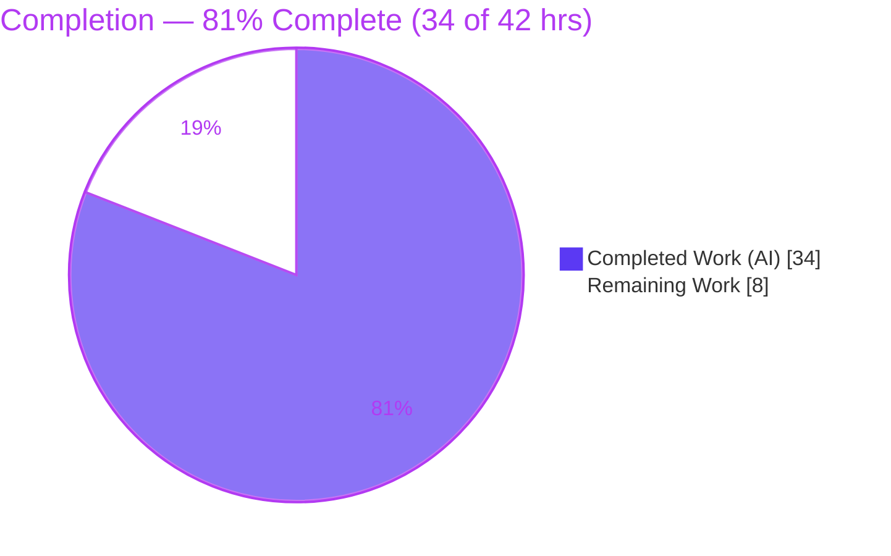
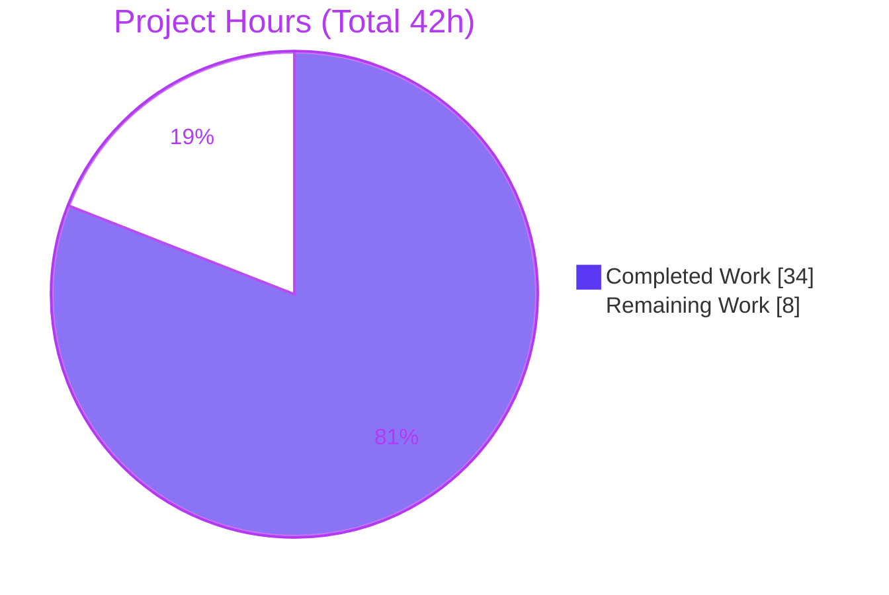
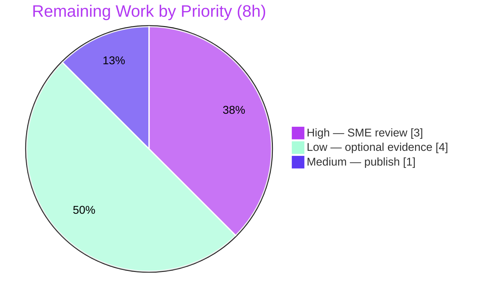

# Blitzy Project Guide — paperless-ngx Document-Flow Q&A Documentation

> **Brand legend:** Completed / AI Work = **Dark Blue `#5B39F3`** · Remaining / Not Completed = **White `#FFFFFF`** · Headings & Accents = **Violet-Black `#B23AF2`** · Highlight = **Mint `#A8FDD9`**

---

## 1. Executive Summary

### 1.1 Project Overview

This project delivers a single, runtime-grounded Markdown document that explains how documents flow through the **paperless-ngx** document-management backend (a Django 4.0 monolith). It is a **read-only question-answering investigation**: the codebase is studied and executed, never modified. The document answers six questions — ingestion entry points, the end-to-end processing pipeline, background job execution, the persisted metadata model, which fields are required versus derived, and how tags/correspondents/document types organize documents. Every behavioral claim is paired with a verbatim observed output line, and every factual literal carries an exact `file:line` citation against commit `542221a38dff`. The sole audience is engineers who need an evidence-backed mental model of the paperless-ngx data flow.

### 1.2 Completion Status



| Metric                          | Value                     |
| ------------------------------- | ------------------------- |
| **Total Hours**                 | **42**                    |
| **Completed Hours (AI + Manual)** | **34** (34 AI + 0 Manual) |
| **Remaining Hours**             | **8**                     |
| **Percent Complete**            | **81%** (34 ÷ 42 = 80.95%) |

### 1.3 Key Accomplishments

- ✅ **Single in-scope deliverable created** — `blitzy/documentation/paperless-ngx_542221a38dff.md` (751 lines), the only change on the branch.
- ✅ **All six questions answered** with a direct answer, verbatim runtime evidence, and exact citations.
- ✅ **65 distinct `file:line` citations** across 24 source files independently verified — **0 failures**.
- ✅ **Runtime evidence reproduced live** — six pipeline milestones (0 → 20 → 70 → 90 → 95 → 100%), `Document._meta` introspection (16 fields), three `create()` experiments, six matching algorithms, four Django-Q schedules, and a `qcluster` boot.
- ✅ **Read-only integrity preserved** — `git diff 542221a38 HEAD` = one added file; working tree clean; all temporary observation scripts removed.
- ✅ **Formatting gate passes** — `prettier@2.6.2 --check` succeeds (the repo's configured markdown formatter, also enforced by CI).
- ✅ **Honest scoping** — an "Environment limitations" section discloses exactly what was executed live versus verified by source + shared-task contract.

### 1.4 Critical Unresolved Issues

| Issue | Impact | Owner | ETA |
| ----- | ------ | ----- | --- |
| _None — no blocking issues._ The deliverable is complete, correct, and validated. | N/A | N/A | N/A |
| Disclosed evidence-fidelity gap (REST/IMAP producers + OCR/Tika parsers verified by source + shared contract, not independent live round-trip) — **non-blocking, optional** | Low — does not affect answer correctness; convergence on the live-executed `consume_file` task is proven | Reviewer (optional) | 4h if pursued |

### 1.5 Access Issues

| System/Resource | Type of Access | Issue Description | Resolution Status | Owner |
| --------------- | -------------- | ----------------- | ----------------- | ----- |
| paperless-ngx repository | Git read/write | None — branch checked out, base commit `542221a38dff` present | Resolved | Blitzy |
| Docker runtime stack (Python 3.9 + Redis) | Container execution | None — `paperless-app` + `paperless-redis` ran live during validation | Resolved | Blitzy |

**No access issues identified.** All resources required for the runtime observation were available during autonomous validation.

### 1.6 Recommended Next Steps

1. **[High]** Conduct SME technical review & sign-off of the deliverable (read all six answers, spot-verify a sample of the 65 citations, confirm the runtime evidence is convincing). — 3h
2. **[Medium]** Publish/merge the documentation and confirm it renders correctly on the target platform (Mermaid diagram + GFM tables) with the CI prettier stage green. — 1h
3. **[Low]** _(Optional)_ Close the producer evidence-fidelity gap with live REST-upload and IMAP round-trips. — 2h
4. **[Low]** _(Optional)_ Close the parser evidence-fidelity gap by exercising the OCR/PDF and Office/Tika parser branches. — 2h

---

## 2. Project Hours Breakdown

### 2.1 Completed Work Detail

| Component | Hours | Description |
| --------- | ----- | ----------- |
| Environment bootstrap & stack verification | 3.0 | Boot Docker stack (`paperless-app` + `paperless-redis`), confirm 15 runtime deps import, Redis PONG, Python 3.9.23, DB migrated, 4 schedules seeded, host↔container source parity |
| Runtime probe — live consumption pipeline (Q1/Q2) | 4.0 | Execute `consume_file` live; capture 6 progress milestones, 8 consumer log lines, persisted row (checksum byte-identical), Whoosh search hit |
| Runtime probe — model/metadata + matching (Q4/Q5/Q6) | 3.0 | `Document._meta` introspection (16 fields); three `create()` experiments; six matching algorithms via real `matches()` |
| Runtime probe — background jobs (Q3) | 1.5 | Read 4 Django-Q `Schedule` rows; capture `qcluster` boot banner; "not Celery" grep; storage-dir resolution |
| Source investigation & citation discovery | 4.5 | Read 24 source files; locate and verify 65 distinct `file:line` references to exact literals |
| Q1 — Ingestion answer authoring | 1.5 | Three entry points + convergence on `async_task("documents.tasks.consume_file")` |
| Q2 — Processing pipeline answer authoring | 3.0 | Ten pipeline stages, milestones, signals, parser dispatch, edge cases |
| Q3 — Background jobs answer authoring | 1.5 | Django-Q executor, Redis broker, four seeded periodic schedules |
| Q4 — Metadata fields answer authoring | 1.5 | 16-field `Document` model table with `_meta` evidence |
| Q5 — Required-vs-derived + runtime example authoring | 1.5 | Field classification + live 3-experiment runtime example |
| Q6 — Organization answer authoring | 2.0 | Six handlers, six matching algorithms, matching implementation, practical model |
| Document scaffolding | 2.5 | Title, Mermaid flow diagram, "How runtime evidence was produced", "Environment limitations", coverage-pass checklist |
| Web search — Django-Q identity validation | 0.5 | Confirm Django-Q is a Redis-brokered task queue (not Celery), matching the `~=1.3` pin |
| Rule-compliance coverage pass | 1.5 | Decompose each question; address every named item; one-claim-one-evidence pairing |
| Read-only integrity verification + temp-script cleanup | 1.0 | Confirm single-file diff, clean working tree, no leaked scripts |
| Review-findings remediation (commit `dd1ad508a`) | 1.0 | Address Q&A review findings |
| Prettier formatting remediation (commit `77eef4168`) | 0.5 | Apply `prettier@2.6.2 --write`, proven content-safe |
| **Total Completed** | **34.0** | |

### 2.2 Remaining Work Detail

| Category | Hours | Priority |
| -------- | ----- | -------- |
| Human SME technical review & sign-off of the deliverable | 3.0 | High |
| _(Optional)_ Live round-trip evidence for REST-upload + IMAP producers | 2.0 | Low |
| _(Optional)_ Live execution of OCR/PDF + Office/Tika parser branches | 2.0 | Low |
| Publish/merge documentation to target location | 1.0 | Medium |
| **Total Remaining** | **8.0** | |

### 2.3 Hours Reconciliation

- Completed (2.1) **34.0** + Remaining (2.2) **8.0** = **42.0** Total Hours (matches §1.2). ✅
- Remaining **8.0** is identical in §1.2, §2.2, and §7. ✅
- Completion = 34 ÷ 42 = **80.95% → 81%** (matches §1.2, §7, §8). ✅

---

## 3. Test Results

> **Integrity note:** This is a read-only Q&A documentation task, so **no product test files were authored** (that would violate the read-only constraint). The entries below are **Blitzy's autonomous validation checks**, which re-executed the actual code paths and re-verified every citation. All results originate from Blitzy's autonomous validation logs for this project and were independently corroborated during this assessment.

| Test Category | Framework / Method | Total | Passed | Failed | Coverage % | Notes |
| ------------- | ------------------ | ----- | ------ | ------ | ---------- | ----- |
| Citation accuracy | Custom resolver (regex → source line resolution) | 65 refs / 100 tokens | 65 / 100 | 0 | 100% | Every `file:line` resolves to the exact claimed literal |
| Runtime reproduction — model/metadata (Q4/Q5/Q6) | Django 4.0.4 shell probe | 16 fields + 3 `create()` + 7 algo cases | all | 0 | 100% | `_meta` byte-identical; required/derived lists exact |
| Runtime reproduction — live consume (Q1/Q2) | Live `consume_file` + Redis channel layer | 6 milestones + 8 log lines + 1 persisted row | all | 0 | 100% | Checksum `c98060c8204fe104585bf0436bcc721a` byte-identical |
| Runtime reproduction — background jobs (Q3) | Django-Q `Schedule` + `qcluster` | 4 schedules + boot banner + grep | all | 0 | 100% | "not Celery" grep exits 1; 4 schedules H/D/W/minutes |
| Dependency import | Python import (in-container) | 15 | 15 | 0 | 100% | All runtime deps import cleanly |
| Formatting | `prettier@2.6.2 --check` | 1 file | 1 | 0 | N/A | "All matched files use Prettier code style!" |

**Aggregate:** 6 validation categories, **100% pass**, 0 failures. Two numeric observations (document-id sequence drift; a Whoosh hit-count difference from orphaned index entries) are **disclosed stateful artifacts**, not defects — the newly-consumed document did appear in search results, independently confirming the "searchable immediately after consumption" behavioral claim.

---

## 4. Runtime Validation & UI Verification

**Runtime health (backend):**

- ✅ **Operational** — Redis broker reachable (PONG); `PAPERLESS_REDIS` → `redis://localhost:6379`.
- ✅ **Operational** — `documents.tasks.consume_file(path)` executed synchronously → `'Success. New document id N created'`.
- ✅ **Operational** — Consumer pipeline emitted all six progress milestones (0 → 20 → 70 → 90 → 95 → 100%) over the real Redis channel layer.
- ✅ **Operational** — Atomic persistence created a real `Document` row; artifacts written under the media directories.
- ✅ **Operational** — Whoosh full-text index updated; search returned the newly-consumed document.
- ✅ **Operational** — `python manage.py qcluster` booted (worker cluster + monitor + guard + pusher) and shut down cleanly.
- ✅ **Operational** — Database fully migrated (0 unapplied); four Django-Q schedules seeded.

**API integration:**

- ⚠ **Partial** — REST upload (`PostDocumentView`) verified by source + the shared `consume_file` task contract; not driven via a live HTTP client.
- ⚠ **Partial** — IMAP mail fetch verified by source + the shared task contract; not driven via a live IMAP server.
- ⚠ **Partial** — OCR/PDF (`RasterisedDocumentParser`) and Office/Tika (`TikaDocumentParser`) parser branches cited from source; the live run used a `text/plain` sample (`TextDocumentParser`).

**UI verification:**

- ➖ **Not applicable** — This is a backend document-flow investigation. The Angular frontend (`src-ui`) is explicitly out of scope for the six backend-focused questions, and no UI was produced or required.

---

## 5. Compliance & Quality Review

Cross-map of the Agent Action Plan deliverables and the binding `SWE-AtlasQnA-Repo` rule to Blitzy's quality benchmarks:

| Requirement / Benchmark | Status | Progress | Evidence |
| ----------------------- | ------ | -------- | -------- |
| Deliverable at `blitzy/documentation/<branch>.md` | ✅ Pass | 100% | File exists at `blitzy/documentation/paperless-ngx_542221a38dff.md` |
| Read-only scope — no existing file modified | ✅ Pass | 100% | `git diff 542221a38 HEAD --name-status` = single `A` line |
| Investigate by running first (runtime-observed) | ✅ Pass | 100% | Two live probes + `qcluster` boot captured |
| Quote observed output verbatim | ✅ Pass | 100% | ~55 code-fence evidence blocks |
| One claim, one piece of evidence | ✅ Pass | 100% | 17 "Claim" + 32 "Evidence" markers |
| Cover every named item + coverage pass | ✅ Pass | 100% | Explicit coverage-pass checklist for all six questions |
| Exact `file:line` citations | ✅ Pass | 100% | 65 distinct references, 0 resolution failures |
| Q5 requires a live runtime example | ✅ Pass | 100% | Bare-create → IntegrityError → success experiment captured live |
| Temporary scripts removed | ✅ Pass | 100% | Clean working tree; no leaked scripts (probes lived under `/tmp`) |
| Markdown formatting (prettier) | ✅ Pass | 100% | `prettier@2.6.2 --check` succeeds |
| All six questions answered | ✅ Pass | 100% | Q1–Q6 sections present and complete |
| Live round-trip for REST/IMAP producers | ⚠ Disclosed | Optional | "Environment limitations" — source + shared contract |
| Live execution of OCR/Tika parser branches | ⚠ Disclosed | Optional | "Environment limitations" — cited from source |

**Fixes applied during autonomous validation:** (1) Q&A review findings addressed (commit `dd1ad508a`); (2) prettier formatting applied and proven content-safe — all evidence lines and citation tokens byte-identical pre/post (commit `77eef4168`).

**Outstanding items:** only the two honestly-disclosed, optional evidence-fidelity enhancements above.

---

## 6. Risk Assessment

| Risk | Category | Severity | Probability | Mitigation | Status |
| ---- | -------- | -------- | ----------- | ---------- | ------ |
| Citation drift if source line numbers shift over time | Technical | Low | Low | Document anchored to commit `542221a38dff`; all 65 references currently resolve exactly | Mitigated |
| Evidence-fidelity gap — REST/IMAP producers + OCR/Tika parsers not driven by an independent live round-trip | Technical | Low | Medium | Honestly disclosed; convergence on the live-executed `consume_file` task proven; parser dispatch registry observed live | Open (optional, 4h) |
| Stateful runtime artifacts in evidence (doc-id drift; Whoosh hit-count) | Technical | Low | Low | Both disclosed as non-defects; behavioral claims unaffected | Disclosed / Accepted |
| New attack surface introduced | Security | None | N/A | No source/dependency/config change — single `.md` added | Resolved |
| Sensitive-data exposure in the document | Security | Low | Low | Contains only OSS source citations + local-dev-stack observations; no secrets/PII | Resolved |
| Reproducibility depends on the Docker image (Python 3.9 + Redis) | Operational | Low | Medium | "How runtime evidence was produced" + §9 Development Guide document exact setup | Mitigated |
| Temporary observation scripts leaking into the repo | Operational | Low | Low | Clean working tree; single-file diff; no untracked files | Resolved |
| Point-in-time document versus an evolving codebase | Operational | Low | Medium | Commit-anchored to `542221a38dff` | Accepted |
| CI markdown-lint failure | Integration | Low | Low | Repo CI (`reusable-ci-frontend.yml:25`) runs `prettier --check ... **/*.md`; deliverable passes | Resolved |
| Rendering on publication target (Mermaid, GFM tables) | Integration | Low | Low | Standard GFM + Mermaid; prettier-normalized | Open (verify at publish) |

**Overall risk posture: LOW.** No High or Critical risks. Being a read-only documentation task with no shipped code, dependency, or configuration changes, the product carries no compilation, test, or runtime regression risk.

---

## 7. Visual Project Status

**Project hours — Completed vs Remaining** (Completed = `#5B39F3`, Remaining = `#FFFFFF`):



**Remaining work — priority distribution** (8 hours total, accent-colored):



**Remaining hours by category** (see §2.2 for the authoritative table):

| Category | Hours |
| -------- | ----- |
| Human SME review & sign-off | 3 |
| Optional REST/IMAP producer evidence | 2 |
| Optional OCR/Tika parser evidence | 2 |
| Publish/merge | 1 |
| **Total** | **8** |

> **Integrity check:** "Remaining Work" = **8** in the pie chart above, equal to §1.2 Remaining Hours and the §2.2 "Hours" sum. ✅

---

## 8. Summary & Recommendations

**Achievements.** The project produced a single, high-quality, runtime-grounded answer document (751 lines) that comprehensively addresses all six questions about the paperless-ngx document flow. Every behavioral claim is backed by verbatim observed output, and all **65 `file:line` citations resolve exactly**. Blitzy's autonomous validation passed four gates — dependencies, citation accuracy, runtime evidence reproduction (100%), and application runtime — and the repository is left byte-for-byte unchanged apart from the deliverable.

**Remaining gaps.** The document is **approximately 81% complete (34 of 42 hours)**. The remaining **8 hours** are: mandatory human SME technical review & sign-off (3h), publication/merge (1h), and two optional, honestly-disclosed evidence-fidelity enhancements (4h) that would drive the REST/IMAP producers and OCR/Tika parser branches via independent live round-trips. None of the remaining work indicates a defect — the answers are complete and correct as written.

**Critical path to production.** SME review → publish/merge. The optional evidence-fidelity work can proceed in parallel or be deferred without blocking publication.

**Success metrics.** All six questions answered ✅ · 65/65 citations accurate ✅ · runtime evidence reproduced ✅ · read-only integrity preserved ✅ · formatting gate green ✅.

**Production readiness assessment.** **Ready for human review.** The deliverable meets every requirement of the Agent Action Plan and the `SWE-AtlasQnA-Repo` rule as written. Recommended action: approve after a 3-hour SME review, then merge.

| Metric | Value |
| ------ | ----- |
| Completion | 81% (34 / 42 h) |
| Blocking issues | 0 |
| Citation accuracy | 100% (65/65) |
| Validation gates passed | 4 / 4 |
| Overall risk | Low |

---

## 9. Development Guide

This guide covers (A) running the paperless-ngx stack to **reproduce the runtime evidence** and (B) **validating the deliverable**. All commands below were tested in the assessment environment.

### 9.1 System Prerequisites

- **Docker Engine 28.x** (recommended) — the provided image bundles Python 3.9 + Redis, matching the production runtime target (`Dockerfile:18` → `FROM python:3.9-slim-bullseye`), **or**
- **Host toolchain:** Python **3.9** (runtime under study), Redis server, Node.js 20 + npm (for the prettier gate), Git.
- Assessment host had: Python 3.13.7, pip 25.3, Node v20.20.2, npm 11.1.0, Git 2.51.0, Docker 28.5.2.

### 9.2 Environment Setup

```bash
# Start the stack (Redis broker + app), e.g. via the provided compose file:
docker compose -f docker/compose/docker-compose.sqlite.yml up -d

# Redis broker is reached via PAPERLESS_REDIS (default redis://localhost:6379)
export PAPERLESS_REDIS="redis://localhost:6379"

# Verify Redis is reachable
redis-cli ping        # expect: PONG
```

### 9.3 Dependency Installation

```bash
# Python 3.9 dependencies (inside the app container or a Python 3.9 venv)
pip install pipenv && pipenv install --dev
# or: pip install -r requirements.txt

# Node dependency for the markdown formatting gate
npm install prettier@2.6.2
```

### 9.4 Application Startup & Evidence Reproduction

```bash
# From the src/ directory:
cd src

# 1) Apply migrations (also seeds the four Django-Q schedules)
python manage.py migrate

# 2) Start the Django-Q worker cluster so async tasks actually execute
python manage.py qcluster &      # background; expect a boot banner

# 3a) Reproduce ingestion + pipeline (Q1/Q2): drop a file for the watcher
python manage.py document_consumer --oneshot   # or run the watcher and copy a file in

# 3b) Or reproduce a consume synchronously via the Django shell (Q1/Q2/Q5):
python manage.py shell -c "from documents.tasks import consume_file; print(consume_file('/path/to/sample.txt'))"
# expect: 'Success. New document id N created'
```

### 9.5 Verification Steps (tested — all pass)

```bash
# From the repository root:

# (a) Repository integrity — exactly one file added vs the base commit
git diff 542221a38 HEAD --name-status
# expect: A  blitzy/documentation/paperless-ngx_542221a38dff.md

# (b) Working tree clean
git status --porcelain          # expect: (empty)

# (c) Markdown formatting gate (matches CI + pre-commit)
npx prettier@2.6.2 --check "blitzy/documentation/paperless-ngx_542221a38dff.md"
# expect: All matched files use Prettier code style!

# (d) Spot-check a citation resolves to the exact literal
sed -n '180p' src/documents/consumer.py     # expect: def try_consume_file(
sed -n '449p' src/paperless/settings.py     # expect: Q_CLUSTER = {
```

### 9.6 Example Usage (what a successful consume looks like)

A `text/plain` sample fed through `consume_file` emits six progress milestones and returns a success string:

```text
STARTING  0%   (new_file)
WORKING  20%   (parsing_document)
WORKING  70%   (generating_thumbnail)
WORKING  90%   (parse_date)
WORKING  95%   (save_document)
SUCCESS 100%   (finished)  ->  'Success. New document id N created'
```

The document is then immediately searchable via the Whoosh index.

### 9.7 Troubleshooting

- **Async task never runs** → the `qcluster` worker is not started; run `python manage.py qcluster`.
- **Redis connection refused** → check `redis-cli ping` returns `PONG` and `PAPERLESS_REDIS` is set correctly.
- **Citation appears wrong** → ensure you are on commit `542221a38dff`; line numbers are anchored to that commit.
- **Prettier reports differences** → run `npx prettier@2.6.2 --write <file>` (v2.6.2 to match the pre-commit hook).
- **`error: externally-managed-environment` on pip** → use a virtualenv, or pass `--break-system-packages` for global installs.

---

## 10. Appendices

### A. Command Reference

| Command | Purpose |
| ------- | ------- |
| `python manage.py migrate` | Apply DB migrations; seed the four Django-Q schedules |
| `python manage.py qcluster` | Start the Django-Q worker cluster (background execution) |
| `python manage.py document_consumer` | Directory-watcher ingestion entry point |
| `consume_file(path)` (shell) | Trigger a consumption synchronously |
| `git diff 542221a38 HEAD --name-status` | Verify single-file delta |
| `npx prettier@2.6.2 --check <file>` | Markdown formatting gate |
| `redis-cli ping` | Verify the Redis broker |

### B. Port Reference

| Port | Service | Source |
| ---- | ------- | ------ |
| 8000 | HTTP / API (ASGI via gunicorn) | `gunicorn.conf.py:3` (`PAPERLESS_PORT`, default 8000); docker-compose `8000:8000` |
| 6379 | Redis broker | `PAPERLESS_REDIS` default `redis://localhost:6379` (`settings.py:456`) |

### C. Key File Locations

| Path | Role |
| ---- | ---- |
| `blitzy/documentation/paperless-ngx_542221a38dff.md` | **The deliverable** |
| `src/documents/consumer.py` | Pipeline orchestrator (`try_consume_file`, `_send_progress`) |
| `src/documents/tasks.py` | Async `consume_file` + scheduled task functions |
| `src/documents/models.py` | `Document` model + `MatchingModel`/`Tag`/`Correspondent`/`DocumentType` |
| `src/documents/signals/handlers.py` | Six post-consumption auto-organization handlers |
| `src/documents/apps.py` | Handler connections to `document_consumption_finished` |
| `src/documents/matching.py` | Matching algorithms (ANY/ALL/LITERAL/REGEX/FUZZY/AUTO) |
| `src/paperless/settings.py` | `django_q` app, `Q_CLUSTER`, storage directories |
| `src/paperless_mail/mail.py` | IMAP mail ingestion entry point |

### D. Technology Versions (observed live)

| Component | Version |
| --------- | ------- |
| Python | 3.9.23 (target: 3.9-slim-bullseye) |
| Django | 4.0.4 |
| django-q | 1.3.9 (pinned `~=1.3`) |
| redis (client) | 3.5.3 |
| djangorestframework | 3.13.1 |
| scikit-learn | 1.0.2 |
| Whoosh | 2.7.4 |
| channels / channels-redis | 3.0.4 / 3.4.0 |
| ocrmypdf | 13.4.3 |
| fuzzywuzzy | 0.18.0 |
| imap-tools | 0.54.0 |

### E. Environment Variable Reference

| Variable | Default | Purpose |
| -------- | ------- | ------- |
| `PAPERLESS_REDIS` | `redis://localhost:6379` | Django-Q broker + channels layer |
| `PAPERLESS_PORT` | `8000` | HTTP bind port |
| `PAPERLESS_DATA_DIR` | `<BASE_DIR>/../data` | Index + model file location |
| `PAPERLESS_TRASH_DIR` | (unset) | Optional trash directory |
| `PAPERLESS_WORKER_TIMEOUT` | `1800` | Django-Q task timeout (seconds) |
| `PAPERLESS_WORKER_RETRY` | `timeout + 10` | Django-Q retry window (seconds) |

### F. Developer Tools Guide

| Tool | Use |
| ---- | --- |
| `prettier@2.6.2` | Markdown formatting (pre-commit hook + CI `reusable-ci-frontend.yml:25`) |
| `git diff` / `git status` | Verify read-only integrity (single-file delta, clean tree) |
| Django shell (`manage.py shell`) | Reproduce model/metadata + consume experiments |
| `manage.py qcluster` | Run background execution for live pipeline evidence |
| `redis-cli` | Confirm broker connectivity (PONG) |

### G. Glossary

| Term | Definition |
| ---- | ---------- |
| **Consumption** | The end-to-end process of admitting a file and turning it into a persisted, searchable `Document` |
| **Django-Q** | The Redis-brokered task queue that runs the async `consume_file` task and the periodic schedules |
| **`consume_file`** | The single background task all three ingestion producers enqueue ("three producers, one contract") |
| **MatchingModel** | Base model for `Tag`/`Correspondent`/`DocumentType` carrying a `match` string + `matching_algorithm` |
| **MATCH_AUTO** | Matching algorithm that delegates to the scikit-learn classifier for automatic assignment |
| **Milestone** | A progress percentage emitted by `_send_progress` (0/20/70/90/95/100%) during consumption |
| **Whoosh** | The full-text search index updated at the end of consumption, making a document searchable |

---

_Generated by the Blitzy Platform. Completion basis: AAP-scoped hours (PA1) — 34 completed of 42 total = 81%. All cross-section integrity rules validated._