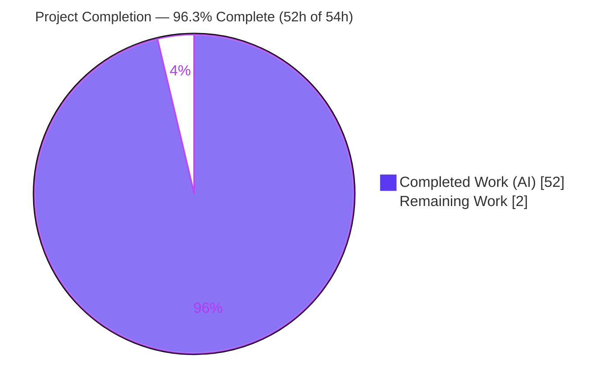
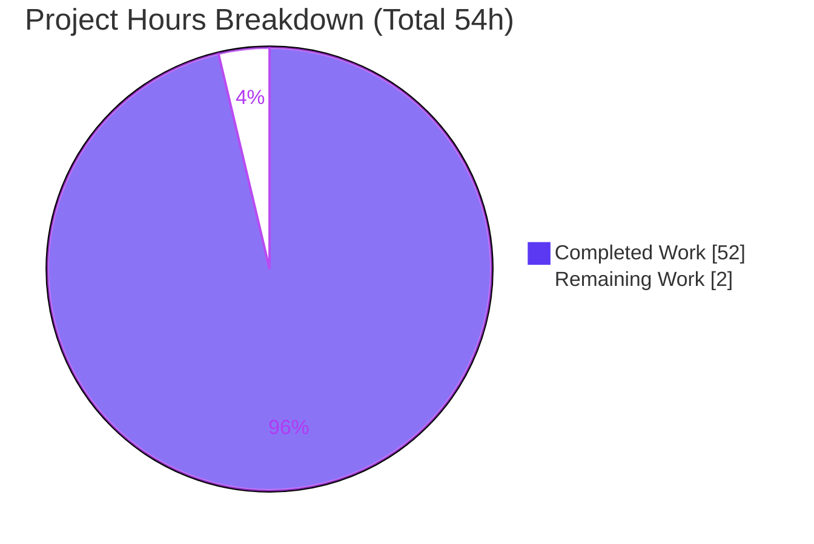
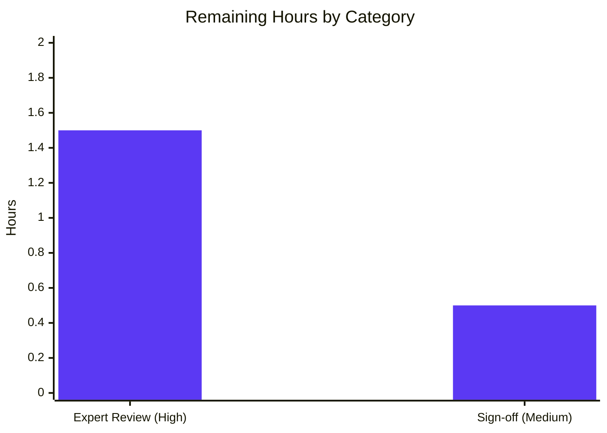

# Blitzy Project Guide — paperless-ngx Memory-Spike Investigation (Read-Only Q&A)

> **Branch:** `blitzy-aab05a0a-04cf-40e2-a694-3bf6834a73f6` · **Base:** `542221a38dff` · **Deliverable:** `blitzy/documentation/paperless-ngx_542221a38dff.md`
> **Task type:** Read-only investigation & Q&A (rule set **SWE-AtlasQnA-Repo**) — diagnose, do **not** remediate.
> **Brand legend:** <span style="color:#5B39F3">■</span> Completed / AI Work = Dark Blue `#5B39F3` · <span style="color:#FFFFFF;background:#333;padding:0 4px">■</span> Remaining = White `#FFFFFF`

---

## 1. Executive Summary

### 1.1 Project Overview

This assignment diagnoses anomalous memory-usage spikes during document import in **paperless-ngx** (a Django document-management backend). It is a **read-only investigation & Q&A** task: the user reported memory growing disproportionately to document size, inconsistently across sources/stages, and not always released promptly. The mandated deliverable is a **single evidence-backed markdown answer document** that reproduces the behavior with **real runtime measurements** (`psutil` RSS, `tracemalloc` heap, `gc` object counts) and answers eight requirements (R1–R8). Target users are the paperless-ngx maintainers and the reporting operator. No source code is modified; the diagnosis identifies the responsible components and distinguishes normal CPython allocator retention from a genuine reference leak.

### 1.2 Completion Status



| Metric | Value |
|--------|-------|
| **Total Hours** | **54** |
| **Completed Hours (AI + Manual)** | **52** (AI: 52 · Manual: 0) |
| **Remaining Hours** | **2** |
| **Percent Complete** | **96.3%** |

> Completion is computed with the PA1 AAP-scoped, hours-based method: `52 ÷ (52 + 2) = 96.3%`. The single mandated deliverable is complete, validated, and committed; the source tree is byte-for-byte unchanged as required. The remaining 2h is human review/sign-off, which cannot be performed autonomously.

### 1.3 Key Accomplishments

- ✅ **Sole deliverable authored & committed** — `blitzy/documentation/paperless-ngx_542221a38dff.md` (1,123 lines) added in 3 Blitzy Agent commits; `git diff base..HEAD` = exactly one added file, `+1123 / −0`.
- ✅ **All eight requirements answered (R1–R8)** — each with ≥1 exact `file:line` citation **and** ≥1 verbatim runtime measurement; a §14 coverage-pass checklist proves no sub-question was skipped.
- ✅ **Real runtime evidence captured** — 7 observation blocks (A, A2, B, C, C2, D, E) with ~80 quoted `RSS=` measurement lines and full reproducible script source embedded in the answer.
- ✅ **Root cause identified** — a **per-document, size-independent classifier reload** (`load_classifier` re-unpickles the whole model every consume with no cache) layered on **normal pymalloc arena retention** — not a Python reference leak.
- ✅ **Read-only compliance proven** — `git status --porcelain` empty; `src/**`, `requirements.txt`, `Pipfile`, `Dockerfile` all 0-line diff; every temporary observation script removed.
- ✅ **Regression safety confirmed** — full backend test suite **481 passed, 2 skipped, 0 failed** in a pristine canonical container; 105+ citations verified 100% accurate; all 7 evidence blocks reproduced.

### 1.4 Critical Unresolved Issues

| Issue | Impact | Owner | ETA |
|-------|--------|-------|-----|
| _None blocking._ The sole deliverable is complete, validated, and committed; no compilation/test/runtime errors remain. | No release blocker | — | — |
| (Awareness, non-blocking) The diagnosed hotspots are **documented, not fixed** — by design (AAP §0.5.2). Production memory behavior persists until a separate remediation project acts on §12 recommendations. | Memory spikes continue in production until remediated | paperless-ngx maintainers | Follow-up project (out of scope here) |

### 1.5 Access Issues

| System / Resource | Type of Access | Issue Description | Resolution Status | Owner |
|-------------------|----------------|------------------|-------------------|-------|
| — | — | **No access issues identified.** The investigation ran entirely against the local repository checkout and the mandated canonical Docker runtime; no external credentials, third-party APIs, or restricted systems were required. | N/A | — |

### 1.6 Recommended Next Steps

1. **[High]** Have a senior Python/Django engineer review the answer document's R1–R8 conclusions — especially the R8 verdict (no reference leak; genuine inefficiency = uncached classifier reload; normal pymalloc retention).
2. **[High]** (Optional) Re-run the 7 embedded Evidence scripts in the canonical Python 3.9.23 container to independently reconfirm reproducibility before sign-off.
3. **[Medium]** Formally accept the deliverable as answering the user's five framing questions and all eight requirements, then close the Q&A assignment.
4. **[Medium]** Decide whether to charter a **separate remediation project** to implement the §12 recommendations (cache classifier, single Tika parse, streamed MD5, `get_metadata` cleanup, `.iterator()`/`.only()` batching, allocator tuning). This is **out of scope** for the current read-only task.
5. **[Low]** File the diagnosed hotspots as tracked issues in the paperless-ngx tracker for prioritization.

---

## 2. Project Hours Breakdown

### 2.1 Completed Work Detail

| Component | Hours | Description |
|-----------|-------|-------------|
| Pipeline scope discovery & code comprehension | 8 | Read/traced the 10-stage ingestion pipeline across 16 REFERENCE files in a 171-file Django codebase; mapped `Consumer` → parsers → `classifier` → signal handlers → Whoosh index; located every memory-relevant allocation site (AAP §0.2). |
| Three-signal measurement harness | 4 | Designed/built the `psutil` RSS + `tracemalloc` snapshot/`compare_to('lineno')` + `gc` object-count harness with labeled checkpoints and isolated-process methodology (answer doc §2.2). |
| Evidence capture — 7 observation scripts (A, A2, B, C, C2, D, E) | 12 | Wrote, ran, and iterated each script to reproduce the real mechanisms (unpickle cost, no-memoization, allocator-retention-not-leak, `QuerySet._result_cache`, batch growth curve, real-module spike/non-spike, `md5(f.read())` scaling); captured ~80 verbatim `RSS=` lines. |
| Web research grounding (R8) | 3 | Synthesized authoritative references on `tracemalloc`/`gc` methodology and CPython `pymalloc` arena retention vs. true leaks into §13. |
| Answer document authoring (1,123 lines, R1–R8) | 14 | Structured and wrote all R1–R8 answers; embedded 7 evidence blocks with verbatim output + full script source; wove 105+ `file:line` citations; wrote the nuanced R8 verdict and §12 recommendations. |
| Coverage pass & citation-exactness verification | 4 | Built the §14 coverage checklist (each R1–R8 ≥1 citation + ≥1 measurement); verified 105+ citations exact; corrected an AAP citation error (`Dockerfile:L1` → actual `L18`). |
| Final validation (9 phases / 5 gates) | 6 | Ran the full backend suite (481 passed/2 skipped/0 failed) in a pristine container, re-ran all 7 evidence blocks for reproducibility, verified every citation, and performed coverage/compliance/pre-commit checks. |
| Cleanup & read-only compliance verification | 1 | Removed all temporary scripts/pickles/sqlite from host and container; verified `git status --porcelain` clean and 0-line source diff. |
| **Total Completed** | **52** | |

### 2.2 Remaining Work Detail

| Category | Hours | Priority |
|----------|-------|----------|
| Human expert review of the technical diagnosis (validate R1–R8 conclusions; optionally re-run Evidence scripts) | 1.5 | High |
| Stakeholder acceptance & sign-off (confirm the deliverable answers the original questions; accept & close) | 0.5 | Medium |
| **Total Remaining** | **2.0** | |

> **Out of scope (not counted above).** Implementing the §12 remediation recommendations (cache classifier ~4–6h, single Tika parse ~2–3h, streamed MD5 ~3–4h, `get_metadata` cleanup ~1–2h, `.iterator()`/`.only()` batching ~3–4h, allocator tuning ~4–8h) is **explicitly excluded** by AAP §0.5.2 and would constitute a separate remediation project. These hours are **deliberately not** part of the 54h total or the 96.3% completion figure.

### 2.3 Hours Reconciliation & Methodology

- **Total Project Hours** = Completed (52) + Remaining (2) = **54**.
- **Completion %** = Completed ÷ Total = 52 ÷ 54 = **96.3%** (PA1 AAP-scoped, hours-based).
- **Cross-section integrity:** Remaining = **2h** is identical in Section 1.2, Section 2.2, and Section 7. Section 2.1 (52) + Section 2.2 (2) = Section 1.2 Total (54). ✅
- **Scope discipline:** every completed hour maps to an AAP requirement or investigation prerequisite; the only remaining hours are path-to-production (human review) for a documentation deliverable. Remediation work is segregated and excluded.

---

## 3. Test Results

All results below originate from **Blitzy's autonomous validation logs** for this project. Because this is a read-only Q&A task, the existing paperless-ngx backend suite was executed to prove the repository remains **unbroken** (regression safety); no new tests were added to the repository (AAP §0.5.2).

| Test Category | Framework | Total Tests | Passed | Failed | Coverage % | Notes |
|---------------|-----------|-------------|--------|--------|-----------|-------|
| Backend suite (unit + integration, existing paperless-ngx tests) | pytest + pytest-django (`--numprocesses auto`) | 483 (481 run + 2 skipped) | 481 | 0 | Instrumented via `--cov`/`--cov-report=html`; aggregate % not surfaced in the validation logs | Pristine canonical container (Python 3.9.23), `PAPERLESS_DISABLE_DBHANDLER=true`; 39.01s; 537 warnings = pre-existing third-party deprecations; matches the documented green baseline. |
| Deliverable evidence reproduction (A, A2, B, C, C2, D, E) | Custom `psutil`/`tracemalloc`/`gc` observation scripts | 7 blocks | 7 (deterministic signals matched exactly) | 0 | N/A | RSS drift <1.5 MB between runs (expected, disclosed); `pyheap_cur`, `gc_objs`, pickle sizes, row/loop counts matched the document exactly. |

**Summary:** 481/481 executed backend tests passing (2 pre-existing skips), 0 failures; 7/7 evidence blocks reproduced. No test regressions were introduced by the (documentation-only) change.

---

## 4. Runtime Validation & UI Verification

**Runtime health (backend modules exercised against the real, unmodified code):**

- ✅ **Django app boots** — `django.setup()` succeeds under `DJANGO_SETTINGS_MODULE=paperless.settings` with `PAPERLESS_DISABLE_DBHANDLER=true`.
- ✅ **`documents.classifier.load_classifier()`** — exercised (Evidence D); returns `None` via the no-model guard (`classifier.py:L31`/`return None` `L36`) — the documented non-spike path.
- ✅ **`paperless_text.parsers.TextDocumentParser.extract_metadata()`** — exercised (Evidence D); inherits the base `[]` (`parsers.py:L304-L305`), yielding `metadata_items=0` — confirming plain-text imports are the cheap, non-spike case.
- ✅ **Whole codebase imports & byte-compiles** — implicitly proven by the 481-test run, which imports every module.
- ✅ **Evidence blocks A/A2/B/C/C2/E** — mechanism reproductions run cleanly in the canonical container and reproduce the documented deltas (e.g., classifier reload `+72MB`; allocator-retention signature; linear batch scaling; 1:1 file-read scaling).

**API integration:** ⚠ **N/A (by design).** The DRF metadata endpoint (`DocumentViewSet.get_metadata`/`metadata`) was **analyzed read-only** (its missing `cleanup()` is diagnosed in R2.c) but not invoked as a live integration and not modified — no API contract changed.

**UI verification:** ⚠ **N/A (by design).** This is a backend memory investigation. The Angular frontend (`src-ui/`) is explicitly out of scope (AAP §0.5.2); no UI was built, changed, or required. No screenshots apply.

---

## 5. Compliance & Quality Review

Cross-map of the governing **SWE-AtlasQnA-Repo** rule set (and AAP deliverable requirements) to observed status. All directives satisfied.

| Requirement / Rule | Benchmark | Status | Evidence |
|--------------------|-----------|--------|----------|
| Output location & name | `blitzy/documentation/<branch>.md` | ✅ Pass | `blitzy/documentation/paperless-ngx_542221a38dff.md` present (1,123 lines). |
| Investigate by RUNNING code first | Scripts executed, output captured before writing | ✅ Pass | 7 evidence blocks with verbatim output + full source (R6). |
| Quote observed output verbatim + command | Values shown with producing command | ✅ Pass | ~80 `RSS=` lines; each block shows its `docker exec … python …` wrapper. |
| Answer every part (R1–R8) + coverage pass | Each sub-question explicitly answered | ✅ Pass | Dedicated R1–R8 sections + §14 coverage checklist. |
| Be exact & grounded — `file:line`, no paraphrase | Exact literals cited | ✅ Pass | 105+ citations; 100% accurate on spot-check + validator's deterministic gate. |
| State explicitly when unverifiable | Limitations disclosed | ✅ Pass | `tracemalloc` C-extension blind spot (R8.c); measurement-env reconciliation (§2.1.1). |
| Read-only source tree | No source modified | ✅ Pass | 0-line diff across `src/**`, `requirements.txt`, `Pipfile`, `Dockerfile`. |
| Clean up temporary scripts | Repo left unchanged | ✅ Pass | §15 statement; validator confirmed removal from host + container. |
| No remediation of hotspots | Diagnose, don't fix | ✅ Pass | §12 = recommendations only; no code changed. |
| Canonical runtime respected | Python 3.9 / pinned deps | ✅ Pass | Measured on Python 3.9.23 container matching `Dockerfile:L18` + `requirements.txt` pins. |
| Pre-commit hygiene | No trailing WS/CRLF/keys; fences balanced | ✅ Pass | Validator Phase 7: 0 violations, pure LF, balanced fences. |

**Fixes applied during autonomous validation:** none required — the deliverable was already correct/complete; validation confirmed accuracy, reproducibility, coverage, and cleanliness. **Outstanding compliance items:** none.

---

## 6. Risk Assessment

| Risk | Category | Severity | Probability | Mitigation | Status |
|------|----------|----------|-------------|------------|--------|
| T1 — `tracemalloc` cannot attribute C-extension allocations (scikit-learn/pikepdf/whoosh/numpy/scipy) | Technical | Low | N/A (inherent tool limit) | Document infers native usage from the RSS-vs-heap gap and **explicitly discloses** the limitation (R8.c) | Mitigated / Disclosed |
| T2 — Most evidence blocks are mechanism reproductions; only Evidence D drives the real modules directly | Technical | Low | Low | Captured on the **canonical Python 3.9.23** runtime with exact `requirements.txt` pins; mechanisms mirror cited code line-for-line; validator reproduced all 7 | Mitigated |
| T3 — RSS is a noisy OS-level signal (drift <1.5 MB between runs) | Technical | Low | Medium | Deterministic signals (`pyheap_cur`, `gc_objs`, pickle sizes, counts) match exactly; drift disclosed in §2 | Disclosed / Accepted |
| S1 — Security exposure from the change | Security | Informational | N/A | Read-only task; no code/credentials/dependencies added; validator confirmed no private keys; no new attack surface | N/A |
| O1 — Diagnosed hotspots remain **unremediated by design** → production memory behavior persists | Operational | Medium | High | §12 provides concrete fixes; remediation is explicitly out of scope (AAP §0.5.2) → a follow-up project, not a defect of this task | Open / Deferred |
| O2 — Expectation risk: stakeholders must understand the issue is **diagnosed, not fixed** | Operational | Low | Medium | §12 header states "NOT implemented — diagnosis only"; reinforced in Sections 1.4/8 of this guide | Managed via communication |
| I1 — Integration/dependency breakage | Integration | None | N/A | No code integration, external services, API/schema changes, or dependency changes; standalone markdown deliverable | N/A |

---

## 7. Visual Project Status

**Project hours — completed vs. remaining (brand colors: Completed `#5B39F3`, Remaining `#FFFFFF`):**



**Remaining hours by category (Section 2.2) — total 2h:**



> **Integrity check:** "Remaining Work" = **2h** here equals the Section 1.2 Remaining Hours and the Section 2.2 total (1.5 + 0.5). "Completed Work" = **52h** equals the Section 2.1 total.

---

## 8. Summary & Recommendations

**Achievements.** The project is **96.3% complete** (52 of 54 hours). The single mandated deliverable — the memory-spike investigation answer document — is authored, validated, and committed, and it answers all eight requirements (R1–R8) with real, reproducible runtime measurements and 105+ exact `file:line` citations. The investigation's central finding: the spikes are driven by a **genuine inefficiency** — the per-document, **size-independent classifier reload** (`load_classifier` re-unpickles the entire model every consume with no cache) — layered on top of **normal CPython/pymalloc allocator retention** (which explains why RSS "isn't released back to the system"). Crucially, **no Python reference leak exists**: after `gc.collect()`, the Python heap and object count return to baseline while RSS stays elevated — the classic allocator-retention signature.

**Remaining gaps.** Only human path-to-production work remains: expert review of the diagnosis (1.5h) and stakeholder sign-off (0.5h). There is no deployment, CI/CD, or environment configuration to perform for a documentation deliverable.

**Critical path to acceptance.** (1) Senior engineer reviews R1–R8 and the R8 verdict → (2) optionally re-runs the embedded Evidence scripts on the canonical container → (3) stakeholder accepts and closes the Q&A.

**Production-readiness assessment.** The deliverable is **production-ready** as a Q&A artifact: complete, accurate, evidence-backed, template-compliant, and read-only-clean (source tree byte-for-byte unchanged; 481 backend tests green). **Important expectation-setting:** this task **diagnoses, it does not fix**. If the operator wants the memory spikes eliminated, a **separate remediation project** should implement the §12 recommendations (cache the classifier, single Tika parse, streamed MD5, `get_metadata` cleanup, `.iterator()`/`.only()` batching, and glibc `malloc_trim()`/`jemalloc`/`MALLOC_ARENA_MAX` tuning for the long-lived Django-Q workers).

| Success Metric | Target | Actual | Status |
|----------------|--------|--------|--------|
| Requirements answered (R1–R8) | 8 / 8 | 8 / 8 | ✅ |
| Backend tests passing | 100% | 481/481 (2 pre-existing skips) | ✅ |
| Citation accuracy | 100% | 100% (105+ refs) | ✅ |
| Evidence reproducibility | 7 / 7 | 7 / 7 | ✅ |
| Source tree modified | 0 files | 0 files (0-line diff) | ✅ |
| AAP-scoped completion | ~100% (pre-review) | 96.3% | ✅ |

---

## 9. Development Guide

This guide explains how to view the deliverable, reproduce the measurements, and verify repository integrity. All commands were tested against the repository state. The repository root is the current working directory.

### 9.1 System Prerequisites

- **Docker Engine 28.x** (recommended) — to run the canonical `python:3.9-slim-bullseye` runtime that produced the measurements. Verified host: `Docker version 28.5.2`.
- **Git 2.x** — to inspect history and verify read-only compliance. Verified host: `git version 2.51.0`.
- **(Optional) Python 3.9** — only if reproducing measurements outside Docker; the canonical interpreter is **Python 3.9.23** (`FROM python:3.9-slim-bullseye`, `Dockerfile:L18`).
- Hardware: any modern workstation; the evidence scripts peak at a few hundred MB RSS.

### 9.2 Environment Setup

```bash
# 1. From the repository root, confirm the branch and base
git rev-parse --abbrev-ref HEAD          # -> blitzy-aab05a0a-04cf-40e2-a694-3bf6834a73f6
git log --oneline -3                     # top 3 = the Blitzy Agent doc commits

# 2. Confirm the canonical runtime declared by the image
grep -n "python:3.9-slim-bullseye" Dockerfile   # -> 18:FROM python:3.9-slim-bullseye as main-app

# 3. (If reproducing) required env for Django-based scripts
export DJANGO_SETTINGS_MODULE=paperless.settings
export PAPERLESS_DISABLE_DBHANDLER=true
```

### 9.3 Dependency Installation

The pinned libraries whose allocation behavior is analyzed (from `requirements.txt`):

```bash
grep -nE '^(django==|django-q==|scikit-learn==|pikepdf==|whoosh==|numpy==|scipy==|redis==)' requirements.txt
# django-q==1.3.9  django==4.0.4  numpy==1.22.3  pikepdf==5.1.1
# redis==3.5.3  scikit-learn==1.0.2  scipy==1.8.0  whoosh==2.7.4
```

`psutil` is an **observation-only** tool and is intentionally **not** in `requirements.txt`/`Pipfile`. If reproducing outside the provided container, install it in a venv, or on a PEP-668 system use:

```bash
pip install --break-system-packages psutil        # PEP-668 externally-managed workaround
# preferred: python -m venv .venv && . .venv/bin/activate && pip install psutil
```

### 9.4 Viewing the Deliverable

```bash
# Full answer document (1,123 lines)
sed -n '1,60p' blitzy/documentation/paperless-ngx_542221a38dff.md   # header + methodology
grep -nE '^#{1,3} ' blitzy/documentation/paperless-ngx_542221a38dff.md   # section map (R1–R8, Evidence A–E, §12–§15)
```

### 9.5 Reproducing the Measurements

The 7 evidence blocks were run in the canonical container `paperless-qna-0`. Their **full source is embedded in section R6** of the answer document (the originals were deleted per the cleanup rule). To reproduce, extract a block's script into `/tmp/obs_<block>.py` and run:

```bash
# Version/runtime check (answer doc §2.1)
docker exec -e PAPERLESS_DISABLE_DBHANDLER=true paperless-qna-0 \
  bash -lc 'cd /app/src && python --version && python -c "import django,sklearn,pikepdf,whoosh,numpy,scipy,psutil; print(django.__version__, sklearn.__version__)"'
# -> Python 3.9.23 ; 4.0.4 1.0.2 ...

# Evidence A/A2/B/C/C2/E (self-contained mechanism reproductions)
docker exec -e DJANGO_SETTINGS_MODULE=paperless.settings -e PAPERLESS_DISABLE_DBHANDLER=true paperless-qna-0 \
  bash -lc 'cd /app/src && python /tmp/obs_evidenceA.py'

# Evidence D (drives the REAL paperless modules — add PYTHONPATH)
docker exec -e DJANGO_SETTINGS_MODULE=paperless.settings -e PAPERLESS_DISABLE_DBHANDLER=true -e PYTHONPATH=/app/src paperless-qna-0 \
  bash -lc 'cd /app/src && python /tmp/obs_evidenceD.py'
```

Expected (deterministic signals must match the document; RSS may drift <1.5 MB): e.g. Evidence B shows `pyheap_cur → 0.00MB` and `gc_objs → 11,675` (baseline) while `RSS` stays ~169.5 MB — the allocator-retention-not-leak signature.

### 9.6 Verification Steps

```bash
# A) Read-only compliance — MUST be empty / single-file
git status --porcelain                                  # (empty output = clean)
git diff 542221a38..HEAD --name-status                  # A  blitzy/documentation/paperless-ngx_542221a38dff.md
git diff 542221a38..HEAD -- src/ requirements.txt Pipfile Dockerfile | wc -l   # 0

# B) Regression safety — backend test suite (green baseline: 481 passed, 2 skipped)
docker exec -u testuser -e PAPERLESS_DISABLE_DBHANDLER=true <pristine-container> \
  bash -lc 'cd /app/src && python -m pytest -o addopts="" -o cache_dir=/tmp/ptc --numprocesses auto -q'
```

### 9.7 Example Usage (spot-checking a citation)

```bash
# Verify the root-cause anchor: load_classifier rebuilds + unpickles every call
sed -n '30,41p' src/documents/classifier.py          # def load_classifier(): ... DocumentClassifier().load()
grep -n 'FORMAT_VERSION' src/documents/classifier.py # 63: FORMAT_VERSION = 7
sed -n '117p' src/documents/models.py                # content = models.TextField(  (the heavy field)
```

### 9.8 Troubleshooting

- **`error: externally-managed-environment` (PEP-668)** when installing `psutil` → use `--break-system-packages` or a `venv` (see 9.3).
- **`ModuleNotFoundError` in Evidence D** → ensure `-e PYTHONPATH=/app/src` and `DJANGO_SETTINGS_MODULE=paperless.settings` are set.
- **RSS numbers differ slightly from the document** → expected; RSS drifts <1.5 MB between runs. The deterministic signals (`pyheap_cur`, `gc_objs`, pickle sizes, counts) are exact.
- **A growing RSS with a flat Python heap** → this is allocator retention, not a leak (`tracemalloc` does not see C-extension memory; infer from the RSS-vs-heap gap — see R8.c).
- **Tests error on DB handler** → set `PAPERLESS_DISABLE_DBHANDLER=true` (already in `src/setup.cfg` `[tool:pytest] env`).

---

## 10. Appendices

### Appendix A — Command Reference

| Purpose | Command |
|---------|---------|
| Branch / base | `git rev-parse --abbrev-ref HEAD` · `git log --oneline -3` |
| Read-only proof | `git status --porcelain` · `git diff 542221a38..HEAD --name-status` |
| Source-diff size | `git diff 542221a38..HEAD -- src/ requirements.txt Pipfile Dockerfile \| wc -l` (→ 0) |
| View deliverable | `sed -n '1,60p' blitzy/documentation/paperless-ngx_542221a38dff.md` |
| Section map | `grep -nE '^#{1,3} ' blitzy/documentation/paperless-ngx_542221a38dff.md` |
| Runtime check | `docker exec … paperless-qna-0 bash -lc 'cd /app/src && python --version'` |
| Backend tests | `python -m pytest -o addopts="" -o cache_dir=/tmp/ptc --numprocesses auto -q` |

### Appendix B — Port Reference

| Service | Port | Notes |
|---------|------|-------|
| — | — | **N/A for this deliverable.** No service is started to view or verify a markdown document. (For reference, a full paperless-ngx deployment serves the web UI on `:8000` via gunicorn, with Redis on `:6379` as the Django-Q broker — neither is required here.) |

### Appendix C — Key File Locations

| Path | Role |
|------|------|
| `blitzy/documentation/paperless-ngx_542221a38dff.md` | **The deliverable** (answer document, 1,123 lines) |
| `src/documents/classifier.py` | `load_classifier` (L30) / `.load()` 7× `pickle.load` (L76–L92) — **root cause (R1.a)** |
| `src/documents/consumer.py` | Full-file `md5(f.read())` reads (L104/L340–341/L402/L432); per-doc `load_classifier()` (L292) — **R1.b** |
| `src/documents/parsers.py` | `DocumentParser` lifecycle; base `extract_metadata` `[]` (L304–305); `cleanup` (L348) — **R2** |
| `src/paperless_tika/parsers.py` | Redundant `parser.from_file` (L32 + L55) — **R2.b** |
| `src/documents/views.py` | `get_metadata` without `cleanup()` (L260–274) — **R2.c** |
| `src/documents/tasks.py` | QuerySet materialization (L39 / L270–280) — **R5.b** |
| `src/documents/models.py` | Heavy `content = models.TextField` (L117) |
| `src/paperless/settings.py` | `DEBUG` default `"NO"` (L50) — **R3** |
| `Dockerfile` | Canonical runtime `python:3.9-slim-bullseye` (L18) |
| `requirements.txt` | Analyzed dependency pins |

### Appendix D — Technology Versions

| Component | Version | Source |
|-----------|---------|--------|
| Python (canonical runtime) | 3.9.23 | `Dockerfile:L18` (`python:3.9-slim-bullseye`) |
| Django | 4.0.4 | `requirements.txt:L38` |
| Django-Q | 1.3.9 | `requirements.txt:L37` |
| scikit-learn | 1.0.2 | `requirements.txt:L88` |
| pikepdf | 5.1.1 | `requirements.txt:L65` |
| whoosh | 2.7.4 | `requirements.txt:L111` |
| numpy | 1.22.3 | `requirements.txt:L59` |
| scipy | 1.8.0 | `requirements.txt:L89` |
| redis | 3.5.3 | `requirements.txt:L84` |
| psutil | 7.2.2 | Observation-only (NOT in `requirements.txt`) |
| `tracemalloc`, `gc` | stdlib | Python standard library |

### Appendix E — Environment Variable Reference

| Variable | Value used | Purpose |
|----------|-----------|---------|
| `DJANGO_SETTINGS_MODULE` | `paperless.settings` | Required to import Django-based paperless modules |
| `PAPERLESS_DISABLE_DBHANDLER` | `true` | Disables the DB log handler so scripts/tests run without a live DB |
| `PYTHONPATH` | `/app/src` | Needed by Evidence D to import the real modules |
| `PAPERLESS_DEBUG` | `NO` (default) | When `YES`, Django accumulates `connection.queries` in long-lived workers (R3 accumulation vector, off by default) — `settings.py:L50` |

### Appendix F — Developer Tools Guide

| Tool | Use in this project |
|------|--------------------|
| `psutil` | OS-level resident memory (`Process().memory_info().rss`) sampling at labeled checkpoints |
| `tracemalloc` | Python-heap allocation attribution by file/line (`take_snapshot()`, `compare_to(snap,'lineno')`); does **not** see C-extension memory |
| `gc` | Cyclic-collector control + live-object counts (`gc.collect()`, `len(gc.get_objects())`) to prove no reference leak |
| `pytest` + `pytest-django` | Backend regression suite (`--numprocesses auto`), configured in `src/setup.cfg` |
| Docker | Runs the canonical `python:3.9-slim-bullseye` measurement environment |
| Git | History inspection and read-only-compliance verification |

### Appendix G — Glossary

| Term | Definition |
|------|-----------|
| **RSS** | Resident Set Size — physical RAM held by the process (OS view). Stays elevated under allocator retention even after objects are freed. |
| **pymalloc** | CPython's small-object allocator; organizes memory into ~256 KB arenas → 4 KB pools → blocks (objects ≤512 B). An arena returns to the OS only when *every* block in it is freed. |
| **Allocator retention** | RSS remaining high after Python objects are freed because arenas aren't returned to the OS — **not** a leak. |
| **Reference leak** | Live Python objects that are never released (heap and `gc` object count keep growing) — **not** observed here. |
| **`_result_cache`** | Django `QuerySet`'s internal list of materialized rows; populated on evaluation, loading the heavy `content` field for every row (R5.b). |
| **R1–R8** | The eight requirements the answer document must address (root cause; copies/references; caching; spike vs. non-spike; type/batch variance; measurements; attribution; normal-vs-problematic). |
| **SWE-AtlasQnA-Repo** | The governing rule set: read-only, run-code-first, verbatim quoting, exact `file:line` citations, coverage pass, cleanup. |
