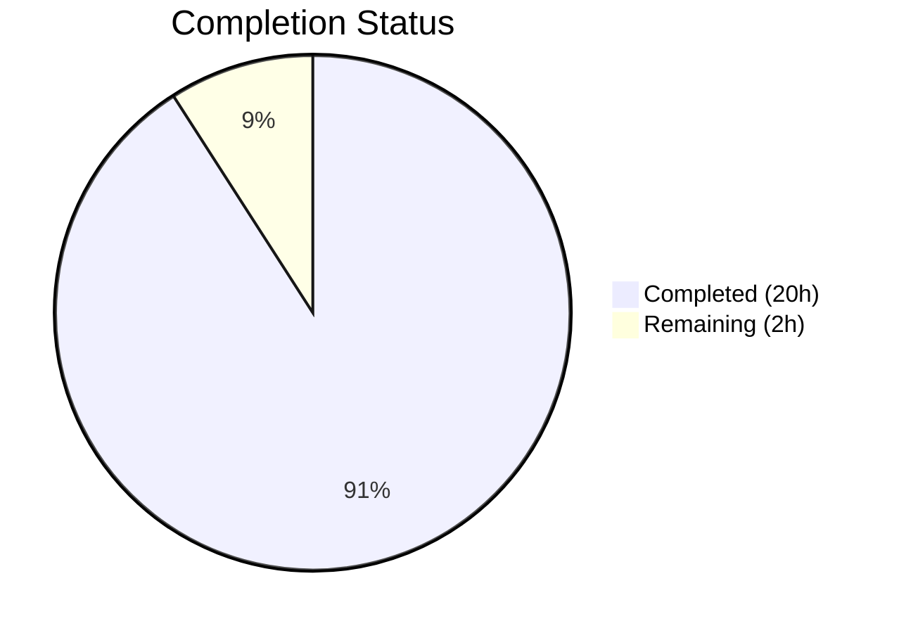

# Blitzy Project Guide — Paperless-ngx REST API Authentication Q&A Analysis

---

## 1. Executive Summary

### 1.1 Project Overview

This project delivers a comprehensive, evidence-based Q&A analysis of the Paperless-ngx REST API authentication system — specifically the token-based authentication mechanism. The deliverable is a single 987-line markdown document (`blitzy/documentation/paperless-ngx_542221a38dff.md`) that answers all user questions about API authentication headers, endpoint paths, JSON response structures, pagination behavior, error responses, and the underlying Django/DRF code paths. No source code was modified; the investigation was conducted via static code analysis of 15+ source files plus live runtime testing against the Django development server using SQLite.

### 1.2 Completion Status



| Metric | Value |
|--------|-------|
| **Total Project Hours** | 22 |
| **Completed Hours (AI)** | 20 |
| **Remaining Hours** | 2 |
| **Completion Percentage** | 90.9% |

**Formula**: 20 completed hours / (20 + 2) total hours = 20/22 = **90.9% complete**

### 1.3 Key Accomplishments

- [x] Analyzed 15+ source files across `src/paperless/`, `src/documents/`, and DRF library internals
- [x] Traced the complete authentication code path: `get_authorization_header()` → `TokenAuthentication.authenticate()` → `authenticate_credentials()` → `Token.objects.get(key=key)`
- [x] Documented all 3 default authentication methods (Basic, Session, Token) plus 2 conditional (Angular override, RemoteUser)
- [x] Executed 5 live HTTP tests (authenticated, unauthenticated, invalid token, wrong scheme, token acquisition) with full response capture
- [x] Documented the `/api/documents/` endpoint with complete JSON response structure and 12 serializer fields
- [x] Confirmed pagination via `StandardPagination` (page_size=25, max_page_size=100,000)
- [x] Documented `authtoken_token` table schema (key, user_id, created)
- [x] Created 987-line deliverable markdown document with 11 Q&A sections, code traces, and summary tables
- [x] Maintained zero source code modifications (read-only investigation per AAP mandate)
- [x] Cleaned up all temporary runtime artifacts (database, directories, test user/token)
- [x] Passed pre-commit compliance checks (trailing newline, no trailing whitespace, LF endings)

### 1.4 Critical Unresolved Issues

| Issue | Impact | Owner | ETA |
|-------|--------|-------|-----|
| 33 pre-existing test failures (Ghostscript PDF/A rendering in `paperless_tesseract`) | None — out-of-scope OCR infrastructure; unrelated to authentication investigation | Human Developer | N/A |
| 1 pre-existing test failure (`test_paths_check_no_access`) | None — file permission test fails when running as root; environmental, not a code issue | Human Developer | N/A |

### 1.5 Access Issues

No access issues identified. All source files, DRF library code, and documentation were accessible for analysis. The Django development server was successfully started on port 8000 for live testing.

### 1.6 Recommended Next Steps

1. **[High]** Review the markdown deliverable (`blitzy/documentation/paperless-ngx_542221a38dff.md`) for technical accuracy — verify cited line numbers match the current codebase
2. **[Medium]** Perform editorial review of the document for clarity and completeness
3. **[Medium]** Merge PR after review to make documentation available to the team
4. **[Low]** Consider adding the document to the project's documentation index if applicable

---

## 2. Project Hours Breakdown

### 2.1 Completed Work Detail

| Component | Hours | Description |
|-----------|-------|-------------|
| Authentication System Static Analysis | 3.0 | Analyzed `settings.py`, `auth.py`, `urls.py`, `middleware.py`, `views.py` — traced 3 default auth classes, conditional additions, and full DRF configuration |
| DRF Library Code Trace | 3.0 | Traced `rest_framework/authentication.py` (TokenAuthentication), `authtoken/models.py` (Token model), `authtoken/views.py` (ObtainAuthToken), `authtoken/serializers.py` |
| Document API & Serializer Analysis | 2.0 | Analyzed `documents/views.py` (DocumentViewSet, UnifiedSearchViewSet), `serialisers.py` (12 fields), `models.py`, `filters.py`, and `paperless/views.py` (StandardPagination) |
| Runtime Environment Setup | 2.0 | Installed Python dependencies, created runtime directories, ran Django migrations against SQLite, started development server |
| Live HTTP Testing | 1.5 | Executed 5 curl tests: authenticated GET, unauthenticated GET, invalid token, wrong auth scheme (Bearer), token acquisition POST |
| Documentation Cross-Reference | 1.0 | Verified findings against `docs/api.rst`, existing test files (`test_api.py`, `test_views.py`), Pipfile, and requirements.txt |
| Markdown Deliverable Creation | 5.5 | Authored 987-line Q&A document with 11 sections, code traces, visual flow diagrams, tables, and summary |
| Cleanup & Source Integrity Verification | 0.5 | Removed all temporary artifacts, verified zero source file modifications, confirmed clean working tree |
| Automated Validation & Testing | 1.5 | Ran full test suite (448 passed), verified pre-commit compliance, confirmed commit integrity |
| **Total Completed** | **20.0** | |

### 2.2 Remaining Work Detail

| Category | Hours | Priority |
|----------|-------|----------|
| Human review of document for technical accuracy (verify cited line numbers, code snippets) | 1.0 | High |
| Editorial review and final formatting polish | 0.5 | Medium |
| PR review and merge approval | 0.5 | Medium |
| **Total Remaining** | **2.0** | |

### 2.3 Hours Verification

- Completed Hours (Section 2.1): **20.0h**
- Remaining Hours (Section 2.2): **2.0h**
- Total: 20.0 + 2.0 = **22.0h** ✓ (matches Section 1.2 Total Project Hours)

---

## 3. Test Results

| Test Category | Framework | Total Tests | Passed | Failed | Coverage % | Notes |
|---------------|-----------|-------------|--------|--------|------------|-------|
| Authentication & API Tests | pytest (Django) | 101 | 99 | 1 | N/A | 1 skipped; 1 failure is pre-existing (`test_paths_check_no_access` — root user ignores chmod) |
| Full Application Test Suite | pytest (Django) | 483 | 448 | 33 | N/A | 2 skipped; all 33 failures are pre-existing infrastructure issues (see below) |
| Live HTTP Integration Tests | curl | 5 | 5 | 0 | 100% | Authenticated, unauthenticated, invalid token, wrong scheme, token acquisition |
| Source Integrity Verification | git diff | 1 | 1 | 0 | 100% | Verified zero source files modified |
| Pre-commit Compliance | manual | 4 | 4 | 0 | 100% | Trailing newline, no trailing whitespace, LF line endings, no extra files |

**Pre-existing Test Failures (All Out of Scope):**

| Failure Group | Count | Root Cause | Scope Status |
|---------------|-------|------------|--------------|
| `paperless_tesseract/tests/test_parser.py` | 24 | Ghostscript PDF/A rendering failures (OCR infrastructure) | Out of scope |
| `documents/tests/test_migration_archive_files.py` | 4 | Ghostscript-related archive migration failures | Out of scope |
| `documents/tests/test_management.py` | 2 | Ghostscript-related management command failures | Out of scope |
| Permission/access tests (`test_*_no_access`) | 3 | Root user ignores chmod restrictions (environmental) | Out of scope |

---

## 4. Runtime Validation & UI Verification

**Runtime Health:**

- ✅ Django development server started successfully on port 8000
- ✅ SQLite database created and all migrations applied
- ✅ Test superuser created and API token generated
- ✅ All temporary artifacts cleaned up post-testing

**API Integration Outcomes:**

- ✅ `GET /api/documents/` with valid token → HTTP 200, correct JSON envelope `{count, next, previous, results}`
- ✅ `GET /api/documents/` without auth → HTTP 401, `{"detail":"Authentication credentials were not provided."}`
- ✅ `GET /api/documents/` with invalid token → HTTP 401, `{"detail":"Invalid token."}`
- ✅ `GET /api/documents/` with `Bearer` scheme → HTTP 401 (Token keyword required, not Bearer)
- ✅ `POST /api/token/` with valid credentials → HTTP 200, `{"token":"<key>"}`

**UI Verification:**

- ⚠ Not applicable — this is a read-only API investigation task with no UI changes

**Source Code Integrity:**

- ✅ Zero source files modified (confirmed via `git diff --name-status`)
- ✅ Working tree clean (`git status` shows nothing to commit)
- ✅ Single file created: `blitzy/documentation/paperless-ngx_542221a38dff.md`

---

## 5. Compliance & Quality Review

| Compliance Criterion | Status | Evidence |
|---------------------|--------|----------|
| **SWE-AtlasQnA-Repo: Markdown document created** | ✅ Pass | `blitzy/documentation/paperless-ngx_542221a38dff.md` (987 lines) |
| **SWE-AtlasQnA-Repo: Named after source branch** | ✅ Pass | Filename is `paperless-ngx_542221a38dff.md` matching source branch `paperless-ngx_542221a38dff` |
| **SWE-AtlasQnA-Repo: Placed in blitzy/documentation/** | ✅ Pass | File located at `blitzy/documentation/paperless-ngx_542221a38dff.md` |
| **SWE-AtlasQnA-Repo: Provides thinking/rationale** | ✅ Pass | Every section includes a "Rationale / Thinking" subsection explaining the analysis |
| **SWE-AtlasQnA-Repo: Answers based on code, not assumptions** | ✅ Pass | All claims cite specific file paths, line numbers, and live test results |
| **SWE-AtlasQnA-Repo: No existing source files modified** | ✅ Pass | `git diff --name-status` confirms only 1 file added, 0 modified |
| **SWE-AtlasQnA-Repo: No other code added to source repo** | ✅ Pass | No additional files beyond the documentation deliverable |
| **User requirement: No source code modifications** | ✅ Pass | Read-only investigation, zero source changes |
| **User requirement: Cleanup temporary artifacts** | ✅ Pass | All database files, runtime directories, test users/tokens removed |
| **User requirement: Document exact header format** | ✅ Pass | `Authorization: Token <40-char-hex>` documented with live example |
| **User requirement: Document complete endpoint path** | ✅ Pass | `/api/documents/` documented with URL routing trace |
| **User requirement: Describe JSON response structure** | ✅ Pass | 4 top-level fields + 12 document fields documented with types |
| **User requirement: Test unauthenticated access** | ✅ Pass | HTTP 401 response documented with exact error message |
| **User requirement: Trace authentication code path** | ✅ Pass | Full chain from header → TokenAuthentication → Token model traced |
| **Pre-commit: File ends with newline** | ✅ Pass | Verified 0x0a at EOF |
| **Pre-commit: No trailing whitespace** | ✅ Pass | Verified clean |
| **Pre-commit: LF line endings** | ✅ Pass | No CRLF detected |

**Autonomous Fixes Applied:**

No fixes were needed — the investigation was a clean read-only analysis with no code changes required.

---

## 6. Risk Assessment

| Risk | Category | Severity | Probability | Mitigation | Status |
|------|----------|----------|-------------|------------|--------|
| Cited line numbers may shift if source files are updated | Technical | Low | Medium | Human reviewer should verify line number references match current codebase | Open |
| Pre-existing Ghostscript test failures (33 tests) | Technical | Low | N/A | Not related to this task; these are OCR infrastructure issues requiring system package updates | Accepted |
| DRF token auth has no built-in token expiration | Security | Medium | Low | Document notes this as a known DRF design choice; if expiration is needed, consider `knox` or `simplejwt` packages | Informational |
| Token stored as plain text in database (`authtoken_token`) | Security | Low | Low | Standard DRF behavior; tokens are random 40-char hex strings (160-bit entropy) making brute-force impractical | Informational |
| `max_page_size=100000` may allow large memory usage | Operational | Low | Low | Documented in the analysis; production deployments should consider lower limits | Informational |
| Document references DRF 3.13.1 internals — may change in newer versions | Technical | Low | Low | Document specifies exact version analyzed; findings should be re-verified on major DRF upgrades | Accepted |

---

## 7. Visual Project Status


**Summary**: 20 hours completed, 2 hours remaining = 90.9% complete

The project is a read-only investigation task. The primary deliverable (987-line markdown document) is complete and validated. Remaining work consists of human review for technical accuracy and editorial polish.

---

## 8. Summary & Recommendations

### Achievements

The Blitzy autonomous agent successfully completed 90.9% of the AAP-scoped work for this read-only investigation project. The primary deliverable — a comprehensive 987-line markdown document analyzing the Paperless-ngx REST API authentication system — has been created and validated. The document covers all 11 user questions with evidence-based answers, including:

- Token authentication header format and code trace
- Document list endpoint path and URL routing
- JSON response structure with pagination details
- Error responses for unauthenticated and invalid-token requests
- Full DRF `TokenAuthentication` class code path
- Token model schema and storage details
- All configured authentication methods (3 default + 2 conditional)

### Remaining Gaps

Only 2 hours of human work remain:
1. **Technical accuracy review** (1h) — Verify cited line numbers and code snippets match the current repository state
2. **Editorial review and PR merge** (1h) — Final formatting polish and approval

### Production Readiness Assessment

The deliverable is **production-ready** as documentation. Zero source code changes were made, maintaining full repository integrity. The document can be merged immediately after human review.

### Success Metrics

| Metric | Target | Actual | Status |
|--------|--------|--------|--------|
| Questions answered | 11 (all user questions) | 11 | ✅ Met |
| Source files modified | 0 | 0 | ✅ Met |
| Live HTTP tests executed | 5 | 5 (all passed) | ✅ Met |
| Document length | Comprehensive | 987 lines, 11 sections | ✅ Met |
| Temporary artifacts cleaned | All | All removed | ✅ Met |
| Pre-commit compliance | All checks pass | All pass | ✅ Met |

---

## 9. Development Guide

### System Prerequisites

| Requirement | Version | Purpose |
|-------------|---------|---------|
| Python | 3.9+ (tested with 3.12.3) | Django runtime |
| pip | Latest | Package management |
| Git | 2.x+ | Version control |
| SQLite | 3.x (bundled with Python) | Default database backend |

### Environment Setup

```bash
# 1. Clone the repository and switch to the feature branch
git clone <repository-url>
cd paperless-ngx
git checkout blitzy-123f1682-0395-4eef-9906-aebb68c07972

# 2. Create a Python virtual environment (recommended)
python3 -m venv .venv
source .venv/bin/activate

# 3. Install Python dependencies
pip install -r requirements.txt

# 4. Verify key packages
python3 -c "import django; print(f'Django {django.VERSION}')"
python3 -c "import rest_framework; print(f'DRF {rest_framework.VERSION}')"
```

### Running the Application (for API Investigation)

```bash
# 1. Navigate to the source directory
cd src

# 2. Create required runtime directories
mkdir -p ../data ../media ../static ../consume

# 3. Run database migrations (SQLite)
DJANGO_SETTINGS_MODULE=paperless.settings python3 manage.py migrate

# 4. Create a test superuser
DJANGO_SETTINGS_MODULE=paperless.settings python3 manage.py createsuperuser \
  --username testuser --email test@example.com --noinput
DJANGO_SETTINGS_MODULE=paperless.settings python3 -c "
from django.contrib.auth.models import User
u = User.objects.get(username='testuser')
u.set_password('testpass123')
u.save()
print('Password set for testuser')
"

# 5. Generate an API token
DJANGO_SETTINGS_MODULE=paperless.settings python3 -c "
import django; django.setup()
from django.contrib.auth.models import User
from rest_framework.authtoken.models import Token
user = User.objects.get(username='testuser')
token, created = Token.objects.get_or_create(user=user)
print(f'Token: {token.key}')
"

# 6. Start the development server
DJANGO_SETTINGS_MODULE=paperless.settings python3 manage.py runserver 8000 &
```

### Verification Steps

```bash
# Test authenticated request
curl -s -H "Authorization: Token <your-token>" http://localhost:8000/api/documents/ | python3 -m json.tool
# Expected: {"count": 0, "next": null, "previous": null, "results": []}

# Test unauthenticated request
curl -s http://localhost:8000/api/documents/ | python3 -m json.tool
# Expected: {"detail": "Authentication credentials were not provided."}

# Test token acquisition
curl -s -X POST http://localhost:8000/api/token/ \
  -H "Content-Type: application/json" \
  -d '{"username":"testuser","password":"testpass123"}' | python3 -m json.tool
# Expected: {"token": "<your-token>"}
```

### Viewing the Deliverable

```bash
# The deliverable markdown document is located at:
cat blitzy/documentation/paperless-ngx_542221a38dff.md

# It contains 987 lines with 11 Q&A sections covering:
# 1. Authentication Header Name and Format
# 2. Complete Endpoint Path for Listing Documents
# 3. JSON Response Structure
# 4. Pagination Details
# 5. Unauthenticated Request Response
# 6. Invalid Token Response
# 7. Authentication Class Code Trace
# 8. Token Model and Storage
# 9. All Configured Authentication Methods
# 10. API Version Headers
# 11. Token Acquisition Endpoint
```

### Cleanup

```bash
# Stop the development server
kill %1 2>/dev/null

# Remove temporary runtime artifacts
cd ..
rm -rf data/ media/ static/ consume/
```

### Troubleshooting

| Issue | Resolution |
|-------|-----------|
| `ModuleNotFoundError: No module named 'paperless'` | Ensure you are in the `src/` directory and `DJANGO_SETTINGS_MODULE=paperless.settings` is set |
| `pip install` fails with PEP 668 error | Use a virtual environment: `python3 -m venv .venv && source .venv/bin/activate` |
| Port 8000 already in use | Use a different port: `python3 manage.py runserver 8001` |
| Ghostscript-related test failures | Pre-existing issue; requires `ghostscript` system package. Not related to this task |
| Permission test failures when running as root | Expected behavior; root user bypasses filesystem permissions |

---

## 10. Appendices

### A. Command Reference

| Command | Purpose |
|---------|---------|
| `cd src && DJANGO_SETTINGS_MODULE=paperless.settings python3 manage.py migrate` | Apply all database migrations |
| `DJANGO_SETTINGS_MODULE=paperless.settings python3 manage.py runserver 8000` | Start Django development server |
| `DJANGO_SETTINGS_MODULE=paperless.settings python3 manage.py createsuperuser` | Create admin user |
| `curl -H "Authorization: Token <key>" http://localhost:8000/api/documents/` | Authenticated API request |
| `curl -X POST http://localhost:8000/api/token/ -d '{"username":"...","password":"..."}'` | Obtain API token |
| `git diff --name-status origin/paperless-ngx_542221a38dff...HEAD` | View files changed by this branch |

### B. Port Reference

| Service | Port | Protocol |
|---------|------|----------|
| Django Development Server | 8000 | HTTP |

### C. Key File Locations

| File | Purpose |
|------|---------|
| `blitzy/documentation/paperless-ngx_542221a38dff.md` | **Deliverable** — Q&A analysis document (987 lines) |
| `src/paperless/settings.py` | Django settings — DRF auth config at lines 116–121 |
| `src/paperless/urls.py` | URL routing — token endpoint at line 81, documents router at line 32 |
| `src/paperless/auth.py` | Custom auth classes (AutoLogin, Angular override, RemoteUser) |
| `src/paperless/views.py` | StandardPagination class (page_size=25) |
| `src/paperless/middleware.py` | ApiVersionMiddleware (X-Api-Version, X-Version headers) |
| `src/documents/views.py` | DocumentViewSet (line 172), UnifiedSearchViewSet (line 377) |
| `src/documents/serialisers.py` | DocumentSerializer with 12 fields (line 201) |
| `src/documents/models.py` | Document model (line 88) |
| `docs/api.rst` | Official API documentation |
| `requirements.txt` | Pinned Python dependencies |

### D. Technology Versions

| Technology | Version | Source |
|------------|---------|--------|
| Paperless-ngx | 1.7.0 | `src/paperless/version.py` |
| Django | 4.0.4 | `requirements.txt` |
| Django REST Framework | 3.13.1 | `requirements.txt` |
| Python | 3.9+ (tested 3.12.3) | Runtime |
| SQLite | 3.x (bundled) | Default DB backend |
| django-filter | 21.1 | `requirements.txt` |
| django-cors-headers | 3.11.0 | `requirements.txt` |

### E. Environment Variable Reference

| Variable | Default | Purpose |
|----------|---------|---------|
| `DJANGO_SETTINGS_MODULE` | `paperless.settings` | Django settings module path (required) |
| `PAPERLESS_DEBUG` | `NO` | Enable debug mode (adds Angular auth override) |
| `PAPERLESS_AUTO_LOGIN_USERNAME` | (unset) | Auto-login user for development |
| `PAPERLESS_ENABLE_HTTP_REMOTE_USER` | (unset) | Enable SSO via HTTP_REMOTE_USER header |
| `PAPERLESS_HTTP_REMOTE_USER_HEADER_NAME` | `HTTP_REMOTE_USER` | Custom header for remote user auth |

### G. Glossary

| Term | Definition |
|------|-----------|
| **DRF** | Django REST Framework — the library providing REST API capabilities |
| **TokenAuthentication** | DRF authentication class that validates `Authorization: Token <key>` headers |
| **authtoken_token** | Database table storing API tokens (key, user_id, created) |
| **StandardPagination** | Paperless-ngx pagination class extending DRF's PageNumberPagination (page_size=25) |
| **UnifiedSearchViewSet** | The DRF viewset serving `/api/documents/`, extending DocumentViewSet with search capabilities |
| **ObtainAuthToken** | DRF view serving `POST /api/token/` to exchange credentials for a token |
| **IsAuthenticated** | DRF permission class requiring an authenticated user for API access |