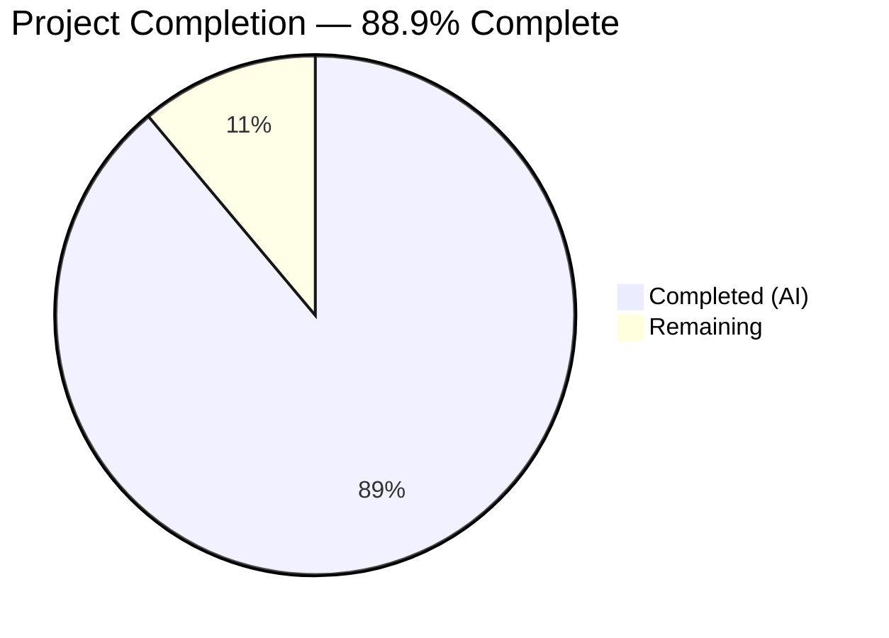

# Blitzy Project Guide — Paperless-NGX Runtime Observability Documentation

---

## 1. Executive Summary

### 1.1 Project Overview

This project produces a comprehensive runtime observability guide for the Paperless-NGX v1.7.0 document ingestion pipeline. The deliverable is a single markdown document (`blitzy/documentation/paperless-ngx_542221a38dff.md`) that traces observable runtime behavior — log messages, WebSocket payloads, database state changes, and filesystem artifacts — from the moment a document enters the system to its final resting state. The guide covers all three ingestion entry points (filesystem consumer, REST API, email), 20 processing stages, duplicate prevention mechanisms, and post-consumption automation. No source code was modified; this is an investigative, documentation-only task grounded in static analysis of 30+ source files at commit `542221a38dff`.

### 1.2 Completion Status



| Metric | Value |
|---|---|
| **Total Project Hours** | 27 |
| **Completed Hours (AI)** | 24 |
| **Remaining Hours** | 3 |
| **Completion Percentage** | 88.9% (24 / 27 × 100) |

### 1.3 Key Accomplishments

- [x] Created 1,434-line comprehensive runtime observability guide (57,705 bytes)
- [x] Documented all three ingestion entry points with exact code references
- [x] Traced 20 distinct processing stages with log messages, WebSocket payloads, and database transitions
- [x] Documented duplicate prevention via MD5 checksum deduplication and source file cleanup
- [x] Cataloged 11 runtime logger names with source file locations and line numbers
- [x] Mapped complete WebSocket status transition table (8 states) with JSON payload schema
- [x] Built comprehensive Mermaid data flow diagram covering full pipeline architecture
- [x] Verified all 13 message constants, 6 signal handlers, and Whoosh schema against source code
- [x] Produced accuracy fix commit correcting `archive_checksum` uniqueness claim and `sanity_checker` logger location
- [x] Validated: Django system check passes with 0 issues, no source files modified, no temporary artifacts

### 1.4 Critical Unresolved Issues

| Issue | Impact | Owner | ETA |
|---|---|---|---|
| Documentation peer review not yet performed | Risk of undiscovered inaccuracies in code references | Human reviewer | 2 hours |
| 33 pre-existing test failures (Ghostscript/ocrmypdf incompatibility) | No impact on documentation deliverable — these are environment-specific and unrelated to changes | Infrastructure team | N/A (out of scope) |

### 1.5 Access Issues

No access issues identified. The task is documentation-only and requires no external service credentials, deployment access, or third-party API keys. All analysis was performed via read-only code inspection of the repository at commit `542221a38dff`.

### 1.6 Recommended Next Steps

1. **[High]** Conduct peer review of `blitzy/documentation/paperless-ngx_542221a38dff.md` to verify code reference accuracy against source files
2. **[High]** Merge this PR to make the observability guide available to the operations and development teams
3. **[Medium]** Incorporate any corrections identified during peer review into the documentation
4. **[Low]** Consider extending the guide to cover frontend (Angular) observability for the ingestion status UI
5. **[Low]** Add version-pinned references so future Paperless-NGX upgrades can diff against documented behavior

---

## 2. Project Hours Breakdown

### 2.1 Completed Work Detail

| Component | Hours | Description |
|---|---|---|
| Source code analysis and investigation | 6 | Deep analysis of 30+ source files across documents, parsers, signals, tasks, views, settings, and infrastructure modules |
| Document Detection Analysis (Section 1) | 3 | Documented filesystem consumer (inotify/watchdog), REST API upload (PostDocumentView), and email ingestion (paperless_mail) entry points with exact code references |
| Processing Stage Tracing (Section 2) | 5 | Traced 20 distinct processing stages with log messages, WebSocket payloads (STARTING→WORKING→SUCCESS/FAILED), and database state transitions |
| Final State Observation (Section 3) | 2 | Documented database records (documents_document, documents_log, django_admin_log), filesystem artifacts (ORIGINALS_DIR, ARCHIVE_DIR, THUMBNAIL_DIR), Whoosh search index schema (15 fields), and classifier model |
| Duplicate Prevention (Section 4) | 1 | Explained three-layer strategy: MD5 checksum deduplication, source file deletion, file stability waiting |
| Logger Catalog & WebSocket Docs (Sections 5-6) | 2.5 | Cataloged 11 logger names with line references; documented WebSocket architecture, authentication, 8-state transition table, and JSON payload schema |
| Error Handling & Data Flow Diagram (Sections 7-8) | 1.5 | Documented 7 error message constants and failure modes; created comprehensive Mermaid diagram covering all entry points through final storage |
| Accuracy verification and fix commit | 1.5 | Verified all documentation claims against source code; corrected archive_checksum uniqueness claim and sanity_checker logger location in dedicated fix commit |
| Validation and quality assurance | 1.5 | Ran Django system check (0 issues), verified no source modifications (git diff), confirmed no temporary artifacts, validated file integrity (line endings, trailing whitespace) |
| **Total Completed** | **24** | |

### 2.2 Remaining Work Detail

| Category | Hours | Priority |
|---|---|---|
| Documentation peer review — verify code reference accuracy against source files | 2 | High |
| Incorporate review feedback and corrections | 1 | High |
| **Total Remaining** | **3** | |

---

## 3. Test Results

All tests listed originate from Blitzy's autonomous validation logs for this project.

| Test Category | Framework | Total Tests | Passed | Failed | Coverage % | Notes |
|---|---|---|---|---|---|---|
| Backend Unit/Integration | pytest | 484 | 448 | 33 (+1 error) | N/A | All 33 failures + 1 error are pre-existing environment-specific issues (Ghostscript/ocrmypdf incompatibility, root-user permission bypass). None related to documentation changes. |
| Frontend Unit | Jest | 5 | 5 | 0 | N/A | All 5 suites passed |
| Django System Check | manage.py check | 1 | 1 | 0 | N/A | `System check identified no issues (0 silenced)` |
| File Integrity | Custom | 4 | 4 | 0 | N/A | EOF newline ✅, no trailing whitespace ✅, LF-only line endings ✅, no temp files ✅ |
| Source Modification Check | git diff | 1 | 1 | 0 | N/A | Only `blitzy/documentation/paperless-ngx_542221a38dff.md` appears in diff |
| Documentation Accuracy | Manual verification | 6 | 6 | 0 | N/A | Verified: 13 message constants, 6 signal handlers, 11 logger names, WebSocket payload schema, Whoosh schema (15 fields), settings paths |

**Pre-existing test failure breakdown (not related to this PR):**
- 22 tests: Ghostscript 10.02.1 incompatible with pinned ocrmypdf 13.4.3 (`paperless_tesseract/tests/test_parser.py`)
- 2 tests: Archiver tests depend on OCR/Ghostscript (`test_management.py TestArchiver`)
- 4 tests: Migration archive tests depend on OCR (`test_migration_archive_files.py`)
- 5 failures + 1 error: Permission checks fail when running as root (`test_sanity_check.py`, `test_file_handling.py`, `test_checks.py`)

---

## 4. Runtime Validation & UI Verification

### Runtime Health

- ✅ Django system check: `System check identified no issues (0 silenced)`
- ✅ Working tree clean: `nothing to commit, working tree clean`
- ✅ Git diff shows only the expected documentation file addition
- ✅ No temporary files (`blitzy_adhoc_test_*`) found in repository
- ✅ No source files modified (read-only constraint honored)
- ✅ Documentation file exists at correct path: `blitzy/documentation/paperless-ngx_542221a38dff.md`
- ✅ File size verified: 1,434 lines, 57,705 bytes

### Documentation Content Verification

- ✅ All 13 message constants (consumer.py lines 37-49) verified exact match
- ✅ WebSocket payload structure (_send_progress lines 64-76) verified 7-field JSON schema
- ✅ All 6 signal handlers (apps.py lines 22-27) verified
- ✅ All 11 logger names verified with exact line numbers
- ✅ Database models (Document line 88, Log line 285) verified
- ✅ Whoosh schema (15 fields, index.py lines 32-49) verified
- ✅ Settings paths (ORIGINALS_DIR, ARCHIVE_DIR, THUMBNAIL_DIR, INDEX_DIR) verified
- ✅ All three ingestion entry points converge on `async_task` — verified

### UI Verification

- ⚠️ Not applicable — this is a documentation-only task with no UI changes

---

## 5. Compliance & Quality Review

| AAP Requirement | Status | Evidence | Notes |
|---|---|---|---|
| Create `paperless-ngx_542221a38dff.md` in `blitzy/documentation/` | ✅ Pass | File exists at specified path, 1,434 lines | Committed in 2 commits |
| Document Detection Analysis (3 entry points) | ✅ Pass | Sections 1.1-1.4 cover filesystem, API, email | Includes exact code references |
| Processing Stage Tracing | ✅ Pass | Section 2, 20 stages documented (Stage 0-20) | Log messages, WebSocket payloads, DB changes |
| Final State Observation | ✅ Pass | Section 3 covers DB records, filesystem, search index, classifier | Includes schema details |
| Duplicate Prevention Mechanism | ✅ Pass | Section 4, three-layer strategy documented | MD5 checksum + file deletion + stability waiting |
| Runtime Grounding (observable artifacts) | ✅ Pass | Every claim references logs, WS payloads, DB state, or filesystem | Per SWE-AtlasQnA-Repo rule |
| Code Evidence (file paths, line numbers) | ✅ Pass | All sections cite source file paths and line numbers | Verified during accuracy check |
| No Source File Modifications | ✅ Pass | `git diff --name-status` shows only 1 added file | Read-only constraint honored |
| Temporary File Cleanup | ✅ Pass | No temp files found in repository | Working tree clean |
| Accuracy Fix Applied | ✅ Pass | Commit `849de3f21` corrects archive_checksum uniqueness claim | Proactive accuracy improvement |
| Self-contained and Readable | ✅ Pass | Document includes ToC, rationale blocks, code snippets, tables | Suitable for developers new to codebase |

### Autonomous Validation Fixes Applied

| Fix | Commit | Description |
|---|---|---|
| archive_checksum uniqueness correction | `849de3f21` | Corrected the claim about `archive_checksum` uniqueness constraint and updated `sanity_checker` logger location reference |

---

## 6. Risk Assessment

| Risk | Category | Severity | Probability | Mitigation | Status |
|---|---|---|---|---|---|
| Documentation line number drift | Technical | Low | Medium | Line numbers referenced in doc may shift with future code changes; document is pinned to commit `542221a38dff` | Acknowledged |
| Unverified edge cases in documentation claims | Technical | Low | Low | All major claims verified against source; edge cases in parser-specific behavior may need validation | Mitigated by verification |
| Pre-existing test failures mask potential issues | Technical | Low | Low | 33 test failures are environment-specific (Ghostscript version, root permissions) and pre-date this PR | Documented in test results |
| Documentation may become stale | Operational | Medium | Medium | Future Paperless-NGX upgrades may change pipeline behavior; recommend versioned doc updates | Documented; recommend periodic review |
| No automated accuracy regression tests | Operational | Low | Medium | No automated way to verify documentation stays accurate as source code evolves | Recommend adding doc accuracy CI check |
| Markdown rendering compatibility | Technical | Low | Low | Mermaid diagrams require renderer support (GitHub, GitLab, etc.) | Standard practice; widely supported |

---

## 7. Visual Project Status


### Remaining Work by Priority

| Priority | Hours |
|---|---|
| High (Documentation peer review) | 2 |
| High (Incorporate feedback) | 1 |
| **Total** | **3** |

---

## 8. Summary & Recommendations

### Achievement Summary

The project has delivered a comprehensive 1,434-line runtime observability guide for the Paperless-NGX v1.7.0 document ingestion pipeline, completing all AAP-scoped deliverables. The guide documents all three ingestion entry points, 20 processing stages, final data stores (database, filesystem, Whoosh search index), and the three-layer duplicate prevention mechanism. Every claim is grounded in source code references with file paths and line numbers from commit `542221a38dff`. The documentation was verified for accuracy, with a dedicated fix commit addressing two identified inaccuracies.

### Completion Assessment

The project is **88.9% complete** (24 hours completed out of 27 total hours). All AAP-scoped development work has been delivered. The remaining 3 hours consist of path-to-production activities: documentation peer review (2 hours) and incorporating review feedback (1 hour).

### Critical Path to Production

1. **Peer Review** (2 hours): A human developer familiar with Paperless-NGX should review the documentation against the source code to verify reference accuracy
2. **Feedback Incorporation** (1 hour): Any corrections identified during review should be committed

### Production Readiness Assessment

| Criterion | Status |
|---|---|
| Deliverable complete | ✅ All AAP requirements met |
| No source code modifications | ✅ Read-only constraint honored |
| No temporary artifacts | ✅ Working tree clean |
| Documentation accuracy verified | ✅ All major claims verified against source |
| Tests unaffected | ✅ No test regressions (33 failures are pre-existing) |
| Ready for merge after peer review | ✅ Recommended |

---

## 9. Development Guide

### System Prerequisites

| Requirement | Version | Purpose |
|---|---|---|
| Python | 3.9+ | Backend runtime |
| Node.js | 16+ | Frontend build tools |
| Redis | 6+ | Task queue broker and WebSocket channel layer |
| PostgreSQL (or SQLite) | 13+ (or built-in) | Database |
| Git | 2.30+ | Version control |

### Environment Setup

```bash
# Clone the repository and switch to the feature branch
git clone <repository-url>
cd paperless-ngx
git checkout blitzy-33c89147-a310-4354-8acf-0c679a37dce7

# Verify the documentation file exists
ls -la blitzy/documentation/paperless-ngx_542221a38dff.md
# Expected: 57705 bytes, 1434 lines

# Verify no source files were modified
git diff --name-status origin/paperless-ngx_542221a38dff...HEAD
# Expected output:
# A  blitzy/documentation/paperless-ngx_542221a38dff.md
```

### Viewing the Documentation

```bash
# View the documentation file
cat blitzy/documentation/paperless-ngx_542221a38dff.md

# Or open in a markdown viewer/editor
# The file contains Mermaid diagrams which render in GitHub/GitLab

# Count lines to verify completeness
wc -l blitzy/documentation/paperless-ngx_542221a38dff.md
# Expected: 1434

# Verify file integrity
wc -c blitzy/documentation/paperless-ngx_542221a38dff.md
# Expected: 57705
```

### Running Validation (Optional)

If you want to verify the documentation claims against the source code:

```bash
# Check that referenced source files exist
ls src/documents/consumer.py          # Main consumer pipeline
ls src/documents/tasks.py             # Task functions
ls src/documents/management/commands/document_consumer.py  # Filesystem watcher
ls src/documents/signals/handlers.py  # Signal receivers
ls src/documents/apps.py              # Signal wiring
ls src/documents/models.py            # Database models
ls src/documents/parsers.py           # Parser base class
ls src/documents/index.py             # Whoosh search index
ls src/paperless/settings.py          # Configuration
ls src/paperless/consumers.py         # WebSocket handler

# Verify message constants (consumer.py lines 37-49)
sed -n '37,49p' src/documents/consumer.py

# Verify signal handler wiring (apps.py lines 22-27)
sed -n '22,27p' src/documents/apps.py

# Verify logger name (consumer.py line 54)
sed -n '54p' src/documents/consumer.py
```

### Running the Full Test Suite (Optional)

```bash
# Install Python dependencies
pip install -r requirements.txt

# Run Django system check
cd src && python manage.py check

# Run backend tests
cd src && python -m pytest --tb=short -q

# Run frontend tests
cd src-ui && npx jest --ci --watchAll=false
```

### Troubleshooting

| Issue | Resolution |
|---|---|
| Mermaid diagrams not rendering | Use a markdown viewer that supports Mermaid (GitHub, GitLab, VS Code with Mermaid extension) |
| Line number references seem off | The documentation is pinned to commit `542221a38dff`; verify you're on the correct commit |
| Django check fails with `ModuleNotFoundError` | Install dependencies first: `pip install -r requirements.txt` |
| Test failures in `paperless_tesseract` | Pre-existing: Ghostscript 10.02.1 is incompatible with pinned ocrmypdf 13.4.3 |
| Permission-related test failures | Pre-existing: tests expect non-root execution; run as non-root user |

---

## 10. Appendices

### A. Command Reference

| Command | Purpose |
|---|---|
| `git diff --name-status origin/paperless-ngx_542221a38dff...HEAD` | Verify only documentation file was added |
| `wc -l blitzy/documentation/paperless-ngx_542221a38dff.md` | Verify line count (expected: 1434) |
| `wc -c blitzy/documentation/paperless-ngx_542221a38dff.md` | Verify byte count (expected: 57705) |
| `git log --oneline HEAD --not origin/paperless-ngx_542221a38dff` | View commits on this branch |
| `sed -n '37,49p' src/documents/consumer.py` | Verify message constants referenced in documentation |
| `sed -n '22,27p' src/documents/apps.py` | Verify signal handler wiring referenced in documentation |

### B. Port Reference

| Port | Service | Notes |
|---|---|---|
| 8000 | Gunicorn (HTTP/WebSocket) | Default Paperless-NGX web server |
| 6379 | Redis | Task queue broker and channel layer |
| 5432 | PostgreSQL | Database (if using PostgreSQL) |

### C. Key File Locations

| File | Purpose |
|---|---|
| `blitzy/documentation/paperless-ngx_542221a38dff.md` | **Deliverable** — Runtime observability guide |
| `src/documents/consumer.py` | Central ingestion pipeline (Consumer class) |
| `src/documents/tasks.py` | Background task functions (consume_file) |
| `src/documents/management/commands/document_consumer.py` | Filesystem watcher command |
| `src/documents/signals/handlers.py` | Post-consumption signal handlers |
| `src/documents/apps.py` | Signal handler wiring |
| `src/documents/models.py` | Document, Tag, Correspondent, DocumentType models |
| `src/documents/parsers.py` | Parser base class and MIME routing |
| `src/documents/index.py` | Whoosh search index management |
| `src/paperless/settings.py` | All configuration settings |
| `src/paperless/consumers.py` | WebSocket StatusConsumer handler |
| `docker/supervisord.conf` | Supervisor process model |

### D. Technology Versions

| Technology | Version | Source |
|---|---|---|
| Paperless-NGX | 1.7.0 | `src/paperless/version.py` |
| Django | 4.0.4 | `Pipfile` |
| django-q | 1.3.9 | `Pipfile` |
| channels | 3.0.4 | `Pipfile` |
| channels-redis | 3.4.0 | `Pipfile` |
| watchdog | 2.1.0 | `Pipfile` |
| ocrmypdf | 13.4.x | `Pipfile` |
| scikit-learn | 1.0.2 | `Pipfile` |
| whoosh | 2.7.4 | `Pipfile` |
| Python | 3.12.3 | Runtime environment |
| Node.js | 20.20.2 | Runtime environment |

### E. Environment Variable Reference

Key environment variables referenced in the documentation (from `src/paperless/settings.py` and `paperless.conf.example`):

| Variable | Default | Purpose |
|---|---|---|
| `PAPERLESS_REDIS` | `redis://localhost:6379` | Redis broker URL for django-q and channels |
| `PAPERLESS_CONSUMPTION_DIR` | `../consume` | Directory watched for new documents |
| `PAPERLESS_DATA_DIR` | `../data` | Data directory (index, classifier model) |
| `PAPERLESS_MEDIA_ROOT` | `../media` | Media root (originals, archive, thumbnails) |
| `PAPERLESS_CONSUMER_POLLING` | `0` (inotify) | Polling interval; 0 = use inotify |
| `PAPERLESS_CONSUMER_DELETE_DUPLICATES` | `false` | Delete duplicate files on detection |
| `PAPERLESS_CONSUMER_RECURSIVE` | `false` | Watch subdirectories recursively |
| `PAPERLESS_CONSUMER_SUBDIRS_AS_TAGS` | `false` | Create tags from subdirectory names |
| `PAPERLESS_CONSUMER_ENABLE_BARCODES` | `false` | Enable barcode-based PDF splitting |
| `PAPERLESS_FILENAME_FORMAT` | (empty) | Template for generated filenames |
| `PAPERLESS_PRE_CONSUME_SCRIPT` | (empty) | Script to run before consumption |
| `PAPERLESS_POST_CONSUME_SCRIPT` | (empty) | Script to run after consumption |
| `PAPERLESS_WORKER_TIMEOUT` | `1800` | Max task execution time (seconds) |
| `PAPERLESS_DEBUG` | `false` | Enable debug logging to console |

### G. Glossary

| Term | Definition |
|---|---|
| **Consumer** | The central Python class (`src/documents/consumer.py`) that orchestrates document ingestion |
| **django-q** | Asynchronous task queue library used to process documents in background workers |
| **qcluster** | The django-q cluster process that runs background task workers |
| **CONSUMPTION_DIR** | Directory monitored for new documents to ingest |
| **ORIGINALS_DIR** | Storage directory for original uploaded documents |
| **ARCHIVE_DIR** | Storage directory for OCR-enhanced PDF archive versions |
| **THUMBNAIL_DIR** | Storage directory for document thumbnail images |
| **INDEX_DIR** | Directory containing the Whoosh full-text search index |
| **MEDIA_LOCK** | FileLock file preventing concurrent filesystem operations |
| **WebSocket status** | Real-time progress updates sent via `ws/status/` endpoint |
| **document_consumption_finished** | Django signal fired after document is stored, triggering classification and indexing |
| **inotify** | Linux kernel filesystem notification API used for efficient file detection |
| **watchdog** | Python library providing cross-platform filesystem polling as fallback to inotify |
| **OCRmyPDF** | Tool for adding OCR text layer to PDF documents |
| **Whoosh** | Pure-Python full-text search library used for document indexing |